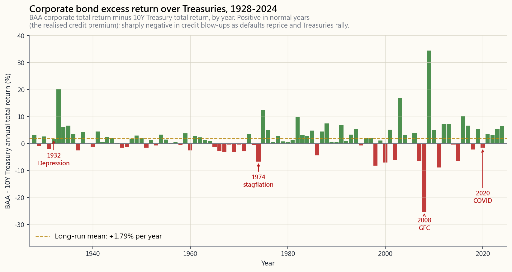
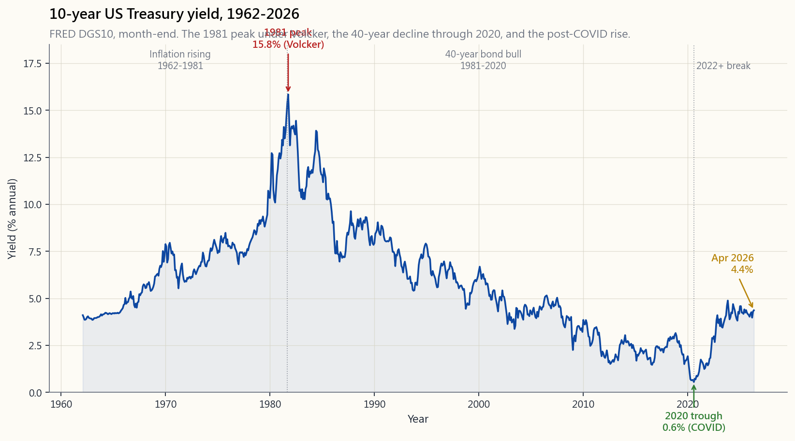
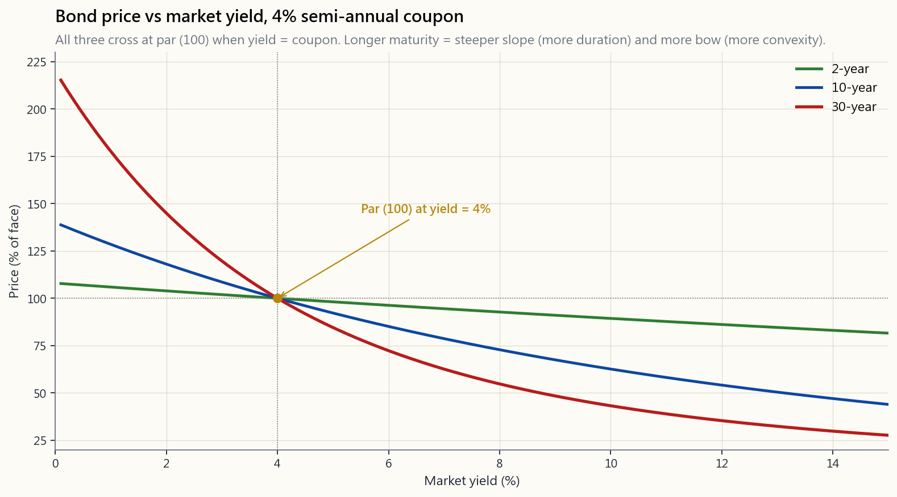

# 第五週：債券——票面利率、價格與殖利率

---

## 第一部分：閱讀章節

---

### 1. 為何這很重要

債券是世界上最簡單的金融工具。你借給某人一筆已知金額，按照已知的時程，收取已知的**利息**（即*票面利率*——這是債券市場的術語，我們在本課剩餘部分都會使用這個詞），對方在已知的日期將本金還給你。四個數字加一個日曆。股票沒有這麼清晰。

然而——這個最簡單的工具，催生了現代金融史上最大的單一數十年趨勢（從1981年到2020年長達四十年的殖利率下行多頭市場），然後在2022年創下美國國庫券有史以來最糟糕的單一年度表現。這兩波行情都已內含在那四個數字的合約之中。第2.2節展示了將合約轉換為價格的那一條方程式；本課其餘內容不過是那條方程式的推論。

*（補充說明：同樣的現值方程式——將未來現金流折現至今日——也是股票、不動產以及所有其他現金流資產的估值方式。這是整門課程中最重要的公式。我們在債券這裡清晰地認識它，因為債券的現金流最為簡潔；我們在第21週將其應用於股票。）*

你需要了解債券，有**五個**理由。

1. **債券設定了所有事物折現率的基礎。** 地球上每一筆現金流——你的房貸（字面意義上就是你發行給銀行的債券）、股票的盈餘流、私募股權的退出、退休金負債——都是以無風險國庫券殖利率曲線**加上資產特定風險溢酬**來折現定價。國庫券曲線是*基礎*；溢酬是市場對特定資產風險所要求的額外報酬。當10年期殖利率從1.5%移動到4.5%，這個基礎就在地球上所有長存續期間資產之下移動，所有資產都將重新定價（上方的利差也可能移動，但基礎的移動才是沒有人能夠躲避的）。不了解折現率在做什麼，就無法理解任何其他資產類別。值得知道的是，債券在歷史上也更為古老：有組織的主權債務市場比有組織的股票市場早了數百年（Sidney Homer的《利率史》追溯了可連續記錄的債券市場至13世紀的威尼斯與熱那亞；阿姆斯特丹股票交易所遲至1602年才成立，而在18、19世紀大部分時間，股票的聲譽*更差*——更像賭博而非投資）。現代人直覺認為「股票是主要資產類別，債券是冷門的附加品」，這是20世紀的產物，並非永恆的真理。
2. **債券本身就是一個資產類別。** 上週的60/40依賴國庫券獲取分散投資的效益。本週我們打開債券的盒子，問：我們實際上持有的是什麼？它如何支付報酬？它的價格如何形成？學完本課之後，60/40中的「40」將不再是一個黑盒子。
3. **債券市場比股票市場更大——而且是機構實際交易的市場。** 全球債券市場未償餘額約為130至140兆美元（國際清算銀行／SIFMA，2024年估計），而全球股票市值約為110兆美元。光是美國國庫券就約達27兆美元。美國國庫券的*每日*交易量約達9,000億美元，而所有美國上市股票合計的每日交易量約為5,000億美元。這對散戶股票投資人有何意義？因為其餘金融體系中幾乎所有形式的槓桿都是*以國庫券作為擔保品*：銀行準備金、附買回交易（讓券商、避險基金和主要交易商維持運作的隔夜融資市場）、期貨交易所保證金、交換交易商擔保品、央行流動性機制。當國庫券波動，每個其他資產之下的*槓桿成本與可用性*也隨之波動。國庫券市場的壓力（例如2020年3月、2019年9月的附買回交易利率飆升）是整個體系的壓力訊號。股票是可見的冰山一角；債券是底層的管線。
4. **債券告訴你市場的預期。** 殖利率曲線、BAA公司債與10年期國庫券之間的信用利差，以及美國抗通膨公債的損益平衡通膨率，是三個分別、每日公開報價的成長、違約風險與通膨預測。債券市場是地球上最便宜的總體經濟情報服務。
5. **1981年至2020年的債券多頭市場，是近兩代人幾乎所有「被動式管理有效」論述的政策背景。** 整整一個世代的投資人從未見過真正的債券空頭市場——而2022年是第一聲警示。這個政策轉變的框架*並非*本課程的原創：Howard Marks在他2022年12月的橡樹資本備忘錄《海變》（以及2023年5月的後續備忘錄）中清晰闡述了這一觀點，他認為1980年以來四十年的利率下行，是幾乎所有資產的一次性順風，我們現在正進入一個高利率政策中不同策略將發揮效用的時代。Ray Dalio的《變化世界秩序的原則》（2021年）提出了更長周期的論點；Lyn Alden的《破碎的貨幣》（2023年）提出了貨幣管線的論點；Stanley Druckenmiller自2022年以來在訪談中持續提出相同觀點的債務與赤字版本。重點是，幾位具有不同視角的嚴肅投資人匯聚於同一判斷：讓買進持有看起來輕而易舉的利率政策已經結束，或至少不再是安全的預設選項。我們將在第4級和第5級課程中反覆回到這個主題。

---

### 2. 你需要知道的事

#### 2.1 債券現金流——四個數字與一個日曆

**本課範疇。** 以下所有內容均關於*普通固定利率債券*——合約在發行時鎖定，永不改變。可贖回債券、浮動利率票據、美國抗通膨公債、不動產抵押貸款證券、可轉換公司債和結構性信用，均會增加額外的變動因素（發行人的選擇權、利率重設票息、與通膨連動的本金、提前還款風險、與股票掛鉤的報酬、分券結構）。我們在第2.5節和Q4中稍觸及抗通膨公債，信用與結構型商品在第31至34週有完整介紹。本週請先鎖定票息加上到期還本的圖像。

一張債券完全由以下條件確定：

- **面值** $F$——到期時返還的金額。在美國市場幾乎總是1,000美元，慣例報價為100。
- **票面利率** $c$——發行時固定的年利率。面值1,000美元的4%票息，每年支付40美元。
- **到期年數** $N$——面值返還的時間。
- **付款頻率** $m$——每年支付幾次票息。美國國庫券和公司債：$m = 2$（半年付）。許多國際債券：$m = 1$（年付）。部分市政債券：$m = 4$。

每次票息為 $C = F \cdot c / m$。因此，面值1,000美元的4%半年付票息，每六個月支付20美元，持續$N$年，到期時再支付1,000美元。

就這樣。這就是合約。其他一切——價格、殖利率、存續期間、凸性——都是*對那四個數字加上折現率所做的數學運算*。

#### 2.2 價格不過是現金流量折現

若你要求這張債券風險對應的年報酬率為 $y$（即**市場殖利率**，或**到期殖利率**），則你今日願意支付的價格，就是每筆現金流的現值：

$$ P = \sum_{t=1}^{m \cdot N} \frac{C}{(1 + y/m)^{t}} + \frac{F}{(1 + y/m)^{m \cdot N}} $$

這個求和有封閉形式：

$$ P = C \cdot \frac{1 - (1 + y/m)^{-mN}}{y/m} + \frac{F}{(1 + y/m)^{mN}} $$

但公式本身不如*形狀*重要：一張債券就是一個票息等比數列加上一筆面值的到期還本。拿掉任何一個部分，就是不同的工具（單獨的等比數列是年金；單獨的到期還本是零息債券）。

三個直接推論：

- 若 $y = c$，則 $P = F$。債券以**平價**交易。
- 若 $y > c$，現金流不足以給買方帶來所需的報酬。價格必須下跌。債券以**折價**交易。
- 若 $y < c$，買方樂意支付超過面值以換取豐厚的票息。債券以**溢價**交易。

本課稍後的互動面板讓你即時滑動 $c$、$y$、$N$ 和 $m$，並觀察 $P$ 的重新計算。花兩分鐘在上面。內化價格—殖利率曲線的形狀，比背誦任何公式都更有價值。

#### 2.3 為何價格與殖利率反向波動

這是債券被問到最多的特性，因此要明確說明。現金流是*在發行時固定的*。票息永遠是 $C$，面值永遠是 $F$。在次級市場中，每天唯一變化的，是市場對那些固定現金流所應用的*折現率*。折現率上升 → 現值降低 → 價格下跌。折現率下降 → 現值升高 → 價格上漲。

這種關係是**單調且凸性的**。單調：殖利率每移動1元，價格總是朝反方向移動。凸性：價格—殖利率曲線向原點彎曲，這意味著**從相同的殖利率水準出發，殖利率下降1%所帶來的價格上漲，*超過*同幅度殖利率上升所造成的價格下跌**。（兩次移動必須從相同殖利率水準出發，且絕對幅度相同；凸性是曲線的*局部*屬性，而非關於任意一對殖利率移動的普遍性主張。）這種不對稱性就是凸性，對長期債券而言相當顯著。在互動面板上觀察：固定 $c$、$N$，將 $y$ 從0%滑動到15%，觀察曲線的彎曲。

#### 2.4 存續期間——「敏感度」指標

30年期債券和2年期債券對殖利率移動1%的反應並不相同。存續期間是殖利率變動1%時價格移動幅度的線性近似值。

**Macaulay存續期間**是現金流的加權平均到期日，其中每個權重是該筆現金流的現值除以價格：

$$ D_{\text{Mac}} = \frac{1}{P} \left[ \sum_{t=1}^{m N} \frac{(t/m) \cdot C}{(1 + y/m)^{t}} + \frac{N \cdot F}{(1 + y/m)^{m N}} \right] $$

**修正存續期間**是價格對殖利率的彈性：

$$ D_{\text{mod}} = \frac{D_{\text{Mac}}}{1 + y/m} \quad \Rightarrow \quad \frac{\Delta P}{P} \approx -D_{\text{mod}} \cdot \Delta y $$

值得記住的經驗法則：

- 2年期國庫券：$D_{\text{mod}} \approx 1.9$。利率上升1% → 價格約跌1.9%。
- 10年期國庫券：$D_{\text{mod}} \approx 8.5$。上升1% → 約跌8.5%。
- 30年期國庫券：$D_{\text{mod}} \approx 19$。上升1% → 約跌19%。

2022年，10年期殖利率從約1.5%升至約3.9%，約上升2.4%。乘以存續期間8.5，得到10年期債券已實現的-18%總報酬——幾乎與上週60/40圖表中歸因於「債券」的虧損完全吻合。存續期間近似值不是一個趣聞；它就是解釋。更深入的數學（凸性調整、關鍵利率存續期間、選擇權調整利差）留待第32週。

#### 2.5 到期殖利率、當期殖利率與票面利率

三個大家常混淆的數字。

- **票面利率**：*合約規定的*利率。在發行時固定。永不改變。用於計算美元票息金額。
- **當期殖利率**：$C \cdot m / P$。僅考慮票息流的報酬，忽略本金的到期回歸平價效應。對以收益為導向的買方有用，但作為報酬指標是**不完整的**。
- **到期殖利率（YTM）**：讓*所有*現金流（票息加面值）的現值等於今日價格的單一折現率 $y$。即債券的內部報酬率。這是你到處看到的報價殖利率。

當債券以平價交易時，三者相等。當以折價交易時，到期殖利率 > 當期殖利率 > 票面利率（你既獲得票息，*又*在到期時獲得資本利得）。當以溢價交易時，到期殖利率 < 當期殖利率 < 票面利率。

永遠以到期殖利率比較債券，而非票面利率。票面利率是合約細節；到期殖利率是你實際賺取的報酬——**前提是**你（a）持有至到期，且（b）以相同殖利率再投資每一筆票息。這兩個條件通常都無法滿足。若你在到期前以不同殖利率出售，你的*已實現*報酬取決於當天的價格水準，而非你買入時的到期殖利率。若再投資利率下降（上升），你的已實現報酬將*低於*（高於）原始到期殖利率。到期殖利率是債券的報價內部報酬率；對於非買進持有的投資人而言，它**不是**保證的已實現報酬。

**繼續之前的直覺確認。** 票息是印在合約上的數字——比如說「每年支付40美元，直到我還給你1,000美元」——它永不改變。*殖利率*是買方今日要求承擔該合約所需的*報酬*。這兩個數字不必相同，因為*價格*在中間移動，使它們相等。若需求旺盛，價格上漲；相同的每年40美元流，現在以更高的購買價格給買方帶來*更低的*百分比報酬；殖利率下降。若需求崩潰，價格下跌；相同的40美元現在給買方帶來*更高的*百分比報酬；殖利率上升。票面利率 = 合約；價格 = 市場；殖利率 = 從兩者得出的百分比報酬。**繼續閱讀前，請打開下方的互動債券計算器**：將票面利率固定在4%，將市場殖利率從2%滑動到8%，觀察價格下跌和到期殖利率攀升。在滑桿上花兩分鐘，勝過重讀本段十遍。這個方程式是本課程其餘所有資產估值的基礎——請勿略過。

#### 2.6 信用評等——以及為何不能盲目信任

在我們了解公司債與國庫券之間的利差之前，你需要知道是什麼讓公司債*風險更高*——以及市場如何發出訊號。

當一家公司（或一個國家，或一個城市）發行債券時，第三方的**信用評等機構**會給它一個字母評級，從「基本上和國庫券一樣安全」到「瀕臨違約」不等。三大評等機構是穆迪、標普和惠譽。它們的評級體系略有不同，但大致對應相同的分類：

| 分類 | 標普／惠譽 | 穆迪 | 白話文 |
|---|---|---|---|
| 投資等級——最高 | AAA | Aaa | 類似國庫券（美國政府評級於2011年前為AAA） |
| 投資等級——高 | AA／A | Aa／A | 強健公司，違約風險低 |
| 投資等級——最低 | BBB+至BBB- | Baa1至Baa3 | 尚可；「BBB」／「BAA」——我們所畫的那條線 |
| **分界線** | --- | --- | 低於此線即非「投資等級」 |
| 投機性／「垃圾」 | BB+至CCC | Ba1至Caa | 高收益；有實質違約風險 |
| 違約／瀕臨違約 | CC、C、D | Ca、C | 重整或已違約 |

你在第2.7節圖表中看到的「BAA」，只是穆迪對最低投資等級的拼法——標普寫作「BBB」的同一位置。它是最完整的百年公司債系列，這就是我們使用它的原因。

**評等體系存在結構性利益衝突。** 評等機構是由債券的*發行人*付費，而非由買方付費。想讓自己的債務看起來更安全的公司，到處尋找評等，給出更高評級的機構就能拿到合約。這在財務上相當於讓學生聘請並支付自己的考官——然後要求考官認證學生有多聰明。這不是思想實驗。歷史紀錄極為殘酷：

- **安隆公司**在申請當時美國最大破產保護的四天前（2001年12月），仍持有*投資等級*評級。
- **雷曼兄弟**在2008年9月倒閉當天早上，仍持有三大機構的A級評等。
- **2008年房市危機**是典型案例：數以萬計的次級不動產抵押貸款證券被蓋上AAA印章——與美國國庫券相同的評級——其中大部分最終損失了60至100%的價值。參議院常設調查小組委員會（Levin-Coburn報告，2011年）記錄了評等機構在自家分析師反對的情況下，為了持續獲得發行人費用而橡皮圖章式地核准交易。
- **希臘主權債務**直到2009年底仍是投資等級；在降評浪潮發生後數月之內，已以每美元30美分的價格交易。

這對散戶投資人意味著什麼？**將評級視為粗略的排序，而非最終裁決。** AAA不代表「安全」；它代表「發行人為這個字母付了費，而歷史上這個分類的違約案例很少——*直到突然變多*。」市場價格和每日殖利率利差（第2.7節）告訴你*用自己錢下注的交易者*的看法——而他們幾乎總是早於評等機構採取行動。當一張債券的殖利率利差已擴大至困境水準，同時它仍持有投資等級評級，這就是市場在告訴你評級是錯的；忽略那個字母，讀利差。

#### 2.7 信用利差與已實現信用溢酬

美國國庫券是教科書上的無違約風險資產（它的無違約風險程度與美元本身相同，這是一個另行討論的哲學問題——見第31週）。任何其他債券風險都更高。市場對這種額外風險的定價方式，是要求公司債提供高於同期限國庫券更高的殖利率。

兩個數字，*切勿混淆*：

- **殖利率信用利差。** 一種*殖利率差*——例如穆迪BAA公司債殖利率減去10年期國庫券殖利率，或投資等級指數的選擇權調整利差（OAS）。每日以基點報價。當違約風險重新定價時**向上擴大**（2008年12月OAS達約600基點；2020年3月達約400基點；平靜市場約在100至150基點）。這是交易員所說的「利差爆炸性擴大」時的那個數字。
- **已實現超額報酬。** 公司債在相同持有期間（例如年度）的*報酬*減去國庫券的*報酬*。它結合了你從起始殖利率利差中*賺取的*報酬，以及該年度任何利差變動的價格衝擊。在利差急劇擴大的年份，這個數字急劇*負值*——公司債價格跌幅超過國庫券價格跌幅。

下方圖表顯示第二個數字——BAA公司債相對於10年期國庫券的年度已實現超額報酬，從1928年到2024年（Damodaran年度系列，BAA為最低投資等級評等）。這是散戶買進持有投資人持有公司債而非國庫券所會*經歷*的最完整的百年代理數據。

三點解讀：

1. **長期平均超額報酬小幅為正**——投資等級公司債平均每年超越國庫券約1至2%。這是無條件的*已實現*信用溢酬。
2. **分佈呈現肥尾左偏。** 在信用崩潰年份（1932、1974、2008、2020），隨著違約風險重新定價（殖利率利差急劇擴大，公司債價格急劇下跌）以及國庫券受避險需求推動上漲，公司債在單一年度可能跑輸國庫券10至25%。
3. **殖利率利差是早期預警訊號——但要即時讀取，而非看這張圖表。** 每日／每週OAS*可能*在信用周期中早於股市觸底前擴大。上方的年度已實現超額報酬圖表太粗糙，無法用作領先指標：它告訴你糟糕的一年*發生了*，而非一年即將到來。若要即時監測，請觀察每日殖利率利差系列（例如FRED上的ICE美銀美國公司債OAS）。這張圖表的啟示是報酬的長期*形狀*，而非時機。

對大多數散戶投資人而言，實用的答案是：**信用溢酬真實存在但幅度小，且尾部風險是不對稱的**。持有投資等級公司債而非國庫券，在正常年份為你多賺約1%，而在最重要的那些年份卻讓你損失10%以上。為了對抗股票的相關性，持有國庫券。為了在退休期間追求*收益型*的殖利率增益，適度配置投資等級公司債是合理的。

**信用違約交換（CDS）、資本結構與更廣泛的信用複合體——簡要預告。** 我們剛才介紹的是普通公司債——借款人借款，你出借，你收款。更廣泛的信用複合體還包括幾個你至少*現在應該認識*、我們在第31至34週才正式介紹的部分：

- **資本結構（優先與次順位）。** 同一家公司可以發行多層次的債務。*優先*（或「有擔保」）債務在破產時對資產有優先求償權，殖利率最低；*次順位*／*從屬*債務僅在優先債務得到清償後才獲付，殖利率更高以作補償。其下方是特別股，再下方是普通股。每一層都是不同的債券，在情況惡化時具有不同的回收率。抵押擔保證券和擔保債務憑證等結構型商品將相同的底層貸款池切割成具有相同堆疊結構的*分券*——AAA分券最後承擔損失，股權分券最先承擔。2008年的崩潰主要是那些分券的錯誤評等所致。（第33週。）
- **債券 vs 銀行貸款 vs 私人信用。** *債券*是公開發行、在次級市場交易、受契約書規範並有評等的。*銀行貸款*（「槓桿貸款」）是私下協商的協議，通常是優先有擔保、浮動利率，由銀行或貸款基金持有——可以交易但流動性較差。*私人信用*／*直接貸款*是基金直接向公司提供的非銀行貸款，通常未評等且持有至到期。相同的經濟概念（某人借款，某人出借），三種不同的流動性、資訊揭露和定價機制。
- **信用違約交換（CDS）。** CDS是*債券保險*。買方支付年度保費（CDS利差，以基點計）；若底層債券違約，賣方進行賠付。CDS利差是市場對特定發行人違約風險最清晰的市場定價觀點。主權CDS市場尤其常常在評等機構採取行動*之前*先行波動——希臘5年期CDS在官方評級仍為投資等級期間，已發出困境訊號數月之久。（第33週介紹機制；此處對散戶的啟示是，即使幾乎沒有散戶投資人*交易*CDS，你也可以*讀取*CDS利差作為免費的總體訊號。）

#### 2.8 長達四十年的多頭市場與2022年的轉折

下圖繪製了1962年至2026年間的美國10年期國庫券殖利率，這是我們在FRED DGS10系列中所能取得的最長完整月度資料。

你需要認識的三個走勢區間。

- **1962-1981年：殖利率上升。** 通膨在越戰、布列敦森林體系瓦解與兩次石油危機中加速攀升。這段期間的債券名目報酬表現不佳，實質報酬更是慘不忍睹——這是20世紀持續時間最長的債券空頭市場。持有「安全」長期國庫券的投資人在長達二十年的時間裡持續損失實質財富。
- **1981-2020年：殖利率下滑，近乎不間斷地維持了長達四十年的趨勢。** 伏克爾1981年的利率高峰打破了通膨預期，此後每一次衝擊——1987年、1990年、2000年、2008年、2020年——的終端利率都比前一次更低。債券在這段期間的名目年化報酬率約7%，創下有史以來最佳的四十年績效。
- **2020-202?年：殖利率再度上升。** 新冠疫情引發的流動性洪流，以及隨後2022年的通膨衝擊，終結了長達四十年的趨勢。10年期殖利率在30個月內從0.5%竄升至5%。截至2026年4月，殖利率曲線接近4.2%，市場正在辯論我們究竟是處於類似1980年代的正常化進程，還是長期世俗性上升趨勢的起點。支持更高底部的論點：美國聯邦債務目前約占國內生產毛額的120%，在非戰時期赤字規模約占國內生產毛額的6-7%，且國庫每年必須以當時的市場利率滾動數兆美元的到期債務（即*債務牆*；§2.10）。當新債供給量龐大且持續增長，邊際買家就會要求更高的殖利率來消化——國庫券無法主導利率，只能設定票面利率，讓拍賣價格揭示真實殖利率。加上三次主權信用評等下調（標準普爾於2011年8月將美國AAA降至AA+；惠譽於2023年8月跟進調降；穆迪於2025年5月降評），「殖利率只會從這裡繼續下跌」已不再是安全的假設前提。

這裡對體制轉變的框架*並非*本課程原創。霍華·馬克斯2022年12月的橡樹資本備忘錄《*海變*》及2023年5月的後續篇《*海變II*》，提出了四十年利率下行趨勢是每一資產類別的一次性順風，下一個十年將獎勵不同行為模式的論點。瑞·達利歐的《*應對變化中的世界秩序的原則*》（2021年）提出了更長週期的論據；琳·阿爾登的《*破碎的貨幣*》（2023年）提出了貨幣管道運作的論據；史丹利·德魯肯米勒自2022年以來在多次訪談中不斷強調債務與赤字的版本；大衛·羅森伯格則持通縮陣營的反論。我們在此並非要選出勝者——我們要指出的是，幾位以截然不同視角觀察市場的嚴肅投資人，都匯聚於同一結論：「讓買進持有看起來輕而易舉的利率體制，已然結束，或至少不再是安全的預設情境。」被動式指數投資在1981-2020年間之所以*奏效*，部分原因在於利率下跌推動債券上漲，同時也推升了股票估值倍數。打破這個體制的觸發因素是**長期殖利率的持續上升**，而我們正在即時目睹這個觸發因素引爆。宣告體制終結，為時尚早；假裝什麼都沒改變，已然太遲。

#### 2.9 通膨連結債券、浮動利率債券，以及你將會遇到的債券到期期限

到目前為止，我們一直在討論普通的*固定利率*名目債券（面額與票面利率均以美元計價）。債券市場還有幾種常見的變體，你身為散戶投資人會立刻遇到；它們都建立在相同的現值方程式之上，只是替換了其中一兩個元素。

- **通膨連結國庫債券（TIPS）。** *本金*與消費者物價指數連動。票面利率固定，但適用於隨通膨調整後的本金，因此美元票息也會隨消費者物價指數增長。TIPS所報價的殖利率是*實質*殖利率（高於消費者物價指數）。你在賭的是*實際*通膨將超過**損益兩平通膨率** = 名目國庫券殖利率 − TIPS實質殖利率。（2026年4月：約4.2% − 約1.8% ≈ 2.4%，以10年期為例。）注意事項：(a) 這些債券所連結的消費者物價指數是*官方*美國勞工統計局的消費者物價指數，我們在第一週已見識到，自1990年以來該指數在方法論上歷經多次重新基準化，廣泛被認為*低估*了實際生活通膨——因此即便是「通膨保護」債券，保護的是*量測出的*數字，不一定是你的日常帳單；(b) 當消費者物價指數高印時，聯準會通常會升息以回應，這透過存續期間效應將TIPS價格往*下*推，而本金累積則往*上*推——兩種效應部分相消，TIPS在升息型通膨意外中可能出現虧損（這正是2022年發生的情況）；(c) **加拿大於2022年11月停止發行新的實質回報債券**，理由是拍賣需求不足，此決定自此持續受到退休基金批評——這是一個有益的提醒，即便是主權發行人也可能將通膨保護從選單中撤除。從歷史上看，TIPS損益兩平利率是後續消費者物價指數的粗略無偏但*雜訊較多*的預測指標：它追蹤長期方向，但每次偏差通常在1-2個百分點，在流動性緊縮時期（2008年第四季、2020年3月），由於TIPS流動性遠不如名目債券，其損益兩平利率會暫時跌至荒謬水平。
- **浮動利率債券（FRNs）。** 票息定期重設為基準利率（擔保隔夜融資利率加固定利差，或對許多企業浮動利率債券而言為3個月擔保隔夜融資利率加30-150個基點）。當基準利率變動，票息隨之移動，因此*價格*幾乎不變——存續期間實質上是下次重設前的時間，對於按季重設的債券約為0.25年。浮動利率債券在你預期利率上升時非常有用（你持續收取較高票息，不承受價格損失），在你預期利率下跌時則毫無用武之地（你放棄了鎖定較高固定殖利率的機會）。相較於普通名目債券的取捨：你以*存續期間風險*換取*再投資風險*。
- **常見債券到期期限。** 國庫券分為短期國庫券（4、8、13、17、26、52週；零息債券，以折價方式出售）、中期國庫債券（2、3、5、7、10年）及長期國庫債券（20、30年）。投資等級公司債大量集中於5年、10年、30年期。*永久債券*（「永續債」）沒有到期日——發行人永久支付票息，並可於特定日期以面額*贖回*；英國18世紀發行的*統一公債*是典型案例（部分運行逾250年，直至2015年才被贖回）。*世紀債券*（50至100年到期）偶爾由主權國家及藍籌股企業發行——迪士尼於1993年發行100年期債券；阿根廷於2017年發行美元世紀債券（三年後違約，這充分說明了在長存續期主權信用上追求高殖利率的後果）。
- **可轉換公司債。** 債券附帶嵌入式股票買權——持有人可將債券轉換為發行人的固定數量股份。由於股票選擇權本身有價值，可轉換公司債的殖利率低於同類直接債券。可轉債是一個擁有自身選擇權定價數學的資產類別；我們在第25-30週討論選擇權時，以及在探討發行人資本結構操作時，都會觸及此主題。
- **可贖回債券。** 發行人保留在特定價格提前贖回債券的權利。這是一個*買方對發行人賣出的短期選擇權*——當利率下跌時，發行人以更低成本再融資並贖回舊債券，限制了你的上行空間。因此，可贖回債券的殖利率*高於*相同信用等級/到期日的不可贖回債券。多數美國國庫券為*不可贖回*；公司債，尤其是市政債券，往往可被贖回——在建立梯型投資組合前，務必確認債券合約條款。

#### 2.10 債務牆與再融資週期

債券是有期限的——每張債券都有到期日，屆時發行人必須歸還本金。對於持有穩定未到期債務流的發行人（每個政府、每家大公司、每個房貸持有人），債券不斷到期，必須進行*再融資*：發行人重返市場出售新債券，以籌集資金償還舊債券。這個週而復始的義務就是**再融資週期**。

當你將發行人所有未到期債券的到期日按年份堆疊排列，就會形成一道牆——某一年內有大量債務同時到期。以下兩個例子說明：

- **美國國庫債務牆。** 美國國庫每年約有7至9兆美元的債券到期，必須以當天的市場殖利率滾動續借。當國庫於2020年發行殖利率0.7%的10年期債券時，該債券將於2030年到期，並以2030年當時的10年期殖利率再融資。若10年期殖利率為4.5%，聯邦利息支出將機械式且永久性地增加——國庫無法「選擇」不滾動。截至2026年，美國聯邦利息支出已突破每年1兆美元，現已超越整體國防預算。這就是再融資週期在現實中侵蝕財政空間的寫照。
- **企業「到期牆」。** 美國投資等級及高收益公司債約有1.8至2兆美元在2025-2027年窗口到期——其中大多數是在2020-2021年零利率環境下以2-3%發行的。當時鎖定長期低廉債務的公司，現在正以5-7%進行再融資。對於利息覆蓋倍數本已微薄的高槓桿企業而言，再融資成本跳升300個基點，是舒適與陷入困境之間的分水嶺。未來24-36個月若出現高收益違約潮，主因將是再融資週期事件，而非景氣衰退事件。

再融資週期正是「殖利率比以前更高」不只是暫時帳面現象的原因——隨著時間流逝，發行人的舊廉價債務每年都在滾入新的昂貴債務，所支付的*平均*票面利率逐漸向市場利率靠攏。對主權國家而言，這是走向財政壓力的緩慢之路；對企業而言，這是走向信用重新定價的緩慢之路。無論如何，這都是*債券管道機制*——不是預測，而是會計後果——值得持續關注。

#### 2.11 散戶實際如何購買債券（以及為何指數股票型基金有其自身問題）

幾乎沒有散戶投資人會直接購買個別公司債。原因有三：

1. **流動性極差。** 多數公司債CUSIP代碼每*週*僅交易幾次，而非每天。買賣價差往往達50-200個基點——光是進出場就需支付1-2%的成本。相較之下，國庫券是全球流動性最佳的資產（買賣價差極小，日交易量達9,000億美元），*那些*你確實可以舒適地個別購買。
2. **最低交易規模較大。** 許多公司債以5,000或10,000美元為最低單位交易；一個分散50個名稱的公司債投資組合，在你能夠開始之前就需要25萬美元。
3. **單一發行人違約風險真實存在。** 一個破產名稱損失30%，整個債券部位就會受創，而少數幾個發行人根本無法分散這種風險。

因此，散戶通常持有*債券指數股票型基金*（LQD、BND、AGG、HYG等）。這解決了上述三個問題，但引入了一個你應該了解的獨有問題：

**多數債券指數以未償還債務總額加權。** 想想這意味著什麼。以市值加權的*股票*指數，將最大權重分配給市場估值最高的公司（蘋果、微軟）。以市值加權的*債券*指數，將最大權重分配給*借款最多*的發行人。負債最多的發行人不一定是最安全的；他字面上就是欠債最多的那個。總體債券指數股票型基金最終超配美國國庫券（這還好——至少是擁有印鈔機權力的借款方），但也超配槓桿最高的投資等級公司債。這與股票指數投資存在結構性差異，也是「買一檔公司債指數股票型基金然後放著不管」並不像「買一檔股票指數指數股票型基金然後放著不管」那樣安全無虞的原因。若你想要公司債曝險，可以考慮*等權重*或*基本面加權*債券指數股票型基金，或者刻意接受市值加權的偏差。

這也是為什麼公司債指數股票型基金在信用危機中的表現，與國庫券指數股票型基金在利率變動中的表現截然不同：它的前幾大持股，恰恰是最可能遭降評與重新定價的發行人。2008年LQD的回撤（2008年末高峰至低谷下跌15%）與2020年3月HYG的回撤（三週內下跌21%），是可資參考的歷史先例。

---

### 3. 常見迷思

**迷思一：「國庫券是無風險的。」**

國庫券在*名目美元*計價下是*信用*無風險的（美國政府可以印製其所欠的美元）。但它並非*價格*無風險，也不是*購買力*無風險。2022年，10年期國庫券價格下跌18%。1973-1981年間，其實質價值損失了約40%。「無違約風險」與「無風險」並不是同一回事。

更精確的說法是：即使是主權國家，*也能*且*確實*會對以本國貨幣計價的債務違約。**俄羅斯於1998年8月**對其以盧布計價的國內GKO債券違約，原因在於：儘管它本可以印製盧布來償付，但這樣做的代價（匯率掛鉤崩潰、惡性通膨、銀行體系崩潰）被判斷比違約更糟。**阿根廷**多次對比索計價的債務違約；**墨西哥1982年的「龍舌蘭」**危機包含了對美元*和*比索債務的強制重組。「印鈔還債」是一種*政治*選擇，而非數學保證。美國的**AAA評等已三度遭剝奪**：標準普爾於2011年8月（債務上限邊緣政策）、惠譽於2023年8月（「治理侵蝕」）、穆迪於2025年5月（債務負擔上升及持續性財政赤字）。國庫券仍是全球流動性最深的主權債券，也仍是全球儲備抵押品資產——但「無風險」是一個20世紀的簡稱，已無法經得起字面上的嚴格檢視。對任何以本國貨幣計價債務的主權國家而言，*通膨違約*才是更現實的情境：以名目美元償還，只是這些美元的價值已大打折扣。

**迷思二：「如果我持有至到期，就不會虧損。」**

就*名目*意義而言，是的——你會拿回面額加票息。但這些支付的實質價值，取決於購買日至到期日之間的通膨水準。一張2020年以2%利率購買的30年期債券，若通膨在持有期間平均達3%，合約上便鎖定了實質虧損。持有至到期保護你免受價格波動之苦，但無法保護你免受通膨侵蝕。（價格波動從何而來——存續期間與殖利率曲線變動——我們會在**第31週**討論殖利率曲線和**第32週**討論存續期間與凸性時，正式深入探討。對於第一級而言，§2.4中的經驗法則已足夠：到期日越長 = 殖利率每變動1%，價格波動越大。）

**迷思三：「債券基金只是持有債券——應該和直接持有債券行為一致。」**

債券基金透過賣出舊債券、買入新債券，維持大致固定的存續期間。個別債券的存續期間則*機械式地隨著接近到期日而縮短*。因此，一檔目標維持20年存續期間的基金，在利率上升環境中是理論上最不應持有的標的——這正是2022年TLT投資人所學到的慘痛教訓。若你有特定的負債日期，應持有與該日期匹配的個別債券；基金並不等同於直接持債。

**迷思四：「票面利率越高，殖利率越高。」**

票面利率是合約內容；殖利率是市場定價。一張票面利率10%的債券，殖利率可以是3%（它以大幅溢價交易）；一張票面利率1%的債券，殖利率可以是6%（它以深度折價交易）。比較時永遠要以到期殖利率為準，而非票面利率。

**迷思五：「信用利差只是額外殖利率——免費的收入。」**

在一般年份，歷史信用溢酬為1%-2%；但在真正重要的年份（1932年、1974年、2008年、2020年），則為-10%或更糟。當你買入公司債而非國庫券，你不只是在「收取一點額外殖利率」——你是在*承擔公司違約的風險*，而額外殖利率（信用利差）是市場為這種風險所定的價格。從功能上看，這使公司債持有人成為對該公司*出售違約保險*的一方：公司每年支付你額外殖利率（「保費」），而作為交換，*若*公司倒閉，你承擔部分損失（「保險理賠」）。這與保險公司在火災保單上所見的風險模式相同：大量小額保費收入，偶爾一棟房子燒毀，他們就得支付一大筆賠償。

這種報酬形狀——多數時候小額獲利，偶爾出現大額損失——就是**負偏態**在白話中的意思。想像一下年報酬的分布：右側短而厚（「正常年份，+1.5%額外報酬」），左側長而細（「危機年份，-15%」）。*平均*報酬為正，但多數壞年份的損失都大於任何單一好年份的獲利。因此，出售信用保險並非免費殖利率；它是有代價的風險承擔，而它讓你付出代價的年份，恰恰也是你的股票部位*同樣*下跌的年份。這正是60/40中分散投資的重任應由國庫券承擔，而非公司債的原因。

**迷思六：「長期債券殖利率較高，所以比較好。」**

較長到期日賺取的是*期限溢酬*——但伴隨著高得多的存續期間風險。在多數歷史時段中，長期國庫券的夏普比率與中期國庫券相當甚至*更差*。只有在你有特定與到期日相匹配的負債時，或你在明確進行**存續期間賭注**（刻意超配長期債券，因為你預期殖利率將*下跌*，這將透過其高存續期間大幅推升長期債券價格；反向操作則是*迴避*長期債券，因為你預期殖利率將走高——2020年「買進TLT」的投資人於2022年發現了這個賭局的錯誤方向），才應追求期限溢酬。另外請注意：「把短期債券滾入長期債券」聽起來免費，但並非如此。當殖利率曲線*倒掛*（短期殖利率 > 長期殖利率），如2022-2024年大部分時間的情況，從短期滾入長期實際上是在*放棄*殖利率。我們在**第31週**會正式討論曲線形態與期限溢酬的故事。

**迷思七：「通膨保護債券（TIPS）永遠比名目債券更好。」**

當實際通膨*超出*定價在債券中的損益兩平利率時，TIPS才是更好的選擇。當通膨低於預期，或損益兩平利率偏貴時，TIPS表現更差。TIPS是相對於名目國庫券的*相對性*交易，而非免費升級。還有兩點值得吸收：(i) TIPS連結的是*官方*消費者物價指數——因此保護的是美國勞工統計局所採用的消費者物價指數方法論，不一定是你實際感受到的生活成本變化（回想第一週的ShadowStats討論）；(ii) 當消費者物價指數高印，聯準會以升息回應時，TIPS承受的存續期間損失可能部分甚至完全抵消本金累積的收益——即使通膨創數十年新高，TIPS在2022年*仍然虧損*，原因是升息回應導致其實質殖利率急劇上升。（§2.9涵蓋機制說明；§Q4示範損益兩平計算。）

**迷思八：「負殖利率債券毫無道理，沒有人應該購買它們。」**

歐洲與日本機構投資人在2014-2021年間持有數兆美元的負殖利率債券。其中部分需求是自願的（若利率走向*更負*，存在價格上行空間；經匯率避險後，將美元換回歐元的持有成本實際上是正數），但相當大一部分實際上是*被迫*的：歐盟對銀行、保險公司及退休基金的監理規定（保險公司適用Solvency II，銀行適用Basel III流動性覆蓋率），要求機構持有最低數量的高品質流動性資產——在實務上這意味著主權債券——不論殖利率為何，而以長期實質利率折現的負債匹配退休基金，則有義務持有匹配存續期間的債券，即便殖利率為負。因此，「對我身為散戶投資人而言毫無道理」是正確的（你可以直接持有現金）；「對任何人都毫無道理」則是錯誤的。請注意這種不對稱性：受監理機構可能被*強制*進行你可以自由離場的交易——這是散戶結構性優勢之一，我們在後續課程中會再回頭討論。

---

### 4. 問答區

**Q1：我想從債券獲得每月收入，最簡潔的方式是什麼？**

A：建立一個*債券梯*——買入各別到期年份（未來5至10年，每年一個）的國庫券或抗通膨債券，等權重配置。每年有一階到期，再以當時殖利率重新投入。現金流大約等於平均殖利率乘以投資組合價值。這樣可避免基金的存續期間飄移，也能給你一個可預測的時間表。Fidelity、Schwab、Vanguard的券商工具讓你在15分鐘內就能完成操作——但在下單之前，*逐行確認*：買賣價差（公司債可能很寬；國庫券較窄）、可贖回狀態（可贖回債券不算真正的梯級——發行人可以提前收回）、確切到期日（對齊你實際需要資金的時間）、稅務處理（國庫券利息免徵州稅；市政債券免徵聯邦稅；公司債全額課稅），以及最低交易單位（有些債券以5,000或10,000美元為最小單位，可能無法平均分配到小型債券梯）。

**Q2：我應該買個別債券還是債券型指數股票型基金？**

A：對國庫券和公司債要分開思考。

- **國庫券。** 現代券商（Fidelity、Schwab、Vanguard、Interactive Brokers，以及TreasuryDirect）讓個別國庫短券、中期票券和長期債券即使對小型帳戶也便宜且流動性佳——買賣價差很窄，也沒有基金費用率。對於買進持有的債券梯，任何帳戶規模都可以輕鬆選擇個別債券。
- **公司債。** 個別公司債的買賣價差寬、次級市場流動性薄，且有實質的單一發行人違約風險。對幾乎任何規模的散戶帳戶而言，指數股票型基金（投資等級的LQD、高收益的HYG/JNK）是更好的工具。
- **債券基金整體而言。** 指數股票型基金（BND、AGG、IEF、TLT、SHY）讓你立即獲得分散投資效果及固定存續期間部位。代價是第三個迷思提到的存續期間飄移問題：基金永不到期，所以你無法靠「持有到期」的方式走出價格回撤。若有特定的未來資金需求，就用個別國庫券對應到那個日期。

**Q3：適合我的債券存續期間是多少？**

A：大致上與你的投資期間相符。1至3年期國庫券（SHY）用於五年內需要動用的資金。中期（IEF，約7年）用於60/40風格投資組合中的分散投資部位。長天期債券（TLT，約20年）僅作為刻意的**存續期間押注**——買入長天期債券是*因為*你預期殖利率將下降且希望獲得高存續期間帶來的價格漲幅，*而非*作為懶人的預設配置。2022年的教訓：存續期間是一個*充滿風險*的維度；不要在不知不覺中承擔超出預期的部位。

**Q4：抗通膨債券和一般國庫券有何不同？**

A：抗通膨債券的本金會隨消費者物價指數向上調整。票面利率固定，但適用於經通膨調整後的本金，因此美元票息也會隨通膨成長。抗通膨債券報價所示的「實質殖利率」是*高於*消費者物價指數的殖利率。**損益平衡通膨率**是同一到期日的名目國庫券殖利率與抗通膨債券實質殖利率之差——若持有期間內實際消費者物價指數超過損益平衡值，抗通膨債券勝出；若低於損益平衡值，名目債券勝出。（2026年4月：10年期名目殖利率約4.2%，10年期抗通膨債券實質殖利率約1.8%，因此10年期損益平衡通膨率約2.4%。若未來十年平均官方消費者物價指數高於2.4%，抗通膨債券勝出。）

三點誠實的警語。第一，這些債券所連結的消費者物價指數，正是我們在第1週剖析過的那個*官方*美國勞工統計局數列——包含品質調整、幾何平均加權、自用住宅等價租金等——所以抗通膨債券保護的是*已測量*的數字，不一定是你的日常開銷。第二，當消費者物價指數上升而聯準會升息回應時，抗通膨債券會承受*存續期間損失*，部分抵銷通膨累積收益，這正是為什麼即使2022年通膨創數十年新高，抗通膨債券仍虧損的原因。第三，歷史上損益平衡通膨率是對後續消費者物價指數**大致無偏但雜訊偏高**的預測：它能追蹤長期方向，但通常有1至2個百分點的誤差，且在流動性緊縮時（2008年第四季、2020年3月），因抗通膨債券流動性遠不如名目債券，損益平衡值會暫時崩跌至不合理的水準。將損益平衡視為市場的*最佳中央估計*，而非精確預測。

**Q5：長天期債券在2022年下跌30%，但「債券很安全」——這是怎麼回事？**

A：長天期債券的存續期間約為19。殖利率從約1.5%上升至約4%。計算一下：19 × 2.5% ≈ 47%的預期價格跌幅，部分被票息收入抵銷，淨結果落在實際的-30%區間。「債券很安全」是「信用風險低」的簡稱，不代表「價格波動性低」。當利率大幅波動時，長天期債券具有類似股票的價格波動性。

**Q6：殖利率曲線是什麼？為什麼大家這麼執著於它？**

A：殖利率曲線是殖利率對應到期期限（3個月、1年、5年、10年、30年）的圖形。正常情況下呈向上傾斜（到期越長，殖利率越高）。當2年期殖利率超過10年期殖利率——即*倒掛*曲線——歷史上它是最可靠的經濟衰退領先指標之一，領先時間為12至24個月。倒掛警訊在1990、2001、2008及2020年的每次經濟衰退前皆已觸發；它也早於1980年代初期伏克爾時代的衰退出現。最著名的近期先例是2006年中至2007年中的殖利率曲線倒掛，經濟衰退在2007年底到來。

*截至2026年4月*（此段資訊將隨時間過時），殖利率曲線剛剛*解除*倒掛，這次倒掛從2022年中開始，是有記錄以來持續最久的一次。歷史上，經濟衰退往往在解除倒掛*之後*才到來，而非在倒掛期間，因此「曲線恢復正常」並*非*全面解除警報的信號。後倒掛衰退究竟已消失還是只是延遲，目前仍是爭論焦點；等你讀到這段文字時，答案或許已經揭曉。

這確實是固定收益市場中交易最頻繁的「信號」，第一階段的介紹只是點到為止。**第31週**將完整講解殖利率曲線課程——水準、斜率、曲率，每種*形狀*所傳達的訊息，為何曲線各段的交易方式不同，以及如何即時解讀殖利率曲線。現在：了解曲線形狀，知道倒掛是警訊，並使用第10週的經濟週期儀表板進行即時判讀。

**Q7：用一句話解釋「凸性」是什麼？**

A：價格-殖利率曲線的彎曲程度——高階項，使殖利率下降帶來的價格漲幅大於同幅度殖利率上升帶來的價格跌幅。長天期債券和零息債券的凸性最高。這是一個免費的選擇權，代價是殖利率略微偏低。第32週將正式展開說明。

**Q8：公司債可以取代60/40中的國庫券嗎？**

A：不行。公司債在危機時期與股票有顯著的相關性（§2.7的實際超額報酬圖表對此有具體說明），因此在資金避險潮事件中，它們無法提供國庫券所能給你的負相關性。如果你想要殖利率，就從*股票*那一側獲取；讓債券部位保持國庫券，以發揮分散投資的功能。

**Q9：我的投資組合應該配置多少比例的債券？**

A：在60/40基準（第4週）之外，槓鈴型配置持有*較少*債券，在安全端配置*更多*現金加短天期國庫券，在非對稱端配置*更多*股票尾部押注。一位正在累積財富的30歲投資者，短天期國庫券的配置可能是20至30%；一位65歲處於提領階段的投資者，則可能是40至50%。確切的數字沒有正確比例重要，重要的是理解債券扮演什麼*角色*（價格穩定＋經濟衰退避險），並據此配置規模。

**Q10：高收益（「垃圾」）債券如何？**

A：高收益是*第三種*資產類別。與股票的相關性高於國庫券（對S&P 500約為0.7）。整個完整週期下來，夏普比率表現平庸。違約率在經濟衰退時飆升。對注重收益的退休投資者而言，少量配置或許說得通，但它絕對不應取代你的國庫券部位——它無法完成國庫券所承擔的分散投資任務。

**Q11：本課程與課程其他內容如何銜接？**

A：第4週將國庫券視為黑盒子使用；本週打開了這個盒子。第15週（多資產／四分倉／槓鈴型配置）根據§2.4選擇*短天期*國庫券而非長天期作為安全部位——你能獲得降息的分散投資效益，同時不必承受2022年那樣的20年期存續期間衝擊。第18週涵蓋聯準會利率與市場利率的關係，以及它們如何傳導至資產價格。**第31週是完整的殖利率曲線課程**（水準、斜率、曲率、倒掛機制的詳細說明）。**第32週**是嚴謹的存續期間和凸性數學（關鍵利率存續期間、凸性調整、選擇權調整利差）。**第33週**是信用課程（評等機制、投資等級與高收益、結構化信用分券、信用違約交換）。**第34週**是跨資產類別的利率敏感度（2022年案例研究全面解析）。第47週和第50週涵蓋長波動性／管理期貨疊加策略，用以避險債券無法防禦的通膨尾部風險。

下方的互動面板讓你滑動債券合約的四個數字（面值、票面利率、到期日、付息頻率）以及市場殖利率，即時觀察價格重新計算的過程。圖表顯示從0%到15%的價格-殖利率曲線，並標示你目前的位置。隨著你增加到期年數，觀察曲率如何變化——30年期曲線的凸性遠比2年期曲線顯著。Macaulay存續期間和修正存續期間顯示在圖表下方。

*如果你在無法呈現互動面板的裝置或環境中閱讀本文，下方靜態圖表顯示了代表性的2年期、10年期和30年期債券在票面利率4%下的相同關係——到期期限越長，曲線越陡且彎曲越大，這正是存續期間和凸性的視覺化呈現。*

---

## 第二部分：YouTube 腳本

---

**影片標題：** 債券——票息、價格與殖利率 | 第5週

**目標時長：** 約18分鐘

**主持人：** 陳馬、小魚

---

**[開場]**

**陳馬：** 上週我們介紹了60/40投資組合。我們把那40%當作一個叫「國庫券」的黑盒子。本週我們打開這個盒子。

**小魚：** 盒子裡面是……

**陳馬：** 四個數字和一份日曆。就這樣。債券是世上最簡單的金融工具。面值、票面利率、到期日、付息頻率。搞定。股票沒有這麼乾淨俐落。

**小魚：** 那為什麼最簡單的工具在2022年崩跌得最慘？

**陳馬：** 因為債券的*價格*不是那四個數字之一。價格是將那四個數字以今日的市場殖利率折現後得出的結果。而2022年，折現率在十二個月內的波動，超過了有記錄以來任何其他十二個月。

---

**[第一段：四個數字]**

**陳馬：** 讓我們具體說明。一張10年期美國國庫券，票面利率4%，面值1,000美元，半年付息。合約規定：未來十年，每六個月你收到20美元。到期時，你拿回那1,000美元。二十筆各20美元的款項，加上最後一筆1,000美元的大額本金。

**小魚：** 而我今天支付的價格不一定是1,000美元。

**陳馬：** 正確。價格取決於今日的買家願意為那一串確切的現金流支付多少錢。如果今日十年期風險的市場殖利率是4%，你正好支付1,000美元——票面價格。如果今日殖利率是5%，你支付低於1,000美元，因為在5%的水準下，20美元的票息不夠吸引人。如果今日殖利率是3%，你支付高於1,000美元，因為每半年20美元比市場要求的更高。

**小魚：** 而另一方永遠有人存在。

**陳馬：** 這是人們常常忽略的一點。每一筆債券交易，都是一方認為價格合理，*同時*另一方持不同意見。沒有人被強迫交易。價格只是兩方相遇的那個水準。

---

**[第二段：定價公式]**

**陳馬：** 這是公式。價格等於每筆票息的現值之和，加上面值的現值。以殖利率除以付息頻率進行折現。就這樣。

寫出來看起來很醜——從t=1加總到mN，C除以（1加y除以m）的t次方，再加上F除以（1加y除以m）的mN次方。看起來很醜，但其實不醜。這是一個等比級數加上一筆大額本金。這個總和有封閉解，但你不需要記住封閉解。你需要內化的是*形狀*。

**小魚：** 什麼形狀？

**陳馬：** 債券是一串小額票息加上最後一筆大額本金。票息合在一起是一個*年金*。本金單獨來看是一張*零息債券*。世界上所有的固定收益證券，都是這兩個部分以某種加權組合而成的。

---

**[第三段：價格與殖利率反向變動]**

**陳馬：** 債券中最常被問到的特性。現金流在發行時就固定了。票息永遠是每期20美元。面值永遠是1,000美元。唯一每天變動的，是市場對這些固定現金流所適用的折現率。

**小魚：** 折現率越高，現值越低。

**陳馬：** 對。所以殖利率越高，價格越低。殖利率越低，價格越高。永遠如此，沒有例外。而且這種關係不是直線——它是*凸性*的。曲線朝向原點彎曲。這意味著殖利率下降1%所帶來的價格漲幅，*大於*殖利率上升1%所造成的價格跌幅。這種不對稱性就是凸性，對長天期債券而言相當顯著。

**小魚：** 聽起來像是免費的午餐。

**陳馬：** 那是需要付費的午餐。市場知道凸性的存在並將其計入定價。你以略低的票息換取凸性帶來的好處。第32週會做詳細說明。現在，只要注意互動面板中曲線的彎曲。

---

**[第四段：存續期間——你必須知道的那個數字]**

**陳馬：** 不同的債券對利率變動1%的反應不同。存續期間告訴你，在殖利率變動1%時，特定債券的價格會移動*多少*。以下三個數字我希望你記住。

2年期國庫券：存續期間約1.9。10年期：約8.5。30年期：約19。

**小魚：** 所以如果利率上升1%，長天期債券下跌19%。

**陳馬：** 大致上是的。這就是2022年的關鍵數字。10年期殖利率從1.5%升至3.9%，移動了2.4個百分點。乘以存續期間8.5，得出18%的損失。

**小魚：** 這正好是實際發生的結果。

**陳馬：** 完全正確。上週我們說「債券創下1937年以來最慘的一年」。現在你知道*為什麼*了——就是一個乘法。存續期間乘以殖利率變動幅度。60/40圖表並不神秘；它就是算術。

---

**[第五段：票面利率、當期殖利率、到期殖利率——三件事，不是一件]**

**陳馬：** 這三個數字人們經常搞混。

票面利率。合約規定的數字。發行時固定，永不改變。用於計算美元票息金額。

當期殖利率。美元票息除以當前價格。單就收益流的收益率。忽略到期時的資本利得或損失。

到期殖利率。債券的內部報酬率。使價格等於所有現值之和的折現率。這是報價時的主要殖利率。比較債券時，永遠使用到期殖利率，而非票面利率。

**小魚：** 當債券以票面價格交易時……

**陳馬：** 三個數字相等。當債券以折價交易——價格低於面值——到期殖利率是三者中最高的。以溢價交易時，到期殖利率最低。互動面板會同時顯示這三個數字。

---

**[第六段：信用評等——那些欺騙你的字母]**

**陳馬：** 在我們看圖表之前，先快速講一段。當公司發行債券時，三家評等機構——穆迪、標普、惠譽——會給它蓋上字母等級印章。頂端是三A。往下經過雙A、單A、三B。三B是*投資等級*的底線。以下是*投機等級*或*垃圾債券*。

**小魚：** 我們即將看到的圖表使用BAA？

**陳馬：** 對。BAA只是穆迪對最低投資等級的寫法。標普把同樣的東西寫作BBB。

**小魚：** 好。所以我應該相信那些字母嗎？

**陳馬：** 問得好。評等機構是由發行債券的*公司*付費，而不是由你這個買家付費。發行人四處尋求能拿到的最高評等。這個利益衝突已經爆發過數次。安隆在破產前四天仍維持投資等級評等。雷曼在2008年倒閉當天早上還是單A評等。整個2008年的房市危機，是由數以萬計的次級房貸抵押證券被蓋上三A印章，然後損失60至100%的價值所驅動的。希臘政府債券就在以30美分交易之前，仍保有投資等級評等。

**小魚：** 所以評等毫無意義？

**陳馬：** 不是毫無意義。它是粗略的分類。但*信用利差*——真實交易者現在願意以多少代價借錢給那個發行人——才是即時信號。當利差擴大而評等仍在投資等級時，市場告訴你評等是錯的。讀利差，不要讀字母。

---

**[第七段：信用——殖利率利差與實際超額報酬]**

[VISUAL: image/week05_credit_spreads.png]

**陳馬：** 美國國庫券是教科書上的無違約風險資產。其他任何東西風險都更高。市場透過要求更高的殖利率來為這種額外風險定價。*殖利率差異*——BAA公司債殖利率減去10年期國庫券殖利率，或投資等級指數的選擇權調整利差——這就是信用利差。它每天以基點為單位即時報價，出狀況時就*向上*擴大。

**小魚：** 好。那這張圖是什麼？

**陳馬：** 是另一個數字。要注意聽。這是*實際年化超額報酬*——BAA公司債總報酬減去10年期國庫券總報酬，逐年顯示，從1928年至今。同一個資料系列，不同的問題。殖利率利差告訴你交易者今天的定價。這張圖的長條代表買進持有的投資者，每年持有公司債而非國庫券，實際上*賺取*了多少。

**小魚：** 長期平均值是多少？

**陳馬：** 小幅且為正。每年平均約1至2個百分點。這是投資等級公司債在過去一個世紀裡，高於國庫券的實際信用溢酬。

**小魚：** 那些峰值呢？

**陳馬：** 1932年、1974年、2008年、2020年。現代史上四次最嚴重的信用崩潰。在每一次，殖利率利差都*向上*擴大——公司債價格被標*低*，而國庫券因資金避險潮而上漲。所以那一年在這張圖上的實際超額報酬急劇轉負。公司債在單一年度的表現比國庫券差10至25個百分點。肥厚的左尾。

**小魚：** 所以賣出信用保險……

**陳馬：** ……是一種結構上具有負偏態報酬的操作。穩定的小幅收益，偶發的巨額損失。不是免費的殖利率。

關於這張圖有一個注意事項：它是年度數據。不要用它作為擇時工具。在信用循環中，日線殖利率利差可能在股市觸底之前就先行走高，交易者正是出於這個原因即時觀察利差。你在這裡看到的年度實際報酬圖太粗糙，無法勝任這個工作；它告訴你的是長期報酬的形狀，而非下一次崩潰何時開始。

散戶投資的結論：持有國庫券執行分散投資任務，而非公司債。如果你想要殖利率，就從股票那一側獲取。

---

**[第八段：四十年多頭市場與2022年的轉折]**

[VISUAL: image/week05_yield_history.png]

**陳馬：** 這是整個債券市場最重要的一張圖。10年期國庫券殖利率，從1962年至2026年4月。

三個時代。從1962年至1981年，殖利率上升。通膨、越戰、布列頓森林體系瓦解、石油危機。伏克爾在1981年以10年期殖利率15.8%的高峰打敗通膨。從1981年至2020年，殖利率下降。四十年。幾乎毫無間斷。每次衝擊過後的最終利率水準都比上一次更低。10年期殖利率在2020年跌至0.5%。

**小魚：** 然後呢？

**陳馬：** 然後2022年發生了。殖利率在三十個月內從0.5%飆升至約5%。截至2026年4月，我們坐在約4.2%的水準，市場正在爭論這究竟是1980年代式的正常化，還是一個更持久的趨勢的開始。

**小魚：** 殖利率有可能從這裡繼續攀升嗎？

**陳馬：** 這是當前的關鍵問題。支持*長期高利率*的論據是機械性的。美國聯邦債務約占國內生產毛額的120%。在和平時期，財政赤字占國內生產毛額的6至7%。而財政部每年都必須滾動再融資數兆美元的舊債。當一張2020年以0.7%發行的10年期票券在2030年到期時，財政部必須以*那一天*的10年期利率重新融資。因此政府支付的平均利率逐年攀升。聯邦利息支出已突破每年一兆美元——超過國防預算。這不是預測，是會計事實。它對新債券的供給形成上行壓力，對國庫券價格形成下行壓力。評等機構也注意到了：標普在2011年撤銷AAA評等，惠譽在2023年，穆迪在2025年。

**小魚：** 這個教訓是什麼？

**陳馬：** 這是一個時代轉換的觀點，而且這個觀點不是我原創的。霍華·馬克斯在2022年12月撰寫了一篇題為《Sea Change》的備忘錄，詳細論述了這個論點。瑞·達利歐的《The Changing World Order》提出了更長週期的版本。林·奧登的《Broken Money》提出了貨幣管道的版本。德魯肯米勒自2022年以來一直在大聲疾呼赤字版本。不同的視角，相同的結論：讓買進持有看起來輕鬆的利率環境已經結束，或至少不再是安全的預設假設。

過去四十年我們都處在一個讓被動指數投資看起來像免費午餐的時代。這個時代有一個特定的總體經濟特徵：殖利率下降、債券價格上漲、股票本益比擴張，以及兩者之間的良性相關性。打破這個時代的導火線是長天期殖利率的*持續*上升。我們正在即時觀察這根導火線燃燒。

現在說時代已經結束還太早。假裝什麼都沒改變又太遲了。債券圖表是第31週以後我們涵蓋所有內容的時代背景。

---

**[第九段：抗通膨債券、浮動利率票券，以及債券市場的底層架構]**

**陳馬：** 再兩個部分我們就結束了。首先：不是所有債券都是固定利率名目債券。作為散戶投資者，你最快會接觸到的兩種變體是抗通膨債券和浮動利率票券。

抗通膨債券——美國財政部通膨保值債券——的本金與消費者物價指數連動。所以你的美元票息會隨通膨成長。抗通膨債券報價的殖利率是*實質*殖利率，高於消費者物價指數。同一到期日下，一般國庫券殖利率與抗通膨債券殖利率的差，就是*損益平衡通膨率*——市場正在定價的通膨水準。如果實際通膨高於損益平衡，抗通膨債券勝出。低於損益平衡，名目債券勝出。兩個警語：抗通膨債券連結的是*官方*消費者物價指數，我們在第1週已看到這個指標有其自身的問題；而且抗通膨債券在2022年虧損，儘管通膨高漲，原因是聯準會升息，存續期間損失抵銷了通膨累積收益。它們是相對於名目債券的*相對交易*，而非免費升級。值得了解的是：加拿大在2022年11月以拍賣需求疲弱為由停止發行新的通膨保值債券——這是一個有用的提醒，即連主權國家也可能將通膨保護從菜單上撤除。

浮動利率票券——浮動利率票券——每季將票息重設至SOFR等基準利率。因此當利率移動時，票息跟著移動，價格幾乎不變。你是在用存續期間風險換取再投資風險。浮動利率票券是2022年應該持有的債券，也是2024年利率見頂後不應持有的債券。

**小魚：** 還有可贖回、可轉換、永續……

**陳馬：** 都是真實存在的，都增加了複雜性，都在閱讀材料中。重點：*可贖回*意味著當利率下降時發行人可以提前贖回——這是發行人的選擇權，是你賣給他的，所以可贖回債券殖利率較高。*可轉換公司債*將債券與股票買權捆綁在一起——我們會在選擇權週正式介紹。*永續債券*永不到期——英國舊的統一公債已運行超過250年。*百年債券*期限為50至100年——阿根廷在2017年發行了一張100年期的美元債券，三年後就違約了，這告訴你所有關於在長天期主權信用上追逐殖利率的故事。

**小魚：** 最後一塊？

**陳馬：** 散戶實際上如何持有債券。幾乎沒有人購買個別公司債。買賣價差寬、最低交易單位大，且單一發行人的違約風險是真實的。所以散戶買指數股票型基金。LQD是投資等級，HYG是高收益，BND或AGG是廣市場。這些解決了分散投資的問題，但也引入了一個新問題：大多數債券指數是按*未償還債務金額*加權的。最大的權重給了*借款最多*的發行人。這在結構上與市值加權的股票指數不同——市值加權是最大的權重給了市場認為最有價值的公司。「買一檔債券指數股票型基金然後忘記它」，不像在股票中採用同樣策略那樣良性無害。值得了解。

---

**[第十段：互動面板]**

**陳馬：** 打開債券定價面板。五個輸入項：面值、票面利率、到期年數、市場殖利率，以及每年付息次數。滑動它們，看價格即時更新。

**小魚：** 我應該注意什麼？

**陳馬：** 三件事。第一，將殖利率設置為等於票面利率，確認價格恰好等於面值。第二，保持其他條件不變，將到期年數從2年調至30年，看看價格-殖利率曲線如何明顯彎曲。這就是凸性變得可見的過程。第三，觀察存續期間讀數。注意當你提高票面利率時，存續期間下降——高票息債券更快回收現金，因此對折現率的敏感度較低。

**小魚：** 還有存續期間預測呢？

**陳馬：** 選一張債券，從面板上讀取存續期間。將殖利率移動1%，乘以存續期間，再與實際的價格變動相比較。這個近似值在小幅移動時非常準確，在大幅移動時則會出現誤差。這就是凸性派上用場的地方。嚴謹的版本留到第32週。

---

**[結尾]**

**陳馬：** 債券是四個數字加一份日曆。價格是現金流量折現。殖利率和價格反向變動。存續期間是線性敏感度。信用利差是市場為違約風險向你收取的費用——大多數年份是穩定的小額溢酬，在壞的年份是巨額損失，就像在出售保險一樣。信用評等給你粗略的分類，但利差告訴你真相。四十年多頭市場是建立被動投資聲譽的時代，它在2022年結束了。

以上就是一整個債券市場的概要，用一段話說完。我們將在第31週深入研究殖利率曲線，第32週探討更深入的存續期間數學，第33週講信用，第34週講跨資產類別的利率敏感度。今晚，滑動互動面板，直到那四個數字的合約讓你覺得理所當然為止。

**小魚：** 下週呢？

**陳馬：** 黃金——五千年的價值儲存工具。為什麼它在不付票息、也沒有股東權益報酬率的情況下仍然出現在投資組合中，以及黃金指數股票型基金、黃金期貨合約和保險箱裡的一枚金幣，實際上有哪些不同。

---

**結尾畫面：**「下集：第6週——黃金：五千年的價值儲存工具」