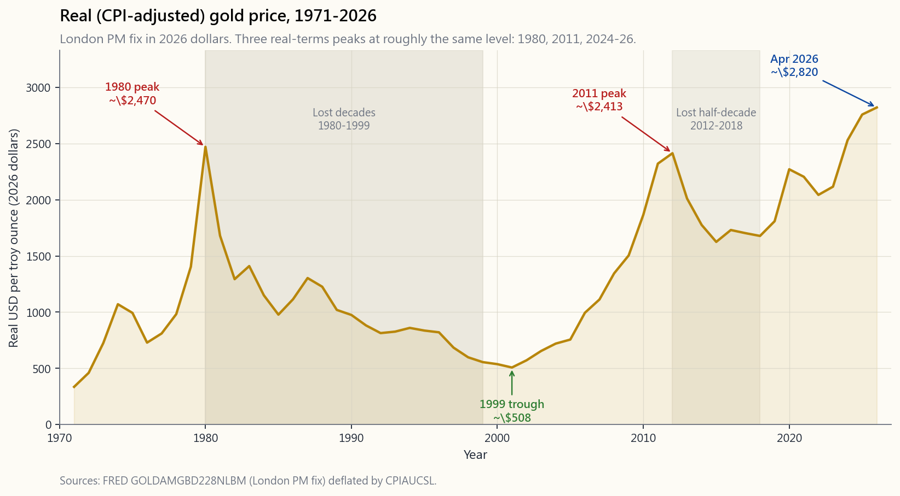
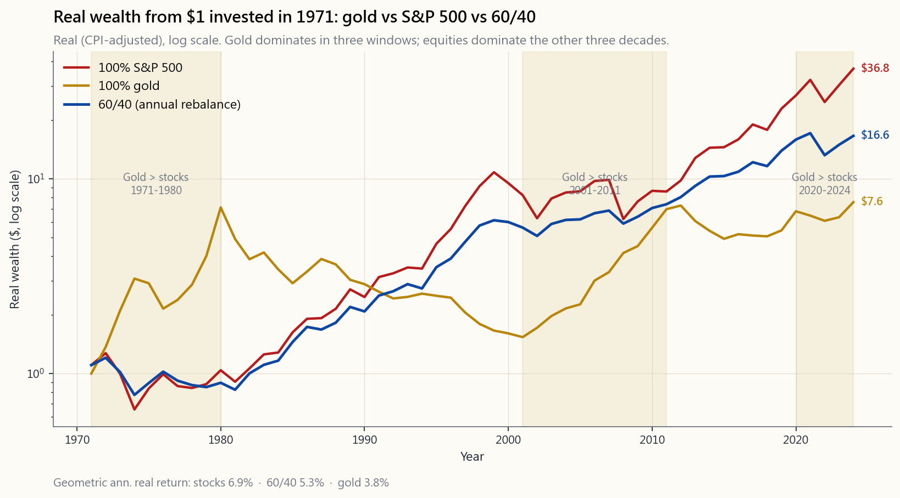
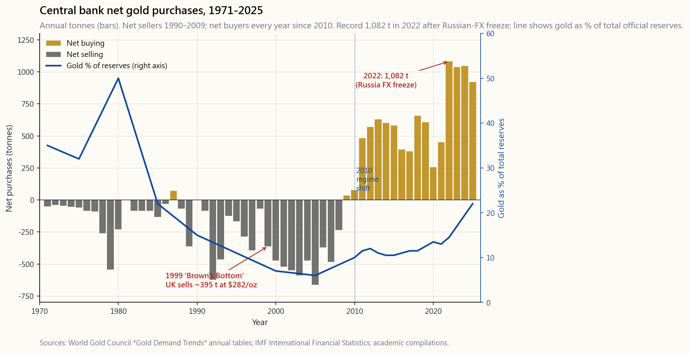
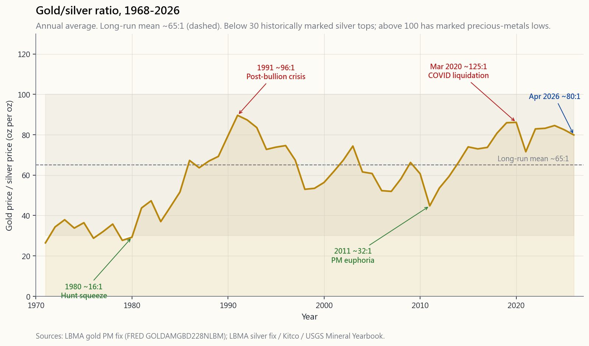
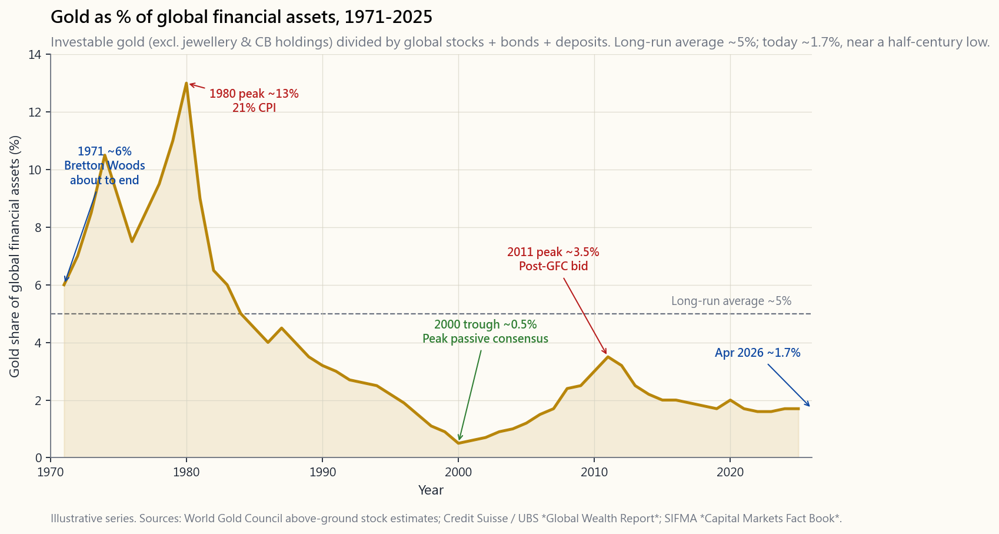

# 第六週：黃金——五千年的價值儲存

---

## 第一部分：閱讀單元

---

### 1. 為何這個主題至關重要

每本教科書的投資組合章節，最終都會碰到同一個令人尷尬的問題：你是否應該持有黃金？通常的答案，不是黃金信徒式的狂熱肯定，就是柏格頭（Bogleheads）派的輕蔑否定。兩者都錯，因為雙方爭的根本不是正確的問題。黃金不是股票，也不是債券。它不產生現金流，永遠不會支付股利，而它的「內含價值」——正如 J.P. 摩根在 1912 年向美國眾議院普喬委員會（Pujo Committee）作證時所言——

> **「黃金就是貨幣，其他一切皆為信用。」**
> ——J.P. 摩根，眾議院銀行與貨幣委員會，1912 年 12 月 19 日（宣誓證詞，*貨幣信託調查*，第 1084 頁）

與所有其他價值儲存工具的內含價值完全相同：**共識**。

你需要清晰思考黃金的五個理由如下。

1. **這是檢驗「價值儲存」真正含義最純粹的試驗。** 股票複利於盈餘，債券複利於票面利率，黃金幾乎什麼都不複利。如果持有黃金是值得的，理由不可能是現金流——而必然是一種信念的持久性：相信五十年後，其他人類仍會接受它作為貨幣。這套邏輯同樣適用於法定貨幣美元、比特幣，以及古往今來所有存在過的貨幣。黃金是思考「信念定價資產」的最佳實驗室。
2. **抗通膨的說法，一半是事實，一半是行銷話術。** 黃金在三個時間窗口（1970 年代、2000 年代、2020 年代）大幅跑贏通膨，但在這些窗口之間數十年間卻幾乎毫無進展。若你不清楚這個避險機制在「何時」有效，你就會在高點買進、在低點賣出——這正是 2011 年以來，黃金指數股票型基金的散戶平均所做的事。
3. **中央銀行重新成為結構性的邊際買家。** 在淨賣出長達二十年之後（1990–2008 年），官方部門的採購於 2010 年轉為正值，並在 2022 年俄羅斯外匯儲備遭凍結後急劇加速。世界黃金協會（World Gold Council）報告指出，各國中央銀行於 2022 年創紀錄地買入 1,082 公噸，2023 年再買入 1,037 公噸——是有史以來最高的兩個年度總量。這批邊際買家與 2011 年的指數股票型基金買盤性質迥異，改變了你應如何看待 2020 年代黃金反彈的方式。
4. **實作工具的選擇至關重要。** 實物黃金指數股票型基金（GLD、IAU、GLDM、PHYS、MNT）、黃金期貨、黃金礦業股票與實體金幣，是四種截然不同的曝險方式，在稅務、費用、保管及交易對手風險方面各有不同。面向美國上市散戶的預設答案是實物黃金指數股票型基金；其他皆屬專業工具。
5. **「無現金流」如今已非完全正確的說法。** 黃金做市商（bullion bank）會支付小額租借費率來借用你的實物黃金，大型券商（prime broker）接受黃金作為合格擔保品，而依據 2021 年（歐盟）及 2022 年（英國）生效的《巴塞爾協議三》淨穩定資金比率（NSFR）規定，銀行持有的實物黃金被視為高品質流動資產，*未分配*黃金（paper gold）則須承擔 85% 的必要穩定資金費用。這項監管轉變悄悄改變了紙黃金市場的成本結構。

本課程涵蓋黃金的本質、五千年信念的歷史脈絡、其抗通膨效果何時奏效、中央銀行的角色、白銀與鉑族金屬的近親關係、工業原物料為何是截然不同的資產，以及散戶投資人實際上應使用的小型工具組。

> **關於黃金「並非主要關於」什麼的說明。** 黃金確實有實際的工業需求（電子、牙科）以及龐大的珠寶需求——依世界黃金協會《黃金需求趨勢》系列報告，兩者合計約占年度流量需求的一半。但在投資組合中持有黃金的投資論點，壓倒性地指向**貨幣信念與儲備需求**，而非珠寶時尚或工業用途。當黃金價格在一季內移動 200 美元，邊際驅動力幾乎永遠是中央銀行、指數股票型基金資金流向，或實質利率的變動——而不是項鍊。

---

### 2. 你需要了解的知識

#### 2.1 黃金作為貨幣的五千年簡史

「黃金即貨幣」之所以感覺顯而易見，是因為人類大致上從青銅時代起便持續進行這場實驗，至今未曾中斷。簡要回顧如下：

- **約西元前 2500 年——埃及與美索不達米亞。** 黃金戒指和金條在神廟經濟體中作為記帳單位流通。黃金之所以被選中，是因為它不腐蝕、可按重量鑑定，且稀有到少量即可承載龐大價值。
- **約西元前 600 年——呂底亞（今土耳其西部）。** 克羅伊斯王（King Croesus）發行首批標準化金銀合金（electrum）鑄幣——這是最早的真正硬幣。大英博物館收藏的呂底亞鑄幣是貨幣史的奠基文物。
- **西元前 49 年至西元 300 年——羅馬奧勒斯（aureus）金幣。** 一枚 7.8 克的金幣支撐羅馬商業長達三個世紀。西元 250 年後的歷次貨幣貶值——皇帝削減黃金含量以資助軍事行動——是「即使法定貨幣是金屬也會失敗」的教科書案例。
- **西元 1252 年——佛羅倫斯的 *fiorino d'oro*（金弗洛林）。** 一枚純金鑄幣成為文藝復興歐洲的儲備貨幣，梅迪奇銀行的匯票通訊網絡以此為基礎運作。
- **1717 年——英國事實上的金本位制。** 皇家造幣廠廠長艾薩克·牛頓爵士設定金銀比率，使黃金成為主導標準。古典金本位制從 1717 年至 1914 年有效運行。
- **1944 年——布列敦森林協議。** 每盎司 35 美元，美元可兌換黃金（對象為外國中央銀行），其他所有貨幣釘住美元。該制度運行了 27 年。
- **1971 年 8 月 15 日——尼克森關閉黃金兌換窗口。** 可兌換性終結，黃金自由浮動。黃金五千年的貨幣角色正式落幕，全球金融體系進入有史以來第一個純粹法定貨幣時代——如今已是第 55 個年頭。

對 2026 年的投資人而言，有兩點值得深思。第一，*當前*的法定貨幣時代在歷史上極為罕見；此前每一個法定貨幣體制的終結，不是回歸金屬本位，就是以惡性通膨告終。這並不預測未來，但應讓任何視法定貨幣為自然狀態的人保持謙遜。第二，黃金的「信念」並非一種感覺——它是一份跨越五千年、涵蓋每個文明的人類不約而同選擇同一種金屬作為最終儲備單位的連續紀錄。這正是下方圖表所隱含定價的持久性。

#### 2.2 黃金為何由信念定價——「無現金流」的真正含義

股票是對未來盈餘的索取權，債券是對未來票面利率的索取權。對兩者進行估值的現金流量折現法框架，並不適用於黃金，因為黃金沒有可供折現的現金流。黃金的價格，是邊際買家願意向邊際賣家支付的金額，而邊際買家的支付意願，完全取決於其相信下一位邊際買家至少會出同樣的價格。

這並非貶抑，而是與美元定價遵循相同邏輯。一張百元美鈔同樣不產生現金流，它的價值在於交易鏈上的下一個人願意以 100 美元接受它換取商品。伏爾泰在十八世紀的一句話捕捉了這種不對稱性：

> **「紙幣最終將回歸其內含價值——零。」** ——歸因於伏爾泰，1729 年

黃金的信念已有五千年歷史。美元這個純法定貨幣在布列敦森林體系瓦解後的信念，比披頭四樂團還要年輕。比特幣的信念比 iPhone 還要年輕。**每一種價值儲存工具都建立在信念之上**；唯一誠實的問題是：這份信念過去有多持久，未來又可能有多持久。

> **重要警示。** 信念的持久性*並不*等同於有保障的未來報酬。黃金五千年的紀錄使這份*信念*極為穩固，但並不保證未來十年會與任何特定的過去十年相似。那些假設自己能再獲得 1971–1980 年報酬的黃金信徒，因為「黃金在通膨中永遠勝出」，不過是將一個特定體制的規律外推到另一個不同體制上。請將歷史紀錄視為界定「什麼是合理的」之邊界條件，而非預測。

「無現金流」的實際含義是：黃金無法像股票那樣複利成長。長期而言，多元化股票指數每年提供約 7% 的實質報酬，原因在於企業持續生產更多商品、支付股利並進行庫藏股回購。長期而言，黃金的實質報酬約為 1.0–1.5%——略高於通膨。它是*保值的貨幣*，而非增值的資本。

**「無現金流」的一個重要現代補充。** 黃金實際上可以*借出*以賺取小額殖利率。倫敦黃金市場發布**黃金遠期報價利率（Gold Forward Offered Rate，GOFO）**——即交易商以黃金換取美元的利率——而隱含的黃金租借利率是 USD LIBOR/SOFR 與 GOFO 之間的差值。黃金做市商（匯豐、摩根大通、瑞銀、工銀標準）向大型持有人借用實物黃金，以滿足短期交割和精煉需求，支付的租借利率通常介於 0.1%–2%，在市場緊張時偶爾飆升更高（2020 年初 COVID 交割混亂期間，一度超過 5%）。這使「無現金流」變成「如果你是夠大規模的持有人可進入批發市場，則有極小額現金流」。

對散戶投資人而言，有三件事值得注意：

1. **你無法直接獲得租借利率**，除非你在倫敦金銀市場協會（LBMA）認可的金庫中持有數公噸黃金。大型實物黃金指數股票型基金不會借出其持有的黃金（GLD、IAU、GLDM、PHYS 在其說明書中均明確禁止此做法）。這是一項優點，而非缺點——詳見 §2.10 關於紙黃金與實物黃金的討論。
2. **部分較小型的「收益增強型」黃金產品確實會進行出借。** 在購買任何承諾黃金殖利率的產品前，請詳閱說明書。該殖利率來自交易對手信用風險——當黃金做市商倒閉時，你的「黃金」是一筆無擔保債權，而非一根金條。
3. **黃金越來越多地被接受為擔保品。** 大型券商願意以實物黃金作為抵押品借出美元，貸款成數通常為 80–90%。芝加哥商品交易所（CME Group）接受黃金作為期貨部位的合格保證金擔保品。這使黃金對複雜的資產負債表而言成為略具「主動性」的資產——但僅限於一定規模以上。

**《巴塞爾協議三》與 2021–2022 年間悄然發生的監管轉變。** 2021 年 6 月（歐盟）和 2022 年 1 月（英國），《巴塞爾協議三》淨穩定資金比率（NSFR）規定全面對黃金市場生效。銀行金庫中持有的已分配實物黃金，以**高品質流動資產**的資格，無須承擔穩定資金的罰款。*未分配*黃金（帳上對共同資金池的索取權，場外黃金交易的主要形式）則須承擔 **85% 的必要穩定資金費用**——意即銀行必須以長期負債為其未分配黃金帳冊的 85% 提供資金。實際效果是：運作紙黃金市場的成本大幅上升，而持有已分配實物黃金的成本則下降。部分分析師（Goldmoney 的 Alasdair Macleod；BullionStar 的 Ronan Manly）認為，這是黃金價格在 2022–2026 年間表現優於單純實質利率模型預測的結構性原因之一。無論你是否認同這一論點，監管轉變是真實存在的，且正在默默重塑黃金市場的背景格局。

#### 2.3 抗通膨論點——何時有效，何時失靈

行銷話術聲稱「黃金可以對抗通膨」。歷史紀錄則更為具體：**黃金能夠對抗急劇、持續且事先未被充分預期的通膨，並且是在實質利率下行的體制下。** 當實質利率上升時（1981 年伏克爾時期、2010 年代、短暫的 2022 年債券市場崩潰前），黃金往往原地踏步甚至下跌。

下圖分為兩個面板。上方面板繪製 1971 年（尼克森關閉黃金兌換窗口、美元自由浮動之年）至 2026 年 4 月以美元計算的實質（經 CPI 調整）黃金價格。下方面板疊加標題 CPI 年增率與美國 10 年期實質殖利率，並以柱狀圖呈現黃金年度價格變動，使你能清楚看到兩個總體變數與黃金反應之間的關係。

從上方面板應能看出三件事。

- **三個實質高點大約位於相同水準。** 1980、2011 及 2024–26 年的高點，以 2026 年美元計算，均介於 2,200 至 2,500 美元之間。這種重複性引人注目——一種解讀是存在「邊際需求上限」，黃金一旦相對於其他抗通膨工具（抗通膨債券 TIPS、不動產、原物料）貴到一定程度，邊際買家便會退場。請將其視為一個工作假說，而非已被證實的規律。三個數據點不足以構成一個體制。
- **兩段失落的十年。** 從 1980 年到 1999 年，實質價格下跌近 80%。從 2012 年到 2018 年，下跌約 40%。在這些窗口期間持有黃金，考驗了每位黃金信徒的信念。
- **反彈集中在總體經濟壓力時期。** 1971–1980 年：停滯性通膨、石油危機、布列敦森林體系終結。2001–2011 年：美元走弱、全球金融危機（GFC）、歐元區危機、利率崩向零。2019–2026 年：COVID 流動性寬鬆、後疫情 CPI 衝擊、中央銀行加速外匯儲備多元化購入黃金。

下方面板使**實質利率關係**變得顯而易見。在 1971–2020 年的大多數樣本期間，黃金最簡單的單線模型是：美國 10 年期實質殖利率下降 → 黃金上漲；實質殖利率上升 → 黃金下跌。其機制是機會成本。若你能在國庫券上賺到 2% 的實質報酬，這個零殖利率資產就顯得昂貴。若你在國庫券上只能賺到 -1% 的實質報酬，黃金的零殖利率突然顯得有競爭力。

> **但實質利率是主要驅動因素，而非唯一驅動因素。** 2022–2026 年的這段走勢是最清晰的反例。在此窗口期間，美國 10 年期實質殖利率從 -1% 上升至逾 +2%——這在教科書上是黃金應該下跌的典型設定。然而黃金仍然上漲，實質漲幅約為 70%。打破這個模型的因素：創紀錄的中央銀行購金（見 §2.5）、2022 年 2 月俄羅斯外匯儲備遭凍結後的地緣政治儲備多元化、美國財政赤字在非衰退期接近 GDP 的 7%，以及市場對貨幣貶值風險日益增加的折價反映。正如瑞·達利歐（Ray Dalio）在其 2024 年領英文章《為何我現在更偏好黃金而非債券》中所言，黃金是一種「非信用、非法幣的貨幣」，當信用貨幣體系與地緣政治體系同時承壓時，其需求便會上升——即使實質利率同樣在上升。請以實質利率作為主要分析視角，但不要做一個只看單一因子的投資人。

#### 2.4 黃金 vs 股票 vs 60/40——逐個體制比較

比較黃金與股票的傳統方式，是從 1971 年至今的單一累積圖表。這種圖表的問題在於，長期走勢線受最近十年發生的事所主導——你看不出黃金「何時勝出」、「何時落敗」。下圖將這半個世紀劃分為五個體制，讓每條線在每個體制的起點都從 1 元開始，使你能看清每個窗口內部報酬的形態。第四條線呈現一個 **60/25/15 投資組合**——60% 標普 500、25% 中期國庫券、15% 黃金——每年再平衡，與 60/40 股票/債券基準組合並列比較。

逐個體制解讀各面板。

- **1971–1980 年（停滯性通膨，布列敦森林體系終結）。** 黃金名目上漲約 16 倍，實質漲約 5 倍。標普 500 實質上幾乎持平。60/40 損失實質價值。60/25/15 投資組合最終大幅領先 60/40，幾乎完全得益於黃金部位。這是黃金應當大放異彩的體制。
- **1981–1999 年（伏克爾通縮與大牛市）。** 標普 500 每年實質複利報酬約 14%。黃金實質跌幅約 80%。60/40 以較低的波動性緊追股票。60/25/15 因黃金拖累而落後 60/40——每年約 80–100 個基點。這是持有黃金讓你付出代價的體制。
- **2000–2011 年（網路泡沫破裂與全球金融危機）。** 黃金每年複利報酬約 15%。標普 500 在整個窗口期間大致持平（「失落的十年」）。60/40 表現優於 100% 股票。60/25/15 再度擊敗 60/40——黃金是贏家部位。
- **2012–2019 年（後全球金融危機通縮期）。** 標普 500 一路狂奔，黃金持平甚至下跌，60/40 回歸強勢，60/25/15 小幅落後 60/40。
- **2020–2026 年（COVID、再通膨、中央銀行黃金買盤週期）。** 股票大約翻倍，黃金大約翻倍。60/40 在 2022 年創下有史以來最糟糕的一年（股票與債券雙雙下跌）。60/25/15 在 2022 年的表現明顯較為平穩，因為黃金在股票與債券下跌時上漲——這正是永久性黃金部位值回票價的體制。
- **完整 1971–2026 年總結。** 標普 500 的最終價值以明顯差距最高。60/25/15 的**夏普比率**高於 60/40 和 100% 標普 500，且最大回撤淺得多。享受更平穩旅程所付出的代價，是最終財富略少於 100% 股票——這是大多數投資人應當樂意接受的取捨。

體制面板所呈現的，正是哈利·布朗（Harry Browne）在 1981 年建構其**永久投資組合**的依據、瑞·達利歐後來在 1996 年精煉為**橋水全天候策略（All Weather）**的基礎，以及 Artemis Capital 的克里斯多夫·科爾（Christopher Cole）在 2020 年白皮書《鷹與蛇的寓言》（*The Allegory of the Hawk and Serpent*）中再度闡明的**龍型投資組合（Dragon Portfolio）**核心：黃金與股票是不同的曝險。在多個體制中持有兩者各有意義的配置，往往比單獨持有其中任一者，能夠帶來更好的**風險調整後**結果。

> **關於用語的說明。** 稱其為「免費的午餐」過於誇大。數據所呈現的是**已實現的分散投資效益**——在特定的 1971–2026 年樣本期間，再平衡後的混合組合具有比其成分更高的夏普比率。未來體制是否會帶來相同效益，並無保證。支持黃金部位的理由是「在諸多歷史體制中表現穩健」，而非「在任何未來體制中皆有保障」。

#### 2.5 中央銀行——2010 年以來的結構性邊際買家

在布列敦森林體系瓦解後的大多數時期，各國中央銀行是黃金的淨*賣家*。西方中央銀行在 1990 年代至 2000 年代初期拋售儲備——1999 年「布朗底部」（Brown's Bottom）事件是典型案例：英國財政大臣戈登·布朗以每盎司 282 美元的價格出售約半數英國黃金儲備，成為在低點賣出的經典教訓。這個體制在 2010 年終結。2010 年以後每一年，官方部門都是淨*買家*。

世界黃金協會 2025 年《黃金需求趨勢》報告的數據如下：

- **2010–2021 年：** 官方部門年均淨購買約 480 公噸，主要買家為俄羅斯、中國、土耳其、印度和哈薩克。
- **2022 年：** 1,082 公噸——自 1950 年以來最大的年度採購量。導火線是烏克蘭入侵後，俄羅斯央行 3,000 億美元的美元儲備遭凍結。每一個非結盟國家的中央銀行，突然有了充分的理由想要持有一種任何人都無法強制關閉的儲備資產。
- **2023 年：** 1,037 公噸。
- **2024 年：** 約 1,045 公噸。
- **2025 年（全年估計）：** 仍追蹤在 900 公噸以上，其中中國人民銀行是最受關注的買家（中國人民銀行截至 2025 年中，連續 18 個月報告黃金儲備增加）。

作為參考，每年全球新開採黃金供應量約為 3,500 公噸。在近期的週期中，各國中央銀行單獨吸收了約 25–30% 的新礦山供應量。這是一種 2011 年指數股票型基金週期所不具備的結構性邊際需求。

其戰略含義顯而易見。2010 年代的黃金週期由西方散戶和指數股票型基金資金流所驅動，並在 2013–2018 年實質利率上升時耗盡動能。2020 年代的黃金週期由*非西方中央銀行*所驅動，而這些買家並不在乎實質利率，因為他們的替代選項——持有更多美元和國庫券——已在 2022 年被證明帶有他們此前未曾納入定價的政治風險。這個邊際買家不會因實質利率上升而關閉。它可能會放緩，但不太可能像 1990 年代那樣反轉為淨賣家。

#### 2.6 白銀與其他貴金屬

黃金作為價值儲存工具的「純粹性」，源自於其他金屬所欠缺的特質：**黃金幾乎沒有工業需求。** 每年黃金流量中，流向工業用途的不到10%（主要用於電子與牙科）。其餘則是珠寶、投資與中央銀行儲備——也就是貨幣性或準貨幣性需求。這正是為何黃金的價格反映的是市場信念與實質利率，而非全球製造業採購經理人指數。

白銀、鉑金與鈀金則截然不同。它們同時兼具貨幣屬性與更大比重的工業需求，而這種混合特性正是它們波動性更高、作為投資組合分散工具時表現較不穩定的原因。

**白銀——雙本位制度的幽靈。** 從羅馬帝國晚期到19世紀，白銀與黃金同樣扮演「貨幣」的角色，世界上多數地區實行*雙本位*制度。英國王室於1717年（透過牛頓）事實上採行金本位，以及美國**1873年鑄幣法**（「73年之罪」，廢除白銀的貨幣地位），是終結白銀貨幣角色的兩大政治事件。威廉·詹寧斯·布萊恩在1896年民主黨全國代表大會上的「黃金十字架」演說，是最後一次恢復白銀貨幣地位的重大政治抗爭。他失敗了。此後，白銀的價格便由工業需求主導——時至今日，白銀需求中約55%來自工業（太陽能光伏、電子產品、硬焊合金），25%來自珠寶與銀器，剩餘約20%為投資與硬幣需求。

最受關注的指標是**金銀比**——即購買一盎司黃金所需的白銀盎司數。從歷史上看（羅馬時期至19世紀），此比值維持在12:1至16:1之間，大致反映兩者在地殼中的豐度比。進入現代，此比值從約15:1（1980年亨特兄弟白銀軋空行情的高峰）擴大至逾120:1（2020年3月新冠疫情衝擊高峰）。下圖呈現1968年至2026年的完整歷史走勢。

兩項實務觀察：

- 金銀比具有均值回歸特性，但速度緩慢且雜訊頗多。看多白銀的人將比值極端化（逾100:1）視為超配白銀相對於黃金的訊號，歷史上1991年、2003年、2016年與2020年的極端值確實都曾修正——但往往需要數年時間，且白銀在等待期間的波動性遠大於黃金。
- 作為投資組合的分散工具，黃金是更乾淨的工具。若要進行下一輪工業周期轉折的戰術性交易，白銀則有更大的槓桿效應。

**鉑金與鈀金——汽車觸媒轉化器金屬。** 兩者的工業需求佔比均約達80%，主要由汽車觸媒轉化器所主導（鈀金用於汽油車，鉑金用於柴油車與氫能源車）。其價格走勢追蹤的是汽車生產周期、排放法規，以及南非與俄羅斯的礦山供給（這兩個國家合計生產全球約75%的鉑系金屬產量）。它們在任何實質意義上都**不是**價值儲存工具——2023年，鈀金在九個月內下跌65%，原因是電動車所引發的結構性重新定價終於反映在價格上。請將它們視為特殊的工業周期投機部位，而非黃金的替代品。

僅就投資角度的結論而言：本課程所提及的「永久貴金屬配置」，指的是**黃金**。白銀、鉑金與鈀金可以在戰術性投資組合中佔有一席之地，但不適合納入永久配置。

#### 2.7 工業原物料的說明——為何與黃金截然不同

石油、銅、小麥、大豆、天然氣——這些是生產的投入要素，而非貨幣。它們與黃金在結構上有三項根本差異。

1. **它們會向供給邊際成本均值回歸。** 當油價在2008年或2022年觸及130美元時，美國頁岩油業者重啟生產，供給增加，價格隨之回落至50至70美元的邊際成本區間。當油價跌至30美元時，邊際生產商停產，供給減少，價格回升。就長期而言，工業原物料不會複利成長，而是圍繞著緩慢漂移的成本曲線震盪。
2. **實質長期趨勢是*下行*，而非上行。** 採礦與農業的生產力提升，在歷史上超越了需求成長。2026年的實質油價與1973年大致相當。實質小麥價格在一個世紀內是*下降*的。「原物料超級周期」論點在特定十年間確實成立，但對於買進持有的複利投資者而言並不適用。傑里米·格蘭瑟姆旗下GMO關於長期實質原物料價格的研究報告，是這一領域的標準參考文獻。
3. **它們彼此之間以及與景氣循環高度相關。** 持有一籃子工業原物料，大致等同於持有美元的槓桿空頭部位加上全球國內生產毛額的槓桿多頭部位。這是一種因子曝險，而非分散投資工具。

對美國散戶投資人而言，其意涵是：工業原物料是*交易部位*（根據特定總體觀點所決定的倉位大小），而非*持有部位*（永久性配置）。以期貨為基礎的原物料指數股票型基金的運作機制——正價差、轉倉成本、USO案例研究——將在**第39週：原物料期貨與轉倉殖利率**中詳細介紹。就本課而言，只需了解：實物黃金指數股票型基金不存在上述結構性問題（詳見§2.8）——這正是黃金可作為被動長期持有標的，而多數其他原物料卻不適合的具體原因。

#### 2.8 可投資工具——黃金指數股票型基金 vs 黃金期貨 vs 實體金幣

依據僅限美國市場的可投資條件，以下是美國掛牌散戶投資人的黃金專屬精選清單。

| 工具 | 類型 | 費用率 | 備註 |
|---|---|---:|---|
| GLD | 美國掛牌實物黃金指數股票型基金（信託） | 0.40% | 規模最大、流動性最高、選擇權鏈最深 |
| IAU | 美國掛牌實物黃金指數股票型基金（信託） | 0.25% | 費用率低於GLD，流動性略遜 |
| GLDM | 美國掛牌實物黃金指數股票型基金（信託） | 0.10% | 美國費用率最低的黃金指數股票型基金；選擇權市場規模較小 |
| SGOL | 美國掛牌實物黃金指數股票型基金（瑞士金庫） | 0.17% | 黃金存放於蘇黎世，而非倫敦／紐約 |
| BAR | 美國掛牌實物黃金指數股票型基金 | 0.18% | 實名登記，每月審計 |
| IAUM | 美國掛牌實物黃金指數股票型基金 | 0.09% | iShares對標GLDM的產品 |
| GDX | 黃金礦業股 | 0.51% | 具槓桿效果，有營運風險；適用一般股票稅務處理 |
| GDXJ | 初級黃金礦商 | 0.52% | 貝塔值更高，非系統性風險更大 |
| /GC 期貨 | CME 100盎司黃金期貨 | 不適用（保證金制） | 適用第1256條款60/40稅務處理；可實物交割合約 |
| MGC 期貨 | CME 10盎司微型黃金期貨 | 不適用（保證金制） | 同樣適用第1256條款稅務處理，合約規模較小 |

對於可使用**加拿大掛牌產品**的投資人（盈透證券、Questrade及多數國際券商），可投資工具大幅擴充：

| 工具 | 類型 | 費用率 | 備註 |
|---|---|---:|---|
| PHYS | Sprott實物黃金信託（NYSE Arca／多倫多交易所） | 0.41% | 封閉式基金，實名登記黃金，**可申請實物贖回**400盎司金條 |
| KILO | Sprott實物黃金信託（公斤條） | 0.35% | 同一Sprott信託架構，可申請公斤條贖回 |
| MNT | 加拿大皇家造幣局黃金電子收據（多倫多交易所） | 0.35% | 收據1:1對應加拿大皇家造幣局金庫中的實名登記黃金；可實物贖回 |
| MNS | 加拿大皇家造幣局白銀電子收據（多倫多交易所） | 0.45% | MNT的白銀對應產品 |
| CGL.C | iShares加元避險黃金指數股票型基金（多倫多交易所） | 0.55% | 針對加元帳戶提供加元避險曝險 |

**Sprott（PHYS）與加拿大皇家造幣局（MNT）產品**值得特別說明，因為它們是美國持有人規避28%收藏品稅率的兩種美國稅務友善方式（詳見§2.11稅務處理）：兩者均符合被動式外國投資公司（PFIC）**合格選擇基金（QEF）選擇申報**資格，若每年在8621表格上正確申報，資本利得將按長期資本利得稅率課稅，而非收藏品稅率。QEF選擇申報確實涉及繁瑣的文件作業——多數散戶投資人不會費心辦理——但此途徑確實存在，且被精明的持有人所採用。

**黃金期貨與實物黃金指數股票型基金的比較。** 兩者雖均以相同的現貨價格為基準，卻是兩種截然不同的曝險形式。

- **黃金指數股票型基金（GLD、IAU、GLDM、PHYS、MNT）** 在金庫中持有*實物金條*。不存在轉倉成本或正價差。唯一的拖累是管理費（依基金不同，介於9至55個基點）。對現貨的追蹤誤差極小——實務上每年0.1至0.5%。
- **黃金期貨（/GC、MGC）** 是有到期日的合約。持有人須每兩個月平倉、接受實物交割，或展期至下一個合約。黃金的期貨曲線*通常處於溫和的正價差*——持有成本（倉儲＋保險＋融資）為正值，因此遠月合約的交易價格略高於現貨。黃金的轉倉成本不高（在正常市況下通常為年化1至3%，偶爾在市場緊俏時較高）——遠小於石油期貨每年5至10%的正價差拖累——但並非為零。補償性優勢在於槓桿（2026年4月，一份/GC合約名目價值約24萬美元，僅需約1.1萬美元保證金）以及**第1256條款稅務處理**：無論持有期間長短，均適用60%長期資本利得／40%短期資本利得，並於年底按市值計算。

對於買進持有的黃金配置，實物黃金指數股票型基金是正確的工具。對於戰術性或槓桿性的黃金部位，黃金期貨或GLD選擇權通常更為合適。兩者各有其適用情境，可並行存在。

**實體金幣與金條。** 就投資目的而言，主流金幣產品（美國黃金鷹幣、加拿大楓葉幣、南非克魯格蘭德金幣、奧地利維也納愛樂金幣）的交易價格較現貨溢價3至6%，另加倉儲與保險費用（商業保險金庫每年0.5%），以及1至3%的買賣價差。這些摩擦成本的總和，在任何不足10至15年的持有期間內，都會抵消GLD／IAU的費用率優勢。實物黃金的正確答案*僅限於*紙黃金無法滿足的特定使用情境——主要是與網路無關的管轄區風險，或跨多個法律體系的遺產規劃。

#### 2.9 紙黃金 vs 實物黃金——實名登記、非實名登記與借貸風險

並非所有「黃金」都是真正的黃金。黃金市場區分三種保管模式：

- **實名登記、分隔存放、經審計。** 特定金條（附序號）歸屬於您，存放於指定的倫敦金銀市場協會認可金庫，至少每年由獨立機構審計一次。您對該金屬擁有*財產權*。若保管機構倒閉，金條不會納入破產財產。GLD、IAU、GLDM、PHYS、SGOL、BAR、MNT均採用此模式。
- **實名登記但集中存放。** 您擁有特定重量的黃金，但非特定金條——您的請求權由集體黃金池滿足。保障略弱，但對散戶而言通常已足夠。
- **非實名登記。** 對黃金商業銀行資產負債表上特定黃金數量的*帳簿記錄*。您是銀行的無擔保債權人。若銀行倒閉，您的「黃金」是破產求償權，而非實物金條。倫敦多數場外黃金交易以非實名登記形式進行——這使市場保持流動性——但它與持有實物金條並非同一種產品。

**為何這對指數股票型基金的選擇至關重要。** 在考慮任何黃金指數股票型基金時，請閱讀其公開說明書並確認三件事：

1. **保管形式。** 美國主要黃金指數股票型基金（GLD由滙豐銀行保管、IAU由摩根大通保管、GLDM由滙豐銀行保管、SGOL由摩根大通在瑞士保管）均持有*實名登記*黃金並揭露金條清單。PHYS與MNT同樣持有實名登記黃金並提供實物贖回，這是「我真的擁有這些黃金」最強而有力的證明。
2. **借貸政策。** 該信託是否允許借出其黃金？GLD、IAU、GLDM、SGOL、PHYS與MNT均明確*禁止*借貸。部分較小型的「收益增強型」黃金產品確實會借貸黃金——通常是那些對本不配發股利的資產卻標榜正殖利率的產品。這些殖利率來自於對黃金商業銀行的交易對手曝險。目前美國市場上沒有大型、廣為行銷的指數股票型基金大規模借出其黃金；此風險更多存在於非實名登記的批發產品，以及針對避險基金的小型發行商「收益增強型」結構中。
3. **審計頻率與審計機構。** 至少每年一次，由知名機構（Inspectorate International、Bureau Veritas）執行。金條清單應公開揭露。

一般原則：**對於散戶的核心黃金配置，多付幾個基點以持有擁有實名登記、未借出、經審計黃金的指數股票型基金**。GLDM費用率10個基點與假設性「收益增強型」產品0個基點之間的成本差異，相較於接受殖利率所承擔的交易對手風險而言，實屬微不足道。

#### 2.10 倉位大小——黃金應配置多少比重？

坦誠的答案是**大於0%，小於100%**，確切數字取決於您對未來十年市況的判斷。以下是三位知名投資人的參考觀點：

- **哈利·布朗，《無憂投資》（1981年）——永久投資組合：** 黃金25%、股票25%、長期國庫券25%、現金25%，每年再平衡。這是首個在量化導向的散戶框架中，系統性提倡大規模永久黃金配置的案例。
- **瑞·達利歐，橋水聯合基金——全天候投資組合（1996年，2010年代精修）：** 在風險平價框架下，黃金約佔7.5%（另加約7.5%原物料），每項資產的配置比例旨在對投資組合波動性貢獻相等。達利歐在2024年LinkedIn文章《為何我現在比債券更偏好黃金》中主張，鑑於當前的財政與地緣政治狀況，黃金應在任何多元化投資組合中佔有「10至15%」的實質比重。
- **里克·魯爾（前Sprott美國控股執行長）——2020至2025年訪談中反覆提及的指引：** 「將可投資淨資產的10%配置於黃金與白銀，其中三分之二為黃金，三分之一為白銀，作為災難保險——而且你應該*希望*這份保險永遠不需要理賠。」魯爾明確將此配置定位為對抗法幣體系崩潰的*保險*，而非追求報酬的部位。

全球黃金市場相對於金融資產的規模有多大？下圖呈現當前配置的背景脈絡。

從圖表中得出三項觀察，為配置大小問題提供參考框架：

- **長期平均值約為5%。** 換言之，若地球上每位投資人都持有全球市場投資組合，則每人約有5%配置於黃金。
- **當前全球配置約為1.7%。** 可投資黃金相對於長期歷史均值而言明顯*低配*。若全球配置均值回歸至歷史5%的水準，在黃金供給大致固定（礦山供給年增長約1.5%）的情況下，隱含的黃金價格將約為**當前水準的2.5至3倍**——即每盎司約7,000至8,500美元。這不是預測；這是黃金多頭常引用的敏感性試算。僅供參考。
- **1980年高峰達約13%。** 若回到那種「恐慌」水準而非長期均值，則隱含的黃金價格將在**每盎司15,000美元以上**。同樣——僅供參考，並非預測。

對美國散戶投資人而言，三個坦誠的配置答案：

- **0%** 是**Bogleheads**的答案。若您相信通膨將永遠溫和、實質利率將永遠為正，此答案在邏輯上自洽。1981至2021年的60/40回測支持此觀點。2022年的結果則不然。
- **5至15%** 是**機構共識**——哈利·布朗永久投資組合的上限（25%，但其框架假設四種不相關的市況均等加權）、瑞·達利歐全天候投資組合的下限（約7.5%）、里克·魯爾保險框架的10%，以及「全球市場投資組合」論點的約5%。對於希望投資組合在多種市況下均有合理表現的多數美國散戶投資人而言，此為正確答案。
- **20%以上** 是**黃金多頭**的答案。只有當您對貨幣體制改變有強烈的確信觀點時，此答案才在邏輯上自洽。採用此配置的多數人，並未誠實地壓力測試若他們錯了十年會發生什麼——請參閱§2.4市況圖中1980至1999年的面板。

本課程結尾的互動工具，讓您可依通膨市況切割歷史紀錄，親眼見證避險何時真正奏效、何時未能發揮作用。

#### 2.11 稅務處理與非美國投資人說明

**美國投資人。** GLD、IAU、GLDM、SGOL、BAR、IAUM均以持有「收藏品」的授予人信託形式組建，這意味著在美國，**長期資本利得適用28%的收藏品稅率**，而非標準的15至20%長期資本利得稅率。相較之下，GDX礦業股屬於普通股，適用標準稅率並可享有合格股利待遇。

美國投資人有三種坦誠的方式可降低28%稅率，各有其注意事項：

1. **在稅務優惠帳戶內持有黃金指數股票型基金**（Roth IRA、傳統IRA、401(k)）。這是目前最簡潔、最廣受推薦的方式。多數散戶券商允許在IRA帳戶內持有GLD、IAU、GLDM、PHYS。
2. **使用Sprott PHYS或加拿大皇家造幣局MNT並申報QEF選擇。** 作為加拿大籍基金，兩者在美國稅務上均符合被動式外國投資公司（PFIC）資格。每年在8621表格上申報QEF選擇後，利得將按15至20%的長期資本利得稅率課稅，而非28%的收藏品稅率。該申報會產生持續性的文件作業，並要求基金提供年度說明書（PHYS確實提供；請逐一向各基金確認）。在採用此方式前，請諮詢熟悉PFIC規則的稅務顧問。
3. **持有GLD的長期股票選擇權，而非直接持有GLD現貨。** 由於選擇權合約是獨立的證券，持有期間規則適用於選擇權本身，而非所持有的信託單位。長期買權（長期期權）可用於表達對GLD方向性觀點，並對選擇權合約適用資本利得稅處理。**然而**——這一點至關重要——GLD的股票選擇權*並非*第1256條款的廣泛基礎指數選擇權；它們是股票選擇權，依標準規則課稅，涉及洗售、跨式部位、履約與被指定的複雜問題。請勿假設選擇權「自動解決」28%收藏品稅率問題。它們是在適當情境下使用的工具，而非萬用的解決方案。任何在此架構下管理重大規模部位的人，均應與熟悉第1234條款、第1092條款跨式部位規則及GLD信託具體機制的稅務顧問合作。

此外，有**一個常見的迷思值得澄清**：美國部分州（尤其是德克薩斯州、懷俄明州、猶他州、奧克拉荷馬州、路易斯安那州及其他數州）已通過立法，宣告黃金與白銀*鑄幣*在州層面具有法定貨幣地位，並對這些金屬免徵州銷售稅。該立法是*真實存在的*——德克薩斯州於2018年開設了州立黃金儲備金庫——但其效力僅限於州稅層面。**聯邦資本利得稅處理方式不變**，無論您居住在哪個州，28%的收藏品稅率仍適用於已實現利得。

**非美國投資人——情況大相逕庭。**

- **香港。** 不徵收資本利得稅，對實物黃金或黃金指數股票型基金亦不徵收商品及服務稅。香港籍投資人可直接持有美國掛牌GLD，且無需就（不存在的）股利繳納預扣稅。香港金融管理局未持有貨幣黃金儲備，但香港是全球最深厚的實物黃金交易中心之一（金銀業貿易場，創立於1910年）。透過恒生銀行或中國銀行的本地銀行金庫黃金服務廣泛可得。
- **台灣。** 證券不徵收資本利得稅。臺灣銀行、兆豐銀行與國泰世華銀行的銀行黃金存摺帳戶，是最常見的散戶投資工具——這些是對銀行的*非實名登記*請求權，因此§2.9關於保管形式的注意事項同樣適用。對於希望取得實名登記、經審計曝險的台灣投資人，可透過國際券商帳戶持有GLD、PHYS或MNT。
- **中國大陸。** 跨境黃金指數股票型基金的取得受外匯管理局規定限制；大陸投資人通常使用上海黃金交易所（上金所）及銀行黃金積存帳戶（招商／工行／建行黃金積存）。實物黃金銷售須繳納13%增值稅，但符合上金所資格的投資黃金可免徵增值稅。持有香港或新加坡券商帳戶的大陸投資人，可使用相同的境外工具。
- **非美國持有人的遺產稅警示。** 包括GLD、IAU、GLDM在內的美國掛牌指數股票型基金，在美國遺產稅目的上屬於*美國地位資產*。持有逾6萬美元美國掛牌證券的非美國籍投資人於身故時，將面臨美國遺產稅制度——超出部分最高稅率達40%。加拿大籍基金（PHYS、MNT）以及在美國境外持有的實物黃金可規避此問題。對於擁有重大黃金配置的非美國投資人而言，這是一項值得認真考量的問題。

---

### 3. 常見迷思

**1. 「黃金具有內含價值。」** 並不然。美元、歐元、英鎊或比特幣也沒有。這五者的定價皆基於信念。最精闢的論述來自約翰·梅納德·凱因斯在1924年的一段話，他稱黃金為「野蠻的遺跡」——他的意思並非黃金一文不值，而是*所有*貨幣錨定機制都是社會慣例，將其中任何一種視為形而上的「真實」存在都是一種錯誤。五千年的信仰讓黃金的慣例極為持久，但這並不代表它具有內含價值。正確的理解框架是：黃金是貨幣協調中的謝林焦點——不同文明的人類獨立選擇了同一種金屬。這種共識極具韌性，但它仍然只是共識。

**2. 「黃金總是隨通膨上漲。」** 它在*未能充分預期且持續*的通膨期間上漲，尤其是在實質利率下滑或轉負時。在沃克爾式「利率領先通膨」的升息環境（1980至82年、1994年部分時期，以及2022年債市崩潰之前短暫出現）下，即使CPI處於高位，黃金的名目價格仍會下跌——因為持有無收益資產的機會成本，已超過黃金名義上所對沖的通膨漲幅。一句話總結：黃金對沖的是*實質利率的壓抑*，而非通膨本身。兩者在危機環境中常常同步出現，這也是「黃金等於通膨對沖工具」這個說法大多數時候大致成立、卻在最關鍵的時間窗口恰恰失效的原因。

**3. 「黃金是糟糕的投資，因為它沒有殖利率。」** 黃金是糟糕的*現金流*資產——它不是能夠複利增長的資本。將它視為債券替代品是類別錯誤。作為一個對實質利率具有負向敏感性、且在危機環境中具有正向相關性的投資組合分散工具，黃金在完整的1971至2026年記錄中，對六十/四十投資組合的長期夏普比率貢獻是正向的（見§2.4）。華倫·巴菲特1998年在哈佛的演講中嘲諷黃金（你把它挖出來，運到世界各地，再挖個洞埋進去，然後「付錢請人守著它」），是這種迷思的經典版本。巴菲特是史上最偉大的股票資本配置者之一，他關於*現金流優越性*的論點是正確的。然而，他並非一個管理多重市場週期存續的投資組合建構者——波克夏持有約3,000億美元的現金和國庫券，這對波克夏而言，同樣是基於不同理由產生的「相對於股票的無收益拖累」。

**4. 「黃金礦商股是黃金的槓桿工具。」** 它們是以*黃金價格減去全維持成本（AISC）*為槓桿基礎，且承擔營運風險、國家╱司法管轄區風險（許多大型礦商在俄羅斯、馬利、剛果民主共和國等政治風險較高的地區營運）、對沖計畫風險（1990年代末進行遠期合約銷售對沖的礦商，錯過了2001至2011年的大部分漲勢——巴里克黃金的對沖帳簿是教科書級的案例）、管理層資本配置風險，以及在大盤拋售期間可能凌駕黃金貝塔的股票市場貝塔。實證記錄令人震驚：自GDX於2006年成立以來，儘管理論上存在營運槓桿，GDX在大多數跨十年的時間窗口中*表現遜於*GLD。挑選個別礦商（紐蒙特、愛哥鷹礦業，以及流媒體端的法蘭克-內華達）歷史上優於GDX指數，但那是選股風險，而非黃金曝險。

**5. 「比特幣取代黃金。」** 比特幣的信念只有16年歷史（中本聰的白皮書，2008年10月）。黃金的是5,000年。兩者或許都可以納入投資組合——許多投資人以小型平行部位同時持有——但替代論忽略了耐久性的差距。相關的檢驗不是「比特幣在過去十年的表現如何」（這段期間它顯然大幅超越黃金）。相關的檢驗是「在失敗情境下的條件結果為何，以及我們對這種信念能延續到下一個跨世代政經環境有多大把握」。在這些問題上，黃金有實證記錄，而比特幣只有一條漸近線。把它們當作兩種不同的部位，而非同一部位的兩種實作方式。

**6. 「你應該持有一籃子原物料來分散投資。」** 工業原物料（石油、銅、基本金屬、農產品）是*順週期的風險資產*，而非分散工具。在任何足夠長的時間段內，它們與全球成長、美元及股票貝塔高度相關。黃金才是分散工具；石油和銅是對全球成長的因子投注。DBC和PDBC多元化原物料指數股票型基金並非黃金的替代品。

**7. 「持有GLD的成本與購買實物黃金相同。」** GLD的年費為0.40%，GLDM為0.10%，IAU為0.25%，買賣價差很小（零售訂單通常為1至3個基點）。向經銷商購買金幣需支付3至6%的溢價，加上儲存和保險費用（有保險的商業金庫約為每年0.5%），以及轉售時1至3%的買賣價差。就紙黃金曝險而言，在約十年以內的任何時間範圍內，GLD╱IAU╱GLDM的成本更低。對於末日情境下的實物交割需求，這項比較並不適用，因為兩類產品並不可互換。

**8. 「1980年的高點是史上最高點。」** 以實質價值計算，並非如此。1980年850美元的名目高點，換算成2026年的幣值約為2,400美元，*大致與今日水準相當*。這個觀察很重要，因為它重新定義了媒體「黃金創歷史新高」的敘事——以實質價值計算，黃金在2024年大部分時間*剛剛回到*其1980年的高點，足足等了44年。判斷「黃金是否昂貴」時，務必使用實質計價的圖表。

**9. 「中央銀行出售黃金意味著黃金已死。」** 中央銀行在1990年至2008年的每一年都是*淨賣方*，在那段時間黃金的實質價值疲軟。自2010年以來，每年都是*淨買方*——§2.5討論了這一政策轉變——在那段時間黃金走勢強勁。中央銀行的資金流向是*影響價格*的交易，而非無足輕重的訊號。英國央行的「布朗谷底」拋售（1999年，以每盎司282美元出售395公噸）是教科書級的警世故事：官方部門在底部賣出，在頂部買回，這正是官方部門資金流向在政策轉變期間的慣常表現。

**10. 「黃金市場規模太小，無足輕重。」** 地上可投資黃金存量約為213,000公噸，以2026年4月的價格計算，約值20兆美元。這明顯大於全球高收益債券市場，約為美國市政債券市場規模的一半。倫敦金銀市場協會（LBMA）場外黃金每日交易量約為1,600億美元，與美國十年期國庫券的每日交易量相當。黃金是全球最大且最具流動性的資產類別之一——「市場規模小」的說法通常將*流量*（年度礦山供應量約3,500公噸，約合每年3,000億美元）與*存量*（現有的213,000公噸）混為一談，而兩者是截然不同的概念。

**11. 「黃金是一塊無用的石頭，不產生任何收益。」** 如§2.2所述，黃金*可以*在金條銀行市場以小額租借殖利率進行借貸，且*確實*被主要經紀商和芝商所（CME）接受為擔保品。根據巴塞爾三期2021至22年淨穩定資金比率（NSFR）的實施規定，指定配置的實物黃金符合銀行資產負債表上高品質流動資產的資格。「無用石頭」的說法已落後半個世紀。

**12. 「黃金和白銀同步波動。」** 它們具有長期正相關性，但這種關係並不穩定，且白銀的波動性明顯更大。白銀約55%的工業需求份額，使其同時也是一種策略性工業週期投注，而非單純的貨幣資產。黃金╱白銀比率（§2.6）在現代曾介於17:1至125:1之間——這並不是「同步波動」。

---

### 4. 問答環節

**Q1：如果黃金沒有現金流，我如何能合理持有它？**
答：就像你合理持有美元存款帳戶一樣。你持有這兩者，都不是為了現金流；你持有它們，是將其作為購買力的儲存手段，以及對尾部事件需求的一種選擇權。黃金在歷史上曾多次讓數個國家貨幣煙消雲散的環境中維持了購買力（魏瑪共和國、阿根廷、辛巴威、委內瑞拉、黎巴嫩——任選一個年代）。這就是它的價值主張。相對於股票的複利增長，它顯得微不足道，這也正是為何對大多數投資人而言，5至15%的配置是機構的普遍共識。

**Q2：比特幣是更好的黃金嗎？**
答：也許在50年後；現在還不是。比特幣的信念只有16年歷史。黃金的是5,000年。如果比特幣的信念能延續下去，其上行潛力更大——但失敗情境下的條件結果，比黃金糟糕得多，因為黃金有5,000年跨文明的實證記錄，而比特幣只有中本聰的白皮書和一系列價格圖表。同時以小型平行部位持有兩者，比押注其中一個更誠實。許多「黃金對比特幣」的辯論，都把「過去十年哪個表現更好」（比特幣，遙遙領先）與「到2075年哪個更可能仍是貨幣」（黃金，同樣大幅領先）混為一談。這兩個問題有著不同的答案。

**Q3：「黃金是否發揮作用」的正確基準是什麼？**
答：是實質利率，而非名目CPI。最簡潔的一行檢驗：在那段期間，實質十年期殖利率是否下跌？如果是，黃金應當上漲；如果確實上漲，實質利率對沖就發揮了作用。快速查看可使用聯準會經濟數據（FRED）的DFII10系列。**但**——回到§2.3——2022至2026年這段歷史表明，實質利率模型是*主要*驅動因素，而非*唯一*驅動因素。中央銀行資金流向、地緣政治儲備多元化，以及財政赤字風險溢酬，在邊際上都很重要。

**Q4：為何GLD適用28%的收藏品稅率，有沒有規避方式？**
答：美國國稅局將黃金金條歸類為收藏品，無論你持有的是金幣，還是代表你持有金條的授予人信託受益單位，均適用此規定。**三種誠實的應對方式**，沒有一種是自動生效的：

1. 在個人退休帳戶（IRA）或其他稅務優惠帳戶內持有黃金指數股票型基金。最簡潔，也是最推薦的方式。
2. 使用Sprott PHYS或皇家加拿大鑄幣廠MNT，並每年申報合格選擇基金（QEF）選擇（8621表格）。需要實際處理繁瑣文件；只有在規模夠大的情況下才值得。
3. 透過GLD的長期選擇權表達部位，而非持有現貨GLD——但請注意，這些依據標準規則屬於股票選擇權（洗售規則、跨式部位規則、行權╱指派規則均適用），並非第1256條寬基指數選擇權。請勿假設選擇權「自動解決」28%的問題。

**關於「不對黃金課稅的州」這一說法**（你可能有所耳聞）：美國約十幾個州（德克薩斯州、懷俄明州、猶他州、奧克拉荷馬州、路易斯安那州等）已通過立法，宣告黃金和白銀在州法律上為法定貨幣，並免徵州銷售稅——德克薩斯州於2018年設立了州立黃金儲存庫。這項立法確實存在，但僅適用於*州稅層級*。**聯邦資本利得稅的處理方式不變**，無論你居住在哪個州，28%的收藏品稅率仍然適用。任何告訴你「黃金在德克薩斯州免稅」的人，都是在混淆州銷售稅（屬實）與聯邦資本利得稅（不變）。

**Q5：我應該購買實物金幣還是黃金指數股票型基金？**
答：出於投資目的，選擇GLDM、IAU或PHYS。出於末日準備或跨多個司法管轄區的遺產規劃目的，則選擇有場外儲存的實物金幣。兩者是不同的產品。金幣的溢價（3至6%）加上儲存費用（有保險的商業金庫約每年0.5%），再加上轉售時的買賣價差，多年來將抵消實物黃金相對於指數股票型基金在結構性成本上的優勢。

**Q6：黃金礦業股如何？**
答：GDX是一個槓桿化但雜訊較多的黃金代理工具。它對黃金的貝塔更高，但同時也承擔了營運風險、國家風險、對沖計畫風險和管理層風險。從長期來看，儘管GDX在紙面上擁有更高的營運槓桿，其表現*不及*GLD——詳見上述迷思#4。如果你想要黃金曝險，直接持有黃金；如果你想針對黃金大幅上漲進行策略性交易，GDX是一個更高扭矩的短期持有部位，而非長期持有標的。

**Q7：如何利用GLD選擇權提高稅務效益？**
答：三種常見結構：（1）針對現有GLD部位賣出掩護性買權以產生收益並設定上限——詳見**第27週：掩護性買權**；（2）現金擔保賣權，以較低價格累積GLD——**第28週**；（3）深度價內的GLD長期買權（一種「股票替代」結構），以較少資本部署持有黃金曝險——**第38週：長期期權替代策略**。稅務層面的重點*並非*選擇權可以神奇地規避28%的收藏品稅率——行權進入標的資產時，繼承的是信託的稅務處理方式。重點在於，*選擇權合約本身*依據標準股票選擇權規則，以自身的持有期限課徵稅款，因此部位管理（展倉、平倉、調整履約價）所產生的應稅事項，適用標準資本利得稅率，而非28%。洗售、跨式部位及推定出售規則均適用。任何在此結構中持有相當規模部位的人，都應與熟悉第1234條、第1092條及GLD特定機制的稅務專業人士合作。

**Q8：何時應該減持我的黃金部位？**
答：當實質十年期殖利率高於+2%且持續上升、當中央銀行淨買入量明顯低於2022至2024年每年1,000公噸的步伐，以及當黃金對標普500的比率壓縮至其20年中位數以下時。截至2026年4月，上述條件均不成立。「永久配置」是永久的；你在極端政策轉變窗口調整的是其規模大小。

**Q9：本課程與課程其他部分的關聯為何？**
答：第4週介紹了六十/四十框架，第5週深入探討了債券部分。本課程將黃金加入，作為*第三類*資產，在股債相關性崩潰的環境（2022年即是教科書案例）中，同時分散股票和債券的風險。第11週介紹再平衡，作為行為紀律課程的一部分——它是將黃金╱股票╱債券組合轉化為§2.4所示實際分散投資效益的操作機制。第15週整合多資產配置，第27週（掩護性買權）、第28週（現金擔保賣權）和第38週（長期期權替代策略）則涵蓋§2.11稅務討論中提及的選擇權疊加策略。第39週詳細介紹原物料期貨、期貨溢價以及美國石油基金（USO）案例研究。

---

## 第二部分：YouTube 腳本

---

**影片標題：** 黃金——五千年的價值儲存手段

**目標播放時長：** 約22分鐘

**主持人：** 陳馬、小魚

---

**[開場白 — 0:00]**

**小魚：** 歡迎回來。這是陳馬投資教學課程的第六週，今天我們要講的這個章節，是幾乎每一門投資課程要嘛完全跳過、要嘛嚴重講錯的主題：黃金。

**陳馬：** 大多數課程講錯的原因，跟大多數投資人犯錯的原因一樣。他們把黃金當股票來辯論。黃金不是股票。

**小魚：** 對。所以我們先建立框架。本集有五個問題。第一——黃金究竟*是*什麼，既然人類已經稱它為貨幣長達五千年？第二——通膨對沖的論述，何時確實成立，何時又失效？第三——過去十五年誰在買，為什麼這很重要？第四——正確的工具組合是什麼，指數股票型基金、期貨合約和金幣之間有何差異？第五——你實際上應該持有多少？

**陳馬：** 對於任何從黃金崇拜者背景或柏格頭（Bogleheads）背景進來的人，意外之處在於：答案是一樣的——兩個極端都不對。黃金不是唯一誠實的貨幣。黃金也不是無用的石頭。它是一種具有特定屬性的特殊資產，一旦你了解這些屬性，配置問題便自然迎刃而解。

**[A段——五千年的黃金貨幣史 — 1:30]**

**小魚：** 讓我們從頭說起。為什麼我們稱黃金為貨幣？

**陳馬：** 因為這個實驗已大致不間斷地進行了數千年，從青銅時代開始。黃金環在西元前2500年的埃及和美索不達米亞作為記帳單位流通。最早真正意義上的硬幣是呂底亞的琥珀金幣，約於西元前600年在克羅伊斯王統治下鑄造——去大英博物館，你可以親眼看到。羅馬金幣（aureus）支撐了羅馬商業三個世紀。佛羅倫斯的金幣（*fiorino d'oro*）是文藝復興時期歐洲的儲備貨幣。牛頓於1717年以英國皇家鑄幣廠廠長身份制定的金銀比率，讓英國事實上施行了兩百年的金本位制。1944年的布雷頓森林體系，不過是同一理念的最新版本——美元以每盎司35美元釘住黃金。

**小魚：** 然後是1971年。

**陳馬：** 1971年8月15日，尼克森關閉黃金兌換窗口。五千年以來，全球貨幣體系*首次*沒有任何金屬錨定機制。純粹的法定貨幣。我們現在進行這個實驗已經55年了。

**小魚：** 55年感覺像是很長的時間。

**陳馬：** 確實如此——直到你意識到歷史上每一個法定貨幣時代，最終都以恢復金屬錨定或惡性通膨告終。這並不預測我們的未來。但它應該讓那些把法定貨幣視為世界自然狀態的人，少一點自信。

**小魚：** 然後是摩根的那句話。

**陳馬：** 1912年12月19日，普喬委員會聽證。他在眾議院銀行暨貨幣委員會的宣誓證詞中，被問及信用的基礎是貨幣還是財產。他的原話是——「黃金是貨幣。其他一切都是信用。」這就是本集的詮釋框架。

**[B段——信念、無現金流與現代的細微差異 — 4:00]**

**小魚：** 好，那麼黃金這個資產究竟*是*什麼？

**陳馬：** 一種以信念定價的價值儲存手段。它幾乎不產生任何現金流。其價格取決於下一個邊際買家願意支付的金額。

**小魚：** 這聽起來很貶低。

**陳馬：** 並非如此。同樣的描述也適用於美元。一張百元美鈔不產生任何現金流。它的價值取決於下一個人是否接受它。它是由信念定價的。黃金和美元之間的唯一區別，是*這種信念有多古老*。黃金作為貨幣已有五千年歷史。純法定形式的美元——1971年後——比披頭四樂團還年輕。比特幣比iPhone還年輕。

**小魚：** 伏爾泰有一句話關於這個。

**陳馬：** 「紙幣最終都會回歸其內在價值——零。」1729年。他當時說的是法國即將崩潰的約翰·勞紙幣（assignats）。每一種價值儲存手段都建立在信念之上。誠實的問題是耐久性。

**小魚：** 有一個重要的警示——信念的耐久性並不等於保證有回報。

**陳馬：** 對。黃金的信念是強韌的。但這並不承諾未來十年會重演1970年代的情景。那些因為「黃金在通膨時期總是獲勝」就假設會再次獲得1971至1980年報酬的黃金信徒，是在把一個時代的情況套用到另一個時代。把歷史記錄視為對「可能性」的約束，而非一種預測。

**小魚：** 好，如果黃金沒有現金流，這對報酬意味著什麼？

**陳馬：** 這意味著黃金無法像股票那樣複利增長。股票在一個世紀內每年提供約7%的實質報酬。黃金在相同時間窗口內，每年實質報酬約為1.5%。它是*保值的貨幣*。它不是增長的資本。

**小魚：** 快速說明——你說*幾乎*沒有現金流。有一個細節要補充。

**陳馬：** 兩個現代細節。第一——黃金可以借貸。倫敦金銀市場協會公布黃金遠期提供利率（GOFO），隱含租借殖利率是SOFR與GOFO的差值。匯豐、摩根大通、瑞銀——這些金條銀行從大型持有人那裡借入指定配置的金條，以滿足短期交割和精煉需求。它們支付一個租借利率。通常很小，0.1到2%之間。2020年初COVID交割混亂期間，曾短暫超過5%。所以黃金在批發市場*確實*有小額殖利率。

**小魚：** 散戶投資人能獲得這個嗎？

**陳馬：** 不能，無法直接獲得。你需要在倫敦金銀市場協會認可的金庫中持有公噸級別的黃金。而主要的零售黃金指數股票型基金——GLD、IAU、GLDM、PHYS——在其招募說明書中明確*禁止*借貸。這是一個特點，而非缺陷。

**小魚：** 為什麼是特點？

**陳馬：** 因為租借利率由金條銀行支付，如果金條銀行倒閉，你的「增強殖利率的黃金」就是一個無擔保信用債權，而不是一根金條。我們會在紙黃金與實物黃金的環節再討論這個問題。

**小魚：** 第二個細節是什麼？

**陳馬：** 巴塞爾三期。2021年6月在歐盟，2022年1月在英國。淨穩定資金比率規則生效，它區分了指定配置的實物黃金——在銀行資產負債表上算作高品質流動資產——與未指定配置的紙黃金，後者需承擔85%的必要穩定資金計提。換句話說，運營未指定配置紙黃金市場的成本大幅上升。幾位分析師——Goldmoney的阿拉斯戴爾·麥克勞德、BullionStar的羅南·曼利——認為這是2022至2026年黃金表現好於實質利率模型單獨預測水準的結構性原因之一。無論你是否認同這個論點，監管的轉變是真實存在的。

**[C段——通膨對沖何時奏效 — 7:30]**

**小魚：** 請調出黃金實質價格圖表，下方搭配總體經濟面板。

**[VISUAL: image/week06_gold_real.png]**

**陳馬：** 上方面板——以2026年幣值計算，1971年至2026年4月的黃金實質價格。下方面板——CPI年增率與十年期美國公債實質殖利率，以及顯示為長條圖的年度黃金報酬。

**小魚：** 上方面板中有三個明顯的高峰。

**陳馬：** 三個實質高峰大致處於相同水準。1980年、2011年，以及2024至2026年。以2026年幣值計算，三者均介於2,200至2,500美元之間。這種重複很引人注目。一種解釋是，存在一個邊際需求上限，當黃金相對於其他通膨對沖工具貴到一定程度時，買家便會退場。這是*我的*解讀——三個數據點，並非已被驗證的規律。

**小魚：** 中間有很長的持平階段。

**陳馬：** 失落的十年。1980至1999年——黃金實質價格下跌近80%。2012至2018年——下跌40%。在這些時間窗口持有黃金，考驗了每一位黃金信徒的信念。

**小魚：** 現在看下方面板——實質利率的關係。

**陳馬：** 一句話：黃金在實質利率下跌時上漲。實質利率下降，黃金上漲。實質利率上升，黃金下跌。機制是機會成本——如果我能在公債上獲得2%的實質報酬，這個無殖利率的資產就顯得昂貴。如果我只能獲得負1%的實質報酬，黃金的零殖利率突然就顯得有競爭力了。

**小魚：** 三個高峰與此一致。

**陳馬：** 每一個都是。1971至80年——實質利率在停滯性通膨中崩潰。2001至11年——葛林斯班和伯南克將實質利率釘在接近零的水準。2019至26年——COVID緊急寬鬆。

**小魚：** 但2022至2026年並不完全符合。

**陳馬：** 這是最清晰的反例。實質十年期殖利率從負1%攀升至超過正2%——理論上黃金應下跌的完美條件。但黃金仍然上漲，實質漲幅約70%。

**小魚：** 是什麼打破了這個模型？

**陳馬：** 三件事。創紀錄的中央銀行購買——我們在下一個環節會談到。2022年2月凍結俄羅斯外匯儲備後，各國地緣政治外匯儲備的多元化。以及美國財政赤字在非衰退期間接近國內生產毛額的7%。雷·達里歐2024年在LinkedIn發表了一篇文章——《為何我現在更偏好黃金而非債券》。他的框架是，黃金是「非信用、非法定的貨幣」，當信用貨幣體系*和*地緣政治體系都同時承壓時，對其需求就會上升。即使實質利率同時也在上升。

**小魚：** 實質利率是主要變數，但不是唯一變數。

**陳馬：** 對。不要做一個單因子投資人。

**[D段——逐一政策環境分析 — 11:00]**

**小魚：** 請調出環境分析圖表。

**[VISUAL: image/week06_gold_vs_stocks.png]**

**陳馬：** 這與你通常看到的那條累積走勢線不同。我們把這半個世紀分成五個政策環境，並讓每條線在每個環境的起點從一美元開始。這樣你就能看到每個時間窗口內報酬的*形狀*。每個面板有四條線——標普500以紅色顯示，黃金以金色顯示，六十/四十股票╱公債以藍色顯示，以及六十╱二十五╱十五的配置——即60%股票、25%公債、15%黃金——以綠色顯示。

**小魚：** 帶我看一下各個面板。

**陳馬：** 1971至1980年——停滯性通膨。黃金名目漲幅約16倍，實質約5倍。標普500實質幾乎持平。六十/四十的實質價值實際上*虧損*。六十╱二十五╱十五的結果大幅優於六十/四十。所有的獲利都來自黃金部分。*這*就是黃金值得報酬的政策環境。

**小魚：** 1981至1999年。

**陳馬：** 沃克爾去通膨與大多頭市場。標普500每年實質複利報酬約14%。黃金實質跌幅達80%。六十/四十在較低波動性下與股票表現相近。六十╱二十五╱十五因為黃金的拖累而*落後*六十/四十——每年約80至100個基點。*這*就是黃金讓你付出代價的政策環境。

**小魚：** 2000至2011年。

**陳馬：** 股票的失落十年。標普500在這段時間大致持平。黃金複利年化報酬約15%。六十/四十擊敗百分之百純股票。六十╱二十五╱十五擊敗六十/四十。

**小魚：** 2012至2019年。

**陳馬：** 股票上漲，黃金持平至下跌，六十/四十回歸。六十╱二十五╱十五小幅落後六十/四十。

**小魚：** 2020至2026年。

**陳馬：** 股票約翻倍，黃金約翻倍，六十/四十在2022年創下有記錄以來最差年度表現。六十╱二十五╱十五在2022年的表現明顯較為平緩，因為當年股票和債券雙雙下跌時，黃金上漲了。這就是永久黃金部位賺回其成本的政策環境。

**小魚：** 全期總結。

**陳馬：** 標普500以明顯的差距擁有最高的終值。六十╱二十五╱十五混合配置的*夏普比率*高於六十/四十和百分之百標普500，且最大回撤淺得多。獲得更平穩投資旅程的代價，是最終財富少於純股票。大多數投資人應該接受這個取捨。

**小魚：** 這聽起來像是免費的午餐。

**陳馬：** 並非如此。這是在1971至2026年這個特定樣本期間*已實現的分散投資效益*。未來的政策環境不保證帶來相同效益。支持黃金部位的論據是「在許多歷史環境中表現穩健」，而非「在任何未來環境中都有保證」。哈利·布朗在1981年基於這種推理建立了永久投資組合。雷·達里歐在1996年以橋水全天候策略加以完善。克里斯多福·科爾在2020年的「龍型投資組合」報告中再次重申。三位嚴謹的投資人，三種不同的框架，都匯聚到同一個理念——黃金和股票是不同的曝險，在不同的政策環境中互補。

**[E段——2010年以來的中央銀行行為 — 13:30]**

**小魚：** 請調出中央銀行圖表。

**[VISUAL: image/week06_central_bank_gold.png]**

**陳馬：** 這是1971至2025年中央銀行年度黃金淨購買量（公噸）。低於零的長條是淨賣出。高於零的長條是淨買入。注意2010年的政策轉變。

**小魚：** 「布朗谷底」在裡面。

**陳馬：** 1999年，戈登·布朗以每盎司282美元出售了約一半的英國黃金儲備。這是官方部門在低點賣出的教科書案例。從1990年到2009年，他們每年都是淨賣方。這個政策環境在2010年終結——此後每一年，官方部門都是淨*買方*。

**小魚：** 然後是2022年的飆升。

**陳馬：** 2022年——1,082公噸。1950年以來最大年度購買量。觸發因素是烏克蘭入侵後，俄羅斯中央銀行3,000億美元外匯儲備被凍結。每一個非盟友的中央銀行，突然間都有了切身的理由，希望持有一種別人無法關閉的儲備資產。

**小魚：** 而且這種趨勢沒有停止。

**陳馬：** 2023年——1,037公噸。2024年——規模相近。2025年仍追蹤至超過900公噸。截至2025年中，中國人民銀行已連續十八個月報告黃金儲備增加。作為參考，全球每年新開採黃金供應量約為3,500公噸。僅中央銀行就在吸收25至30%的新礦山供應量。

**小魚：** 這如何改變了戰略格局？

**陳馬：** 2010年代的黃金周期由西方散戶和指數股票型基金資金流入推動，當2013年實質利率上升時便消耗殆盡。2020年代的黃金周期由*非西方中央銀行*驅動，這些央行並不在意實質利率，因為它們的替代選項——持有更多美元和公債——在2022年被證明帶有它們此前未曾計入價格的政治風險。這個邊際買家不會因為實質利率上升就停止購買。可能會放緩，但不太可能翻轉回淨賣方。

**[F段——白銀、鉑金、鈀金 — 15:00]**

**小魚：** 請調出金銀比率圖表。

**[VISUAL: image/week06_gold_silver_ratio.png]**

**陳馬：** 快速說一下非黃金的金屬。黃金作為價值儲存手段的純粹性，來自於其他金屬所缺乏的一個屬性——黃金幾乎*沒有*工業需求。年度流量中不到10%用於工業。其餘都是珠寶、投資和中央銀行儲備。貨幣性或準貨幣性需求。這就是為什麼黃金追蹤信念和實質利率，而非製造業採購經理人指數。

**小魚：** 白銀不同。

**陳馬：** 從羅馬帝國晚期到19世紀，白銀在「貨幣」地位上與黃金同等重要。大部分世界採用*雙本位制*。兩個政治事件終結了這一格局——牛頓1717年在英國制定的鑄幣比率，以及美國1873年的《鑄幣法案》，即「73年的罪行」，使白銀失去貨幣地位。威廉·詹寧斯·布萊恩1896年的「黃金十字架」演講，是恢復白銀貨幣地位的最後一次重大政治抗爭。他輸了。此後白銀價格便由工業需求支撐——如今白銀需求中約55%來自工業。

**小魚：** 太陽能光電？

**陳馬：** 太陽能光電現在是白銀工業需求的最大單一類別。還有電子產品、銅焊合金、珠寶、銀器和硬幣。螢幕上的圖表是金銀比率——購買一盎司黃金所需的白銀盎司數。從羅馬時代到19世紀，這個比率維持在12:1至16:1的區間，大致反映地殼含量比例。在現代，它的範圍從1980年亨特兄弟逼空白銀時的17:1，到2020年3月COVID期間的超過125:1不等。2026年4月目前約為80:1。

**小魚：** 實際結論是什麼？

**陳馬：** 兩點。金銀比率均值回歸，但速度緩慢且雜訊較多——白銀多頭將超過100的極端情況視為超配白銀相對於黃金的信號，歷史上這些極端確實會修正，但等待時間可能長達數年。對於投資組合分散工具而言，黃金是更清晰的工具。白銀在策略性工業週期投注上有更高的扭矩。

**小魚：** 鉑金和鈀金呢？

**陳馬：** 約80%是工業需求。汽車催化劑——鈀金用於汽油車，鉑金用於柴油車和氫氣車。它們的價格追蹤汽車生產週期、排放法規，以及南非和俄羅斯的礦山供應。它們在任何實質意義上都*不是*價值儲存手段。2023年，鈀金在九個月內下跌了65%，原因是電動車驅動的估值重設終於趕上了價格。把它們當作專業工業週期投注，而非黃金替代品。

**小魚：** 當課程談到永久金屬部位時——

**陳馬：** 指的是黃金。其他金屬可以在策略性配置中佔有一席之地，但不在永久配置中。

**[G段——關於工業原物料的說明 — 16:30]**

**小魚：** 快速談一下工業原物料——石油、銅、小麥——因為課程標題以前曾提到它們。

**陳馬：** 不同的資產類別。不要把它們和黃金放在同一個心理框架裡。三個原因。它們會均值回歸到邊際供應成本。它們的長期實質趨勢是*下降的*——GMO的傑瑞米·格蘭瑟姆有關於這方面的標準研究報告。它們與商業週期高度相關——持有一籃子原物料，大致相當於做空美元加槓桿、做多全球國內生產毛額加槓桿。這是一種因子曝險，而非分散工具。

**小魚：** 還有期貨指數股票型基金的問題。

**陳馬：** 期貨溢價陷阱、美國石油基金（USO）案例研究、整個換倉殖利率機制——這是單獨的一課。第39週會詳細介紹。*這*課的結論只是：實物金條黃金指數股票型基金不存在這個問題，這也是黃金作為被動長期持有標的是可投資的特定原因，而大多數其他原物料則不然。

**[H段——金條指數股票型基金vs.期貨vs.金幣 — 17:30]**

**小魚：** 好，工具組合。對於美國投資人，他們實際上應該買什麼？

**陳馬：** 有三個名字值得了解。GLDM費率10個基點，是最便宜的美國實物黃金指數股票型基金。GLD費率40個基點，流動性最強，擁有最深的選擇權市場。IAU費率25個基點，介於兩者之間。SGOL費率17個基點（如果你想要瑞士金庫保管），BAR費率18個基點，IAUM費率9個基點。它們都在金庫中持有指定配置的金條。

**小魚：** 加拿大上市產品呢？

**陳馬：** 值得特別提及。Sprott實物黃金信託——代碼PHYS，在NYSE Arca和多倫多交易所（TSX）雙重上市，指定配置金條，*可以實物贖回*四百盎司金條。皇家加拿大鑄幣廠黃金指數股票型基金，代碼MNT（多倫多交易所），收據一對一由RCM金庫中的指定配置金條支撐，同樣可以實物贖回。這兩者重要的原因有兩個——贖回權是「我真正擁有這批黃金」的最強有力形式；而且兩者都符合我們稍後會談到的美國稅務應對方式。

**小魚：** 黃金期貨呢？

**陳馬：** 不同的曝險。GLD在金庫中持有實物金條——無換倉成本、無期貨溢價，唯一的拖累是管理費。黃金期貨——芝商所（CME）的/GC合約，或微型合約MGC——是有到期日的。你持有它們，然後每兩個月平倉、交割或展倉到下一個合約。黃金期貨曲線通常呈輕度期貨溢價——持倉成本，即儲存加保險加融資——所以換倉是有成本的。黃金上的成本適中，正常環境下年化1至3%，偶爾更高。遠小於石油5至10%的年化期貨溢價拖累。

**小魚：** 為什麼要用期貨？

**陳馬：** 兩個原因。槓桿——一份/GC合約名目價值約24萬美元，但只需要約1.1萬美元的保證金。以及第1256條稅務處理——無論持有期限，資本利得60%適用長期稅率、40%適用短期稅率，年終按市值計算。對於買進持有部位，金條指數股票型基金勝出。對於策略性或槓桿部位，期貨或GLD選擇權更佳。

**小魚：** 礦業股呢？

**陳馬：** GDX是帶有營運和國家風險的槓桿版黃金。自成立以來，大多數跨十年的時間窗口中表現不及GLD。如果你對黃金快速上漲有高度信念，可以策略性地使用它。不要認為它和金條是相同的曝險。

**小魚：** 金幣呢？

**陳馬：** 美國金鷹幣、加拿大楓葉金幣、南非克魯格金幣、維也納愛樂金幣。相對於現貨溢價3至6%，加上儲存和保險，加上轉售時1至3%的買賣價差。整體摩擦成本在十到十五年以內的任何時間範圍，都會抵消GLDM的費用優勢。實物黃金只在偏離主流司法管轄區的風險或跨多個法律體系的遺產規劃場景下，才是正確答案。

**[I段——紙黃金vs.實物黃金、指定配置vs.未指定配置 — 19:30]**

**小魚：** 談談紙黃金與實物黃金。

**陳馬：** 金條市場有三種保管模式。指定配置且隔離保管——有序號的特定金條屬於你，存放在指名的倫敦金銀市場協會（LBMA）金庫，每年審計。你對金屬擁有*財產權*。如果保管人倒閉，這些金條不進入破產財產。GLD、IAU、GLDM、PHYS、MNT都採用這種方式。指定配置但共同持有——你的重量是你的，但不是特定金條。略微弱化，零售通常沒問題。未指定配置——你在金條銀行資產負債表上有一個*帳面入帳記錄*。你是銀行的無擔保債權人。如果銀行倒閉，你的「黃金」是一個破產申索，而非金條。大多數場外黃金交易都是未指定配置的。這使批發市場具有流動性。它與擁有金條*不是同一種產品*。

**小魚：** 挑選黃金指數股票型基金時，我應該注意什麼？

**陳馬：** 三點檢查。第一——保管形式，僅限指定配置且隔離保管。第二——信託是否允許借出金條？GLD、IAU、GLDM、SGOL、PHYS、MNT均明確禁止。某些較小的「增強殖利率」黃金產品確實會借貸，殖利率來自於對金條銀行的交易對手風險。目前沒有主流大型美國指數股票型基金大規模借出其黃金——借貸風險更多存在於未指定配置的批發產品，以及針對避險基金的小型發行商增強殖利率結構中。第三——審計頻率和審計機構。至少每年一次，由Inspectorate International或Bureau Veritas進行，並公布完整金條清單。

**小魚：** 一般原則。

**陳馬：** 多支付幾個基點，選擇指定配置、不借出且定期審計的金條。一個乾淨的10個基點指數股票型基金，與假設性「零費用增強殖利率」產品之間的成本差異，相對於你因接受殖利率而承擔的交易對手風險，是微不足道的。

**[J段——配置規模 — 21:00]**

**小魚：** 請調出黃金持有比例圖表。

**[VISUAL: image/week06_gold_ownership.png]**

**陳馬：** 這是1971至2025年黃金佔全球金融資產的百分比。長期平均約5%。1980年高峰約13%。2000年低谷約0.5%。2026年4月目前讀數約為1.7%。

**小魚：** 所以從全球來看，我們低配黃金。

**陳馬：** 明顯低配。如果全球配置均值回歸至歷史平均5%水準——供給大致固定——隱含的黃金價格約為當前水準的2.5至3倍。換算成價格，大約是每盎司7,000至8,000美元。不是預測。是敏感性計算。黃金多頭常常引用這個數字。如果出現1980年式的恐慌性配置，回升至13%，隱含的黃金價格超過15,000美元。再次強調，這只是說明性的計算。

**小魚：** 三位知名投資人的參考觀點。

**陳馬：** 哈利·布朗，《萬無一失投資》，1981年。永久投資組合——25%黃金、25%股票、25%長期公債、25%現金。從量化思維的散戶框架出發，首次系統性地論述大規模永久黃金部位的案例。

雷·達里歐在橋水。全天候策略，在2010年代持續精煉——在風險平價框架內，黃金約佔7.5%。在他2024年的LinkedIn文章《為何我現在更偏好黃金而非債券》中，他主張在當前財政和地緣政治條件下，配置應提高至10至15%。

瑞克·魯爾，Sprott美國控股公司前執行長——反覆出現在訪談中的建議，「將可投資淨資產的10%配置在黃金和白銀上，三分之二黃金、三分之一白銀，作為災難保險，而且你應該*希望*這個保險永遠用不上。」魯爾明確將其定位為保險，而非報酬。

**小魚：** 對美國散戶投資人而言，三個誠實的配置規模答案？

**陳馬：** 零是柏格頭的答案。在你相信通膨長期溫和且實質利率永遠為正的前提下，這在內部邏輯上是自洽的。1981至2021年的六十/四十回測支持這個觀點。2022年的結果並不支持。

5至15%是機構共識——布朗在高端，達里歐在低端，魯爾在中間，全球市場投資組合論點也約在5%左右。對於大多數希望投資組合能夠在多個不同政策環境下均有良好表現的投資人而言，這是正確答案。

20%或以上是黃金信徒的答案。只有在你對貨幣體制轉變有強烈信念時，這才在內部邏輯上是自洽的。大多數採用這種配置的人，並沒有誠實地對上述政策環境圖表中1980至2000年的面板進行壓力測試。

**小魚：** 為什麼不是零？

**陳馬：** 因為2022年打破了讓債券成為六十/四十中分散工具的政策環境。黃金才是2022年的分散工具——在股票和債券雙雙下跌時，黃金持平至上漲。這就是黃金值得報酬的政策環境。

**小魚：** 為什麼不是20%？

**陳馬：** 因為在1980至2000年失落十年的情境下，20%的配置會造成投資組合層面的災難。一個在20年內損失80%實質價值的資產，在20%的配置下，意味著帳面價值出現一個可以終結職業生涯的大坑。在相同情境下配置5至15%，則是可以承受的拖累。

**[K段——稅務、非美國投資人與一個常見迷思 — 22:30]**

**小魚：** 簡短談一下稅務問題。

**陳馬：** 美國——GLD、IAU、GLDM、SGOL、BAR、IAUM都是持有「收藏品」的授予人信託。長期資本利得稅率為28%，而非適用於普通股票的15至20%。三種誠實的應對方式，沒有一種是自動生效的。在個人退休帳戶（IRA）中持有金條指數股票型基金——最簡潔。使用Sprott PHYS或皇家加拿大鑄幣廠MNT，每年在8621表格上申報合格選擇基金（QEF）選擇——轉換為長期資本利得，但確實需要處理繁瑣文件。透過GLD的長期股票選擇權表達部位——*但*這些是標準規則下的股票選擇權，而非第1256條寬基指數選擇權。洗售規則、跨式部位規則、行權和指派規則均適用。不要假設選擇權「自動解決」28%的問題。

**小魚：** 還有那個常見迷思。

**陳馬：** 美國有幾個州——德克薩斯州、懷俄明州、猶他州、奧克拉荷馬州、路易斯安那州——已通過立法，宣告黃金和白銀在州法律上為法定貨幣，並免徵州銷售稅。德克薩斯州於2018年設立了州立黃金儲存庫。這項立法是*真實*的，但它僅適用於*州稅*層級。聯邦資本利得稅的處理方式不變——無論你住在哪個州，28%的收藏品稅率仍然適用。任何告訴你「黃金在德克薩斯州免稅」的人，都是在混淆州銷售稅與聯邦資本利得稅。

**小魚：** 簡短談一下非美國投資人。

**陳馬：** 香港——無資本利得稅，無消費稅，亞洲最深的實物黃金市場，可持有美國上市的GLD或本地銀行金條。台灣——無資本利得稅，常見的工具是銀行黃金存摺，但這些是對銀行的*未指定配置*債權，所以保管注意事項適用。中國大陸——上海黃金交易所和銀行黃金累積帳戶；跨境指數股票型基金的存取受到限制。對這三者有一個重要警示——包括GLD在內的美國上市指數股票型基金，對美國遺產稅而言屬於*美國所在地資產*。非美國居籍的投資人若在死亡時持有超過6萬美元的美國上市有價證券，將面臨美國遺產稅制度——超出部分最高達40%。加拿大居籍的基金，如PHYS和MNT，以及在美國境外持有的實物黃金，可以規避這個問題。

**[結語 — 23:30]**

**小魚：** 好，總結一下。黃金不是股票。它幾乎沒有現金流，批發市場中有小額租借殖利率。它和其他所有價值儲存手段一樣，以信念定價——但五千年的信念是一個耐久的起點，而不是保證。它的實質利率對沖在五十年中的三個時間窗口發揮了作用，而自2010年以來的中央銀行購買，增加了一個2010年代黃金周期所沒有的結構性邊際需求。對美國散戶投資人而言，GLDM和GLD是主力工具；PHYS和MNT提供了加拿大居籍的選項，附帶贖回權和稅務應對方式。5至15%是機構普遍認同的配置規模。在稅務數字有利時，透過選擇權表達部位——但務必仔細閱讀細則。

**陳馬：** 而且更重要的一點是——不要爭論黃金「是否有價值」。每一種價值儲存手段都是信念。誠實的問題是耐久性。黃金有五千年的歷史。1971年後的純法定美元有55年。這種不對稱性，就是為什麼大多數深思熟慮的投資組合中，都有一小部分永久黃金部位的原因。

**小魚：** 下週我們打開股票和股份真正是什麼的這個盒子——對一個真實企業的部分所有權主張、在資本結構中的剩餘索償地位，以及為什麼單一股票是一張彩票，而指數則是一種資產類別。

**陳馬：** 下週見。

**[結束]**