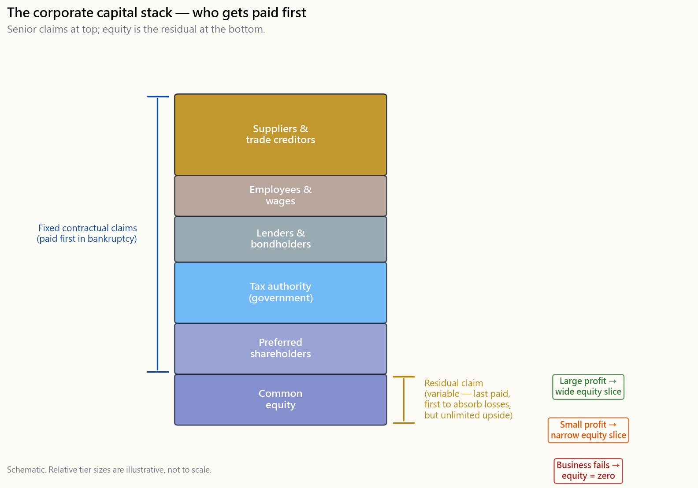
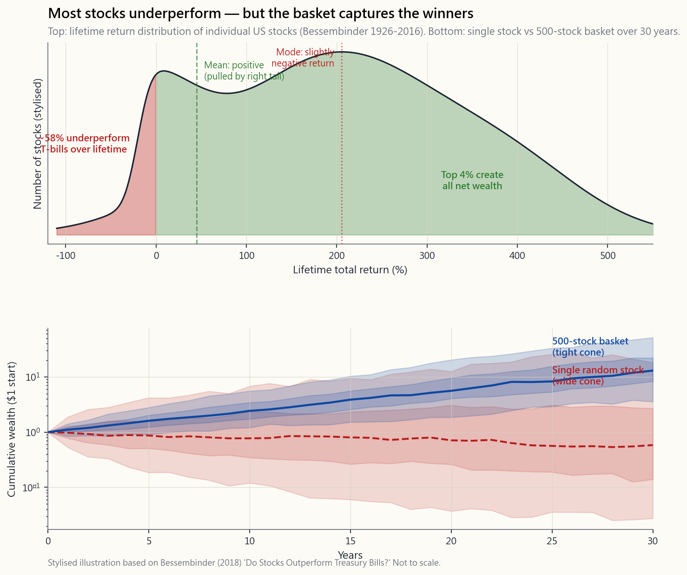

# 第七週：股票與股權——擁有一家企業的一部分

---

## 第一部分：閱讀單元

---

### 1. 為什麼這很重要

在本課程的前六週，我們一直在談論「股票」，彷彿每個人都已經知道它是什麼。60/40 投資組合持有 60% 的股票。指數基金將數千支股票打包在一起。股權風險溢酬是長期持有股票的報酬。但我們從未真正打開這個箱子，問過最基本的問題：**股票是什麼，擁有一支股票又意味著什麼？**

誠實的答案只需兩句話。**股票是對一家真實企業的部分所有權股份——而在建構這個市場的資本主義制度中，所有權意味著控制該企業、重新配置其資本，並指揮其員工的權利。**  **股權是在企業向所有人清償之後，剩餘資產的剩餘索取權。** 這兩句話包含了解釋股票為何上漲、為何崩跌、為何單一股票充滿風險而一千支股票的行為卻像一個資產類別，以及為何螢幕上的價格有時會與企業的實際價值相差甚遠——且差距可能持續數年——的全部原因。

你需要理解股票與股權，原因有四。

1. **若不理解，課程其餘的部分就只是死記硬背。** 你可以死記「股票長期實質報酬率約為 7%」。但在遭遇 50% 的回撤時，你無法*相信*它、無法*堅持*持有，也無法推理*為何*這個 7% 的數字是這樣來的——除非你理解那個籃子裡裝的究竟是什麼。7% 不是圖表上的魔法數字，也不是「一家典型企業」的報酬率。它是一個*精心篩選的倖存者*籃子的報酬——一個之所以存在，是因為指數悄悄剔除了失敗者的數字。
2. **股權在所有資產類別中獨一無二。** 債券是固定的契約承諾：一連串的票面利率支付與面額的返還。現金是對中央銀行的索取權。黃金不代表任何索取權——這正是它的本質。股權則是*剩餘索取權*——在員工、供應商、稅務機關和債券持有人全部獲得清償之後，所剩下的一切。這個剩餘部位賦予股票不對稱的報酬結構：分配右側有龐大的上行空間，而當企業倒閉時，左側則可能全數歸零。
3. **它是通往財務報表分析的橋梁。** 下週我們將開始研讀損益表、資產負債表和現金流量表。除非你已經將自己持有的股份視為這些報表所描述之企業的一個切片，否則這一切都毫無意義。財務報表是你所購買資產的*X光片*。
4. **它是分散投資之所以有效的基礎。** 關於股票最具影響力的觀察是：*個別*公司以令人沮喪的規律走向失敗——長期來看，幾乎所有企業最終不是倒閉就是淪為無關緊要——而*指數*之所以能持續複利增長，恰恰是因為它剔除了失敗者、納入了倖存者。單一個股的非系統性風險並非透過大數法則的某種魔力而「分散掉」；它是*透過指數的編製規則而被移除的*。我們在第二週以指數基金的語言觸及了這個概念；這週我們要深入研究指數內部究竟裝著什麼，以及為何這至關重要。

本課程涵蓋：一家公司實際上*是*什麼（以及為何這個選擇很重要）、擁有一家公司意味著什麼、股權在資本結構中的位置、盈利轉化為股東財富的四種方式、市值與帳面價值之間的落差、為何單一股票是一場賭博而*精心篩選的*籃子是一個資產類別，以及幾乎造成散戶投資人每一個行為錯誤的價格與價值落差。

---

### 2. 你需要了解的內容

#### 2.1 什麼是公司？兩種視角

在我們說清楚股票*擁有*什麼之前，我們必須先說清楚公司*是*什麼。商學院教導兩種觀點，它們會導向不同的投資組合。

**觀點（一）：公司存在的目的是創造利潤。** 利潤是目標；其他一切——產品、員工、顧客、使命——都只是達成目標的手段。在這種觀點下，管理層唯一正當的職責是最大化股東報酬。如果存在報酬率更高的資本用途，現有業務就應該清算，並將資本重新導向。這是米爾頓·傅利曼（Milton Friedman）的框架，自 1970 年代以來在美國商學院佔主導地位，至今仍是大多數企業董事會的官方意識形態。

**觀點（二）：公司必須創造利潤，才能持續存在——這樣它才能繼續做它真正存在的事。** 利潤是*約束條件*（你不可能永遠虧損而存活），而非*目的*。目的是企業公開宣稱要做的事（製造汽車、設計晶片、販售咖啡），或者它不那麼公開地追求的事（鞏固創辦人的遺產、資助政治議程、延續家族控制）。在這種觀點下，對一家企業最終極的基本面分析不是「它的利潤率是多少」，而是**「它能否生存*並且*仍然在做它真正存在要做的事？」**

本課程從觀點（二）的角度撰寫。這兩種觀點在大多數時候是重疊的——一家無法創造利潤的企業也無法做任何其他事——但在每位投資人最終都會遇到的兩個實際情境中，它們會出現分歧：

- *一家已失去目的的獲利企業。* 它的帳面數字依然好看，但創辦人已離去，企業文化已被掏空，產品是為了季度利潤率而管理，而非著眼於長期競爭力。觀點（一）說持有；觀點（二）說存活倒數計時已經開始，而且數字終將跟上。
- *一家幾乎沒有利潤但毫無疑問在做它存在要做之事的企業。* 觀點（一）說賣出；觀點（二）說先問存活約束條件是否得到滿足。如果是，這往往是一家藏身於薄利之後的長期複利增長企業。

在本課程中，你將同時使用這兩個視角。觀點（一）告訴你何時該減碼。觀點（二）告訴你何時該在難熬的年頭咬牙持有。缺少其中任何一個，你將在下一支複利增長股上過早出場八年，同時在下一具僵屍企業上苦撐十年。

#### 2.2 股票作為部分所有權股份——以及所有權真正意味著什麼

一家上市公司有固定的*流通股份*數量——假設是 20 億股。如果你擁有一股，你就擁有該公司的二十億分之一。這不是比喻，也不是行銷說詞。這是一項具有法律強制力的財產權利。

在*私人*企業中，那個二十億分之一將是一個真實的營運索取權——你在決策桌上有一席之地，你對策略的看法舉足輕重，你將參與決定公司的走向。在資本主義體制中，所有權最根本的權利是*控制權*：資本的所有者決定要建造什麼、要雇用誰、要解雇誰，以及如何運用企業所產生的現金。這就是「所有者」這個詞在歷史上的含義——那個可以重新配置資本並指揮員工的人。

對於持有一家市值 3 兆美元巨型企業 100 股的散戶投資人而言，那個營運權利*在技術上確實存在，但在實際上幾乎等於零*。最大的被動投資管理機構（Vanguard、BlackRock、State Street）在大多數標準普爾 500 指數成份股中，合計掌握 20–25% 的投票權。內部人持股和少數積極股東基金掌握了大部分其餘的投票權。你的一百股既無法重新配置資本，也無法指揮員工。你只是在參與別人對這兩件事的決定。

那麼，那個二十億分之一在實際上賦予你什麼權利？

- **對企業所產生現金的索取權**——以股利和庫藏股回購的形式*支付給*你，或以保留盈餘的形式*再投資於*企業，在後者的情況下，企業本身不斷壯大，而股份對未來現金流的索取權也隨之增長。股票價格（最終）會反映這個不斷增長的索取權。
- **對企業行動之股權式結果的索取權**——收購、合併、分拆。如果一家私募基金或更大的競爭對手以每股 80 元收購這家公司，而先前股價是 50 元，那麼你的部分持股將與所有其他持有者獲得相同的每股收購價。歷史上，站在被收購的一方，是散戶部位獲得一筆突如其來豐厚報酬的較為可靠的方式之一。
- **對股東事項的按比例投票權**——董事選舉、重大收購、核數師、章程修訂。這個權利確實存在。基於原則去行使它；但對於散戶規模的持股，不要期望在實際上產生任何影響。
- **在清算時對淨資產的剩餘索取權。** 這一項在教科書中排在最後，在你的思考中也應如此。在真實的破產程序中，優先索取權和律師費用通常在股權層拿到任何東西之前，就已耗盡了剩餘的資產價值。這個權利確實存在；它幾乎從未值得在你的決策中加以考量。

誠實的心理模型是*沒有任何營運發言權的少數合夥人*。你和其他 19.9 億名被動合夥人聘用了一位執行長來經營一家企業。執行長和董事會控制著這家企業。你收取（或收取不到）企業所產生的一部分果實，你可以在任何交易日的任何一秒在深度流動的市場中出售你的持份，而且如果有人想收購整家公司，你可能以溢價出場。這與和四個朋友共同經營一家咖啡館不同——假裝是一樣的，會導致一系列我們即將糾正的思維謬誤。

#### 2.3 資本主義、資本，以及這個資產類別存在的原因

值得在「資本主義」的「資本」這個詞上稍作停留，因為股票市場的整個意義在於：它讓資本流向最能善用它的企業。

一家企業需要資本來建造工廠、雇用工程師、資助研發，以及在顧客付款之前支付營運資金。有兩個來源為這些資本提供融資：**債務**（企業借款並承諾按固定時程還款）和**股權**（某人以換取對企業最終產生之一切的永久剩餘索取權為代價，向企業提供資金）。股票市場是這些股權索取權在發行後得以易手的次級市場。

這是股權存在的結構性原因。債務以固定票面利率約束企業；股權則*資助*企業並分享上行空間。資本主義作為一種經濟體系，將現實世界的資源分配給它認為能產生最多未來現金流的企業——而股票市場的*價格機制*，正是每日進行這種分配的投票機器。當一支股票的價格上漲，公司可以以更高的價格發行新股並以低成本籌集資金。當價格下跌，資金成本上升，公司陷入資金匱乏。價格*就是*資源配置的訊號。

這有一個散戶投資人常常忽略的推論。**你不需要成為巴菲特式的長期所有者才能在股票中賺錢。** 資本主義的價格發現機制創造了合理的較短期獲利方式：

- 你可以識別一家股價更接近清算價值而非營運價值的企業，並持有到差距收斂（深度價值投資）。
- 你可以識別一個被動資金正在拋售的類股，並買入指數暫時放棄的東西（均值回歸）。
- 你可以買入你認為可以以更高價格賣給資訊較不充分之買家的標的（博傻理論、動能）。在 2010 年代和 2020 年代通過市場獲勝的大多數人，都是在這裡獲勝的，而非透過巴克夏式的基本面長期持有。

本課程以長期視角作為*預設*框架進行教學，因為在最長的樣本上，它是最可靠的。但它並不假裝短線翻轉是不合法的。價格機制同時獎勵耐心的所有者和時機掌握得當的短線投資者。它唯一始終懲罰的，是既沒有投資期限、也沒有投資論點的交易者。

#### 2.4 股權作為剩餘索取權——資本結構

理解股權*財務*地位最清晰的方式是**資本結構**。假設一家公司在一年內產生 1,000 元的營收。現金按固定順序流出：

| 順序 | 索取人 | 所獲內容 | 地位 |
|---|---|---|---|
| 1 | 供應商 | 銷貨成本 | 優先 |
| 2 | 員工 | 薪資 | 優先 |
| 3 | 貸款人／債券持有人 | 利息支出 | 優先 |
| 4 | 稅務機關 | 所得稅 | 優先 |
| 5 | 特別股股東 | 固定特別股股利 | 次順位 |
| 6 | **普通股股東** | **剩餘部分** | **剩餘索取** |

普通股股權位於資本結構的最底層。其他所有人都依契約固定條款優先獲得清償。完成第 5 步後所剩下的現金才屬於股權持有人——可以保留在企業內部（保留盈餘），也可以分配（股利和庫藏股回購）。由此產生兩個推論。

**推論一：當企業表現良好時，股權捕獲上行空間。** 債券持有人的獲利上限被限定在票面利率——一張 9% 票面利率的債券，無論這一年多好，都只支付 9%。供應商按發票金額獲得清償。員工按薪資加上也許的獎金獲得報酬。這些當事人都不參與*成長*。如果企業的利潤翻倍，那額外利潤的每一塊錢都流向剩餘索取人——即股權持有人。那個不斷增長的剩餘，要麼以股利或庫藏股回購的形式落入你的券商帳戶，要麼被重新投入企業，並體現在股票價格上。

**推論二：當企業表現不佳時，股權首先承受下行損失。** 糟糕的一年意味著優先索取人仍然優先獲得清償。利潤萎縮。股權持有人承擔差額。在極端情況——破產——下，債券持有人對優先無擔保債務的回收率通常在面額的 30–60% 之間，次順位債券往往更低；普通股幾乎總是歸零。2008 年雷曼兄弟 5.625% 2013 年到期優先無擔保債券的持有人，在歷經多年程序後，最終回收了大約 21 美分（兌每一元面額）；雷曼普通股的持有人則一無所獲。

關於債券持有人，有一個實務上的注意事項。教科書的回收率百分比假設破產程序以有序的方式進行。現實中，管理整個程序的律師、顧問和受託人，可能在任何現金到達無擔保債券持有人之前，就已消耗了剩餘資產的一大部分。如果你發現自己持有一家正滑向違約之公司的債券，實際的決策很少是「等待回收」；通常是「賣給有能力應付法律程序的困境債務專家」。律師費用的消耗，正是教科書回收率數字與實際散戶持有人所見數字可能相差一半的原因。

股權的*不對稱性*——巨大的上行空間，下行損失以零為底（在多頭部位中，你的損失不可能超過你的投入）——正是讓它*值得持有*的原因，儘管任何單一個股都存在全數歸零的風險。債券的報酬恰好相反：上行有限（票面利率），下行不對稱（扣除回收後的違約損失）。股權風險溢酬——美國股票市場在漫長的歷史中，每年比國庫券多賺取的約 4–6%——是市場對承擔不對稱*下行風險*（作為最後獲得清償者）以換取優先參與成長之不對稱*上行空間*的補償。

#### 2.5 為何「股票複利增長」——以及倖存者偏差的星號

你將在每一本教科書和每一封券商行銷郵件中看到同樣的頭條數字：美國股票在過去一百多年來，扣除通膨後的年報酬率約為 7%（西格爾的《長線獲利之道》；相應的名目數字約為 10%）。這個數字是真實的，在其從數據中計算出來的意義上確實如此。但大多數課程附加於其上的*詮釋*是錯誤的，而錯誤的詮釋會產生錯誤的投資組合。

**錯誤的故事。**「一家典型的企業以 10% 的股東權益報酬率運作，將一半再投資、配發一半，因此其盈利能力每年以 5% 的速度複利增長。股東另外收取 2–3% 的股利和庫藏股回購。加上一點通膨，你就得到了 7–10% 的長期報酬——這是股權所有制的自然算術。」

這個故事內部自洽。它也是對*倖存者*企業面貌的描述，而非對普通企業實際狀況的描述。誠實的版本是：

**正確的故事。** *指數*以 7–10% 的實質報酬率複利增長。*十年前在指數中的平均個別公司*則肯定沒有。大多數公司，包括曾在美國交易所交易的大多數公司，最終都歸零或淪為無關緊要。許多公司從未成長過——它們以平淡的方式賺回資金成本，然後在一場收購或緩慢衰退中消失。7% 的數字來自少數幾個以 10 倍和 100 倍報酬率撐起整個籃子的名稱，加上*指數編製規則*沿途悄悄剔除失敗者的作用。

這是**倖存者偏差**最尖銳的形式。今天的標準普爾 500 指數並非 1990 年的標準普爾 500 指數。大約一半的成份股已被替換——伊士曼柯達、寶麗來、西爾斯、雷曼兄弟、貝爾斯登、舊版奇異電氣、舊版通用汽車，以及數百家其他企業，或因規模縮減跌破門檻而被剔除，或因破產而被移除；而蘋果、微軟、輝達、特斯拉、Meta、Alphabet 以及一長串其他企業，則在攀升途中被納入。這個每年以 10% 複利增長的指數，實際上是一個**主動篩選的投資組合**，具有一套以規則為基礎的機制，用於剔除輸家、納入贏家。它並非對「平均企業」的被動押注。

這對你閱讀本課及課程其餘部分的方式，有三個直接的推論。

1. **股權複利增長作用於*指數*，而非*平均個股*。** 當有人告訴你「只要持有三十年，你就能得到 7%」，他們靜靜地假設你是通過一個沿途剔除失敗者的投資工具持有的。持有隨機選取的個股三十年，其報酬分布會*非常*不同。
2. **再投資賺取投入資本報酬率的故事，對*倖存者*是成立的，** 而指數在很大程度上*就是*倖存者。故事中的平庸企業並不是保持平庸——它通常*死去*，並悄悄地在你持有的籃子中被替換掉。
3. **你要麼需要讓籃子足夠寬廣，以確保倖存者在數學上必然在其中；要麼需要下工夫去識別倖存者。** 7% 的長期數字不是靠著被動地守在任意選取的十支股票投資組合旁邊得來的。它是靠著坐在一個編製規則本身就是存活篩選器的投資工具中得來的，這個過濾全程自動運作、免費執行。

這是第二週告訴你從廣泛指數基金起步的最深層原因——不是因為指數投資「簡單」或「被動」（從行銷語言暗示的意義上來說，標準普爾 500 指數一點都不被動），而是因為指數的編製規則*本身就是*存活篩選器，免費、自動地為你執行。

#### 2.6 四（加一）個管道——利潤如何轉化為股東財富

一家獲利的企業可以用其賺取的現金做的事情，選項其實很有限。每一種方式都成為你總報酬的不同組成部分。

1. **保留盈餘並再投資於現有業務。** 再建一座工廠、雇用更多業務人員、資助研發、擴展到新的地區。如果再投資的報酬率高於資金成本，這將*提升每股盈利能力*——而股票價格會向上重新定價，以反映更高的未來盈利流。對於高投入資本報酬率的成長股，這是壓倒性的主要管道：股東報酬完全體現在資本利得上，完全沒有股利。
2. **配發股利。** 直接將現金匯給股東。真實的錢進入券商帳戶。在美國，合格股利按長期資本利得稅率課稅（目前依所得級距為 0%/15%/20%，高收入者另加 3.8% 的淨投資所得稅）；一般股利和大多數海外股利按一般所得稅率課稅。成熟的企業，高報酬率再投資機會有限——公用事業、民生消費品、整合型石油公司、不動產投資信託——會將大部分盈餘作為股利返還。

   *補充說明：退休人士的股利與債券票面利率比較。* 許多退休人士被高股利股票所吸引，因為表面殖利率看起來與國庫券相當。歷史上的比較並不簡單。在 1928–2024 年的樣本中，標準普爾 500 指數的股利殖利率平均約為 3.5%，10 年期國庫券殖利率平均約為 4.8%，但這兩者的*關係*在不同時代之間發生了戲劇性的移動——在 1930 年代至 1950 年代，股利殖利率普遍*高於*國庫券殖利率；從 1960 年代到 2000 年代初期，則*遠低於*國庫券；而自此之後，大致上*持平或低於*國庫券殖利率。如果兩者是完全可互換的索取權，這個差距早就被套利消除了。它之所以沒有，是因為兩者*並非*可互換：股利可以被削減（在經濟衰退中，大約 5–10% 的配息企業確實如此），而在你需要收入的那一年，標的股票可能下跌 30%，況且股權層承擔了國庫券根本不承擔的業務風險。實務原則是：將配息股視為具有收益傾向的*股票*部位，而非高殖利率的債券替代品。我們將在補充閱讀 10 中回頭討論這一點。

3. **進行庫藏股回購。** 用現金在公開市場上回購公司自身的股票並予以註銷。流通股份數量下降；你的二十億分之一變成了十九.五億分之一，而你對每一塊未來利潤的索取權也按比例上升。從數學上看，以公平價值進行的 1 元庫藏股回購，與 1 元股利完全等同——只是稅務性質遞延至股東最終出售時才確認。這個遞延稅務效果，是美國大型股自 1990 年代以來傾向庫藏股回購而非配發股利的一半原因。另一半原因是**高階主管薪酬**。大多數高階主管的薪酬主要以股票選擇權和限制性股票支付；他們的個人報酬直接取決於股票價格，而非股利殖利率。庫藏股回購拉抬股票價格（股份減少、盈餘不變、每股盈餘數字提升，通常連本益比倍數也跟著提高）；而配發股利則將現金平等地移轉給所有股東，並不改變股份數量。財務長很少對這兩種結果無動於衷。

4. **收購另一家企業。** 用現金（或股票）買下另一家公司。這是資本用途中變異數最高的一種。做得好的時候——被收購的企業與收購方現有業務契合，且出價紀律嚴明——它能使股東財富複利增長。做得差的時候——而長期學術證據顯示，*大多數*大型併購確實為*收購方*股東摧毀了價值——這是你所持有之企業切片中的現金，向賣方銀行帳戶的永久性轉移。

還有第五個管道，不出現在大多數教科書的清單上，因為它是*發生在*公司身上，而非*由*公司選擇的：

5. **被收購。** 如果一家競爭對手或私募基金買下你持有的公司，交易通常以比當前股價溢價 20–40% 的條件達成。你的持份將與所有其他持有者獲得相同的每股對價。這是管道四的鏡像——如果收購高價企業為買方摧毀價值，那麼*被*收購的公司則為賣方帶來意外之財。在長期樣本中，收購溢價並非雜訊；它們是股票報酬中一個真實、反覆出現的組成部分，在收購活動最密集的小型股和中型股領域尤為突出。

對於長期股東而言，一支股票的*總報酬*可以分解為：（一）每股盈餘的變動、（二）所收取的股利，以及（三）估值倍數的變動（本益比）。在數十年的維度上，（一）和（二）佔主導地位；在數月的維度上，（三）佔主導地位。這就是同一個資產類別，在長期看來是極佳的持有標的，而在中期看來卻是殘酷的盯市考驗的結構性原因：不同的時間維度強調不同的組成部分。

#### 2.7 為何股票是不完美的通膨避險工具

第一週將投資定義為對抗通膨的戰役：持有現金，儲蓄的購買力就會年復一年地縮水。現在正是將那個論點與我們剛剛開啟的資產連結起來的好時機。**現金是固定名目請求權。債券大多是固定名目承諾。股票則是一家企業的所有權，而該企業的名目現金流可能隨著物價水準成長。** 這一句話就是整個機制——本小節其餘部分則是細述其運作方式與失效之處。

從§2.4的剩餘請求權角度出發。債券持有人被承諾固定金額的美元：票面利率現金流與本金返還。若債券存續期間的整體物價水準翻倍，美元確實如期到帳，但每一元的購買力減半。合約是*名目的*。通膨是債券持有人看不見的交易對手風險。

股票在結構上截然不同。你持有的不是以特定美元金額支付的承諾，而是一家真實企業的部分所有權，這家企業以*當日現行美元*為商品和服務定價。當整體物價水準上升時：

- 連鎖咖啡店調漲菜單售價。
- 民生消費品公司調漲架上售價。
- 軟體廠商以更高金額續簽企業合約。
- 工業企業調漲報價以反映更高的投入成本。
- 廠房、土地、品牌與存貨的重置價值隨物價水準上升。

若一家公司擁有**定價能力**——能夠將漲價轉嫁給顧客而不流失客戶——名目營收便會隨通膨上升，名目盈餘趨於跟進，而§2.6中的四加一管道（保留盈餘、股利、庫藏股回購、收購、被收購）全部以名目上更大的金額流通。資本結構底層的剩餘請求人最終擁有一家*名目上更大*的企業。就長期而言，這正是為何廣泛股票指數在歷史上保護購買力的能力優於現金和大多數名目債券。

這是本課程一再引用的著名**7%實質報酬**數字背後的觀點——由傑瑞米·席格爾（Jeremy Siegel）在其著作《長線獲利之道：散戶投資正典》（*Stocks for the Long Run*）中橫跨約兩個世紀的美國股票資料所測得。*實質*意指已扣除通膨後。扣除消費者物價指數後仍剩一個正數，這是上述機制的實證印記：整體企業現金流大致隨物價水準成長，加上來自生產力提升與再投資的實質溢酬。

然而，通膨避險特性是**不完美的**，如實面對這種不完美，比教科書「股票勝過通膨」的口號更為有用。

1. **定價能力並不一致。** 有些企業可以自由調漲價格（可口可樂、ASML、查理·蒙格當初買入時的喜詩糖果）。其他企業在全球市場中以商品產出競爭，無法調漲（航空公司、多數鋼鐵製造商、通用記憶體晶片）。在持續通膨期間，指數是兩類企業的平均。
2. **成本也會通膨。** 薪資上升。原物料上升。能源上升。企業究竟能*捕獲*通膨以提升盈餘，還是*拱手相讓*而壓縮利潤率，取決於價格端與成本端哪一方重新定價的速度更快。
3. **折現率上升。** 通膨通常迫使中央銀行調升短期利率，進而拉高市場對未來現金流採用的長期折現率。即使名目盈餘按計畫成長，驅動股價的現值計算分母也會變大。算術機制是確定的：折現率升高→本益比倍數下降。
4. **高通膨時期倍數收縮。** 這是歷史規律，而非理論。從1966年到1982年左右——亞瑟·伯恩斯（Arthur Burns）與保羅·沃克（Paul Volcker）早期執政期間——美國消費者物價指數以高個位數乃至雙位數的速度攀升。標普500在這段期間以*名目*美元賺取盈餘，但本益比倍數從十幾倍跌至個位數。整個窗口期間的實質報酬大致持平。儘管底層企業在名目上隨物價水準成長，股票仍未能在五年逐市計價的基礎上保護投資人。
5. **避險效果在長期有效，在短期無效。** 在滾動十年以上的窗口中，廣泛美國股票的報酬明顯超越消費者物價指數。但在消費者物價指數意外走升期間的滾動一年至三年窗口中，股票可能*與*債券一同下跌——2022年是最近的提醒，標普500名目跌幅約18%，美國60/40投資組合創下有記錄以來最糟糕的年份之一。

剩餘請求權資產的實務結論：

- **長期通膨避險：是的。** 一籃子具備定價能力的高品質企業，持有橫跨數十年，歷史上名目現金流的成長大致與物價水準同步，甚至更快，股東的請求權也隨之成長。
- **短期消費者物價指數避險：不。** 當通膨*當下*意外走高，股票可能*當下*與債券一同虧損，因為折現率效應反應迅速，而盈餘成長效應反應緩慢。這個缺口正是抗通膨債券（TIPS）、黃金與原物料所設計填補的——這也是為何即便對相信長期股票報酬的投資人而言，嚴肅的投資組合也不應100%持有股票。

將§2.6與§2.7合在一起，你便得到本課程自第一週以來一直指向的通膨論點。企業以現行物價水準出售商品。其盈餘、股利、庫藏股回購和替代資產價值隨時間跟隨物價水準成長。剩餘請求人——你，股東——擁有這條名目上不斷成長的現金流的一份所有權。現金和債券無法給你這些。機制是真實的。時機是不可靠的。這兩句話必須同時存在於腦海中，才能讓本課程接下來的內容具有意義。

#### 2.8 市值、帳面價值，以及兩者為何不同

每位投資人每天都會看到這兩個數字，但大多數人從未真正區分它們。

**市值**是股價乘以流通在外股數。這是市場目前*估算*整個股票層所代表的價值。200美元股價 × 150億股 = 3兆美元市值。這是股票投資中最重要的單一數字，原因只有一個：**指數納入規則以市值決定哪些公司進入你的籃子，以及各自的權重。**

- 標普500從市值超過一定門檻的美國公司中選股，該門檻隨市場浮動（目前約為150億至200億美元），並依各成員的自由流通市值加權。規模越大，在指數中的權重越高。
- 羅素1000涵蓋美國市值最大的約1,000家公司；羅素2000涵蓋其後的2,000家。
- MSCI全球市場指數以自由流通市值對每個成員國加權。

結構性含義：**指數是以市值為基礎的動能機器。** 一家市值從50億美元成長至500億美元的公司，在上漲過程中帶動指數走高，同時在指數中獲得更大的權重。一家市值從500億美元跌至50億美元的公司，在下跌過程中權重縮小，最終遭到剔除。「被動型」標普500在這個意義上是一個主動式管理的動能投資組合，再平衡規則已預先設定。

**市值分層**是業界通用的工作詞彙：

| 分層 | 大致範圍 | 代表意義 |
|---|---|---|
| 超大型股 | > 2,000億美元 | 主導指數，決定標普500報酬 |
| 大型股 | 100億至2,000億美元 | 標普500的主體 |
| 中型股 | 20億至100億美元 | 跨越第一道門檻的倖存者；許多未來的大型股在此孕育 |
| 小型股 | 3億至20億美元 | 羅素2000的領地；失敗率高，偶有十倍股 |
| 微型股 | < 3億美元 | 大多是雜訊，流動性差，由故事而非業務主導 |

中型股層次值得單獨說明。一家市值已突破10億美元、具備獲利能力且營收持續成長的公司，已經跨越了第一道重要的生存門檻。從統計上看，下一個十倍成長更可能來自這個層次，而非其下的微型股（大多是雜訊），也非其上的超大型股（已經夠大，再漲十倍在數學上極為困難）。標普500的納入規則——隱含「必須達到超大型或大型股上緣且具備穩定獲利能力」的篩選標準——本身就是一種粗略的事前優勝者辨識機制。這與上述存活者偏差章節並不矛盾，而是從另一面看同一個論點。指數是經過篩選的，*恰恰因為*套用粗略篩選確實能比隨機選股表現更好。

**帳面價值**（資產負債表上的「股東權益」）是會計上的替代指標。以會計師記錄的價值計算所有資產，減去所有負債，餘額即為股票的*帳面*價值。帳面價值是若企業以記錄價格出售所有資產、清償所有債權人後，（理論上）應移交給股東的金額。

這兩個數字*幾乎從不相等*，差距本身具有意義：

- 市值 >> 帳面價值：市場認為該企業的價值遠超過其會計淨資產，通常是因為無形資產（品牌、軟體、網路效應）或帳面無法捕捉的成長選擇權。多數現代科技公司屬於此類。
- 市值 < 帳面價值：市場認為記錄的資產價值被高估，或企業無法在這些資產上賺取足夠的報酬。這是深度價值投資的領域——有時是真正的撿便宜，有時是價值陷阱。
- *負*帳面價值：總負債超過總記錄資產。這可能由兩種截然不同的原因造成，但在資產負債表那一行上看起來完全一樣。**(i) 以高於帳面價值的價格積極回購庫藏股。** 波音、麥當勞和菲利浦莫里斯都曾在不同時期出現負帳面價值，正是因為它們多年來以高於會計帳面價值的價格持續回購股票，逐步拉低股東權益。這是會計上的人為現象，而非財務困境的訊號——只要現金流量表仍顯示正數的營業現金流，企業就是健康的。**(ii) 累積虧損。** 公司虧損時間過長，或承受過大的減損，累積損失已侵蝕整個股東權益層。這是真正的償債能力警訊。這兩種情況*無法*僅從資產負債表那一行加以區分；必須閱讀現金流量表才能辨別。相關診斷方法將在第8週以及第三級的信用分析課程中介紹。

帳面價值對*資產密集型*企業（銀行、不動產、資本密集型工業企業）最具參考價值，因為這類企業的記錄資產價值近似清算價值。對*輕資產*企業（軟體、消費品牌、市集平台）最缺乏參考價值，因為這類企業的大部分價值存在於會計師無法記錄的無形資產中。

#### 2.9 為何單一股票有風險，而*精心挑選的*一籃子股票則不然

關於個股，最重要的事實是：*它們會失敗*。亨德里克·貝森賓德（Hendrik Bessembinder）在2018年針對1926年至2016年間所有曾在美國交易過的股票所做的研究發現，**只有4%的股票貢獻了美國股市的全部淨財富創造**。其餘96%的整體報酬大致與持有國庫券相當。超過半數的個股在買進持有的基礎上*摧毀*了股東財富。中位數股票的終身報酬遜於現金。

這不是筆誤。這並非意味著股市是糟糕的投資。這意味著股市的報酬*集中在少數名字上*，而可靠地持有這些少數名字的唯一方式，要麼是（a）事前花工夫辨別它們，要麼是（b）持有一個建構規則保證它們最終進入你的籃子的工具，無論你是否預測到。

這對投資組合設計有兩個影響。

**第一**，單一股票的買進持有部位承擔著非系統性風險，而這種風險並未獲得*事前*保證的額外報酬補償。你無法真正計算一支股票的「預期報酬」——只能在事後觀察其實際報酬，並對*可能報酬的分布*進行推理。個股的實證分布左尾厚實（失敗），中央厚實（平庸的存活），右尾細薄（超級贏家）。對於隨機挑選的任何單一股票，落在左側或中間的可能性遠大於落在右尾。

**第二**，一籃子股票之所以有效，其數學原理並非某種模糊意義上的大數法則取平均。而是分布的*右尾*——少數超級贏家——幾乎必然出現在任何*具備存活規則*的足夠廣泛的籃子中。標普500的市值加權與季度再平衡正是這樣的規則：凡是成長進入前500名的企業就納入；凡是縮水退出的企業就剔除。當你買入SPY時，並非真的在「買入」所有美國股票的平均。你買的是*精心挑選的前500名倖存者加上新星*，獲得其市值加權成長，而失敗微型股的左尾已通過指數建構被乾淨地移除。

這一點很重要，因為它改變了「被動」的真正含義。以下三種主張之間存在重要差異：

- *「挑選五家最愛的公司並買入」* ——高波動性，高度取決於你的五家是否碰巧包含右尾贏家。貝森賓德分布會吞噬這個投資組合。
- *「挑選100家合理的公司——例如那斯達克100——並買入」* ——統計性質截然不同。非系統性風險大幅降低，且在現代資料的多數多十年窗口中，那斯達克100的歷史報酬超越標普500，正是因為其建構規則偏向股票分布的右尾（大型股、創新導向、非金融業）。羅素3000涵蓋幾乎所有可投資的美國股票；那斯達克100、標普500與道瓊工業平均指數各自對同一底層宇宙套用*不同的*篩選規則，得到*不同的*長期報酬。
- *「類股傾斜、因子傾斜，以及指數減去已知地雷」* ——完全合理。無需成為巴克夏風格的選股人也能在市值加權指數之上創造價值。你可以買入標普500*減去*你認為處於結構性衰退的類股。你可以超配被動資金流目前缺席的類股。你可以放空慢動作的崩潰列車。這些都不需要「只買指數」這一派的行銷話術隱含地告訴你、若要進一步操作就必須具備的傳奇選股能力。*「除了買市值加權指數之外，做任何事都需要高超的選股能力」*是金融顧問的說辭——對指數基金銷售者方便，但並不嚴格正確。

更深層的規則很簡單：**永遠持有依某種規則挑選的一籃子股票**——無論是你自己的規則還是別人的規則。這個籃子可以是主要指數、類股指數股票型基金、指數減去已知地雷，或是每個名字都有書面論點的精選十幾支股票。它不能是從新聞頭條隨機挑選的五個最愛，因為那正是貝森賓德分布會吞噬的投資組合。

#### 2.10 股票價格與企業價值——誠實的版本

股份是對*企業*的請求權。任何特定秒鐘的股份*價格*是買賣雙方持續雙向競價的結果。長期而言，這兩個數字趨於收斂——市場從長期看是一台**真相機器**。在幾個月或幾年的時間裡，兩者可能大幅背離。差距的大小取決於市場狀態與資金流向。

有三件事值得釐清，因為教科書的*市場先生*故事將它們全部略去。

**(i) 市場並非完全資訊的清算所。** 古典「效率市場」框架——每一個事實在可知的瞬間便已反映在價格中——作為*預設立場*很有用，因為它阻止你以過時資訊交易。但作為市場實際運作方式的描述，它在實證上是錯誤的。你的交易對手方不是「所有投資人的集體智慧」；而是高頻做市商、統計套利基金、量化趨勢跟隨者、自營商避險資金流、來自7兆美元指數化資產的被動再平衡資金流、被批發商內部化的零售委託單，以及偶爾出現的慢動作基本面投資人的混合體。資訊會外洩——通過信用違約交換走勢與盈餘耳語是合法的，美國證券交易委員會每年查獲幾次的內線交易則不然。部分買賣方確實知道其他人不知道的事。價格是這個混亂生態系統的*當前清算結果*。

**(ii) 股票價格*確實*是對企業的衡量——只是有雜訊，且領先。** 從實證看，股價往往在「印證」其走勢的盈餘公告標題*之前*就已移動。這不是魔法；這是一個跡象，表明部分資金流擁有標題讀者尚未獲得的前瞻資訊。因此，正確的框架是：

> *市場價格是企業價值的即時估算，由一台龐大的分散式機器計算，這台機器在大多數時候掌握的資訊比你更好，在少部分時候掌握的資訊比你更差。你的工作是辨別那少部分時候。*

**短期而言市場充滿雜訊。長期而言市場是真相機器。** 兩半都重要。短期雜訊創造機會；長期真相使機會閉合。

**(iii) 螢幕上顯示的遠不止「單一數據點」。** 在任何真實的交易螢幕上，你看到的是最後成交價*加上*買賣價差（已經是兩個價格，而非一個）、委託簿頂端的第一層報價、其後深度的第二層報價、盤中成交量分布、各履約價與到期日的選擇權未平倉量（一個前瞻性的隱含分布）、放空量與借券成本、流通在外與流通股比例、盈餘公布行事曆、分析師預測區間、近期內部人士交易記錄。所有這些都是某種形式的*價格資料*，嚴肅的投資人會閱讀其中許多行，而不只是印出的最後成交價。我們將在第25至29週回到選擇權隱含分布的部分。

價格與價值差距的古典表述是班傑明·葛拉漢在《智慧型股票投資人》（*The Intelligent Investor*，1949年）中的*市場先生*比喻：想像你擁有一家私人企業的股份，合夥人是每天早上敲你門的市場先生，他每天提出一個報價，要麼向你買入你的股份，要麼以這個價格賣給你他的股份。這個比喻只有*一個狹義的用途*——提醒投資人並非每天都有義務與市場交易。不要延伸過度。2026年的「市場先生」不是一個情緒化的投票者；他是上述演算法、自營商與機構再平衡者的整合資金流，邊緣處有少量慢動作的基本面投資人。這套機器有時是錯的，但它的錯誤很少是因為它「情緒低落」。它的錯誤是因為前瞻資訊本就存在真實的不確定性，且不同參與者持有不同看法。

**波動性有時就是資訊。** 兩種情況在圖表上看起來相同，但底層截然不同：

- 市場在一週內因宏觀衝擊下跌8%，沒有任何公司特定消息。企業本身未發生任何變化。價格更便宜了；企業還是同一家；市場短暫出錯了。這是巴菲特描述的情況。
- 某支股票在一個月內下跌30%，三個月後核數師辭職。九十天前企業*確實*是同一家——腐爛早已存在——但市場比你先看見腐爛。價格下跌是資訊；企業*確實*變差了，市場先知道，消息後來才追上。這是「真相機器」的情況。

誠實的答案是：**在即時情況下，你通常不知道自己處於哪種情況。** 兩個故事都是真實的。紀律在於：(a) 保持部位規模足夠小，使任何單一持股下跌30%不會損傷家庭資產負債表；(b) 在將下跌視為買進機會之前，先問問是否有任何*基本面*真的發生了變化；(c) 接受有時市場走在你前面，正確答案是認賠了結，而非「攤平」成本進一場慢動作的崩潰。

**持有或賣出，以及成本基礎的無關性。** 你的成本基礎與你是否應繼續持有某部位的問題無關。從經濟學上說，今天持有一股股票的決策等同於今天買入那股股票的決策——在這個價格上，你是否願意將這麼多資本配置到這家企業？如果是，就持有。如果不是，就賣出。你兩年前的買入價格已是沉沒成本。成本基礎只對稅務目的有意義（洗售規則、長期與短期資本利得處理、稅損收割）。它不是投資論點的輸入變數。

#### 2.11 本節為課程後續內容的鋪墊

- **下週（第八週）——解讀財務報表。** 既然你已將股票視為真實企業的一個切片，損益表便成了獲利能力的成績單，資產負債表是清償能力的寫照，現金流量表則揭示申報的盈餘是否為真實現金。市場每季都在集體解讀這些報表；親自研讀，才能判斷市場的集體解讀是否正確。
- **第九週——股票指數。** 深入探討指數編製規則——市值加權、等權重、自由流通股數、類股上限——如何改變你實際買進的內容。
- **第十一週——行為偏誤與再平衡。** 散戶績效落後的最大根源，是試算表策略與親身承受30%回撤的人之間的落差。本週的框架——股價下跌有時反映企業基本面的新訊息，有時並不反映——為日後能讓你在兩種情境下都能存活的紀律性再平衡規則奠定基礎。
- **第二十一週——股票估值。** 如何估算可與股價對比的*價值*數字。現金流量折現法、倍數法、加總分部估值法——全都是三角測量本週所介紹之剩餘請求權現金流的嘗試。

下次你看到股票代碼時，強迫自己提問：

1. *這家企業在做什麼，管理層持哪種觀點——利潤優先還是使命優先？* 在不同框架下，你的推理方式會截然不同。
2. *其市值處於哪個區間，隨著規模擴張或收縮，其指數權重可能如何變化？* 資金流向跟著市值走。
3. *目前股價更接近企業的長期真實價值，還是資金流動所造成的暫時性錯位？* 若無法判斷，這本身就是有用的資訊——持有一籃子，而非單押個股。

---

### 3. 常見迷思

**迷思一：「股票不過是螢幕上的數字——一張漲漲跌跌的紙。」**

股票是對一家真實企業具有法律效力的所有權請求權，這家企業有真實的工廠、真實的員工、真實的客戶與真實的現金流。螢幕上的股價，是持續競價拍賣的當前出清結果。所有長期投資決策都應以企業本身為依歸；短期股價波動應被解讀為*資金流動*的訊號，同時誠實地考量：資金流動所知悉的訊息，是否尚未在基本面故事中揭露。

**迷思二：「持有少量股份，就能對公司營運產生實質影響力。」**

對於持有大型股少量部位的散戶而言，並非如此。這項權利確實存在；實際影響力則付之闕如。先鋒、貝萊德與道富在絕大多數標普500成分股中合計掌控20至25%的投票權；內部人士的持股則控制了大部分其餘票數。持有一百股是對現金流的財務請求權，而非公司治理的工具。

**迷思三：「股利是在股價之外額外獲得的『免費』報酬。」**

並非如此。派發1美元股利，會導致股價在除息日下跌約1美元。股利不是白來的錢；它是將1美元的企業價值從公司帳戶*轉移*到你個人帳戶的動作。在股利發放的瞬間，你的總財富（股票加現金）並未改變。股利的*唯一*經濟效果，是將未實現的股票價值轉換為已實現的現金，並隨之產生相應的稅務後果。

**迷思四：「庫藏股回購只是讓高管中飽私囊。」**

此說法確有幾分真實——高管的選擇權與限制性股票薪酬，確實使管理層在個人利益上偏好庫藏股回購而非發放股利——但這種框架並不完整。*在股價低於內含價值時*，庫藏股回購是將企業價值乾淨地移轉給留存股東（包括散戶）。*在股價高於內含價值時*，庫藏股回購在短期內拉抬股價（這正是高管選擇權得以兌現的管道），並在長期損害每股內含價值。身為散戶，你的防禦之道其實很簡單：若你不認同企業的經營方式，任何交易日的任何一秒，你都可以賣出持股。深度的公開市場流動性，是公開股權投資相較於私人合夥的真正優勢之一。

**迷思五：「只要挑選五家優秀企業，就能打敗指數。」**

貝森賓德分布告訴我們，五檔持股過於集中。五檔股票的投資組合，極有可能完全沒有囊括到右尾的超級贏家，在此情況下其績效將落後現金。**一百檔是另一回事。** 那斯達克100指數在現代數據的大多數數十年期間均超越標普500；標普500超越羅素3000；兩者都是比整體市場「更窄」的一籃子，但其編製規則篩選出分布的右尾。誠實的法則是**永遠持有一籃子**——五檔個人最愛過於集中；精心篩選、設有汰除規則的一百檔則不然。「除了買市值加權指數，你必須是天才選股者才能有所作為」是行銷說詞，而非事實。類股傾斜、因子投資傾斜，以及「指數剔除已知地雷」，都是不需超凡技能即可提升報酬的合理方式。

**迷思六：「一家公司不發股利，就等於沒有回饋股東。」**

原本可作為股利的現金，被留存並再投入企業。若管理層的再投入能賺取正向的資本報酬，每股對未來現金流的請求權就會增加相應金額，股價也將重新評價。股東報酬體現在股價增值而非現金分配上——經濟價值相同，只是換了一種稅務包裝，且通常還享有在實現稅負*之前*純粹複利滾動的額外好處。

**迷思七：「一檔股票已跌50%，必然是便宜貨。」**

有時是，有時不是。誠實的框架是：股價下跌在圖表上看起來完全相同，實則分為兩類：（a）市場短暫錯估了一家基本面未變的企業——此時下跌是買進機會；（b）市場在重大消息傳出前便已察覺業績惡化——此時股價下跌*就是*訊息本身，「逢低攤平」不過是在慢速災難列車上愈攤愈深。區分兩者，需要研究企業——財務報表、競爭地位、管理層素質。單憑股價下跌，永遠無法告訴你身處哪種情況。

**迷思八：「股票（stock）與股權（equity）是不同的東西。」**

在本文脈絡下，兩者可互換使用。*Stock*（股票）是金融工具；*equity*（股權）是其所代表的底層所有權請求權。當財經媒體說「股權反彈」，意思是股價上漲。當會計師說「股東權益為400億美元」，意思是所有資產減去所有負債後，企業的剩餘帳面價值。同一概念，不同角度。

**迷思九：「我錯過了在企業還很小時買進的機會，時機已過。」**

右尾贏家現象是股票市場的永久特徵，而非一次性事件。中型股（市值20至100億美元）正是下一批大型股的育成溫床。其中部分標的可以*事前*識別——乾淨的資產負債表、持久的利潤率、創辦人仍在掌舵、正在進入廣大可觸達市場——這並非無法實現的篩選條件。標普500的市值納入規則，本身就是這種篩選的粗糙版本，在自動運作。你無法以百分之百的確定性事前識別每一位贏家，但你可以做得比隨機選擇更好。

**迷思十：「成本基礎決定了我是否應該繼續持有一檔股票。」**

並非如此。今天持有部位的決策，與今天買進的決策相同——以目前的股價，你是否願意將這筆資金配置到這家企業？若願意，繼續持有。若不願意，賣出。兩年前的買進價格已是沉沒成本。成本基礎只在稅務管理上有意義：長期與短期資本利得的稅率差異、洗售規則，以及稅損收割。它從來都不是投資論點的輸入變數。

---

### 4. 問答

**Q1：如果股權是剩餘請求權，為何長期而言其價值高於優先順位的債券請求權？**

答：因為當企業表現良好時，剩餘請求權能捕捉到上漲空間，而優先順位的債券則以其票面利率為上限。縱觀所有企業結果的完整分布——大多數年份小幅盈利、少數年份極度豐收、偶有災難——股權不對稱的上漲潛力，平均而言足以補償其在清算順序中敬陪末座所承受的不對稱下行風險。這個超額報酬即為股票風險溢酬，在美國歷史上平均每年約比國庫券高出4至6%。它並非免費；你以我們下一節涵蓋的波動性與回撤作為代價。

**Q2：如何評估一家公司的留存盈餘是否在創造價值？**

答：簡易衡量指標是**投入資本報酬率**（ROIC）。取稅後營業利潤，除以企業所佔用的資本（負債加股權，減去多餘現金）。若ROIC明顯高於資金成本（美國大型股通常為8至10%），則每留存一美元的價值超過股東口袋裡的一美元——留存是正確選擇。若ROIC低於資金成本，則每留存一美元的價值不到一美元——股東寧願以股利或庫藏股回購的形式拿回。我們將在第十九週（公司財務）詳細演算。

**Q3：公司進行一拆二的股票分割後，我的持股是否翻倍？**

答：不。你的股數翻倍，每股價格減半。你對企業的請求權不變——在總市值相同的同一家公司，持有相同比例。股票分割是對股數的外觀調整，而非經濟事件。企業這樣做主要出於行為考量（部分散戶偏好「整數」股價）以及操作上的考量（選擇權合約規格、指數納入門檻）。

**Q4：特別股與普通股有何不同？**

答：特別股在資本結構中介於債務與普通股之間。它支付固定股利（更像債券的票面利率），在清算時優先於普通股，但無法參與固定股利以外的企業成長（更像債券）。對大多數散戶而言，特別股是帶有信用風險的類固定收益工具——在追求殖利率的情境下有其用途，但無法替代普通股或真正的投資等級債券。

**Q5：普通股、ADR與存託憑證之間有何差異？**

答：普通股是企業在其母國發行的原生股權工具。**美國存託憑證（ADR）** 是在美國交易所掛牌的憑證，代表一家非美國企業的一股或多股基礎股份；它讓美國投資人無需處理境外結算系統，即可透過一般美國券商帳戶持有外國股權。就經濟實質而言，持有豐田的ADR等同於持有豐田普通股，再加減ADR保管機構的少量保管費及部分換匯機制的差異。

**Q6：一家公司資產負債表上的「股東權益」為500億美元，實際上意味著什麼？*負的*帳面股東權益又代表什麼？**

答：這意味著，若該公司以帳上記錄的價值出售所有資產、償還所有負債，並將餘額交還普通股股東，餘額將為500億美元。這個數字是會計構建物（帳面價值），通常與市值（每股股價乘以流通股數）以及內含價值（未來現金流的現值）大相徑庭。對一家健全的企業而言，三個數字之間應有*一定*的關聯；若出現大幅偏離，通常意味著會計方法未能捕捉到無形資產、表外項目或成長選擇權。

帳面價值也可能為**負值**，造成此現象的兩種原因在資產負債表的行項上看起來完全相同，但意涵迥異。（一）*積極的庫藏股回購歷史。* 長年以高於帳面價值的價格回購股票的公司，其會計股東權益持續向下調整；回購時間夠長，股東權益行項便會轉負。波音、麥當勞與菲利普莫里斯都曾在不同時期出現帳面股東權益為負的情況。這是會計假象，而非清償能力的警訊——只要現金流量表仍顯示正的營運現金流，企業就沒問題。（二）*累積虧損。* 企業虧損時間過長，或承受大規模減損，累積損失已侵蝕整個股東權益層。這才是真正的清償能力警訊。兩者的差異從*現金流量表*可見，而非資產負債表本身；我們將在第八週及第三級信用分析章節討論診斷方法。

帳面價值對*資產密集型*企業（銀行、不動產投資信託、資本密集型工業股）最具參考價值，因其記錄的資產價值接近清算價值。對*輕資產型*企業（軟體、消費品牌、平台電商）最缺乏參考價值，因其大部分價值存在於會計師無法記錄的無形資產中。

**Q7：庫藏股回購是否永遠優於發放股利？**

答：就美國的*稅務*角度而言，通常是——庫藏股回購將股東的稅單遞延至最終出售時，而股利則立即觸發課稅。就*資本配置*角度而言，只有當回購價格低於內含價值時才成立；以高估的股價回購，即使短期拉抬股價，長期仍會損害每股價值。不同的股東群體也有不同偏好——依賴現金收入的退休投資人往往偏好股利；正在積累財富的在職投資人往往偏好庫藏股回購。此外還存在高管薪酬的管道：大多數高階管理人員以股票選擇權與限制性股票支薪，因此在個人財務上偏好能拉抬股價的管道（庫藏股回購），而非不具同等效果的管道（股利）。

**Q8：股票風險溢酬與第四週建立的60/40投資組合有何關聯？**

答：60%的股票部位是投資組合對股票風險溢酬的曝險——你持有剩餘請求權資產所獲得的超越債券的超額報酬。40%的債券放棄了大部分超額報酬，換取更窄的回撤區間。這個配比是兩種報酬形態之間的字面取捨——股權的不對稱上漲潛力與債券的契約性穩定性。理解股票作為剩餘請求權，才能使60/40配置作為一種*行為*妥協而非魔法數字有其意義。

**Q9：我聽說「股市不等於經濟」，這是什麼意思？**

答：股市代表的是以市值加權的*上市公司*這一切片。上市公司約佔美國國內生產毛額的一半；另一半（私人企業、小型企業、公部門）完全不在指數之中。在上市公司切片中，指數由少數幾家大型股主導，其表現無法代表美國企業的平均狀況。因此，當國內生產毛額成長2%而標普500報酬達18%，這種背離並非矛盾——這只是意味著指數中的那一切片優於其餘部分。反之，在1970年代，國內生產毛額成長，但標普500毫無進展，因為*估值*收縮——提醒我們指數在短期反映的是*估值*，而非僅僅是*基本面*。

**Q10：我是退休人士，應該以配息股票取代債券作為收入來源嗎？**

答：即便表面殖利率看似相近，兩者仍是具有不同風險特性的不同工具。綜觀美國長期歷史數據，標普500股利殖利率平均約3.5%，十年期國庫券約4.8%，但兩者之間的*關係*在不同時期已有所改變——1930年代至1950年代股票殖利率高於國庫券，1960年至2000年代初期低於國庫券，此後大致與國庫券持平或低於其水準。若兩者是完全可互換的請求權，利差早應被套利消除。之所以沒有，是因為風險不同：股利可能遭到削減（在經濟衰退期間，約5至10%的配息公司確實削減股利）、股票30%的回撤可能恰在你需要收入的那一年發生，而股權層承擔的企業風險是國庫券根本不承擔的。合理的退休人士投資組合應兩者兼顧——高品質配息股票用於長期實質報酬與抗通膨保護，國庫券與短存續期間信用債用於可預期的現金流。將所有債券替換為高殖利率配息股票，是在糟糕年份製造最惡劣的報酬順序風險。第十側（股利）與第十一側（退休帳戶）將詳細討論此議題。

**Q11：本課與下週有何關聯？**

答：下週我們將深入解讀財務報表——損益表、資產負債表、現金流量表。這些文件是企業向外界報告其財務現實的方式。你持有的股份是這些報表所描述之企業的一個切片。閱讀報表，是你判斷目前市價究竟更接近企業長期真實價值，還是暫時性資金流動錯位的方式。若沒有本週建立的「股票＝企業切片」框架，那些報表不過是試算表。有了這個框架，它們就是你所持有資產的X光片。

---

## 第二部分：YouTube腳本

---

**影片標題：** 股票與股權——買進股份時你究竟擁有什麼｜第七週

**目標時長：** 約18分鐘

**主持人：** 陳馬、小魚

---

**[開場]**

**陳馬：** 這門課前六週，我們談論股票的方式，好像大家都已經知道它是什麼。今天我們打開這個盒子。什麼是企業。什麼是股票。當券商App顯示你持有十股蘋果，你究竟擁有什麼。

**小魚：** 我的意思是，我知道我擁有蘋果的一部分。但我不確定我能解釋那*意味著*什麼。

**陳馬：** 這就是整節課的核心。我們必須從比大多數課程更底層的地方開始——從企業*是什麼*說起，才能談擁有它意味著什麼。

---

**[第一段：什麼是企業]**

**陳馬：** 商學院的兩種觀點。觀點一——企業存在是為了創造利潤。利潤是目標，其他一切都是手段。觀點二——企業必須創造利潤才能*存活*，如此才能持續做它真正存在要做的事。利潤是約束條件，而非目的。

**小魚：** 哪種是對的？

**陳馬：** 兩種都有用。觀點一是傅利曼框架。自1970年代以來在美國商學院佔主導地位。告訴你何時應該減少一個已停止獲利的企業部位。觀點二是整門課的撰寫視角。在觀點二下，關於企業最深刻的基本問題是：*它能否存活，是否仍在做它公開聲稱要做的事——或者它私下追求的目標*。若是，財務數字自會跟上。若否，數字終將追上現實。

**小魚：** 兩種觀點何時會出現分歧？

**陳馬：** 每位投資人都會遇到的兩種情況。獲利豐厚但已失去使命的企業——觀點一說持有，觀點二說存活倒數計時已開始。勉強獲利但明確正在做其存在使命的企業——觀點一說賣出，觀點二說這可能是下一個長期複利機器。沒有兩種視角，你會早八年賣掉下一家偉大企業，又晚十年才賣出下一家殭屍企業。

---

**[第二段：所有權意味著什麼]**

**陳馬：** 蘋果約有150億股流通在外。若你持有一股，你擁有蘋果的150億分之一。具有法律效力的財產權。

**小魚：** 那150億分之一能為我帶來什麼？

**陳馬：** 在私人企業中，「所有權」最重要的一個字是*控制*——重新部署資本與管理員工的權利。這是資本主義賦予資本擁有者的東西。在一家市值3兆美元的上市大型股中，這項營運權利*技術上完整存在，但實際上等於零*。先鋒、貝萊德與道富合計掌控20至25%的投票權。內部人士與積極投資人掌控了大部分其餘票數。你的一百股無法重新部署資本，也無法解僱任何人。

**小魚：** 那它們能為我帶來什麼？

**陳馬：** 四件事。第一——對企業產生的現金的請求權。可能以股利和庫藏股回購的形式支付給你，也可能被留存並再投入企業，使企業本身規模擴大，而股價隨著更大的請求權同步增長。第二——對公司行動收益的請求權。若有人以溢價收購這家公司，你將與所有其他持有人按同等每股對價獲得支付。第三——對股東事項的投票權。可基於原則行使，但預期實際影響為零。第四——在破產時對淨資產的剩餘請求權。教科書將此列在首位。我把它放在最後。在真實的破產案例中，律師費通常在股權層看到任何東西之前，就已將資產價值吞噬殆盡。

**小魚：** 所以這不太像和四個朋友共同擁有一間咖啡館。

**陳馬：** 不像。這是一種沒有營運話語權的少數合夥關係。你的優勢是流動性——任何交易日的任何一秒，你都可以賣出。你的劣勢是控制——你完全沒有。假裝情況不是這樣，會導致我們稍後會糾正的思維錯誤。

---

**[第三段：這個資產類別為何存在——資本主義中的資本]**

**陳馬：** 快速聊聊「資本主義」中「資本」這個詞。股票市場存在的全部意義，是讓資本流向能最有效運用它的企業。企業需要資本來建造工廠、僱用工程師、資助研發。兩種來源——債務（有契約約束）和股權（永久的剩餘請求權）。股票市場是這些股權請求權轉手的二級市場。

**小魚：** 而股價推動資本流動。

**陳馬：** 正是。股價*就是*資源配置的訊號。當一檔股票上漲，企業可以廉價發行新股。當它下跌，資金成本上升，企業就會陷入資金短缺。

**小魚：** 這是否意味著只有長期的巴菲特式持有人才是做對了？

**陳馬：** 不。這是本課程不迴避的重要觀點。資本主義的價格發現機制確實創造了合理的短期投資機會。深度價值——以接近清算價值的價格買進企業，等待價差收斂。均值回歸——買進被被動資金流暫時拋棄的標的。動能或博傻——買進你相信能以更高價格賣給資訊較少的買家的東西。2010年代和2020年代，大多數散戶賺到的錢就是在這裡，而非靠著伯克希爾式的長期持有。長期框架是本課程的*預設*，因為在最長的樣本期間最為可靠，而不是因為其他方式都不合理。

---

**[第四段：資本結構與不對稱性]**

[VISUAL: image/week07_capital_stack.png]

**陳馬：** 股權的財務定位。資本結構。供應商優先。員工其次。債權人。稅務機關。特別股股東。然後——也唯有在那之後——才輪到普通股。你坐在底部。剩餘請求權人。

**小魚：** 那上漲與下跌的不對稱性呢？

**陳馬：** 當企業表現良好，債券持有人的收益仍上限於其票面利率，供應商拿到發票款，員工領到薪水。每一塊額外的錢流向剩餘請求權。股權捕捉上漲空間。

當企業表現不好，每一項優先請求權仍優先獲得清償。股權承擔虧損。在破產時，普通股通常歸零。債券持有人獲得部分回收——優先無擔保債約回收30至60分，次級債更少。

**小魚：** 雷曼兄弟。

**陳馬：** 雷曼5.625%、2013年到期、優先無擔保債——歷時數年訴訟程序後回收約21分。雷曼普通股——歸零。順帶一提，即便是債券持有人的回收金額，也是*扣除*法律費用之前。在真實的破產中，受託人和律師可能吃掉剩餘資產中相當大的一塊。如果你持有某家滑向違約公司的債券，實際操作上通常是賣給不良債務基金——而不是等待多年的「回收」，讓法律程序磨掉一半。

**小魚：** 而這正是股票風險溢酬所補償的。

**陳馬：** 平均每年比國庫券高出4至6%，在美國。這是市場對於甘願在清算順序敬陪末座、換取優先分享成長的定價。

---

**[第五段：7%是倖存者的數字]**

**陳馬：** 現在是大多數課程搞錯的部分。這個標題。美國股票長期實質年報酬率為7%。席格爾的數字。

**小魚：** 而且計算方式是正確的。

**陳馬：** 是的。但大多數課程附加在這個數字上的*故事*是錯的。錯的故事——典型企業的資本報酬率為10%，留存一半，派發一半，你永遠獲得7%。聽起來很美好。但這描述的是*倖存者*的樣貌。這不是普通企業實際的表現。

**小魚：** 那正確的故事是什麼？

**陳馬：** *指數*以7%複利成長。*平均個別公司*並非如此。大多數企業長期而言會消亡或變得無關緊要。所有曾在美國交易過的股票中，超過一半以買進持有的方式計算，報酬率低於國庫券。7%來自少數右尾贏家撐起整個一籃子——以及指數*踢走失敗者*並以新成員替換的機制。

**小魚：** 倖存者偏差。

**陳馬：** 直接內建在編製規則裡。今天的標普500不是1990年的標普500。一半的成分股已經換掉。柯達、寶麗來、西爾斯百貨、雷曼兄弟、昔日的奇異、貝爾斯登——出局。蘋果、微軟、輝達、特斯拉、Meta、Alphabet——進入。以10%複利成長的指數是*由一套以規則為基礎的機制主動策劃的*，該機制剔除輸家、納入贏家。它不是對「普通企業」的被動押注。

**小魚：** 所以當有人告訴我「只要持有三十年就好了」——

**陳馬：** 他們暗自假設你是透過一個編製規則正在為你執行存活篩選的工具來操作。隨機挑選一檔個股持有三十年，分布看起來截然不同。你需要一籃子足夠寬廣，或者你需要下功夫找出倖存者。7%不會因為你等了足夠長的時間就自然出現。

---

**[第六段：股東財富的五個管道]**

**陳馬：** 一家獲利的企業，有一份簡短的資金運用清單。每一項都成為你報酬的一個組成部分。

一——留存並再投資。建造工廠。資助研發。開拓新市場。若再投資賺取高於資金成本的報酬，每股盈餘增長，股價重新評價上升。對高成長科技股而言，這就是股東報酬的全部——完全不發股利。

二——發放股利。真實的現金入帳。在美國，大多數美國公司的股利以合格股利稅率課稅。給退休人士的補充說明。標普500股利殖利率長期平均約3.5%，十年期國庫券約4.8%。有時股票殖利率更高，有時更低。重點是兩者不可互換。股利會被削減。股票在你需要收入的那一年可能下跌30%。國庫券的票息是有契約保障的。請將配息股視為帶有收益傾向的股票部位，而非更高殖利率的債券替代品。

三——庫藏股回購。回購自家股票，將其註銷，留存股東擁有更大的切片。在公允價值時與股利在數學上等價，但稅單遞延。而且——坦白說——管理層之所以偏好這種方式，部分原因是大多數高管以股票選擇權和限制性股票支薪。庫藏股回購拉抬股價，這是選擇權兌現的管道。股利不會以同樣方式推動股價。財務長鮮少對此無動於衷。

四——收購其他企業。資本運用中方差最大的方式。做得好，能帶來複利效果。做得不好，學術證據顯示大多數大型併購案會損害*收購方*股東的價值。

五——被收購。這一條在大多數教科書清單上不存在，因為它是*發生在*公司身上的事。典型的收購溢價為前次股價的20至40%。對中小型股股東而言，收購溢價是長期報酬真實且反覆出現的組成部分。

---

**[第七段：為何股票是不完美的通膨避險工具]**

**陳馬：** 小魚，還記得第一週嗎？投資的全部意義是——

**小魚：** ——對抗通膨。現金每年都在流失購買力，所以你必須把它放在至少能跟上物價漲幅的地方。

**陳馬：** 對。現在我們可以把這個概念與我們剛剛打開的資產真正連結起來。一句話。現金是固定名義請求權。債券大體上是固定名義承諾。股票是一家企業的所有權，而這家企業的名義現金流可能隨物價水準成長。

**小魚：** 為何說「可能」。

**陳馬：** 因為這取決於訂價能力。想想當一般物價水準上升時會發生什麼。一家咖啡連鎖店的菜單價格上漲。一家消費必需品企業的貨架價格上漲。一家軟體廠商以更高的數字續約企業合約。工廠、土地、存貨、品牌的重置成本——全都上漲。若企業能將這些漲價轉嫁給客戶而不流失他們，名義營收和名義盈餘就會隨通膨上升。我們剛才討論的四加一個管道——留存盈餘、股利、庫藏股回購、收購、被收購——都以名義上更大的數字流通。你身為剩餘請求權人，擁有名義規模更大企業的一個切片。

**小魚：** 債券持有人得不到這些。

**陳馬：** 債券持有人被承諾了一個固定的美元數字。若物價水準翻倍，美元仍會出現，但購買力減半。合約是名義上的。通膨是債券持有人沉默的對手方風險。股權不是一份承諾若干美元的合約——它是以當日美元計價的真實企業的所有權。這就是為何席格爾的7%實質報酬數字存在。*實質*意指扣除通膨後，仍有正數留存。

**小魚：** 所以股票跑贏通膨。

**陳馬：** 長期而言，是的。但教科書口號「股票跑贏通膨」說得過於輕巧。這種避險是*不完美的*，你必須知道它在哪裡失效。

一——訂價能力並不普遍。可口可樂可以漲價。在全球市場上以商品路線競爭的航空公司就不行。

二——成本也在通膨。工資、原材料、能源。企業究竟是*捕捉*通膨，體現為更高盈餘，還是*將其吐回*，體現為利潤率壓縮，取決於哪一方的重新定價更快。

三——折現率上升。通膨迫使中央銀行提高短期利率，市場用於折算未來現金流的長期折現率上升，現值計算的分母變大。即使名義盈餘按計畫增長，本益比也會收縮。

四——這是歷史事實，不是理論。1966年至1982年。伯恩斯和早期沃克爾時代。消費者物價指數從高個位數飆升至兩位數。標普500在那段時期以名義美元獲利，但本益比從高十幾倍跌至個位數。整個窗口期的實質報酬大致持平。即使企業名義上隨物價水準成長，股票在五年逐市計價的基礎上並未保護投資人。

**小魚：** 那近年呢？

**陳馬：** 2022年。消費者物價指數意外走高，聯準會快速升息，標普500名義下跌約18%，美國60/40投資組合遭遇有記錄以來最糟糕的年份之一。股票與債券一同下跌。這是短期的案例。

**小魚：** 那我該如何理解這一切？

**陳馬：** 兩句話。長期通膨避險——是的。由具有訂價能力的高品質企業組成的多元化一籃子，持有數十年，名義現金流大致隨物價水準成長。短期消費者物價指數避險——不行。折現率效應快速，盈餘成長效應緩慢，當通膨超出預期時，股票在與債券同步下跌的同時也可能蒙受實時損失。這個短期缺口正是通膨保護債券、黃金和原物料的用武之地——也是為何即使對長期股票數字深信不疑的投資人，嚴謹的投資組合也不會是百分之百的股票。

---

**[第八段：市值與帳面價值]**

**陳馬：** 每位投資人都會看到的兩個數字。市值是每股股價乘以流通股數——市場目前對股權的估值。這個數字之所以比散戶通常意識到的更重要，是因為指數納入規則以市值來決定哪些公司進入你的一籃子，以及佔多少比重。

**小魚：** 所以指數偏向大型股。

**陳馬：** 也偏向*成長中的*公司。一家市值從50億成長至500億美元的公司，在上漲過程中帶動指數走高，同時沿途獲得更大的權重。所謂「被動的」標普500其實是一個規則預先設定的主動式動能投資組合。

**小魚：** 各個層級呢？

**陳馬：** 大型股以上稱為超大型股（市值逾2000億美元）。大型股（100億至2000億美元）。中型股（20億至100億美元）——大多數未來大型股的育成基地。小型股（3億至20億美元）——羅素2000的領地，失敗率高。再往下是微型股——大多是雜訊。

**小魚：** 那帳面價值呢？

**陳馬：** 會計上的替代方案。資產減去負債。幾乎從不等於市值。*差距*告訴你一些事情。市值遠高於帳面——無形資產和會計師無法記錄的成長選擇權。現代科技股就在這裡。市值低於帳面——有時是便宜貨，有時是價值陷阱。

**小魚：** 帳面價值可以變成負的嗎？

**陳馬：** 可以，而且造成這種情況的兩種原因在資產負債表上看起來完全相同。一——長年積極的庫藏股回購，回購價格高於帳面價值。波音、麥當勞、菲利普莫里斯都曾在不同時期出現帳面股東權益為負的情況。這是會計假象，而非財務困境的訊號。二——累積虧損已侵蝕股東權益層。真正的清償能力警訊。從資產負債表的行項上無法判斷是哪種情況。你必須閱讀現金流量表。我們下週將討論診斷方法。

---

**[第九段：單一股票與精選一籃子]**

[VISUAL: image/week07_concentration_vs_diversification.png]

**陳馬：** 這堂課最重要的一張投影片。貝森賓德研究了1926年至2016年間所有在美國交易過的股票。他的發現——只有4%的股票貢獻了美國股市*全部*的淨財富創造。

**小魚：** 4%。

**陳馬：** 其餘96%合計的報酬約等於國庫券。超過一半在買進持有的基礎上*損毀*了財富。中位數的終生報酬比持有現金更差。

**小魚：** 而一籃子能解決這個問題？

**陳馬：** *精選的*一籃子能解決這個問題。標普500不是「所有股票的平均」——它是按市值排名前500，每季再平衡，且明確設有剔除輸家規則的指數。你買的不是平均值。你買的是精心策劃的分布頂端，同時剔除了分布底端。

**小魚：** 更窄的一籃子呢？

**陳馬：** 這是大多數「只要買SPY」的課程略過的部分。一百檔標的在統計上與五檔截然不同。那斯達克100在現代數據的大多數數十年期間均超越標普500，因為其編製規則偏向創新型的右尾標的。標普500超越羅素3000。每個都是對同一個市場宇宙*不同策劃方式*的切片，而它們的長期報酬*各不相同*。

**小魚：** 所以選擇不只是「指數還是選股」。

**陳馬：** 對。誠實的框架是——*永遠持有由某種規則策劃的一籃子*。你自己的或別人的都行。可以是SPY。可以是那斯達克100。可以是某個類股的指數股票型基金。可以是標普500剔除你認為正在結構性衰退的某個類股。可以是精心挑選的十五檔各有書面論點的個股。唯一不能的，是從新聞頭條中挑選的五個最愛——那正是貝森賓德會咬碎的投資組合。「你必須是天才選股者，才能做到比買SPY更好的事」是財務顧問的說詞，而非事實。

---

**[第十段：股價與價值——誠實的版本]**

**陳馬：** 最後一個重要概念。股價與價值長期趨於一致，短期則出現背離。教科書講的是葛拉漢的市場先生。情緒高漲的日子，情緒低落的日子，等到他明顯偏差再行動。

**小魚：** 那誠實的版本呢？

**陳馬：** 那個比喻只對一個狹窄的目的有用——提醒你不必對每個報價做出反應。僅此而已，不要延伸。2026年的市場不是一個情緒化的投票者。你交易的對手流大多是演算法、做市商、統計套利基金、做市商避險流、數兆美元的被動再平衡，以及被批發商內部化的散戶委託流。資訊外洩——有時是透過財報前信用違約交換走勢合法洩露，有時則是美國證管會每年抓幾次的內線交易，就沒那麼合法了。股價不是「真相」的測量——它是那個混亂生態系統的持續輸出結果。

**小魚：** 那股價究竟有無意義？

**陳馬：** 兩者皆是。短期而言，市場充滿雜訊。長期而言，市場是一台真相機器。實證上，股價*領先*盈餘——股價往往在能為其背書的新聞標題出現之前就已移動。這不是魔法。部分資金流掌握了你所沒有的前瞻資訊。你的工作是識別少數幾個你擁有比資金流更優質資訊的情況。

**小魚：** 那波動性呢？

**陳馬：** 在圖表上看起來完全相同的兩種情況。情況一——宏觀衝擊，企業基本面未變，市場短暫出錯，下跌是買進機會。情況二——股票下跌30%，三個月後審計師辭職。九十天前企業*確實*一樣——隱患早已存在——但市場在你之前就看到了。股價下跌*就是*資訊。

**小魚：** 而在真實情況下呢？

**陳馬：** 你通常不知道自己身處哪種情況。兩種故事都是真實的。紀律所在——確保單一標的的倉位足夠小，讓任何一檔個股30%的跌幅不至於損及家庭財務。在將下跌視為便宜貨之前，先問自己是否有任何基本面改變。並接受有時市場走在你前面，正確答案是接受損失，而不是逢低攤平進一個慢動作火車事故。

**小魚：** 而螢幕顯示的不只一個數據點。

**陳馬：** 遠不止。最後成交價*加上*買賣價差——那已經是兩個價格。Level 1和Level 2報價簿看深度。日內成交量。各履約價的選擇權隱含波動率——那是前瞻性的隱含分布。放空興趣。借券成本。自由流通股數。財報日曆。近期內部人士交易。所有這些都是價格數據。認真的投資人閱讀的是多條數據線，而不只是印出來的最後成交價數字。

---

**[第十一段：持有或賣出，以及成本基礎]**

**陳馬：** 最後一點。你的成本基礎與持有或賣出的決策無關。今天持有一個部位的決策，和今天買進的決策是一樣的。以目前的價格，你是否願意將這筆資金配置到這家企業？若願意，持有。若不願意，賣出。兩年前的買進價格是沉沒成本。成本基礎只在稅務上有意義——長期與短期資本利得的稅率差異、洗售規則、稅損收割。它從來都不是投資論點的輸入變數。

**小魚：** 那下週呢？

**陳馬：** 財務報表。損益表、資產負債表、現金流量表。你剛學會持有的資產的X光片。市場每季都在解讀這些報表。親自解讀，是你判斷市場的集體解讀是否正確——或者你是否身處少數幾個能看到市場所遺漏之物的情況——的方式。

---

**結尾畫面：**「下集：第八週——解讀財務報表」