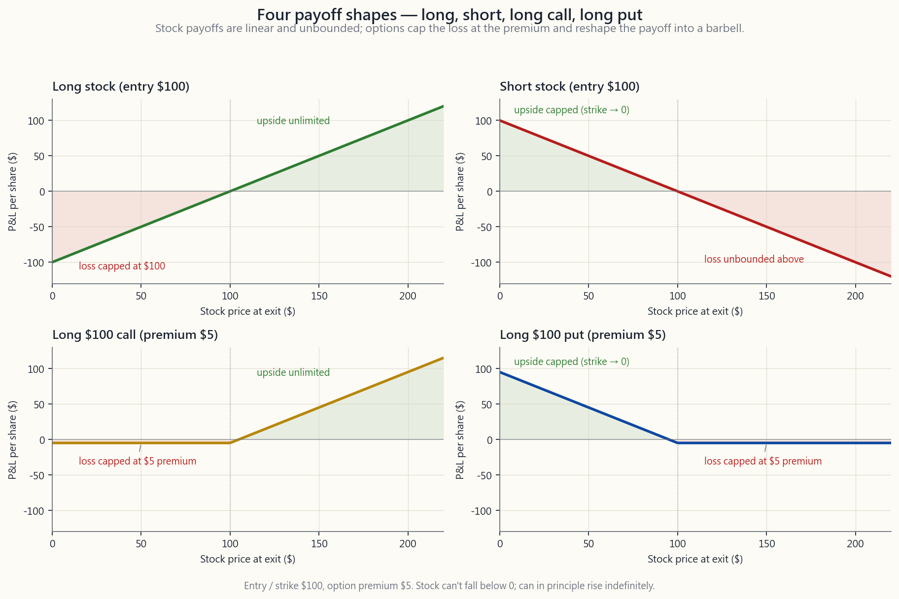
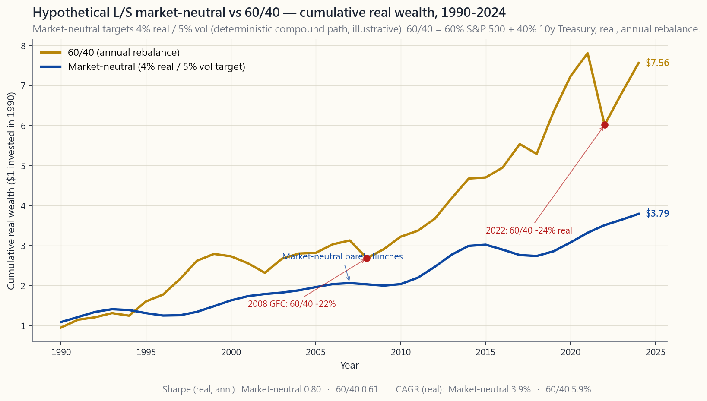

# 第十三週：多空操作——相對價值、阿爾法提取與美元中性帳簿

---

## 第一部分：閱讀章節

---

### 1. 為何這個主題至關重要

在本週之前，這門課程討論的都是「持有」資產。持有股票多頭部位、債券多頭部位、指數多頭部位，或任何你信賴的價值儲存工具。對幾乎所有投資人而言，只做多是正確的預設立場，我們花了十二週的時間為這個立場辯護。

本週是課程首次加入第二條腿。不是「買進並持有另一樣東西」——而是**借入它、賣出它、再買回來**。放空。市場的另一半。

你需要了解這個主題，有四個原因。

1. **機制並不直觀，而且不對稱性是真實存在的。** 持有股票多頭部位，你的損失上限為100%，獲利則無上限。放空股票，你的*獲利*上限為100%，而*損失*則無上限。大多數散戶在放空上的慘敗，都源於沒有真正內化這種不對稱性，而以與多頭相同的規模建立空頭部位。選擇權的尾部牽動著股票的主體，而不對稱的軋空現象，本質上就是這種動態造成的。2021年1月，GameStop在三週內從20美元飆升至480美元，讓幾家專業的純空頭基金就此走入歷史。

2. **阿爾法大多藏在空頭側或價差之中。** 持久的阿爾法來源包括：流動性、類股輪動、長期趨勢，以及買進被被動型資金拋棄的資產。這些都不是純粹的多頭交易。其中三個是價差交易——做多便宜的那一腳、放空昂貴的那一腳，持有相對價值部位直到收斂。如果你只做多頭，你就系統性地將自己排除在真正的聰明資金賺取報酬的交易之外。

3. **美元中性帳簿是檢驗你是否真有優勢的最乾淨方式。** 當你的多頭帳簿與空頭帳簿美元加總為零，且淨貝塔也趨近於零，市場的方向性就被沖銷了。剩下的，就是你選股的能力。如果你的多空價差在幾年內能持續正複利，你就有阿爾法。如果沒有，你就沒有——而且你還幫自己省去了把多頭市場誤認為能力的窘境。

4. **這為接下來兩週及課程後半段奠定基礎。** 第14週將同樣的機制應用於單一股票配對（配對交易）。第49週將其應用於波動性本身（波動率套利）。第23週（因子）與第47週（長波動率覆蓋）均建立在你即將學習的多空架構之上。少了這一課，課程後半段所有相對價值內容都將失去根基。

這一課並非建議你明天就開始放空。你們大多數人不應該這樣做。這一課是教你認識這套工具，讓你日後當課程指向某個結構性錯誤定價時，你能夠看懂自己在看什麼。

---

### 2. 你需要了解的知識

#### 2.1 放空的機制——借入、賣出、買回、歸還

放空是一個四步驟的往返操作。

1. **借入。** 你的券商借給你100股XYZ。券商從其他客戶的保證金帳戶、自家庫存，或第三方證券借貸部門取得這些股份。出借方收取持續性費用（即*借券費率*或*借券成本*）。
2. **賣出。** 你將借來的100股以當前買價賣入市場。現金進入你的保證金帳戶，但*不屬於你可動用的資金*——它們被鎖定為空頭部位的擔保品。
3. **買回（回補）。** 之後——可能是一天，也可能是一年——你在市場上買回100股，用來歸還出借方。
4. **歸還。** 借來的股份被返還。你的損益為`（賣出價格 - 回補價格）× 股數`，再扣除累計借券費，以及出借方在借券期間有權領取的任何股利（空頭部位持有人須自行支付，不從擔保品中扣除）。

有幾個實務上很重要的細節。券商按年利率收取借券費，每日計算。對於*易於借入*（ETB）的股票，如蘋果或標普500指數股票型基金，費率通常為幾個基本點。對於*難以借入*（HTB）的股票——流通股數少、放空需求旺盛，或借券市場壓力大——費率可能達到5%、20%，甚至每年100%。年借券費率50%，是市場在悄悄告訴你：這筆交易的空頭側已經擁擠，持有成本正在吃掉你的報酬。放空之前，務必先確認借券費率。

另一個細節：空頭賣出的交割週期與多頭相同，均為T+1，但*定位*（即確認你的券商確實已取得股份來源的證明）必須在你下達賣出委託前完成。未取得定位即進行賣出，即構成*裸空*，美國股票市場自2008年起已明文禁止此行為。若你的券商給予放行，代表定位已就緒。

#### 2.2 不對稱損失結構與軋空

這是這一課中最重要的段落。

持有一檔100美元股票的多頭部位：最好的情況，股價漲10倍，你在100美元本金上賺到900美元。最壞的情況，股價歸零，你損失100美元。損失有上限。

放空一檔100美元股票：最好的情況，股價歸零，你在100美元的擔保品承諾上賺到100美元。最壞的情況，股價漲10倍——你在原始100美元保證金上損失900美元。*損失在上方無限擴大。*

更糟的是，讓你判斷錯誤的同一個走勢，也會讓你的部位*越來越大*。隨著股價上漲，你的空頭義務從100美元增長到300美元、1,000美元，券商也會針對更大的部位提高保證金要求。你被迫在交易最不利的時候補繳更多資本。這就是軋空如何演變成被迫回補的過程——不是出於意願，而是追繳保證金的壓力。

典型案例是2021年1月的GameStop。空頭賣出量超過流通股數的100%（這在技術上是可能的，因為股份可以被重複借出）。散戶透過r/wallstreetbets協調買進買權；選擇權做市商透過買入現貨進行避險，現貨因此上漲，空方被迫在供應枯竭的情況下回補，股價在三週內從20美元飆升至480美元。擁有120億美元資產的避險基金Melvin Capital在那一個月損失了約半數資產，並於一年後宣告清算。

教訓不是「永遠不要放空」。教訓是**以多頭倉位規模的一小部分建立空頭部位，設定硬性停損，永遠不要放空流通性低且空頭比率偏高的個股，除非你對回補時機有具體的結構性論點**。這個機制值得銘記——在後疫情的選擇權市場中，選擇權的尾部牽動著股票的主體，而協調性的散戶買權操作，正是點燃軋空引信的機制。

下圖並排呈現四種損益圖。

#### 2.3 總曝險與淨曝險、美元中性、貝塔中性

兩家帳面上都是「多頭100美元、空頭100美元」的多空基金，可能是截然不同的動物。用來釐清這種模糊性的詞彙如下：

- **總曝險** = `|多頭美元| + |空頭美元|`。在任一方向上部署的資本總量。多頭100美元加空頭100美元的基金，總曝險為200美元，即資本的200%。
- **淨曝險** = `多頭美元 - 空頭美元`。方向性的押注。同一基金的淨曝險為零——即*美元中性*。
- **淨貝塔** = `Σ (w_i × β_i)`，涵蓋兩個帳簿。即使美元淨值為零，若你的多頭帳簿貝塔為1.3（高貝塔成長股），空頭帳簿貝塔為0.7（低貝塔民生消費股），你的*淨貝塔*為+0.6——當市場反彈，你的淨曝險也會跟著反彈。*美元中性不等於貝塔中性。*

三種典型配置：

| 配置 | 總曝險 | 淨美元 | 淨貝塔 | 適用對象 |
|---|---:|---:|---:|---|
| 純多頭 | 100 | +100 | ~+1.0 | 散戶、共同基金 |
| **130/30** | 160 | +100 | ~+1.0 | 增強型指數避險基金 |
| **市場中性 100/100** | 200 | 0 | 0（目標值） | 經典多空股票避險基金 |
| **美元中性配對** | 200 | 0 | 不受限 | 統計套利、配對交易者 |

130/30基金是一種廣受機構採用的產品——持有130%多頭，30%空頭，利用借券所得融資空頭部位，最終維持100%淨多頭，同時具備表達空頭觀點的能力。這種架構主要用於放寬「純多頭」限制——該限制使指數型基金不得對某檔股票減持超過其指數權重的倉位。

市場中性的100/100帳簿，是大多數人說到「多空避險基金」時所指的形式。基金經理以大致相等的美元金額挑選多頭與空頭，並努力將淨貝塔維持在接近零的水準。帳面報酬即為*價差阿爾法*——多頭帳簿減去空頭帳簿——理論上應與市場不相關。

配對交易是同樣的概念，應用於單一筆交易：做多可口可樂、放空百事可樂，保持相同美元金額；做多被低估的石油巨頭、放空被高估的那一家。第14週將深入探討其數學原理。

#### 2.4 借券成本——ETB與HTB及其重要性

每一筆空頭都有持續性的持有成本。借券費率以部位市值的年化百分比報價，每日計算。

| 類別 | 典型借券費率 | 範例 |
|---|---:|---|
| **一般擔保品 / ETB** | 0.25 - 1% / 年 | SPY、QQQ、蘋果、微軟、大型股 |
| **輕度特別股** | 1 - 5% / 年 | 籌碼集中的中型股 |
| **特別股 / HTB** | 5 - 30% / 年 | 小流通量、近期首次公開發行、收購目標 |
| **嚴重HTB** | 30 - 100%+ / 年 | 壓力標的、生技股二元事件 |

年借券費率30%是一種悄悄的摧毀力量。若你放空的股票在一年內下跌20%，你獲利20%。扣除30%借券費，再加上你須支付的股利，你在一個方向判斷正確的交易上反而*虧損*了10%。這是整個金融界中，結構性成本扼殺一筆看似明顯交易的最清晰案例之一。**借券市場具有資訊效率：當一檔原本幾乎免費借入的ETB股票在一夕之間變成50%費率的HTB股票，市場正在告訴你，這筆空頭已經擁擠，交易的預期報酬早已被壓縮至零。**

借券費率也不是合約固定的。你的券商可以隨時*召回*借券，迫使你以下一個可得的價格買回（在軋空期間，這是你那一週最糟糕的價格）。費率也可能在部位持有期間重新定價。你以2%借券費建立的部位，可能在某則新聞稿發布後重新定價為25%。

#### 2.5 透過選擇權建立建設性空頭——啞鈴友好的替代方案

對大多數想要空頭曝險的散戶而言，*不要真的去放空股票*。買進賣權、賣出買權價差，或使用保護性領口策略。理由如下：

- **損失有上限。** 多頭賣權最多損失已付權利金。多頭買權最多也只損失已付權利金。裸空的不對稱損失問題，被已知且有限的支出所取代。
- **借券成本已內含。** 當你買進賣權，你不需要定位、不需要支付借券費、不需要擔心召回。賣給你賣權的做市商已透過期貨及選擇權市場進行避險，借券成本折入了選擇權的價格（你確實在支付，只是方式較不明顯）。
- **這正是啞鈴的形狀。** 啞鈴——將你的大部分財富配置在安全、穩定的多頭部位，並撥出一小部分（2-5%）建立不對稱選擇權結構，在尾部事件中大幅獲利，但損失上限僅止於權利金——是表達空頭觀點的正確方式。
- **有時具備稅務效益。** 在美國應稅帳戶中，選擇權可以以裸空所無法實現的方式，遞延或重組實現時點。長期賣權在到期時只產生一筆資本利得事件，而不是保證金帳戶上的持續逐日盯市。

何時應該*真的放空股票*而非使用選擇權：當你在機構規模下經營市場中性或美元中性帳簿，選擇權的隱含波動率溢價超過了借券節省的成本，且你需要直線式的損益結構以進行風險預算管理。對其他所有人而言：優先選擇選擇權。

#### 2.6 阿爾法真正所在之處——為何多空操作能觸及更多阿爾法

持久的阿爾法來源數量有限。以下是學術文獻中有用的分類法，對應到陳馬的框架：

| 優勢來源 | 定義 | 純多頭可及？ | 多空可及？ |
|---|---|:---:|:---:|
| **資訊優勢** | 你知道別人不知道的事 | 有時 | 有時 |
| **詮釋優勢** | 你對同樣的資料有更好的解讀 | 是 | 是 |
| **時間視野優勢** | 你能持有別人無法持有的部位 | 是 | 是 |
| **行為優勢** | 你利用散戶/共同基金可預測的行為 | 部分 | 是 |
| **結構優勢** | 你利用強迫性資金流（指數再平衡、贖回壓力、法規） | 否 | 是 |

純多頭對「結構優勢」的觸及幾乎為零——從結構上來說，你就是無法放空強迫性資金流交易中被高估的那一腳。*整個類別*的結構性錯誤定價交易，都需要放空能力。行為優勢也是同理：你可以買進不受青睞的標的，但你無法在不放空的情況下從過度追捧的泡沫標的的均值回歸中獲利。

這是避險基金在扣除費用後仍能捍衛其存在的最根本結構性原因：他們有機會進入純多頭基金根本無法交易的報酬流類別。這也是為什麼現代多空基金的報酬輪廓，與60/40投資組合（第4週）看起來如此不同——多空的價差阿爾法刻意設計為與市場貝塔正交。

下圖呈現了這種正交性。它描繪了一個假設性多空市場中性基金（確定性複利模型，目標年化實質報酬4%，波動性5%）與60/40從1990年至2024年的累計實質財富對比。

這個圖形告訴你多空操作買到了什麼、以及代價是什麼。它買到的是不受市場環境影響的特性：曲線在每一種總體環境下都持續向上傾斜，因為它並未對經濟方向進行押注。代價是複利能力：你放棄了長期股票風險溢酬，因為你對市場沒有淨多頭部位。將多空操作作為一個配置組成，而非取代你的多頭持倉——這與第4週的啞鈴邏輯如出一轍。

下方的互動面板讓你可以滑動多頭側貝塔、空頭側貝塔及非系統性阿爾法，觀察由此產生的投資組合財富路徑如何與標普500相比。

---

### 3. 常見迷思

**迷思一：「放空是賭博。」**

做多也是賭博，以同樣的定義來看。兩者都是對證券未來價格的押注。差異在於損失結構與成本結構，而非交易的道德性質。將放空視為禁忌，會系統性地將你排除在整個結構優勢阿爾法類別之外。

**迷思二：「我只要放空顯而易見的泡沫股就好。」**

泡沫可以維持非理性的時間，遠比你維持償債能力的時間更長。放空明顯的泡沫股，是散戶投資中成本最高的交易之一——借券費率飆升、保證金要求擴大，而軋空風險也是不對稱的。如果你必須建立這筆交易，就以長期賣權（損失有限）的方式進行，而非裸空（損失無限）。

**迷思三：「美元中性代表沒有風險。」**

美元中性帳簿仍然面臨因子風險、類股風險、對流動性事件的總曝險，以及你所放空標的的非系統性黑天鵝風險。長期資本管理公司（1998年）運作的就是市場中性帳簿，卻在兩個月內因相關因子集中平倉而損失了90%的資本。淨美元為零不等於淨風險為零。

**迷思四：「若我的多頭帳簿與空頭帳簿具有相同的貝塔，我就已經避險了。」**

貝塔只是一個風險維度。你可以在貝塔中性的情況下，仍大量做多科技股、放空民生消費股，或做多小型股、放空大型股，或做多高品質股、放空低品質股。每一個都是*因子*曝險。現代多空風險管理，對多個因子曝險進行避險（貝塔、規模、價值股、動能、品質、波動性）——而不僅僅是貝塔。

**迷思五：「放空者導致股價下跌。」**

放空者有助於價格發現；他們本身並無法僅憑邊際賣壓就左右股價。一檔被高估股票的股價下跌，是由高估實現所造成的，而放空者的研究通常是*揭露*這種高估，而非*製造*它。放空禁令的歷史紀錄（美國2008年、歐盟2011年、中國2015年）相當一致：禁令降低了價格發現效率、擴大了買賣價差，卻未能阻止基本面的下跌。

**迷思六：「賣出掩護性買權等同於建立空頭部位。」**

並非如此。掩護性買權是持有股票多頭部位加上賣出買權。你的上方獲利被限制在買權的履約價，但你仍是股票的淨多頭。真正的空頭部位是「放空股票」或「買進賣權」。不要將增益型覆蓋策略與方向性空頭混為一談。

**迷思七：「避險基金總是能在空頭部位上賺錢。」**

並非如此。大多數專業多空基金，在歷史上主要從多頭帳簿獲取大部分阿爾法，並主要將空頭帳簿作為避險工具——也就是說，空頭帳簿在長期往往是*虧損*的，因為它是在放空長期上漲的市場。基金的價值，在於其空頭的虧損幅度低於市場的漲幅，並在此基礎上疊加價差阿爾法。

**迷思八：「我可以透過放空來避險我的多頭投資組合。」**

對大多數散戶而言，透過放空進行避險成本過高（借券費）、風險過大（不對稱損失），且操作要求過高（追繳保證金）。請改用賣權、賣權價差，或單純持有更多現金。透過放空進行避險，是機構的操作方式，而非散戶的工具。

**迷思九：「130/30是多頭投資的避險版本。」**

130/30基金在美元總量上比100%純多頭基金承擔更多的市場曝險（總曝險160%），在貝塔上與後者大致相當（淨貝塔約1.0）。它並非一種避險；它是對純多頭限制的一種鬆綁。邊際效益來自於能夠表達空頭觀點的能力。

**迷思十：「如果借券是免費的，那放空就是免費的。」**

今天借券免費，不代表明天也免費。借券費率會重新定價。股份會被召回。而且，即使明示的借券費率只有0.25%，股利支付義務與擔保品的機會成本仍是真實的成本。放空從來不是免費的。

---

### 4. 問與答

**Q1：作為一個擁有10萬美元投資組合的散戶投資人，我是否應該放空股票？**

A：對於方向性看空的觀點，不要——請使用賣權。對於相對價值交易（做多一檔股票、放空相關股票），你可以嘗試，但倉位要極小、標的要是流動性高且借券便宜的個股，並設定硬性停損。前幾筆交易，你會切身感受到操作上的繁瑣程度。如果你沒有需要空頭部位的具體結構性論點，就不要建立空頭。

**Q2：放空需要多少資本？**

A：任何主要券商的保證金帳戶都允許你放空。初始保證金要求通常為空頭市值的50%（Reg T規定），此外還有25-30%的維持保證金要求。因此，一筆1萬美元的空頭在建倉時至少需要鎖定5,000美元的淨值，再加上各券商特定的維持保證金緩衝。實務上，即使券商允許，任何一筆空頭部位都不應超過你流動淨值的5-10%。

**Q3：避險基金的「淨值」和「總曝險」在實務上是什麼樣子的？**

A：典型的多空股票避險基金，淨多頭約為50-80%，總曝險約130-170%。市場中性基金的淨值約為0%，總曝險約150-200%。「低淨值」基金的淨值約為10-30%。總曝險的差異主要反映槓桿決策；淨值的差異則反映方向性觀點。

**Q4：避險基金如何決定空頭部位的規模？**

A：通常為多頭部位的一半。原因：空頭具有不對稱損失；軋空風險需要設定硬性停損；而且由於市場的長期漲勢，1%的空頭比1%的多頭承擔了更大的負偏態押注。機構的經驗法則是：「多頭可按信念強度加碼；空頭則必須額外考量軋空風險後再決定規模。」

**Q5：空頭部位何時會被召回？**

A：當出借方想要取回股份時——通常是因為出借方的帳戶持有人正在賣出股票，或借券被重新導向給更有利可圖的空頭。你通常會收到24-48小時的通知，以平倉空頭或讓券商代為買回。如果股票正處於軋空狀態，這個強制買入的價格，將是你那一週最糟糕的成交價。

**Q6：放空時股利是如何運作的？**

A：你必須支付。如果你在除息日持有XYZ的空頭部位，股利金額會從你的帳戶中扣除並計入出借方。沒有任何抵免，也沒有稅務優惠（這筆支出以普通費用處理，而非合格股利）。這就是為什麼放空高股利股票，即使借券費率看起來不高，在結構上也是代價高昂的。

**Q7：我可以透過指數股票型基金放空嗎？**

A：可以。反向指數股票型基金（SH、PSQ、SDS）是在沒有保證金帳戶的情況下，表達看空市場觀點最簡單的方式。它們每日再平衡，在多日持有期間會產生*路徑依賴的耗損*——在波動劇烈的市場中持有一年，即使指數大致持平，也可能損失相當大的價值。適合用於短期戰術性避險，而非多月期部位。

**Q8：「軋空」和「Gamma軋空」有什麼區別？**

A：軋空是空頭被迫回補，推動股價上漲。Gamma軋空則是選擇權做市商被迫進行*避險*——那些持有賣出買權的做市商，隨著股價上漲必須持續買入現貨以維持Delta中性。兩者往往同時發生（GameStop、AMC），而這種疊加動態正是迷因股軋空如此激烈的原因。「選擇權尾部牽動股票主體」的現象，正是這個機制的體現。

**Q9：為何我不能直接放空我所能找到的最差股票，同時做多最好的股票？**

A：那正是標準的多空股票策略，而答案是「因為其他所有人也都在這樣做」。這筆交易已經擁擠，那些看起來明顯可以放空的標的，借券成本已經居高不下，而那些看起來明顯可以做多的標的，定價已經反映了溢價。真正的多空阿爾法來自*價差*——在同一因子框架內，挑選出相對更好的多頭來對應相對更好的空頭——而不是來自絕對水準。

**Q10：如果我想學習多空操作，應該先用模擬帳戶練習什麼？**

A：從配對交易開始（第14週）：做多可口可樂、放空百事可樂；做多勞氏、放空家得寶。相對價值配對在結構上的淨貝塔約為零，讓你得以在低淨風險的部位上學習操作機制（借券、股利、保證金）。當你能連續三個月無操作失誤地管理一個配對，再擴大總曝險。在做到小規模熟練之前，永遠不要以大資金操作。

**Q11：多空操作如何融入四層資產架構？**

A：多空操作位於*機會性*配置層。基礎層（被動指數、長期債券、現金）及*核心*層（因子傾斜、核心多空貝塔）均為多頭。*機會性*配置層是特定結構性交易——配對交易、類股輪動、特殊情況——的所在之處。第四層（不對稱投機）則是建設性空頭選擇權部位所在之處。多空操作*不是*基礎層的替代品；它是一個補充性的小型配置。

**Q12：這一課為課程後半段鋪墊了哪些內容？**

A：第14週是配對交易——多空框架的一種具體應用。第23週是因子——「做多便宜因子、放空昂貴因子」的架構與此相同。第47週是長波動率覆蓋，其中的空頭腿在另一種意義上是空頭（賣空變異數）。第49週是波動率套利，是最複雜的相對價值應用。所有這些都建立在本課所介紹的機制之上。

---

## 第二部分：YouTube 腳本

---

**影片標題：** 多空投資——市場的另一半 | 第13週

**預計時長：** 約18分鐘

**主持人：** 陳馬、小魚

---

**[開場]**

**陳馬：** 這門課程的前十二週，我們談的都是持有資產。持有股票多頭、持有債券多頭、持有指數基金多頭。對幾乎所有投資人而言，這是個很好的預設立場，我們也為它大力辯護了很久。本週，我們要加入第二條腿。

**小魚：** 放空。

**陳馬：** 放空。借入、賣出、買回、歸還。市場的另一半。學完這一課，你將掌握：放空的機制、不對稱風險、美元中性與貝塔中性的意義、何時應改用選擇權而非裸空，以及為何金融市場中大多數持久的阿爾法，都藏在空頭側或價差之中。

---

**[第一段：四步驟機制]**

**陳馬：** 放空是一個四步驟的往返操作。第一步，借入。你的券商借給你100股XYZ。第二步，賣出。你將這100股借來的股票以買價賣入市場。現金進入你的帳戶，但被鎖定為擔保品——你無法動用。

**小魚：** 第三步呢？

**陳馬：** 買回。之後——可能是一天，也可能是一年——你在市場上買回100股。第四步，你將這些股份歸還給券商。你的損益是賣出價格減去回補價格，乘以股數，再扣除借券費，以及借券期間到期的股利——那些股利，你得自己掏腰包支付。

**小魚：** 費率呢？

**陳馬：** 按年利率計算，每日計費。像蘋果或SPY這類容易借到的股票，費率是年化0.25%到1%。難以借入的標的——大概是5%到30%。壓力情境下的生技股——可以高達100%。借券費率是市場悄悄告訴你「空頭側已經擁擠」的信號。如果一檔股票每年的借券成本高達50%，這筆交易的報酬早就被壓縮光了。放空之前，一定要先確認借券費率。

---

**[第二段：不對稱損益]**

[VISUAL: image/week13_payoff_diagrams.png]

**陳馬：** 看這個2x2方格。左上，股票多頭。線性向上。損失上限100%——股價不可能跌破零。

右上，股票空頭。線性反轉。獲利上限100%——股票歸零，你最多賺到這些。但*損失*無上限。股價可以漲5倍、10倍、50倍壓著你。你的損失跟著同步擴大。

**小魚：** 那下面那一排呢？

**陳馬：** 左下，買進買權。啞鈴形狀。損失以你已付的權利金為上限，上方獲利不對稱。右下，買進賣權——建設性空頭。損失以權利金為上限，獲利以履約價為上限，但你在不需要借入任何股票的情況下，就取得了空頭曝險。

**小魚：** 那就是啞鈴的形狀。

**陳馬：** 正是。對大多數想要看空曝險的散戶而言，不要真的去放空股票。買進賣權。損失有上限。借券成本已內含其中。操作上也更乾淨。用一句話說啞鈴：支付小額權利金，換取大幅不對稱的報酬。這就是建設性空頭。裸空是在機構規模下經營市場中性帳簿的機構所使用的工具。

---

**[第三段：軋空]**

**陳馬：** GameStop，2021年1月。新年時股價20美元。月底480美元。來看一下數字：空頭賣出量超過流通股數的100%。散戶協調買進買權。做市商透過買入現貨進行避險。現貨因此上漲。保證金追繳打到空頭。空頭被迫在供應枯竭的市場中回補。股價在三週內暴漲20倍。擁有120億美元資產的避險基金Melvin Capital在那個月損失了半數資產。

**小魚：** 那就是選擇權的尾部牽動著股票的主體。

**陳馬：** 正是這個現象。後疫情的選擇權市場規模已大到，散戶的買權買盤能夠透過做市商的避險資金流，帶動標的資產的走勢。任何空頭比率偏高加上散戶選擇權討論聲浪上升的個股，都不應該裸空。不行。不行。真的不行。

---

**[第四段：總曝險、淨值、貝塔中性]**

**陳馬：** 現在來學幾個閱讀任何避險基金資訊頁都需要的詞彙。

總曝險：多頭美元加空頭美元。淨曝險：多頭減空頭。淨貝塔：同樣的多頭減空頭，但以每個標的對市場的貝塔加權計算。

**小魚：** 這個區分為什麼重要？

**陳馬：** 兩家基金都可以是「多頭100美元、空頭100美元」——相同的總曝險200美元、相同的淨美元為零——但曝險可以截然不同。如果你的多頭帳簿貝塔為1.3，空頭帳簿貝塔為0.7，你的*淨貝塔*是正0.6。美元中性，但不是貝塔中性。當市場反彈，你也跟著漲。

**小魚：** 那130/30基金呢？

**陳馬：** 130%多頭，30%空頭。總曝險160，淨值100，貝塔仍約為1。這不是避險產品——它只是鬆綁的純多頭授權。好處是能夠表達空頭觀點。是主流的機構產品。

**小魚：** 市場中性呢？

**陳馬：** 100%多頭，100%空頭，在設計上追求貝塔中性。這是經典的多空股票避險基金。它所創造的任何報酬，就是價差阿爾法——多頭帳簿減去空頭帳簿。理論上與市場不相關。

---

**[第五段：市場中性圖表]**

[VISUAL: image/week13_market_neutral_vs_60_40.png]

**陳馬：** 這就是與市場不相關的特性能為你買到什麼。假設一個股票市場中性基金——設定年化實質報酬4%、波動性5%，以帶有零均值噪聲的確定性複利路徑模擬——對比60/40，時間跨度從1990年到2024年。

**小魚：** 60/40的終值高出許多。

**陳馬：** 對。60/40背後有股票風險溢酬在支撐。市場中性在設計上就沒有這個。你放棄了長期的漂移動力，換來不受市場環境影響的特性。看2008年。看2022年。市場中性的曲線在這兩段期間幾乎紋風不動。它沒有對經濟方向進行押注。

**小魚：** 所以夏普比率更好，但年化複合報酬率更差。

**陳馬：** 市場中性配置的夏普比率約為0.8，60/40約為0.55——風險調整後表現更好。但年化複合報酬率反過來——60/40在原始複利能力上勝出。這就是一張圖裡呈現的多空交換條件：你用複利能力換取不受市場環境影響的特性。

---

**[第六段：阿爾法所在之處]**

**陳馬：** 這一課最核心的思想收穫來了。持久的阿爾法來源包括：流動性、類股輪動、長期趨勢，以及買進被被動型資金流拋棄的資產。將這些對應到學術分類：資訊優勢、詮釋優勢、時間視野優勢、行為優勢、結構優勢。

**小魚：** 那放空呢？

**陳馬：** 純多頭對「結構優勢」的觸及幾乎為零。從結構上來說，你就是無法放空強迫性資金流交易中被高估的那一腳。整個類別的結構性錯誤定價交易——指數再平衡、贖回壓力的平倉、法規強制賣出——都需要放空能力。行為優勢也是同理。你可以買進不受青睞的標的，但你無法在不放空的情況下，從過度追捧的泡沫股的均值回歸中獲利。

**小魚：** 所以這就是避險基金在扣除費用後仍能存在的理由。

**陳馬：** 這是結構性的理由。他們有機會進入純多頭基金根本無法交易的報酬流類別。不代表每一家基金都能賺到應得的費用——大多數做不到——但這個資產類別存在的架構性理由是真實的。

---

**[第七段：互動面板]**

**陳馬：** 影片下方的互動面板讓你能建立自己的多空帳簿。你可以設定多頭側的貝塔、空頭側的貝塔，以及你認為自己能提取的非系統性阿爾法（以每年基本點計）。圖表會呈現你的累計財富路徑與標普500的對比。

**小魚：** 統計摘要呢？

**陳馬：** 淨貝塔、總曝險、夏普比率、最大回撤。把多頭貝塔和空頭貝塔滑到相同的數值，看夏普比率如何崩潰——當淨貝塔為零且非系統性阿爾法也為零，你得到的是一條扣除交易成本後的水平線。往上滑動非系統性阿爾法，線條就開始傾斜。這就是多空世界中阿爾法的全部意義：你在一條水平線上疊加的斜率。

---

**[第八段：何時真的應該放空]**

**陳馬：** 最後一段，說說實務面。什麼時候你真的應該放空某個東西？

第一。永遠不要裸空流通性低且空頭比率偏高的個股。就是不要。改用賣權。

第二。永遠不要放空一個你對回補時機沒有結構性論點的股票。「它被高估了」不是論點。「三月份指數再平衡有強迫賣出事件」才是論點。

第三。進場前一定要確認借券費率。如果借券成本是年化20%，這筆交易光是保本就要賺20%。幾乎永遠做不到。

第四。空頭倉位的規模要設定為多頭的一半。不對稱損失是真實的。追繳保證金也是真實的。

第五。設定硬性停損。股票向你逆行會讓部位規模不斷擴大。設定以資本百分比計算的停損，而不是以價格計算的停損。

---

**[結尾]**

**陳馬：** 多空操作是這門課後半段的工具箱。第14週是配對交易。第23週是因子。第47週是長波動率。第49週是波動率套利。所有這些都建立在你剛學到的機制之上。

**小魚：** 那對大多數散戶來說呢？

**陳馬：** 你的基礎配置繼續做多頭。當你想要空頭曝險，買進賣權。把真正的多空帳簿，留給你有具體結構性交易機會、且有操作紀律以小規模執行的時候。這一課的重點不是「明天就去放空」。重點是「當那筆交易出現的時候，你能看懂自己在看什麼」。