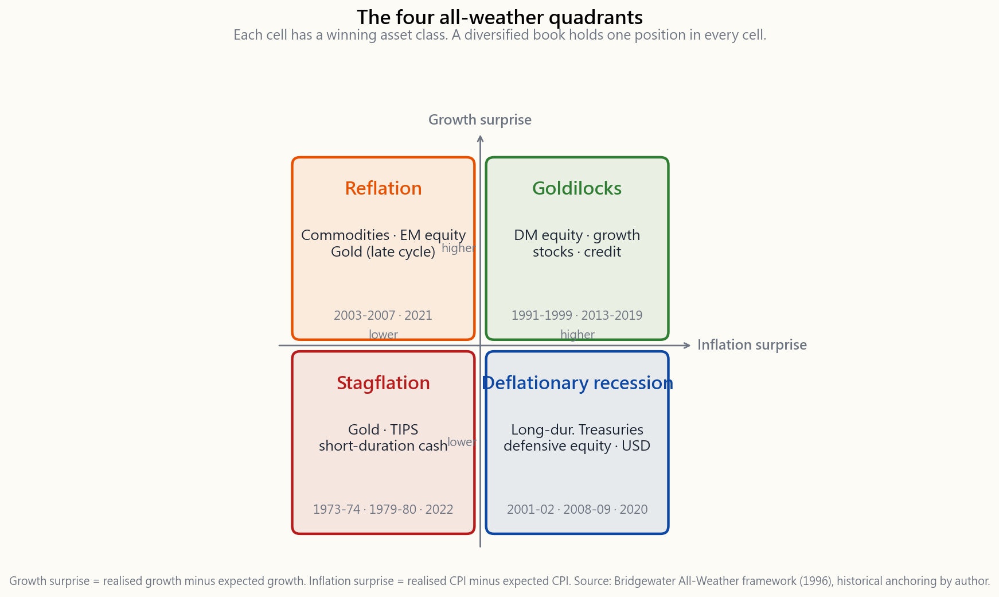
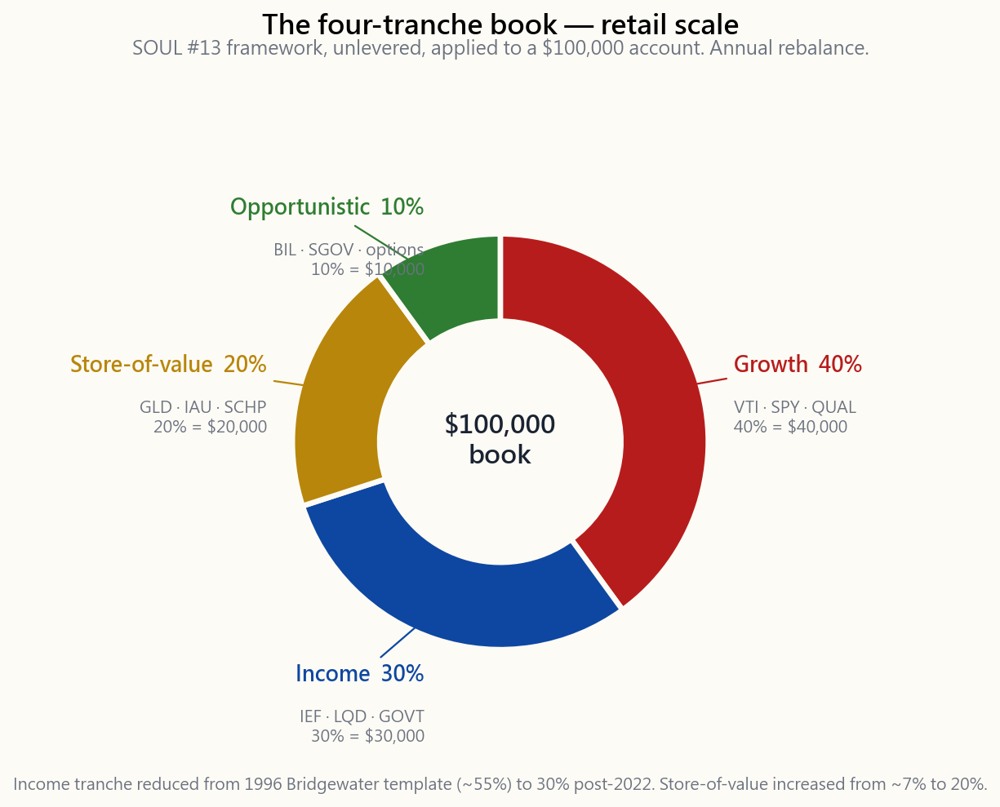

# 第15週：多資產投資組合——風險平價、全天候策略與四分倉框架

---

## 第一部分：閱讀章節

---

### 1. 為什麼這很重要

第4週給了你六四配置。第6週給了你黃金。第13週給了你空頭部位。本週課程終於將這些元素整合進一個完整的資產配置框架——這與橋水基金自1996年以來執行的框架相同，也與克利夫·阿斯尼斯2004年在AQR推出的框架如出一轍，更是四分倉書籍所模仿、適用於散戶規模的相同架構。

你需要學習這一課有四個原因。

1. **六四配置本質上是一種隱藏的情境交易。** 它之所以在過去四十年奏效，是因為股票和債券呈負相關，且通膨持續下行。當2022年這個情境打破——兩條腿同時下跌18%——問題就從「股票還是債券？」變成了「什麼樣的投資組合不需要押注單一總體經濟結果就能存活？」多資產配置建構是機構界的答案，在你接受或拒絕它之前，你應該了解其架構。
2. **風險平價重新定義了資產配置的問題。** 傳統配置問的是「我有多少資金投入每個資產？」風險平價問的是「我的投資組合有多少*風險*來自每個資產？」在典型波動性下的六四配置組合中，即使只有60%的資金在權益部位，投資組合約90%的變異數仍來自股票部位。一旦你看清這點，就再也無法視而不見——40%的債券部位在風險角度來看幾乎微不足道。
3. **全天候四象限模型是你所能擁有的最清晰的總體經濟思維框架。** 經濟成長×通膨，兩條軸線，四個格子，每個格子對應一個勝出資產類別。這不是一個完整的預測工具，而是更好的東西——一份查核清單，強迫你在決定任何部位規模之前先問自己：*這筆交易是在押注哪個象限？* 大多數散戶的爆倉，來自於在不知情的情況下持有未避險的單象限投資組合。
4. **這是課程後半段的橋樑。** 四分倉框架（成長／收益／價值儲存／機會型）是我們將在第16週至第30週用類股、因子、選擇權策略和槓鈴傾斜來填充的架構。沒有本週的多資產底盤，後續那些交易就無處安放。

這並不是建議你在家裡實際執行風險平價策略。所需的槓桿和再平衡要求屬於機構層級。建議是讓你理解這些原則，然後將其*形狀*——而非槓桿——應用到你自己的四分倉投資組合中。

---

### 2. 你需要了解的內容

#### 2.1 2022年的斷裂，以及它為何改變了一切

從1981年說起。國庫券殖利率在四十年間從15%跌至0.5%。每次通膨意外下行，債券就反彈。每次經濟成長意外放緩，股票下跌而債券反彈。股債相關性在二十年間維持在約-0.3。六四配置看起來像一台永動機。

然後2022年發生了。聯準會在十五個月內升息525個基本點，以應對9%的消費者物價指數漲幅。長期國庫券（TLT）年底下跌31%。標普500下跌18%。彭博綜合債券指數下跌13%——自該指數1976年成立以來最差的一個日曆年度。六四配置組合虧損約17%，是自1937年以來該策略最差的實質報酬。讓六四配置得以運作的負相關性*翻轉了*。截至本文撰寫時（2026年4月），相關性已重回正值，機構共識是：只要通膨仍是主要的總體風險，股債相關性將*持續*為正——現在驚嚇股票的那道衝擊，同樣也傷害債券。

這是需要密切關注的情境轉變。四十年的利率下行和通膨下行為被動型投資人提供了順風車。那股順風已經消逝。為之設計的投資組合繼承了一個隱藏的脆弱性：它們是單象限的交易。

#### 2.2 全天候象限——成長×通膨

瑞·達利歐的框架，於1996年在橋水正式化，將每一次總體衝擊組織進一個2×2的矩陣中。兩條軸線：

- **成長意外**——國內生產毛額／盈餘成長是否比市場定價*更高*或*更低*？
- **通膨意外**——消費者物價指數／工資成長是否比市場定價*更高*或*更低*？

*意外*這個詞至關重要。市場已經為預期的成長和預期的通膨定價。驅動投資組合的是殘差值。

每個象限都有一個勝出資產類別——其報酬結構*在結構上*暴露於那個總體殘差的資產。

歷史定錨：

- **成長上升、通膨上升**（左上）：1970年代、2003-2007年再通膨、2021-22年。贏家：原物料、能源、材料、新興市場股票、週期末段黃金。
- **成長上升、通膨下降**（右上）：1991-1999年、2013-2019年。「金髮女孩」格。贏家：已開發市場股票、成長股、信用。
- **成長下降、通膨上升**（左下）：1973-74年、1979-80年、2022年。*停滯性通膨*。六四配置崩潰的格子。贏家：黃金、抗通膨債券、短存續期間現金、能源。
- **成長下降、通膨下降**（右下）：2001-02年、2008-09年、2020年。*通縮型衰退*。贏家：長存續期間國庫券、美元現金、防禦型股票（民生消費、醫療保健）。

橋水的主張——在實證上是站得住腳的——是：*如果*你能以*均等風險貢獻*的方式持有對應每個格子的一種槓桿資產，四條收益流便大致相互抵消，你將得到一個不再押注任何單一象限的投資組合。

#### 2.3 風險平價——依變異數而非資金分配

技術機制就是一條方程式。給定$n$個波動性為$\sigma_1, \dots, \sigma_n$的資產，資產$i$的*未加槓桿*風險平價權重為

$$ w_i = \frac{1/\sigma_i}{\sum_{j=1}^{n} 1/\sigma_j} $$

即：每個資產獲得與其波動性成反比的資金權重。高波動性資產（股票，$\sigma \approx 16\%$）獲得*小*資金權重；低波動性資產（長期國庫券，$\sigma \approx 8\%$）獲得*大*資金權重；在極限情況下，每個資產對投資組合的變異數貢獻相同。

以四個典型波動性的資產為例——股票16%、10年期國庫券6%、黃金18%、短期國庫券1%——其逆波動性權重為：

| 資產 | 波動性 | 1/σ | 原始權重 | 風險平價權重 |
|---|---:|---:|---:|---:|
| 美國股票（SPY） | 16% | 6.25 | 0.067 | 6% |
| 10年期國庫券（IEF） | 6% | 16.67 | 0.179 | 18% |
| 黃金（GLD） | 18% | 5.56 | 0.060 | 6% |
| 短期國庫券（BIL） | 1% | 100.0 | 1.072 | **107%——截斷至70%** |

問題已然出現。現金部位的波動性極低，純粹的逆波動性加權希望將超過100%配置在此。橋水的標準解決方案是將現金從未加槓桿的投資組合中剔除，然後*對剩餘部分加槓桿*——通常槓桿倍數達淨值的1.5倍至2倍——使投資組合達到目標波動性（通常為每年10%）。槓桿主要透過期貨來實現，因為保證金成本低廉、基差緊密。**槓桿是進場的代價。** 沒有槓桿，未加槓桿的全天候投資組合在60%國庫券配置下每年僅能賺取5-6%，在大多數年代都輸給普通的六四配置。

#### 2.4 2022年的風險平價斷裂

二十五年來，加槓桿的風險平價運作良好。然後2022年以與六四配置相同的方式對這個策略造成衝擊，甚至更糟——因為槓桿*放大*了債券的虧損。

橋水全天候策略在2022年虧損約25%，據報導是自成立以來最大的日曆年度回撤。AQR的風險平價基金（QRPIX）虧損約19%。機制是機械性的：加槓桿的國庫券期貨損失了名義價值的25-30%，而槓桿乘數將此轉化為主要的損益項目。股票部位（小資金權重但高波動性）又虧損了一塊。黃金大致持平。短期國庫券賺取2%。沒有任何象限奏效——通膨上升，成長放緩，但政策反應對債券的打擊遠超過放緩對債券的支撐。

這個教訓*不是*風險平價已然崩潰。教訓是：**每一種使用槓桿來均等化風險貢獻的分散投資方案，都假設交叉相關性會維持在回測所給出的水準。** 當股債相關性從-0.3翻轉至+0.5，分散投資的數學就會崩潰，原本應該幫助你的槓桿反而開始傷害你。這與波動性尾巴搖動狗的風險相同：相關性尾巴搖動了資產配置之狗。

2023年以來，機構界的因應是增加一個*第五個*部位——明確的通膨避險（抗通膨債券、原物料、黃金）——其權重大於橋水原始模板，且在債券部位持有*更少*的槓桿。這個形狀正在向我們所稱的四分倉投資組合靠攏。

#### 2.5 散戶規模的四個分倉

去掉機構槓桿，剩下的是一個乾淨的四桶結構，任何散戶帳戶都可以使用指數股票型基金來持有。

四個分倉：

1. **成長（40%）。** 在美上市股票。預設值：廣泛指數（VTI、SPY）加上第23週所介紹的品質因子傾斜（QUAL）。這是長期實質報酬的引擎，也是在左下和右下象限虧損的部位，這正是它*不*占投資組合60-100%的原因。
2. **收益（30%）。** 主要是中期存續期間國庫券（IEF，7-10年），加上小部分投資等級信用部位（LQD）。這是在右下（通縮）格勝出的部位，提供的利差收益為其他分倉提供資金。2022年後，機構共識是*低配*存續期間相對於歷史風險平價處方——30%而非60%。
3. **價值儲存（20%）。** 黃金（GLD或IAU）和抗通膨債券（SCHP）。這是在左下（停滯性通膨）格勝出的部位。請記住這些工具是*信念*交易——黃金沒有票面利率，抗通膨債券只給付通膨印出的數字——但這個信念有1000年的歷史記錄，在情境崩潰時有可靠的買盤。
4. **機會型（10%）。** 現金（BIL/SGOV）、短存續期間短期國庫券，以及第25-30週的選擇權權利金／槓鈴交易。這個部位讓你在某樣東西變便宜時加碼。閒置火力不是成本——它是非對稱的選擇權，為其他三個分倉的再平衡提供資金。

| 分倉 | 權重 | 工具 | 對應象限 |
|---|---:|---|---|
| 成長 | 40% | VTI、SPY、QQQ、QUAL | 右上（金髮女孩） |
| 收益 | 30% | IEF、LQD、GOVT | 右下（通縮） |
| 價值儲存 | 20% | GLD、IAU、SCHP | 左下（停滯性通膨） |
| 機會型 | 10% | BIL、SGOV、選擇權 | 左上＋閒置火力 |

這*不是*一個風險平價投資組合——相較於均等風險貢獻數學對股票所規定的權重，此處的資金權重更高。它刻意更接近六四配置的起點，*並針對2022年後的情境進行調整*。價值儲存部位實質上大於橋水1996年原始模板所配置的比例（5-15%），而收益部位則實質上較小。這個形狀是槓鈴——一端是真實的安全性，另一端是非對稱的上行潛力——應用於資產配置層級。

#### 2.6 回測——全天候 vs 六四配置 vs 100%股票，1928-2024年

以達莫達蘭1928-2024年年度數據對四分倉投資組合進行回測，與黃金標準時代（1971年前價格固定的窗口）每年實質報酬4%的黃金填補數據，以及1971年後實際倫敦下午定盤價年度報酬相對照。每年再平衡。結果如下：

| 指標 | 100%股票 | 六四配置 | 全天候（40/30/20/10） |
|---|---:|---:|---:|
| 名目幾何年化報酬 | 9.6% | 7.4% | 6.7% |
| 實質幾何年化報酬 | 6.6% | 4.4% | 3.7% |
| 年化波動性 | 19.6% | 12.0% | 9.4% |
| 夏普比率（超額於短期國庫券） | 0.30 | 0.30 | 0.32 |
| 最大實質回撤 | -75%（1929-32年） | -53%（1929-32年） | -38%（1973-74年） |
| 最差日曆年度 | -44%（1931年） | -28%（1931年） | -19%（1981年） |
| 實質報酬為正的年代 | 10個中的8個 | 10個中的9個 | 10個中的10個 |

全天候投資組合相較於六四配置放棄了約90個基本點的實質年化複合成長率，換來兩件事：*每個年代*——自1928年以來的每一個十年——實質報酬均為正值；而且最差實質回撤小了15個百分點。對於靠投資組合生活的投資人而言，這個交換是值得的。對於一位有30年投資期限和薪資收入的35歲投資人而言，它可能*不*值得——他們應該更接近槓鈴形狀——股票部位更重、安全部位更小但真實存在、機會型尾部更大。

以下互動功能讓你滑動四個權重，即時觀看歷史財富路徑、最大回撤、夏普比率和回撤持續時間的變化。試試機構版的35/40/15/10模板、40/30/20/10散戶模板，以及60/10/20/10的槓鈴配置，並在同一圖表上進行比較。

#### 2.7 本課並非在告訴你什麼

有幾件事本課*並非*在告訴你去做。

- **不是在告訴你使用槓桿。** 橋水的槓桿只有在有期貨使用權限、專業風險管理，以及能承受相關性崩潰時25%以上回撤的情況下才可行。散戶四分倉形狀不使用槓桿。
- **不是在告訴你放棄六四配置。** 對於長期積累型投資人，六四配置仍然站得住腳。全天候形狀是適合投資期限為十年或更短、或風險預算無法承受50%以上股票回撤的人的正確*底盤*。
- **不是在告訴你永遠均等加權各象限。** 形狀應該隨著情境傾斜。我們預期那40年的被動情境正在打破；四分倉投資組合是一個能夠在不放棄底盤的情況下進行傾斜的工具。第16-22週將填充那些傾斜配置。

---

### 3. 常見誤解

1. **「風險平價就是股債各半。」** 並非如此。風險平價按波動性*反比*加權，給股票小權重、給債券大權重，然後對整體加槓桿至目標波動性。50/50的組合比六四配置更接近風險平價，但在變異數角度仍由股票主導。
2. **「分散投資意味著持有更多股票。」** 分散投資的關鍵在於*報酬流*之間的相關性，而非持股數量。一個由100支科技股組成的投資組合只是一條報酬流。一個由一支標普基金＋一支國庫券基金＋黃金組成的投資組合則是三條。
3. **「六四配置已死。」** 並非已死。它處在一個比其設計情境更艱難的環境中。在1970年代，六四配置的實質報酬回撤為-33%並得以復原。情境脆弱性是真實的，但這個投資組合仍然有效。
4. **「全天候的報酬高於六四配置。」** 並非如此。在1928-2024年期間，其複合報酬*更低*。它的訴求在於更小的回撤和更平滑的報酬路徑，而非更高的報酬。
5. **「黃金在投資組合中是死重。」** 黃金的貢獻不在於其獨立報酬——而在於它與壓力的*共變異數*。在20%的配置下，即使1971-2024年間其報酬低於股票，它仍為全天候投資組合的夏普比率增添了80個基本點。
6. **「風險平價保護你免受任何回撤。」** 它保護你免受特定象限衝擊。它*無法*保護你免受相關性情境轉變的影響。2022年就是後者。
7. **「現金是拖累。」** 現金為下一次再平衡提供資金。一個10%的現金部位在股票回撤30%時讓你加碼5%股票，這不是拖累——而是在下一個空頭市場為自己支付對價的選擇權。
8. **「你需要槓桿才能執行全天候。」** 你需要槓桿才能執行*橋水版本*的全天候達到10%目標波動性。執行未加槓桿的四分倉形狀則不需要，因為資金權重的分配方式自然落在9-10%的波動性。
9. **「夏普比率相同所以無所謂。」** 夏普比率相似；但*形狀*不同。兩個夏普比率相同但最大回撤不同的投資組合，對退休人士、捐贈基金或任何在股票部位使用選擇權進行稅務效率管理的人來說，並不等同。
10. **「抗通膨債券解決了通膨問題。」** 抗通膨債券解決的是*官方統計*的通膨（美國勞工統計局消費者物價指數）。它們無法解決情境轉變式的通膨（1970年代），也無法解決主權貨幣貶值問題。黃金是價值儲存分倉的第二條腿，是有原因的。

---

### 4. 問答章節

**問：我明天應該在個人退休帳戶中直接執行40/30/20/10嗎？**
答：作為起點，是的——這是一個合理的預設值，在10年投資期限內不會對你造成傷害。但正確的*長期*權重取決於你的投資期限和其他收入來源。一個有穩定薪資的30歲投資人，股票部位可能應傾斜至60-70%；一個每年提取4%的65歲投資人，股票配置可能應維持在40-50%。底盤是固定的；傾斜因人而異。

**問：如何對四分倉投資組合進行再平衡？**
答：每年一月，機械性地執行一次。如果任何分倉偏離目標超過5個百分點，就交易回來。第7週的互動功能顯示，區間再平衡在換手率方面略優於日曆再平衡，但差距很小——重要的是要確實執行。

**問：風險平價適合5萬美元的帳戶嗎？**
答：資金權重的形狀適合。槓桿不適合。要在未加槓桿的情況下達到橋水的10%目標波動性，你需要80%的債券配置，這的名目報酬只有5%——不夠。略過槓桿，執行未加槓桿的四分倉形狀，自然地以9-10%的波動性為目標。

**問：為什麼價值儲存配置20%而非歷史上的5%？**
答：因為我們已不在1996-2020年的通縮情境中。橋水最初的5-7%黃金部位，是針對通膨為尾部風險而非基本情境的世界所設定的。2026年4月並非那個世界。情境轉變錨定了底盤的調整；更大的黃金權重由此而來。

**問：那國際股票呢？你只提到美國。**
答：對於在美國境內的投資人，扣除費用、預扣稅、貨幣避險成本和資本管制後，在美上市股票是唯一可靠可投資的股票。持有EFA或VWO是一個選項，但比重不大，而且你真正想要的大多數國際曝險，早已內含於標普500的國際營收中了。

**問：我應該在機會型部位中加入私募股權或創業投資嗎？**
答：散戶不適合。流動性、費用和10年鎖定期破壞了「機會型」的特性。散戶的機會型部位應保持流動——現金、短期國庫券，以及第25-30週的選擇權結構。槓鈴只有在兩端都*具有流動性*時才有效。

**問：如果我不認同象限模型呢？**
答：執行未加槓桿的版本，看看它在你認為模型出錯的某個十年表現如何。1970年代和2022年是模型受到最多批評的兩個時期。在這兩個時期，全天候投資組合的實質回撤都小於六四配置，且整個十年實質報酬為正。這個模型並不完美；它比單象限替代方案*更具韌性*。

**問：這與第23週的因子投資有何關聯？**
答：四個分倉是*資產類別*底盤。因子傾斜——品質、價值、動能、低波動性——放在成長分倉*內部*。你不是以犧牲債券為代價來執行品質因子；而是在40%的股票部位內，以犧牲普通標普指數為代價來執行品質因子。

**問：全天候底盤的稅務效率高嗎？**
答：低於100%股票。國庫券和抗通膨債券的票息在聯邦層級作為普通所得課稅（國庫券免州稅）。黃金指數股票型基金（GLD、IAU）按收藏品28%的長期資本利得稅率課稅。將收益和價值儲存分倉持有在稅務優惠帳戶中（個人退休帳戶、401k、健康儲蓄帳戶），並將應稅帳戶留給股票部位，以適用長期資本利得稅率和合格股利稅率。

**問：散戶投資人在使用這個框架時最常犯的錯誤是什麼？**
答：只看過去十二個月。全天候底盤是一個數十年期的架構；在任何給定的十二個月窗口內，它都會跑輸當下勝出的那個象限。每月檢視績效並追逐領先者的投資人，並不是在執行全天候——他們是在糟糕地對象限執行動能策略。

**問：這與網站頂部的儀表板有何關聯？**
答：儀表板追蹤一個50/20/20/10、2年存續期間收益部位、以及在機會型部位上加了槓鈴選擇權覆蓋策略的四分倉投資組合。這是這個底盤的一個具體實例，而非底盤本身。

---

## 第二部分：YouTube腳本

---

**影片標題：** 全天候、風險平價，以及為什麼六四配置還不夠——從零開始的多資產投資組合
**目標時長：** 約18分鐘
**主持人：** 陳馬、小魚

---

**[開場——0:00]**

**小魚：** 歡迎回來。今天是第15週，我們要把上週的積木放進一個資產配置框架裡。看完這支影片，你會知道風險平價究竟是什麼、為什麼橋水四象限模型是你所能擁有的最清晰的總體經濟思維框架，以及四分倉投資組合如何成為同一理念的散戶版本。

**陳馬：** 而且我們會誠實面對2022年。我即將推薦的這個策略，那一年在橋水虧損了25%。風險平價不是魔法詞彙，它是一個帶有假設的底盤，而那些假設有時候會失效。

**小魚：** 以下是計畫。首先，四個象限。然後是風險平價的數學。接著是2022年的斷裂。再來是四分倉投資組合在散戶規模的應用。然後是1928年到2024年的回測。最後是互動功能。

---

**[第一節——四個象限——1:20]**

**陳馬：** 兩條軸線。縱軸是成長意外，橫軸是通膨意外。四個格子。

[VISUAL: image/week15_quadrants.png]

**陳馬：** 右上格，金髮女孩格——成長意外上行，通膨意外下行。那是1990年代，那是2013-2019年。股票勝出。做多指數，你就在家了。

**小魚：** 左上，兩者都意外上行。那是2003-2007年再通膨，那是2021年。原物料、能源、材料、新興市場。

**陳馬：** 右下，兩者都意外下行。通縮型衰退。2001-02年。2008-09年。2020年。長存續期間國庫券稱王。

**小魚：** 然後是左下。

**陳馬：** 停滯性通膨。成長放緩，通膨上升。1973-74年。1979-80年。*2022年*。黃金。抗通膨債券。短存續期間現金。六四配置崩潰的格子。

**小魚：** 重點是什麼？

**陳馬：** 大多數散戶投資組合是未避險的右上格押注。純做多股票是一種單象限交易。它有效，直到它失效為止。

---

**[第二節——風險平價數學——4:00]**

**小魚：** 好，橋水的答案是：以均等風險貢獻的方式，對每個格子持有一種槓桿資產。這在數學上是什麼意思？

**陳馬：** 一條方程式。每個資產的權重等於其波動性的倒數，除以所有波動性倒數之和。所以16%波動性的股票獲得小權重；6%波動性的債券獲得大權重；18%波動性的黃金獲得小權重；1%波動性的現金獲得巨大的權重。

**小魚：** 而現金的問題出現了。

**陳馬：** 純逆波動性加權希望將超過100%配置在現金上。所以你剔除現金，對剩餘部分加槓桿。橋水槓桿1.5到2倍以達到投資組合10%的目標波動性。槓桿主要透過國庫券期貨，因為基差緊密、保證金便宜。

**小魚：** 那不加槓桿呢？

**陳馬：** 未加槓桿的全天候每年賺5-6%。輸給六四配置。槓桿是進場的代價。

---

**[第三節——2022年的斷裂——6:30]**

**小魚：** 帶我們走過2022年。

**陳馬：** 股債相關性從負轉正。同一道衝擊——聯準會在9%消費者物價指數中強力升息——同時打擊兩條腿。TLT下跌31%。SPY下跌18%。彭博綜合指數下跌13%，是自指數1976年成立以來最差的一年。

**小魚：** 那風險平價呢？

**陳馬：** 橋水全天候虧損約25%。AQR的QRPIX虧損約19%。債券部位的槓桿放大了債券損失。沒有任何象限奏效——黃金持平，股票下跌，債券下跌。分散投資的數學假設相關性會維持在回測所給出的位置，但它沒有。

**小魚：** 風險平價崩潰了嗎？

**陳馬：** 沒有。它對相關性情境轉變的脆弱性，比行銷說辭所承認的更大。2023年以來，機構界的因應是持有更少的存續期間槓桿和更多的通膨避險。這個形狀正在向我們所稱的四分倉投資組合靠攏。

---

**[第四節——四個分倉——9:30]**

**小魚：** 好，讓我們來看看散戶版本。

[VISUAL: image/week15_four_tranches.png]

**陳馬：** 四成成長，三成收益，兩成價值儲存，一成機會型。四支指數股票型基金讓你達到90%：VTI、IEF、GLD、BIL。

**小魚：** 那這與橋水的原始權重相比如何？

**陳馬：** 橋水1996年大約運行的是30%股票、55%債券、7.5%黃金、7.5%原物料，槓桿1.5倍。我們是未加槓桿，*更多*股票、*更少*存續期間、*更多*黃金。1996年以來的三次情境轉變為這個調整提供了依據。最大的一次是2022年。

**小魚：** 那機會型的10%呢？

**陳馬：** 現金、短期國庫券，以及一個小型槓鈴部位——為長波動性選擇權或在股票回撤30%時加碼股票預留預算。這個部位很小，但它的工作是非對稱的。10%在短期國庫券坐著賺4%不是拖累；它是為下一次絕佳再平衡交易提供資金的選擇權。

---

**[第五節——回測——12:00]**

**小魚：** 數字。1928年到2024年。

**陳馬：** 100%股票賺取6.6%實質報酬，1929-32年有75%的回撤，另外還有四次超過30%的回撤。六四配置賺取4.4%實質報酬，有53%的回撤。四分倉投資組合賺取3.7%實質報酬，有38%的回撤。

**小魚：** 所以全天候相對六四配置損失了90個基本點的年化複合成長率。

**陳馬：** 是的。換來兩件事。每個年代——自1928年以來的每一個十年——實質報酬均為正值。而且最差實質回撤小了15個百分點。對於靠投資組合生活的人，這個交換是值得的。對於在個人退休帳戶中存錢的30歲投資人，可能不值得——他們應該傾向槓鈴形狀。股票部位更重、安全部位更小但確實存在、機會型尾部更大。

---

**[第六節——互動功能——15:30]**

**小魚：** 然後是實驗室。

[VISUAL: interactive/week15_allweather_builder.html]

**陳馬：** 四個滑桿，每個分倉一個。第四個是唯讀的——它是前三個加總後的剩餘值。將成長往上拉，你會看到財富曲線攀升，但回撤加深。將收益往上拉，回撤縮小，但夏普比率大致維持不變。將價值儲存拉到30%，你會看到停滯性通膨的十年——1973-1981年——完全改變形狀。

**小魚：** 還有夏普比率。

**陳馬：** 夏普比率在合理的權重選擇範圍內大致穩定。這是多資產配置建構最深刻的一課。*風險調整後報酬比絕對報酬更穩定。* 不論你在滑桿上做什麼決定，你很難把夏普比率搞砸太多。但你絕對可以把最大回撤搞砸。選擇讓你睡得著的形狀，而不是年化複合成長率最高的形狀。

---

**[結語——17:30]**

**小魚：** 下週——第16週——類股。11個全球行業分類標準格子。成長分倉內部真正存在超額報酬的地方。

**陳馬：** 還有作業：打開實驗室，找出給你最小最大回撤的權重。然後找出給你最高夏普比率的權重。它們不是同一個。兩者之間的差距就是你的風險預算。那個差距是這門課程中最重要的數字。

**小魚：** 下週見。