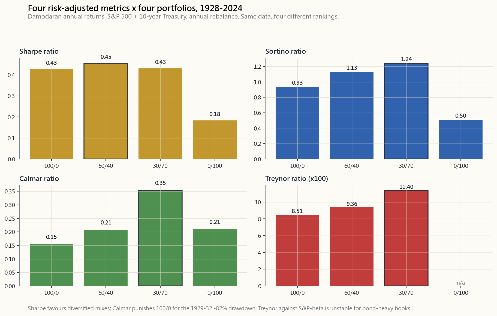
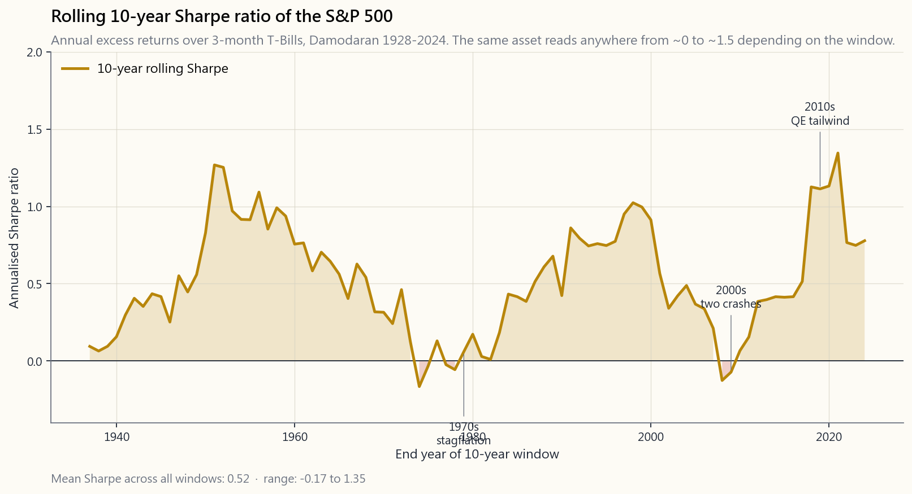

# 第十七週：績效指標——夏普比率、索提諾比率、卡爾瑪比率、資訊比率、特雷諾比率、阿爾法與貝塔

---

## 第一部分：閱讀章節

---

### 1. 為什麼這很重要

單一報酬數字幾乎毫無意義。「我去年賺了18%」只是一句陳述，並不構成評估。它無法告訴你為了賺到這個報酬承擔了多少風險、這套策略虧損的頻率有多高，或者同一筆錢放在指數基金裡是否表現更好。專業投資人、資產配置者、盡職調查團隊，以及誠實審視自身表現的散戶，都活在**風險調整後報酬**的世界裡——也就是每承受一單位痛苦所換來的報酬。

你需要學習這些內容，有四個原因。

1. **評估基金與基金經理。** 全球每一份基金說明書都會引用夏普比率、最大回撤與追蹤誤差。如果你看不懂這些數字、無法直覺感受夏普比率0.4和1.2在客戶帳戶對帳單上的實際差異，你就會對平庸的基金經理付出過高代價，同時錯過真正優秀的人才。
2. **誠實評估自己的表現。** 30%的年度報酬只有在波動性低於30%的情況下才算亮眼，而且還要能證明這不是靠著30%上漲的市場所產生的純粹貝塔。少了夏普比率、索提諾比率、阿爾法與貝塔，你的年終檢討不過是在說故事。
3. **針對不同需求選擇正確指標。** 夏普比率是預設選項，但它對上行波動性與下行波動性的懲罰一視同仁。卡爾瑪比率聚焦於最大痛苦。資訊比率告訴你主動押注是否真的有所回報。特雷諾比率只看無法透過分散投資消除的系統性風險。每個指標回答的是不同的問題；用錯指標就會得到錯誤答案。
4. **波動性尾部牽動全局。** 標準差假設報酬呈常態分佈，但實際上並非如此。尾部很厚。因此，夏普比率會持續**低估懲罰**那些平時看起來穩定、卻偶爾爆倉的策略——例如放空波動性、非流動信用部位、槓桿套利交易。索提諾比率和卡爾瑪比率部分修正了這個問題。了解哪個指標對哪種策略有美化效果，是盡職調查中最有價值的能力。

本課程將系統梳理所有指標，對四種模型投資組合套用達摩德仁1928至2024年資料集進行完整計算，並展示不同指標的排名順序如何改變你的偏好判斷。

---

### 2. 你需要了解的內容

#### 2.1 夏普比率——每單位總波動性所獲得的超額報酬

夏普比率是一切的基礎。比爾·夏普（1990年諾貝爾獎得主）於1966年提出這個公式，計算方式相當簡單：

$$ \text{夏普比率} = \frac{R_p - R_f}{\sigma_p} $$

分子為**超額報酬**——投資組合報酬減去無風險利率（3個月期國庫券）。分母為投資組合報酬的**總標準差**。

夏普比率回答的問題是：*這個投資組合每承受一單位的總波動性，賺取了多少報酬？* 數值越高越好。以下是長期年化夏普比率的粗略基準：

| 夏普比率（年化） | 解讀 |
|---|---|
| < 0 | 輸給無風險利率，承擔風險卻得到負補償 |
| 0.0 - 0.3 | 平庸。S&P 500百年平均約為0.4 |
| 0.3 - 0.6 | 尚可。多數平衡型投資組合落在此區間 |
| 0.6 - 1.0 | 確實優秀——若屬真實且持續的表現 |
| 1.0 - 2.0 | 卓越。頂尖四分位的避險基金、管理良善的風險平價策略 |
| > 2.0 | 可疑。不是資料窗口過短，就是隱藏的尾部風險，或是詐欺 |

有兩個重要的實務注意事項。

**頻率換算的陷阱。** 夏普比率通常以年化方式呈現。若從月報酬計算，必須乘以 $\sqrt{12}$，而非乘以12。從日報酬計算則乘以 $\sqrt{252}$。這源於月報酬彼此獨立的假設——雖然實際上並非完全如此，但業界慣例已沿用至今。月化夏普比率為0.30的策略，年化夏普比率為 $0.30 \times \sqrt{12} \approx 1.04$，而非3.6。

**波動性尾部問題。** 夏普比率使用 $\sigma$，這隱含報酬大致對稱分佈於平均值的假設，但事實並非如此。依常態模型計算，1987年「黑色星期一」的-22%是一個20個標準差事件——意味著在宇宙壽命內幾乎不可能發生——但它就這樣發生了。因此，夏普比率系統性地偏袒那些平時看似平穩、卻偶爾大幅崩潰的策略（放空波動性、非流動信用、槓桿套利交易）。波動性尾部牽動全局——切勿只憑夏普比率挑選基金經理。

#### 2.2 索提諾比率——僅計算下行偏差

索提諾比率是對夏普比率的第一項修正。它以**僅計算下行偏差**取代總波動性：即報酬低於目標值（通常為零或無風險利率）的標準差。

$$ \text{索提諾比率} = \frac{R_p - R_f}{\sigma_d} \quad \text{其中} \quad \sigma_d = \sqrt{\frac{1}{N}\sum_{r_i < t}(r_i - t)^2} $$

在設計上，上行波動性不再拖累評分——只有虧損才會。對於正偏態策略（多次小幅虧損、偶有大幅獲利；趨勢跟隨是典型範例），索提諾比率會顯著高於夏普比率。對於負偏態策略（放空波動性、在壓路機前撿硬幣），索提諾比率則接近或低於夏普比率。

一個實用的經驗法則：當**索提諾比率至少是夏普比率的1.4倍**時，代表策略具有正偏態，且基金經理確實在管理下行風險。當**索提諾比率僅略高於夏普比率**時，表示報酬分佈對稱甚至偏負——左尾與右尾形狀相似，基金經理不過是在承擔風險而已。

#### 2.3 卡爾瑪比率——每單位最大痛苦所獲得的報酬

卡爾瑪比率對以下問題給出了最簡潔的答案：*我的報酬除以最大回撤是多少？*

$$ \text{卡爾瑪比率} = \frac{\text{年化報酬}}{|\text{最大回撤}|} $$

若某策略年化報酬12%，歷史最大峰谷回撤為30%，則卡爾瑪比率為0.40。卡爾瑪比率高於0.5屬於優良；在長期樣本中高於1.0極為罕見且卓越。S&P 500自1928年以來的卡爾瑪比率約為**0.10**（約10%報酬 / 約86%的1929-32年回撤）。

卡爾瑪比率的優勢在於：它聚焦於每位投資人真正在乎的單一數字——他們需要撐過的最大虧損。劣勢在於：它取決於樣本窗口。2010年成立、從未經歷2008年的策略，卡爾瑪比率會顯得過度亮眼；而績效紀錄恰好從危機前開始的策略，看起來則比實際更差。務必追問：*這個卡爾瑪比率是否涵蓋了最惡劣的市場環境？*

#### 2.4 資訊比率——每單位追蹤誤差所獲得的主動報酬

對於聲稱能超越特定基準的**主動型**基金經理，單憑夏普比率並不足夠。正確的問題是：*每承受一單位偏離基準的風險，你能創造多少額外報酬？*

資訊比率的公式為：

$$ \text{資訊比率} = \frac{R_p - R_b}{\sigma(R_p - R_b)} = \frac{\text{主動報酬}}{\text{追蹤誤差}} $$

分子為**主動報酬**（你的報酬減去基準報酬）。分母為**追蹤誤差**（兩者差值的標準差）。一位追蹤誤差低、主動報酬小幅正值的假指數化基金經理，可能擁有較高的資訊比率；而一位主動報酬與追蹤誤差都很大的激進選股者，資訊比率反而可能平庸。

業界速查標準：

- 資訊比率 < 0.0：表現遜於基準，解僱基金經理。
- 資訊比率 = 0.5：機構主動型基金經理的頂尖四分位水準。
- 資訊比率 = 1.0：頂尖十分位，真正優秀。
- 資訊比率 > 2.0：極為罕見，務必深入了解策略細節。

資訊比率是每位退休基金顧問評鑑主動型基金經理所使用的指標。只要你支付的費用高於被動式管理，就應該了解自己的資訊比率。

#### 2.5 特雷諾比率——每單位貝塔所獲得的超額報酬

夏普比率除以*總*風險，特雷諾比率則只除以**系統性**風險——即無法透過分散投資消除的部分：

$$ \text{特雷諾比率} = \frac{R_p - R_f}{\beta_p} $$

其中 $\beta_p$ 是將投資組合報酬對市場報酬進行迴歸所得的斜率。一個 $\beta = 1$、超額報酬12%的分散股票子投資組合，特雷諾比率為0.12。市場中性基金的 $\beta \approx 0$，導致除以接近零的數，特雷諾比率無意義或趨近無窮大——這提示你特雷諾比率並不適合避險策略。

當你在評估較大投資帳簿中的子投資組合時使用特雷諾比率——例如判斷股票部位中40%的科技股是否賺取了足夠的市場曝險補償，同時忽略在母部位層級已分散掉的非系統性波動。當你評估獨立投資時，則應使用夏普比率。

#### 2.6 詹森阿爾法與貝塔——源自資本資產定價模型迴歸

貝塔與阿爾法都來自同一條方程式：超額報酬的資本資產定價模型迴歸：

$$ R_p - R_f = \alpha + \beta (R_m - R_f) + \varepsilon $$

將你的月報酬對S&P 500月報酬進行迴歸，即可得到：

- $\beta$ 為斜率。它告訴你市場每波動一單位，你的投資組合會移動多少。$\beta = 1.2$ 意味著市場下跌1%，你大約下跌1.2%。
- $\alpha$ 為截距。它代表你的**超越**部分——超過資本資產定價模型依據你所承擔的貝塔曝險所預期報酬的額外收益。以年化計算，阿爾法是聖杯。

幾個誠實的現實：

1. 多數散戶策略的阿爾法在統計上與零無異。阿爾法很稀罕。對於不足60個月度觀測值的阿爾法估計，請視為極度不可靠的雜訊。
2. 就*風險分解*而言，貝塔往往比阿爾法更有用。若 $\beta = 1.4$，你所謂的「選股」其實是1.4倍的S&P 500槓桿加上一些雜訊；這個槓桿倍數解釋了淨值曲線大部分的波動。
3. 阿爾法在短期窗口內可能因運氣而持續存在。它也可能因未揭露的因子曝險（小型股、價值股、低波動性、動能）而持續存在。現代歸因分析會先剔除這些因子，才宣稱「阿爾法」的存在。

本課末尾的互動工具可讓你即時繪製資本資產定價模型散點圖：投資組合月超額報酬對S&P 500月超額報酬，其中 $\alpha$ 為截距，$\beta$ 為斜率。

#### 2.7 各指標的分歧，是刻意設計的結果

之所以存在五個以上的比率，是因為**它們各自強調報酬分佈的不同面向**。下方圖表以達摩德仁1928至2024年資料，對四種典型投資組合分別計算夏普比率、索提諾比率、卡爾瑪比率與特雷諾比率：

請注意：以夏普比率衡量，60/40組合得分最高，因為波動性的相關性折扣（第4週）提升了分母效果。以卡爾瑪比率衡量，全債券組合勝出，因為在樣本期間內，債券的最大回撤比1929至32年的股票損失更淺。以特雷諾比率衡量，全股票投資組合看起來表現尚可，因為貝塔在定義上等於1——但債券投資組合的特雷諾比率以股票貝塔計算，結果並不可靠。相同資料，四種不同排名。

這不是缺陷，而是全部的重點所在。一份有說服力的投資組合評估報告，至少應呈現**三個指標**，並說明它們在哪些地方一致、在哪些地方分歧。

#### 2.8 夏普比率隨時間的變化——市場環境的故事

即使是同一資產，夏普比率也並非常數。下圖為S&P 500相對3個月期國庫券的滾動10年夏普比率，自1937年至今：

這條曲線波動劇烈。在1970年代，10年窗口的超過國庫券報酬約為零，夏普比率接近0.0。在1980至1990年代的順風期，夏普比率攀升至1.0以上。2000年代的雙重失落十年（科技泡沫加上全球金融海嘯）將其推回接近零。2010年代在量化寬鬆驅動的本益比擴張下，重新回升至約1.5。

結論：當有人引用「S&P 500的長期夏普比率為X」時，務必追問：*這是哪個窗口期的X。* 1980至2020年的環境屬於異常——其夏普比率亦然。

---

### 3. 常見迷思

1. **「夏普比率2很棒。」** 這個數字「太」高了。真實、長期、具承載量的夏普比率超過約1.2極為罕見。短窗口夏普比率達到2，通常可分解為選擇偏誤（僅看倖存者）、資料不足（過度擬合），或隱藏的尾部風險（即將爆倉）。
2. **「夏普比率越高，風險越低。」** 夏普比率越高，代表每單位*被衡量到的*風險所獲得的超額報酬越高。若風險衡量標準（標準差）遺漏了厚尾效應，表觀夏普比率就是謊言——波動性尾部牽動全局。
3. **「卡爾瑪比率比夏普比率更公平，因為它使用真實回撤。」** 卡爾瑪比率依賴於樣本窗口。績效紀錄中沒有遭遇危機的策略，卡爾瑪比率會人為偏高。正確的比較方式是在*包含壓力時期的共同窗口*下計算卡爾瑪比率。
4. **「索提諾比率獎勵技巧。」** 索提諾比率獎勵的是報酬形態，而非技巧。任何持續多頭市場中，未做風險管理的高槓桿純多頭股票部位都會有高索提諾比率。
5. **「貝塔等於風險。」** 貝塔等於對*你所迴歸之市場*的系統性風險。相對S&P 500的 $\beta=0.4$ 「低貝塔」股票，對油價的貝塔可能高達2。你計算出的貝塔完全取決於所選的市場指數。
6. **「阿爾法證明有技巧。」** 阿爾法證明的是*在特定因子模型下無法解釋的超額報酬*。若你的模型遺漏了小型股、價值股、動能或品質因子，你讀到的阿爾法其實只是已知的因子溢酬。1995年前學術回測中的大多數「阿爾法」，此後已被證明是被遺漏的因子曝險。
7. **「資訊比率衡量的與夏普比率相同。」** 不同。夏普比率是總超額報酬除以總波動性；資訊比率是*主動*超額報酬除以*追蹤誤差*。資訊比率低但夏普比率高的基金經理，只是在吃市場貝塔。
8. **「特雷諾比率因為使用貝塔，所以比夏普比率更好。」** 特雷諾比率只有在投資組合是較大分散帳簿的一部分、且非系統性風險確實能夠分散掉的情況下才有意義。對於獨立的退休帳戶，夏普比率才是正確的指標。
9. **「年化夏普比率等於月化夏普比率乘以12。」** 不。應乘以 $\sqrt{12}$。乘以12會將夏普比率膨脹3.46倍，是一種典型的履歷造假訊號。
10. **「風險調整後報酬是唯一重要的事。」** 風險調整後報酬的作用在於*比較*絕對報酬相近的策略之間的優劣。但12%報酬下夏普比率0.6的策略，財富累積速度遠超過4%報酬下夏普比率1.2的策略。真實財富建立在絕對報酬之上；夏普比率只是幫助你在通往同一目標的兩條路中做選擇。

---

### 4. 問答章節

**Q1. 描述一檔基金時，應該優先引用哪個指標？**
A1. 夏普比率仍是預設選項，對有基礎的讀者而言最易理解。搭配最大回撤，以及索提諾比率或卡爾瑪比率擇一，讓讀者能辨識厚尾策略。2026年還只引用夏普比率，是個黃色警示訊號。

**Q2. 應該使用什麼無風險利率？**
A2. 對美元計價的投資組合而言，使用與報酬序列時間對應的3個月期國庫券殖利率。達摩德仁的年度資料表中包含此欄位。年化序列使用年末國庫券利率；月化序列使用當期國庫券利率除以12。

**Q3. 我的月化夏普比率是0.4，年化是1.4，為何差距這麼大？**
A3. 年化夏普比率 = 月化夏普比率 × √12 = 0.4 × 3.46 = 1.39，這是正確的結果。

**Q4. 夏普比率要有多長的窗口才有意義？**
A4. 至少3年（36個月度觀測值）。低於此數，夏普比率的標準誤差大到數字幾乎沒有意義。機構資產配置決策通常要求5至10年的樣本。

**Q5. 若我的投資組合幾乎沒有市場貝塔，特雷諾比率有用嗎？**
A5. 沒有。$\beta \approx 0$ 時的特雷諾比率在數學上不穩定（除以接近零的數）。對市場中性策略，應使用夏普比率和卡爾瑪比率。特雷諾比率適用於具有明確方向性市場曝險的子投資組合。

**Q6. 索提諾比率 > 夏普比率，我是否應該總是偏好索提諾比率高的策略？**
A6. 可能是——但前提是確認樣本包含真實的回撤事件。趨勢跟隨策略在持續趨勢中的索提諾比率看起來很漂亮；真正的考驗是在震盪均值回歸的環境下表現如何。

**Q7. 為何避險基金引用資訊比率多於夏普比率？**
A7. 因為避險基金的有限合夥人通常以指數為基準（股票多空對照S&P 500，市場中性對照國庫券等）。資訊比率是回答「你的主動風險是否得到了回報？」的自然指標。夏普比率回答的是不同問題：「你的絕對報酬是否補償了我所承受的絕對波動性？」

**Q8. 投資組合可以有正阿爾法但負夏普比率嗎？**
A8. 可以，在壓力時期就會如此。阿爾法只衡量超越資本資產定價模型預期的部分。若市場和你的投資組合都在虧損，但你虧損的幅度*小於依據貝塔所預期的虧損*，阿爾法為正，但原始夏普比率為負。2008年的國庫券管理人就有這樣的經驗。

**Q9. 如何計算多空投資組合的貝塔？**
A9. 使用相同的迴歸方式：投資組合的月超額報酬對S&P 500的月超額報酬進行迴歸，斜率即為你的**淨**貝塔。總貝塔（多頭貝塔與空頭貝塔絕對值的總和）是風險歸因中的另一項曝險衡量指標。

**Q10. 無風險利率近十年接近於零，這會扭曲夏普比率嗎？**
A10. 會使其膨脹。當 $R_f \approx 0$ 時，原始報酬約等於超額報酬，因此利率下降時夏普比率機械性地上升。若要跨環境比較，務必使用當期國庫券利率，而非固定假設值。

**Q11. 為何S&P 500的滾動夏普比率波動如此劇烈？**
A11. 因為分子與分母都隨市場環境移動。在低波動性的多頭市場（1990年代、2010年代），分子高、分母低——夏普比率大幅攀升。在停滯性通膨（1970年代）或危機十年（2000年代），分子崩潰、分母上升——夏普比率跌落谷底。市場環境幾乎決定了所有單一數字統計量。

**Q12. 陳馬會用哪個單一數字評估自己的年度表現？**
A12. 兩個數字，而非一個：實現的年複合成長率與年內最大回撤。再做一個合理性檢查：3年與10年滾動夏普比率，以判斷這一年是趨勢延續還是曇花一現。「風險調整後報酬」以單一比率呈現，永遠是片面的。

---

## 第二部分：YouTube腳本

---

**影片標題：** 夏普比率在欺騙你：評估投資績效的真正工具組

**目標時長：** 約18分鐘

**主持人：** 陳馬、小魚

---

**[片頭 - 0:00 至 1:20]**

[VISUAL: 奶油色背景搭配金色點綴的標題卡，「第17週：績效指標」]

陳馬：歡迎回來。這是chanmainvest課程的第17週。今天我們要進入金融領域中被引用最多、卻也被誤解最深的一個角落：風險調整後績效指標。夏普比率、索提諾比率、卡爾瑪比率、資訊比率、特雷諾比率、阿爾法、貝塔。

小魚：感覺是一大鍋字母湯耶。為什麼一個「報酬除以風險」的概念，需要這麼多比率？

陳馬：因為「風險」不是單一的東西。總波動性是一種定義，只計算下行的波動性是另一種，最大回撤是第三種，追蹤誤差是第四種。每個指標對應一種不同的風險定義，而且每個指標都對某種特定策略有美化效果。

小魚：所以選對指標，就成功一半了。

陳馬：這根本是全部的關鍵。看完這集之後，你會知道該問哪個指標、忽略哪個，以及如何綜合使用這些指標，揪出那些悄悄累積尾部風險的策略。

[VISUAL: 切換到章節清單]

---

**[第一節 - 1:20 至 4:00] - 夏普比率**

陳馬：先從基礎說起。夏普比率就是超額報酬——你的報酬減去無風險利率——除以總標準差。

[VISUAL: 方程式疊加，$\text{夏普比率} = (R_p - R_f) / \sigma_p$]

小魚：那多少算好的夏普比率？

陳馬：S&P 500的長期平均約0.4。平衡型60/40投資組合約0.5。頂尖四分位的主動型基金經理落在0.7至1.0。長期樣本中超過1.5的都要存疑。

小魚：為什麼要存疑？

陳馬：不是資料窗口太短——只要躲過一次危機，五年內看起來很漂亮很容易——就是隱藏的尾部風險。長期資本管理公司在爆倉前夕，夏普比率還高達4以上。

小魚：這也太恐怖了。

陳馬：這正是核心教訓——波動性尾部牽動全局。夏普比率假設報酬呈常態分佈，但事實上並非如此。所以那些平時看起來穩定、卻偶爾崩潰的策略，在夏普比率上得分很高——直到它們不再穩定的那天。

[VISUAL: image/week17_sharpe_window.png — S&P 500滾動10年夏普比率圖]

陳馬：這就是為什麼連單一資產的夏普比率都不可靠。這張圖是S&P 500相對3個月期國庫券的滾動10年夏普比率，從1937年到現在。你看範圍——從1970年代接近零，到後金融海嘯2010年代的約1.5。

小魚：差了15倍？

陳馬：同一個資產，差了15倍，只是換了個窗口。所以當有人說「股票的夏普比率是X」，你應該追問：*是哪個窗口的X？*

---

**[第二節 - 4:00 至 6:30] - 頻率換算的陷阱**

小魚：有一件讓大家很困惑的事是年化換算。如果我的月化夏普比率是0.3，年化是多少？

陳馬：乘以12的平方根，約1.04。不是乘以12。

小魚：平方根是從哪裡來的？

陳馬：這跟我們第4週計算波動性用的換算規則相同。如果你假設月報酬彼此獨立，變異數會隨時間線性累積，但標準差——也就是變異數的平方根——則隨時間的平方根累積。

小魚：所以用乘以12取代乘以12的平方根，會讓夏普比率膨脹……

陳馬：3.46倍。那是履歷造假的數字。任何引用月化夏普比率再乘以12的人，不是在說謊，就是根本不知道自己在做什麼。無論哪種情況，都應該轉身離開。

---

**[第三節 - 6:30 至 9:00] - 索提諾比率、卡爾瑪比率**

陳馬：夏普比率對上行波動性和下行波動性的懲罰一視同仁。索提諾比率透過只使用下行偏差修正了這個問題。

[VISUAL: 方程式疊加，帶有 $\sigma_d$ 的索提諾比率]

小魚：所以大幅上漲、小幅下跌的策略，索提諾比率會比夏普比率高？

陳馬：完全正確。趨勢跟隨是教科書式的例子——正偏態、許多小幅虧損月份、偶有大幅獲利月份。優秀的趨勢跟隨基金，索提諾比率可以是夏普比率的1.5倍。

小魚：那卡爾瑪比率呢？

陳馬：卡爾瑪比率是最直接、最誠實的指標。年化報酬除以最大回撤的絕對值。回答的是每位投資人真正在意的問題：你讓我承受了多大的痛苦，才換來這個報酬。

小魚：痛苦用什麼單位衡量？

陳馬：峰谷百分比。S&P 500最大回撤出現在1929至32年，下跌了86%。所以即使長期報酬10%，S&P 500的百年卡爾瑪比率也只有約0.10。長期樣本中卡爾瑪比率高於1.0是真正卓越的表現。

小魚：但卡爾瑪比率取決於樣本是否包含危機，對吧？

陳馬：對。2010年成立、從未遭遇危機的策略，引用的卡爾瑪比率會過度亮眼。務必追問：這個窗口是否包含了最惡劣的市場環境？

---

**[第四節 - 9:00 至 11:30] - 資訊比率與特雷諾比率**

陳馬：資訊比率。主動報酬除以追蹤誤差。這是退休基金顧問使用的指標。

小魚：主動報酬——意思是你的報酬減去基準報酬？

陳馬：對。追蹤誤差則是這個差值的標準差。所以一個追蹤誤差低、小幅持續領先的假指數化基金經理，資訊比率反而很高。一個主動報酬大、追蹤誤差也大的激進選股者，資訊比率可能只是平庸。這個比率在意的是*主動報酬的一致性*，不是絕對大小。

小魚：特雷諾比率又是哪裡用到的？

陳馬：特雷諾比率是超額報酬除以貝塔。適合評估子投資組合的時候使用——比如你股票部位中的科技股配置——只關心系統性曝險，因為非系統性雜訊在母部位層級已經分散掉了。

小魚：那哪些情況不適合用？

陳馬：當投資組合是獨立帳戶，或者貝塔接近零的時候。市場中性基金的特雷諾比率是除以接近零的數——數學上不穩定。這種情況用夏普比率。

---

**[第五節 - 11:30 至 14:00] - 來自資本資產定價模型的阿爾法與貝塔**

陳馬：貝塔和阿爾法都來自同一條迴歸方程式。取你的投資組合月超額報酬，取S&P 500的月超額報酬，對兩者做迴歸。

[VISUAL: 方程式疊加，$R_p - R_f = \alpha + \beta(R_m - R_f) + \varepsilon$]

陳馬：斜率是貝塔。截距是阿爾法。貝塔告訴你你的報酬有多少只是市場的槓桿效應。阿爾法告訴你超越資本資產定價模型依據貝塔預期應得報酬之外，你還額外賺了多少。

小魚：阿爾法是聖杯。

陳馬：*年化、統計上顯著、樣本外持續，且無法被已知因子解釋的*阿爾法，才是聖杯。阿爾法很稀罕。你在散戶回測中看到的大多數「阿爾法」，不外乎三種：小樣本雜訊、被遺漏的因子曝險，或者倖存者偏誤。

小魚：你需要多長的樣本，阿爾法才算真實？

陳馬：至少60個月度觀測值。低於此數，t統計量的雜訊大到阿爾法估計值基本上是隨機的。

小魚：我們有互動工具可以即時看到這個，對吧？

陳馬：有的。課程頁面有一個資本資產定價模型散點圖——選擇股票權重和起始年份，看迴歸線即時重繪，即時讀取阿爾法與貝塔。

[VISUAL: 切換到互動工具，ml-metrics-lab]

---

**[第六節 - 14:00 至 16:30] - 指標的分歧**

[VISUAL: image/week17_metric_comparison.png]

陳馬：這是重點圖表。四種模型投資組合——100%股票、60/40、30/70、100%債券——以達摩德仁1928至2024年資料計算四個指標：夏普比率、索提諾比率、卡爾瑪比率、特雷諾比率。

小魚：排名會改變？

陳馬：一直在變。以夏普比率看，60/40勝出，因為波動性的相關性折扣效果提升了分母效果。以卡爾瑪比率看，重債券投資組合勝出，因為其最大回撤比較淺。以股票貝塔計算的特雷諾比率看，債券投資組合結果不穩定，因為其股票貝塔很小。

小魚：那要怎麼選「正確的」投資組合？

陳馬：你不能靠單一指標做選擇。嚴謹的投資組合評估至少要呈現三個指標——夏普比率、索提諾比率、最大回撤——並說明它們在哪裡一致、在哪裡分歧。然後根據*所有*指標，加上市場環境背景，做出綜合判斷。

---

**[第七節 - 16:30 至 17:30] - 互動實驗室**

陳馬：這個頁面的互動工具讓你可以建立任意股債比例的投資組合，選擇1928至2010年之間的起始年份，然後即時看到六個指標更新：夏普比率、索提諾比率、卡爾瑪比率、最大回撤、波動性，以及幾何年化報酬。

小魚：旁邊的圖是什麼？

陳馬：資本資產定價模型散點圖。每個點代表一年。斜率是你相對S&P 500的貝塔；截距是你的年化阿爾法。試試看100%股票的投資組合——貝塔應該精確等於1.0，阿爾法精確等於0，這是由定義所決定的。然後把股票比例調低到30/70，看著貝塔下降，阿爾法則漂移向那個時期債券超越股票隱含報酬的部分。

---

**[片尾 - 17:30 至 18:00]**

陳馬：帶走三個原則。第一：永遠不要只引用單一指標。第二：務必確認樣本窗口。第三：當夏普比率與索提諾比率一致時，報酬分佈是對稱的；當兩者分歧時，先看偏態，再決定哪個更誠實。

小魚：下週——第18週——我們進入一個更實務的問題：如何在投資組合建構中實際運用這些指標。在那之前，去玩玩互動實驗室，試著把它搞垮。

陳馬：下週見。

[VISUAL: 結尾卡搭配課程標誌]