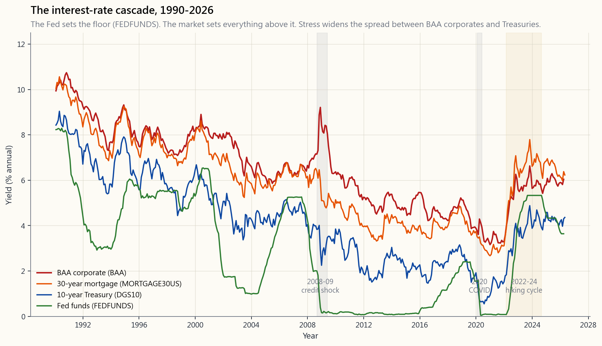
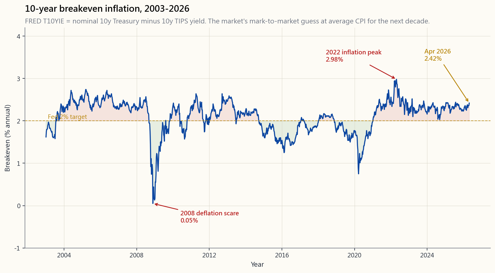

# 第十八週：利率——聯準會的操作、市場的反應，以及利率如何傳導至資產價格

---

## 第一部分：閱讀單元

---

### 1. 為何這個主題至關重要

在金融世界裡，有一個數字主宰著其他所有數字，那就是折現率。折現率由兩個部分構成：無風險的國庫券殖利率，以及在此之上加計的信用／股票利差。只要國庫券殖利率移動，*全球每一分未來現金流*——你的房貸、你的股票、你的私募股權基金淨值、你所在國家的退休金負債、隔壁倉庫的租約——全部都會悄悄重新定價。沒有任何資產能夠逃離這個引力場。

聯準會並不直接設定這個數字。聯準會設定的是*一個*利率（隔夜聯邦資金利率），而且每六到七週才設定*一次*，其餘的事都由市場完成。房貸利率、10年期國庫券殖利率、BAA級公司債殖利率、垃圾債券利差、美元匯率，以及股票估值倍數，全部都在無需任何人授權的情況下自行調整。聯準會在短端插下旗幟，市場則建構出整條殖利率曲線。

從這堂課中，你需要內化四件事。

1. **利率是普世的分母。** 一檔市值100美元、每股盈餘5美元、成長率3%的股票，在4%折現率下值一個價，在8%折現率下值的是截然不同的價格。同一家公司、同樣的盈餘，價格卻天差地遠。本課末尾的互動工具讓你滑動折現率，親眼看著典型長存續期間現金流的現值如何崩跌。做一次那個練習——真的去做，動手滑那個滑桿——此後你再也不會問「為什麼市場在聯準會宣布後大跌？」

2. **聯邦資金利率是一根槓桿，而非結果。** 你實際支付的房貸利率、投資等級企業發債的利率、以及財政部拍賣10年期公債所形成的殖利率，都是*市場*利率。它們受聯準會政策影響，但並非由聯準會直接設定。第2.1節的瀑布圖呈現出四個層次——聯邦資金利率、10年期殖利率、30年期房貸利率、BAA級公司債利率——以及在市場壓力與制度轉換期間，各層之間的利差如何擴大。

3. **驅動估值的是實質利率，而非名目利率。** 在5%通膨環境下的5%名目殖利率，與0%通膨環境下的0%名目殖利率，實質報酬是相同的。市場透過TIPS損益平衡通膨率（第2.3節）將兩者拆分。2022年發生的事是：*名目*殖利率上漲了三倍，但*實質*殖利率從-1%躍升至+2%。正是這3個百分點的實質利率上升，重創了長存續期間科技股，而非名目數字的標題。

4. **過去45年間，我們僅經歷過兩次制度性斷裂。** 第一次是1981年的伏克爾時代，他將聯邦資金利率推升至20%，以此終結了雙位數通膨，並引發了長達四十年的債券多頭市場。第二次是2022年至今，零利率時代的終結。2026年持有60/40投資組合的投資人，整個職業生涯都活在同一個制度的同一側。他們需要知道另一側是什麼感覺。

---

### 2. 你需要掌握的知識

#### 2.1 利率瀑布——聯邦資金利率、10年期、房貸利率、BAA級公司債

利率的世界不是一個數字，而是一個層次分明的階層結構，瀑布圖讓這個結構清晰可見。

從下往上讀這張圖。

- **聯邦資金利率（FEDFUNDS，綠色）**是銀行彼此隔夜拆借的利率，由聯邦公開市場委員會設定目標。這是圖上*唯一*由聯準會直接設定的一條線。從2009年至2015年，以及2020年至2022年，這條線被釘在零利率下限。2022年3月至2024年中的升息循環，將其從約0%推升至約5.4%。
- **10年期公債殖利率（DGS10，藍色）**是10年期美國公債拍賣形成的市場殖利率，是全球最受關注的價格。房貸利率、長期公司債，以及股市折現率，全部以此為基準。注意它在長期窗口中如何跟隨聯邦資金利率，但短期並不亦步亦趨——10年期殖利率是對*未來*短期利率路徑的10年期預測加上期限溢酬，而非當前聯邦資金利率的翻版。
- **30年期房貸利率（MORTGAGE30US，橙色）**疊加在10年期殖利率之上，利差在平靜市場中收窄（約150個基點），在壓力時期擴大（2008至2009年及2022至2023年均超過250個基點）。這個利差反映了提前還款風險、不動產抵押貸款證券投資人的需求，以及銀行的承接能力。
- **BAA級公司債（BAA，紅色）**是投資等級公司債殖利率的最低一級。其與10年期公債的利差，*正是*市場對違約風險的判讀。2008至2009年，這個利差從約170個基點爆增至約600個基點。2026年4月，回到約190個基點附近。

你應從中得到的結論是：聯準會設定一個利率，其他四個利率因此而動，但並非完全亦步亦趨。理解哪個利差在擴大、為何擴大，正是嚴肅的總體分析實際上大部分在做的事。

#### 2.2 折現率是普世的分母

你將看到的每一種估值方式——股利折現模型、現金流量折現法、本益比、淨值、內部報酬率——都是建立在同一個假設之上的運算：折現率$r$。我們在第5週見過最簡單的形式。Gordon成長模型指出，一個下期支付股利$D$、永久以$g$成長的永續年金，價值為

$$ P = \frac{D}{r - g} $$

三行代數包含了股票估值的大部分精髓。注意極端情況下會發生什麼。

- $r = 4\%,\ g = 0\%$ → $P/D = 25$。典型的類債券型股票。
- $r = 6\%,\ g = 2\%$ → $P/D = 25$。同樣的估值倍數，完全不同的故事。較高的成長抵消了較高的折現率。
- $r = 4\%,\ g = 3\%$ → $P/D = 100$。2020至2021年全球所見的「長存續期間成長股」倍數。
- $r = 8\%,\ g = 3\%$ → $P/D = 20$。同一家公司，折現率提高400個基點，估值倍數壓縮了80%。

2022年長存續期間科技股的崩跌，*正是這最後一步*。名目10年期公債殖利率上漲約250個基點，股票風險溢酬擴大約150個基點。折現率累計上升約4個百分點，使長期現金流的現值大約腰斬。確實如此。本課末尾的互動工具可即時計算$P/(r-g)$，讓你不必再與圖表爭論，直接動手滑滑桿。

同樣的分母驅動著債券存續期間（第5週）、不動產資本化率、私募股權基金淨值標記，以及退休金負債。所有金融事物都是偽裝成不同形式的現值計算。折現率*就是*資產定價的核心；其他一切都只是裝飾。

#### 2.3 實質利率與TIPS損益平衡通膨率

名目殖利率 = 實質殖利率 + 預期通膨率。這個拆分至關重要，因為借貸雙方都在意的是購買力，而非表面數字。財政部發行兩種並行的債務工具：名目公債（DGS10）與通膨保值公債（TIPS）。兩者的殖利率差異，即為**10年期損益平衡通膨率**，FRED數列代碼為`T10YIE`。

三個現象特別突出。

1. **2008年通縮恐慌**。2008年11月，損益平衡通膨率轉為*負值*——市場短暫定價未來十年物價下跌。正是這個讀數促使聯準會在2009年初推出量化寬鬆；負的損益平衡通膨率是通縮警報。
2. **2022年通膨高峰（約2.9%）**。即使在消費者物價指數達到9%的高峰期，10年期損益平衡通膨率也從未突破3%。債券市場自始至終相信聯準會最終會將通膨打壓至目標水準。這個信念是對的，它防止了長期利率的恐慌演變為自我實現的預言。
3. **2026年4月的讀數**落在聯準會的目標區間內，這也是聯邦資金利率得以從高峰開始降息的部分原因。

對於股票投資人而言，實質利率比名目利率更重要，因為實質現金流（盈餘、股利、租金）會隨物價通膨調整。當實質利率上升——如2022年的大幅攀升——長存續期間股票的跌幅會*超過*名目利率變動單獨所能預測的程度。

#### 2.4 1981年伏克爾高峰與2020年零利率下限——兩次制度性斷裂

若將60年的美國貨幣史壓縮為兩個事件，就是以下這兩個。

**1979年10月至1981年7月**，保羅·伏克爾走進聯準會，決心打破雙位數通膨。他做到了，方式是讓聯邦資金利率去到它必須去的地方：1981年中期峰值超過19%。10年期公債殖利率峰值達到15.8%。經濟陷入殘酷的雙底衰退。通膨被打破。然後債券市場開始了長達四十年的多頭行情，直至2020年7月10年期殖利率觸及0.55%才告終。任何人若在1981年買入長期公債並持有至2020年，其年化總報酬都超越了標普500指數。

**2020年3月至2022年**，聯準會將聯邦資金利率降至零，資產負債表在18個月內擴張4.6兆美元，並將實質利率維持在深度負值。資產價格垂直上揚。長存續期間科技股、特殊目的收購公司、加密貨幣、住宅不動產——所有對折現率敏感的事物，表現得就像折現率*被設定為零*一樣，因為在實質上確實如此。

這兩個事件框住了*被動投資的40年制度*。激勵了柏格、巴菲特，以及整個指數股票型基金產業的「被動指數投資必勝」論點，是建立在1981至2020年債券多頭市場及其所帶來的通膨下行趨勢之上的。這個策略是有效的。但這個策略*同時也*座落在一個歷史性的制度背景之上，而核心教訓在於：制度背景會改變。

波動率尾巴搖動政策狗的觀點直接相連：伏克爾必須打破債券市場才能打破通膨。2022年，聯準會必須冒著打破股市的風險才能打破疫後通膨。當聯準會強力拉動利率槓桿，*波動率*這條尾巴就會搖動政策這隻狗。2023年3月的矽谷銀行正是如此——一家存續期間錯配到升息循環中的地區性銀行，在36小時內遭到以Twitter為協調平台的存款人擠兌。聯準會的銀行定期融資計畫（BTFP）在下個週末緊急推出。

#### 2.5 2022至2024年升息循環詳解

這些數字值得牢記，作為校準基準。

- **2022年3月**：聯邦資金利率從0至0.25%升至0.25至0.50%。三年來首次升息。
- **2022年11月**：連續四次升息75個基點後，聯邦資金利率達到3.75至4.00%。自1981年以來最快的緊縮速度。
- **2023年7月**：聯邦資金利率峰值5.25至5.50%。
- **2023年3月**：矽谷銀行、Signature銀行、第一共和銀行。三家銀行在一週內倒閉。聯準會推出銀行定期融資計畫（BTFP）並繼續升息。
- **2024年**：9月首次降息50個基點，年底前再降息25個基點。聯邦資金利率以4.25至4.50%結束2024年。
- **2026年4月**：聯邦資金利率趨於穩定；損益平衡通膨率回到聯準會2%目標附近（見第2.3節）。殖利率曲線從2022年中至2025年初的倒掛，恢復為正常的正斜率。

這個循環帶來的三點啟示。

1. 政策傳導至經濟的時滯約為12至18個月。2022年3月開始的升息，在2023年底至2024年間最重打擊了住宅房市與中小企業信貸。
2. 大部分資產價格損失發生在*預期*升息循環期間，而非升息過程中。標普500指數在聯邦資金利率峰值前八個月就已觸底。市場提前反映折現率。
3. 存續期間比以往任何時候都更重要。30年期公債從2020年8月至2023年10月跌去約46%的價值。這比大多數股票空頭市場的跌幅還大。債券並不「安全」。

#### 2.6 利率變動下的成長股與價值股

股票存續期間是真實存在的，即使我們從未明確引用。一家盈餘成長率3%、大部分現金流集中在未來五年內的股票，存續期間短，折現率的變動對其影響不大。一家盈餘成長率25%、大部分現金流預期在未來十年或二十年才兌現的股票，存續期間*極長*——它本質上就是一張長期零息債券。

從機制上看，**成長股是長存續期間；價值股是短存續期間。** 當利率上升：

- 成長股估值倍數大幅壓縮。那斯達克100指數2022年下跌33%，而標普500下跌18%，羅素2000價值指數僅下跌14%。同一個財報季，不同的折現率$r$敏感度。
- 價值股（銀行、公用事業、工業股）現金流存續期間較短，且往往直接受益於更陡的殖利率曲線。
- 債券當然按存續期間比例跌價：10年期債券2022年跌約18%，30年期跌約33%。

這就是為什麼「成長股與價值股」的輪動與利率循環同步，而非與投資人情緒同步。本課末尾的互動工具包含一個側邊面板，精確呈現+100個基點的利率變動如何影響四種代表性現金流：10年期債券、30年期債券、高成長股票（4%成長、10年存續期間）以及價值股（1%成長、5年存續期間）。

槓鈴直覺在這個輪動中依然成立：買進短存續期間價值股，同時配置少量凸性高的長存續期間成長股，讓你同時持有兩種制度下的收益，而無需押注哪種制度勝出。2022年純做長存續期間科技股足以葬送職業生涯；純做價值股則會錯過過去十年每一筆偉大的投資。槓鈴勝出，因為制度無法預測，而利率移動幅度巨大。

---

### 3. 常見迷思

1. **「聯準會設定房貸利率。」** 錯。聯準會設定的是隔夜聯邦資金利率。房貸利率是依10年期公債殖利率加上不動產抵押貸款證券利差定價的，兩者都是由市場決定的。
2. **「利率升高必然導致股價下跌。」** 並非如此。在升息循環的早期，當升息意味著景氣良好時，股市可能與利率同步上漲。2004至2006年的循環就是典型例子。重要的是，實質利率的上升速度是否超過預期成長速度。
3. **「通膨對股票有利，因為企業可以調漲價格。」** 僅在溫和水準且特定情況下成立。通膨超過約4%時，股票估值倍數會急劇壓縮（1970年代、2022年）。股票是實質資產，但它們同時也是長存續期間的折現現金流，折現率效應在通膨超過約3%後佔主導地位。
4. **「通膨保值公債可以對抗通膨。」** 是的，但它們同時也是長期債券，其*實質*殖利率可能上升。2022年，即使通膨保值公債在通膨這一端發揮了應有作用，其本金仍因實質殖利率上升而蒸發了約12%。
5. **「持有公債至到期不會虧損。」** 就名目金額而言為真，就實質金額而言為假。2020年以1%殖利率買入的30年期公債，將償還每一分名目本金，但以2026年的通膨預期計算，它被鎖定在每年約-1%的實質報酬長達三十年。
6. **「現金是安全的。」** 現金名目上安全，在通膨期間實質上危險。從2020年至2024年，存放在0%利率銀行帳戶的一美元，損失了約17%的購買力。現金是一個*部位*，而非預設值。四象限架構明確將流動性*和*短期公債作為獨立項目劃分出來。
7. **「量化寬鬆導致通膨。」** 2009至2017年長達八年的量化寬鬆沒有產生任何消費者通膨。2020至2021年的一輪量化寬鬆卻帶來了40年來最大的通膨。差異在於財政政策：2020至2021年的量化寬鬆配合了超過5兆美元的財政移轉支付，直接將現金送入消費者手中。量化寬鬆本身移動的是銀行準備金，而非物價。
8. **「殖利率曲線倒掛必然意味著經濟衰退。」** 自1955年以來，它確實預示了每一次衰退（只有一個模糊的例外）——這是高命中率，而非保證。2022至2025年的倒掛是有記錄以來持續時間最長的一次，最終迎來的是軟著陸，而非典型的美國國家經濟研究局定義的衰退。
9. **「外國利率與美國股票無關。」** 錯。美元是全球儲備貨幣；利率差異驅動美元，美元驅動跨國企業盈餘（標普500指數約40%的營收來自美國以外），美元驅動原物料價格。日本央行2024年的政策轉向是標普500指數的重要輸入變數。
10. **「實質利率高於2%是『正常』的。」** 實質利率從1900年至1980年*平均*為2至3%。從2008年至2022年平均接近0%。沒有單一的「正常」——制度決定水準。制度轉換的觀點在此再度適用。

---

### 4. 問答單元

**問：如果我只能關注一個利率，該看哪一個？**
答：10年期公債殖利率。它是利率市場每一條資訊的最佳單一摘要——聯準會政策預期、期限溢酬、實質成長預期，以及通膨預期。它持續報價、沒有信用利差，而且是所有人引用的折現率基準。

**問：聯邦資金利率與「折現率」有何區別？**
答：術語容易混淆。聯邦資金利率是聯準會設定目標的隔夜銀行同業拆借利率。聯準會的*貼現率*是聯準會向直接向貼現窗口借款的銀行收取的（略高的）利率。實務上，貼現窗口是備用機制；聯邦資金利率才是主要工具。本課在沒有特別說明的情況下提到「折現率」，指的是在現金流量折現法中使用的金融經濟學折現率$r$，而非聯準會的貼現窗口利率。

**問：我如何知道實質利率的移動方向？**
答：用名目10年期殖利率（FRED `DGS10`）減去10年期損益平衡通膨率（FRED `T10YIE`）。FRED也直接發布`DFII10`（10年期通膨保值公債殖利率）。實質利率 = 名目殖利率 - 損益平衡通膨率。實質利率上升是長存續期間資產最可靠的空頭信號。

**問：現在應該選擇固定利率還是浮動利率的借款？**
答：這是個人理財問題，而非投資建議，但框架如下：如果你預期實質利率將從現在起繼續上升，選擇固定；如果你預期下降，選擇浮動。以2026年4月的狀況來看，10年期殖利率約4%，損益平衡通膨率接近2%，實質利率約為2%——大約是長期平均水準。在這個狀況下，大力鎖定固定利率或大力選擇浮動利率，都看不到明顯的不對稱優勢。

**問：什麼是「期限溢酬」，為什麼大家總在談它？**
答：期限溢酬是投資人為了持有長期債券而非滾動短期債券所要求的額外殖利率。在數學上，它是10年期殖利率中*無法*由未來短期利率預期解釋的部分。從2014年至2021年，它大約為零甚至為負——債券投資人為安全性支付了溢價。2024至2025年，它已悄悄回升至約50個基點。較高的期限溢酬意味著長存續期間資產被折現得更多。

**問：聯準會真的能控制通膨嗎？**
答：它能透過利率和銀行準備金控制通膨的*需求面*。它無法控制供給衝擊（石油、晶片、航運）。2021至2022年的通膨約60%由供給驅動、40%由需求驅動；聯準會只能攻擊需求的那一半。伏克爾在1981年勝出，是因為需求是主要驅動力。1973至1974年的通膨主要源於石油供給衝擊，伯恩斯的升息效果有限。

**問：為什麼債券市場有時候在壞消息出現時反而上漲？**
答：因為壞消息使預期的未來短期利率路徑*降低*，從而推升債券價格。債券喜歡經濟衰退，股票大多討厭它。這種不對稱的相關性，正是60/40投資組合能夠發揮作用的原因。第4週討論過這一點；它是投資組合分散化工具存在的核心理由。

**問：聯準會升息多快會反映在房貸利率上？**
答：30年期房貸利率的移動是基於對聯準會行動的*預期*，而非行動本身。一次「出乎意料」的升息25個基點，那週大概只會讓房貸利率移動10至20個基點。而*預期路徑的改變*——例如偏鷹派的點陣圖——可以在一個下午讓房貸利率移動50至100個基點。等聯準會真正採取行動時，大部分影響早已消化。

**問：通膨保值公債在通膨時期是免費的午餐嗎？**
答：不是。通膨保值公債保護的是*本金*對抗消費者物價指數，但其*實質*殖利率會隨市場浮動。2022年實質殖利率上升250個基點，通膨保值公債價格下跌。它們防範的是*意外*通膨，而非實質利率正常化。它們是保險，不是魔法。

**問：我應該如何為自己的投資組合決策思考折現率？**
答：設定一個個人門檻報酬率——低於此水準的項目不值得你花時間投入。對於大多數承擔完整股票風險的美國投資人，這個門檻是10年期公債殖利率加上4至5%的股票風險溢酬。因此，以2026年4月10年期殖利率約4%計算，你的門檻約為8至9%。你的每一筆配置都應該能跨越這個門檻，否則就不值得去做。超額報酬阿爾法是罕見的：如果你無法說清楚你的想法為何能超越門檻，那就表示它做不到。

**問：1981至2020年的債券多頭市場真的結束了嗎？**
答：可能是的，但「可能」不等於「確定」。第二波通膨下行（由人工智慧生產力、人口結構、全球化2.0推動）可能讓10年期殖利率再度跌破2%。但這個十年剩餘時間的*基本情境*，是3至5%名目殖利率的區間震盪，這也是歷史常態。建立一個*需要*殖利率跌回1%才能奏效的投資組合——大多數激進的長存續期間科技股部位隱含地就是這樣——是一個制度依賴型的賭注，而制度已經改變了。

**問：這一課與課程其他部分如何銜接？**
答：它是坐落在第5週（債券）、第4週（60/40）、第10週（景氣循環）、第11週（利率衝擊中的行為偏誤）、第13週（多空策略及其在不同利率制度下的表現）之下的總體引擎。每一種資產都有存續期間。折現率牽動所有資產。這一週是串聯整個課程的橋梁。
