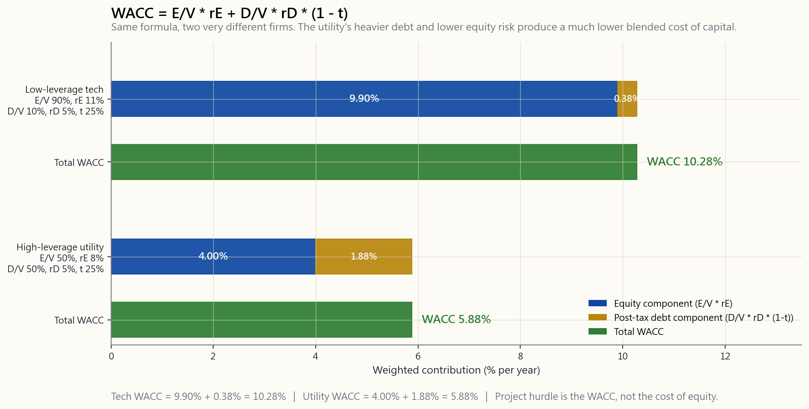
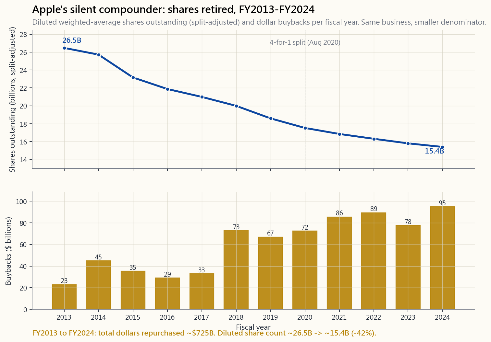

# 第十九週：投資者視角的公司財務——資本結構、加權平均資金成本、庫藏股回購與併購

---

## 第一部分：閱讀章節

---

### 1. 為何重要

當你買進一家上市公司的股份，等同於聘僱一支管理團隊代替你配置資本。在十年的時間跨度內，一家每年賺進十億美元的企業，將部署一百億美元的資金。這一百億究竟流向報酬率二○%的項目，還是流向報酬率四%的收購案，對你長期報酬的影響，遠遠大於任何一季的盈餘超預期。公司財務，正是這些資本配置決策所使用的語言，也是公開市場能讓你最接近真正看透執行長工作的那扇窗。

以下四個理由，說明這堂課應納入投資者的學習清單，而不僅是會計師的：

1. **資本結構改變的是股票的形狀，而非顏色。** 一家純股權融資的公司，與一家半債半股的公司，擁有完全相同的營運業務，但股東所面對的報酬分布卻截然不同。槓桿版本在正常年度提供更高的預期股東權益報酬率，卻在壞年份帶來更大幅度的回撤——有時甚至是完全歸零。若不先了解兩家公司各自的槓桿程度，就無法對其本益比做出有意義的比較。
2. **資金成本是每個項目都必須跨越的門檻。** 加權平均資金成本聽起來像教科書的抽象概念，但它具有高度的實務意義：若一位執行長批准了一個報酬率六%的項目，而公司的加權平均資金成本是九%，這個項目每運作一年就在摧毀價值，無論新聞稿的措辭多麼高明。同一個折現率，也是你估值試算表中現金流量折現法所使用的數字，因此加權平均資金成本算錯，目標股價也就跟著錯。
3. **庫藏股回購與股利並非相同事物的不同包裝。** 教科書說在完美市場下兩者等價。現實世界卻疊加了稅務、訊號效果、高管股票薪酬的稀釋效應，以及價格紀律等因素。蘋果自二○一三年以來已花費超過七千億美元進行庫藏股回購——超過地球上絕大多數公司的整體市值——而每股盈餘成長背後，流通股數縮減才是那個沉默的複利引擎。
4. **併購是執行長最常摧毀價值的單一場域，學術界的證據毫不留情。** 目標公司股東通常獲得二○%至三○%的溢價；收購方股東在宣布當日通常損失一%至五%。身為收購方的持有人，一份併購新聞稿理應讓你拿出一份查核清單，而非舉杯慶祝。

本課程只針對投資者。我們不涵蓋資本預算試算表、最優資本結構的數學證明，或稽核師視角下的關係企業消除。我們討論的是：讀什麼、找什麼，以及哪些紅旗值得你皺眉。

---

### 2. 你需要知道的事

#### 2.1 債務與股權——買進同一資產的兩種方式

每家公司都由某種比例的債務（貸款方）與股權（所有人）組合融資。貸款方的請求權具有契約性：固定的票面利率，按期支付，且在清算時享有優先受償地位。所有人的請求權則是剩餘性的：在貸款方、員工、供應商與稅務機關全部獲償之後，才輪到股東。貸款方優先受償，但獲利有上限；所有人最後受償，但獲利無上限。

對投資者的啟示：相同的營業現金流，採用不同的融資方式，會為股東帶來截然不同的結果。

| 項目               | 純股權公司  | 五成負債公司 |
| ------------------ | ----------- | ------------ |
| 總資產             | 十億美元    | 十億美元     |
| 六%債務            | 零          | 五億美元     |
| 股權               | 十億美元    | 五億美元     |
| 營業利益（好年份） | 一·五億美元 | 一·五億美元  |
| 減：利息費用       | 零          | 三千萬美元   |
| 減：二五%稅        | 三七五萬美元| 三千萬美元   |
| 淨利               | 一·一二五億 | 九千萬美元   |
| **股東權益報酬率** | **11.25%**  | **18.0%**    |

在**好年份**，槓桿公司的股東在自身資本上多賺六○%。同樣的槓桿，若碰上營業利益跌至二千萬美元的年份，槓桿股東出現虧損，無槓桿股東卻仍有小額獲利。槓桿不改變業務本身，它改變的是股票報酬的波動性。正如陳馬所說：「市場保持非理性的時間，可以比你保持償債能力的時間更長」——而槓桿股東的償債能力，比無槓桿股東耗盡得快得多。

#### 2.2 莫迪里安尼—米勒定理，以及打破它的現實摩擦

一九五八年，莫迪里安尼與米勒證明：在沒有稅、沒有破產成本、且資訊對稱的世界裡，公司的總價值**與融資方式無關**。把同一塊披薩切成不同的債務與股權組合，並不會改變披薩的大小。每位財務學生都被要求背記這個結論，然後立刻被教導為何它在實務中不成立——而這才是重點所在。莫迪里安尼—米勒定理是一條基準線，它精確地告訴你，哪些現實摩擦讓資本結構變得重要。

三大關鍵摩擦：

- **稅盾效應。** 利息費用可抵稅；股利則不行。若一家公司以二五%的企業稅率支付一百元利息，實際成本僅七十五元。這個稅盾是真實的金錢，它將最優資本結構推向比莫迪里安尼—米勒定理預測**更多**的負債。
- **財務危機成本。** 過多的債務使違約與重整的可能性上升。直接成本（法律費用、重整顧問費、資產賤賣損失）與間接成本（客戶流失、供應商縮緊付款條件、關鍵員工離職）都相當龐大，且具不對稱性——它們只在公司已陷入困境時才會出現。這股力量將最優結構推回**更少**負債的方向。
- **資訊不對稱與代理問題。** 管理層對公司的了解程度遠超過外部投資者。發行股票被市場解讀為管理層認為股票被高估的訊號；發行債務則被解讀為對未來現金流的信心。這就是融資優序理論——企業優先使用內部資金，其次是債務，最後迫不得已才發行股票。

最優資本結構，是邊際稅盾效益等於邊際財務危機成本增量的那個負債水準。對現金流穩定的成熟企業而言，這通常落在三○%至五○%的負債比例。對現金流波動的行業（科技、生技、任何景氣循環型企業），最優點低得多；對穩定的公用事業與不動產投資信託而言，則高得多。沒有放之四海皆準的答案，只有根據底層業務特性進行的校準。

#### 2.3 加權平均資金成本——一個主宰一切的門檻利率

加權平均資金成本是公司所有運用中資金的混合成本。這個公式並不令人生畏，只要你慢慢讀：

$$
\text{加權平均資金成本} = \frac{E}{V}\cdot r_E + \frac{D}{V}\cdot r_D \cdot (1 - t)
$$

其中 $E$ 是市值，$D$ 是市場價值計算的債務，$V = E + D$ 是總資本，$r_E$ 是股權成本（通常透過資本資產定價模型估算：$r_f + \beta \cdot \text{股權風險溢酬}$），$r_D$ 是債務成本（即公司債券的殖利率），$t$ 是邊際稅率。$(1-t)$ 因子正是稅盾效應的入口：稅後債務成本比稅前便宜，差額恰好等於稅率。

下圖呈現兩家截然不同企業的相同計算——一家低槓桿科技公司，以及一家高槓桿公用事業：

解讀既簡單又殘酷：公司核准的每個項目，在風險調整後的報酬率必須至少達到加權平均資金成本，才能為股東創造價值。一個在加權平均資金成本九%的公司內、只賺七%的項目，每年摧毀二%的價值，無論財務長的簡報做得多漂亮。**投入資本報酬率高於加權平均資金成本**，是判斷執行長是在創造或摧毀價值最乾淨的單一測試。

幾點實務注意事項：

- 加權平均資金成本是**當前**的數字，而非歷史數字。當利率上升，加權平均資金成本也機械式地跟著上升。
- 使用**市場**價值，而非帳面價值。一家連續十年進行庫藏股回購的公司，其帳面股權毫無意義——有些公司（波音、星巴克在某些時期）的帳面股權甚至是負數。
- 加權平均資金成本是公司整體的平均值。比公司基礎業務風險更高的項目，應以更高的折現率評估；更安全的項目則應使用更低的折現率。對整個資本計畫套用同一個加權平均資金成本的財務長，系統性地過度投資於高風險項目，並低度投資於安全項目。

#### 2.4 股利、庫藏股回購，以及為何兩者**幾乎**等價

在無摩擦的世界裡，一元股利與一元庫藏股回購完全相同：兩者都是將一元公司現金移轉給股東。股利以現金形式出現在你帳戶中，並在除息日讓股價下跌一元。庫藏股回購使用一元公司現金注銷股份，使剩餘股份的每股價值恰好提升一元。價值守恆定律告訴我們兩者等價。

三個現實摩擦打破了等價性，且對投資者至關重要：

- **稅務。** 在美國，合格股利在每年收到時即須課稅。庫藏股回購將利得遞延至資本利得的範疇，由持有人自行決定何時實現（甚或不實現——死亡時的成本基礎遞增可使其消失）。對美國高稅率應稅持有人而言，這種遞延在數十年複利後具有相當可觀的價值。陳馬的核心理念——投資組合的建構，不亞於底層標的選擇的是稅務效率與選擇權及保證金工具的活用——正是如此：兩種現金回報機制，對同一位投資者而言，稅後並**不**相互可替代。
- **價格紀律。** 以三○元進行庫藏股回購而內含價值為五○元，是一筆絕佳的交易——每投入一元，就為留存股東買進一·六七元的價值。以五○元進行庫藏股回購而內含價值為三○元，則是將○·四元的價值從留存股東**轉移出去**，流向那些套現離場的人。多數公司回購時根本沒有任何明確的估值紀律，這也是為何儘管數學原理簡單，庫藏股回購的實證效果卻參差不齊。
- **稀釋抵消陷阱。** 最常見的濫用手法：公司宣布五十億元的庫藏股回購，但流通股數幾乎沒有變動，因為公司同時向高管發行了四十億元的股票薪酬。這樣的回購只是在**抵消稀釋**，而非真正回報資本。檢查方式相當機械——調出過去五年的流通股數，看看它是否真的下降了。

蘋果是正面的典型範例。自二○一三年中重啟回購計畫以來，已花費**超過七千億美元**回購股票，並將其稀釋後加權平均流通股數從約二六五億股（按二○二○年一拆四調整後）壓縮至二○二四財年的約一五四億股。下圖呈現這段歷程的軌跡：

同樣的業務。同樣的iPhone。同樣的毛利率。蘋果這十年每股盈餘的複利成長，與其說是**分子**在增長，不如說同樣是**分母**在縮小的故事。流通股數是那個沉默的複利引擎，而多數散戶幾乎從不追蹤它。

本節的互動工具讓你即時調整加權平均資金成本的輸入值（股權比重、股權成本、債務成本、稅率），觀察對一億元五年期項目淨現值的影響，並與蘋果、微軟、摩根大通、可口可樂、福特的近似加權平均資金成本進行比較。試著在業務風險不變的情況下拉高槓桿，看著項目淨現值上升——直到你推得過頭，隱含的財務危機成本（這個簡單公式並未模型化）將遠遠抵消掉所有收益。

#### 2.5 併購——多數收購方股權消亡之所

企業併購是公司財務領域被研究最多的事件，而跨越數十年與地域的實證規律高度一致：目標公司股東獲益，收購方股東受損，合計價值在宣布當日大致持平或略為負數。

溢價的數學：

- 目標公司以四○美元交易，市值四十億美元。
- 收購方在競爭性競標中出價五二美元——三○%的溢價——以贏得交易。
- 收購方必須相信能夠從中提取至少十二億美元的淨綜效價值（成本削減加營收提升，現值計算，扣除整合成本），才能**損益兩平**。
- 宣布時所聲稱的綜效平均約為合併後企業價值的六%；三年後實際兌現的綜效平均不到一半。這個落差，由收購方股東買單。

反覆出現的失敗模式：

- **贏者詛咒。** 在競爭性競標流程中，勝出的競標者是對目標公司估價最高的那一方——而這恰恰也是預測最樂觀的競標者。從結構上看，勝出的競標者最有可能付出溢價。
- **整合摩擦。** 兩套薪資系統、兩套企業資源規劃系統、兩種企業文化、兩套客戶服務體系。整合的成本永遠比綜效簡報所承諾的更高、耗時更長。
- **帝國建造。** 執行長薪酬與公司規模的相關性，強過與公司**價值**的相關性。一場經濟效益平庸的收購案若能讓員工人數翻倍，就可能讓執行長薪酬翻倍，即便股票下跌。
- **周期時機。** 併購交易量在市場高峰時達到頂點。收購方恰恰在融資成本最低、樂觀情緒最高漲之際，付出最高的價格——從價值角度來看，這正是最糟糕的時機。

當你在持股上看到一份併購新聞稿，投資者的查核清單：

1. **溢價與定價。** 支付的稅息折舊攤銷前獲利倍數、營收倍數或自由現金流倍數是多少？高於還是低於可比交易？
2. **融資組合。** 全現金來自資產負債表是最佳情況（收購方押上自己的真金白銀）。全股票且股價偏低是最差情況（收購方用估值偏高或合理估值的股票換取實物資產）。大量債務融資會徹底改變合併後主體的整個資本結構——重新計算你的加權平均資金成本。
3. **綜效聲稱。** 成本綜效（裁員、關閉廠房）有可信度且可量化。營收綜效（「交叉銷售機會」）通常是空談。若超過一半的溢價靠營收綜效支撐，做空這個說法。
4. **過往紀錄。** 這支管理團隊之前做過類似交易嗎？調出交易後的投入資本報酬率。有長期勝利紀錄的連環收購者極為罕見，值得溢價；有長期失敗紀錄的連環收購者，往往是在試圖掩蓋停滯的核心業務。
5. **「變革性」信號。** 若管理層稱這筆交易「具有變革性」，代表現有業務正在停滯，他們正在買一個故事。賤賣一個停滯的業務來換取一個你尚無法評估的故事，幾乎從來都不是你想進行的交易。

---

### 3. 常見迷思

1. **「零負債永遠更安全。」** 無債公司放棄了稅盾效應，往往運行著比必要更高的加權平均資金成本，有時這反而代表缺乏資本紀律，而非審慎。適度的負債，與業務現金流穩定性相匹配，在結構上比股權更便宜。
2. **「股利是白給的錢。」** 在除息日，股價會下跌約等同股利的金額。股利是從公司現金移轉到你口袋的價值，而非創造價值。它提供的是強制性分配與稅務分層，沒有免費午餐。
3. **「七%的殖利率是很棒的收入。」** 異常高的殖利率，更常是市場預判股利即將遭到削減的判決，而非慷慨的訊號。在追逐殖利率之前，先看自由現金流覆蓋率與配息率趨勢。殖利率陷阱是追求收入的投資者最常犯的錯誤之一。
4. **「庫藏股回購對股東永遠有利。」** 只有在低於內含價值時買進，且流通股數確實下降，才算有利。以五○元回購而內含價值為三○元，是一份穿著新聞稿外衣的財富毀滅。務必確認稀釋後流通股數是否真的下降了。
5. **「加權平均資金成本是固定的。」** 加權平均資金成本隨利率、槓桿程度以及底層業務風險而變動。將歷史加權平均資金成本套入當前估值，給出的是看似精確卻實則錯誤的數字。
6. **「執行長的工作是讓盈餘成長。」** 執行長的工作是將資本部署在報酬率超過加權平均資金成本的地方。盈餘可以透過在健康的核心業務上不斷堆疊摧毀價值的收購案來無限增長，直到有一天核心業務再也健康到不足以掩蓋這些爛攤子。
7. **「併購對收購方是順風車。」** 平均而言，並非如此。宣布當日的合計價值大致持平或略為負數；收購方通常將自身市值的一%至五%讓渡給目標公司的持有人。
8. **「莫迪里安尼—米勒定理在實務中毫無用處。」** 作為**處方箋**，它確實無用；作為**基準線**，它不可或缺。每一個偏離莫迪里安尼—米勒定理的現實情況都代表某種具體因素——稅務、財務危機、資訊不對稱、代理問題——而點名這個偏離，正是你判斷哪些資本結構變化對股票有實質影響的推理方式。

---

### 4. 問與答

**問一：我如何快速估算正在研究的美國大型股的加權平均資金成本？**
答：從最新一次發債或市場資料終端取得長期債務殖利率，乘以 $(1-t)$，使用二一%至二五%的有效稅率。股權成本方面，以十年期公債殖利率作為無風險利率，從任何資料終端取得公司的貝塔，並使用五%至六%的股權風險溢酬。以債務與股權的當前市場價值（而非帳面價值）作為權重進行加權。Aswath Damodaran每年發布各行業加權平均資金成本表，是很好的合理性查核參考。

**問二：我可以直接比較不同公司的加權平均資金成本來挑選最便宜的那個嗎？**
答：不行，因為低的加權平均資金成本反映的是更安全的業務，而非更好的投資。正確的比較是每家公司的**投入資本報酬率相對於加權平均資金成本**——一家投入資本報酬率高、加權平均資金成本也高的公司，創造的價值大過一家投入資本報酬率低、加權平均資金成本也低的公司。

**問三：「好的」配息率是多少？**
答：沒有單一標準。低成長的成熟企業（公用事業、民生消費品）可輕鬆維持六○%至八○%，因為它們沒有更好的現金用途。以高投入資本報酬率再投資的成長股應該支付**零**股利——亞馬遜在數十年間以三○%以上的報酬率再投資，並以此聞名。錯誤的數字是靠舉債或已無法覆蓋的自由現金流支撐的高配息率；那是一次削減股利的倒數計時。

**問四：作為持有人，我應該偏好庫藏股回購還是股利？**
答：身為高稅率應稅的美國持有人，庫藏股回購（將實現時機遞延至資本利得範疇，由你掌控）在結構上比股利（按你的時間表每年課稅，而非由公司決定）效率高得多。身為在稅負遞延帳戶內尋求收入的退休人士，股利以及其所提供的現金流可預測性更有價值。同樣的公司，不同的持有人，有不同的最優答案。

**問五：判斷資本配置品質最簡潔的單一測試是什麼？**
答：在五至十年的視窗內，投入資本報酬率持續高於加權平均資金成本，並搭配稀釋後流通股數下降。前者證明執行長每投入一元的邊際資本都在創造價值；後者證明這個價值確實落到了現有股東手中，而非被循環進高管薪酬。

**問六：為何蘋果回購了超過七千億美元的股票？**
答：因為（甲）蘋果產生的現金遠超過其營運業務所能以高邊際報酬率吸收的量；（乙）管理層有足夠的紀律，沒有用這些剩餘資金追逐「變革性」的收購案；（丙）Tim Cook 所揭示的資本計畫是將淨現金部位壓縮至接近零。結果是一個比多數成長公司分子增長速度更快地縮小的分母——以及一個遠高於底層營收成長率的每股複利速度。

**問七：當持股宣布收購案時，我應該如何反應？**
答：預設保持懷疑。閱讀四件事：支付的價格（相較於可比交易的倍數）、融資組合（現金對股票對債務）、綜效聲稱（成本對營收，佔溢價的比例）、以及管理團隊在過往交易中的紀錄。若四項中有三項不利，減碼或避險。收購方股票在宣布當日的反應，方向上通常是正確的。

**問八：雙重股權結構為何具有爭議性？**
答：它讓創辦人以少數的經濟利益保有多數投票控制權——馬克·祖克柏持有Meta約一三%的經濟利益，卻透過B類股掌握多數投票權。支持者的論點是，有遠見的創辦人需要免受短視股東的干擾。反對者的論點是，當創辦人不再正確時，雙重股權結構會使管理層免於問責。學術文獻顯示，雙重股權公司的估值存在可量化的公司治理折價；這個折價是否公平地反映了保護的代價，是一個實證問題。

**問九：加權平均資金成本與我在課程後期將使用的現金流量折現法折現率有何關係？**
答：當被折現的現金流是公司層面的現金流（流向公司的自由現金流）時，兩者是同一個數字。當被折現的現金流是股權層面的（流向股東的自由現金流，或股利）時，折現率單獨使用股權成本，而非混合的加權平均資金成本。許多實務上的現金流量折現法計算，恰恰在這個配對步驟上出錯。

**問十：你（陳馬）在掃描美國大型股時，實際上最先看哪個公司財務指標？**
答：五年與十年的稀釋後流通股數，搭配投入資本報酬率。若公司宣布庫藏股回購，而流通股數卻持平或上升，代表回購只是在抵消稀釋，股東正在被薪酬委員會悄悄地放空。若流通股數下降且投入資本報酬率高於加權平均資金成本，複利是真實的，其餘的分析都在這兩個事實的下游。
