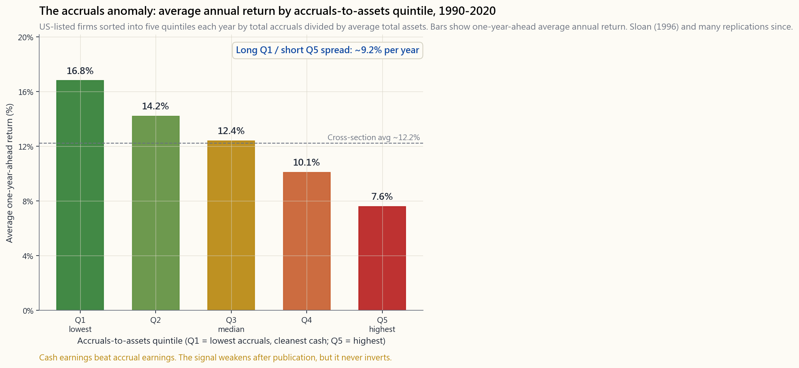
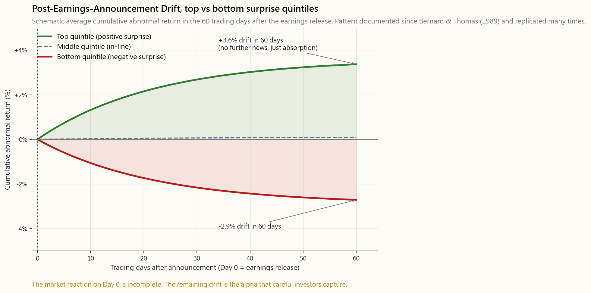

# 第20週：盈餘與現金流——漂移、應計項目，以及為何自由現金流優於每股盈餘

---

## 第一部分：閱讀章節

---

### 1. 為何這很重要

盈餘是一種意見。現金是一個事實。這句話比任何引用它的教科書都還要古老，也依然是基本面投資中最有用的一句話。

報告的每股盈餘——那個在美東時間下午四點零一分出現在資訊終端機上、讓演算法在毫秒內反應的數字——是幾十項會計選擇的最終產物。何時認列營收。折舊速度多快。哪些項目資本化、哪些費用化。呆帳應提列多少準備。每一個選擇，單獨來看，都有其合理依據。但堆疊在一起，它們創造了足夠的彈性空間，使得同一個企業可以印出每股盈餘2.10美元或1.85美元，端看財務長的心情與稽核人員的耐心。

自由現金流比較難以造假。現金要不就進了銀行帳戶，要不就沒有。現金流量表並非完全不受會計判斷影響——營業活動與投資活動現金流的分類，在某些地方確實存在模糊地帶——但現金的*水準*在管理階層裁量下的波動，遠小於報告盈餘的波動。這種不對稱性，正是本週重要性之所在：

1. **兩個最持久的學術異象都與盈餘品質有關，而非盈餘水準。** Bernard & Thomas（1989）記錄了盈餘公告後漂移現象——正面驚喜的股票在六十天內持續上漲，負面驚喜的股票持續下跌。Sloan（1996）記錄了應計項目異象——盈餘主要由應計項目構成的公司，在隔年的表現比盈餘主要由現金構成的公司低約七到十個百分點。這兩個異象均已被重複驗證數十次，發表後都有所減弱，但都尚未反轉。

2. **幾乎每一起重大財務舞弊都能從盈餘品質中察覺。** 安隆、世界通訊、Wirecard、瑞幸咖啡、Valeant。在每一個案例中，報告盈餘與營業活動現金流之間的缺口，早在頭條新聞出現之前的數年間就已發出警報。解讀這個缺口無法取代稽核，但它是一種方法，讓你永遠不必持有那些稽核人員最終不得不否認的公司。

3. **自由現金流才是估值真正折現的對象。** [第21週](week21_valuation_dcf.md)的現金流量折現法模型折現的是自由現金流，而非每股盈餘。一家每股盈餘成長、自由現金流卻萎縮的公司，在該模型下的價值是在降低，而非提升——無論分析師報告怎麼說。

4. **每股盈餘與自由現金流的差距在景氣循環末期會擴大。** 當成長越來越難尋找時，盈餘管理就會越來越積極。應收帳款拉長。存貨堆積。成本被資本化。庫藏股回購拉高每股盈餘，自由現金流卻停滯不前。這個差距本身就是一個景氣循環訊號。

這是本課程的結構性超額報酬來源之一：現金對比應計項目的解讀能力。它並不是什麼秘密，也沒有被套利殆盡，因為大多數市場參與者仍然在交易表面數字。

---

### 2. 你需要知道的知識

#### 2.1 恆等式：應計項目 = 盈餘 − 現金流

從基礎算術開始。對任何一個期間：

- 淨利 = 營業活動現金流 + 總應計項目
- 總應計項目 = 淨利 − 營業活動現金流

這不是一個模型，而是一個定義。營業活動現金流就是淨利扣除應計項目後的結果——折舊加回、營運資金變動調整、遞延稅款調整。從淨利過渡至營業活動現金流的橋接過程中剩下的部分，依定義就是應計項目。

應計項目本身無好壞之分，它的存在自有其道理。已賺取但尚未收取的營收——應收帳款——是真實的資產。提前因應需求而建立的存貨，是真實的經濟活動。折舊，大多數工業企業最大的單一應計項目，是一種誠實的嘗試，將資產的成本與其產出效益的期間相互對應。

問題在於，應計項目*同時也是*管理階層在季度目標不足時伸手去動的槓桿。從淨利到營業活動現金流橋接過程中的每一個項目，都是一個裁量性判斷，而每一個判斷，在被過度操縱時，都能在不增加真實現金的情況下提升報告盈餘。

**為股票篩選計算應計項目的兩種方式：**

- **資產負債表法（Sloan）：** 非現金流動資產的變動，減去流動負債的變動（不含短期負債），再減去折舊。以平均總資產標準化。每年將公司分成五分位數。做多第一分位（最低），放空第五分位（最高）。
- **現金流量表法：** 直接計算`（淨利 − 營業活動現金流）/ 平均總資產`。精神上等同，自2002年SFAS規則收緊後略為簡潔。

應計項目異象如下圖所示：

第一分位減第五分位的利差，是學術界對超額報酬的估計。在真實投資組合中，約有一半會被交易成本、容量限制，以及第五分位放空的借券費用所侵蝕。但即便如此，這仍是有史以來在股票市場中記錄到的最佳風險調整後多空訊號之一。

#### 2.2 盈餘公告後漂移（PEAD）

盈餘公告後漂移是應計項目異象最近的表親。Bernard & Thomas（1989）依標準化未預期盈餘（SUE）對每一份季度盈餘公告排名——即驚喜幅度相對於分析師共識，除以歷史驚喜的標準差。前五分位對比後五分位，在公告後六十個交易日的報酬，橫跨數千份公告取平均：結果穩定得令人乏味。

漂移是市場對資訊吸收不完整的結果。市場在第0天——即公告及法說會當日——就會做出反應，但平均而言，這個反應只達到應有水準的約三分之二。剩餘的三分之一在隨後六十天內緩慢釋出，隨著分析師修正趕上、下一季預告縮小預期區間，以及動作較慢的投資人終於交易了動作較快者早已看到的資訊。

為何這個現象未被套利消除？有三個原因，在所有持續存在的盈餘異象中反覆出現：

- **套利限制。** 第五分位的借券成本確實昂貴。許多應計項目最重的公司是小型股或中型股，借券市場淺薄。這些摩擦對需要擴大規模的基金而言會吃掉超額報酬。
- **職涯風險。** 一個多空經理人，若其第一分位的多頭部位出現六個月的回撤，將在學術均值回歸到來之前就遭到贖回。逆向操作在平均意義上是正確的，但在任何單一年度都是危險的。
- **訊號是慢速的。** 盈餘公告後漂移是六十天的現象。應計項目異象是十二個月的現象。市場大部分的交易量操作的是一天期現象：公告數字對比共識預期。慢速訊號不與快速交易者競爭。

這也連接到價格發現的兩面：動能與均值回歸。盈餘公告後漂移從根本上是一個動能效應——因為*資訊*在市場中流通的速度慢於價格，所以正面驚喜的股票持續上漲。應計項目異象則是一個均值回歸效應——被應計項目虛高的盈餘在隔年向現金水準回歸。它們處於同一枚硬幣的兩面。

#### 2.3 自由現金流的精確定義

自由現金流在市場上以三種不同方式被引用，你必須知道自己在讀哪一種。

- **公司自由現金流（FCFF）= 營業活動現金流 − 資本支出。** 最基本的定義。在維持和擴張資產基礎後，尚未返還給負債或股權持有人之前剩餘的現金。這是現金流量折現法模型所需要的數字。
- **股權自由現金流（FCFE）= 公司自由現金流 − 淨債務償還 + 淨債務發行。** 專門留給*股權*持有人的剩餘現金。用於股利折現模型框架。
- **「調整後自由現金流」（管理階層自行定義的版本）。** 有時加回股權薪酬。有時排除與收購相關的資本支出。有時排除已連續四年出現的「一次性」營運資金變動。對所有調整後自由現金流的態度，應與對待調整後稅息折舊攤銷前獲利一樣：永遠保持一眉上揚的懷疑。

用於篩選時，使用公司自由現金流。採用多年平均值——三到五年——因為單年度自由現金流因營運資金和資本支出時程差異而雜訊較多。[第8週](week08_financial_statements.md)蘋果FY2014至FY2024的圖表是典型案例：每股盈餘與每股自由現金流大多數年份差距在幾分錢以內，而差距明顯的年份（FY2020營運資金釋放；FY2024歐盟稅務費用），差距都有清楚的會計解釋。

下方的互動實驗室讓你在六家代表性公司之間切換，查看每股盈餘對比自由現金流的輪廓，以及每年的應計項目：

[開啟：盈餘對比現金流實驗室](interactive/week20_earnings_lab.html)

型態比任何單一年份都更重要。蘋果的自由現金流大多數年份高於每股盈餘——資本輕、營運資金有利。可口可樂的兩條線年復一年緊貼在幾分錢之內——穩定的品牌租金型企業。微軟FY2023至FY2024的自由現金流落後每股盈餘，並非因為操縱，而是因為AI資本支出的擴張——這是一個投資故事，而非品質問題。亞馬遜呈現教科書式的現金充裕但每股盈餘薄弱的案例，巨大的非現金折舊攤銷使盈餘看起來微薄，而現金故事（2022年後資本支出緩和）才是真正重要的。奇異呈現相反情況——多年重組費用使每股盈餘遠低於基礎現金。摩根大通以銀行身分提醒我們——「自由現金流」對銀行在概念上毫無意義，你需要的是股東權益報酬率（在[第19週](week19_corporate_finance.md)已介紹）。

#### 2.4 盈餘品質的五大警示訊號

以下是一份簡短清單。市場上大多數的盈餘品質分析工作，都是這五項的變體。

**1. 應收帳款週轉天數（DSO）成長速度超過營收。** DSO = 應收帳款 /（營收 / 365）。若營收成長12%而DSO成長30%，表示公司正在向尚未付款的客戶「銷售」。營收被提前認列，或賣給最終可能不會付款的客戶。積極擴張的DSO是最常見的營收重編前兆。

**2. 存貨週轉天數（DIO）成長速度超過營收。** DIO = 存貨 /（銷貨成本 / 365）。存貨堆積要不是因為公司在預期需求到來前提前備貨（有時合理），就是因為已生產的存貨賣不出去（通常是壞版本）。無論如何，現金流入倉庫而非銀行，在降價成本最終衝擊銷貨成本之前，都不會出現在損益表上。

**3. 應費用化的成本被資本化。** 在美國GAAP下，研發費用大多費用化；在國際財務報告準則下，大部分可以資本化。軟體開發成本、內容製作成本、收購相關的「整合」成本——公司將越多成本移至資產負債表，今天的盈餘就越高，明天的就越低。世界通訊的舞弊，在機制上，正是將110億美元網路營運費用移至資產負債表這個操作。

**4. 反覆出現的「一次性」費用。** 一家公司在四年中有三年提列大額重組費用，並非在重組；而是在告訴你，基礎盈餘能力低於「調整後」的表面數字。費用是真實的成本，只是一再被標記為非真實成本。

**5. 應計項目比率本身。** `（淨利 − 營業活動現金流）/ 淨利`，或以平均資產標準化，逐年觀察。持續的正差距是品質疑慮。持續的*負*差距（自由現金流 > 每股盈餘）則相反——是資本輕型企業非現金費用拖累盈餘的特徵。

這些訊號都不是決定性的，每一項都有其合理版本。但在篩選中，三項不及格的公司，其未來報酬分佈實質上差於全部通過的公司。

#### 2.5 景氣循環末期的差距擴大——為何本週在2026年格外重要

在2024年至2025年間，標準普爾500指數的每股盈餘對比自由現金流差距持續擴大。報告盈餘繼續以每年8至10%的速度成長，而營業活動現金流成長則減緩至3至4%。部分差距是真實的——AI資本支出確實是投資，而非操縱。部分符合景氣循環末期的模式——DSO與DIO緩慢攀升、「調整後」指標與GAAP的距離越拉越大、庫藏股回購拉高每股盈餘而自由現金流停滯不前。每次循環的細節不同，但差距的行為模式大致相同。

逆向解讀：在這種環境下，自由現金流與每股盈餘同步的公司，正在獲得一個表面每股盈餘的本益比尚未充分反映的品質溢價。那些每股盈餘對比自由現金流差距已擴大三年的公司，是明日應計項目均值回歸的候選者。這正是「看現金，不看盈餘」是結構性超額報酬來源、而非戰術性來源的原因。它在任何市場環境下都有效，在其餘市場停止查核時效果最強。而景氣循環末期，市場往往就是如此。

---

### 3. 常見誤解

1. **「自由現金流永遠優於每股盈餘。」** 錯誤。自由現金流在回答*品質*問題上更有用；每股盈餘在穩定產業內的*獲利能力*比較上更有用。一家正處於四年建設計畫第三年的資本密集公司，自由現金流會很難看而每股盈餘尚可。那不是品質問題，而是時機問題。

2. **「應計項目是會計舞弊。」** 錯誤。應計項目是會計制度的一部分。沒有它們，你只能用現金基礎會計，而現金基礎會計對於有多期合約、存貨或長期資產的企業毫無用處。問題不在於應計項目是否存在，而在於它們是否成長得比經濟現實還要快。

3. **「盈餘公告後漂移早已被套利消除。」** 大致上錯誤。漂移幅度已縮小——Bernard & Thomas在1980年代報告的六十天前後五分位利差為4至5%；現代估計約為2至3%。但方向並未反轉，且漂移在2024年之前的所有重複驗證中仍可偵測到。

4. **「自由現金流為負的年度一定是壞事。」** 錯誤。亞馬遜在成為上市公司後的大部分第一個十年中，自由現金流為負或接近零，同時建立了如今每年產生數百億美元的基礎設施。服務於高報酬投資計畫的負自由現金流是好事。因為營運資金失血而導致的負自由現金流則是致命的。要看*原因*。

5. **「每股盈餘是否超越預期才是重點。」** 誤導性說法。每股盈餘公告對比共識預期，在*接下來24小時*很重要。盈餘公告後漂移說明它在接下來六十天也很重要。但多年期的故事——盈餘品質、現金轉換——才是在五到十年持有期間使股價複利成長的因素。

6. **「股權薪酬是非現金費用，所以應該加回。」** 大致上錯誤。股權薪酬是真實的成本——公司正在將自身的一部分送給員工。本應用於薪資的現金，改以發行新股的方式籌措，這會稀釋你的持股。正確的調整是從自由現金流中*扣除*股權薪酬，而非加回，但許多「調整後自由現金流」的呈現方式恰恰反其道而行。

7. **「營收不可能造假。」** 錯誤。營收是審查最嚴格的項目，但填塞通路、先開票後交貨、循環交易，以及積極的完工比例認列，都在真實案例中被用來虛增營收。應收帳款週轉天數的查核之所以存在，正是因為營收*可以*被提前認列。

8. **「如果一家公司盈餘超預期，它就是好的投資。」** 錯誤。盈餘公告後漂移說明你在即時反應之外，平均能獲得一些超額漂移。但平均值掩蓋了分散情況——伴隨現金流惡化的超預期盈餘，往往會大幅均值回歸。超預期加上應計項目上升，比符合預期加上應計項目穩定的輪廓更差。

9. **「自由現金流殖利率是新的本益比。」** 有用，但並非萬靈丹。對成熟的非銀行企業而言，自由現金流殖利率（自由現金流 / 市值）是比本益比更清晰的估值指標。對自由現金流為負的高成長公司，它毫無意義。對銀行和保險公司，它毫無意義。對資本密集的景氣循環型公司，單年度自由現金流殖利率雜訊過多——取五年平均。

10. **「財務鑑識分析是給積極行動主義者的，不適合散戶投資人。」** 錯誤。上述五個警示訊號均可在三十分鐘內從標準10-K申報文件中計算出來。它們無法抓住精密設計的舞弊，但它們能抓住顯而易見的那些，並告訴你哪些10-K值得你再花一個小時仔細閱讀。

---

### 4. 問答章節

**Q1：我要多快才能篩選出美國上市股票的應計項目數據？**
A：使用付費資料庫（Compustat、FactSet、標準普爾資本智商），該比率只是一個欄位，分位數排序只需一個查詢。使用免費資源，則從你的觀察名單中每家公司的10-K現金流量表拉取（淨利 − 營業活動現金流），以平均總資產標準化。二十家股票的名單第一次需要一個小時，之後每季更新只需十分鐘。

**Q2：我應該放空高應計項目的標的嗎？**
A：作為散戶投資人，可能不應該。中小型股的借券成本昂貴，按市價計算的回撤可能很大，即使對最終倒閉的公司也可能發生軋空。更簡潔的做法是將這些標的從多頭帳簿中*剔除*，並集中在現金品質較佳的多頭方。這樣可以在沒有操作複雜性的情況下獲取大部分的不對稱性——高品質現金流的標的放入核心倉位；放空方如果你要做的話，放在特殊策略倉位中，並嚴格控制規模。

**Q3：為何盈餘公告後漂移持續六十天而不是更長？**
A：在六十天左右，下一季的預告窗口開啟，遠期預期開始被折現進入股價。「舊的」驚喜不再是邊際消息。從實證來看，漂移消退進入下一個盈餘循環，而非在固定日曆窗口後停止。

**Q4：應計項目異象與品質因子是同一件事嗎？**
A：相關，但不相同。MSCI等機構建構的「品質」因子，通常結合了應計項目、毛利率、槓桿和盈餘穩定性。應計項目是其中一個輸入。純粹的應計項目異象比混合品質因子更集中，歷史上也有更大的夏普比率。

**Q5：非美國市場呢？**
A：應計項目異象已在大多數已開發市場獲得驗證——英國、日本、澳洲、西歐——強度各異。在新興市場，資料品質較差，放空的摩擦成本也更高。無論如何，本課程的可投資範疇是美國上市股票，所以這對我們而言並非真正的限制。

**Q6：如何在估值中使用自由現金流殖利率？**
A：對成熟的非銀行企業，五年平均自由現金流對當前市值的殖利率，若高於長期國庫券殖利率加上合理的股權風險溢價，是一個合理的初步篩選標準。因此，若十年期國庫券在4.5%，你希望4至5%的股權溢價，那你尋找的是自由現金流殖利率高於8.5至9.5%的標的。低於此水準，你是在為預期成長付費；高於此水準，你是在獲得等待的報酬。

**Q7：為何微軟2024年的自由現金流落後每股盈餘？**
A：資本支出。微軟每年在AI資料中心、晶片和冷卻基礎設施上花費500至600億美元。即使營業活動現金流和每股盈餘處於歷史高位，這些資本支出也是真實的，並壓平了自由現金流。AI資本支出是否能賺回資金成本，才是真正的問題——自由現金流的差距本身是有參考價值的，但它本身並不是品質問題。

**Q8：「盈餘管理」和「盈餘操縱」有什麼區別？**
A：主要在於意圖和程度。兩者都利用合法的會計選擇在不同期間之間移動盈餘。管理是悄悄進行的，用來平滑季度波動——幾乎每一家上市公司都做一些。操縱是積極進行的，用來達到公司否則將錯過的目標，當這些選擇不再有可辯護的會計依據時，就會滑入舞弊。盈餘品質的警示訊號兩者皆能察覺。

**Q9：本週課程與估值（第21週）如何連結？**
A：直接連結。[第21週](week21_valuation_dcf.md)的現金流量折現法模型折現的是自由現金流，這意味著你本週學到的關於自由現金流*品質*的一切，會直接帶入估值模型。兩家預測自由現金流相同的公司，若一家有乾淨的應計項目輪廓、另一家沒有，理應獲得不同的估值倍數。市場並不總是為這個差距定價，而你可以。

**Q10：軟體公司的遞延營收和股權薪酬怎麼處理？**
A：兩個複雜因素，方向相反。遞延營收（為尚未提供的服務收到的現金）使營業活動現金流高於每股盈餘；這是一個*合理的*偏移，而非品質問題，只要基礎合約可以續約。股權薪酬，如誤解第6點所討論，是真實成本，應從自由現金流中扣除，才能得到股權持有人真正的現金。淨效果因公司而異——現代軟體即服務公司通常呈現很高的營業活動現金流，和較為普通的扣除股權薪酬後自由現金流。

**Q11：自由現金流大於每股盈餘有「壞的版本」嗎？**
A：很少見，但有。一家正在萎縮的公司——縮減營運資金且不更新資產——可能在企業被清算的最後一到兩年內呈現自由現金流高於每股盈餘。線索是營收下滑和資本支出下降。健康版本的自由現金流大於每股盈餘，是穩定或成長中的輕資本型企業的特徵。不健康的版本，是一塊正在融化的冰磚，最後一次變現存貨和應收帳款。

**Q12：我應該對單一季度賦予多大的重視？**
A：比頭條新聞所賦予的少。盈餘公告後漂移說明公告確實對接下來六十天有影響。但十二個月的遠期報酬，與多年期應計項目品質和現金流轉換的相關性，遠大於任何單季驚喜。季度到季度的波動大多是雜訊；每股盈餘對比自由現金流差距的趨勢才是訊號。

---

## 第二部分：YouTube影片腳本

---

**影片標題：** 盈餘是意見，現金是事實——第20週
**目標時長：** 約18分鐘
**主持人：** 陳馬、小魚

---

**[片頭——0:00]**

**小魚：** 歡迎回來。這是第20週，接下來十八分鐘的核心問題，是基本面投資中最古老的問題：當一家公司告訴你它賺了每股一美元，這一美元有多少是真實的？

**陳馬：** 香港市場剛剛收盤。前一晚蘋果的財報公告顯示每股盈餘超出預期三美分。盤後股價跳漲兩個百分點，在亞洲盤整期間橫盤整理，你已經可以看到彭博上的分析師在爭論這次超越預期是「高品質」還是「低品質」。這場爭論並不新鮮，也不會消失。這就是本週的主題。

**小魚：** 在進入機制討論之前，先確立兩個基本事實。一：淨利與營業活動現金流之間的差額稱為總應計項目，在1996年Sloan發表原始論文之後的每一項重複驗證研究中，平均而言，它都能以有意義的利差預測未來股票報酬。二：盈餘超越預期的股票在接下來六十個交易日持續上漲，未達預期的股票持續下跌，這也是自1989年起有記錄的現象。兩個效應隨時間減弱，都尚未反轉。

**陳馬：** 這是我們的結構性超額報酬來源之一。「看現金，不看盈餘。」這句話聽起來陳腔濫調，但它確實是持久存在的，因為大多數市場仍在交易表面數字。

---

**[第一節——應計項目，恆等式——1:30]**

**小魚：** 從基礎算術開始。對任何一家公司，在任何一個期間，淨利等於營業活動現金流加上總應計項目。這不是一個模型，而是一個定義。

**陳馬：** 應計項目不是一個骯髒的詞。它們的存在，是為了讓會計能夠將營收對應至賺取的期間，並將費用對應至發生的期間，無論現金何時移動。這是有用的。一家按年收費但按月提供服務的訂閱制企業，*應該*將營收攤分至十二個月。這是一個應計項目，且是正確的。

**小魚：** 問題在於，從淨利到營業活動現金流橋接過程中的每一個項目，都是一個裁量性判斷。折舊速度。呆帳準備。資本化對比費用化。營運資金分類。每一項個別來看都可辯護，但堆疊在一起，它們創造了足夠的彈性空間，使得同一個基礎企業可以印出相當不同的每股盈餘，端看財務長的心情和稽核人員的耐心。

**陳馬：** 而現金，相較之下，難以造假得多。現金要不就進了銀行帳戶，要不就沒有。現金流量表並非完全不受判斷影響——營業活動與投資活動分類在某些地方確實模糊——但現金的*水準*在管理階層裁量下的波動，遠小於報告盈餘的波動。

---

**[第二節——應計項目異象——4:00]**

**小魚：** Sloan，1996年。取所有美國上市公司。每年，計算以平均總資產標準化的總應計項目。將公司分成五個分位數。第一分位是最低應計項目——盈餘最有現金支撐。第五分位是最高應計項目——盈餘應計比重最高。持有各分位數十二個月。每年重複，持續三十年。

[VISUAL: image/week20_accruals_anomaly.png]

**陳馬：** 圖表就是結果。第一分位平均約16.8個百分點。第二分位14.2。第三分位12.4。第四分位10.1。第五分位7.6。橫截面平均約12個百分點。第一分位減第五分位的利差約每年九個百分點。這是超額報酬的學術估計，也是有史以來在股票市場中記錄到的最大且最穩健的利差之一。

**小魚：** 幾點注意事項。在任何真實實施中，約有一半的利差會被交易成本、容量限制，以及第五分位放空的借券費用所侵蝕。自論文發表以來，訊號已有所減弱——所有好訊號一旦公開後都會發生這種情況。特別是放空面的實施，比學術研究所呈現的更困難，因為應計項目最差的公司通常是借券市場淺薄的小型股。

**陳馬：** 對散戶帳簿的實際版本：不要放空。用這個篩選條件將高應計項目的標的從你的多頭投資組合中*排除*。這樣你就能在沒有操作複雜性的情況下獲取大部分的不對稱性。這也是一個倉位紀律的觀點——高品質現金流放入核心倉位；放空方，如果你真的要做，放入特殊策略倉位，並嚴格控制規模上限。

---

**[第三節——盈餘公告後漂移——7:30]**

**小魚：** 應計項目異象是一個十二個月的現象。它的快速表親是盈餘公告後漂移，在公告後六十天內發生。

[VISUAL: image/week20_pead_drift.png]

**陳馬：** Bernard與Thomas，1989年。依標準化未預期盈餘對每一份季度盈餘公告排名——基本上就是相對於共識預期的驚喜幅度，除以該公司典型驚喜波動性。前五分位上漲。後五分位下跌。中間分位接近零。漂移持續約六十個交易日，之後消退進入下一個盈餘循環。

**小魚：** 在現代數據中，漂移幅度比圖表呈現的要小——2024年之前的重複驗證將前後五分位在六十天的利差定在約二到三個百分點，而非Bernard與Thomas原始論文中的四到五個百分點。但方向是穩定的，漂移並未反轉，且在2024年之前的每一次重複驗證中都可偵測到。這個從公告中獲取的資訊，仍在以比充分有效率的模型所預測更慢的速度被市場吸收。

**陳馬：** 為何市場不套利消除這個現象？套利限制、職涯風險，以及慢速的時間軸。應計項目異象需要十二個月才能展現。盈餘公告後漂移需要六十天。大多數市場交易量操作的是一天期時間軸：公告數字對比共識預期。慢速訊號不與快速交易者競爭。

**小魚：** 這也連接到動能對比均值回歸的二元性——價格發現的雙生現象。盈餘公告後漂移從根本上是一個動能效應——正面驚喜的股票持續上漲，因為*資訊*在市場中流通的速度慢於價格。應計項目異象是一個均值回歸效應——被應計項目虛高的盈餘在隔年向現金水準回歸。同一枚硬幣，兩個相反的面。

---

**[第四節——自由現金流，精確定義——10:30]**

**陳馬：** 自由現金流在市場上以三種不同方式被引用。我們需要正確的那一種來做篩選。

**小魚：** 公司自由現金流——營業活動現金流減去資本支出。這是最基本的定義，也是現金流量折現法模型所需要的數字。股權自由現金流——公司自由現金流減去淨債務償還加上淨債務發行——是股利折現模型框架所使用的。然後是「調整後自由現金流」，也就是管理階層自行定義的版本。調整後自由現金流獲得的待遇，應與調整後稅息折舊攤銷前獲利相同：永遠保持一眉上揚。

**陳馬：** 股權薪酬值得單獨說明。股權薪酬是真實的成本。公司正在將自身的一部分送給員工。本應用於薪資的現金，改以發行新股的方式籌措，這會稀釋你的持股。正確的調整是從自由現金流中*扣除*股權薪酬，而非加回。軟體公司盈餘公告中許多「調整後自由現金流」的呈現方式，恰恰完全反其道而行。請據此對待這些數字。

[VISUAL: interactive/week20_earnings_lab.html]

**小魚：** 課程中嵌入的互動實驗室，讓你在六家代表性公司之間切換：蘋果、微軟、亞馬遜、摩根大通、可口可樂、奇異。對每一家，我們繪製FY2020至FY2024的稀釋每股盈餘和每股自由現金流，以及每年應計項目（定義為每股盈餘減去每股自由現金流）的獨立長條圖。

**陳馬：** 蘋果是教科書式的輕資本標的——大多數年份自由現金流略高於每股盈餘，因為非現金費用和營運資金對現金有利。2024年差距因一次性歐盟稅務費用擴大，拖累了報告盈餘。可口可樂是穩定基準——兩條線年復一年緊貼在幾分錢之內。那就是高品質盈餘隨時間呈現的樣貌。

**小魚：** 微軟FY2023和FY2024的自由現金流落後每股盈餘，但不是因為操縱，而是因為AI資料中心的資本支出擴張。那是一個投資故事，而非品質故事。資本支出是否能賺回資金成本，才是正確的問題，而差距本身提供的是資訊，而非定罪。亞馬遜呈現相反的案例——AWS的巨大非現金折舊攤銷使每股盈餘看起來薄弱，而基礎的現金故事（2022年後資本支出緩和）才是真正重要的。

**陳馬：** 奇異呈現了現實世界中凌亂的案例——多年重組加上巨大的非現金費用，在這種情況下自由現金流比報告每股盈餘更能如實反映基礎工業業務。摩根大通的存在是一個提醒——銀行從工業意義上來說沒有有意義的自由現金流。銀行要用股東權益報酬率，[第19週](week19_corporate_finance.md)已介紹。

---

**[第五節——五大警示訊號——14:00]**

**小魚：** 盈餘品質警示訊號的簡短清單。市場上大多數的財務鑑識分析工作，都是這五項的變體。

**陳馬：** 第一。應收帳款週轉天數成長速度超過營收。應收帳款週轉天數是應收帳款除以日均營收。若營收成長12%而應收帳款週轉天數成長30%，表示公司正在向尚未付款的客戶「銷售」。這是最常見的營收重編前兆。

**小魚：** 第二。存貨週轉天數成長速度超過營收。存貨堆積要不是因為公司在預期需求到來前提前備貨——有時合理——就是因為已生產的東西賣不出去，這通常是壞版本。無論如何，現金流入倉庫而非銀行，在降價成本最終衝擊銷貨成本之前，都不會出現在損益表上。

**陳馬：** 第三。應費用化的成本被資本化。世界通訊的舞弊，在機制上，正是這個操作——110億美元的網路營運費用被移至資產負債表作為資本項目。研發費用、軟體開發成本、內容製作成本、收購後的「整合」成本。公司將越多成本移至資產負債表，今天的盈餘就越高，明天的就越低。

**小魚：** 第四。反覆出現的「一次性」費用。一家公司在四年中有三年提列重組費用，並非在重組；而是在告訴你基礎盈餘能力低於「調整後」的表面數字。費用是真實的成本，只是一再被標記為非真實成本。

**陳馬：** 第五。應計項目比率本身。淨利減去營業活動現金流，以資產標準化，逐年觀察。持續的正差距是品質疑慮。持續的*負*差距——自由現金流大於每股盈餘——則相反，是非現金費用壓低報告盈餘的輕資本型企業特徵。

**小魚：** 這些警示訊號都不是決定性的，每一項都有其合理版本。但在篩選中，三項不及格的公司，其未來報酬分佈實質上差於全部通過的公司。

---

**[第六節——景氣循環末期差距擴大，2026年——16:00]**

**陳馬：** 這帶我們來到2026年4月的現況。在2024年至2025年間，標準普爾500指數的每股盈餘對比自由現金流差距持續擴大。報告盈餘繼續以每年八到十個百分點的速度成長，營業活動現金流成長則減緩至三到四個百分點。部分差距是真實的——AI資本支出確實是投資，而非操縱。部分符合景氣循環末期的模式——應收帳款週轉天數和存貨週轉天數緩慢攀升、「調整後」指標與GAAP的距離越拉越大、庫藏股回購拉高每股盈餘而總現金流停滯不前。

**小魚：** 逆向解讀。在這種環境下，自由現金流與每股盈餘同步的公司，正在獲得一個表面每股盈餘的本益比尚未充分反映的品質溢價。那些每股盈餘對比自由現金流差距已擴大三年的公司，是明日應計項目均值回歸的候選者。這就是我們為品質倉位執行的篩選。

**陳馬：** 而這是結構性的，而非戰術性的。現金對比應計項目的解讀，在任何市場環境下都有效。在其餘市場停止查核時效果最強。而景氣循環末期，市場往往就是如此。

---

**[片尾——17:30]**

**小魚：** 本週三個要點。

**陳馬：** 第一。應計項目等於淨利減去營業活動現金流。應計項目對資產比率的第一分位減第五分位利差，長期約為每年七到十個百分點，是金融界最廣泛被複製的超額報酬之一。

**小魚：** 第二。盈餘公告後漂移確實存在。公告數字在接下來六十天都有影響，而不僅是接下來二十四小時。前五分位向上漂移約二到三個百分點；後五分位向下漂移約相同幅度。消退發生在下一個預告窗口附近。

**陳馬：** 第三。多年平均的自由現金流，是估值正確的輸入數字。隨時間觀察應計項目比率。應收帳款週轉天數上升、存貨週轉天數上升、成本被資本化、反覆出現的「一次性」費用、持續為正的應計項目差距——五項中三項不及格，值得從多頭帳簿中排除。

**小魚：** 下週，[第21週](week21_valuation_dcf.md)——現金流量折現法模型。既然我們現在知道哪一種現金流是可以信任的，我們就可以把它放進試算表來折現了。

**陳馬：** 現金是事實。盈餘是意見。相信現金那條線。