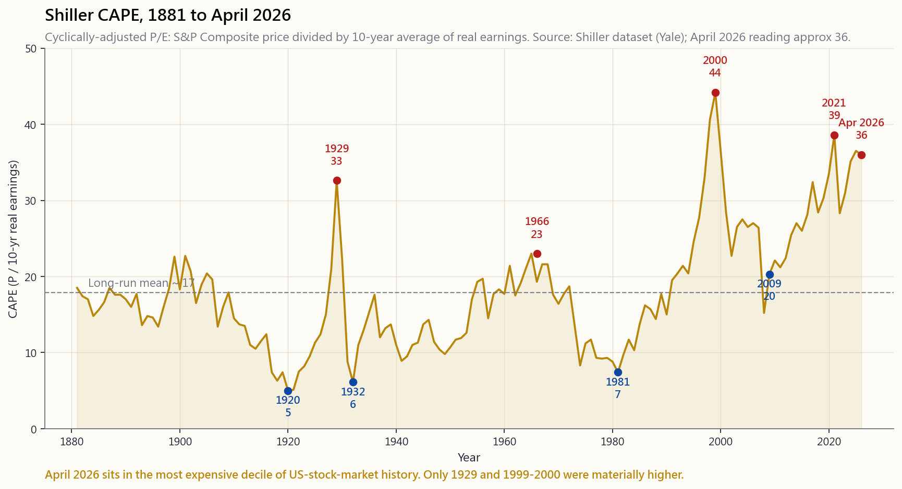

# 第二十一週：股票估值 — 現金流量折現法、乘數法與聯準會模型

---

## 第一部分：閱讀章節

---

### 1. 為什麼這很重要

學到第21週，你已能閱讀三種財務報表（第8週），理解資本結構（第19週），也能區分會計盈餘與真實現金（第20週）。下一個自然而然的問題——也是每個初學者以為估值能回答的問題——是：*在掌握這一切的前提下，這支股票究竟值多少錢？*

坦白說：沒有人知道，而那些宣稱能精確到小數點第二位的人，通常都是在推銷什麼。估值不是一種量測；它是一種以現值形式呈現的、關於未來的結構性論述。即便如此，你仍然需要建立這個論述，因為沒有它，你就沒有任何基準可以拿來對比價格，而沒有參考價值的價格，只不過是螢幕上一個不斷移動的數字。

做這項工作有四個理由，即使你知道結果是模糊的：

1. **它讓決策根植於現金，而非故事。** 現金流量折現法模型迫使你寫下你預期這門生意實際能產生的現金。如果你無法為那些數字辯護，你就無法為倉位辯護。光是這一點，就能在大多數「故事型股票」進入你的投資組合之前將其過濾掉。
2. **它讓你原本會隱藏的假設浮出水面。** 一支本益比35倍的股票，隱含的預測是未來十年盈餘每年成長12%。市場不會把這個預測掛在橫幅上公告。逆向現金流量折現法讓隱性預測變得顯性，你可以問自己：*我相信這個嗎？*
3. **它區分「估值阿爾法」與「市場環境阿爾法」。** 阿爾法很罕見。大多數表面上的「價值」長期超額表現，實際上是偽裝成洞察力的乘數壓縮風險——買入統計上便宜的東西，等待乘數均值回歸。這在某些市場環境下奏效，在其他環境下失靈（1998年、2017年、2020年）。了解你實際上在下哪種賭注，是成功的一半。
4. **它校準預期。** 當標普500指數的席勒本益比（CAPE）為36——也就是2026年4月的水準——根據歷史關係所隱含的長期實質報酬大約是每年3%，而不是7%。你仍然可以持有指數基金。只是應該停止在退休試算表裡填入7%的實質報酬。

本週涵蓋絕對估值（現金流量折現法、終值、敏感性分析、逆向現金流量折現法）、相對估值（本益比、股價淨值比、EV/稅息折舊攤銷前獲利、股價自由現金流比、席勒CAPE），以及一個跨資產訊號——聯準會模型——它將股票的盈餘殖利率與10年期國庫券殖利率進行比較。最後的實作工具是一個現金流量折現法實驗室，讓你移動滑桿，觀察每股內含價值的波動。

---

### 2. 你需要了解的事

#### 2.1 兩大學派——絕對估值與相對估值

每一種估值方法都屬於兩個陣營之一。

**絕對估值**問的是：這門生意在其存續期間能產生多少現金，而這些現金今天值多少錢？標準工具是現金流量折現法模型。你預測某段明確期間（通常是5到10年）的自由現金流，假設之後進入穩定狀態（即「終值」），以反映現金風險的折現率將所有數字折算回現值，再除以股份數。輸出結果是一個每股數字，可用來與市場價格比較。

**相對估值**問的是：這家公司的定價與同類公司相比如何，或與其自身歷史相比如何？工具是乘數——本益比、股價淨值比、EV/稅息折舊攤銷前獲利、股價自由現金流比、股利殖利率、盈餘殖利率。你不需要預測；你只需要一個同業群組或歷史區間。

兩個學派都沒有對錯之分。它們回答的是不同的問題。現金流量折現法回答「我應該付多少錢？」乘數法回答「市場目前對這類公司願意付多少倍？」在實務上，你會同時採用兩者，並觀察它們分歧的地方，因為分歧所在，正是有趣問題所在的地方。如果你的現金流量折現法說值80元，而市場以本益比40倍、200元的價格交易，那麼你有責任解釋：要麼市場看到了你沒看到的東西，要麼市場是錯的。兩種情況都可能發生。知道自己在賭哪一種，才是真正的紀律。

在開始之前，一個有用的警告：如同陳馬所說，大多數「估值阿爾法」實際上是穿著洞察力外衣的乘數壓縮風險——阿爾法很罕見。以本益比12倍買入、而非22倍，*可能*是免費的午餐——也可能意味著你在一家結構性惡化的企業乘數再也無法自我防守的那一刻買了進去。估值工具箱告訴不了你是哪一種。現金流的穩定性才能告訴你。

#### 2.2 現金流量折現法——運作原理

現金流量折現法公式是金融領域中少數數學真正簡單的地方。每年的自由現金流，以利率$r$折現後加總：

$$ V_0 = \sum_{t=1}^{N} \frac{\text{FCF}_t}{(1+r)^t} + \frac{\text{TV}_N}{(1+r)^N} $$

三個組成部分：

**明確期間的自由現金流。** 你預測5到10年的自由現金流。這裡的「自由現金流」是指營運現金流減去資本支出——也就是第20週介紹的數字。對於一家成長中的企業，你從近期的自由現金流出發，逐年套用成長率（通常是遞減的——第1年12%，逐步降至第5年4%），並寫下預測數字。

**終值（TV）。** 明確期間結束後，企業仍然持續存在。你在第N年將剩餘的未來壓縮成一個數字。兩種標準方法：

- **戈登成長模型（永續年金）：** $\text{TV}_N = \dfrac{\text{FCF}_{N+1}}{r - g}$，其中$g$是永續成長率。$g$必須低於長期名目國內生產毛額成長率（4-5%）——你不可能永遠以比整體經濟更快的速度成長——否則公式會爆炸。
- **退出乘數法：** $\text{TV}_N = \text{FCF}_{N} \times M$，其中$M$是從同業或歷史記錄中取得的某個乘數（例如18倍自由現金流）。這是一個有用的交叉驗證；弱點在於乘數本身是一個相對估值數字，因此「絕對」的計算中引入了相對假設。

**折現率$r$。** 這是企業的加權平均資金成本——第19週的數字。對於典型的大型股美國股票，加權平均資金成本落在7至10%的範圍內。對於投機性的成長股，則為12至15%。這個選擇對結果的影響比人們意識到的更大。

終值通常佔現金流量折現法總輸出的**60至80%**，對於正常成長的企業而言。這令人不安，但這是實話。你所估值的大部分內容，是關於穩定狀態的假設。

#### 2.3 敏感性分析——加權平均資金成本與$g$這兩個旋鈕

兩個數字——折現率$r$和終值成長率$g$——主導了任何現金流量折現法的大部分工作。將其中任何一個移動100個基點，內含價值就可能波動30%。以下範例使用每股10元的起始自由現金流，前五年成長6%，之後終值成長率3%，並圍繞$r$和$g$進行敏感性分析：

| | $g = 2\%$ | $g = 3\%$ | $g = 4\%$ |
|---|---:|---:|---:|
| **$r = 7\%$** | $238 | $300 | $440 |
| **$r = 8\%$** | $182 | $221 | $290 |
| **$r = 9\%$** | $148 | $174 | $215 |
| **$r = 10\%$** | $124 | $143 | $169 |

兩個重點：公式在左上角最為劇烈，因為$r - g$很小（永續年金分母趨近於零）；在某個$(r, g)$組合下「便宜」的股票，在相鄰的組合下可能是「昂貴」的。任何現金流量折現法的誠實輸出不是一個數字，而是一個**區間**。

這也是為什麼分析師目標價會群聚。二十位分析師跑同一個現金流量折現法，會輸出彼此相差±10%以內的二十個答案——不是因為模型精確，而是因為他們都傾向採用同樣可辯護的$(r, g)$區間。目標價的羊群效應，本質上是加權平均資金成本假設的羊群效應。

§2.7的實作實驗室讓你親手轉動這些旋鈕。

#### 2.4 可比乘數法——實用指南

當你沒有耐心做現金流量折現法（或企業太複雜、難以做出清晰的現金流預測）時，乘數法就能派上用場。有五個是重要的。

**本益比（股價對盈餘）。** 被引用最多，也最容易誤導。使用稀釋後的每股盈餘，而非基本每股盈餘。當你信任分析師預測時使用預估本益比（未來12個月），不信任時使用歷史本益比。標普500的「正常」本益比約為16至17倍；長期席勒CAPE均值（10年平滑實質盈餘）也大約是17倍。各類股差異懸殊：公用事業14至18倍、銀行8至12倍、民生消費品18至25倍、軟體25至40倍。在類股內部比較，而非跨類股比較。

**股價淨值比（股價對帳面價值）。** 市值除以股東權益。對銀行和保險公司有用，因為它們的資產已接近市價計算（放款、有價證券），帳面價值有其意義。對軟體、品牌型消費品、生技公司則毫無意義——因為無形資產才是核心資產，而會計無法衡量它們。

**EV/稅息折舊攤銷前獲利。** 企業價值（市值加負債減現金）除以稅息折舊攤銷前獲利。剔除資本結構差異，這也是為什麼它是企業併購的標準指標。弱點：稅息折舊攤銷前獲利忽略了資本密集度。一家稅息折舊攤銷前獲利10億元、資本支出12億元的公司，EV/稅息折舊攤銷前獲利與同業相當，但自由現金流為零。使用EV/稅息折舊攤銷前獲利時，必須*同時*單獨審視資本支出密集度，不可單獨使用。

**股價自由現金流比（股價對自由現金流）。** 最乾淨的一個。自由現金流難以造假（第20週說明了原因）。對成熟企業而言，15至25倍是正常範圍。低於12倍，你買到的要麼是真正的便宜貨，要麼是價值陷阱。高於35倍，你是在為可能到來、也可能不到來的成長買單。

**盈餘殖利率（盈餘對股價）。** 本益比的倒數。本益比20倍的股票，盈餘殖利率為5%。這看似微不足道，但它之所以獨立於本益比之外而重要，是因為它將股票盈餘放在與債券殖利率相同的坐標軸上——這正是聯準會模型所需要的（§2.6）。

#### 2.5 席勒CAPE——長期歷史

羅伯特·席勒的週期調整本益比（CAPE）取標普500價格，除以過去十年實質盈餘的平均值。這種平滑處理消除了週期性雜訊——而正是這種雜訊讓歷史本益比在衰退時（因為盈餘崩跌）飆升至荒謬水準，並在景氣頂峰時（因為盈餘到達頂點）看起來合理。以下圖表繪製了1881年至2026年4月的CAPE走勢。

兩個重要規律。

第一，**CAPE在長期視野下均值回歸，但作為短期擇時訊號則毫無用處**。1996年CAPE是25，1997年是30，1998年是38，1999年是44，直到2000年3月才真正見頂。任何在CAPE 25時放空指數的人，在被證明是對的之前早已失業。這個訊號在10年遠期報酬上是真實的；在1年遠期報酬上則是雜訊。

第二，**80年低點（1981年）與現代區間之間存在顯著差異**。1981年的CAPE約為8，是因為國庫券殖利率高達14%——資金成本正在壓縮股票乘數。2009年的CAPE為13，是因為盈餘崩跌。2026年CAPE達到36，是因為利率只有4%，且科技類股盈餘主導整個指數。跨越整段歷史，這是同一個指標，但支撐它的市場環境截然不同。

將CAPE用作溫度計，而非買賣訊號。當CAPE位於歷史最高十分位時，未來十年的預期實質報酬充其量也只有中個位數。這才是需要校準的地方。它並不是在告訴你要賣出。

#### 2.6 聯準會模型——盈餘殖利率與10年期國庫券

聯準會模型比較股票的盈餘殖利率（盈餘對股價）與10年期國庫券的殖利率。其論點為：如果盈餘對股價遠高於債券殖利率，則股票相對於債券是便宜的，因為其現金流殖利率超過了無風險的替代選擇。若盈餘對股價低於債券殖利率，債券市場提供的風險調整後報酬更為划算。

關於聯準會模型，有兩點警告。

**它不在任何聯準會的官方文件中。** 這個名稱來自1997年一份漢弗萊-霍金斯報告中的一張圖表。葛林斯潘從未認可它為估值工具。實務界人士還是採用了這個框架，因為它直觀易懂。

**它混淆了實質與名目。** 盈餘殖利率是實質數量（長期而言，盈餘隨通膨成長）。國庫券殖利率是名目數量。將兩者相減是一種類型錯誤。這個訊號在通膨穩定時效果最佳；在通膨是主導變數時（例如1970年代），它恰好失靈——當時聯準會模型顯示股票便宜，但投資人持有股票的實質報酬幾乎為零整整十年。

將聯準會模型視為一個跨資產參考，而非最終裁決。以2026年4月接近零的讀數而言，股票和債券均隱含著平庸的實質報酬。兩者之間不存在明顯的套利機會——這本身也是一種資訊。

#### 2.7 逆向現金流量折現法——理智的最後防線

逆向現金流量折現法反轉了問題。不是預測現金流來計算內含價值，而是將*當前市場價格*視為已知，問：在當前折現率下，什麼樣的成長率能讓這個價格成為答案？

你固定$r$、$g$和起始自由現金流，求解明確期間的成長率$g_e$，使得$V_0 = \text{價格}$。輸出是**價格所隱含的成長率**。

範例：蘋果公司（AAPL）股價215美元，145億股，市值3.1兆美元。近期自由現金流約為1,090億美元。若加權平均資金成本為9%，終值成長率為3%，則當前股價所隱含的明確期間年複合成長率大約是未來十年每年5至6%。蘋果過去十年的自由現金流年複合成長率約為9%。隱含的5至6%是合理的：它預設了一定的成熟化，但並非崩潰。這個股價通過了基本的理智檢驗。

要做更豐富的比較，可以對一支市值500億美元、沒有自由現金流的迷因股跑逆向現金流量折現法：隱含的成長率是「從今天的自由現金流起無限大」。那就是你放下模型，承認你根本不是在用現金估值這個東西的時刻。

逆向現金流量折現法是那條紀律線，分隔「因模型顯示便宜而買入」和「因模型說需要奇蹟才能成立而買入」這兩種行為。§2.7的互動實驗室針對每支預設股票都提供了逆向現金流量折現法讀數——試試看。

實作工具：見 [interactive/week21_dcf_lab.html](interactive/week21_dcf_lab.html)。移動加權平均資金成本、成長率和終值成長率的滑桿，觀察蘋果（AAPL）、微軟（MSFT）、谷歌（GOOGL）、摩根大通（JPM）和可口可樂（KO）的每股內含價值如何波動。

---

### 3. 常見迷思

1. **「現金流量折現法能給你一個精確的數字。」它給不了。** 它給的是一個區間。數字是精確的；輸入不是。任何現金流量折現法的輸出，充其量視為±25%的範圍。
2. **「低本益比意味著股票便宜。」單靠這一點不能下這個結論。** 銀行、菸草和石油大廠在結構上就是低本益比，因為存在監管風險、終局風險或大宗原物料價格風險。市場不是愚蠢；它是在為真實存在的未來風險定價。
3. **「終值只是一小部分——現金流量折現法的大部分價值來自明確期間的預測。」方向完全錯了。** 對於穩態企業，終值通常佔現金流量折現法總值的60至80%。明確期間主要是讓你過渡到你真正關心的假設：穩定狀態。
4. **「聯準會模型告訴你何時應該持有股票、何時應該持有債券。」它做不到。** 它只是一個粗略的跨資產溫度計，且完全忽略了通膨環境。它在1972年告訴你股票便宜，而後你在實質報酬上損失了整整十年。
5. **「席勒CAPE已經失效，因為它自2014年以來一直很高，而股市卻一直上漲。」它並未失效——這個訊號針對的是10年遠期報酬，而非明年。** 從2014年CAPE 26起算，隨後十年的名目年複合報酬率約為9%——遠低於長期10%的水準，但這與偏高的CAPE所暗示的結果是一致的。
6. **「股價淨值比始終有意義。」對於資產輕量型企業（科技、消費品牌、服務業），帳面價值忽略了企業80%的核心價值所在。** 用於銀行；其他情況下忽略它。
7. **「EV/稅息折舊攤銷前獲利比本益比『更乾淨』，因為它剔除了資本結構。」是的，同時它也剔除了資本支出，而資本支出正是區分真正的生意與跑步機的那條線。** 本益比8倍的水泥廠，可能比本益比25倍的軟體公司更耗資本。
8. **「你應該買類股中本益比最低的那支。」這是深度價值的經驗法則，一旦其中有名稱出現結構性損傷，它就會失靈。** 相對於同業便宜，只有在底層業務具有可比性時才有意義。
9. **「較高的折現率等於永遠更保守。」幾乎是這樣。** 較高的$r$會降低所有未來現金流的現值，但同時也降低了終值——而終值佔了大部分的答案。保守性是真實的；幅度通常比人們預期的更大。
10. **「成長股應該用不同方法估值，因為現金流量折現法對它們不適用。」現金流量折現法完全適用；只是輸入更難估計。** 人們的真正意思是「我不信任自己的預測」，這是誠實的說法。解決方案是更寬的敏感性區間，而不是換一種方法。

---

### 4. 問答章節

**問1. 我應該對典型的標普500股票使用什麼折現率？**
加權平均資金成本是正確答案；對大多數美國大型股而言，它落在7至9%的區間。如果你不想從頭計算加權平均資金成本，8%是個可辯護的預設值。對於高槓桿或原物料週期性企業，推向10%；對於防禦性的公用事業，則為6至7%。

**問2. 現金流量折現法的明確期間應該涵蓋幾年？**
五到十年。若企業成熟穩健（如可口可樂、嬌生），選五年。若企業正處於清晰的高速成長階段，預計逐步走向成熟（如輝達、谷歌），選十年。超過十年就是在表演預測；你是在假裝了解一個尚未存在的市場環境。

**問3. 為什麼當$r$接近$g$時，戈登成長公式會失控？**
因為$\dfrac{\text{FCF}}{r - g}$的分母趨近於零。從數學角度看：一個以$g$速度永久成長、以$r$折現的現金流，只有在$g < r$時才有有限的現值。若$g \geq r$，現值為無限大——現金流成長的速度快過折現率消耗它的速度。這就是為什麼$g$在實務上必須設定上限，不能超過長期名目國內生產毛額成長率（約4-5%）；超過這個水準，你就是在聲稱這家企業將永遠以超越其所在經濟體的速度成長，這是不可能的。

**問4. 本益比和席勒CAPE在實務上有什麼差異？**
歷史本益比使用過去十二個月的盈餘。CAPE使用過去十年*實質*盈餘（經通膨調整）的平均值。在景氣週期轉折點，這種平滑處理至關重要：2009年，歷史本益比因盈餘崩跌得比股價快，飆升至100倍以上；CAPE則約為13。跨越週期而言，CAPE是更誠實的指標。在週期內部，本益比則是反應更靈敏的指標。

**問5. 我應該使用預估本益比還是歷史本益比？**
當分析師預測可信時（大型股、研究覆蓋廣泛、週期性低）使用預估本益比。當企業波動性大或預測區間寬廣時使用歷史本益比。歷史本益比與預估本益比之間的差距，告訴你隱含的成長率：若歷史本益比為18倍、預估本益比為15倍，市場正在為20%的盈餘成長定價。

**問6. 聯準會模型在2026年是買賣訊號嗎？**
不是——但它提供了有用的資訊。2026年4月的讀數接近零（盈餘對股價約2.8%，10年期約4.0%）。這意味著指數的現金盈餘殖利率*低於*無風險利率。從歷史上看，這個條件之後，往往預示未來5至10年的股票報酬偏弱。這不意味著要賣出；而是意味著降低你的遠期預期，並考慮將適度的權重轉向債券（與第14週的四資金池框架一致）。

**問7. 為什麼逆向現金流量折現法對大型基準股票比正向現金流量折現法更有用？**
因為所有人都已經做過正向現金流量折現法了，答案是「股價≈內含價值，上下差10%」。這沒有操作意義。逆向現金流量折現法告訴你市場已定價的*隱含成長率*。現在你可以問：這個成長率與歷史、競爭對手、以及你認為管理層能做到的相比，是否合理？你在押注的是對成長率的看法分歧，而不是絕對估值缺口。

**問8. 銀行不適合現金流量折現法框架。那用什麼？**
剩餘收益法或股價淨值比對股東權益報酬率。一家帳面價值1.5倍、股東權益報酬率15%的銀行定價合理（因為$\text{股價淨值比} \approx \text{股東權益報酬率} \times \text{本益比}$，而15%股東權益報酬率乘以10倍本益比，得出1.5倍股價淨值比）。對銀行而言，最簡潔的單一數字摘要是**有形普通股報酬率（ROTCE）**。摩根大通2024年財年ROTCE達22%，是指數中結構性最高品質的銀行，這也是它相對於同業溢價交易的原因。

**問9. 各類股的乘數差異如此之大。我要如何比較本益比30倍的軟體公司與本益比15倍的公用事業？**
你不直接比較它們。你在各自類股內部比較，並觀察跨類股溢價比率隨時間的變化。若軟體對公用事業通常交易在1.7倍乘數，而現在是2.5倍，你就學到了一些東西。跨類股的絕對水準本身不是訊號；比率的變動才是。

**問10. 陳馬的「阿爾法很罕見」原則如何應用於估值？**
非常緊密。大多數「估值阿爾法」是特定市場環境下的乘數壓縮與擴張，會在上一個週期的輸家反轉時翻轉。2000至2010年代，科技乘數崩跌讓價值型策略獲獎；2010至2020年代，利率壓縮、科技盈餘爆炸讓成長型策略獲獎。兩個十年都有他們的「估值專家」，風光一時後又淪為笑柄。真正可重複的估值阿爾法只存在於一個狹窄之處：複合速度超越市場折現的企業，*且*在進場時乘數沒有爆炸。這種機會很罕見；其餘的都是穿著體面西裝的市場環境賭注。

**問11. 現金流量折現法實驗室能教我什麼，超越滑桿遊戲本身？**
它告訴你，答案幾乎完全取決於三個數字——加權平均資金成本、終值成長率和第1年起始自由現金流——而同一門生意，只要對這些輸入做出四捨五入範圍內的調整，就可以被定價為「便宜」或「昂貴」達50%的差距。這堂課的啟示是謙遜，而非精確。

**問12. 有沒有理由完全忽視估值，直接投資指數基金？**
有——對大多數人而言，在大多數時候，是這樣的。美國上市股票是可投資的宇宙；如第2週所述，指數基金是預設選項。估值紀律在你挑選個別股票，或決定是否在極端水準調整指數基金配置時才重要。在CAPE 36時，你不必賣出——但你確實必須降低寫入退休計畫的報酬預期。光是這個單一的重新校準，就比大多數選股嘗試更有價值。

---

## 第二部分：YouTube 腳本

---

**影片標題：** 股票估值入門101——現金流量折現法、乘數法與聯準會模型｜第21週

**目標片長：** 約18分鐘

**主持人：** 陳馬、小魚

---

**[開場——0:00]**

**小魚：** 歡迎回來。這是第21週，股票估值。到目前為止，你已經能閱讀三種財務報表（第8週），了解資本結構和加權平均資金成本（第19週），也能區分真實現金和會計盈餘（第20週）。我們今天終於要回答的問題是：*這支股票究竟值多少錢？*

**陳馬：** 先講一個快速免責聲明。對於「這支股票值多少錢」這個問題，誠實的答案是「我不知道，電視上那位有兩位小數目標價的分析師也不知道。」估值是一種關於未來的結構性論述，以現值形式呈現。這個論述包含假設。那些假設是錯的。這項練習的重點，是讓假設變得可見，讓你知道自己在賭什麼——而不是產生一個你可以信任的數字。

**小魚：** 今天我們涵蓋三件事。現金流量折現法——絕對估值方法。乘數法——本益比、股價淨值比、EV/稅息折舊攤銷前獲利、股價自由現金流比。以及兩個長期歷史覆疊指標：席勒CAPE和聯準會模型。最後的實作實驗室是一個你可以用滑桿操控的現金流量折現法。

---

**[第一段——現金流量折現法原理——1:30]**

**陳馬：** 現金流量折現法。數學是金融裡最簡單的。每年的自由現金流，以一個利率折現後加總。再加上一個終值，用來捕捉明確預測期之後的一切。

**小魚：** 三個輸入。自由現金流預測——通常是五到十年。終值——企業在明確期間結束後的價值。以及折現率——第19週的加權平均資金成本，對典型的美國大型股而言是7%到9%。

**陳馬：** 終值是沒人想談的部分。兩種方法。戈登成長模型：取第N年的自由現金流，乘以一加上永續成長率，除以加權平均資金成本減去該成長率。或者退出乘數法：取第N年自由現金流乘以某個乘數，比如18倍。兩者都是披著公式外衣的猜測。

**小魚：** 最令人不安的部分：終值通常佔現金流量折現法總答案的60%到80%。所以當有人說「我有個現金流量折現法模型說這支股票值200元」——他們真正的意思是「我對穩定狀態的猜測值140元，加上五年預測期值60元。」

**陳馬：** 這不代表現金流量折現法沒用。它的意思是紀律在於輸入，而不是輸出。

---

**[第二段——敏感性分析——4:30]**

**小魚：** 敏感性分析。擺動一切的兩個旋鈕是加權平均資金成本和終值成長率。將任何一個移動一百個基點，答案就可能改變30%。

**陳馬：** [VISUAL: §2.3的表格顯示於畫面上。] 同一家企業，同樣的起始自由現金流，同樣的五年成長假設。左上角，加權平均資金成本7%，終值成長率4%，每股內含價值440元。右下角，加權平均資金成本10%，終值成長率2%，每股內含價值124元。*這門生意*沒有改變；改變的是假設。

**小魚：** 這也是為什麼分析師目標價會群聚。二十位分析師跑同一個現金流量折現法，會產出彼此相差正負10%以內的二十個答案——不是因為模型精確，而是因為他們都傾向採用同樣可辯護的加權平均資金成本和成長率組合。目標價的羊群效應，本質上是假設的羊群效應。

**陳馬：** 你馬上就能在實驗室裡親眼看到這一點。我們待會兒就去。

---

**[第三段——乘數法實用指南——6:30]**

**小魚：** 乘數法。估值的快捷方式。五個是重要的。

**陳馬：** 本益比。被引用最多，最容易誤導。使用稀釋後每股盈餘，而非基本每股盈餘。你信任分析師預測時用預估本益比，不信任時用歷史本益比。標普500的長期本益比大約是16到17倍。類股很重要：公用事業14到18倍、銀行8到12倍、民生消費品18到25倍、軟體25到40倍。

**小魚：** 股價淨值比——股價對帳面價值。對銀行和保險公司有用，因為它們的資產已接近市價計算。對軟體、品牌公司、生技公司則毫無意義——核心資產是品牌或智慧財產，會計無法衡量它。

**陳馬：** EV/稅息折舊攤銷前獲利。剔除資本結構差異，這也是企業併購的標準指標。陷阱：它同時剔除了資本支出。EV/稅息折舊攤銷前獲利8倍的水泥廠，可能比EV/稅息折舊攤銷前獲利25倍的軟體公司更耗資本。務必同時搭配資本支出密集度一起看，絕不能單獨使用。

**小魚：** 股價自由現金流比——股價對自由現金流。最乾淨的一個。自由現金流難以造假——第20週說明了原因。對成熟企業而言，15到25倍是正常範圍。低於12倍，要麼是真正的便宜貨，要麼是價值陷阱。高於35倍，你是在為可能到來、也可能不到來的成長買單。

**陳馬：** 還有盈餘殖利率——本益比的倒數。本益比20倍的股票，盈餘殖利率是5%。聽起來微不足道，但它之所以重要，是因為它把股票盈餘放在與債券殖利率相同的坐標軸上。這正是我們接下來需要的。

---

**[第四段——席勒CAPE——9:30]**

**小魚：** 席勒CAPE。羅伯特·席勒，耶魯大學，2013年諾貝爾獎得主。取標普500價格，除以過去十年*實質盈餘*的平均值。這十年的平滑處理消除了週期性雜訊——正是這種雜訊讓歷史本益比在衰退時飆升到100倍，並在景氣頂峰時看起來合理。

**陳馬：** [VISUAL: image/week21_cape_history.png。] 1881年到今天的CAPE走勢。橫向均值線在17附近。看看波峰：1929年，股市崩盤前夕，32倍。1966年，戰後繁榮結束，24倍。2000年，網路泡沫頂峰，44倍——整個歷史序列中的最高點。2021年，疫情後刺激政策的狂熱期，38倍。今天，2026年4月，36倍。你正處在美國股市史上最昂貴的10%區間。只有1929年和1999至2000年在這個指標上明顯更高。

**小魚：** 要學習的兩個規律。第一，CAPE在長期視野下均值回歸，但作為短期擇時訊號毫無用處。1996年CAPE是25，1997年是30，1998年是38，1999年是44。任何在CAPE 25時放空指數的人，在被證明正確之前早已失業。

**陳馬：** 第二個規律：低CAPE在不同市場環境下含義不同。1981年CAPE 8，是因為國庫券殖利率高達14%——資金成本正在壓縮股票乘數。2009年CAPE 13，是因為盈餘崩跌。今天CAPE 36，是因為利率只有4%，科技類股盈餘主導整個指數。跨越整段歷史，這是同一個指標，但支撐它的市場環境截然不同。

**小魚：** 實際用途：當作溫度計，而非買賣訊號。當CAPE位於歷史最高十分位時，未來十年的預期實質報酬充其量是中個位數。那才是你該寫進退休試算表的校準數字。你不必賣出。

---

**[第五段——聯準會模型——12:30]**

**陳馬：** 聯準會模型。比較股票的盈餘殖利率與10年期國庫券殖利率。概念是：如果盈餘對股價遠高於債券殖利率，股票給你的比無風險利率更多，它就是便宜的。如果盈餘對股價低於債券殖利率，債券的交易機會更好。

**小魚：** [VISUAL: image/week21_fed_model.png。] 利差走勢圖，1962年到今天。1970年代大部分時間，深度為負——債券殖利率達8到14%，而CAPE盈餘殖利率只有4到8%。那說的是「債券是更乾淨的交易。」它說對了——股票的實質報酬整整十年幾乎為零。

**陳馬：** 然後是1980年代初的利率見頂，這條線明確翻正。伏克爾打破通膨，國庫券殖利率從14%崩跌至4%，歷時二十年，而股票盈餘殖利率維持在4到8%的區間。利差在2009年達到約正6個百分點的峰值——崩盤後盈餘殖利率偏高，利率則接近零下限。

**小魚：** 然後是2000年——倒掛。CAPE見頂於44，盈餘殖利率降至2.3%，10年期國庫券殖利率為6%。負利差接近4個百分點。聯準會模型說債券是更乾淨的交易。接下來十年證明了這一點：股市橫盤整整十年，債券表現更佳。

**陳馬：** 2026年4月的讀數：接近零。盈餘殖利率約2.8%，10年期約4.0%。利差約負1個百分點。不是2000年的災難訊號，但也不是2009年那種肥美的機會訊號。合理的解讀：未來五到十年，不要對任何一類資產抱有太高期望。

**小魚：** 關於聯準會模型的兩個警告。它不在任何聯準會的官方文件中——這個名稱來自葛林斯潘1997年一份報告中的圖表。而且它混淆了實質與名目——盈餘殖利率是實質的，國庫券殖利率是名目的。它在通膨穩定時效果最佳；在通膨是主導變數時恰好失靈，比如1970年代。所以把它當作一個跨資產參考，而不是最終裁決。

---

**[第六段——逆向現金流量折現法與實驗室——15:30]**

**小魚：** 逆向現金流量折現法。反轉問題。不是預測現金流來計算內含價值，而是將*當前市場價格*視為已知，問：在當前折現率下，什麼樣的成長率能讓這個價格成為答案？輸出是**價格所隱含的成長率**。

**陳馬：** 快速範例。蘋果公司，2026年4月，股價約215美元，145億股，市值3.1兆美元。近期自由現金流1,090億美元。以加權平均資金成本9%、終值成長率3%計算，當前股價所隱含的明確期間年複合成長率大約是未來十年每年5到6%。蘋果過去十年的自由現金流年複合成長率約為9%。隱含的5到6%是合理的。這個股價通過了基本的理智檢驗。

**小魚：** 現在對一支市值500億美元、沒有自由現金流的迷因股跑同樣的算法。隱含的成長率是「從今天的自由現金流起無限大。」那就是你放下模型、承認你根本不是在用現金估值這個東西的時刻。

**陳馬：** [VISUAL: interactive/week21_dcf_lab.html。] 實驗室。五支預設股票——蘋果（AAPL）、微軟（MSFT）、谷歌（GOOGL）、摩根大通（JPM）、可口可樂（KO）。每支預設股票都有每股起始自由現金流、當前股價和流通股數。你移動加權平均資金成本、成長率和終值成長率的滑桿，觀察每股內含價值如何波動。長條圖在目前滑桿設定下，比較五支股票各自的內含價值與當前股價。

**小魚：** 試試這個：把加權平均資金成本從9%降到7%——每支股票都變成「被低估了30%」。把加權平均資金成本推到11%，每支都翻轉成「被高估了25%」。這就是這個練習。同一家企業，同樣的自由現金流，同樣的成長率——因為一個假設而得出不同答案。你在三十秒內就能親身感受到。

---

**[結語——17:30]**

**陳馬：** 阿爾法很罕見。大多數「估值阿爾法」是偽裝成洞察力的乘數壓縮風險。2000至2010年代，科技乘數崩跌讓價值型策略獲獎；2010至2020年代，利率壓縮、科技盈餘爆炸讓成長型策略獲獎。兩個時代都有他們的明星人物。兩個時代都在環境轉變時一敗塗地。

**小魚：** 真正可重複的估值阿爾法只存在於一個狹窄之處：複合速度超越市場折現的企業，且在進場時乘數沒有爆炸。這種機會很罕見。其餘的都是市場環境賭注，而市場環境是無法預測的。

**陳馬：** 2026年4月的實際啟示。CAPE 36——歷史最高十分位。聯準會模型利差接近零。你不必賣出指數基金——如第14週所述，四資金池配置已經內建了債券避險。但你確實必須降低寫入退休計畫的實質報酬。從歷史的7%實質報酬，降至未來十年所隱含的3到4%實質報酬。光是這個單一的重新校準，就比大多數選股嘗試更有價值。

**小魚：** 下週：總體經濟指標——國內生產毛額、通膨、就業、聯準會的反應函數，以及如何在不淪為財經新聞重度觀眾的前提下解讀經濟數據發布。下週見。

---