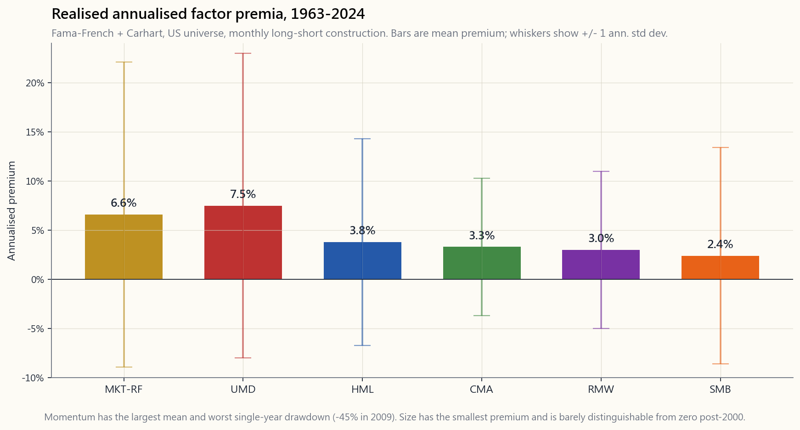
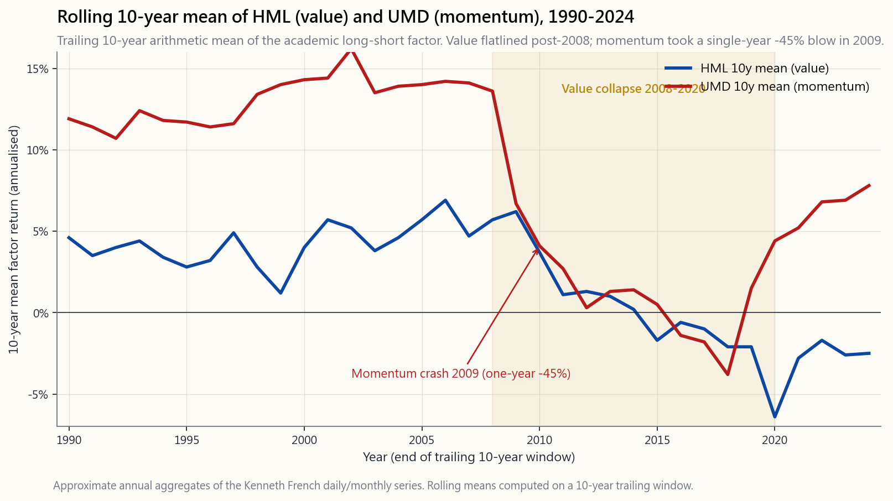

# 第二十三週：因子投資——價值、動能、品質、低波動性、規模

---

## 第一部分：閱讀章節

---

### 1. 為什麼這很重要

半個世紀以來，資本資產定價模型（CAPM）只講述一個故事：股票勝過債券，因為股票承擔更高的市場風險，而*市場唯一獎勵的*就是承擔這一種風險。一個因子。一種報酬。方程式結束。然後在1990年代初，Eugene Fama與Kenneth French坐下來，研究六十年的CRSP資料，發現這個方程式缺少了幾項。小公司的表現優於大公司，幅度超過其貝塔所能解釋的範圍。便宜的（高帳面市值比）股票勝過昂貴的股票。一旦他們加入*規模*因子和*價值*因子，大多數美國共同基金的殘差「阿爾法」便瓦解了——看起來像是選股能力的東西，在數據上不過是系統性的因子曝險，而基金經理從未明確說明。到了2015年，Fama與French又加入了*獲利能力*（RMW）和*投資*（CMA），Mark Carhart則將*動能*（UMD）納入其中，形成一個六因子框架，如今可以解釋美國股票橫截面報酬約90%的變異。

這有四個重要原因。

1. **它告訴你你的投資組合實際上是什麼。** 無論你持有什麼——一支單一共同基金、一個六四配置，或是你配偶挑選的「成長股」——都有因子曝險，不管你有沒有衡量它。兩個具有相同貝塔和相同預期報酬的投資組合，在下一個市場環境中的表現可能截然不同，若一個偏重價值加規模，另一個偏重品質加低波動性。因子是你讀懂引擎蓋下情況的方法。

2. **它將結構性阿爾法與運氣分開。** 當一位基金經理在十年內跑贏S&P 3%，正確的問題不是「他們厲害嗎？」——而是「那是哪個因子？」如果其超額報酬與小型價值股相關，你可以用VBR以7個基點的費用率複製它。如果它與動能相關，你可以用MTUM複製。一旦所謂的「技能」能被學術因子解釋，它就不再是技能了。

3. **它是持久的結構性阿爾法路徑之一。** 在少數值得追求的結構性錯誤定價中——流動性、類股輪動、長期趨勢、買進被被動式投資流棄的標的，以及本週討論的學術因子溢價——因子是最*系統化*也是最*擁擠*的，這意味著它的進入門檻最低，未來預期報酬也壓縮最多。它們仍然有報酬，只是比每個人都持有VLUE和MTUM之前要少了。

4. **它框架了我們在第14週討論的2007年量化基金動盪。** 當AQR、Renaissance以及數百家較小的統計套利機構都在相同的標的池上運行相同的因子訊號時，八月中旬一次去槓桿事件在四天內蒸發了三年的報酬。以槓桿操作的因子投資是*擁擠交易*風險的典型案例。2026年的零售因子指數股票型基金是無槓桿的，因此爆倉的數學邏輯更為溫和——但溢價壓縮是同樣的問題。

---

### 2. 你需要知道的事

#### 2.1 「因子」究竟是什麼

因子是一個由可衡量股票特徵構建的*多空投資組合*。以帳面市值比為例：對每支美國股票按B/M排名，做多前十分位，放空後十分位，兩腿等權重，每月再平衡。該投資組合的每月損益就是*價值因子*（HML——高帳面市值比減低帳面市值比）。學術文獻中的每個因子都具有相同的形狀：排名、多頭前端、空頭後端、剔除市場影響。

這個建構方式很重要，因為多空結構剔除了市場因素。一支純價值型共同基金大致上是*0.9倍市場敞口加0.4倍HML加雜訊*；學術上的HML是單獨的*0.4倍HML*部分，市場敞口調整為零。因子*溢價*是該多空投資組合的平均報酬。現代文獻中有六個主要因子：市場（MKT-RF）、規模（SMB——小型股減大型股）、價值（HML）、獲利能力（RMW——強勁減疲弱）、投資（CMA——保守減積極），以及動能（UMD——漲幅股減跌幅股）。前五個是Fama-French五因子；加入UMD便形成FF5加動能的框架，幾乎是2026年所有賣方風險模型的起點。

#### 2.2 歷史溢價，一覽無遺

從1963年7月到2024年12月，美國因子的實際年化溢價大致如下：MKT-RF約6.6%、UMD約7.5%、HML約3.8%、CMA約3.3%、RMW約3.0%、SMB約2.4%。若加入低波動性因子（不在官方Fama-French體系內，但建構方式相同：做多低貝塔五分位，放空高貝塔五分位），溢價約為1至2%，但*標準差顯著較低*——這也是為什麼低波動性因子在夏普比率上表現良好，即使原始溢價看起來偏小。

這份清單中有幾個順序令人驚訝。動能是唯一不源自Fama-French體系的因子，卻擁有所有因子中最高的溢價——以及最大的單次回撤。規模，這個開創了整個文獻的因子，是*最小的*溢價，在調整微型股流動性不足後，2000年後的溢價甚至接近於零。價值，你的財富管理人最常提到的因子，處於中游，而且*在過去十七年幾乎沒有任何表現*。

#### 2.3 2003年以來的因子衰退問題

拉出HML滾動10年溢價的圖表，你會看到一些令人不安的現象：從1963年到大約2002年，平均每年約+5%，然後急劇下滑。滾動10年至2020年的溢價是*負值*。負值。在2008年至2020年間，學術價值因子——多空建構，不是價值型共同基金——平均虧損。UMD也有類似的問題，但形態不同：長期均值為7至8%，但在*2009年動能崩盤*時被打斷，當市場V形反彈，之前虧損的垃圾股從低點急速拉升，因子在2009年整個日曆年內回撤約45%（峰值至谷底約83%）。

溢價壓縮的競爭性解釋有三個，而且可能都是正確的。第一，*發表套利*：每個在《金融期刊》發表的學術因子都會吸引資金，資金買高了多頭端、賣低了空頭端，直到溢價收窄。同行評審的發現是這筆交易的訃聞。第二，*無形資產衡量失準*：帳面市值比懲罰了輕資產的科技公司，這些公司的帳面價值較低，*是因為*其價值體現在未資本化的研發費用和品牌中。HML的建構將其讀為「昂貴」，但在更正確的衡量標準下，它們並非如此。第三，*後金融危機中央銀行的流動性*：零利率壓縮了股票之間的離散度。所有東西一起交易；沒有東西根據基本面交易；沒有東西再顯得便宜或昂貴。你可以選擇自己喜歡的理論——實證事實是，溢價相較於2003年前的均值大約減半了。

#### 2.4 2007年量化基金動盪——因子擁擠實際上是什麼感覺

2007年8月6日那週是因子擁擠的教科書案例，我們在第14週從配對交易的角度詳細討論過。以下是因子投資的版本。2007年每家量化多空機構基本上都在運行相同的因子投資組合：做多價值、做多動能、做多品質，放空相反方向，為了風險目標而槓桿5至8倍。在8月6日，*某個*——最有可能是某個多策略基金，被迫在信貸帳簿出現贖回時去槓桿——開始大規模平倉標準因子投資組合。由於*其他所有量化基金都持有相同的部位*，平倉找不到對手方，就像一個特定部位原本可以找到對手方一樣；它遇到的是數百家運行相同風險模型、在大約相同損失門檻時同時停損的基金。到8月10日週五，標準因子投資組合已回撤約25%——三年的實現溢價在四個交易日內消失殆盡。大盤本身移動了約1%。零售端的行情幾乎沒有察覺到。

那週留下兩個教訓。第一，*即使因子的市場貝塔為零，因子曝險仍是風險*。你承擔的不是市場風險，而是擁擠交易風險。第二，*無槓桿的因子曝險是完全不同的動物*。2026年的零售因子指數股票型基金沒有槓桿，也沒有每日風險值驅動的停損。它們可以撐過量化基金的平倉潮，只是暫時承受帳面損失。爆倉的邏輯基本上是槓桿和贖回的問題，而非因子本身的問題。

#### 2.5 2026年零售因子指數股票型基金選單

因子文獻已變得便宜且可擴展。iShares和Vanguard合計推出了標準的單因子指數股票型基金選單，費用率介於8至25個基點之間：

- **VLUE**（iShares MSCI美國價值因子）——價值傾斜，0.08%費用率。
- **MTUM**（iShares MSCI美國動能因子）——動能傾斜，0.15%費用率。
- **QUAL**（iShares MSCI美國品質因子）——RMW風格品質傾斜，0.15%費用率。按資產管理規模計為該族群中最大。
- **USMV**（iShares MSCI美國最小波動性因子）——低波動性傾斜，0.15%費用率。
- **IWM / IJR**（iShares羅素2000 / S&P小型股600）——透過小型股曝險實現規模傾斜，0.19% / 0.06%費用率。
- **AVUV / AVDV**（Avantis美國 / 國際小型價值股）——結合規模、價值及獲利能力傾斜，0.25%費用率。2020年代學術因子流派的代表性產品。

你可以用其中四支股票構建一個像樣的多因子混合投資組合，總費用率低於0.20%，複製了避險基金在2003年收取2與20費用所做的事情。溢價已壓縮，但收割它的成本下降得更快——*淨*溢價（毛溢價減費用減稅賦拖累）與二十年前槓桿避險基金客戶所獲得的淨溢價大致相同，因為費用壓縮大致匹配了溢價壓縮。廉價的貝塔吃掉了昂貴的阿爾法。

#### 2.6 這與整體框架的關係

因子投資是所有可用阿爾法路徑中最*結構化*的，也是最*無特殊性*的。它可以無限擴展（任何規模的資金都可以運行），不需要特殊資訊，記錄它的學術文獻可在SSRN上免費取得。這也正是溢價已壓縮的原因：任何人都可以運行的東西，最終所有人都會去運行。相比之下，「買進被被動式投資流拋棄的標的」（逆向類股交易）：那*需要*不適感，需要提早進場，需要在沒有其他人跟進的時候堅持持有。因子交易只需要你點選VLUE然後忘記它。市場在套利那些無需忍受不適就能捕捉的溢價方面是有效率的。

對你自己的帳戶而言，其含意是：因子屬於*被動式核心*（基礎性最低主動交易的部分），而非*主動操作部分*。適度傾斜——將股票配置的10至20%投入QUAL或AVUV，而非市值加權核心——能讓你獲得大部分的分散投資效益，而不會承擔集中的因子爆倉風險。將100%的股票配置於MTUM是在承擔2009年式的尾部風險；將10%配置於MTUM、90%配置於VTI，可以讓你獲得長期均值的80%，同時只承擔20%的尾部風險。

---

### 3. 常見的錯誤認知

1. **「因子投資就是價值投資。」** 價值只是六個因子之一。Fama-French框架是一個*系統*：每個因子都是獨立的多空投資組合，「因子投資者」通常同時持有多個。把因子投資稱為「價值」，就像把運動稱為「跑步」。

2. **「規模因子有很大的溢價。」** SMB是主要因子中*最小的*已實現溢價，年化約2.4%。大部分的差距只出現在最底層的微型股五分位中，而那裡存在嚴重的流動性問題。你聽到的「小型股效應」大多是小型*價值股*效應——是價值，而非規模，在發揮作用。

3. **「動能就是1990年代讀到的趨勢跟隨。」** 學術上的UMD因子是*橫截面*的：按過去12個月報酬（跳過最近一個月）排名股票，做多贏家，放空輸家，每月再平衡。商品中的趨勢跟隨是*時間序列*的：若資產本身上漲則做多，若下跌則放空。建構方式不同，相關性不同，回撤特徵不同。

4. **「因子已死——它們再也不管用了。」** 溢價已壓縮，但並未消失。即使只有2003年前均值的一半，四因子多因子混合投資組合在2026年扣除費用後的預期超額報酬仍為正值。真正「死掉」的是2007年的槓桿量化版本——無槓桿的零售指數股票型基金版本仍然存活，只是規模更小了。

5. **「因子越多越好。」** 文獻中已在已發表論文中識別出超過400個「因子」，其中大多數在樣本外無法複製。Fama-French 5加動能是保守的共識。任何向你兜售20因子模型的人，都是在向你出售過度擬合。

6. **「低波動性有效，是因為低波動性股票定價錯誤。」** 或許有部分原因，但低波動性主要有效是因為*槓桿厭惡*：大多數機構投資者無法使用槓桿，因此為了獲得類似股票的報酬，他們擠入高貝塔股票，抬高其價格並降低其未來報酬。低貝塔股票因此被低估。一旦去除槓桿限制，溢價將會縮小——這也是避險基金「反貝塔押注」策略表現良好的部分原因。

7. **「品質和低波動性是同一個因子。」** 它們有所重疊（品質公司往往波動性較低），但在壓力時期出現分歧：在2008至2009年，USMV風格的低波動性隨著所有資產的相關性趨近於1而遭受重創，而QUAL風格的品質（高股東權益報酬率、低負債）則表現優異。定義不同，風險特徵不同。

8. **「我應該每月再平衡我的因子混合投資組合以捕捉溢價。」** 對於*單一*因子（學術建構）而言，每月再平衡是正確的。對於持有零售指數股票型基金的*多因子混合*而言，每月再平衡的稅賦成本往往超過再平衡的效益。對於應稅帳戶而言，每年再平衡是合理的妥協。

9. **「2007年量化基金動盪意味著因子投資很危險。」** 2007年的事件是關於*槓桿*和*贖回驅動的去槓桿*，而非因子本身。在應稅帳戶中持有的無槓桿零售因子混合投資組合，並不具有相同的爆倉結構。風險在於*放棄的報酬*（因子進一步壓縮），而非*災難性損失*。

10. **「如果所有人都知道因子，溢價應該為零。」** 自2003年以來，溢價*已確實減半*，這是「所有人都知道」的強式版本。它沒有歸零，是因為（a）大量資金仍然更在乎基準追蹤而非因子曝險，以及（b）部分溢價是風險補償，即使風險已廣為人知也不會消失。剩餘的溢價是可套利部分被套利後的殘差。

---

### 4. 問答區

**Q1：我應該用多因子指數股票型基金取代我的S&P 500基金嗎？**
不——保留市值加權核心，理由是成本、稅賦和追蹤誤差，然後將股票配置的10至30%*傾斜*至因子。市值加權核心以幾乎零成本為你帶來市場溢價；因子傾斜在此基礎上為你帶來（已壓縮的）因子溢價。用因子產品取代核心會增加你通常不需要承擔的追蹤誤差風險。

**Q2：哪個單一因子最好？**
長期而言，動能的毛溢價最高，波動性也最高——因此尾部最差（2009年）但均值最好。品質的夏普比率最佳。在2026年，價值在估值角度最具說服力，因為它是最被打壓的。根據你能忍受哪種遺憾來選擇：錯過上漲行情（避免動能）或持有的東西持續下跌（避免價值）。

**Q3：一個因子要經歷多長的回撤，我才應該放棄？**
應該長到「我不會放棄」的程度。HML從2007年到2020年連續回撤長達*十三年*，然後才在2021至2022年的價值股反彈中回升。如果你無法撐過你所傾斜的因子長達十年以上的回撤，你就沒有收割它的決心；你會在底部賣出並錯過反彈。如果13年聽起來難以忍受，*請不要傾斜*——持有市值加權指數基金。

**Q4：如果規模是弱因子，為什麼小型價值股（AVUV）那麼受歡迎？**
因為規模和價值（以及獲利能力）的*交互作用*才是文獻仍然發現穩健溢價之處。小型*垃圾股*表現不佳；小型*具獲利能力的價值股*的歷史表現，在實質上優於單獨的規模或價值因子。AVUV正是圍繞著這種交互作用而建構的。

**Q5：各因子之間有相關性嗎？**
有些高度相關（HML和CMA），有些負相關（歷史上HML和UMD——價值和動能互為部分避險），有些弱相關（SMB與所有其他因子）。多因子混合投資組合能獲得分散投資效益，*正是因為*各因子並非完全相關。HML/UMD的負相關是零售混合中最有用的配對：當一個處於回撤時，另一個通常表現良好。

**Q6：國際因子投資有效嗎？**
學術溢價在國際市場（已開發市場和新興市場）同樣能複製，量級相似，2003至2020年的壓縮情況也類似。我們基於*可投資性*原因（匯率、保管、稅賦、資訊劣勢）而僅關注美國市場，但學術上的故事大體上是國際性的，並非美國專有。

**Q7：我如何判斷我的主動式管理共同基金是否只是在運行因子傾斜？**
對基金每月超額報酬相對於六個因子進行回歸分析（你可以從Ken French的網站免費下載資料）。如果R平方超過0.90，且四個或更多因子的荷載具有統計顯著性，則該基金的表現主要是因子曝險，你應該將其費用與因子複製指數股票型基金的成本進行比較。Morningstar Direct和Portfolio Visualizer都可以免費進行此回歸；沒有理由為實質上是可購買因子混合投資組合的東西向主動式基金經理付費。

**Q8：「低波動性異常」——難道這不是免費的午餐嗎？**
以夏普比率衡量，這是股票市場最接近免費午餐的東西，但它並非免費。低波動性在融漲的市場環境中表現遜色（想想1999年、2020至2021年），且相對於市值加權指數存在顯著的追蹤誤差。該因子在完整週期內以風險調整後角度計算是合算的，但在科技股主導的上漲行情中，相對於S&P的絕對報酬落差在兩年內可能達到10至15%。

**Q9：2009年的動能崩盤是否永遠終結了動能？**
不——UMD在2009年後的大多數年份都取得正報酬，2010年後的均值約為長期均值的一半（仍為正值，只是更小）。2009年的崩盤是動能報酬分布的永久特徵，而非一次性事件——1932年、2002年以及2020年3月的小型崩盤中都有類似（規模較小）的情況。持有動能意味著接受每二十年中有一年會虧損30%以上。

**Q10：我應該根據估值對我的因子曝險進行擇時操作嗎？**
實證上是的——Cliff Asness的《萬物皆有價值》研究顯示，因子的*估值利差*（便宜端股價淨值比相對於昂貴端股價淨值比）能預測因子未來5年的報酬。2026年，價值因子處於歷史低估端（因此未來預期溢價高於長期均值），動能則接近高估端。但這是緩慢移動的疊加策略，而非交易訊號——你每隔幾年調整10至20%的傾斜，而非每季調整。

**Q11：因子投資如何與四部分框架相配合？**
因子存在於第一部分（被動式核心）和第二部分（輕微主動的傾斜）。它們*不*屬於第三部分（主動式集中部位）或第四部分（凸性尾部部位）。因子混合投資組合的目標不是複利30%——而是以適度的追蹤誤差在被動式報酬之上每年增加50至100個基點。這是第一和第二部分的工作描述。

**Q12：2026年一個合理的多因子混合投資組合是什麼？**
一個合理的起點：60%配置VTI（市值加權核心），10%配置AVUV（小型價值品質股），10%配置MTUM（動能），10%配置QUAL（品質），10%配置USMV（低波動性）。總費用率低於12個基點。這讓你以適中的權重獲得所有六個因子傾斜，由市值加權核心主導。每年再平衡一次。如果你能在動能回撤30%時堅持不賣，你將收割大部分剩餘的學術因子溢價。

---

## 第二部分：YouTube腳本

---

**影片標題：** 2026年的因子投資——價值、動能、品質、低波動性、規模，以及為何溢價減半
**目標長度：** 約18分鐘
**主持人：** 陳馬、小魚

---

[INTRO]

**小魚：** 歡迎回來。今天我們要討論的主題，大概比任何其他主題都催生了更多金融博士論文——因子投資。價值、動能、品質、低波動性、規模。你的財富管理人一直向你推銷的五種口味，加上市場貝塔，以及將它們串聯起來的學術框架。

**陳馬：** 而且我們要從一個教科書不會放在開頭的切入點來談。這些因子的每一個溢價，自2003年以來都*大致減半了*。一半。被壓縮了。Fama和French在1992年論文中發現的有效方法，在2026年仍然有效，只是規模縮小了一半。我們要來看看為什麼，以及應該怎麼應對。

**小魚：** 本集有三件事。第一——因子在數學上究竟是什麼。第二——每個因子的歷史溢價，以及2003年後的衰退故事，這是賣方從不願細究的部分。第三——一個動手操作的因子混合實驗室，讓你建構自己的多因子投資組合，並用1963至2024年的Fama-French資料進行回測。

**陳馬：** 而且一如往常，說明這在更大框架中的位置。因子是第五條阿爾法路徑——結構性的那條。它們屬於你的被動式核心，*不*屬於你的主動式帳簿。在本集結束時，你會知道你的投資組合中應該有多少比例放在因子指數股票型基金，多少比例不應該。

[VISUAL: image/week23_factor_premia.png]

---

[第一節：因子究竟是什麼]

**陳馬：** 先從定義說起，因為它出乎意料地清晰。因子不是一種股票類型。因子是一個*多空投資組合*。你取所有美國股票，按某個特徵排名——比如帳面市值比——做多最便宜的十分位，放空最昂貴的十分位，剔除市場影響，每月再平衡。那個多空投資組合的每月損益就是價值因子。在Fama-French的術語中是HML——高帳面市值比減低帳面市值比。

**小魚：** 其他的因子也都是同樣的建構方式。

**陳馬：** 每次都是相同的建構方式。排名、多頭前端、空頭後端、等權重兩腿、每月再平衡。規模是小型股減大型股——SMB。動能是漲幅股減跌幅股——UMD。獲利能力是強勁減疲弱——RMW。投資是保守減積極——CMA。再加上市場因子本身，MKT減無風險利率。

**小魚：** 現代框架中共有六個因子。

**陳馬：** Fama-French五個加上動能，Mark Carhart在1997年加入的。這個框架可以解釋2026年美國股票橫截面報酬約90%的變異。不是100%——仍有殘差。但90%意味著典型的「選股者的阿爾法」實際上是一個有著更花俏名稱的因子曝險。

**小魚：** 讓我們調出歷史溢價的圖表。

[VISUAL: image/week23_factor_premia.png]

**陳馬：** 這是1963年7月至2024年底，每個因子年化後的長期溢價。市場最大，約6.6%，這說得通——它是股票風險溢價，是CAPM所建立的那個。然後是動能，約7.5%——唯一比市場更大的因子。

**小魚：** 動能是所有因子中溢價最高的？

**陳馬：** 而且回撤最大。我們稍後會談到這點。動能之後，價值約3.8%，投資約3.3%，獲利能力約3.0%，規模墊底，約2.4%。注意規模的溢價是*最小的*，即使它是1981年Banz論文啟動整個文獻的那個因子。

**小魚：** 為什麼規模最小？

**陳馬：** 兩個原因。第一，大多數已實現的「小型股溢價」在按規模和帳面市值比雙重排名後，結果是小型*價值股*溢價。規模本身幾乎不存在。第二，微型股的流動性不足使得學術測量不可靠——你實際上無法以多空策略所用的價格交易規模分布的最底端。

[第二節：因子衰退的故事]

**陳馬：** 現在說說不會出現在貝萊德行銷資料上的部分。自2003年以來，這些溢價的每一個都*壓縮了*。大致減半。

[VISUAL: image/week23_factor_decay.png]

**小魚：** 這是HML和UMD的滾動10年均值。

**陳馬：** 對。藍線是HML——價值因子的滾動10年溢價，按年度呈現。從1970年代到大約2002年，那條線平均在4至6%之間。然後急劇下滑。滾動10年至2020年的溢價是*負值*。負值。在2010年代，學術價值因子平均虧損。

**小魚：** 還有橙線——動能。

**陳馬：** 動能的形態不同。該因子的長期均值為7至8%，你可以看到在大部分歷史中它都在這個水平附近。但注意2009年的懸崖。那是動能崩盤——隨著市場從金融危機低點V形反彈，之前虧損的垃圾股大幅反彈，UMD在2009年整個日曆年的單年回撤約為45%。一年吃掉了接下來十年。

**小魚：** 為什麼所有溢價都在壓縮？

**陳馬：** 三個理論，可能都是正確的。第一——*發表套利*。一旦一個因子被發表在《金融期刊》上，資金就會湧入收割它，多頭端被競價抬高，空頭端被賣低，利差就壓縮了。同行評審的論文是這筆交易的訃聞。第二——*無形資產*。帳面市值比是為工業經濟設計的1963年衡量標準。它懲罰了輕資產的科技公司，這些公司的帳面價值低，*是因為*其價值體現在未資本化的研發費用、品牌和網路效應中。HML將其讀為「昂貴」，但在更正確的衡量標準下，它們並非如此。第三——*中央銀行流動性*。零利率壓縮離散度。所有東西一起交易。沒有東西再根據基本面交易了。

**小魚：** 所以因子投資死了嗎？

**陳馬：** 它沒有死。它變小了。溢價仍然是正值——只是原來的一半。而收割它的成本下降得比溢價還快。2003年你付給避險基金2和20的費用來運行槓桿因子。2026年你點選QUAL或AVUV，費用15至25個基點。所以對零售投資者的*淨*溢價，大致與2003年避險基金客戶獲得的*淨*溢價相同，因為費用壓縮大致匹配了溢價壓縮。廉價的貝塔吃掉了昂貴的阿爾法。

[第三節：2007年量化基金動盪]

**陳馬：** 簡短回顧第14週的內容，因為這裡很重要。因子擁擠的典型案例研究是2007年8月的量化基金動盪。

**小魚：** 帶我們過一遍。

**陳馬：** 2007年每家槓桿多空機構——AQR、Renaissance、高盛GEO，還有數十家中型機構——基本上都在運行相同的因子投資組合。做多價值、做多動能、做多品質，放空相反方向。為了風險目標，槓桿5至8倍。然後在8月6日那週，某個人——最有可能是某個多策略基金，被迫為了應對信貸帳簿的贖回而去槓桿——開始大規模平倉標準因子投資組合。

**小魚：** 而因為所有人都持有相同的帳簿——

**陳馬：** 沒有對手方。到8月10日週五，標準量化因子投資組合已下跌25%。三年的溢價，四天內消失。S&P移動了1%。零售端從未察覺。

**小魚：** 對2026年的零售因子投資有什麼教訓？

**陳馬：** 爆倉是一個*槓桿*和*贖回*的故事，而非因子的故事。無槓桿的零售因子指數股票型基金沒有每日風險值驅動的停損。它們可以撐過量化基金的平倉潮，只是暫時承受帳面損失。對零售投資者的風險是*放棄的報酬*——因子進一步壓縮——而非災難性損失。

[第四節：2026年零售指數股票型基金選單]

**小魚：** 讓我們看看選單。

**陳馬：** 五支股票涵蓋主要因子，總費用率低於25個基點。VLUE代表價值，費用率8個基點。MTUM代表動能，費用率15個基點。QUAL代表品質，費用率15個基點。USMV代表低波動性，費用率15個基點。AVUV代表小型價值品質的結合，費用率25個基點。IWM或IJR代表規模，費用率19或6個基點。

**小魚：** 零售投資者可以用低於20個基點的全包費用複製整個FF5加動能框架？

**陳馬：** 輕鬆辦到。而這裡有個更大的格局。因子是結構性錯誤定價的阿爾法路徑——學術因子溢價是最容易被套利的子集。它們屬於你投資組合的第一部分或第二部分。被動式核心，或許搭配10至30%的因子傾斜。它們*不*屬於你的主動式集中帳簿。它們之所以報酬比以前少，正是因為它們是最容易的路徑——那條不需要忍受不適、不需要持有被厭惡的部位、不需要提早進場的路徑。任何這麼容易的東西都會被套利。

**小魚：** 而任何需要忍受不適的——

**陳馬：** 報酬就會持續存在。這就是為什麼「買進被被動式投資流拋棄的標的」——逆向類股交易，第16週的領域——仍然是5%以上的阿爾法路徑，而學術因子投資組合只有2至4%。不適感是護城河。

[第五節：實驗室]

**小魚：** 讓我們進入互動工具。

[VISUAL: interactive/week23_factor_blender.html]

**陳馬：** 五個滑桿——你對MKT、SMB、HML、UMD、RMW的權重。限制條件是它們必須加總為100。這個實驗室內建了1963至2024年的年度Fama-French資料系列——62年的資料——並讓你選擇的混合投資組合經歷它。輸出是累積財富、最大回撤、夏普比率。

**小魚：** 還有預設組合。

**陳馬：** 四個。純價值——100% HML。純動能——100% UMD。品質加低波動性——等權重RMW和低波動性代理指標。以及GMO六四風格——Jeremy Grantham的經典價值傾斜混合。

**小魚：** 先點擊純價值。

**陳馬：** 看看會發生什麼。財富從1963年到2007年穩定成長。然後線條變平了。十二年的死水。這就是我們之前在圖表中展示的滾動10年HML衰退。

**小魚：** 現在純動能。

**陳馬：** 漂亮的上升線——然後是2009年的醜陋懸崖。45%的日曆年回撤就在財富曲線上清晰可見。一年吃掉了五年。

**小魚：** 現在GMO混合——50%市場、30%價值、10%品質、10%動能。

**陳馬：** 更平滑。夏普比率優於任何單因子配置。這就是重點。這些因子並非完全相關，所以混合在平均溢價之上還能獲得分散投資效益。特別是價值和動能是*負相關*的——當一個在受苦時，另一個通常表現良好。這是零售混合中最有用的配對。

**小魚：** 對於2026年剛入門的人，你的建議配置是什麼？

**陳馬：** 60%配置VTI作為市值加權核心。然後各10%分別配置AVUV、MTUM、QUAL、USMV。總費用率低於12個基點，以適中的權重曝險於所有六個因子，市值加權核心占主導地位。每年再平衡一次，持有十年以上，不要在其中一個傾斜表現不佳長達五年時賣出。這是這個策略所需要的紀律。

**小魚：** 如果有人無法撐過其中一個傾斜連續五年的回撤呢？

**陳馬：** 那就不要傾斜。持有VTI。因子溢價不值得在底部賣出並錯過反彈。如果你無法承受痛苦，市值加權指數基金對你來說是更好的產品。

[OUTRO]

**小魚：** 回顧一下。因子是根據排名股票特徵建構的多空投資組合。Fama-French 5加動能可以解釋橫截面報酬的90%。長期溢價：市場6.6%、動能7.5%、價值3.8%、投資3.3%、獲利能力3.0%、規模2.4%。自2003年以來所有溢價都已壓縮——大致減半——原因是發表套利和無形資產衡量失準。2007年的量化基金動盪是槓桿和贖回的問題，而非因子本身的問題。2026年的零售因子指數股票型基金以低於25個基點的費用提供學術溢價。將它們作為市值加權核心上的10至30%傾斜使用，而非取代核心。

**陳馬：** 還有結構性阿爾法的框架定位。因子是結構性阿爾法路徑——最系統化、最可擴展，也被套利最多的。它們屬於你的被動式核心。報酬*更高*的路徑——那條學術文獻無法寫出清晰論文的路徑——是逆向的那條。買進被被動式投資流拋棄的標的。我們在第16週用類股做到了這點，之後的週次還會再做。

**小魚：** 下週我們從因子投資轉向更廣泛的風格盒子問題——大型股對小型股、成長股對價值股，以及組織美國股票型共同基金宇宙的九格晨星網格。到時見。