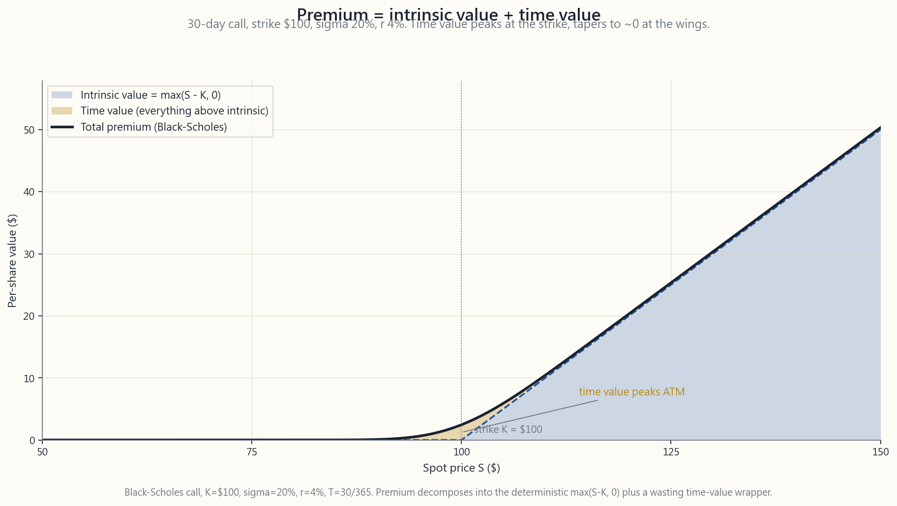
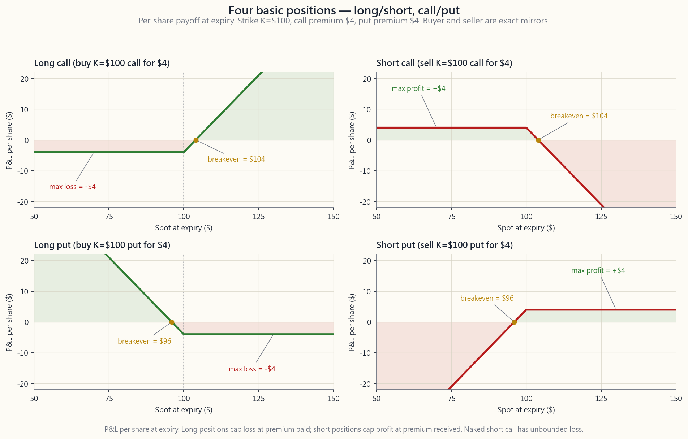

# 第二十五週：選擇權入門——買權、賣權、權利金、內含價值與時間價值

---

## 第一部分：閱讀單元

---

### 1. 為什麼這很重要

過去十二週，本課程的主題是「擁有資產本身」。接下來的六週，主題將轉變為「擁有資產相關的合約」。選擇權不是股份、不是債券、不是股票指數——它是一張紙，上面寫著：「若在特定日期某些條件成立，金錢即發生移轉。」這個概念聽起來比實際更陌生，而要熟悉第26至30週的策略，唯一的方法就是花一週的時間深入了解合約本身。

你需要這堂課，有四個具體的理由。

**(1) 這套術語密集，而且幾乎每個詞都是一個小陷阱。**「權利金」依上下文不同有三種意思。「價內」這個概念，對買權與賣權的含義並不相同。「履約」與「被指定」是同一件事，只是從交易的兩端各自看到的樣貌。大多數散戶在選擇權上爆倉，都是因為在學會術語之前就先學策略，最後持有一個連自己都無法用一句話說清楚運作機制的部位。花一週的時間把詞搞懂；策略在那之後其實並不難。

**(2) 權利金的拆解，是所有選擇權收益策略的核心引擎。**每個選擇權的價格都由兩個部分組成——*內含價值*（真實、固定、不受時間影響）和*時間價值*（一種不斷耗損的資產）。第26至28週的掩護性買權與現金擔保賣權，都是「收割時間價值」的交易。如果你看到一個報價，卻無法分辨這兩個數字，就無法判斷一個策略是「付錢請你承擔風險」還是「免費承擔風險」。本課的權利金拆解圖，是本課程後半段最重要的圖表。

**(3) 四種基本部位是一個坐標系，而不只是四種交易方式。**多頭買權、空頭買權、多頭賣權、空頭賣權。你這輩子會遇到的每一種選擇權策略，都是這四者的組合——垂直價差是其中兩種，鐵禿鷹策略是四種，掩護性買權是其中一種加上100股股票。把這四種損益圖的形狀內化一次，選擇權其餘的部分就只是簿記而已。

**(4) 這是啞鈴策略、稅務操作與波動率尾巴搖狗機制的基礎。**啞鈴策略的安全端持有長期買權，而收益中段（L2 部位）則賣出近期的空頭賣權與空頭買權來收割時間價值——兩端都是選擇權部位。稅務操作之所以採用選擇權，是因為選擇權能讓你在不觸發出售事件的情況下，重新調整曝險。波動率尾巴搖動現貨的機制，只有在你理解了造市商如何*避險*自己賣出的選擇權，以及那些避險操作如何推動現貨價格之後，才能真正看懂。少了這一週，整個投資框架中的三個重要部分，都將停留在抽象的層次。

---

### 2. 你需要掌握的知識

#### 2.1 選擇權是一份合約——一方擁有權利，另一方承擔義務

選擇權是兩造之間的合約：

- **買方**（亦稱「多頭」或「持有人」），預先支付現金*權利金*，換取一項*權利*。
- **賣方**（亦稱「空頭」或「寫入者」），收取該權利金，承擔一項*義務*。

這項權利與義務完全對應。若買方選擇行使權利，賣方即被迫履約交割。整個選擇權定價的架構，核心問題只有一個：*買方應該為賣方所承擔的這項義務，支付多少費用？*

選擇權只有確切的兩種類型。

**買權**是以固定價格*買進*標的資產的權利。當你想要在不支付全額股價的情況下，取得該股票的上漲曝險，就買進買權。

**賣權**是以固定價格*賣出*標的資產的權利。當你想要為持股設定下檔保護——無論是避險，還是押注股票將下跌——就買進賣權。

一個完整的美國上市股票選擇權，由五個欄位來識別：

1. **標的資產**——股票代號（如 `SPY`、`AAPL`）。
2. **到期日**——可行使權利的最後日期。
3. **履約價 (K)**——若行使權利，買賣發生的固定價格。
4. **類型**——買權或賣權。
5. **行使風格**——美式或歐式（見§2.5）。

券商畫面上的典型報價：`AAPL 16-Jan-2026 200 C @ 8.50 / 8.65`。讀法為：*「AAPL 2026年1月16日，履約價200美元，買權。買價8.50，賣價8.65。」* 這一行包含了五個識別欄位，以及合約的即時市場報價。

#### 2.2 合約以100股為單位——且權利金是以每股計算

新手選擇權交易者最常見的失誤，就是單位問題。美國上市股票選擇權*標準化為每口合約100股*。權利金是以*每股*報價，而非每口合約。要得到實際在帳戶中移動的金額，需乘以100。

以上述 AAPL 的例子，「賣價8.65」意味著**每口合約865美元**（8.65 x 100）。買進一口合約，買方即取得以200美元購買100股 AAPL 的權利——名目部位為20,000美元——而先期支出僅865美元。這就是槓桿所在。

100股規格帶來兩個後果：

- 無法買賣分數口合約。沒有半口合約這種東西。若策略需要50股的避險，選擇權並非合適的工具。
- *帳戶規模至關重要。* 履約價200美元的現金擔保賣權，需綁定20,000美元的保證金。若整個帳戶只有30,000美元，這個策略就只適合在 SPY 或 QQQ 等規模較大的名稱上操作，並選擇夠遠的價外履約價，使5,000美元左右的保證金承諾具有合理性。

100股規格也是本課程所有範例都以*口數*而非金額來表示部位規模的原因——說「賣出1口200美元的 SPY 賣權」是明確的；說「賣出價值20,000美元」則每一步都需要額外計算。

#### 2.3 價位狀態——價內、價平、價外

履約價 `K` 與當前現貨價 `S` 之間的關係，決定了選擇權的*價位狀態*。

對**買權**而言，「價位狀態」衡量的是現貨高出履約價多少——也就是這份權利*當下*包含多少真實價值：

| 術語 | 條件（買權） | 內含價值 |
|---|---|---:|
| 價內 (ITM) | `S > K` | `S - K` |
| 價平 (ATM) | `S ~= K` | ~0 |
| 價外 (OTM) | `S < K` | 0 |

對**賣權**而言，不等號方向相反——以K*賣出*的權利，在現貨*低於* K 時才有價值：

| 術語 | 條件（賣權） | 內含價值 |
|---|---|---:|
| 價內 (ITM) | `S < K` | `K - S` |
| 價平 (ATM) | `S ~= K` | ~0 |
| 價外 (OTM) | `S > K` | 0 |

在同一履約價下，買權價內即賣權價外，反之亦然。以履約價K=100、現貨S=110為例：買權價內10美元（內含價值10美元），而同一履約價的賣權則是價外10美元（內含價值為0）。它們是同一枚硬幣的兩面。

三個實務觀察。

**價平選擇權的時間價值最高。** 它們最接近「有價值」與「無價值」的邊界，因此賣方為「站錯邊就輸一小段價差」所收取的「保險費」在此最高。對於第26至28週的收取權利金交易者而言，價平合約每日收取的絕對權利金最多；對於第29週的尾部避險買方而言，價外合約每花一美元權利金所獲得的槓桿倍數最高。

深度價內選擇權的表現幾乎與股票本身相同（買權的 delta 接近1，賣權接近-1）——它們更像是槓桿替代品，而非嚴格意義上的選擇權。深度價外選擇權的表現則幾乎像彩票——大多數到期歸零，少數在尾部事件發生時給出5至50倍的報酬。

「價位狀態」軸是選擇權鏈的兩條主軸之一（另一條是到期日）。本課程中所有選擇權鏈的截圖，都是一個二維格：履約價縱向排列，到期日橫向排列。

#### 2.4 權利金 = 內含價值 + 時間價值

每個選擇權的權利金，都可以精確拆解為兩個部分。

**內含價值**是你*立即*行使選擇權所能獲得的金額。即以金額表示的價位狀態。它不能為負數（你不會行使一個無利可圖的權利）——買權為 `max(S - K, 0)`，賣權為 `max(K - S, 0)`。

**時間價值**（亦稱*外在價值*）是其餘的一切。是在內含價值之上所支付的額外權利金，用以補償賣方在現在到到期日之間，現貨進一步深入價內的風險。時間價值取決於三個因素：

1. **距到期日的天數 (DTE)。** 距到期日越多天 = 現貨移動的機會越多 = 時間價值越高。時間價值隨著到期日接近而趨向於零；在最後2至3週，衰減速度會加速（即「Theta 牆」）。
2. **隱含波動率 (IV)。** 預期波動越大 = 未來價格區間越寬 = 時間價值越高。隱含波動率是選擇權市場對標的資產在到期前波動性的預測。
3. **無風險利率。** 影響程度有限——買權是一種延遲購買的合約，因此利率越高，買權價值略微增加；賣權是一種延遲出售的合約，因此利率越高，賣權價值略微降低。這個效果對於近期月份的選擇權通常很小。

下圖顯示了一個30天、履約價100美元的買權（sigma=20%，r=4%）在現貨50至150美元之間的權利金拆解圖。陰影*內含價值*區域呈現線性的 `max(S - K, 0)` 損益；陰影*時間價值*疊加在上方。注意時間價值在*履約價處最大*，並向兩端逐漸趨近於零。

價平時間價值達到峰值的原因在於對稱性。當現貨等於履約價時，選擇權到期落在履約價兩側的機率相等，因此賣方每一元權利金所承擔的精算不確定性最高，定價也最高。深度價內時，選擇權「幾乎可以確定會被行使」——其價格主要是真實的內含價值，加上薄薄一層選擇權性質的包裝。深度價外時，選擇權「幾乎可以確定會到期歸零」——其價格是一層小小的彩票式包裝，沒有內含價值。

這個拆解方式是本課程後半段最有用的框架。收取權利金策略（第26、27、28週）的獲利，來自時間價值那塊衰減至零。購買權利金策略（第29週的保護性賣權、第30週的買權作為股票替代品）則預先支付時間價值，需要現貨充分移動才能回收。

#### 2.5 到期日——週選擇權、月選擇權、長期期權，以及美式與歐式

美國上市股票選擇權有三種到期日類型：

- **週選擇權**（「weeklies」）每週五到期。成交量大的主要標的（SPY、QQQ、AAPL、NVDA 等）在接下來4至8週內的每個週五都有週選擇權。週選擇權成交量龐大，是短期避險與 Gamma 交易的主力合約。
- **月選擇權**在每月*第三個週五*到期。這是歷史上的預設到期設定；月選擇權具有最深的未平倉量、最窄的買賣價差，以及最多的履約價選項。30至45天到期日的月選擇權，是散戶收取權利金的標準合約。
- **長期期權** (LEAPS)（長期股票預期證券）是到期日超過9個月的選擇權。在最活躍的標的上，到期日可遠達約2.5年。長期期權是陳馬啞鈴策略安全端*以買權替代持股*交易的核心架構——讓你以股價的15至25%控制100股，下行風險有上限，且讓部位持續累積以達到長期資本利得的稅務處理資格。

兩種**行使風格**對散戶而言至關重要：

- **美式。** 可在購入日至到期日（含）的任何交易日行使。所有美國上市*股票*選擇權（AAPL、SPY、QQQ 等）均為美式。
- **歐式。** 只能在*到期日當天*行使。美國上市的*現金結算指數*選擇權（SPX、NDX、RUT）為歐式。

對大多數散戶選擇權策略而言，實務上的差異很小，因為*提前行使幾乎永遠不是最佳選擇*——提前行使會拋棄剩餘的時間價值。美式提前行使真正發生的兩種情況：深度價內賣權（持有人提前取得現金），以及深度價內買權到期前一天發放大額股利（持有人捕獲股利）。這些邊緣案例對那些合約的*賣方*而言很重要——你可能會意外被指定。我們將在第27週討論到時一併說明。

結算方式也值得了解。股票選擇權採*實物交割*結算：行使 AAPL 買權，就交付100股 AAPL。指數選擇權採*現金結算*：行使 SPX 賣權，收取履約價與結算價之間的差額現金，不涉及股份交割。這在部位規模管理時很重要——深度價內的 SPX 賣權在週五付現金；深度價內的 SPY 賣權則會產生一個*融券放空部位*，必須在週一前平倉。

#### 2.6 四種基本部位

去掉所有策略名稱，散戶帳戶在單一合約上只能建立確切的四種部位：多頭買權、空頭買權、多頭賣權、空頭賣權。第26至30週的每一個策略，都是這四種部位之一，或其與標的股票的組合。

下圖是這四種部位*在到期時*損益圖的2x2方格，每個格子顯示到期時每股損益與現貨的關係，並標注損益平衡點、最大獲利與最大虧損。

每種部位的一行摘要：

**多頭買權。** 支付權利金 `c` 換取以K買入的權利。最大虧損 = `c`（選擇權到期歸零）。到期損益平衡點：`K + c`。損益平衡點以上，上行獲利無限。*使用情境：* 有上限虧損的方向性看多押注；啞鈴策略安全端的長期期權作為持股替代品。

**空頭買權。** 收取權利金 `c`，承擔以K賣出的義務。最大獲利 = `c`。到期損益平衡點：`K + c`。損益平衡點以上，虧損*無限*。**裸空**買權極為危險。**掩護性**買權（以100股股票為擔保品，第27週）將虧損限定為「未能實現的帳面漲幅」——有上限，而非無限。

**多頭賣權。** 支付權利金 `p` 換取以K賣出的權利。最大虧損 = `p`。到期損益平衡點：`K - p`。最大獲利 = `K - p`（現貨歸零）。*使用情境：* 投資組合保險（第29週）、方向性看跌押注、波動率急升交易。

**空頭賣權。** 收取權利金 `p`，承擔以K買入的義務。最大獲利 = `p`。到期損益平衡點：`K - p`。最大虧損 = `K - p`（現貨歸零——賣方仍須以K買入）。**裸空**賣權在大規模操作時極為危險；**現金擔保**賣權（第28週）預先存入全額保證金，虧損有上限——其損益表現與「在K價掛出限價單，成交價為 `K - p`」*完全相同*。這是最實用的散戶選擇權部位之一。

四種部位加上標的股票（多頭股票部位、空頭股票部位），共提供六種基本元件。你將會看到的每一個有名稱的策略——掩護性買權、現金擔保賣權、垂直價差、鐵禿鷹策略、保護性領口策略、跨式部位、勒式部位、日曆價差——都是這六種基本元件的組合。把四種損益圖的形狀背起來；其餘的就只是簿記。

#### 2.7 本課在整體框架中的位置——啞鈴策略、稅務操作與波動率尾巴

陳馬整體投資框架中，有三個重要部分直接建立在本週奠定的基礎上。

**啞鈴策略。** 陳馬啞鈴策略的安全端，使用*長期、深度價內買權*（長期期權）作為資本效益更高的持股替代品——以20%的資本控制100股的上行曝險，虧損以權利金為上限，並釋放現金用於投機端。收益中段（L2 部位）則針對優質標的賣出空頭買權與空頭賣權來收割時間價值。啞鈴策略的兩端都是選擇權；本週是讀懂任何一端所需的字典。

**選擇權作為稅務工具。** 掩護性買權讓你在不賣出股份的情況下*降低對持股的曝險*——持股部位繼續累積持有期間朝向長期資本利得稅務處理，無需觸發課稅事件，曝險得以調整。現金擔保賣權讓你在多個到期週期內，以你選定的進場價逐步建立部位，每次未執行到期都能獲取權利金，降低日後的成本基礎。兩者都依賴§2.4中時間價值與內含價值的拆解——被收割的那一塊，就是時間價值。

**選擇權尾巴搖動股市現貨。** 賣出選擇權給散戶與機構的造市商，會在標的股票上對其部位進行避險。他們的避險量取決於選擇權的 *delta*，而 delta 本身又受現貨、履約價、隱含波動率與時間的影響。當現貨移動，delta 移動，造市商的避險部位移動——這些機械式的避險操作*進一步推動現貨移動*。2021年 GameStop 軋空，正是這個機制反向運作的結果：散戶買入買權，造市商被迫買進現貨進行避險，現貨上漲，而上漲又是自我強化的循環，直到買權到期為止。本課程不涉及造市商避險的數學推導，但若不理解選擇權鏈在現代美國股票微結構中的角色，就無法真正讀懂這個市場。選擇權鏈早已不再是現貨走勢的配角，它越來越多地成為現貨走勢的*成因*。

本週的互動實驗室（[interactive/week25_option_explorer.html](interactive/week25_option_explorer.html)）讓你選擇四種部位中的任何一種，拖動履約價、到期日、波動率、利率與現貨的滑桿，即時觀察權利金拆解如何更新，同時疊加顯示到期時的損益圖。在閱讀第26週之前，請花二十分鐘在這個工具裡操作。六週的策略教材，全都建立在那五個滑桿上。

---

### 3. 常見誤解

1. **「買買權就能致富。」** 買權是*時間衰減*的工具。買進價外近月買權，最常見的結果是權利金全部損失。歷史上，單純買入買權的投資者，績效往往大幅遜於持有同一標的股票並長期持有的投資者——有時差距極為懸殊。買權是工具，不是彩票，而合理使用它們的情境（長期期權替代持股、針對性事件交易）其實相當有限。

2. **「選擇權對散戶來說風險太高。」** *裸空*選擇權對散戶確實風險很高。但多頭買權、多頭賣權、掩護性買權與現金擔保賣權，在下單的那一刻，都有*有上限且完全可知*的最大虧損。選擇權最大的風險，是*策略實際的運作方式*與*交易者所認為的運作方式*之間的落差——填補這個落差，風險就不會比股票本身更可怕。

3. **「權利金就是選擇權的成本。」** 權利金*只對買方而言*是成本。對賣方而言，權利金是*收入*——而成本是你所承擔的義務。每一元權利金，根據你站在交易的哪一側，符號截然不同。這堂課有一半，就是在幫你意識到這一點。

4. **「價外選擇權比較便宜，所以比較安全。」** 便宜與安全是兩回事。一個0.10美元的價外買權，以絕對金額來說確實便宜，但它到期歸零的機率約為95%。持續買進一籃子便宜的價外買權，是散戶消耗資本最穩定的方式之一。便宜衡量的是每口合約的美元數；安全衡量的是虧損的機率。

5. **「價平選擇權因為內含價值為零，所以沒有價值。」** 價平選擇權*全部都是時間價值*，而時間價值在履約價處最高。SPY 的一個30天期價平選擇權，是整條選擇權鏈中最有價值的合約之一——不是儘管內含價值為零，*而是因為*時間價值最高。不要把「沒有內含價值」和「沒有價值」混為一談。

6. **「行使選擇權才能賺到錢。」** 對散戶而言，行使選擇權幾乎永遠是錯誤的做法。行使會拋棄剩餘的時間價值；正確的做法是在市場上*賣出平倉*，同時獲取內含價值*與*時間價值。行使是在少數最佳情況下由券商處理的結算事件。新手若習慣性地行使價內多頭部位，就是把錢留在桌上。

7. **「美式選擇權因為可以隨時行使，所以比較有價值。」** 理論上確實稍微有價值一些；但在實務上，對於股票選擇權，與歐式幾乎沒有差別。美式溢價在深度價內賣權與除息日買權上是真實存在的；但對大多數近月、價平或近價位的部位而言，這個差異微不足道。

8. **「一口合約等於一股。」** 一口合約等於100股。新手最常見的錯誤，就是把「權利金8.50」讀成「8.50美元可以買」，而不是「850美元可以買」。永遠要乘以100。

9. **「長期期權基本上和月選擇權一樣，只是到期日更長。」** 長期期權的表現非常不同。它們的大部分價值來自內含價值（或接近內含價值，Theta 很低）。主導希臘值是 Vega，而不是 Theta。它們更像是槓桿工具，而非純粹的選擇權性質。在月選擇權上有效的策略（收取權利金、Gamma Scalping）在長期期權上往往行不通，反之亦然。

10. **「只要學會希臘值，我就能看懂選擇權。」** 邏輯顛倒了。希臘值是建立在四種損益圖形狀之上的微積分；如果四種損益圖形狀還不是本能反應，希臘值就無從理解。先學四種基本部位。希臘值從第26週起，在需要用到的情境下才會出現。

---

### 4. 問答單元

**Q1：我一直搞混選擇權中的「多頭」和「空頭」。能給我一個一句話的規則嗎？**

A：*多頭 = 預先支付了權利金，現在持有的是一項權利。空頭 = 收取了權利金，現在持有的是一項義務。*多頭任何東西（買權或賣權）意味著你是*買方*；空頭任何東西意味著你是*賣方/寫入者*。對標的資產方向的看法是獨立的——「做多股票」是看漲；「做多賣權」則是看跌股票。不要把這兩個維度混在一起。

**Q2：為什麼選擇權會到期？如果沒有到期日，不是更有用嗎？**

A：沒有到期日，就沒有時間價值權利金，也沒有賣方願意以正的價格賣出合約。到期日，就是把選擇權從一項永久性的權利（那將是無價的）轉化為有限的、可交易的合約的機制。賣方是在為這個有限的風險窗口收取報酬；沒有那個窗口，就沒有任何值得收費的東西。

**Q3：如何讀懂 `AAPL 1/16/26 200C 8.50/8.65` 這樣的選擇權鏈報價？**

A：標的資產 = AAPL；到期日 = 2026年1月16日；履約價 = 200美元；類型 = 買權；買價 = 8.50美元，賣價 = 8.65美元，均為*每股*報價。交易一口合約，買方以賣價 x 100 = 865美元買進；賣方以買價 x 100 = 850美元賣出。15美元的價差是造市商同時報出買賣兩邊報價的補償。

**Q4：為什麼價平選擇權的時間價值最高？**

A：因為在履約價處，選擇權到期落在履約價兩側的機率相等，因此*每一元權利金所對應的不確定性*在此最高。把現貨移到K以上20美元——買權現在「幾乎可以確定會被行使」，時間價值包裝縮小。把現貨移到K以下20美元——買權現在「幾乎可以確定會到期歸零」，時間價值包裝也縮小。峰值出現在履約價處，道理與一枚拋起的硬幣在旋轉中結果最不確定，是一樣的。

**Q5：我的價內多頭選擇權，應該行使還是賣出？**

A：幾乎永遠都應該*賣出*，不要行使。行使會拋棄剩餘的時間價值；賣出則同時獲取內含價值與時間價值。散戶的唯一例外，是你確實想要那100股股票，且選擇權已過除息日或即將到期——即便如此，「行使後立即賣出股票」與「賣出選擇權」在扣除買賣價差後，所得的金額大致相同。

**Q6：「被指定」是什麼意思？**

A：被指定是賣方端的事件，表示買方選擇行使了權利。身為賣方，你*被迫交割標的*（空頭買權 -> 被迫賣出100股；空頭賣權 -> 被迫買入100股）。美式股票選擇權的被指定，可以發生在任何交易日，但實際上幾乎都在到期日或臨近到期時發生。現金擔保賣權與掩護性買權，將被指定視為*預期結果*，而非失敗。

**Q7：我的虧損可能超過本金嗎？**

A：這取決於部位的性質。多頭買權與多頭賣權：最大虧損就是已付的權利金——就這樣。空頭*掩護性*買權：最大虧損是「你沒能保留的帳面漲幅」——有上限。空頭*現金擔保*賣權：最大虧損為 `（履約價 x 100）- 權利金`，已全額提供擔保品。裸空買權：理論上虧損無限（在沒有深入訓練和明確風險限制的情況下，請勿嘗試）。裸空賣權：有上限，但比在保證金帳戶中通常存入的擔保品還要大（同樣，在沒有訓練的情況下請避免）。

**Q8：隱含波動率和已實現波動率有什麼不同？**

A：已實現波動率 = 股票在近期某段時間內的*實際*移動幅度（向後看的測量值）。隱含波動率 = 代入 Black-Scholes 公式後能還原出選擇權*當前市場價格*的那個波動率數值（一個嵌入在價格中的前瞻性預測）。當隱含波動率 > 近期已實現波動率，選擇權市場預期波動將加劇；當隱含波動率 < 已實現波動率，市場預期趨於平靜。兩者之間的差距，是衍生性商品領域中最歷史悠久的訊號之一。

**Q9：為什麼散戶收取權利金的策略，以30至45天到期日為主？**

A：Theta——時間價值衰減的速率——在21至45天到期日的區間最快。短於21天，每口合約每日所收取的權利金相對於佔用的保證金來說太少；長於45天，每日衰減的速度明顯放慢，你需要用保證金換取相對更低的每日報酬率。30至45天到期日區間，幾十年來一直是散戶收取權利金的最佳實務區間；SPY 週選擇權和30天月選擇權是主力合約。

**Q10：做選擇權的帳戶最少需要多少？**

A：大約25,000至50,000美元，才能以一至兩口合約對美國主要指數股票型基金（SPY、QQQ、IWM）進行現金擔保賣權和掩護性買權操作。低於這個規模，100股合約規格就會把你逼進低價股的範疇，而那些標的的買賣價差往往會把權利金吃光。低於10,000美元，選擇權並非合適的工具——應先專注於建立購股紀律。合約的規格並不適合規模很小的帳戶。

**Q11：我聽說「選擇權交易是零和遊戲」，這是真的嗎？**

A：在扣除手續費之前，就單一合約而言，是的。買方每賺一元，就是賣方虧一元，反之亦然。這與股票市場不同——股票市場是正和遊戲（企業創造現金流量）。在選擇權中，你是在協商誰承擔既有風險的哪一塊。扣除手續費與買賣價差後，選擇權是*負和遊戲*。這就是策略比預測更重要的原因——站在不對稱性有利的那一側，勝過只是猜對方向。

**Q12：這堂課什麼時候會從理論變得實用？**

A：第26週。本週介紹的每一個概念——權利金 = 內含價值 + 時間價值、四種基本部位、價內/價平/價外、週選擇權 vs. 月選擇權 vs. 長期期權——都會立刻在第26週（選擇權作為限價單）、第27週（掩護性買權）、第28週（現金擔保賣權）、第29週（保護性賣權）、第30週（長期期權作為持股替代品）中用到。這是字典週。在閱讀接下來五週內容時，請把互動實驗室開在另一個分頁。

---

## 第二部分：YouTube 腳本

---

**影片標題：** 選擇權101——買權、賣權與每個權利金的兩個組成部分

**目標片長：** 約18分鐘

**主持人：** 陳馬、小魚

---

**[開場 — 0:00]**

**陳馬：** 歡迎回來。二十五週過去了，這週我們要把散戶工具箱裡最陌生的東西加進來——選擇權合約。接下來六週的策略教材，都建立在我們今天要建立的詞彙上。小魚和我在職涯中見過的幾乎每一次選擇權相關的爆倉，都來自跳過這一週的人。

**小魚：** 我補充一下——第26到30週的策略並不難。難的是術語。今天結束後，你應該能夠讀懂任何券商畫面上的選擇權鏈，把任何報價拆解為真實和時間兩個組成部分，並且能用一句話說清楚交易雙方各自同意了什麼。

**陳馬：** 今天三個重點。第一，選擇權合約*是什麼*——權利與義務的結構。第二，權利金拆解為內含價值與時間價值，這是本課程後半段最重要的一張圖。第三，四種基本部位，也就是每一個策略所在的坐標系。

**小魚：** 我們從最基礎的開始。

---

**[第一段——合約 — 1:00]**

**陳馬：** 選擇權是兩造之間的合約。一邊是買方。另一邊是賣方——也叫做*寫入者*。買方預先以現金支付*權利金*。作為交換，買方取得一項*權利*。賣方收取現金，承擔一項*義務*。

**小魚：** 而這項權利與義務完全對應。若買方選擇行使權利，賣方就被迫履約交割。選擇權定價的核心問題只有一個：買方應該為賣方所承擔的這項義務支付多少費用？

**陳馬：** 只有兩種類型，就只有兩種。*買權*——以固定價格*買入*標的資產的權利。當你想要在不支付全額股價的情況下，取得該股票的上漲曝險，就買進買權。*賣權*——以固定價格*賣出*標的資產的權利。當你想要為持股設定下檔保護——避險，或者押注股票下跌——就買進賣權。

**小魚：** 一個完整的美國上市股票選擇權，由五個欄位識別。標的資產——股票代號。到期日——可行使權利的最後一天。履約價——行使後買賣發生的固定價格。類型——買權或賣權。行使風格——美式或歐式，我們待會兒會說明。

**陳馬：** 典型的券商畫面報價：AAPL，2026年1月16日，200美元履約價，買權，買價8.50，賣價8.65。這一行包含了五個識別欄位，以及即時的雙向市場報價。

---

**[第二段——100股，且權利金是每股計算 — 3:30]**

**小魚：** 一個關鍵重點——也是最常見的新手失誤。美國上市股票選擇權*標準化為每口合約100股*。權利金是*每股*報價，不是每口合約。永遠要乘以100才能得到實際金額。

**陳馬：** 所以用我們的 AAPL 例子，「賣價8.65」意味著買進一口合約需要865美元。這口合約賦予買方以200美元購買100股 AAPL 的權利——名目部位20,000美元——而先期支出只有865美元。

**小魚：** 這個比率——865對20,000——就是槓桿。用名目金額的大約4%，換取全部的上漲潛力。

**陳馬：** 兩個後果。第一，沒有分數口合約。如果你的策略需要50股的避險，選擇權不是合適的工具。第二，帳戶規模至關重要。AAPL 200美元履約價的現金擔保賣權，需要綁定20,000美元的保證金。如果你的整個帳戶只有30,000美元，這個策略就只適合在 SPY 或 QQQ 等更大的名稱上操作，並選擇夠遠的價外履約價，讓5,000美元左右的保證金承諾具有合理性。

---

**[第三段——價位狀態 — 5:00]**

**小魚：** 下一個概念——*價位狀態*。履約價K與當前現貨價S之間的關係。三個區間。

**陳馬：** 對買權而言，價內意味著現貨*高於*履約價。當股票在110元，以100元買入的權利是有價值的——你享有10元的折扣。*價內*意味著真實的、內含的價值。價平意味著現貨等於履約價——這份權利剛好在邊界上。價外意味著現貨低於履約價——當股票在90元，以100元買入的權利*今天*毫無價值，只有未來可能有價值的機會。

**小魚：** 對賣權而言，不等號方向相反。以100元*賣出*的權利，在股票跌到90元時才有價值。所以賣權價內是現貨低於履約價。賣權價外是現貨高於履約價。價平一樣——現貨等於履約價。

**陳馬：** 在同一履約價下，買權價內即賣權價外，反之亦然。同一枚硬幣的兩面。

**小魚：** 而價平選擇權的*時間價值最高*，這就帶我們來到——

---

**[第四段——權利金的拆解 — 6:30]**

**[VISUAL: image/week25_premium_decomposition.png]**

**陳馬：** 就是這張圖。花一分鐘好好看這張圖。這是一個30天期買權，履約價100美元，波動率20%，利率4%，橫軸是50到150的現貨價格。兩個陰影區域。

**小魚：** 下方的楔形——從現貨100元開始線性上升的那個區塊——就是*內含價值*。對買權而言，就是 `max（現貨減履約價，零）`。真實的價值，固定的，不受時間影響。如果你現在行使，就能拿到那個金額。

**陳馬：** 疊在上方的凸起——那個金色的弧形區塊，從內含價值底線向上隆起，在履約價附近達到頂峰，並隨著買權深入價內或遠離至價外而逐漸縮小——那就是*時間價值*。一切超過內含價值的額外溢價。它補償賣方在現在到到期日之間，現貨進一步深入價內的風險。

**小魚：** 注意三件事。第一，時間價值在*履約價*處達到頂峰。這不是巧合。在履約價處，選擇權到期落在兩側的機率相等，因此賣方每一元權利金所承擔的精算不確定性最高，定價也最高。

**陳馬：** 第二，深度價內時，時間價值很小。買權「幾乎可以確定會被行使」——其價格主要是真實、固定的內含價值，外加薄薄一層選擇權性質的包裝。

**小魚：** 第三，深度價外時，時間價值同樣很小——因為買權「幾乎可以確定會到期歸零」。一小層彩票式的選擇權性包裝。

**陳馬：** 這個拆解方式是接下來五週每一個收益策略的核心引擎。賣出掩護性買權、賣出現金擔保賣權——都是*收割時間價值*的交易。賣方預先收取時間價值那塊，並隨著選擇權趨向到期而將其落袋為安。如果你看到一個報價，卻無法分辨內含那塊與時間價值那塊，就無法判斷這個策略是「付錢請你承擔風險」還是「免費承擔風險」。

---

**[第五段——時間價值取決於三個因素 — 9:30]**

**小魚：** 時間價值取決於三個輸入值。距到期日的天數、隱含波動率，以及無風險利率。

**陳馬：** 天數越多 = 時間價值越高。現貨移動的機會越多 = 保險費越高。隨著到期日接近，時間價值趨向於零，而且在最後兩三週衰減速度會加速——也就是所謂的*Theta 牆*。

**小魚：** 隱含波動率——選擇權市場對股票在到期前移動幅度的預測。隱含波動率越高 = 預期區間越寬 = 時間價值越高。隱含波動率有其自己的生命週期——當令人擔憂的事件即將到來，例如財報公布，隱含波動率會急升。當市場平靜，隱含波動率就會萎縮。

**陳馬：** 至於利率——對股票選擇權的影響有限。利率越高，買權略微增值（它是一種延遲購買的合約——你等待期間，現金在賺取利息），賣權略微貶值。對近月選擇權而言，不必為此失眠。在互動工具中，我們會展示這個效果的量級。

---

**[第六段——到期日類型 — 11:00]**

**小魚：** 到期日有三種類型。

**陳馬：** *週選擇權*每週五到期。主要的大型標的——SPY、QQQ、AAPL、NVDA——在接下來八週內的每個週五都有週選擇權。它是短期避險與 Gamma 交易的主力合約。

**小魚：** *月選擇權*在每月第三個週五到期。這是歷史上的預設選擇。未平倉量最深、買賣價差最窄、履約價選項最多。30至45天到期日的月選擇權，是散戶收取權利金的標準合約。

**陳馬：** 還有*長期期權*——長期股票預期證券，到期日超過九個月的選擇權。在最活躍的標的上，可以遠至約兩年半。長期期權是啞鈴策略安全端*以買權替代持股*交易的核心架構。以股價的15至25%控制100股，下行風險有上限，並讓部位持續累積以達到長期資本利得的稅務處理資格。第30週我們會明確地討論這個做法。

**小魚：** 兩種行使風格。*美式*——從購入日至到期日（含）的任何交易日均可行使。所有美國上市股票選擇權均為此類。*歐式*——只能在到期日當天行使。美國上市的現金結算指數選擇權，例如 SPX、NDX、RUT，為此類。

**陳馬：** 對大多數散戶策略而言，實務差異很小，因為提前行使幾乎永遠不是最佳選擇——提前行使會拋棄時間價值。兩種真正重要的情況：深度價內賣權，以及除息日的深度價內買權。這些我們在第27週討論到時一併說明。

---

**[第七段——四種基本部位 — 13:00]**

**[VISUAL: image/week25_four_positions.png]**

**小魚：** 這是第二張值得花一分鐘仔細看的圖。2x2方格。四個到期時的損益圖。

**陳馬：** 左上——*多頭買權*。你支付了權利金，換取以K買入的權利。在履約價以下，最大虧損就是權利金——一條水平線。在履約價加上權利金以上，損益呈線性且無限延伸。損益平衡點在K加上已付權利金。

**小魚：** 右上——*空頭買權*。你賣出了這份權利。垂直翻轉的鏡像。在履約價加上權利金以上，虧損呈線性且無限延伸。以下，你保留了權利金——一條水平線。*裸空*是爆倉的方式。以100股股票為擔保品的*掩護性*空頭買權——是產生收益的方式，第27週。

**陳馬：** 左下——*多頭賣權*。支付了權利金換取以K賣出的權利。在履約價以上，最大虧損是權利金。在履約價減去權利金以下，損益呈線性，下限是「股票歸零」。使用情境：投資組合保險，第29週；方向性看跌押注；波動率急升交易。

**小魚：** 右下——*空頭賣權*。賣出了這份權利。在履約價以上，你保留了權利金。以下，隨著股票下跌虧損累積——上限是「股票歸零」。*裸空*賣權在大規模操作時極為危險。*現金擔保*賣權——預先存入全額保證金——有上限，而且*就損益而言，與「在K價掛出限價買單，成交價為K減去權利金」完全相同*。那就是第26週。

**陳馬：** 把這四種損益圖的形狀背起來。本課程中的每一個策略——掩護性買權、現金擔保賣權、垂直價差、保護性領口、鐵禿鷹策略、日曆價差，你叫得出名字的都算——都是這四種部位加上股票的組合。六種基本元件。其餘的就是簿記。

---

**[第八段——這套知識的定位 — 15:30]**

**小魚：** 陳馬整體投資框架中，有三個重要部分直接建立在本週的基礎上。快速帶過。

**陳馬：** 第一——啞鈴策略。安全端使用長期、深度價內的長期期權買權作為資本效益更高的持股替代品。收益中段針對優質標的賣出空頭買權與空頭賣權來收割時間價值。兩端都是選擇權。本週就是那本字典。

**小魚：** 第二——選擇權作為稅務工具。掩護性買權讓你在不賣出持股的情況下降低曝險。現金擔保賣權讓你在多個到期週期內，以你選定的進場價逐步建立部位，每次未執行到期都能獲取權利金。兩者都依賴了解內含價值與時間價值的拆解——被收割的那塊就是時間價值。

**陳馬：** 第三——波動率尾巴搖動股市現貨。造市商對他們賣出的選擇權在現貨市場進行避險。現貨移動，delta 移動，避險部位移動——而這些避險操作*進一步推動現貨移動*。2021年 GameStop 軋空，正是那個機制反向運作：散戶買入買權，造市商被迫買進現貨避險，現貨上漲，而上漲是自我強化的循環，直到買權到期為止。整個投資框架的三大塊，*需要*本週才能看懂。這就是為什麼我們在建立任何策略之前，先花了整整一週深入了解這份合約。

---

**[第九段——互動工具 — 16:30]**

**[VISUAL: interactive/week25_option_explorer.html]**

**陳馬：** 互動實驗室把所有這些整合在一起。選擇四種部位中的任何一種。拖動履約價、距到期日天數、隱含波動率、利率和現貨的滑桿。觀察權利金拆解如何即時更新——內含價值、時間價值、總計——同時疊加顯示到期損益圖隨履約價移動。

**小魚：** 幾個值得試試的操作。把履約價固定在100，現貨也在100，把距到期日天數從1天拖到365天。觀察時間價值的頂峰從幾乎為零，增長到好幾美元。那就是你在第27週會再次遇到的*Theta 曲線*。

**陳馬：** 然後在同樣的距到期日天數下，把隱含波動率從5%拖到80%。觀察時間價值的凸起按比例增大。那就是以圖形呈現的 *Vega*——對波動率的敏感度。

**小魚：** 然後在其他條件固定的情況下，把現貨移離履約價。觀察時間價值的凸起在兩端消失，並在履約價處達到頂峰。那就是第四段的對稱性論述，以具體的方式呈現。

**陳馬：** 在閱讀第26週之前，花二十分鐘在這個工具裡操作。六週的策略教材，全都建立在那五個滑桿上。

---

**[結尾 — 17:30]**

**小魚：** 重點回顧。選擇權是一方持有權利、另一方承擔義務的合約。權利金等於內含價值加時間價值。四種基本部位——多頭買權、空頭買權、多頭賣權、空頭賣權——是所有策略所在的坐標系。每口合約100股，權利金以每股報價，乘以100才是實際金額。到期日分週選擇權、月選擇權與長期期權；行使風格分美式與歐式。

**陳馬：** 下週——選擇權作為限價單。這是散戶選擇權中最有用的思考框架。一旦你把掩護性買權和現金擔保賣權看作是「*付你錢讓你等待*」的委託單，啞鈴策略收益端的整個邏輯就會水到渠成。

**小魚：** 讀完課文，玩玩互動工具，我們下週見。

**[結束]**