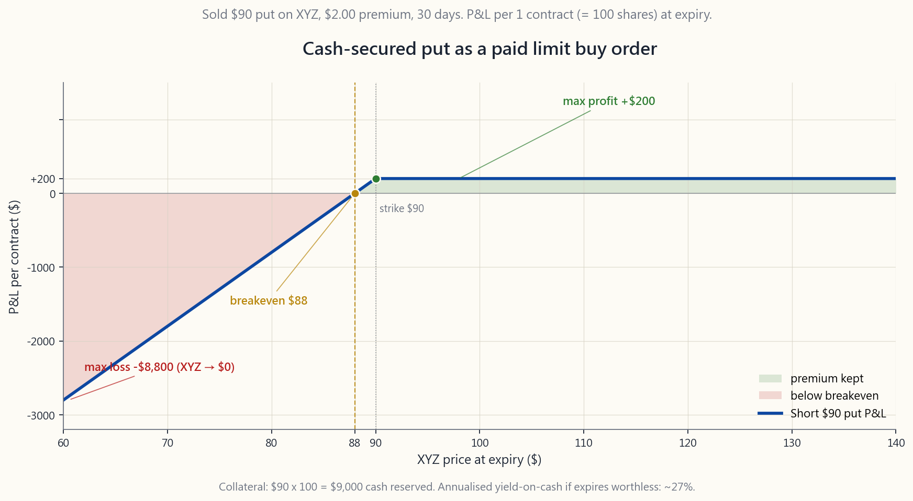
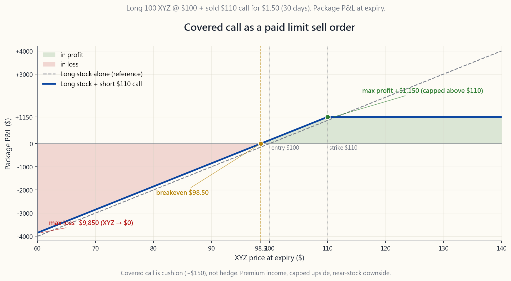

# 第二十六週：選擇權即限價單——收取報酬，靜待指令成交

---

## 第一部分：閱讀章節

---

### 1. 為什麼這很重要

上週我們梳理了選擇權的詞彙——買權、賣權、履約價、到期日、權利金、時間價值衰減。光有詞彙是死的。真正讓選擇權從艱澀的衍生性商品，蛻變為散戶長期多頭帳戶得力工具的，是正確的**心智模型**，而最正確的模型也是最簡單的：**賣出選擇權，就是一張會付你錢的限價單。**

在$90履約價賣出現金擔保賣權，等同於你早就想對券商下達的那道指令——*「我要在$90買進100股XYZ」*——差別只在於現在市場還額外開了一張支票給你，報酬你把這道指令留在桌上等待成交。在$110履約價賣出掩護性買權，則是*「我要在$110賣出我的XYZ」*，同樣附帶一張支票。相同的觸發價格、相同的低買高賣紀律，加上在指令尚未成交期間所賺取的收益。

這件事具有四個具體的重要性：

**(1) 閒置現金是真實的成本，而非免費的選項。** 多數散戶都維持一個「等待佈局」的現金部位，停放在貨幣市場或國庫券基金，賺取當前的短期利率。這是**機會成本下限**；對比之下，在你真心想持有的標的上賣出一個「以目標價為履約價」的現金擔保賣權，同樣一筆現金在等待相同目標進場價的過程中，可以創造兩到三倍的效益。這筆權利金不是額外紅利——而是你的現金在等待期間**本就應該賺到**的報酬。

**(2) 賣出決策在情緒上代價高昂；提前承諾並獲得報酬則是廉價的。** 每位長期多頭投資人都有「早該賣掉」的遺憾。掩護性買權讓你提前在心態冷靜時，以你自行選定的價格預先開出賣單，並付錢給自己，以換取遵守這道紀律的承諾。這筆權利金，在機制上等同於預先支付給自己一筆顧問費，讓你**不去移動球門柱**。

**(3) 這是啞鈴策略中的L2收益戰術。**
陳馬的啞鈴策略，一端是高度確信的安全資產，另一端是不對稱的投機部位；問題在於這兩端**之間**的標的整天在做什麼。它們坐落於L2（「高品質長期多頭、永久複利型」）部位，透過在持有人早就願意採取行動的價格邊緣，賣出掩護性買權與現金擔保賣權來賺取權利金。L2部位是啞鈴策略的收益引擎，而這份收益是工程式設計出來的，而非憑空期望的。

**(4) 選擇權首先是稅務工具，其次才是槓桿工具。**
賣出掩護性買權，讓你在不賣出股份的情況下降低贏家部位的Delta敝口——曝險移動了，但稅務批次紀錄未被觸發。賣出現金擔保賣權，讓你透過**多個到期日**以目標價格逐步建立部位，每次到期、選擇權失效所積累的權利金，都在降低最終成本基礎。對一個成功的長期多頭投資人而言，最大的隱形費用是資本利得稅；而以「替代限價單」的視角看待選擇權，正是開始管理這筆費用的方法。

本週我們將慢動作拆解這套機制。第27週深入掩護性買權——履約價選擇、時間價值收割、何時展期。第28週以同樣的方式拆解現金擔保賣權與輪轉策略。

---

### 2. 你需要掌握的內容

#### 2.1 參考帳戶——$50,000帳戶，持有100股XYZ，現價$100

為了讓每個範例都能對應到同一張資產負債表，請想像一個**$50,000帳戶**，持有**100股XYZ**（一檔類似SPY的指數股票型基金），目前交易價格為每股$100。股票總值$10,000，現金$40,000。這個帳戶大小足以同時示範兩種策略：有100股可供賣出掩護性買權，也有充裕的現金擔保幾乎任何履約價的賣權。

本課將使用兩個具體的履約價：

- **$90現金擔保賣權**（低於現價10%）。所需擔保品：$90 x 100 = **$9,000**，從$40,000現金部位中撥出。
- **$110掩護性買權**（高於現價10%）。所需擔保品：已持有的100股。

XYZ的隱含波動率處於合理水準，因此近月選擇權大約支付：賣權$2.00、買權$1.50。這兩個數字將貫穿下列所有範例。請參見損益圖
[course/image/week26_csp_payoff.py](course/image/week26_csp_payoff.py)
與 [course/image/week26_cc_payoff.py](course/image/week26_cc_payoff.py)，
以及互動演練
[interactive/week26_orders_lab.html](interactive/week26_orders_lab.html)。

#### 2.2 現金擔保賣權——等同於限價買入指令

現金擔保賣權（CSP）是一道你早已以純粹形式使用過的指令。純粹的形式就是限價買入單：*「以$90或更低價格買進100股XYZ，長效有效。」* 在指令等待成交期間，你預留的$9,000存放在券商的現金帳戶中賺取利息。

現金擔保賣權版本是同一道指令，但附加了到期日與一張支票：

> *「我願意以$90買進100股XYZ。這是$9,000擔保金。請付我$200，讓這道指令在30天內保持有效。」*

只有三種可能的結果：

1. **XYZ到期時收盤於$90以上。** 賣權失效。你保留$200權利金，$9,000擔保金解除鎖定。現金年化殖利率：$200 / $9,000 x (365/30) ≈ **27.0%**。你可以繼續賣出下個月的賣權。
2. **XYZ到期時收盤介於$88至$90之間。** 你遭到指派：以$90買進100股。有效成本基礎 = $90 - $2 = **每股$88**，比股票實際成交價還低。你以低於自訂限價的折扣買進了這檔股票。
3. **XYZ到期時收盤低於$88。** 同樣遭到指派，同樣是有效成本$88，但此時帳面出現虧損。下行風險與原本在$90設限價買入單填單完全相同，*減去*$2的緩衝。最壞情境（XYZ歸零）：-$8,800，而限價單的損失是-$9,000——嚴格來說更優。

圖表腳本 `week26_csp_payoff.py` 以$60至$140的範圍為這條損益曲線著色，並標注損益兩平點、最大獲利及尾部損失。

誠實的框架：**現金擔保賣權在損益表現上永遠不遜於相同履約價的限價單**，代價只有一個——選擇權有到期日，限價單沒有。如果你的目標價是你六個月後仍願意執行的硬線，現金擔保賣權就轉化為一種滾動紀律：每次舊的一份到期，就在當天賣出新的一份。

#### 2.3 掩護性買權——等同於限價賣出指令

掩護性買權（CC）是出場端的鏡像策略。純粹的形式：限價賣出100股XYZ，目標價$110，長效有效。選擇權版本：

> *「我願意以$110賣出我的100股XYZ。股票本身作為擔保品。請付我$150，讓這道指令在30天內保持有效。」*

三種可能結果：

1. **XYZ到期時收盤低於$110。** 買權失效。你保留100股與$150權利金。這$150是股利以外的額外收益；股票部位維持不變。持股年化殖利率：$150 / $10,000 x (365/30) ≈ **18.3%**。
2. **XYZ到期時收盤恰好在$110。** 你遭到指派（你的股票被買走），成交價$110。總收益：$110 + $1.50權利金 = **每股$111.50**，即整個部位$11,150。比你的$10,000成本高出$1,150。
3. **XYZ到期時收盤高於$110。** 同樣遭到指派，同樣是$111.50的收益。XYZ在$111.50以上的任何漲幅，你均無法獲益——這是你為收取權利金而接受的取捨。圖表 `week26_cc_payoff.py` 顯示，在股價≥$110的任何點位，損益上限均為+$1,150。

下行風險與直接持股相比幾乎相同，*僅減去*$1.50的緩衝：XYZ歸零時，部位價值為-$10,000 + $150 = **-$9,850**，而未賣出買權的持股者損失為-$10,000。掩護性買權不是避險工具——權利金遠不足以達到保護效果——但它是緩衝、收益，以及預先承諾的出場，三者合而為一。

#### 2.4 慢動作拆解機制

本月課程的第0天：

1. **帳戶快照。** $50,000：100股XYZ，每股$100（= 股票$10,000）+ 現金$40,000。XYZ近月$90賣權賣出報價$2.00，$110買權賣出報價$1.50，均剩30天到期。
2. **賣出開倉$90賣權。** 點擊「賣出開倉」；券商保留$9,000現金作為擔保品；$200立即入帳。現金部位現況：$40,000 - $9,000（保留）+ $200（權利金）= $31,200（自由）+ $9,000（鎖定）+ $200（收益）。
3. **賣出開倉$110買權。** 券商凍結100股作為擔保品；$150入帳。這100股在買權有效期間無法賣出（否則將成為裸空買權），但仍可領取股利，且股價漲跌照常計算。至今收益：**$350**，在$50,000帳戶中兩次點擊即完成——這相當於淨資產的70個基點，或年化約8.4%，而「這些交易」恰恰就停在你早就願意採取行動的那些價格上。
4. **等待30天。** 等待期間每週檢查一次部位，而非每天。XYZ在$98——什麼都不做。XYZ在$92——什麼都不做。XYZ在$115——買權已是價內；到期日股票將依指令被買走，無需慌張。XYZ在$86——賣權已是價內；你將依指令以$90的價格承接100股。
5. **到期日。** 券商自動結算。買權指派：股票交割，$11,000入帳。賣權指派：$9,000出帳，100股XYZ到帳。根據XYZ的收盤位置，上述情況可能單一發生、同時發生，或一件都不發生。

全程不需要持續監控、盯盤或管理停損單。指令自動執行。唯一的主動步驟，是下個月重新開出新的一對指令。

#### 2.5 現金殖利率：「收取報酬靜待」實際能賺多少

誠實的收益比較基準，是每筆交易**實際佔用的特定資本**上的殖利率，而非整體帳戶的殖利率。

$90現金擔保賣權，權利金$2，期間30天：

- 佔用資本：$9,000擔保金。
- 權利金：$200。
- 期間殖利率：200 / 9000 = **2.22%**，為期30天。
- 年化（單利，365天）：2.22% x (365/30) ≈ **27.0%**。

這個標題殖利率是選擇權賣方文獻最愛引用的數字。但它在兩個面向上存在誤導：

1. **27%只有在選擇權到期失效時才能兌現。** 一旦遭到指派，「殖利率」就不再是現金上的報酬——它已轉化為一個股票部位，其報酬取決於股票，而非權利金。更誠實的數字是**期望**年化殖利率：權利金殖利率 x 到期失效的機率，加上承接股票的期望報酬 x 遭到指派的機率。
2. **27%在遭到指派的那個月將不復存在。** 如果你在XYZ收盤$80的月份以$90被指派，部位將出現$1,000的帳面虧損，對比$200的收益——該月淨虧損，而非27%的正報酬。

$110掩護性買權，權利金$1.50，期間30天：

- 佔用資本：$10,000的股票市值。
- 權利金：$150。
- 期間殖利率：150 / 10000 = **1.50%**，為期30天。
- 年化：1.50% x (365/30) ≈ **18.3%**。

正確解讀這些數字的方式：它們是選擇權組合策略收益貢獻的**上限**——也就是在「什麼都沒發生的月份」所能收取的金額——且只有在什麼都沒發生時，這些數字才能描述完整的報酬。在遭到指派的情境中，掩護性買權除了權利金本身之外，不增添任何額外收益；現金擔保賣權則直接轉化為標的股票的報酬。

#### 2.6 這在啞鈴策略中的定位

陳馬的投資組合是一個啞鈴：一端是安全資產（現金、國庫券、黃金、深度價內的長期期權），另一端是結構性阿爾法的投機部位。中間——市值加權的「核心」配置——已被移除。但這不代表兩端之間什麼都沒有。你**願意持有、也願意以已知價格賣出**的高品質長期多頭標的，坐落於L2收益部位，而L2收益部位幾乎完全依靠掩護性買權與現金擔保賣權來運作。

現金擔保賣權與掩護性買權的組合，正是L2部位殖利率的來源。沒有這層選擇權組合策略，L2部位不過是一個緩慢複利、股利殖利率在1-2%區間的組合。加上這層策略後，在什麼都沒發生的月份，它支付的是股利**加上**8-15%的選擇權權利金；一旦有事發生，則精確地在持有人預先承諾採取行動的價格上，回歸被動多頭曝險。

這就是為何我們將這堂課視為基礎而非進階。啞鈴的形狀需要這個引擎才能在經濟上成立；沒有它，安全端的阻力將主導不對稱端的回報。

#### 2.7 這在稅務架構中的定位

掩護性買權還有第二個價值，其重要性至少不亞於收益本身，卻鮮少被人提及：它讓你**在不賣出股份的情況下，降低贏家部位的有效曝險**。一個帳面已有3年嵌入利得的100股部位，賣出一份掩護性買權——股份未被賣出，沒有任何應稅事件實現，但整個組合的Delta現在從1.0降至約0.3。你做空波動性的同時，這個稅務批次繼續計算持有年限，朝向長期資本利得的稅務待遇邁進（或在稅務優惠帳戶中，持續進行免稅複利）。

現金擔保賣權則在進場端扮演對等的角色：它讓你**跨多個到期日**以目標價格建立部位。每次到期、選擇權失效所積累的短期收益（按一般所得稅率課稅，理想上在個人退休帳戶內進行），都在降低最終成交的有效成本基礎。今天積累的每一美元權利金，之所以比五年後實現的每一美元資本利得更有價值，正是因為你將這筆收益放在稅務庇護帳戶中積累——這也是為何這套策略與個人退休帳戶的組合，幾乎是天生絕配。

在Roth IRA中，所有權利金均免稅，策略可以免稅複利。在傳統IRA中，相同的收益享有稅務遞延。在應稅帳戶中，選擇權賣方收益以一般所得稅率計為短期資本利得，你必須在決定此組合策略是否值得之前，將這個稅務阻力折算進標題殖利率中。

---

### 3. 常見誤解

1. **「賣出賣權是看空，就像放空股票。」** 恰恰相反。放空股票在股價下跌時獲利，在反彈時虧損；空頭賣權在股價**持平或上漲**時獲利，在急跌時虧損，且損失底部以履約價減去權利金為限。空頭賣權 = 中性偏多，而非看空。

2. **「賣權的權利金是白撿的錢——盡量賣價外的。」** 深度價外的賣權相對於其佔用資本的報酬幾乎微不足道。隨著履約價遠離現價，權利金與擔保品的比率迅速崩潰，而這些尾部賣權唯一真正重要的時刻，正是它們被大幅沖擊的時刻。不要去追選擇鏈的彩券端。

3. **「掩護性買權可以對沖下行風險。」** 不能。$1.50的權利金只是$1.50的緩衝——有用，但稱不上保護。如果XYZ從$100跌至$80，掩護性買權的賣方損失$1,850，而非$2,000。差距微乎其微。如果你想要避險，請買進賣權（第29週）；如果你想要收益加上預先承諾的出場，就賣出買權。

4. **「你永遠不應該遭到指派。」** 指派就是**限價單成交**。如果你真心願意在$90買進、在$110賣出，指派就是你當初設定的那筆交易——而非失敗情境。將指派視為不惜一切代價要避免的事，只會導致你無止境地展期選擇權，只為了閃避你原本設定要執行的那次成交。

5. **「年化殖利率 = 實際殖利率。」** 30天賣權的27%年化數字，並不代表每年真的能賺27%。它只是你在「什麼都沒發生的月份」所收取的金額，乘以假設這樣的月份永遠持續下去的結果。一整年下來的實現殖利率，必然包含你**遭到指派**的那些月份，加總之後的結果是「股票報酬加上緩衝」，而非27%的選擇權權利金。

6. **「你需要整天盯著螢幕。」** 事實恰好相反。每一個需要做決策的步驟，都是獨立的一張指令：賣出開倉、視情況提前平倉、等待到期。多數現金擔保賣權與掩護性買權的賣方，每個月花15-30分鐘，其餘交由券商結算。持續監控在這裡是**壞習慣**——它會誘使你把一個正在運作的交易管死。

7. **「賣出選擇權風險無限。」** 裸空選擇權是如此，但現金擔保賣權與掩護性買權不是——兩者均有明確上限。現金擔保賣權的最大損失是「(履約價 x 100) - 收取的權利金」；掩護性買權的最大損失是標的股票歸零，*減去*收取的權利金。兩個數字均可在下單時完全預知。

8. **「選擇權收益讓長期投資變得無關緊要。」** 選擇權權利金殖利率是真實的，但它是**補充**，而非替代。長期財富的主體仍來自股票的價格增值與股利。選擇權組合策略將預期報酬從7%提升至9-12%；它不會將其變成30%。

9. **「這不過是在賣保險——最終必然虧損。」** 這是對賣保險方的經典批評，如果你在未避險的帳戶上裸賣尾部風險，這個批評會是對的。但現金擔保賣權與掩護性買權都不是裸賣尾部風險——兩者均有充分擔保，而現金擔保賣權的擔保品，是在你**自行選定**的履約價上，針對你**願意持有**的股票所設的。這種不對稱性，是站在你這邊的。

10. **「這套策略可以用在任何股票上。」** 不行。你可以用在符合以下條件的股票：(a) 選擇鏈具備流動性（買賣價差緊、未平倉量合理）；(b) 股票的價格與品質，是你凌晨3點睡醒也願意持有的；(c) 隱含波動率合理（不能低到讓權利金不值得花時間，也不能高到讓被指派風險壓倒一切）。對多數散戶帳戶而言，這個名單是二十檔左右的標的，主要是大型美股指數股票型基金與家喻戶曉的個股。

---

### 4. 問答區

**Q1：「現金擔保」賣權與「裸空」賣權有什麼差別？**

A：擔保品的差異。現金擔保賣權在帳戶中保留了完整的「履約價×100」現金；遭到指派時，現金直接用於買股，無需動用保證金。裸空賣權只需繳交券商要求的保證金，遠低於完整擔保金額。現金擔保賣權在個人退休帳戶（IRA）中即可執行；裸空賣權則需要保證金帳戶及更高等級的選擇權交易資格。對於學習這套策略的散戶，請一律選擇現金擔保。

**Q2：為什麼是30天？不能是7天或90天嗎？**

A：時間價值衰減（Theta）——選擇權時間價值的耗損速度——在21至45天的窗口最快。7天期選擇權相對其佔用資本的權利金非常少；90天期選擇權雖然絕對金額較多，但每日衰減速度較慢，且擔保品鎖定時間更長。30至45天的區間，數十年來一直是散戶賣方經過實證驗證的最佳甜蜜點，且沒有強力理由認為這個規律會改變。

**Q3：如果我的現金擔保賣權遭到指派，但我不再想要這檔股票怎麼辦？**

A：這是投資組合管理問題，而非選擇權問題。你立即賣出承接的股票，計算扣除權利金後的損益，並停止對那檔標的賣出賣權。關鍵紀律要在賣出賣權**之前**確立：只對你真心歡迎以履約價承接的股票賣出現金擔保賣權。如果你的信念已經改變，請在到期前以買入平倉的方式關閉賣權，而非等待被指派。

**Q4：我可以在到期前提前平倉，而不是等到期嗎？**

A：可以，你隨時可以「買入平倉」。常見的經驗法則：如果選擇權已損失50-80%的價值，但距到期還有數週，就買回來鎖定已實現獲利，並開出下個月的新倉。反面情況——選擇權價格對你翻倍——才是你需要認真思考是否仍願意以這個履約價被指派的時刻。如果不願意，就認賠買回並重新設定。

**Q5：為什麼課程一直說「100股」而非其他數量？**

A：美股一份選擇權合約代表100股。這是合約規格——沒有更小的單位。如果你想要50股的曝險，選擇權不是合適的工具，請使用限價單。如果你想要250股的曝險，賣出兩份合約，剩餘的50股用限價單處理。

**Q6：這套策略在多頭市場和空頭市場中，哪種表現更好？**

A：兩者均可，但表現方式不同。在緩步上漲的多頭市場，兩端通常都不會被指派：賣權到期失效（你保留權利金），買權偶爾以目標價被執行（你按目標加上權利金賣出）。在空頭市場，賣權會以事後看來偏高的履約價遭到指派，但那正是你設定的那筆交易；買權到期失效，收益作為回撤的緩衝。策略表現**不佳**的情境是垂直式急漲——掩護性買權讓你在反彈中被封頂——以及急速崩跌——現金擔保賣權在遠高於市場的履約價上承接股票。

**Q7：「$50,000帳戶持有100股XYZ」——這是打錯字嗎？**

A：有意為之。一份選擇權合約控制100股；你不能對更少的股數賣出掩護性買權。「$50,000帳戶」的設定，是現實的散戶資產負債表——$50,000可以輕鬆支撐一份掩護性買權加上一份現金擔保賣權（針對$100股票），同時保留$30,000的自由現金。規模更小的帳戶通常只賣買權**或**賣權，而非同時賣出兩者。

**Q8：稅務問題——每個月都要繳短期資本利得稅嗎？**

A：是的，在應稅帳戶中，每筆收取的權利金都是按一般所得稅率課徵的短期資本利得，每個月都一樣。這就是為何這套策略主要應在稅務優惠帳戶（IRA、Roth IRA）中執行，讓權利金收益在免稅狀態下複利。在應稅帳戶中，稅後殖利率比標題數字低30-40%。

**Q9：我的券商拒絕了我的「賣出開倉賣權」指令，為什麼？**

A：幾乎可以確定是選擇權交易資格等級的問題。券商對選擇權交易設有分級許可：第一級只允許掩護性買權；第二級增加買入賣權與買權；第三級增加現金擔保賣權與信用價差；第四級增加裸空選擇權。現金擔保賣權至少需要第二或第三級。申請一次較高等級，說明你的策略用途，一般散戶帳戶通常都能順利獲得核准。

**Q10：輪轉策略——交替使用現金擔保賣權和掩護性買權——和這裡說的是同一回事嗎？**

A：是的，輪轉策略正是本課所述策略的循環運作版本：賣出現金擔保賣權直到遭到指派，再對承接的股票賣出掩護性買權直到被執行，再回頭賣出現金擔保賣權，如此循環。我們將在第28週深入探討輪轉策略，待兩端策略各自被充分理解之後再行展開（第27週掩護性買權，第28週現金擔保賣權）。本週是概念性的解鎖；接下來兩週才是操作手冊。

**Q11：隱含波動率剛剛飆升——我應該賣更多選擇權嗎？**

A：謹慎行事。高隱含波動率意味著權利金更高，這是顯而易見的吸引力。但高隱含波動率也代表市場正在對真實的價格波動定價，遭到指派的機率也相應提高。一個有用的框架：高隱含波動率是市場對你所承擔的額外風險給予公平定價，而非免費午餐。請按此相應調整部位規模。

**Q12：股利會讓掩護性買權變複雜嗎？**

A：有時會。美式選擇權可以提前行使——尤其是在除息日前一天，若股利高於買權剩餘的時間價值時，特別容易發生。屆時股票將提前被買走，股利歸新的持有人所有。要避免這種情況，可在除息日前將買權展期，或只對「時間價值緩衝明顯高於即將發放股利」的股票賣出掩護性買權。多數指數股票型基金（如SPY）的季度股利遠低於一般的選擇權時間價值，因此這個問題鮮少發生。
