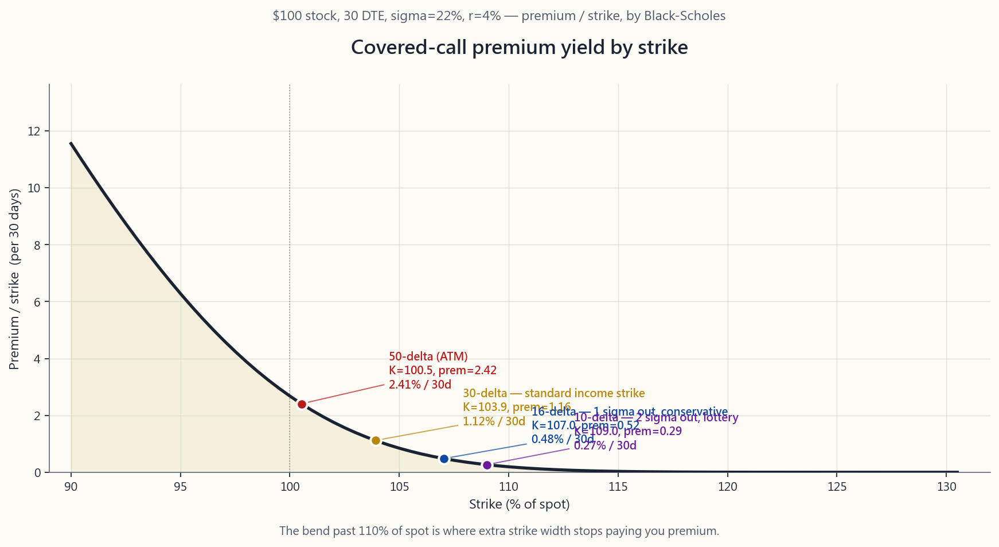
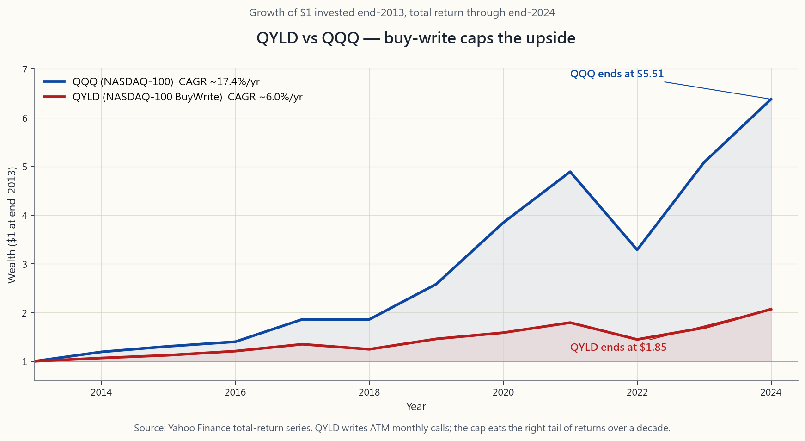

# 第二十七週：掩護性買權深度解析——履約價選擇、隱含波動率收割與滾輪策略

---

## 第一部分：閱讀章節

---

### 1. 為什麼這很重要

第26週將賣出買權重新定義為一種「有償限價賣單」。這種思維轉換是必要的，但光靠它還不夠。真正每個月執行掩護性買權的投資人很快就會發現：這個*策略*本身很簡單，但*參數選擇*才是一切。兩位投資人在同一個SPY部位上操作掩護性買權，可能因為履約價、到期日和進場時機的選擇不同，而在五年後產生截然不同的結果。本週要討論的，正是這些選擇。

**首先，履約價決定了整個損益結構。** 30-delta的買權所收到的權利金大約是10-delta買權的三倍，但被履約的機率也大約高出三倍。沒有哪一種選擇在單獨看來是「正確的」。正確的選擇取決於：你是否真心樂意以那個履約價賣出股份，以及額外的權利金是否足以補償你所接受的上漲空間上限。大多數散戶投資人只盯著權利金殖利率，而忽略了這筆交易的另一面——結果在最需要上漲收益的那幾個月，股份被系統性地以履約價賣出。

**其次，到期日的選擇並非中性的。** 時間價值衰減（Theta）——即外含價值隨時間流逝而消散的速度——是非線性的。一個30天到期的選擇權並不比60天到期的選擇權每天衰減快一倍；它大約每天快1.4倍。這種非線性正是為什麼距到期日30至45天的區間，是以收入為目標的賣方的最佳甜蜜點。比這更短，相對於gamma風險而言權利金太小；比這更長，持有部位的時間成本又會吃掉太多Theta。

**第三，隱含波動率排名（IV-Rank）告訴你何時該賣、何時該等。** 權利金不是免費的午餐。它是接受隱含波動率另一方所獲得的補償。當IV-Rank偏高時，你因賣出波動率而獲得豐厚的報酬。當IV-Rank偏低時——市場一片祥和、波動率指數在低十幾的水準——掩護性買權的權利金幾乎縮水到微不足道，而你所放棄的上漲空間卻是個更糟的交易。陳馬的第六個原則就在這裡體現：*尾巴搖擺整條狗*，而隱含波動率就是尾巴的價格。

**第四，稅務可能吞噬掉帳面上的殖利率。** 在應稅帳戶中執行掩護性買權策略，會把原本可能是長期資本利得（稅率約15-20%）的收益，轉變為以短期資本利得（稅率最高約37%）課稅的權利金收入。對大多數讀者來說，這個策略應該放在IRA或其他稅務優惠帳戶中執行。長期持有投資最大的隱藏成本是稅，而在錯誤的帳戶中執行高週轉率的收益疊加策略，是最沒有稅務效率的做法。

本課教你這個策略的紀律版本：如何用delta選擇履約價、如何用Theta選擇到期日、如何解讀IV-Rank、如何進行滾動，以及掩護性買權如何悄悄地融入槓鈴策略之中。

---

### 2. 你需要了解的事

#### 2.1 用Delta選擇履約價

靠*價格*挑選履約價是業餘做法。靠*delta*挑選是機構的標準。Delta有三種同時成立的實用解讀，這正是為什麼選擇權交易部門以它作為通用衡量尺：

1. **避險比率。** 0.30-delta的買權，每當標的股票移動1.00美元，選擇權就移動0.30美元（在短距離範圍內）。
2. **價內到期的近似機率。** 0.30-delta的買權大約有30%的機率到期時為價內。（這在技術上是*風險中立*機率，而非現實世界的機率，但對於短期限履約價來說，兩者差異不大。）
3. **以波動性為尺度的價外程度近似值。** 0.50 delta位於價平；0.16 delta大約位於一個標準差的價外；0.025 delta大約位於兩個標準差的價外。

最後這種解讀才是關鍵。**0.16 delta不是一個神奇的數字——它就是1個標準差。** 一個位於1σ價外的買權，在定義上大約有16%的機率到期時為價內。這就是為什麼「16-delta買權」是保守型收益賣方的預設選擇。

以下是對一檔股價100美元、σ=22%、30天到期日的股票，掩護性買權賣方的四個標準delta水準：

| Delta | 履約價（約） | 權利金（約） | 權利金 / 履約價 | 年化報酬 | 被履約機率 |
|------:|----------------:|-----------------:|------------------:|-----------:|----------------:|
| 0.50  | 100美元         | 2.55美元         | 2.55%             | 約31%      | 約50%           |
| 0.30  | 103-104美元     | 1.35美元         | 1.31%             | 約16%      | 約30%           |
| 0.16  | 107美元         | 0.55美元         | 0.51%             | 約6.2%     | 約16%           |
| 0.10  | 109-110美元     | 0.30美元         | 0.27%             | 約3.3%     | 約10%           |

這張表中的轉折點，就是本課的核心所在。從0.10 delta到0.16 delta，權利金幾乎翻倍，但被履約風險只增加了6個百分點。從0.30 delta到0.50 delta，權利金再次翻倍，但被履約風險卻多加了20個百分點。**30-delta買權是標準的收益型履約價**，因為它坐落在那條曲線最有利的轉折點上。16-delta買權則是不想輕易交出股份的賣方的保守預設選擇。

上圖呈現了σ=22%、30天到期日下，股價100美元股票的完整曲線。注意曲線在現貨價110%以上如何趨於平坦——一旦推過1σ價外，你要付出很大的努力，卻只能換到微薄的權利金。

#### 2.2 到期日——為何選擇30至45天

Theta是每個短期權利金策略的隱藏引擎。一個賣出選擇權的價值大致以到期時間的平方根速度衰減，這意味著一個30天的選擇權所包含的外含價值，大約是60天選擇權的70%。其含義是：透過賣出30天買權並每月滾動，即使每份合約的帳面權利金較小，你所收取的年化權利金也大約是賣出60天買權並每兩個月滾動的*1.4倍*。

但你不能無限制地將這個邏輯推到週選擇權，而不付出代價。週選擇權的gamma極高——股票的小幅波動在一天內就能讓選擇權的delta翻倍甚至三倍。這意味著一檔股票在週三短暫突破你的履約價，然後在週五跌回履約價以下，仍然可能讓你面臨被履約的情況。無論是BXM指數的方法論，還是我交流過的大多數收益型交易部門，所認可的機械性最佳區間，都是**距到期日30至45天**。

在這個區間內，有兩個合理的預設選擇：

- **月度週期（28-35天到期日）。** 在到期週五賣出下一個月到期的合約。每年操作十二次。與大多數個股的月度財報日曆一致。
- **45天到期日滾動。** 賣出45天到期的合約，在剩餘21天時滾動。每年約操作九次，每次操作的被履約風險略低，但年化權利金也略少。

兩種方式都合理。選一種並保持紀律。

#### 2.3 IV-Rank——何時賣、何時等

IV-Rank衡量當前隱含波動率在過去52週區間內所處的位置。IV-Rank為50，表示當前隱含波動率恰好在中位數；IV-Rank為90，表示當前隱含波動率接近高點；IV-Rank為10，表示當前隱含波動率接近低點。

這個規則比大多數人意識到的要簡單。**IV-Rank高於30時賣出權利金。低於30時等待。** 權利金是接受波動率另一方的補償。當波動率便宜時（IV-Rank偏低），你放棄上漲空間所換來的幾乎是微不足道的回報。當波動率高昂時（IV-Rank偏高），你為了同樣的上漲空間上限而獲得豐厚的補償。

一個實際的意涵：2017年平靜市場中SPY上的掩護性買權年化殖利率約為4%。同樣的策略在2022年底VIX衝上高20幾時，年化殖利率約達14%。相同的履約價、相同的delta，卻是截然不同的交易。那些不管IV-Rank每個月機械性地賣出選擇權的投資人，實際上所收穫的*優勢*，比他們以為的要差得多。

這就是「尾巴搖擺整條狗」的實際版本：尾巴（隱含波動率）才是整條狗。要盯著IV-Rank，而不是股票價格。忽略IV-Rank的掩護性買權賣方，就像忽略價格的價值投資人一樣——不管市場提供什麼條件，都在做同樣的交易。

#### 2.4 滾動——兩條規則

當股票接近你的履約價時，你有三個選擇：接受履約、買回買權，或是進行滾動。滾動是指買回當前的買權，同時賣出一個到期日更遠、履約價可能更高的新買權。做得好的話，滾動讓你能在不實現標的股份資本利得的情況下維持部位（這與稅務規劃相關——你希望保留股票部位的長期資本利得稅務待遇）。

**規則一：當買權進入價內而你不想被履約時，向上向外滾動。** 買回當前的價內履約價，賣出到期日更遠、履約價更高的新合約。這通常需要新的到期日至少比當前週期長一個週期（例如，將一個30天的價內合約滾動至到期日更遠、履約價高出一或兩檔的60天合約），才能以收取權利金（而非支付權利金）的方式完成滾動。如果無法以收取權利金的方式滾動，就接受履約——為守住掩護性買權而付出代價，幾乎永遠比在你原始履約價被履約更糟糕。

**規則二：當股票大幅下跌且買權深度價外時，向下向外滾動。** 以幾美分買回近乎毫無價值的當前合約，賣出到期日更遠、履約價更低的新合約。這鎖定了大部分原始權利金，並重設部位以收取新的權利金。這也是掩護性買權在盤整至下跌市場中奏效的操作——股票下漂時，你持續調低履約價。

第三個選項——僅向外滾動、維持相同履約價——幾乎從來不是正確的做法。如果買權接近價平，僅滾動同一履約價只是將履約的決定延後30天，通常只換來微薄的收取金額。更好的選擇是要麼接受履約（你的股份遲早會被召走），要麼向上向外滾動，為自己爭取真正的緩衝空間。

#### 2.5 稅務處理與帳戶選擇

在美國應稅帳戶中，賣出買權所收到的權利金被視為短期資本利得，除非合約持有超過一年——而在30至45天到期日的賣方操作中，這種情況幾乎不會發生。對於最高稅率級距的投資人，聯邦稅率為37%加上州稅，相較之下，若單純持有標的股份，其長期資本利得稅率為20%（加上3.8%的淨投資所得稅）。這意味著帳面上的權利金大約有一半進了稅務機關的口袋。

還有**被履約機制**需要注意。如果你的股份被召走，股票部位的資本利得，是按照*那些股份*的持有期間來認定，而非選擇權的持有期間。如果那些股份已具備長期持有期間，你的股票利得仍可享有長期資本利得稅率待遇。但權利金本身，仍屬短期資本利得。

還有一個陷阱：若你針對持有未滿一年的股票賣出掩護性買權，且履約價距離現價過近，根據美國國稅局的「合格掩護性買權」規則，*可能暫停持有期間的計算*。機械式的解決方法是：對於持有未滿一年的股份，只賣出價外買權。

乾淨的解決方案就是稅務帳戶定錨原則：**在IRA或401(k)中執行掩護性買權策略，而非在應稅帳戶中。** 所有權利金均可享有稅務遞延（或在Roth帳戶中完全免稅），被履約不產生應稅事件，而所有策略彈性——滾動、調整履約價、接受履約——都可在沒有稅務摩擦的情況下自由運用。對於應稅帳戶，計算結果更傾向於單純持有股份，並在多年後收取長期資本利得。

#### 2.6 買入-賣出型指數股票型基金 vs. 自行操作——為何QYLD表現遜於QQQ

美國規模最大的幾檔掩護性買權指數股票型基金，是QYLD（Global X NASDAQ 100 BuyWrite，資產管理規模約80億美元）和JEPI（JPMorgan股票溢價收益基金，資產管理規模約330億美元）。它們將策略包裝成「高殖利率加下跌緩衝」。殖利率是真實的——QYLD每年分配約11-12%。問題是指數股票型基金的機制悄悄地破壞了上漲空間。

QYLD每個月針對整個NASDAQ 100投資組合賣出**價平買權**。價平意味著delta約0.50——策略在任何給定月份幾乎鎖死了全部的上漲空間。在2014至2024年間，QYLD的總報酬約為每年6%，而純QQQ則約為每年17%。QYLD的投資人拿到了他們的帳面殖利率，但隨著數學複利的累積，基金淨值在十年間緩慢下滑。QYLD在2014年的淨值約為25美元；到2026年初約為17美元。

JEPI在結構上較不激進——它採用連結式票券，近似於賣出標普500指數5-10%價外的買權——因此上漲空間的上限較為溫和。其十一年的走勢大約是每年9-10%，相較之下SPY約為每年13%，但回撤幅度明顯較低。JEPI對於想要平穩投資體驗的退休投資人來說是個合理的產品；QYLD在我看來是一個穿著高殖利率外衣的結構性劣質產品。

自行操作這個策略的意義，正在於**你掌控履約價和到期日。** 買入-賣出型指數股票型基金必須使用固定的機械性規則——因為它們在管理別人數十億美元的資金，不可能在IV-Rank低的月份暫停賣出。你可以。這種可選擇性，正是DIY掩護性買權長期勝過買入-賣出型指數股票型基金的全部原因。

#### 2.7 滾輪策略——第30週預告

以下是把第26、27、28週串連起來的策略，稱為「滾輪策略」，第30週將為它專門開設一整節課。

1. 確認一檔你樂意以折扣價買入的股票。
2. 在你的目標買入價賣出現金擔保賣權（第28週）。
3. **若被履約**（你買入了股份），現在每個月針對這些股份賣出掩護性買權，直到股份被召走為止。
4. **若股份被召走**（股份以高於履約價的價格賣出），回到第2步。

滾輪策略是價值投資人一直手動在做的事情的機構版本：低於內含價值時買入，高於時賣出。選擇權只是讓你在兩端等待時都能獲得報酬。對於一檔你真心希望以90美元買入、以115美元賣出的股票，滾輪策略純粹從權利金就能產生每年12-18%的年化殖利率，再加上期間股價波動所帶來的股票損益。這正是第25至30週悄悄引導你走向的目的地。

滾輪策略的掩護性買權部分，正是本課所教授的策略。在這裡掌握它，在第28週掌握現金擔保賣權，第30週就只是組裝說明書了。

#### 2.8 完整操作案例

你持有100股SPY，成本為480美元，當前價格為510美元。IV-Rank為45，尚可接受——不算豐厚，也不算便宜。

- **履約價選擇。** SPY 30-delta買權，30天到期日，為522美元履約價。權利金約5.80美元。殖利率 = 5.80 / 522 = 30天內1.11% = 年化約13.5%。
- **你已同意的條件。** 如果SPY在30天後收盤高於522美元，你的股份將以522美元被召走。加上5.80美元的權利金，有效賣出價為527.80美元。以480美元的成本計算，這是+9.96%的報酬——你樂見的結果。
- **如果SPY維持在522美元以下。** 你保留580美元的權利金，並針對同一批股份再次賣出新的30天買權。每年十二次 × 1.11% = 純粹來自權利金的年化殖利率約13%，疊加在SPY正常的股價增值和股利之上。
- **如果SPY在兩週內強力反彈至545美元。** 你的買權現在深度價內，還剩約14天。你向上向外滾動至下個月的540美元履約價，換取小額的收取金額。你放棄了522美元至540美元之間的漲幅（約3.4%的上漲空間），但維持了部位並避免了被履約。
- **如果SPY跌至470美元。** 你的買權趨近於零。你以0.20美元買回，實現5.60美元的權利金，並針對你的股份，以485美元履約價賣出下個月的新買權。你現在正在對著更低的股票收取新的權利金，這正是這個策略所宣傳的緩衝效果。

這就是整個策略的全貌。本課結尾的互動工具讓你自由調整所有這些參數。

---

### 3. 常見迷思

1. **「30-delta是所有人的正確履約價。」** 對於沒有強烈方向性觀點、以收益為目標的賣方來說，它是正確的。如果你不願意放棄股份，就寫16-delta。如果你買入這檔股票本來就是為了賣出買權，而且樂意以履約價出售，就寫50-delta。履約價的選擇沒有放諸四海皆準的答案。
2. **「週選擇權的年化殖利率最高，所以我應該賣週選擇權。」** 週選擇權的每日Theta確實最高，但gamma也最高。週選擇權在現實中實現的被履約風險和滑價，遠比月選擇權嚴重。大多數顯示「週選擇權最優」的散戶回測，都忽略了執行成本和gamma爆倉的情況。
3. **「掩護性買權提供下跌保護。」** 並不是。你所收到的權利金大約能緩衝1-2%的下跌。在20%的回撤中，你的股份淨損失約18%。買入賣權才能保護你。賣出買權是收入，不是保險。請停止混淆這兩者。
4. **「QYLD 12%的殖利率是真實的報酬。」** 那是真實的現金分配，但不是真實的總報酬。QYLD的總報酬約為每年6%；分配的部分資金來自淨值侵蝕。請看總報酬圖表，而非殖利率標題。
5. **「我應該永遠滾動我的買權，而不接受履約。」** 並非如此。如果你無法以收取權利金的方式滾動，接受履約嚴格來說是更好的選擇，而不是付費守住一個部位。有時候，讓股份被召走才是正確答案。
6. **「掩護性買權在任何市場都有效。」** 在強勢反彈中表現大幅落後（上漲空間上限的影響遠超所收取的權利金），在盤整和溫和下跌市場中持平或略勝。在嚴峻的空頭市場中，它*無法*拯救你。
7. **「權利金是無風險收入。」** 它是對尾部風險和上漲空間上限的補償。好月份所放棄的上漲空間，提供了平淡月份所保留的權利金。天下沒有免費的午餐。
8. **「既然我每個月都在賣，我可以忽略IV-Rank。」** 如果你在乎預期報酬，就不能這樣做。歷史上，跳過IV-Rank最低五分之一的月份，大約可將策略的夏普比率提升約25%。
9. **「滾輪策略和掩護性買權是不同的策略。」** 它是同一個策略，只是將前端的買入決策（現金擔保賣權）拼接上去。掌握其中一個，你就已經幾乎掌握了另一個。

---

### 4. 問答章節

**問：如何在券商的畫面上找到delta？**
答：大多數散戶平台（Fidelity、Schwab、IBKR、ThinkOrSwim）在你將選擇權鏈視圖切換至「Greeks」或「Analytics」後，會在欄位中顯示delta。如果看不到，代表選擇權鏈目前只顯示價格欄位——請更改視圖。Robinhood和Webull則在選擇權詳細頁面上揭露delta。

**問：如果我持有的股票在選擇權有效期內發放股利，該怎麼辦？**
答：選擇權市場已將預期股利計入定價，因此你在選擇權鏈上看到的履約價殖利率，是*扣除*預期除息日股價下跌後的結果。如果股利意外調高，你的買權可能在除息日前一天被提前履約——這是美式買權唯一常見的提前履約情境。請留意這一點。

**問：我可以針對指數股票型基金賣出掩護性買權嗎？**
答：可以，對大多數散戶收益型投資人來說，正確的標的是SPY、QQQ和IWM。個股掩護性買權增加了非系統性風險，對大多數讀者來說，額外的權利金並不足以彌補這一點。

**問：我需要多少資金才能開始？**
答：一份合約 = 100股。以SPY 510美元計算，需要51,000美元的股票。以QQQ 440美元計算，需要44,000美元。IWM是三者中最便宜的，每份合約約需22,000美元。如果你的帳戶規模小於此，最接近的替代方案是XSP（迷你SPX）選擇權，規模是SPX的1/10。

**問：如果我沒有100股，還能賣出買權嗎？**
答：作為掩護性買權不行。沒有股份的情況下賣出買權是*裸賣*買權，具有理論上無限的風險，並需要保證金。大多數券商不允許散戶帳戶賣出裸買權。請先買入100股，或使用垂直價差（第29週）來建立一個定義風險的等效部位。

**問：我應該提前平倉獲利嗎？**
答：業界的經驗法則是：在最大獲利的50%時平倉。如果你以2.00美元賣出買權，而你能以1.00美元買回，你已收取了一半的權利金，而所消耗的時間卻遠不到一半（Theta在接近到期日時加速）。提前平倉讓股份能夠更早再次賣出新的買權，並消除了持有空頭選擇權至到期週所帶來的gamma風險。

**問：這個策略適用於便宜的股票嗎？**
答：機械上可行，但通常權利金太小，不值得付出這番心力。一檔20美元的股票賣出30-delta月度買權，可能只有0.20至0.30美元的權利金。扣除手續費和買賣價差後，實際實現的殖利率幾乎可以忽略不計。請堅持選擇每股80至100美元以上的標的。

**問：這如何融入槓鈴策略？**
答：掩護性買權存在於槓鈴策略的*被動股票*端，而非投機端。它將長期股票曝險轉化為「略減股票曝險換取收入」——它不取代投機性選擇權的配置。如果你針對SPY持股賣出掩護性買權，那個SPY部位仍在做它原本在做的事，只是多了一層收益疊加。

**問：為什麼不直接買QYLD或JEPI？**
答：如果你真的沒有時間管理策略，JEPI是個合理的選擇。QYLD不是，因為它的價平履約價規則鎖死了太多的上漲空間。DIY勝過兩者，因為你可以根據IV-Rank靈活調整履約價和到期日，而這兩檔指數股票型基金都無法做到。

**問：最壞的情況是什麼？**
答：V型反轉——股票先崩跌30%再反彈50%。你的掩護性買權在下跌途中沒有保護你（權利金只能覆蓋30%跌幅中的約2%），而你在反彈途中賣出的新低履約價買權，將你的反彈收益上限限制在10-15%。你鎖定了虧損，同時拱手讓出了反彈收益。這正是2020至2021年QYLD投資人所遭遇的情況，也是第2.3節IV-Rank篩選規則最有力的論據。

**問：本課對第26週的知識假設了多少？**
答：假設你接受「賣出買權是有償限價賣單」這個框架。如果這個框架還沒有內化，請重讀第26週。本課是建立在那個思維模型之上的參數調整層。
