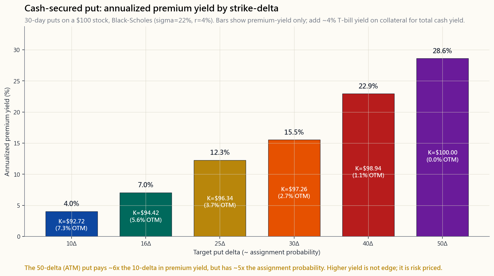
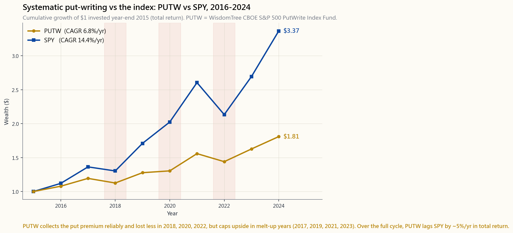

# 第二十八週：現金擔保賣權——收錢等低接

---

## 第一部分：閱讀章節

---

### 1. 為什麼這很重要

現金擔保賣權（CSP）是散戶選擇權交易中最誠實的一種操作。你預留等同於100股完整買入價格的現金，告訴市場「如果這檔股票在未來30天內跌到X元，我願意買進」，市場則付你幾百美元，讓那個出價掛在螢幕上等待成交。如果股票跌到你設定的價位，你就照約定買進——正好是你想要的價格，再扣掉權利金。如果沒跌到，你保留現金，再開下一張。沒有槓桿、沒有裸部位、沒有複雜理論。這就是一張附帶租金的限價買單。

大多數散戶接觸CSP，是透過那些把它包裝成「閒置現金年化報酬30%！」的網紅。這個框架是錯的。正確的框架——也就是本課程陳馬所採用的——是**CSP是你對想要持有的股票出價的方式。**權利金不是你的優勢；你的優勢是以低於原本想買進價格的成本取得持股。如果你發現自己對根本不想持有的股票賣出賣權，你就不再是在操作CSP了——你是在開一家多了幾道程序的賭場，而莊家終究會追上來。

這堂課重要的四個原因：

**1. CSP是表達耐心最乾淨的方式。** 市場獎勵能夠等待的投資人。多數散戶做不到——他們在CNBC吵鬧的時候買進，螢幕一片紅就僵住不動。CSP能鎖定你的紀律。履約價是你的耐心價位；30天的到期日是你的時間框架；權利金是你不追高的獎賞。

**2. 它讓閒置現金產生收益，且不承擔你原本就沒計劃承擔的股票風險。** 如果你本來就打算準備兩萬美元，等SPY回檔5%再買，那你現在可以在等待期間同時收取每月200至400美元的權利金。那筆現金本身仍停放在國庫券賺約4%（2026年4月）。賣權的權利金是額外疊加的一層，而非替代品。

**3. 你實際上會希望大多數CSP被執行。** 這是區分認真CSP賣方與追逐收益者的唯一洞見。CSP在結構上就是「以履約價限價買進，加上折扣回饋」。如果被執行讓你感到恐慌，代表你在錯誤的股票上賣出了錯誤的賣權。槓鈴策略將CSP明確放在安全端——這是你累積投資組合中穩健指數持股與優質持倉的方式。你的目標不是「避免」被執行，而是「定好價格」等待執行。

**4. 它完美契合選擇權稅務架構。** 與掩護性買權相同，CSP的權利金收入不論持有合約多久，均屬於短期資本利得。這使得在應稅券商帳戶中大規模操作CSP成為一場稅務災難，卻是羅斯IRA或傳統IRA內的絕佳工具——在稅庇護帳戶中，短期性質的問題不復存在。第27週的規則在此同樣適用：選擇權收入應放在稅庇護帳戶中操作；你想要持有的股票則放在任何地方都行。

這是一堂實作課。學完之後，你應該能夠看著560美元的SPY，判斷自己願意在530美元持有，找到履約價接近530美元的30 Delta賣權，並在十秒內知道這筆權利金是否值得資金的佔用。

---

### 2. 你需要掌握的內容

#### 2.1 心理模型：附帶折扣的限價買單

停止把它想成「賣出賣權」。開始把它想成**「掛在委託簿上的限價買單，並且有人付錢讓它留著」。**

一張在SPY的530美元掛上的普通限價買單不會為你帶來任何東西。它就那樣等著。如果SPY交易到530美元，你的單成交；否則當天結束時取消，明天再掛一次。你不需要付出什麼，也得不到什麼。

一張30天期、履約價530美元的現金擔保賣權，代表的是同樣的買進意圖，但有三個改變：

1. 委託單存活30天，而不是一天。
2. 你預先承諾那筆現金——在賣權到期或你買回之前，那筆錢不能挪作他用。
3. 對方因為你承擔了30天的承諾而付給你一筆權利金。

就這樣。權利金補償你的是普通限價單無法給市場的兩件事：**時間承諾**（你無法取消委託，除非買回合約），以及**價格下方的硬性支撐**（即使股票跌穿履約價很多，你仍必須以履約價承接股票）。

第一個承諾是真實的，但以金額而言影響較小。第二個才是關鍵：你是在作空波動性。如果SPY在一場崩盤中跌到400美元，你仍然必須以530美元買進——市場知道這一點，這正是為什麼波動率指數（VIX）偏高的環境會支付更多權利金。波動率的尾巴直接搖動了股票端的狗：你從CSP取得的價格，並非真正取決於你的股票看法，而是取決於**其他人**對未來30天有多恐慌。



上圖顯示30天期類SPY賣權的年化權利金殖利率與履約Delta之間的關係，使用波動率22%、利率4%的Black-Scholes模型計算。隨著履約價往價平靠近，長條圖急遽攀升：50 Delta（價平）賣權的年化殖利率大約是10 Delta賣權的6倍。但那張50 Delta賣權約有50%的機率在到期時為價內。殖利率不是免費的；它是被執行的機率，以收益的形式包裝呈現。

#### 2.2 以Delta選擇履約價

在這個脈絡下，Delta近似代表選擇權在到期時結束於價內的機率。30 Delta賣權在到期時被執行的機率約為30%，在一般波動率股票的30天合約中，大致位於約5%的價外位置。

以下是三組實用預設值，各自對應不同的操作性格：

```
30 Delta CSP（標準型）：
  - 30天期、波動率22%情況下，約5至7%價外
  - 約30%的執行機率
  - 三組預設中權利金最高
  - 適合：確實想要累積該股票的投資人

16 Delta CSP（一個標準差）：
  - 約9至11%價外，約16%執行機率
  - 權利金約為30 Delta的一半
  - 多數初學者的最佳切入點——出價距市價夠遠，
    被執行時真的感覺是撿到便宜

10 Delta CSP（保守型）：
  - 約13至15%價外，約10%執行機率
  - 權利金約為30 Delta的三分之一
  - 適合：將賣權視為現金純粹租金的投資人，
    只在出現顯著回撤時才歡迎被執行
```

初學者幾乎總是從30 Delta開始，因為權利金最多，而且很難抵擋最大化收益的誘惑。這是散戶CSP操作中最常見的單一錯誤。對你根本不想持有的股票賣出30 Delta賣權，收到的不是收益——那是一場加權銅板遊戲：正面賺200美元，反面賠5,000美元。從16 Delta開始，只有當你對某檔股票和某個價位真的**迫不及待想要成交**時，才慢慢靠近價平。

#### 2.3 期限：為什麼選擇30至45天

Theta（時間價值損耗）是非線性的。在選擇權到期前最後30天，時間損耗會急遽加速。從60天到30天，賣權損耗約30%的時間價值；從30天到到期，則損耗剩餘的70%。身為賣方，你想要駐紮在損耗曲線最陡峭的那一段。

```
期限          權利金      每日Theta     年化資金殖利率
=========    =======    ===========   ========================
7天           最低        最高          極高（但不穩定）
14天          低          高            高
30天          中          中高          最佳甜蜜點
45天          較高        中            最佳甜蜜點
60天          較高        較低          普通
90天          最高        最低          偏差
```

7天週選擇權在試算表上看起來很吸引人——你每個月滾動四次，Theta猛烈累積——但實現的損益相當難看，因為跳空風險高度集中。在那一週內出現的任何財報意外或聯準會意外，都可能讓你一天就吃掉一整個月的權利金。對散戶來說，損耗速度與跳空風險的最佳平衡點就在30至45天的區間，而這恰好也符合自然的月選擇權到期週期。

#### 2.4 資金成本——被忽視的另一半

每一張CSP都會佔用等同於（履約價 × 100）的現金作為擔保。這筆現金**不是**死水。在任何現代券商（截至2026年4月的盈透證券、富達、嘉信理財），放空賣權的現金擔保品可以賺取以下其中之一：

- 貨幣市場帳戶的國庫券殖利率（約4.0%，2026年4月SOFR）
- 保證金帳戶的利息收入（視情況而定）
- 券商允許作為擔保品的政府貨幣市場基金部位

因此，CSP的**總**年化資金殖利率為：

```
總殖利率 = 國庫券殖利率（現金擔保）+ 賣權權利金殖利率（選擇權）
         ≈ 4.0%/年 + （權利金 ÷ 履約價）×（365 ÷ 剩餘天數）
```

一張30天、16 Delta的SPY賣權，若帶來0.4%的權利金殖利率，在零執行的情況下，年化報酬約為4.0% + 0.4% × 12 = **8.8%**。這才是你應該拿來比較的數字。它不是4.8%（只計算權利金、忽略現金利息），也不是什麼30%以上（年化權利金但未扣除稅負與執行成本）。引用殖利率時，**務必納入國庫券那一段。**

這在當前的利率環境下至關重要：1990年代國庫券利率為0%時，CSP殖利率看起來相對可觀；2026年國庫券利率來到4%，賣出賣權帶來的**增量**殖利率才是唯一值得衡量的數字，而且遠比那些不了解情況的YouTuber所聲稱的要小得多。

#### 2.5 展期與防禦操作——遵循規則，而非憑感覺

當標的跌至（或低於）你的履約價，且合約還剩相當多時間，賣權就進入「受威脅」狀態。你在任何時刻都有四個選擇：

1. **什麼都不做——接受被執行。** 如果你確實想要以有效成本（履約價 - 權利金）持有該股票，這才是正確做法。對指數型CSP而言，這是**預設答案**。

2. **獲利平倉。** 一旦在剩餘大量時間的情況下（通常在最後7天之前），賣權已損耗50至70%的權利金，就平倉出場。你已捕捉到大部分的Theta；剩餘的權利金不值得承擔Gamma風險。

3. **向下展期並延長期限。** 如果被執行的可能性很高，但你仍不想以這個履約價承接股票，那就買回受威脅的賣權，再以**更低的履約價、更遠的到期日**賣出新的賣權，取得小額淨收入。你把出價往下移，並爭取了更多時間。最多執行一至兩次——無休止的展期會把CSP變成遞延損失的金字塔遊戲。

4. **認賠平倉。** 如果你對該股票的看法已改變，不再想被執行，就以市場給出的任何損失平倉。現金擔保賣權的最大損失**有限**（最差情況為履約價 × 100），但有限不等於小。

```
防禦操作手冊（機械化版本）：

  觸發條件                              對應動作
  =================================    ===============================
  賣權達最大獲利50%，剩餘天數>7天        買回平倉，重新部署資金
  賣權達最大獲利80%                      一律平倉
  標的股票跌至履約價，剩餘天數≥14天       持有；讓時間說話
  標的跌破履約價5%，剩餘天數7天          決定：接受執行或展期
  標的跌破履約價10%，任何剩餘天數         接受執行，除非看法已改變
  合約存續期間內有財報公布               一開始就避免這種情況
```

注意：這裡沒有「加碼」或「對虧損中的賣權攤平」的規則。當第一張賣權已在水下時，在同一履約價再賣出另一張賣權，就是加倍承受市場對你看法表示異議的曝險。市場在你的履約價以下維持的時間，可能比你願意承受損失的時間更長，尤其是在你持續加碼的情況下——非理性延續的時間往往超過資金的承受能力，這比試算表預估的更常發生。

#### 2.6 被執行的心理——你是在買進，不是在虧損

對大多數散戶CSP操作者而言，最恐慌的時刻是被執行的隔天早上，帳戶裡突然出現100股股票，而現在的市場價格已高於買入成本。在這裡，心理框架至關重要。

被執行**不是**虧損事件。它是你30天前掛出的買單，正如計劃般確實成交。

如果你的16 Delta SPY $530賣權因為SPY在528美元收盤而被執行，你以530美元買進了100股SPY，為這件事多收了300美元的權利金，有效成本是527美元——**優於**你開倉當天的市場價格，也**優於**被執行當天的市場價格。你完整執行了你的耐心計劃。唯一的虧損情境是你在隔天520美元時恐慌性賣出那些股票。股票本身不是虧損；恐慌才是。

被執行後正確的下一步，幾乎總是**對承接的股票開始賣出掩護性買權**——也就是第27週的操作手冊。「輪轉操作」（現金擔保賣權→被執行→掩護性買權→被認購→重新賣出現金擔保賣權）是自然的循環。你低接了回檔，現在在股票反彈途中收取租金。

唯一真正讓被執行成為麻煩的，是那些你本來就不該賣出CSP的股票：迷因股、單一生技股、槓桿型指數股票型基金，以及任何你在那個履約價都不願意直接買進的標的。

#### 2.7 PUTW：以指數股票型基金形式呈現的CSP策略

WisdomTree PUTW（CBOE S&P 500賣出買權指數基金）是本課程的機構版本。它每月機械性地賣出一個月期、約2%價外的SPX賣權，且全額以現金擔保。它的存在解答了一個問題：「系統化賣出賣權能否勝過單純持有指數？」



圖表顯示2016年1月至2024年12月，各投資1美元於PUTW與SPY的累積成長（2026年4月版本數據）：

- PUTW：年化約7%，2020年3月最大回撤約-22%
- SPY：年化約12%，2020年3月最大回撤約-34%

PUTW持續穩定收取賣權權利金，在2018、2020、2022年的回撤均小於SPY。但在2017、2019、2021、2023年的急漲行情中，上檔空間受到結構性限制：賣權權利金每月就那幾個百分點，但SPY可以在一個月內暴漲超過5%，而PUTW只能收取賣權權利金，無緣參與標的本身的漲幅。縱觀完整週期，PUTW在總報酬方面落後SPY，在牛市年份落後更明顯，只有在盤整或溫和下跌的年份才能勝出。

結論：系統化賣出賣權策略是真實存在、可被捍衛的，但在正常擴張期中劣於單純的指數持有。一位深思熟慮的投資人仍然操作CSP，**不是**為了在總報酬上打敗SPY，而是：（a）以現金部位在你想要的價格承接特定標的；（b）在IRA內產生收益，因為等效股票交易策略的稅務損耗會更大；以及（c）降低投資組合波動性，同時接受一定程度的報酬拖累。

如果你有「PUTW落後SPY → CSP沒有用」的想法，你對這個交易的理解是錯誤的。PUTW是機械式、無差別的賣方。針對你想持有的股票、在你想要的價格精準操作的CSP，是完全不同性質的工具。

#### 2.8 稅務處理——與第27週相同的規則

空頭賣權的權利金，無論合約開倉多久，在選擇權到期失效或買回平倉時，均屬於短期資本利得。沒有長期持有期間的例外。

```
結果                              稅務處理
============================    ==============================
賣權到期失效                    全額收取的權利金計入短期資本利得
低於成本買回平倉（獲利）          （收取的權利金 - 支付的金額）計入短期資本利得
高於成本買回平倉（虧損）          短期資本損失（可抵消短期/長期資本利得）
賣權被執行→承接股票              權利金降低所承接股票的成本基礎；
                                股票的持有期間自執行日當天起算
```

在頂級稅率35至37%的應稅帳戶中，一個年化5%權利金的CSP，稅後淨報酬約為3.2%。在羅斯IRA中，則是完整的5%。對高所得者而言，整個作空波動性的工具組，只有在稅庇護帳戶內才有意義。在一般券商帳戶中，你是在為美國國稅局的利益操作選擇權策略。

以下互動工具可即時計算任意標的、Delta與剩餘天數的組合。

[INTERACTIVE: interactive/week28_put_writer.html]

---

### 3. 常見迷思

1. **「CSP是免費的錢／收益耕作。」** 並非如此。權利金是市場為讓你承擔特定回撤風險所給出的定價。把30天的權利金年化並喊出「30%年化殖利率！」，掩蓋了一個事實：實現殖利率包含了被執行的結果，而那些結果是負的。

2. **「絕對不能讓賣權被執行。」** 完全搞反了。對你想要持有的股票而言，被執行正是**預期的**結果。在每次回檔時積極展期以規避執行，會把一個「低接回檔」的策略變成永無止盡的收租策略，最終遇上一次20%跌幅就再也展不出去。

3. **「30 Delta是標準，所以我應該賣30 Delta。」** 30 Delta之所以是標準，有其原因——權利金有實質意義——但這只適用於你確實想要持有的標的。對於你只是半調子有點興趣的單一個股，16 Delta才更誠實。

4. **「賣週選擇權更划算，因為可以操作4倍次數。」** 每日Theta在最後7天確實最高，但Gamma同樣如此。週賣權被單日跳空擊穿的頻率，遠高於月賣權，這正是為什麼包含PUTW在內的系統化賣權操作者，幾乎都賣30天期而非7天期。

5. **「PUTW落後SPY，所以CSP沒用。」** PUTW是機械式、無差別地賣出價外SPX賣權。有針對性的CSP策略是主動的、機會性的，且以累積持股為目的——而非最大化總報酬。它們是解決不同問題的不同產品。

6. **「賣權的權利金就是我的獲利。」** 權利金是你的毛收益。你的**利潤**是權利金扣除：（a）擔保品資金的機會成本，（b）履約價高於市場價時被執行所實現的損失，以及（c）稅負。大多數散戶CSP操作者只追蹤權利金，兩年後看到帳戶餘額時一臉困惑。

7. **「現金擔保代表沒有風險。」** 現金擔保意味著每張合約的損失不會超過（履約價 × 100）。那是**有限的**風險，不是零風險。一張SPY $530的賣權，若SPY歸零，最大損失為5.3萬美元。有限不等於小。

8. **「只要一直展期就能解決問題。」** 展期在淺幅回檔時可以撐一至兩個週期。但在真正的修正行情中（2008、2020、2022），履約價被快速跌穿，每次展期都是往下移，卻始終追不回來，最後你承受的是原始損失，加上為遞延損失所付出的數個月額外Theta。

9. **「賣出賣權等同於在履約價買入股票。」** 幾乎是，但不完全相同。賣出賣權的人無法受益於超過履約價的上漲。股票買家可以。這正是為什麼CSP在急漲市場中落後多頭持股，落後幅度恰好等於錯失的上漲空間。

10. **「波動率指數急跌對我有利。」** 是的，前提是你已經持有空頭賣權部位。但由此推論「只要VIX偏高就應該賣賣權」是危險的——VIX偏高正是因為實現波動率**同樣**偏高，而你的賣權更可能被執行。正確的框架是「權利金的定價是公平的；只賣你確實想要持有的標的。」

---

### 4. Q&A

**Q1. 開始操作CSP需要多少資金？**
至少要足以支應你想持有的一個標的100股。SPY在560美元時，每張合約需要56,000美元；KO在70美元時，需要7,000美元。初學者應從單一標的、單張合約開始，且帳戶規模要足夠大，讓一次執行不至於主導整個投資組合——粗略原則是，每張合約所需資金不超過投資組合現金部位的10至15%。

**Q2. CSP和裸賣權有什麼不同？**
在選擇權部位本身，機制完全相同。差別在擔保品。現金擔保賣權以100%的履約曝險對應現金；裸賣權使用保證金——你可能只需繳交名目金額的20至25%，槓桿達4至5倍。裸賣權放大了收益和執行風險，不適合初學者，也不在本課程的討論範圍內。

**Q3. 哪些標的最適合操作CSP？**
流動性強的指數型指數股票型基金（SPY、QQQ、IWM）、你真的願意持有的大型優質個股（AAPL、MSFT、KO、JPM、BRK.B），理想上還具備週期加月期的選擇權鏈。應避免：單一生技股、近期首次公開發行、股價低於20美元的股票、槓桿/反向指數股票型基金，以及合約存續期間內有二元觸媒事件的任何標的。

**Q4. 應該避開財報期嗎？**
對單一個股而言通常是的。財報使隱含波動率膨脹，讓你能收到更多權利金，但同時也膨脹了跳空風險。跨越財報賣出賣權，本質上是對財報反應方向押注——如果你本來就想做這個押注，那是合理的；如果你以為自己是在收「租金」，那就危險了。指數型CSP沒有這個問題（沒有單一財報）。

**Q5. 如果股票隔夜跳空跌破我的履約價怎麼辦？**
你在履約價承接股票。有效成本仍然是（履約價 - 權利金），而你以30天前承諾的價格買進了100股。是的，市場現在低於那個價位，讓人不舒服，但這與你原始計劃並無不同。你當初要不就是想在那個價位持有這檔股票，要不就不是。

**Q6. 我可以在保證金帳戶中賣出CSP嗎？**
可以，而且大多數現代券商會把現金擔保品自動轉到貨幣市場帳戶，在資金被佔用期間賺取國庫券殖利率。你也可以在保證金帳戶中賣出**裸賣權**，但那是不同的操作——見Q2。

**Q7. CSP與虧損出售稅規則如何互動？**
如果你對股票認賠出場，並在30天內以接近原始買入價的履約價賣出同一檔股票的賣權，美國國稅局可能將其認定為洗售並不允許認列損失。確切界線取決於具體事實與情況。如果你同時在同一標的上操作CSP並進行稅損收割，請諮詢稅務專業人士。

**Q8. 有沒有CSP勝過直接買股的情境？**
有——盤整或溫和下跌的市場。如果SPY當月收在與月初完全相同的位置，多頭股票持有者報酬為0，CSP賣方則賺到全部權利金。如果SPY下跌1%，多頭股票虧損1%，CSP賣方則大約持平（取決於權利金金額）。在強勁上漲（超過履約價加權利金）的市場中，多頭股票勝出；在急劇下跌的市場中，兩者都虧損，CSP因多出一個權利金的緩衝而損失略小。

**Q9. 為什麼30天隱含波動率有關係？我只在乎權利金。**
權利金**就是**隱含波動率——在Black-Scholes框架下，其他條件固定時，權利金與波動率是一對一的映射。當你比較不同標的的CSP，你實際上是在選擇你要作空哪個波動率。較高的隱含波動率 = 較高的權利金 = 較高的實現波動率 = 較高的執行機率。這裡不存在免費的收益套利空間。

**Q10. 合理的起始節奏是什麼？**
每個你想要累積的標的，每月一張合約，選擇30至45天到期、16 Delta的履約價。6至12個月後重新評估。重點**不是**最大化交易次數；而是在目標價位系統性地累積目標持股，同時收取增量收益。

**Q11. 我需要主動管理這些合約，還是可以讓它們自然到期？**
如果你的看法沒有改變，且臨近到期時賣權已深度價外，可以讓它自然到期。一個還不錯的原則是：如果在剩餘7天時，賣權已損耗80%以上的初始權利金，就用小額成本買回平倉——你釋放了資金，也消除了最後一週的Gamma風險。

**Q12. 這如何融入槓鈴策略？**
在指數股票型基金和優質複利型個股上賣出CSP，毫無疑問屬於**安全端**的活動。它以你本來就想要的方式建立持倉，讓你在等待期間獲得報酬，且下檔風險有限。對波動性高、結果具二元性的單一個股賣出CSP，則屬於**投機端**的活動。常見的錯誤是混淆兩者——以安全端的框架為自己在迷因股上賣出30 Delta賣權的行為辯護。在你的思維中和帳戶中，把它們分開。

---

## 第二部分：YouTube腳本

---

**影片標題：** 現金擔保賣權——收錢等低接（第28週）
**目標片長：** 約18分鐘
**主持人：** 陳馬、小魚

---

**【片頭——0:00】**

**小魚：** 歡迎回來。上週我們介紹了對已持有股票賣出買權——也就是輪轉操作的收益端。這週我們要講**另一邊**：現金擔保賣權。這個策略被大多數散戶用錯了方向。

**陳馬：** 對，YouTube版本的CSP，通常是一個站在藍寶堅尼前面的傢伙，跟你說「讓閒置現金年化30%！」我想在一開始的三十秒非常直接地說明這件事：那個框架是錯的。CSP不是收益耕作的把戲；它是一張附帶租金的限價買單。如果你今天只記得一句話，就記這句。

**小魚：** 我們先從心理模型講起。

---

**【第一段——附帶折扣的限價買單——1:00】**

**陳馬：** 假設SPY今天在560美元，我跟你說「我很想持有SPY，但只想在530美元買——大概是等一個5%的回檔」。如果你在帳戶裡掛一張530美元的限價買單，會發生兩件事：第一，那張單就在那裡等，直到成交或當天收盤；第二，你等待期間什麼都沒有賺到。

**小魚：** 而且你可能明天就改變主意把單撤掉了。

**陳馬：** 沒錯。現在把那張限價買單換成一張30天期、履約價530美元的現金擔保賣權。三件事改變了：委託單存活30天，不是一天；你預先承諾那筆現金，所以在買回合約之前你無法改變主意；還有——大家都聚焦在這裡——市場付給你幾百美元，換取你承擔這30天的承諾。就這樣，整個交易就這麼簡單。一個耐心的價位，加上租金。

**小魚：** 那筆租金是在補償你什麼？

**陳馬：** 波動性。如果SPY明天直接跌到400美元，你還是必須以530美元承接。市場知道這一點，人們對未來30天越恐慌，就付你越多。這就是為什麼波動率指數（VIX）偏高的環境能收到更好的權利金。那不是免費的收益——那是你作空波動性的代價。

---

**【第二段——以Delta選擇履約價——3:00】**

**小魚：** 我們來看第一張圖。

[VISUAL: image/week28_csp_yield_curve.png]

**陳馬：** 這張圖顯示在波動率22%、利率4%的Black-Scholes模型下，30天期賣權的年化權利金殖利率與履約Delta的關係。從左到右看：10 Delta、16 Delta、25 Delta、30 Delta、40 Delta、50 Delta。50 Delta——也就是價平賣權——的年化權利金殖利率遠遠最高，輕鬆是10 Delta的5到6倍。

**小魚：** 而你不去賣50 Delta，只有一個原因。

**陳馬：** 對。50 Delta表示大約50%的機率在到期時為價內；30 Delta大約30%；10 Delta大約10%。Delta近似代表被執行的機率。所以那條殖利率曲線，不是債券意義上的殖利率曲線——它是一條**已付出風險補償**的曲線。越靠近價平，權利金越高，被執行的機率也越高。

**小魚：** 標準預設是什麼？

**陳馬：** 三組。如果你真的想要累積這檔股票，而且能接受30%的時間被執行，就選30 Delta。對多數初學者，我建議16 Delta——一個標準差——出價離市價夠遠，被執行時真的感覺是撿到便宜。如果你把賣權單純視為現金租金，只在顯著回撤時才歡迎被執行，就選10 Delta。我在指數股票型基金上預設賣16 Delta；只有在我主動想要加倉的標的上，才會賣30 Delta。

**小魚：** 初學者最常犯的錯誤是什麼？

**陳馬：** 永遠是同一個——他們挑權利金最高的履約價，也就是靠近價平的那個，而且標的是他們根本不太想要的股票，理由是試算表顯示殖利率最大。那不是CSP，那是個帶著商標的銅板賭局。

---

**【第三段——期限與Theta——5:30】**

**陳馬：** 接下來談期限。你想要駐紮在Theta——時間損耗——最陡峭的地方。從60天到30天，賣權損耗約30%的時間價值；從30天到到期，損耗剩餘的70%。你想要活在最後那30天裡。

**小魚：** 那為什麼不賣週選擇權？Theta更陡。

**陳馬：** 是更陡，Gamma也更陡。週賣權被單日跳空擊穿的頻率，遠比30天期的賣權高。PUTW——那個機構版CSP指數股票型基金——賣的是月選擇權，不是週選擇權，而且他們是算過的。對散戶來說，30至45天是最佳甜蜜點：你已經進入Theta快速損耗的區間，又距離到期夠遠，不至於被一個壞消息就吃掉一整個月的權利金。

---

**【第四段——資金成本——7:00】**

**小魚：** 這是幾乎所有其他CSP影片都輕描淡寫帶過的重點。

**陳馬：** 對。擔保現金不是死水。以2026年4月、國庫券約4%的利率計算，你放在券商貨幣市場帳戶裡、對應SPY $530賣權的那五萬三千美元，光是放著就能賺到約4%的收益。賣權的權利金是**額外疊加**在上面的。所以正確的殖利率計算方式是「國庫券利率加上年化賣權權利金」，而不只是計算權利金那一段。

**小魚：** 具體數字是多少？

**陳馬：** 一張30天、16 Delta的SPY賣權，假設帶來0.4%的月殖利率，年化12個月是4.8%。加上現金端的4%，在零執行的情況下，總計年化約8.8%。這才是誠實的數字。當你看到某個地方寫「CSP年化25%！」，那只是把30天的權利金乘以12，完全忽略了現金端本來就能給你大部分的收益。

---

**【第五段——展期與防禦操作——8:30】**

**小魚：** 交易朝不利方向發展時，你實際上會怎麼做？

**陳馬：** 四個選擇。第一，什麼都不做——讓它被執行。對你想買的股票而言，這是**預設答案**。第二，在50至70%的權利金已損耗時獲利平倉。第三，向下展期並延長期限——買回受威脅的賣權，以更低履約價、更遠到期日賣出新的合約，收取小額淨收入。第四，認賠平倉——如果你對股票的看法改變了，就以市場給的任何損失出場。

**小魚：** 清單上沒有哪個選項？

**陳馬：** 加碼。當第一張合約已在水下時，在同一個履約價再賣出另一張。那是讓一個小損失變成三成倉位損失的方式。市場在你的履約價以下維持的時間，可能比你願意繼續加碼的時間更長。非理性能夠持續的時間超過資金所能承受的——那就是陷阱，反向來說。

**小魚：** 你實際上會展期多少次？

**陳馬：** 一次，最多兩次。第二次展期之後，你已經在承認原始看法是錯的了。第三次展期是在自欺欺人。認賠吧。

---

**【第六段——被執行的心理——10:30】**

**陳馬：** 這個部分我想多花一點時間。被執行不是虧損事件。它是你30天前掛出的買單，正如計劃般確實成交。

**小魚：** 帶我們走過被執行的隔天早上。

**陳馬：** 你醒來，帳戶裡原本放現金的地方出現了100股SPY，而SPY的交易價格比你的履約價低了2美元。本能反應是恐慌。正確的反應是：「我剛以530美元買進了100股，收了300美元的權利金，有效成本是527美元，市場現在在528美元。這筆交易我**略為獲利**。」

**小魚：** 然後呢？

**陳馬：** 你對那些股票開始賣掩護性買權。那就是「輪轉操作」——第27週的手冊。現金擔保賣權→被執行→掩護性買權→被認購→再賣出現金擔保賣權。輪轉的每一圈都收兩次權利金。輪轉操作唯一的破點，是你在隔天早上恐慌性賣掉那些股票。股票本身不是虧損，恐慌才是。

**小魚：** 被執行真正成為麻煩的，只有哪種股票？

**陳馬：** 你本來就不該對它賣CSP的那些。迷因股。單一生技股。槓桿型指數股票型基金。任何你不願意在那個履約價直接買進的標的。如果你說不出「我很樂意承接這些股票」，你就不是在操作CSP——你是在開一家多了幾道程序的賭場。

---

**【第七段——PUTW對比SPY——12:30】**

**小魚：** 來看第二張圖。

[VISUAL: image/week28_putw_vs_spy.png]

**陳馬：** PUTW是WisdomTree CBOE賣出買權指數股票型基金。它每個月機械性地賣出30天期、約2%價外的SPX賣權，全額以現金擔保。它是機構對「系統化賣出賣權能否勝過單純持有指數？」這個問題的公開解答。

**小魚：** 答案是？

**陳馬：** 不能。從2016年1月到2024年12月，PUTW年化報酬約7%；SPY約12%。PUTW在2020年3月的最大回撤約22%，SPY約34%；在2018和2022年的表現也比SPY抗跌。但在2017、2019、2021、2023年每一個急漲年份，PUTW都落後很多，因為它無法捕捉到超過履約價的漲幅——賣出賣權只能收到那一點點的權利金，而SPY可以在一個月內暴漲超過5%。

**小魚：** 那為什麼還有人要操作CSP？

**陳馬：** 三個原因。第一，你要的不是最大化報酬，而是在特定價格建立特定持倉。PUTW是機械式且無差別的；有針對性的CSP不是。第二，你在IRA內操作，選擇權收益免稅，而等效的股票交易策略稅務會很慘——選擇權的包裝首先是稅務工具。第三，你想要降低投資組合波動性，並願意接受一點報酬拖累。但任何認為「賣賣權，打敗SPY」的人，一開始的前提就是錯的。PUTW是公開的反例。

---

**【第八段——稅務——14:30】**

**陳馬：** 稅務部分與第27週完全相同。賣權的權利金是短期資本利得。每一張平倉或到期的合約都是。唯一的例外是賣權被執行——這時候權利金會降低承接股票的成本基礎，而那些**股票**的持有期間從執行日當天起算。

**小魚：** 結論跟掩護性買權一樣？

**陳馬：** 完全一樣。在頂級稅率35至37%的應稅帳戶裡，你的CSP殖利率稅後淨得三分之二。在羅斯IRA裡，完整保留。輪轉操作——現金擔保賣權加掩護性買權——放在IRA裡操作。長期持有的部分，放在任何地方都行。如果能避免的話，不要在一般的券商帳戶裡操作輪轉策略。

---

**【第九段——互動工具操作示範——15:30】**

**小魚：** 還有互動工具。

[INTERACTIVE: interactive/week28_put_writer.html]

**陳馬：** 選擇一個標的——SPY、QQQ、AAPL、MSFT、KO。每個都內建了2026年4月的波動率和價格預設值。選一個目標Delta——10、16、25、30。選一個剩餘天數——21、30、45。Black-Scholes的權利金就會跳出來，同時顯示損益平衡點、相對當前價格的折扣幅度、含國庫券那段的年化資金殖利率，以及結束於價外的機率。

**小魚：** 執行情境梯次呢？

**陳馬：** 在主要數字下方，有一個情境梯次：「如果你在X美元被執行，有效成本是Y美元，相比當前股價折價多少%」。對同一標的的幾個不同履約價都跑一遍——你會看到，隨著你越往價外移動，相對現價的折扣幅度增加，權利金殖利率則縮小。那個取捨，就是整個遊戲的核心。

---

**【片尾——17:00】**

**小魚：** 用一句話總結？

**陳馬：** 現金擔保賣權是一張30天的限價買單，附帶租金。在你想要持有的股票、你想要持有它們的價格上賣出。不要用那筆租金說服自己接受你根本不相信的出價。

**小魚：** 關於輪轉策略的三個重點是？

**陳馬：** 三點。在指數股票型基金和優質複利型個股上賣出CSP，是安全端的活動，永遠不要把它放在投機端——這是槓鈴的核心。在羅斯IRA或傳統IRA內操作，不要放在應稅帳戶——選擇權的包裝首先是稅務工具。還有，你收到的權利金，反映的是**其他人**有多恐慌，而不是你有多聰明——波動率的尾巴搖動的是股票端的狗。

**小魚：** 下週我們進入價差操作——牛市賣權信用價差，作為CSP的槓桿版兄弟，讓你不需要繳交全額擔保品。下週見。

**陳馬：** 下週見。