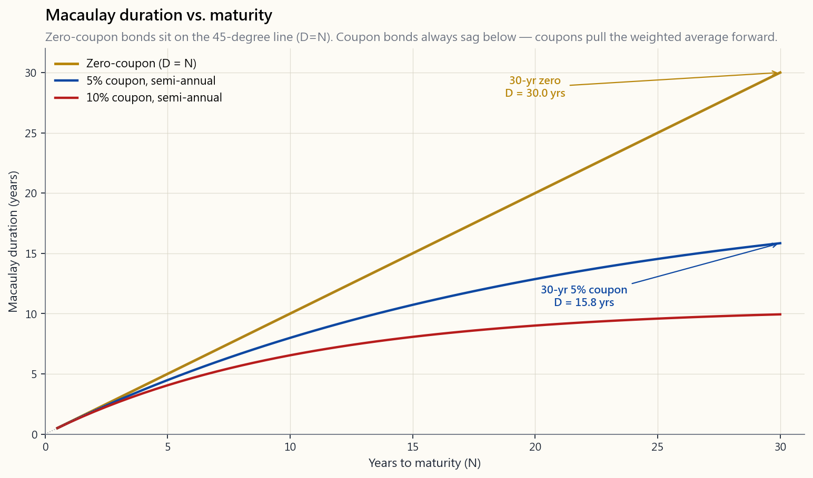
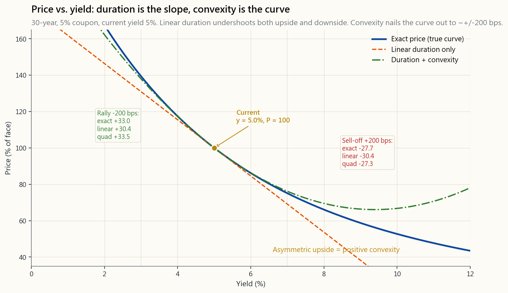

# 第三十二週：存續期間與凸性——超越馬考利的債券價格敏感度

---

## 第一部分：閱讀章節

---

### 1. 為什麼這很重要

在第5週，你學到一張債券就是四個數字加一份行事曆，而價格不過是現金流量折現。在第18週，你學到折現率是整個金融世界的共同分母。在第31週，你學會解讀殖利率曲線。這週你要學的，是連結這些名詞的動詞：**多少**。

當10年期殖利率跳升50個基點，我的債券基金會損失多少？當殖利率曲線趨平，我的退休金負債會移動多少？TLT的回撤有多少算「正常」，有多少算「制度轉變」？這些都不是抽象問題。它是全球每一個固定收益部位每天的損益，而答案就藏在兩個數字裡——存續期間與凸性——從你早已熟悉的債券合約就能算出來。

這堂課你需要內化四件事。

1. **存續期間不等於「距到期的年數」。** 它是你收回本金的*現金流量加權平均時間*，也等於價格對殖利率的彈性。一張10年期附息債券的存續期間大約是8年，不是10年。一張30年期零息債券的存續期間恰好是30年。把存續期間和到期日混淆，是固定收益領域最常見的單一錯誤，也讓一整個世代買了「10年期國庫券」的投資人，在2022年的大跌之前根本沒有衡量自身風險的機會。
2. **凸性不是附注——它是整段長端殖利率的關鍵所在。** 對於小幅殖利率變動，線性的存續期間近似已經夠用。但對於大幅變動（2022年殖利率翻三倍那種），凸性能補回你一直忽略的曲率。在一張30年期國庫券上，若忽略凸性，300個基點的移動會使損益計算偏離數個百分點。凸性對直接債券而言也是正值——對持有人來說是一種免費的不對稱優勢，而這種優勢是以長端較低的殖利率為代價換來的。
3. **關鍵利率存續期間才是專業人士實際避險的工具。** 單一數字「修正存續期間：6.2年」是投資組合的摘要，不是避險工具。真正的固定收益交易台會將存續期間沿殖利率曲線拆解——2年期KRD、5年期KRD、10年期KRD、30年期KRD——並分別對各個桶位進行避險，因為殖利率曲線的移動從來不是平行的。扭轉、趨平與陡化，才是每日現實。
4. **2022年是存續期間風險的具象化——尾部波動率牽著整條狗跑。** TLT，即20年以上美國國庫券指數股票型基金，修正存續期間約為17年，2022年下跌約33%——比標普500指數在2008年的全年表現還要糟糕。這些債券完全按照其存續期間所預示的方向走。*持有的投資人*——其中許多人認為「國庫券很安全」——卻因為從未查閱自身的存續期間而猝不及防。40年殖利率下行的尾流，牽著所有人對風險的認知跑偏了。存續期間才是解藥——但前提是你在買入之前就算出來。

---

### 2. 你需要掌握的內容

#### 2.1 馬考利存續期間——加權平均到期時間

Frederick Macaulay於1938年將存續期間定義為債券現金流量到達時間的加權平均，每個時間點的權重為該筆現金流量現值佔債券價格的比例：

$$ D_{\text{Mac}} \;=\; \frac{1}{P} \sum_{t=1}^{m N} \frac{t}{m} \cdot \frac{C_t}{(1+y/m)^{t}} $$

此公式立即衍生出三個性質。

- **零息債券的馬考利存續期間恰好等於其到期年限。** 由於只有到期日$N$時才有一筆現金流量，加權平均只有一個項目：$D_{\text{Mac}} = N$。一張30年期的美國零息票債券（STRIPS）的存續期間在定義上就是30年。
- **附息債券的存續期間嚴格小於其到期年限。** 中間的票面利率會將加權平均拉向現在。一張票面利率5%、按面值發行的30年期債券，馬考利存續期間約為15.4年——大約只有債券名稱所標示到期年限的一半。
- **票面利率越高→存續期間越短。** 越多現金越早到達，加權平均就越往左移。第32週圖片`week32_duration_curve.png`展示了三條存續期間曲線，疊放在同一個到期年限軸上：45度線是零息債券，5%票面利率曲線低於它，10%票面利率曲線再低一些。

馬考利的單位是年。這是你能在不讓非量化背景朋友陷入微積分的情況下，仍能描述清楚的唯一數字。但對於避險損益而言，我們需要另一種單位：每單位殖利率變動所對應的價格變動百分比。這就是修正存續期間。

#### 2.2 修正存續期間——以百分比衡量的價格敏感度

修正存續期間是馬考利存續期間除以一個複利週期：

$$ D_{\text{mod}} \;=\; \frac{D_{\text{Mac}}}{1 + y/m} $$

為何是這個除數？因為它將「加權平均時間」轉換為線性的價格-殖利率斜率：

$$ \frac{\Delta P}{P} \;\approx\; -\,D_{\text{mod}} \cdot \Delta y $$

朗讀出來：*對於小幅殖利率移動$\Delta y$，價格變動百分比約等於負的修正存續期間乘以殖利率移動。* 一張10年期國庫券，殖利率4%，$D_{\text{mod}} = 8.1$年，殖利率每上升1%，價格損失約8.1%；每下降1%，價格上漲約8.1%。負號正是第5週所學的價格-殖利率反向關係，現在有了量化依據。

截至2026年4月，有三個實用數字值得記住：

- 2年期美國公債，$D_{\text{mod}} \approx 1.9$。50個基點的移動，價格約動1%。
- 10年期美國公債，$D_{\text{mod}} \approx 8.1$。50個基點的移動，價格約動4%。
- 30年期美國公債，$D_{\text{mod}} \approx 17.0$。50個基點的移動，價格約動8.5%。

同一條殖利率曲線，三種截然不同的敏感度。這就是為什麼「我持有國庫券」不是一個風險陳述。到期年限至關重要。

#### 2.3 有效存續期間——當現金流量並非固定時

修正存續期間假設現金流量時程是固定的。這對普通國庫券和投資等級公司債成立，對可贖回債券、可售回債券以及整個不動產抵押貸款證券（MBS）市場則*不成立*——在那些市場中，現金流量本身會隨利率移動：利率下跌時屋主提前還款，利率上升時屋主選擇延長。

對於這類「現金流量對利率敏感」的債券，存續期間必須以數值方式計算，方法是對殖利率曲線給予上下衝擊後重新計算價格：

$$ D_{\text{eff}} \;=\; \frac{P_{-} \;-\; P_{+}}{2 \cdot P_0 \cdot \Delta y} $$

其中$P_-$是殖利率下降$\Delta y$平行衝擊後的價格，$P_+$是上升衝擊後的價格，$P_0$是當前價格。對普通國庫券而言，有效存續期間與修正存續期間精確到小數點後數位都相符。對30年期MBS而言，利率下跌時（提前還款選擇權啟動），有效存續期間遠短於修正存續期間；利率上升時（延伸風險），有效存續期間則大幅拉長。這種不對稱的輪廓就是**負凸性**，也是2022年MBS投資組合表現如此糟糕的原因——它們在利率上升的過程中越拉越長，而非收縮。

#### 2.4 凸性——曲率項

存續期間是切線。價格-殖利率曲線是一條曲線。兩者之間的落差，就是凸性。對價格以當前殖利率$y_0$為中心做泰勒展開，保留兩項而非一項，再除以價格：

$$ \frac{\Delta P}{P} \;\approx\; -\,D_{\text{mod}} \cdot \Delta y \;+\; \tfrac{1}{2} \cdot C \cdot (\Delta y)^{2} $$

其中凸性定義為二階導數除以價格：

$$ C \;=\; \frac{1}{P} \cdot \frac{d^{2}P}{d y^{2}} $$

圖片`week32_convexity_payoff.png`呈現了三條線疊加在一張30年期5%票面利率債券（殖利率5%）上：真實的價格-殖利率曲線、線性存續期間近似，以及存續期間加凸性的二次曲線。100個基點的移動，存續期間線尚可。300個基點的移動（2022年那種），線性近似會在反彈那側低估漲幅，在賣壓那側高估跌幅。

這種不對稱性是核心特徵：**對於普通債券，凸性恆為正，且恆對持有人有利**。殖利率反彈100個基點所帶來的價格漲幅，略大於殖利率上升100個基點所帶來的價格跌幅。市場知道這一點，因此長債殖利率相較於純粹預期理論所暗示的水準，嵌入了一小部分「凸性折價」。

#### 2.5 關鍵利率存續期間——殖利率曲線不做平行移動

單一數字$D_{\text{mod}} = 8$假設的是平行移動——殖利率曲線上每個點移動相同幅度。現實中殖利率曲線是扭轉的。短端利率跟著聯準會政策走，長端利率跟著通膨預期和期限溢價走。2022年的賣壓是熊市趨平（短端利率上升幅度大於長端）；2024年的反彈是牛市陡化（長端利率下降幅度大於短端）。這兩者都不是平行移動。

關鍵利率存續期間（KRD）將總存續期間分解至各個到期年限桶位的貢獻。標準桶位為3個月、2年、5年、10年、30年。一張10年期子彈型國庫券，幾乎全部的存續期間都集中在10年桶位。一張30年期MBS，存續期間分布在5年、10年和30年桶位，因為提前還款選擇權使有效現金流量日期對多段殖利率曲線均敏感。管理投資組合的債券基金經理避險時，不是單純放空「國庫券存續期間」——而是依KRD桶位規模，放空特定期貨合約（2年期TU、5年期FV、10年期TY、30年期US）。這就是專業人士實際進行存續期間中性操作的方式。

對散戶投資人而言：不需要記住KRD。只需知道，當你的債券指數股票型基金說明書報告單一存續期間數字時，它已將五個或更多維度壓縮成一個，而在任何非平行移動下，這個壓縮在淨值層面的誤差可達數個百分點。若你持有啞鈴型策略（第31週的啞鈴策略），你的KRD輪廓與相同總存續期間的子彈型策略在本質上是截然不同的。

#### 2.6 2022年TLT回撤——存續期間風險的具象化

iShares 20年以上美國國庫券指數股票型基金（TLT）是長債的標誌性代理工具。其修正存續期間約為17年。2022年，30年期國庫券殖利率從約1.9%上升至約4.0%，移動了210個基點。線性存續期間預測：

$$ \frac{\Delta P}{P} \;\approx\; -\,17 \cdot 0.0210 \;=\; -35.7\% $$

凸性補回一些。以長債凸性約350計算，$\tfrac{1}{2}\cdot 350 \cdot (0.021)^2 = +7.7\%$。淨預測：約$-28\%$。TLT實際價格報酬約$-31\%$，加上約$+2\%$的票息，總報酬約為$-29\%$。公式的準確度在1個百分點以內。

從此案例可以得到兩個啟示。第一，數學是對的——市場沒有功能失調，模型沒有失效。第二，持有TLT的*人*事前並未做過這個計算。許多人買「國庫券」，期待在聯準會升息週期中尋求安全，卻從未問過「我的存續期間是多少」。波動率的尾部牽著整條狗跑：一個延續40年的制度讓所有人忘記，長期國庫券一年內可以損失三分之一的價值。存續期間是解藥——但前提是你在買入之前就算出來。

**陳馬的觀點——2022年的失敗是投資組合形狀的問題，而非債券數學的問題。** 我個人對於長債當年造成如此重大損害的解讀，是它們被放置在大多數人所謂的「多元分散核心」裡——60/40的債券那半邊，目標日期基金的長存續期間配置，均衡型投資組合的「安全」配置。持有它們的初衷，是它們應該要*避險*股票的回撤。然而它們反而與股票同向下跌並*加劇*損失，因為它們從來就不是真正的安全資產——它們是一個有效運作40年後失靈的槓桿存續期間賭注。在我現在所執行的啞鈴形狀中，安全那端是短存續期間的現金與短期公債，加上黃金，*而非*長期國庫券。若我確實想持有長期國庫券，它們坐落在不對稱那端，作為有特定論述支撐的利率交易，而不是投資組合的枕頭。所謂的多元分散核心，悄悄地變成了它自身的集中風險——對40年通縮制度的集中賭注——而2022年，就是那個集中程度被印證的一年。

#### 2.7 將存續期間付諸實踐——三條實用法則

1. **將存續期間與你的負債或投資期間相匹配。** 若你需要在5年後用到這筆錢，就持有存續期間約為5年的債券。再投資利率風險與價格風險在存續期間節點附近大致相互抵消——這就是**免疫策略**，是退休金與保險業債券管理的基礎。
2. **用修正存續期間來決定避險規模，而非預測大幅移動。** 對於正負50個基點內的殖利率變動，線性存續期間已足夠精確。超過此範圍，應使用加上凸性修正的二次式。超過正負200個基點，應直接從現金流量重新計算債券價格——近似式已失效。以下互動實驗室讓你可以拖動利率衝擊滑桿，同步觀察三種預測的差異。
3. **把「我的債券基金的存續期間」當作貼在牆上的數字。** 打開說明書，找到有效存續期間，把它寫下來。週三下午的聯準會意外決策若移動50個基點，你將損失那個數字乘以0.5%。若這個數字讓你不安，就縮短基金的存續期間。若不然，你已掌握固定收益配置的大致範疇。

---

### 3. 常見的錯誤認知

1. **「存續期間等於距到期年限。」** 只有零息債券才成立。附息債券的存續期間永遠短於其到期年限。
2. **「修正存續期間的單位是百分比。」** 不——修正存續期間的單位是年（它是半彈性），$D_{\text{mod}}$乘以$\Delta y$（以小數表示）的*乘積*才是價格變動百分比。
3. **「凸性只是小修正；忽略它吧。」** 在正負50個基點內成立，在正負300個基點時則是危險的誤解。若不考慮凸性，2022年的長債移動估算會偏差4到7個百分點。
4. **「負凸性是壞事。」** 負凸性在正常制度下為持有人賺取*更高的殖利率*——這就是MBS殖利率高於國庫券的原因。「壞事」只在極端移動時才顯現。你出售了一個選擇權，並為此獲得報酬。
5. **「所有國庫券都一樣安全。」** 它們的*信用*同樣安全。但它們的*價格風險輪廓截然不同*——從存續期間的角度來看，2年期公債與30年期公債幾乎是兩種不同的資產類別。
6. **「存續期間變動緩慢。」** 它會隨殖利率而出現有意義的變動。隨著殖利率上升，修正存續期間下降（債券的有效期限縮短）。說明書上的數字是快照，不是常數。
7. **「我的債券基金存續期間是持債到期年限的平均。」** 不——它是持債修正存續期間的按資金規模加權平均，對任何支付票息的投資組合而言，都比到期年限平均值要短。
8. **「凸性恆為正。」** 對普通債券成立。對可贖回公司債、MBS，以及任何發行人或底層借款人持有提前還款選擇權的債券，則不成立。
9. **「我不持有債券，所以這對我無關。」** 股票估值也是存續期間數學——現金流量持續成長的股票，其「股票存續期間」遠長於成熟配息股，這就是為什麼高倍數成長股在2022年的跌幅遠大於價值股。
10. **「殖利率曲線會做平行移動。」** 幾乎從不。扭轉、陡化、趨平，以及各自的多頭/空頭版本，才是正常制度。單一數字存續期間只描述平行衝擊下的損益。

---

### 4. 問答章節

**Q1：為什麼馬考利除以$(1+y/m)$就得到修正存續期間？**
馬考利的單位是時間（年）。修正存續期間是價格對殖利率的彈性——即$-\frac{dP/dy}{P}$。對現值公式做一點微積分，代數關係恰好是$D_{\text{Mac}}/(1+y/m)$。也可理解為一個小幅離散複利修正：在$y=0$時，馬考利等於修正存續期間；殖利率越高，兩者差距越大。

**Q2：如何查詢我的債券指數股票型基金的存續期間？**
查詢基金公司的官網。iShares、Vanguard與SPDR均在基金特性欄位顯著標示「有效存續期間」。請勿將其與「平均到期年限」混淆。截至2026年4月，TLT的有效存續期間約為16.7年；BND（全市場債券）約為6.3年；SHV（1至3個月美國國庫券）約為0.1年。

**Q3：為何長債具有正凸性？**
價格-殖利率函數$P(y)$是$1/(1+y)^t$項的求和。每一項對$y$都是凸函數（正的二階導數），時間$t$越長，凸性越大。長債放大了這種曲率。從數學上看，凸性大致與存續期間的*平方*成比例，這就是凸性在長端不成比例地重要的原因。

**Q4：退休人士的典型存續期間目標是多少？**
沒有唯一答案，但常見的退休金式規則是將投資組合存續期間與平均負債日期相匹配。一位擁有15年投資期間的退休人士，持有中期（5至7年）債券存續期間是合理的；儲蓄期間更長的年輕人可以持有較長存續期間，而不算失當。大多數「生命週期」目標日期基金預設債券配置為5至7年存續期間，並隨年齡逐漸縮短。

**Q5：有人在2022年的債券移動中獲利嗎？**
有——任何透過TLT買權、放空ZROZ或在利率交換市場付固定利率的人都獲利了。幾檔宏觀避險基金（Brevan Howard、Element Capital）當年業績亮眼。信息是公開的（聯準會早已告知市場將升息）；願意逆40年趨勢布局的人，少之又少。

**Q6：凸性如何反映在長債殖利率中？**
「凸性折價」——長債殖利率略低於純粹預期理論所暗示的水準，因為持有人免費獲得了正的不對稱優勢。這個折價很小（正常制度下30年期約5至15個基點），但確實存在。反浮動利率票據及其他高凸性工具，在公允殖利率模型下的折價更為明顯。

**Q7：「DV01」是什麼，它與存續期間的關係為何？**
DV01（或PV01）是殖利率移動1個基點時，債券的美元價格變動：$\text{DV01} = D_{\text{mod}} \cdot P \cdot 0.0001$。這是固定收益交易台以美元金額決定部位規模的工具。一位「做多100萬美元DV01」的交易員，基準殖利率每移動1個基點，就賺或賠100萬美元。

**Q8：如何對債券投資組合的存續期間進行避險？**
按DV01規模賣出國庫券期貨。TY（10年期期貨）合約的DV01約為80美元；賣出足夠數量的TY合約以匹配投資組合的DV01，即可實現存續期間中性。對於非平行移動，需使用關鍵利率DV01，分別在TU、FV、TY、US等合約上分層進行避險。

**Q9：通膨連結債券（TIPS）的存續期間是否也適用相同方法？**
是的，但針對的是*實質*殖利率，而非名目殖利率。TIPS修正存續期間衡量的是價格對實質利率移動的敏感度。一張10年期TIPS的實質存續期間約為8.5年——與名目國庫券大致相同——但它衡量的是對不同利率的暴露。2022年名目殖利率暴漲，但實質殖利率漲得更多，這就是為什麼TIPS的損失幾乎與名目債券一樣慘重。

**Q10：存續期間如何適用於股票？**
股票也有有效存續期間——以價格對折現率移動的反應來衡量。高倍數成長股（現金流量在遙遠未來才實現）的股票存續期間可達25年以上，而配息公用事業股約為10至15年。2022年那斯達克的回撤與其說是「科技泡沫」，不如說是一次存續期間的重新定價——同樣的泰勒展開式，只是作用在股票現金流量上。

**Q11：有效存續期間與選擇權調整存續期間有何不同？**
有效存續期間是衝擊*殖利率*後重新測量價格。選擇權調整存續期間（OAD）是在考量內嵌選擇權（買權、提前還款等）的模型中衝擊*殖利率曲線*。對MBS而言，OAD與修正存續期間不同，因為提前還款選擇權縮短了有效現金流量期間。概念相同，只是機制更精密。

**Q12：如何使用下方的實驗室？**
拖動到期年限，觀察存續期間大致線性增長。拖動票面利率，觀察存續期間如何隨更多現金提前到達而縮短。拖動利率衝擊，觀察三種價格預測如何分歧——精確值、純線性存續期間，以及存續期間加凸性。凸性修正後的預測在正負200個基點內幾乎與精確值貼合；超過此範圍，即使是二次泰勒展開式也會失效，應直接從現金流量重新計算價格。

---

## 第二部分：YouTube腳本

---

**影片標題：** 存續期間與凸性——為何你「安全」的30年期國庫券損失了三分之一的價值
**目標片長：** 約18分鐘
**主持人：** 陳馬、小魚

---

**[開場——0:00-1:30]**

**小魚：** 上週我們解讀了殖利率曲線。前一週我們為債券定價。今天，我們來回答每一位2022年債券持有人曾問過、卻始終沒有得到好答案的問題：殖利率上升1%，我會損失*多少*？

**陳馬：** 答案不是「看情況」。是兩個數字，從你早已理解的合約就能算出來。存續期間。還有凸性。這堂課結束後，你將明白TLT為何在2022年損失三分之一的價值，為什麼那個損失從說明書上的數字早就可以預見，以及為什麼「國庫券很安全」是現代金融裡代價最高昂的一句話。

**小魚：** 波動率的尾部牽著整條狗跑，而這集節目正是由此而生。40年殖利率下行的趨勢，讓整整一個世代的人以為長期國庫券是免費的安全資產。數學說的是另一回事。

---

**[第一節——馬考利存續期間——1:30-4:30]**

**陳馬：** 馬考利存續期間。1938年。Frederick Macaulay問道：我究竟什麼時候才能從一張債券拿回我的錢？

**小魚：** 不是到期日。

**陳馬：** 不是到期日。是*現金流量加權平均日期*。如果一張10年期債券每半年支付一次票息，我有一半的錢在第十年之前就已經到手了。加權平均落在更近的時間點。對一張5%票息的債券來說，大約是八年。

**[VISUAL: image/week32_duration_curve.png]**

**小魚：** 圖上有三條線。45度線是零息債券——存續期間等於到期年限，恰好如此。其他兩條低於它——5%票面利率和10%票面利率。票面利率越高，現金越早到達，存續期間就越短。

**陳馬：** 30年期的STRIPS——剝離票息的零息債券——存續期間是30年。30年期5%票面利率的國庫券，存續期間約為15年。它們*不是*同一種工具。在風險的地理版圖上，它們根本不在同一個鄰近地帶。

**小魚：** 這是第一個錯誤。人們以為「30年期債券」意味著「30年期存續期間」。並不是。除非你把票息全部剝離掉。

---

**[第二節——修正存續期間——4:30-7:30]**

**陳馬：** 馬考利的單位是年。用來跟普通人解釋很好用。用來預測損益毫無用處。預測損益，我們需要*修正*存續期間。

**小魚：** 修正存續期間就是馬考利除以一加殖利率除以付息頻率。那個除數是微積分的結果。它重要的原因是這個公式：價格變動百分比約等於*負的修正存續期間乘以殖利率變動*。

**陳馬：** 三個值得記住的數字。2年期美國公債，修正存續期間約1.9年。10年期，約8.1年。30年期，約17年。

**小魚：** 同一條殖利率曲線。相同的信用。三種完全不同的風險暴露。

**陳馬：** 這就是為什麼「我持有國庫券」不是一個風險陳述。那是一個*信用*陳述。價格風險藏在你對到期年限的選擇裡。

---

**[第三節——有效存續期間——7:30-9:30]**

**小魚：** 修正存續期間假設現金流量不會移動。對國庫券來說成立。對不動產抵押貸款證券來說*不成立*。

**陳馬：** 利率下跌時，屋主提前還款。你的MBS提前被贖回。利率上升時，沒有人再融資，你的MBS延長——你被迫拿著低票息撐更久。

**小魚：** 這種不對稱性就是*負凸性*。要正確衡量它，我們使用*有效*存續期間——對殖利率曲線施加衝擊，重新計算債券價格，再以數值方式取斜率。對國庫券來說，它等於修正存續期間。對MBS來說，並非如此。

**陳馬：** 2022年聯準會的縮表重創了MBS投資組合，因為它們的有效存續期間在升息過程中*拉長了*。一張7年期MBS，在最糟糕的時機，行為上變成了一張12年期MBS。

---

**[第四節——凸性——9:30-13:00]**

**陳馬：** 現在來看曲率項。存續期間是切線。價格-殖利率曲線是一條曲線。兩者之間的落差，就是凸性。

**[VISUAL: image/week32_convexity_payoff.png]**

**小魚：** 三條線。藍色是真實的價格-殖利率曲線。橙色虛線是線性存續期間預測。綠色是存續期間加凸性的二次曲線。

**陳馬：** 在正負100個基點以內，虛線還可以。超過那個範圍，凸性就很重要了。到了300個基點，線性預測的誤差達到數個百分點。

**小魚：** 注意那個不對稱性。殖利率反彈100個基點帶給你的價格漲幅，*大於*殖利率上升100個基點帶給你的價格跌幅。這就是正凸性。對債券持有人來說，這是一個免費的選擇權。

**陳馬：** 數學意義上的免費。市場知道它的存在，所以長債殖利率已嵌入一小部分凸性折價。你用較低的持有收益來支付凸性的代價。

**小魚：** 公式是什麼？價格變動百分比等於負的修正存續期間乘以delta-y，加上二分之一乘以凸性乘以delta-y的平方。平方項就是曲率。

---

**[第五節——2022年TLT案例研究——13:00-15:30]**

**陳馬：** 我們來復盤2022年那筆交易。

**小魚：** TLT。iShares 20年以上美國國庫券指數股票型基金。修正存續期間約17年。凸性約350。

**陳馬：** 30年期殖利率從約1.9%上升至約4.0%。移動：210個基點。

**小魚：** 線性預測：負17乘以0.021。等於負35.7%。

**陳馬：** 凸性修正：二分之一乘以350乘以0.021的平方。等於正7.7%。

**小魚：** 淨預測：負28%。

**陳馬：** TLT實際的價格報酬約為負31%，加上約正2%的票息。總報酬約為負29%。公式的準確度在1個百分點以內。

**小魚：** 而這裡才是重點。數學是對的。債券完全按照其已公開的存續期間走。那些措手不及的投資人，沒有看存續期間。他們看到的是「國庫券很安全」。

**陳馬：** 40年的趨勢牽著所有人的認知跑。而那個存續期間，一直白紙黑字印在說明書裡。

**小魚：** 為什麼會造成如此大的傷害，更深層的原因是什麼？

**陳馬：** 因為它們被放置在「多元分散核心」裡——60/40的債券那半邊，目標日期基金的長存續期間配置——作為*對沖股票*的工具。2022年它們與股票同向下跌並加劇損失，多元分散核心被揭示為一個集中賭注——押注40年通縮制度的集中賭注。在我現在的啞鈴形狀中，安全那端是短存續期間的現金、短期公債和黃金。若我確實持有長期國庫券，它們坐落在不對稱那端，作為有特定論述支撐的利率交易——絕不是投資組合的枕頭。

---

**[第六節——關鍵利率存續期間——15:30-16:30]**

**小魚：** 最後一個概念，然後我們就結束。單一數字的存續期間假設殖利率曲線平行移動。幾乎從不發生。

**陳馬：** 扭轉。趨平。陡化。2022年的升息是熊市趨平——短端利率上升幅度大於長端。2024年的降息週期是牛市陡化——長端利率下降幅度大於短端。

**小魚：** 專業人士將存續期間分解至關鍵利率桶位：2年、5年、10年、30年。他們用相對應的期貨合約分別進行避險——TU、FV、TY、US。

**陳馬：** 散戶投資人不需要這樣做。但你需要知道，單一數字的存續期間隱藏了好幾個維度的殖利率曲線風險。

---

**[互動實驗演示——16:30-17:30]**

**[VISUAL: interactive/week32_duration_lab.html]**

**小魚：** 現在來玩一玩。將到期年限從1拖到30。觀察存續期間大致線性增長——以及零息債券（票面利率=0）如何貼著y=到期年限的那條線，附息債券如何低於它。

**陳馬：** 拖動利率衝擊。觀察三種價格預測如何分歧——精確值、純線性存續期間，以及存續期間加凸性。在正負200個基點以內，凸性修正後的曲線緊貼精確值。超過此範圍，兩種近似都失效，應直接從現金流量重新計算價格。

**小魚：** 向上拖動票面利率。存續期間縮短。向上拖動殖利率。修正存續期間也縮短。你說明書上的數字是快照——它會隨著利率移動。

---

**[結尾——17:30-18:00]**

**陳馬：** 三個數字。馬考利告訴你什麼時候才真正拿回你的錢。修正存續期間告訴你斜率。凸性告訴你曲率。有了這三個，你可以在淨值的1個百分點以內，預測任何小幅債券移動。

**小魚：** 下週，第33週，我們在存續期間之上加入信用——利差如何變動、何時擴大，以及為什麼「投資等級」不等同於「安全」。

**陳馬：** 在那之前——去查一查你持有的每一檔債券基金的存續期間。把它寫在牆上。那個數字，就是你的風險。

---

**[結束]**