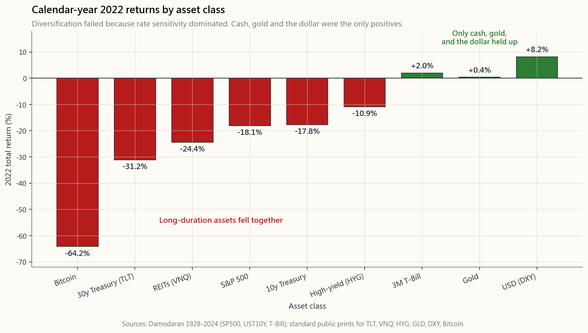

# 第三十四週：利率敏感性跨資產類別分析

---

## 第一部分：閱讀章節

---

### 1. 為何這很重要

地球上每一種資產的定價，都是將未來現金流量折現至今日。折現率建立在無風險利率之上——也就是美國國庫券的殖利率。國庫券殖利率一動，全球每一個價格都會跟著動。這不是比喻，這是算術。

1. **分散投資是有條件的，而非無條件的。** 60/40投資組合建立在一個單一假設上：股票與債券會互相抵消波動。但2022年並非如此。標普500指數下跌18%、10年期國庫券下跌18%、不動產投資信託下跌24%、黃金幾乎紋絲不動、美元上漲8%。「平衡型」投資組合下跌了16至17%。原因很簡單：同一個+400個基點的衝擊同時打中了兩條腿，利率敏感性主導了相關性。

2. **長達40年的順風逆轉了。** 從1981年到2020年，10年期國庫券殖利率從15%降至0.5%。利率下降會拉抬所有具有存續期間敏感性的資產：債券、成長股、不動產投資信託、私人信貸、創業投資、槓桿收購。這股順風讓整整一個世代「多頭任何資產」的投資組合看起來技術高超。當順風在2022年逆轉時，同樣的投資組合卻顯得手足無措。不了解哪些資產具有存續期間敏感性的投資人，就是那些被打個措手不及的投資人。

3. **利率衝擊並非罕見事件。** 自1980年以來，美國經歷了沃克爾時代（利率+1,000個基點）、2008年（利率-400個基點）、2020年（利率-150個基點）以及2022年（利率+525個基點）。大約每十年就會有一次改變格局的利率變動。設計一個忽視利率衝擊的投資組合，就是在為一個不存在的世界設計投資組合。

4. **部位規模取決於此。** 一旦你知道30年期債券在+100個基點時大約下跌16%，而長存續期間成長型指數股票型基金（如ARKK）在同樣衝擊下下跌12至15%，你就可以停止把它們當作兩種不同的資產了。它們是穿著不同外衣的同一筆交易。利率敏感性是一個統一的視角——尾部風險有共同的根源，而波動性尾部才是真正主導一切的因素。

本課程提供你面對下一次+100個基點以及下一次-100個基點時的跨資產操作手冊。第47週將以此為基礎，計算尾部風險避險的規模。

---

### 2. 你需要了解的內容

#### 2.1 核心公式

每一種資產的價格等於其現金流量的現值：

$$P = \sum_{t=1}^{\infty} \frac{CF_t}{(1+r)^t}$$

修正存續期間 $D$ 是當 $r$ 變動1%時，價格的百分比變化：

$$\frac{\Delta P}{P} \approx -D \cdot \Delta r$$

這就是整個遊戲的核心。現金流量的時間線越長，$D$ 越大，資產對利率變動的價格反應就越劇烈。30年期零息債券的 $D \approx 30$。短存續期間的價值股 $D \approx 5$。長存續期間的虧損成長股同樣有 $D \approx 30$——這就是為何ARKK與TLT在2022年走勢一致。

#### 2.2 利率衝擊速查表

殖利率曲線長端平行+100個基點衝擊的估計價格影響（以2026年中期起始殖利率為基準，具廣泛代表性）：

| 資產類別 | 約 $D$ | +100個基點的價格變動 |
|:--|:--:|--:|
| 3個月國庫券 | 0.25 | -0.25% |
| 5年期國庫券 | 4.5 | -4.5% |
| 10年期國庫券 | 8 | -8% |
| 30年期國庫券 | 16 | -16% |
| 投資等級公司債（LQD） | 9 | -10% |
| 高收益公司債（HYG） | 4 | -6% |
| 標普500指數廣泛 | 18 | -7% |
| 價值股（VTV） | 10 | -3% |
| 成長股（VUG／QQQ） | 22 | -12% |
| 不動產投資信託（VNQ） | 18 | -10% |
| 黃金（GLD） | -- | -2%至+5% |
| 長存續期間加密貨幣／虧損科技股 | 30+ | -20%或更差 |
| 美元（DXY） | -- | +1%至+3% |

有兩種資產不適用存續期間公式。黃金沒有現金流量，因此無法直接計算存續期間——其利率敏感性來自通膨預期。美元是相對價格，而非折現現金流量，因此它隨美國利率與外國利率的**利差**移動。我們在§2.5和§2.6分別處理這兩者。

#### 2.3 債券：與存續期間呈線性關係

債券是教科書中的典型案例。30年期國庫券對利率的敏感性大約是10年期的兩倍，而10年期大約是5年期的兩倍。國庫券加上30年期零息債券的啞鈴策略，與10年期子彈型債券有相同的平均存續期間，但凸性大不相同。對大多數投資組合而言，正確的錨點是5至10年期的中期國庫券（IEF、IEI）。30年期（TLT、EDV）是一種**投機性**的利率交易——+100個基點時虧損16%，-100個基點時獲利16%。它應該屬於阿爾法投資部位，而非債券部位。

#### 2.4 股票：偽裝的存續期間

成長股除了名稱之外，實質上就是長存續期間資產。2022年的案例是我們迄今為止見過最清晰的實證：

- 10年期國庫券殖利率從1.5%上升至4.0%（+250個基點）。
- ARKK（長存續期間虧損科技股）下跌約67%。
- QQQ（大型股獲利型科技股）下跌約33%。
- VTV（價值股、短存續期間）下跌約5%。
- 這個排名與存續期間梯級完全吻合。

規則：一家公司現金流量的預計兌現時間每延長一倍，其利率敏感性就加倍。一家今年賺5美元、明年賺5.2美元的銀行，存續期間極短。一家今年虧損1美元、預計2035年賺50美元的SaaS公司，存續期間極長。成長倍數就是存續期間倍數。

#### 2.5 不動產：槓桿化的存續期間

不動產投資信託對利率**極為**敏感，原因有兩個相互疊加的因素。首先，租金流量是長期的（資本化率隨10年期殖利率壓縮與擴張）。其次，底層不動產的槓桿率約50%，因此再融資風險放大了利率衝擊。2022至2024年間，辦公室不動產投資信託的股票價值損失了40至50%，因為相同租金的資本化率從5%升至7至8%。住宅型與工業型表現相對較佳，但VNQ整體在2022年回撤逾30%。經驗法則：不動產投資信託的交易方式類似槓桿化的15年期債券。

房貸利率是第二層管道：2022至2023年間，30年期固定利率從3%升至7.8%，重創了住宅交易量。任何持有浮動利率建設貸款的人都被迫以高出許多的利率再融資——許多人因此撐不下去。

#### 2.6 黃金：**實質**利率的函數，而非名目利率

黃金沒有現金流量、沒有殖利率、也沒有盈餘。其價格是對法定貨幣信心的反向指標。驅動變數是**實質**利率——10年期名目殖利率減去預期通膨（即TIPS盈虧平衡利率）。當實質利率上升時，黃金下跌（持有零殖利率黃金的機會成本上升）。當實質利率下降時，黃金上漲。

這就是為何2022年如此異常：名目利率劇烈上升，但通膨也同樣劇烈上升，因此實質利率僅小幅上升。黃金全年收漲0.4%。1980年同樣的算術往反方向運算：沃克爾將名目利率推至高於通膨，實質利率大幅轉正，黃金從850美元崩跌至300美元。黃金之所以是價值儲存工具，是因為足夠多的人**相信**它是，而實質利率就是這種信念的運作機制。

#### 2.7 美元：利差，而非利率水準

DXY衡量美元相對於一籃子貿易夥伴貨幣的強弱。它隨美國利率與外國利率的**利差**以及風險偏好／風險規避溢酬移動。當聯準會升息速度快於歐洲央行和日本銀行（2022年），美元上漲。當升息速度較慢（2002至2004年、2017至2018年），美元下跌。若+100個基點的衝擊是全球同步的，對DXY幾乎沒有影響。若+100個基點的衝擊純屬美國獨有——如2022年的情況——則DXY上漲5至10%。

強勢美元的二階效應也很重要：新興市場走弱、美國跨國公司海外盈餘換算受損（標普500指數約50%的營收來自海外），黃金面臨逆風。我們在多頭部位保持以美國為主；這就是其有效運作的原因所在——當美元上漲時，我們以強勢貨幣計價，而外國市場則同時承受本地利率上升和匯率換算的雙重打擊。

#### 2.8 2022年案例研究：為何分散投資失效

2022年各資產類別全年報酬率（來源：達摩德仁資料庫及標準數據）：

- 標普500指數：-18%。
- 10年期國庫券：-18%。
- 30年期國庫券（TLT）：-31%。
- 高收益公司債（HYG）：-11%。
- 不動產投資信託（VNQ）：-24%。
- 黃金（GLD）：+0.4%。
- DXY：+8%。
- 比特幣：-65%。

標準的60/40投資組合虧損16至17%。風險平價投資組合（對債券使用槓桿）損失更慘。原因只有一個：聯準會+425個基點的衝擊同時打中了所有長存續期間資產。相關性並未「失靈」——相關性向來是有條件的，而那個條件就是溫和的利率環境。當利率環境變得惡劣時，相關性展現了其真實面貌。

投資人的啟示並非「分散投資已死」，而是「分散投資是針對**驅動變數**的分散」。如果你的六種資產都共享利率敏感性，你擁有的不是六種資產——你是用六個包裝持有同一筆交易。要在利率驅動的世界中真正分散，你需要對**不同**驅動因素有所回應的部位：現金、黃金（實質利率避險）、做空波動性（波動性尾部才是真正主導一切的因素），或是真正的阿爾法。

---

### 3. 常見迷思

1. **「股票永遠能避險債券。」** 只有在成長衝擊主導利率衝擊時才成立。在通膨驅動的格局下，兩者會同步下跌。1970年代和2022年就是佐證。

2. **「成長股是股票，不是債券。」** 數學上是錯的。一檔以15年後現金流量定價的股票，其存續期間比15年期債券還要長。標籤改變不了數學。

3. **「黃金是通膨避險工具。」** 黃金是**實質利率**避險工具。若通膨上升而名目利率上升更快（1980年），黃金下跌。若通膨上升而名目利率落後（2020至2024年），黃金上漲。

4. **「不動產投資信託是實體資產，所以能避險利率風險。」** 不。不動產投資信託是槓桿化的長存續期間現金流量，其利率敏感性比股票市場**更高**，而非更低。

5. **「美元在危機時總是上漲。」** 在流動性危機（2008年、2020年）時確實如此，但在對美元本身的信心危機（2002至2003年、1970年代末）時則不然。驅動因素是利率利差，而非恐慌程度。

6. **「+100個基點是罕見事件。」** 自1970年以來，聯準會大約每十年就會在單一年度內移動+100個基點。將投資組合定價為0個基點變動，是認知偏誤，而非合理校準。

7. **「債券存續期間就是到期日。」** 修正存續期間考量了票面利率。30年期零息債券的 $D \approx 30$，30年期附息債券的 $D \approx 16$。差異很大。

8. **「分散投資就是持有很多東西。」** 分散投資是持有許多**不相關**的東西。持有十種長存續期間資產，就是把同一筆交易做了十次。

9. **「加密貨幣是避險工具。」** 比特幣在2022年是全世界存續期間最長的資產：在+425個基點的衝擊下跌65%。它的表現與避險完全背道而馳。

10. **「不動產因為流動性低，所以波動不大。」** 它的波動幅度相同，只是有時間差。公開上市的不動產投資信託價格即時揭露真相；私募不動產的評價則落後12至18個月。

---

### 4. 問答章節

**Q1：我要如何快速估算我持有的股票受到的利率影響？**
A：看其遠期本益比。本益比30意味著大部分價值來自遠期現金流量，存續期間約為本益比×0.7。本益比30的股票 $D \approx 21$，因此+100個基點約扣減21%。本益比12的股票 $D \approx 8$，同樣衝擊約扣減8%。這是粗略估算法則，但結果驚人地接近。

**Q2：我應該完全避開長期債券嗎？**
A：不——你應該刻意持有它們。30年期國庫券（TLT、EDV）是少數幾種在景氣衰退驅動的降息環境下能**正向**受益的資產之一。在經濟衰退情境下，股票下跌而TLT上漲20至30%。訣竅是把規模控制在夠小，使+100個基點時16%的虧損是可以承受的。把TLT當作尾部風險避險工具，而非債券持倉。

**Q3：TIPS（抗通膨債券）呢？**
A：美國財政部抗通膨保值債券的存續期間比名目國庫券**更短**，因為部分現金流量來自消費者物價指數的累積。10年期TIPS的 $D \approx 7$，且只對**實質**利率反應。若你特別擔憂停滯性通膨，TIPS是最純粹的利率避險工具。

**Q4：為何我的「平衡型」60/40基金在2022年虧損了17%？**
A：兩條腿共享同一個驅動因素（長存續期間折現）。當折現率跳升250個基點時，兩條腿同時向下調整。同樣這檔基金在2008年賺了錢，因為那是**成長**衝擊，而非**利率**衝擊——債券上漲而股票下跌。驅動因素不同，結果就不同。

**Q5：如何在不全部出清的情況下對利率風險進行避險？**
A：三個選項：（1）用IEI或甚至SHV取代TLT，縮短債券存續期間；（2）買進TLT或QQQ的賣權（在已實現波動性低時便宜，且選擇權包裝是美國應稅帳戶中使用槓桿最節稅的方式）；（3）持有現金等價物（BIL、SGOV），存續期間為零且賺取短端利率。我們將在第47週介紹買權價差尾部避險策略。

**Q6：這適用於國際市場嗎？**
A：是的，但需加入美元覆蓋層。外國債券在本地利率+100個基點時，以本地貨幣計算，依其本地存續期間下跌。若美元同時上漲，美元換算後的損失會被放大。這正是我們將多頭部位保持在美國的原因之一。

**Q7：為何公用事業股和民生消費股被稱為「債券替代品」？**
A：它們的股利穩定且成長緩慢，因此大部分價值來自遠期現金流量。其存續期間類似15年期債券。2022年公用事業股僅下跌1%（具韌性）；2008年則下跌30%（信用衝擊主導）。它們在利率管道是唯一觸發因素時**表現得像債券**。

**Q8：我的緊急備用金的「利率敏感性」是多少？**
A：依定義為零。國庫券（BIL、SGOV）、貨幣市場基金和儲蓄帳戶的 $D < 0.25$。這正是重點所在：現金部位是唯一不隨利率移動的部位，這使它成為利率驅動世界中唯一真正的分散工具。啞鈴策略正是因為這個原因在一端配置現金。

**Q9：+100個基點的利率變動實際上可以有多大？**
A：歷史上，聯準會在單一緊縮循環中移動了+400至+525個基點（1981年、1994年、2004至2006年、2022至2023年）。將投資組合定價為「+100個基點」是**保守的**情境。互動式實驗室讓你將衝擊推至±300個基點，以觀察尾部的樣貌。

**Q10：這在四層架構中屬於哪一個部分？**
A：現金層：零利率敏感性。貝塔層：承擔股票指數無可避免的利率暴露（$D \approx 18$）。因子投資層：偏向較短存續期間的價值股（較低 $D$）以進行部分避險。阿爾法層：主動使用TLT、TLT選擇權及黃金進行利率方向性操作。了解每一層的存續期間，是決定你實際承擔多少利率風險的第一步。
