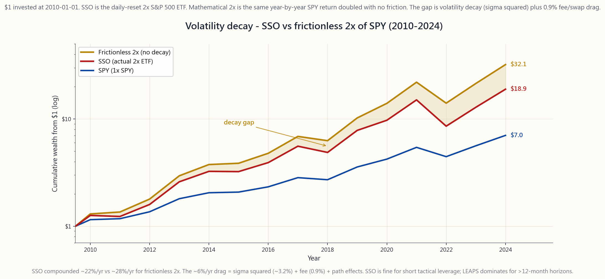

# 第三十七週：選擇權作為槓桿——以深度價內買權取代持股

---

## 第一部分：閱讀單元

---

### 1. 為何這個主題至關重要

多數散戶投資人一聽到「選擇權就是槓桿」，腦中浮現的是彩券——在財報前買進價外買權，一週漲500%、下一週跌100%歸零。這只是選擇權世界的一個角落，而且幾乎所有人在這個角落都會虧損。機構的做法截然不同：一口深度價內的長期期權買權，能以25%至35%的資金取得約90%的股票經濟曝險，同時讓剩餘65%至75%的現金賺取無風險的國庫券殖利率。這不是賭博，這是**持股取代策略**，也是槓鈴式投資架構——以無聊的核心部位加上集中型阿爾法配置，透過稅務效率佳的選擇權槓桿來資助——在真實帳戶中最清晰的體現方式之一。

本課位於L3課程核心，有以下四個理由。

1. **無需保證金的資本效率。** 深度價內買權沒有維持率要求、沒有隔夜融資額度，也沒有強制平倉風險。最大損失就是已付出的權利金。保證金可能讓你賠超過帳戶資產；長期期權買權不會。
2. **稅務幾何學。** 持有長期期權買權超過一年，獲利即符合長期資本利得資格，稅率15%至20%，與直接持有股票相同。沒有股利，但也沒有保證金或2倍指數股票型基金所帶來的年度融資成本拖累。選擇權是美國散戶投資人能取得的稅務效率最佳的槓桿工具；本課正是要證明這一點。
3. **相較槓桿型指數股票型基金的清晰替代方案。** SSO（2倍標普500）和QLD（2倍那斯達克100）等產品每日重置，在非單調上漲的走勢中都會遭受**波動性損耗**。2010年至2024年間，SSO年複合報酬約22%，而無摩擦的數學2倍標普500年複合報酬約達28%——對最終財富造成每年約6個百分點的拖累。深度價內長期期權不會每日重置，也不會以這種方式損耗。
4. **風險素養。** 讓0.90Δ買權高效運作的相同機制，也帶來了多數投資人從未計算過的新失效模式：價差空頭腳的被指派風險、跳過股利的成本、長期買權微小但真實存在的時間價值損耗，以及在波動率飆升後進場購買所面臨的隱含波動率崩塌風險。懂得如何調整部位規模並轉倉持股取代買權，正是區分彩券交易者與槓桿投資人的關鍵。

本課是這項區別的操作手冊。

---

### 2. 你必須掌握的知識

#### 2.1 貝塔值是槓桿調節旋鈕

買權的貝塔值是選擇權價格對標的資產的一階導數。0.50Δ的選擇權，標的股票每漲1元，選擇權約漲50分。0.90Δ的選擇權，則漲約90分。就持股取代而言，**貝塔值就是槓桿調節旋鈕**：

- **0.90Δ深度價內12個月買權** ≈ 90%的股票曝險，≈ 25-30%的股票資金。
- **0.70Δ適度價內6個月買權** ≈ 70%的股票曝險，≈ 12-18%的股票資金。
- **0.30Δ接近價平3至6個月買權** ≈ 30%的股票曝險，≈ 3-6%的股票資金。
- **0.10Δ價外短期買權** ≈ 10%的股票曝險，< 1%的股票資金——即彩券型操作。

沿著貝塔值階梯往下走，取捨如下：資金愈少、槓桿愈高，但時間價值損耗愈大、Vega風險愈高，且到期時處於價內的機率也愈低。持股取代策略幾乎完全集中在9至15個月到期的0.80至0.95Δ區間。在這個區間，相對於所控制的美元曝險，外含價值相對較小。

以數字為基準：SPY報520美元，2027年1月（2026年4月時約9個月後到期）履約價416美元（K = 現貨的80%）的買權，在σ = 19%、r = 4.3%的條件下，定價約123美元，貝塔值為0.92。每口合約以12,300美元的權利金控制52,000美元的SPY曝險——約每美元花24分錢。

#### 2.2 你所釋放的資金是真實的錢

持股取代策略中，不為人知的另一半，是你**未動用**的現金。若一口0.92Δ長期期權以12,300美元複製了52,000美元SPY曝險的92%，剩下的39,700美元就停留在你的帳戶中。2026年4月，3個月國庫券殖利率約4.3%，貨幣市場基金（SGOV、BIL）追蹤相同水準，這筆現金並非閒置——每年約可賺進1,700美元，全部按一般所得稅率課稅，但**全部都是增量報酬**，而買進持有的股票投資人無法獲得，因為他們的52,000美元已全數投入。

在9個月的持有期間，釋放現金的利息收入為整體部位的總經濟報酬貢獻約3.0%至3.3%，足以全部或部分抵銷以下三項：你放棄的SPY股利（SPY截至2026年4月的近12個月殖利率約1.3%），加上選擇權的外含價值損耗（0.92Δ長期期權在9個月內約損耗1.5%至2.5%）。三者相抵後，深度價內長期期權在**僅計算價格報酬**的條件下，與直接持股大致持平，但它只消耗了四分之一的資金。其他四分之三可存放於國庫券，或用來資助四配置槓鈴架構的其他部分。

#### 2.3 你所承擔的風險

1. **時間價值損耗（Theta）。** 對深度價內長期買權而言影響微小——通常為每日0.02%至0.05%的標的價值——但確實存在，且是槓桿的成本。履約價愈接近現貨、到期日愈近，這個數字就愈大。
2. **隱含波動率崩塌。** 若你以25%的隱含波動率買進長期期權，而後隱含波動率回落至18%，即便股票價格不變，你也會損失Vega。解決方式：避免在波動率指數高於25時買進長期期權，除非你明確是多Vega策略。
3. **跳過股利。** 長期買權持有人無法收取標的的股利。對SPY（1.3%）而言影響尚小；對高殖利率股票如KO（3%）或VZ（6%），這在結構上是個問題——若模型未納入此項，對高股利股票進行長期期權取代策略的成本會被低估。
4. **空頭腳被提前指派。** 純粹的多方買權不會被指派（你是持有方）。但若你在長期期權之外賣出空頭買權以降低成本（形成「對角價差」），空頭腳可能在高股利標的除息日前一天被指派。
5. **流動性。** SPY、QQQ、AAPL、MSFT、NVDA、AMZN的長期期權流動性佳。小型股及多數境外美國存託憑證的長期期權流動性不足。在流動性差的標的上進行持股取代，買賣價差會吃掉所有優勢。

#### 2.4 稅務全貌

對美國應稅帳戶的投資人而言，以長期期權作為槓桿的稅務案例，是整個選擇權世界中最清晰的。

- **持有超過365天、有獲利賣出 → 長期資本利得。** 適用與持有股票相同的15%至20%稅率。
- **虧損賣出 → 一般資本損失**，可抵銷其他資本利得，每年最多3,000美元可抵銷一般所得，剩餘可結轉。
- **無逐市計值規定。** 不同於第1256節（廣泛基礎指數期貨及少數指數選擇權），個股及多數指數股票型基金選擇權遵循標準股票型選擇權稅務規定——獲利僅在賣出時實現，不提前課稅。
- **無融資成本申報。** 保證金利息僅能用於抵銷投資所得，且通常不划算。長期期權價格中隱含的融資成本**不可扣抵**，但對任何人而言也不構成課稅所得——這只是合約的特性，不是稅務事件。

與2倍指數股票型基金（SSO、QLD）相比：ProShares每年從交換合約對手方轉嫁名義上的利息所得加上資本利得分配，按一般所得稅率或短期稅率課稅。長期期權提供同等槓桿，但享有更優質的稅務結構。

#### 2.5 與2倍槓桿型指數股票型基金的比較

散戶最常見的指數槓桿替代選擇，是每日重置的2倍指數股票型基金：SSO（2倍標普500）、QLD（2倍那斯達克100）、UPRO/TQQQ（3倍）。它們有一個核心問題——**路徑相依性**。

2倍每日重置指數股票型基金的年化報酬約為：
$$ r_{\text{2x},\text{年化}} \approx 2 r - \sigma^2 $$
其中 $r$ 為標的年化報酬，$\sigma^2$ 為實現波動率的平方。對標準差約18%的標普500而言，$\sigma^2$ 項每年約造成3.2%的直接拖累。實際數據顯示，2010年至2024年間，SSO年複合報酬約22%，而無摩擦的2倍SPY年複合報酬約達28%。SSO並未崩潰——但它與理論數字的差距，足以讓任何超過12個月的持有策略付出高昂代價。

0.92Δ長期期權不存在這個問題。它的複合報酬約為標的價格報酬的0.92倍，加減微小的外含價值損耗，沒有每日重置，因此也沒有$\sigma^2$拖累。這是機構在執行槓鈴策略時，選擇長期單一標的選擇權而非槓桿型指數股票型基金的最主要原因。

2倍指數股票型基金確實有一項優勢：可支付（微薄的）股利、可在任何帳戶持有、不需要轉倉。對希望適度槓桿且不積極管理的被動式管理投資人而言，SSO是可以接受的選擇。但對任何主動式管理L2/L3配置的投資人，長期期權在資本效率、稅務及路徑獨立性上均勝出。

#### 2.6 如何調整持股取代部位的規模

來自交易台的三條規則。

1. **以名義價值計算，而非以權利金計算。** 以合約所控制的美元曝險（貝塔值 × 100 × 現貨價）來調整規模，而非以現金支出為準。單口0.92Δ的SPY長期期權控制約48,000美元的SPY曝險。若你的配置目標是10萬美元的SPY，買2口合約，而不是8口。
2. **依投資論點決定到期日。** 若你的看法是12至18個月，買15個月到期的長期期權。若你的看法是3個月，買5個月到期並接受30%的外含價值。不要買週選擇權然後說那是槓桿；那是以Theta作為持有成本的方向性押注。
3. **按日曆轉倉，而非按價格轉倉。** 當長期期權剩餘90天到期時就向前轉倉，永遠不要等更短。任何選擇權生命最後60天，是外含價值損耗最快、Gamma風險最大的時期。在剩餘90天時轉倉，可保留深度價內的特性。

試試[取代實驗室](interactive/week37_replacement_lab.html)互動工具——設定目標股票曝險金額，觀察在直接持股、三種長期期權貝塔值選項以及SSO之間切換時，資金需求、損益平衡點、釋放現金殖利率與總報酬如何變化。

---

### 3. 常見迷思

1. **「選擇權槓桿就是賭博。」** 短期價外買權才是賭博。深度價內長期買權是損失上限明確的槓桿。兩者屬於同一工具家族；是履約價與到期日決定了你買的是哪一種。
2. **「我應該買價平買權，因為比較便宜。」** 價平選擇權的外含價值佔權利金比例最高——你正在為最高的時間價值損耗付費，而0.90Δ買權以三分之一的外含價值就能給你同等的曝險。
3. **「長期期權是用來長期持有多年的。」** 長期期權是用來**每9至15個月在剩餘90天以上時轉倉**的。持有長期期權至到期，不過是一種昂貴的購股方式。
4. **「SSO和長期期權一樣，而且更簡單。」** 在多年期持有的情況下，SSO每年有3%至6%的波動性損耗。長期期權沒有。5至10年後，這個差距會主導一切其他因素。
5. **「保證金和選擇權槓桿一樣。」** 保證金可能讓你的帳戶爆倉；多方選擇權不會。兩者的稅務處理不同。保證金有維持率要求。兩者不能互換——它們是不同的工具。
6. **「我只是在財報前買個槓桿買權。」** 財報後的隱含波動率崩塌，通常在隔天早上就會吃掉選擇權30%至50%的價值，即便股票朝你預期的方向移動。這個工具根本不適合那種投資論點。
7. **「長期期權流動性很差。」** 在SPY、QQQ、前50大個股以及多數大型指數股票型基金上，長期期權的買賣價差在1%至3%之間。在這個範圍以外的標的，價差可能達10%至20%。
8. **「釋放出來的現金放著就好。」** SGOV和BIL是1日交割的國庫券指數股票型基金，2026年4月殖利率4.3%。不賺取無風險利率的現金，是永久性的殖利率損失。
9. **「股利不重要。」** 對一檔殖利率6%的股票持有一年長期期權，你放棄了6%的報酬。這比選擇權的外含價值還多。持股取代策略適用於低殖利率的標的。
10. **「只要持有長期期權超過365天第一天就算長期了。」** 對單獨持有的多方長期期權而言確實如此。但若搭配任何空頭選擇權腳，或與相關股票部位產生洗售關係，持有期間的計算規則可能被重置。若你在輪動策略，請做好紀錄。

---

### 4. 問答單元

**Q1. 履約價應該設多深的價內？**
現貨的80%至85%是最佳甜蜜點。在正常波動率下，12個月到期的選擇權貝塔值約為0.85至0.95，這個區間所付的外含價值最少，卻能取得接近股票的曝險。

**Q2. 如果買進長期期權後第二天股票跌10%，怎麼辦？**
你的0.92Δ長期期權損失約92%的那10%，即標的價值的約9.2%。以權利金為分母計算的百分比損失，會大於10%——這就是槓桿的效果。但最大損失仍以已付的權利金為限。

**Q3. 這個策略應該用在個股還是只用在指數？**
個股長期期權適用於流動性佳的前50大美國大型股。指數（SPY、QQQ、IWM）是最典型的應用案例，因為流動性最好，且個股跳空風險較低。

**Q4. 什麼到期日最合適？**
買進時選12至18個月，剩餘90天時向前轉倉。不足9個月的選擇權Theta太高；超過24個月的選擇權在一般履約價上流動性太低。

**Q5. 這個策略與四配置架構如何搭配？**
持股取代策略將L1貝塔配置從100%資金壓縮至約25%資金，釋放75%用於資助L2和L3策略配置，同時不降低你的貝塔曝險。這就是槓鈴架構的運作機制。槓鈴策略之所以可行，前提是你能以低於全額資金的成本持有完整貝塔曝險。

**Q6. 在SPY上執行這個策略的全部成本是多少？**
大約是：跳過的SPY股利（1.3%/年）+ 長期期權外含價值損耗（2-3%/年）- 釋放現金賺取的國庫券殖利率（釋放的75%資金賺約3.0%/年）= 淨成本約0至0.5%/年。加上手續費與每12個月一次的買賣價差往返（約0.3%）。

**Q7. 可以在羅斯個人退休帳戶中執行嗎？**
可以——在多數券商（Schwab、Fidelity、IBKR）的個人退休帳戶中，包括長期期權在內的多方買權均被允許。個人退休帳戶不能交易裸賣權或使用保證金，但持股取代型的多方買權是被允許的，且在羅斯個人退休帳戶內，釋放的現金可免稅賺取國庫券殖利率。

**Q8. 隱含波動率值得追蹤嗎？**
值得。在標的的隱含波動率排名低於50（最好低於30）時買進長期期權。高隱含波動率的長期期權含有昂貴的波動率溢酬，即使股票未變動，隱含波動率均值回歸也會侵蝕部位價值。

**Q9. 應該在長期期權上賣出空頭買權來降低成本嗎？**
那就是窮人版掩護性買權（PMCC）——在第30週有詳細說明。確實可以降低持有成本，但會限制上行空間並引入空頭腳被指派的風險。若目的是純粹的持股取代，保持長期期權為純多方部位即可。

**Q10. 與IBKR的組合保證金相比，哪個更好？**
組合保證金可以達到4至6倍槓桿，但2026年帳戶借貸利率為6%至7%，且在跳空下跌時面臨強制平倉風險。長期期權沒有追繳保證金的問題。對能承受追繳保證金風險且交易規模達到組合保證金資格門檻的投資人，每單位槓桿的成本可能相近；但對其他所有人而言，長期期權在操作風險上勝出。

**Q11. TQQQ / UPRO（3倍）怎麼樣？**
與SSO同理但更嚴重。年化損耗約為$3 \sigma^2 - \text{融資成本}$，對那斯達克100而言意味著每年8%至12%的拖累。5年以上持有，TQQQ的表現大幅落後以QQQ為基礎的3倍長期期權組合。3倍指數股票型基金僅適合作為短期戰術工具。

**Q12. 這個策略在什麼情況下會失敗？**
三種市場環境：（1）持續多年的回撤——你的長期期權可能在你有機會轉倉前歸零；（2）高波動性震盪市場——在波動率飆升後買進，若隱含波動率崩塌，會使權利金損失20%至30%；（3）任何流動性不足的標的——買賣價差會吃掉釋放現金的利息收益。請堅守前50大標的，且隱含波動率排名須低於50。
