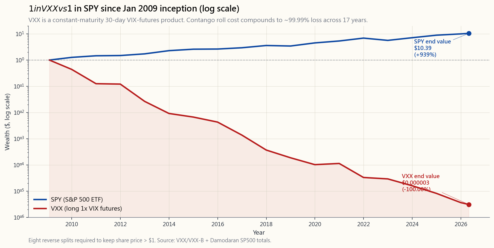

# 第40週：波動率指數與波動性商品複合體

---

## 第一部分：閱讀材料

---

### 1. 為何這個主題至關重要

波動率指數（VIX）是金融界被引用最多、卻最少人真正理解的數字。CNBC說「恐慌指標飆升至28」，觀眾點頭稱是，但幾乎沒有人能告訴你28到底代表什麼、能預測什麼，或者——最關鍵的是——為何所有建立在它之上的零售型商品，都傾向於持續虧損。波動性才是真正的主宰：在真正的危機中，它是*第一個*移動的指標，其他一切都圍繞著它重新排列。如果你對波動性複合體的運作方式沒有清晰的認知，當你的投資組合出了什麼問題時，你將會是最後一個知道的人。

以下是嚴肅的投資人必須徹底掌握波動率指數的四個理由：

1. **波動率指數是一種資產類別的價格，而非預測工具**：波動率指數是一個30天的隱含波動率數字，由一系列S&P 500指數（SPX）選擇權的價格進行無模型計算而得。它告訴你，選擇權市場*目前*對保護的收費標準，而非實際已實現的波動性將為何。兩者之間的溢價——即波動率風險溢價——是市場上最乾淨、最持久的報酬來源之一，並體現在你所交易的每一個選擇權之中。

2. **波動率指數期貨的期限結構通常與直覺相反**：波動率指數期貨在約85%的交易日處於正價差（contango）狀態。三個月的隱含波動率幾乎總是高於即期波動率指數。這個單一的結構性事實，正是為什麼長波動性商品（如VXX、UVXY）每年大約虧損30%以上，也是為什麼每一個「買入波動性作為保險」的提案，都值得像審視1981年4%抵押貸款一樣嚴格審查。

3. **波動性是帶著信念犯錯的最廉價方式**：做多波動性的賭注在災難中才能獲利。但持有成本極為殘酷——每一天世界沒有結束，你就在付錢；而且在觸底後數週內，收益就會吐回，因為期限結構已經重置。大多數零售型「尾部避險」部位，都是在波動率指數高峰時買入、在谷底賣出——這與它們應有的運作方式完全相反。

4. **做空波動性的交易毀掉的聲譽，比做多波動性的交易還多**：出售波動性看起來像是白撿的錢，多年如此——直到某一天突然不再是了。「波動性末日」（Volmageddon，2018年2月）在一個下午就將XIV指數投資證券（ETN）清零——在連續多年每年報酬+30%之後，單日收盤下跌96%。波動性爆倉事件是整個投資組合在被衝擊時自我重新排列的原因。若不理解波動性曲面在那幾週的變化，你就無法真正理解2008年、2018年、2020年或2022年發生了什麼。

本課程將帶給你公式、期限結構、相關商品、歷史慘案記錄，以及一套將波動性作為工具而非吃角子老虎機使用的框架。

---

### 2. 你需要掌握的知識

#### 2.1 波動率指數的真實面貌——波動率交換公式

芝加哥選擇權交易所（CBOE）於2003年將波動率指數重新定義為無模型計算。它不假設Black-Scholes；它不假設任何模型。它是由一系列S&P 500指數選擇權價格加權計算的平方根，用以複製30天波動率交換。

正式定義如下：

$$\text{VIX}^2 = \frac{2}{T} \sum_i \frac{\Delta K_i}{K_i^2} e^{rT} Q(K_i) - \frac{1}{T}\left(\frac{F}{K_0} - 1\right)^2$$

其中 $T = 30/365$，$K_i$ 為上市的S&P 500指數選擇權履約價，$Q(K_i)$ 為履約價 $K_i$ 的價外中間報價，$F$ 為遠期價格，$K_0$ 為剛好低於 $F$ 的履約價。結果為年化數值——波動率指數=20，意味著選擇權市場隱含S&P 500報酬在未來一年的標準差為20%，或等同於未來一個月的標準差為 $20/\sqrt{12} \approx 5.8\%$。

大多數零售交易人忽略的兩個含義：

- **波動率指數不是「預期波動性」；它是波動率交換的價格**。由於選擇權賣方需要針對無法避險的跳躍風險收取溢價，它在系統性上會高於已實現的波動性。長期差距約為3至4個波動率點（即波動率風險溢價）。這個溢價，正是每一個掩護性買權和賣權賣出策略所收割的來源。
- **S&P 500指數的每日預期漲跌幅 = 波動率指數 ÷ sqrt(252)**。波動率指數為20時，隱含每日標準差為1.26%。波動率指數為40時，隱含每日標準差為2.52%。這是最值得記憶的單一換算公式。

#### 2.2 期限結構——為何正價差侵蝕VXX

波動率指數本身是即期指數，無法直接交易。你*能*交易的是波動率指數期貨，這些期貨在每個到期月份的第三個星期三早盤以特殊開盤報價結算。期貨曲線幾乎總是向上傾斜：近月合約約為16，次月合約約為17，第三個月約為17.8。這就是正價差（contango）。

為何如此？因為選擇權市場知道波動性均值回歸至約16至18，但同時也知道未來90天內存在*一定*的恐慌機率。曲線越往後延伸，保險涵蓋的尾部風險就越多。曲線每天為此保險收取的費用，在近端大約為每個交易日+0.05至+0.10個波動率點，每月累計約+1.5個波動率點。

再疊加上VXX、UVXY及類似商品實際的操作方式：它們持有固定到期30天的波動率指數期貨部位，*每日滾動*從近月換至次月合約。在正價差環境下，每次滾動都是以低價賣出、以高價買入。這種滾動的年化成本，在平靜市場歷史上為-25%至-40%，全週期平均為-10%至-20%。

這不是偶發現象，而是數學必然。隨之而來的推論是：**波動性曲面在為做空提供報酬，直到某一天不再如此**。

#### 2.3 商品殘骸記錄

以下是零售投資人在波動性指數股票型商品（ETP）上損失的完整分類記錄：

- **VXX（做多1倍波動率指數期貨，iPath）**：於2009年1月30日上市。原始VXX於2019年1月到期。B系列於2018年1月啟動（有一年重疊期）。自2009年成立以來的累積報酬，調整維持股價在1美元以上所需的*八次*反向分割：約為**-99.99%**。1美元的投資，現值不足0.0001美元。
- **UVXY（做多1.5倍——曾為2倍——波動率指數期貨）**：表現更差。衰退幅度約為VXX的1.5倍，在平靜市場每年損失約45至55%。反向分割次數：11次，且仍在繼續。
- **XIV（做空1倍波動率指數期貨，瑞士信貸指數投資證券）**：曾經的*贏家*——直至2018年2月5日。當系統性波動性賣方被迫回補，當天下午波動率指數翻倍。XIV的淨值在兩小時內下跌約96%。瑞士信貸觸發加速清算條款並將其關閉。隔夜持倉的投資人僅能取回極少數。
- **SVXY（做空0.5倍波動率指數期貨，ProShares）**：在同一場2018年2月事件後，ProShares為求生存將槓桿從1倍降至0.5倍。整體總報酬仍為正，但遠不及XIV在波動性末日事件前的輝煌時代。
- **波動率指數本身**：無法持有。即期波動率指數是一個計算值，而非可交易資產。每一個「波動率指數」商品，其實都是「波動率指數*期貨*」商品，而期貨的曲線與即期指數存在於不同的軌道上。

通用原則：**如果一個商品持有固定到期的做多波動性部位，它就是一塊緩慢融化的冰塊**。將其作為「投資」買入，在結構上注定虧損。將其作為*交易*，在確認波動性飆升後的數日內持有、控制倉位大小，或許可行——但時機視窗極為殘酷。

#### 2.4 波動率指數水準與飆升特徵

任何理性投資人都應銘記於心的校準錨點：

- **波動率指數中位數（1990至2026年）：約16.5**。歷史最低點為9.14（2017年11月）。第25百分位數約為13，第75百分位數約為22。
- **平靜：12至15**。多頭市場的預設狀態。S&P 500指數每日漲跌幅低於1%。
- **正常：15至20**。長期平均值。具有定期財報雜音的健康市場。
- **偏高：20至30**。回檔、地緣政治衝擊、選舉年。
- **壓力：30至50**。空頭市場、銀行業事件、經濟衰退疑慮。2024年8月日圓套利交易平倉潮和2022年9月聯準會貨幣政策衝擊均觸及30多高點。
- **恐慌：50至80**。真實危機。2008年（高峰約89）、2010年閃崩（約48）、2011年8月美國債務上限/歐洲危機（約48）、2018年2月波動性末日（盤中約50）。
- **極端：80以上**。歷史最高點82.69，出現於2020年3月16日（COVID疫情封鎖宣布當日）。36年間僅有另一個交易日突破80（2008年雷曼兄弟倒閉當週）。

飆升行為：波動率指數上漲速度約為S&P 500指數下跌速度的3至5倍。1日相關係數約為-0.75。典型關係為：

$$\Delta\text{波動率指數} \approx -1.0 \times \Delta\text{S\&P 500指數}\%$$

適用於正常波動範圍（即S&P 500指數單日下跌1%，波動率指數約上漲1個波動率點），但在尾部具有明顯的凸性——S&P 500指數單日下跌5%，波動率指數可能上漲10至15點，而非5點。這種凸性，正是做多波動性的收益所能收割的來源。

#### 2.5 VVIX——波動性的波動性

VVIX是*波動率指數本身*的隱含波動率，由波動率指數選擇權計算而得。在正常市場中通常印出70至110，危機時飆升至150至200。VVIX是對選擇權市場評估波動性曲面緊繃程度最清晰的讀數。當VVIX在80且你獲得12%的報酬賣出S&P 500指數賣權時，市場定價是合理的。當VVIX在150且你獲得30%的報酬時，你並未獲得超額補償——你只是在為波動率指數本身再跳升50%的真實風險而獲得補償。

實用原則：**永遠不要在VVIX快速上升時賣出波動性**。即使波動率指數已經處於高位也一樣。波動性的波動性是二階導數，也是系統槓桿的所在之處。

#### 2.6 波動率風險溢價及其收割方式

這個讓衍生性商品業更多人成就事業的實證事實：**在S&P 500指數中，隱含波動率平均每年高於已實現波動率約3至4個波動率點**。這個差距就是波動率風險溢價（VRP）。它是真實的、持久的，並解釋了從PUTW（S&P 500指數現金擔保賣權）到JEPI（S&P 500指數掩護性買權加連動債券）再到SVXY本身，所有做空波動性策略的長期報酬。

三種收割波動率風險溢價而不爆倉的方式：

1. **S&P 500指數或類股指數股票型基金的現金擔保賣權** — 下跌風險有限，上漲空間有限，倉位大小與投資組合匹配。詳見第28週。
2. **原本就持有之部位的掩護性買權** — 放棄右尾潛在漲幅，保留主體。詳見第27週。
3. **S&P 500指數的鐵禿鷹策略，定義最大損失** — 兩翼均為空頭，更遠端設有保護性翼。入場時最大損失已知。詳見第30週。

對長期投資人*無效*的做法：做多VXX、做多UVXY、做空SVXY，或任何最大損失超過部位大小的結構。槓鈴策略是正確框架：你可以持有90%的貝塔投資組合加上5至10%的做空波動性部位，但你無法建立95%的做空波動性投資組合。爆倉日需要2至3年的持有收入才能復原，而持有收入的規模不足以支撐這樣的槓桿。

#### 2.7 2018年「波動性末日」案例研究

2018年2月5日是波動性尾部主宰全局的教科書式範例。背景：S&P 500指數持續攀升，數月來已實現波動性低於6%。波動率指數被壓制在9至11。做空波動性商品已吸引約20億美元的零售資金。退休基金和家族辦公室則悄悄執行「波動性控制」委任，在已實現波動性持續低迷的情況下系統性地*賣出更多波動性*——這與在平靜環境中有效的風險平價邏輯如出一轍。

然後S&P 500指數在常規交易時段下跌4%。波動率指數從17飆升至收盤時的37。XIV和SVXY商品必須在流動性薄弱的盤後市場回補其空頭期貨部位。它們的強制回補推動波動率指數期貨進一步走高。至美東時間下午4點15分，XIV的盤中淨值已隱含96%的損失。瑞士信貸當晚啟動加速清算條款。

這個教訓不是「不要賣出波動性」。教訓是：**波動性上的槓桿是致命的，因為波動性本身就是槓桿**。1倍做空波動性部位已然是對波動率風險溢價的槓桿賭注。在此之上疊加1倍基金槓桿，就創造了2倍有效槓桿，而其標的序列的峰度超過30。這道數學題，在真正的飆升面前根本無解。

---

### 3. 常見迷思

1. **「波動率指數衡量市場的實際波動性。」** 錯——它衡量的是從選擇權價格推算的*預期*（隱含）波動性。市場為無法避險的風險支付溢價；該溢價通常比已實現波動性高出3至4個波動率點。
2. **「波動率指數高，代表股市將下跌。」** 它更多意味著股市*剛剛*下跌了。波動率指數作為領先指標的作用有限，更多是同步或落後指標。波動率指數對未來30天S&P 500指數報酬的預測力較弱；對未來已實現波動性的預測力則屬中等。
3. **「VXX是做多波動性的指數股票型基金；波動性上漲，VXX就上漲。」** 僅在短期成立。持有一年後，VXX因正價差滾動和複利拖累，每年落後波動率指數25至40%。
4. **「我要買VXX作為投資組合的避險。」** 今日買入VXX並持有一年，通常需要付出名義價值30%以上的成本。S&P 500指數的保護性賣權通常僅需2至4%，即可提供類似的尾部保護。賣權幾乎總是更便宜的保險。
5. **「XIV爆倉是因為演算法交易。」** XIV爆倉，是因為它是1倍做空波動性商品，對一個峰度超過30的序列提供1倍槓桿。演算法是直接原因，而非根本原因。
6. **「波動率指數50意味著市場即將崩跌50%。」** 波動率指數50意味著選擇權市場預期S&P 500指數報酬在未來一個月的標準差為14.4%。預期有大幅波動，方向未定。
7. **「在財報前買入波動性是明智之舉，因為隱含波動率總是上漲。」** 隱含波動率在財報公布*前*上漲，但通常在財報公布後立即*大幅壓縮*——隱含波動率壓縮正是做空跨式部位和勒式部位策略圍繞財報奏效的全部原因。
8. **「做空SVXY等同於賣出波動性。」** SVXY是做空0.5倍波動率指數期貨。它不是純粹的做空波動性；它是做空嵌含正價差的期貨曲線。方向相同，希臘字母不同。
9. **「波動率指數自2010年以來在結構上持續走低。」** 並非如此。無條件中位數自1990年以來大致穩定。改變的是微型飆升（1至2日）的頻率，相對於持續30以上高水準區間的比例。
10. **「我應該在波動率指數低時買入VXX，因為那時便宜。」** 低波動率指數是一種狀態，而非價格水準。波動率指數12且正價差斜率陡峭，可能與波動率指數18且曲線平坦的衰退速度一樣快。看的是*滾動成本*，而不是絕對水準。

---

### 4. 問答集

**問1：我如何在日常決策中實際運用波動率指數？**
答：三個用途。（1）部位大小——當波動率指數超過25時，新增多頭股票部位大小比波動率指數低於15時削減一半。（2）選擇權定價——如果你即將賣出賣權而波動率指數低於14，你的報酬不足，等待時機。如果波動率指數超過30而你已持有股票，那是可透過掩護性買權收取的權利金收入。（3）市場環境——波動率指數連續5個交易日超過30，即確認進入壓力環境；跨四個資金組跨重新進行再平衡，不要對抗市場。

**問2：為何更多投資人不持有做多波動性商品作為投資組合保險？**
答：因為它們是有史以來最昂貴的保險。每年持有成本為-25%至-40%。S&P 500指數賣權通常每年僅需2至4%，即可提供類似的尾部保護。買入VXX作為保險，就像購買一份每年保費相當於房屋價值30%的火災保險——即使火災真的發生並獲賠，你本可以每年只花300元購買同等保障。

**問3：我能掌握波動率指數的時機嗎？**
答：*水準*的均值回歸確實存在（中位數約16至18）。但時機判斷極為殘酷——在空頭市場中，波動率指數可以持續數月保持高位。「當波動率指數超過30時賣出波動性」的簡單規則，在2010年、2011年、2018年、2020年、2022年均有效。但在2008年（波動率指數連續7個月超過30）可能會讓你元氣大傷，在任何真正的系統性危機中也可能如此。

**問4：波動率指數與VVIX有何不同？**
答：波動率指數是S&P 500指數的30天隱含波動率。VVIX是*波動率指數本身*的30天隱含波動率。VVIX告訴你波動率指數選擇權市場的緊繃程度——即波動性曲面的凸性有多強。波動率指數上升且VVIX上升 = 恐慌複合加劇。波動率指數上升且VVIX下降 = 均值回歸可能性較高。

**問5：為何原始VXX在2019年下市？**
答：它有10年的到期期限（以指數投資證券形式由巴克萊銀行於2009年1月發行，而非指數股票型基金）。巴克萊銀行於2019年1月按淨值贖回。iPath將其滾入VXX B系列（於2018年1月啟動，設計有重疊期）。兩者在經濟本質上幾乎相同——均為相同的固定到期30天波動率指數期貨方法論。

**問6：波動性末日事件後，做空波動性的交易是否已死？**
答：否，但規模更小。XIV式的1倍指數投資證券結構已消失。如今的做空波動性曝險存在於：（1）掩護性買權指數股票型基金（JEPI、JEPQ、QYLD），這些是稀釋版本的交易；（2）現金擔保賣權策略（PUTW）；（3）0.5倍槓桿的SVXY。2026年做空波動性指數股票型商品的總資產管理規模約為500億美元，約為2018年前高峰的一半。

**問7：如何讀取波動率指數期限結構來把握進場時機？**
答：經典指標是VX1/VX2比率（近月/次月波動率指數期貨）。當比率小於1.0（逆價差）時，你處於壓力環境——此時*不宜*做空波動性。當比率大於1.0且呈現正常正價差（約0.95）時，你處於平靜環境；賣出定義風險的賣權是合理的。VIX Central或CBOE期限結構頁面等工具可提供即時數據。

**問8：波動率指數與信用利差有何關係？**
答：關係緊密，但存在時間落差。波動率指數是「快速」風險指標（盤中、選擇權驅動）。高收益信用利差（美銀美林HOAS）是「慢速」指標（日頻、做市商驅動）。波動率指數飆升但高收益信用利差沒有相應移動，通常只是雜訊；兩者同步移動，則是環境轉換的信號。請參閱第33週的高收益信用利差圖表。

**問9：我應該在純多頭的退休投資組合中納入任何波動性曝險嗎？**
答：直接的波動性曝險，不。間接的，可以——透過掩護性買權指數股票型基金（最多10至15%的部位）或PUTW式的現金擔保賣權基金。這些方式在不使用槓桿的情況下收割波動率風險溢價。以槓鈴方式執行，波動性風險以定義風險的選擇權權利金形式承擔，而非以持有做多VXX的形式承擔。

**問10：我的投資組合中應有多少比例做多VXX或UVXY？**
答：對大多數投資人而言：0%。對於執行特定事件論述的老練戰術型交易人（例如「明天聯準會議息會議，波動率指數在12，期限結構平坦」），或許以淨值的0.5至1.5%持有2至7天。永遠不作為策略性部位持有。永遠不要讓該部位單日-50%的損失對投資組合造成顯著影響。

**問11：為何波動率指數的歷史最高點出現在2020年3月16日，而非3月9日（市場實際最低點）？**
答：波動率指數衡量的是*未來*30天的預期波動性。到3月16日，選擇權市場已在為接下來一個月的完全封鎖情境定價——這就是為何高點出現在S&P 500指數最慘烈的單日暴跌*之後*。波動率指數是落後指標的程度，比人們普遍認為的更為明顯。

**問12：是否有任何可靠的方法預測波動率指數飆升？**
答：沒有。唯一的結構性預測因子是波動率指數在異常低水準維持異常長的時間，這提高了飆升的*機率*，但對時機毫無指示。引爆波動性末日事件的波動性控制去槓桿機制，需要S&P 500指數跌超2%才能啟動；你無法用波動率指數預測這個跌幅。如果能預測，你就不需要波動率指數了。

---

## 第二部分：YouTube腳本

---

**影片標題：** 恐慌指標在騙你——波動率指數、正價差，以及VXX為何蒸發99.99%的資產
**目標時長：** 約18分鐘
**主持人：** 陳馬、小魚

---

**[開場——0:00]**

陳馬：歡迎回來。今天我們要上的課，應該在你們任何人點下VXX、UVXY的「買入」按鈕之前——更別說2017年的XIV——就必須先學會的。我們要聊的是波動性複合體。

小魚：具體來說，我們要談的是新聞媒體口中的「恐慌指標」，與波動率指數在數學上的實際意義之間的落差。因為這個落差讓零售投資人付出的代價，比任何一個十年的選股錯誤都要慘重。

陳馬：波動性才是真正的主宰。在我觀察30年的每一場真實危機中——1987年、1998年、2008年、2018年、2020年——波動性曲面都是第一個移動的。股票、債券、信用利差、外匯，全部都圍繞著波動性的動態重新排列自身。如果你不理解那個曲面，你就不明白剛才發生在你投資組合上的事情。

小魚：我們今天要涵蓋三件事。第一：波動率指數實際上衡量什麼——也就是波動率交換，而非預測。第二：期限結構——為何波動率指數期貨在85%的時間處於正價差，以及這個單一事實為何就是VXX是融化冰塊的全部原因。第三：歷史慘案記錄、2018年案例研究，以及將波動性作為工具而非吃角子老虎機使用的框架。

---

**[第一部分——波動率指數是什麼——1:30]**

陳馬：我們先從公式開始，因為大多數的解說都跳過了它。

小魚：波動率指數是一系列S&P 500指數選擇權價格加權計算的平方根，用以複製30天的波動率交換。它是*無模型*計算的，不假設Black-Scholes，也不假設任何其他模型。

陳馬：「無模型」這個詞至關重要。1993年版本的波動率指數是基於Black-Scholes的隱含波動率，存在模型誤差的問題。2003年的重新定義徹底排除了這些。你今天在財經媒體上讀到的數字，是直接從選擇權價格計算出來的，而其底層工具是波動率交換。

小魚：最實用的換算公式是：S&P 500指數的每日預期漲跌幅等於波動率指數除以252的平方根。所以波動率指數20，隱含每日標準差1.26%。波動率指數40，隱含每日標準差2.52%。把這個記下來。

陳馬：還要記住——隱含波動率在結構上高於已實現波動性，每年平均高出約3至4個波動率點。這個差距就是波動率風險溢價。它是真實的，是持久的，它解釋了第27週、第28週和第30週將要介紹的每一個做空波動性策略的長期報酬。

[VISUAL: image/week40_vix_history.png]

小魚：這是1990年至2026年4月的波動率指數走勢圖。在整個期間的中位數約為16.5。歷史最低點是2017年11月的9.14。歷史最高點是2020年3月16日的82.69。

陳馬：看看那些飆升。1998年的長期資本管理公司危機。2008年全球金融危機，高峰約達89。2010年的閃崩。2018年的波動性末日。2020年COVID疫情，創歷史新高。2022年聯準會貨幣政策衝擊。每一個都是一個持續數週的環境，而不只是幾分鐘的插曲。

小魚：這張圖打破了一個論點：就是認為波動率指數自2010年以來「在結構上持續走低」的說法。無條件中位數基本上沒有變化。改變的是飆升的分布型態——更多微型飆升，更少持續的高水準區間。但中位數？沒有改變。

---

**[第二部分——期限結構——5:00]**

陳馬：現在來談財經媒體從未解釋清楚的部分。波動率指數本身是即期指數，你買不了它，也賣不了它。它是一個計算值。

小魚：你能交易的是波動率指數期貨。而期貨曲線幾乎總是處於正價差——也就是說，近月合約大約在16，次月合約在17，第三個月在17.5。向上傾斜的曲線。大約85%的交易日是這種狀態。

陳馬：為什麼？因為選擇權市場知道波動性均值回歸至大約16至18，但同時也知道未來90天存在某種程度的恐慌機率。曲線越往後延伸，你保險的尾部就越多。曲線就是這份保險日復一日的定價。

小魚：現在疊加上VXX、UVXY和所有類似的波動率指數期貨型指數股票型商品實際在做的事：它們透過每日從近月滾動至次月，持有固定到期的30天部位。在正價差環境下，每次滾動都是低價賣出、高價買入。

陳馬：這樣滾動一年，你就得到一個每年結構性虧損25至40%的結果。不是因為交易方向錯了。而是因為這個*工具*的設計，在85%的時間所存在的市場環境下，必然在數學上導致衰減。

[VISUAL: image/week40_vxx_decay.png]

小魚：這張圖應該張貼在每一間允許零售客戶買入這類商品的券商辦公室牆上。一美元於2009年1月VXX成立當日投入VXX。同一天一美元投入SPY。對數刻度，因為在線性刻度下你根本看不到VXX那條線。

陳馬：SPY最終約成長至6倍——年化大約12%，對17年從衰退低點起算的成長期間而言屬正常水準。

小魚：VXX，在八次反向分割後調整總報酬，約為十萬分之一美元。虧損99.99%。來自真實的人、用真實的錢投入的真實商品，造成了真實的後果。

陳馬：這不是一個缺陷。這是設計的必然結果。在正價差環境下，固定到期的做多波動性商品*必然*衰減。唯一的問題是衰減速度有多快。

---

**[第三部分——商品殘骸記錄——9:00]**

陳馬：快速分類一下。VXX——做多1倍波動率指數期貨，自成立以來虧損99.99%。UVXY——做多1.5倍，曾為2倍，更慘。XIV——做空1倍，已不存在。SVXY——做空半倍，仍在但遠比其前身安靜。即期波動率指數——無法投資。

小魚：我們來談談XIV和波動性末日，因為這是每一位做空波動性的交易人都必須內化的案例研究。2018年2月5日。S&P 500指數數月來持續攀升，已實現波動性低於6%。波動率指數被壓制在9至11之間。做空波動性商品吸引了約20億美元的零售資金。

陳馬：與此同時，大型法人機構——退休基金、家族辦公室、波動性控制委任——由於已實現波動性持續低迷，系統性地賣出更多波動性。這與多年來賺錢的風險平價邏輯如出一轍。

小魚：然後S&P 500指數在那個星期一下跌了4%。波動率指數從17飆升至收盤時的37。XIV和SVXY必須在流動性薄弱的盤後市場回補空頭期貨部位。它們的強制回補進一步推高了波動率指數期貨。至美東時間下午4點15分，XIV的盤中淨值已隱含96%的損失。

陳馬：瑞士信貸當晚就啟動了加速清算條款。隔夜持倉的投資人只拿回了幾分錢。

小魚：這個教訓不是「不要賣出波動性」。教訓是：波動性上的槓桿是致命的，因為波動性本身就是槓桿。1倍做空波動性部位已然是對波動率風險溢價的槓桿賭注。在此之上疊加1倍基金槓桿，你就有了2倍有效槓桿，而其標的序列的峰度超過30。這道數學題，在真正的飆升面前無法倖存。

陳馬：這是波動性主宰一切模式最純粹的體現。波動性先動了。其他一切都圍繞著波動性重新排列。S&P 500指數並未崩潰——它下跌了4%，令人痛苦但並非災難性的。波動性複合體*先*崩潰了，而這才是危機傳播的源頭。

---

**[第四部分——互動操作——12:00]**

陳馬：我們來開啟這個實驗工具。

[VISUAL: interactive/week40_vol_lab.html]

小魚：這是波動性實驗室。兩個滑桿——S&P 500指數漲跌幅，從-10%至+10%；以及期限結構斜率，也就是次月與近月波動率指數期貨之間的差值，以波動率點表示。

陳馬：預設為平靜環境。S&P 500指數漲跌幅為零，斜率為+1.5個波動率點——這是正常的正價差。看看輸出結果。預估波動率指數變動：約為零。預估VXX 1個月報酬：-3%至-4%。預估SVXY 1個月報酬：+1%至+2%。這就是正常市場下的結構性虧損。

小魚：現在把S&P 500指數滑桿拖到-5%。

陳馬：注意凸性。波動率指數變動預估跳升至+8至+10個波動率點——不是線性的+5，因為實證關係在尾部呈現凸性。VXX 1個月報酬：+30%至+50%。SVXY：-25%至-40%。

小魚：把斜率拖到-3，也就是曲線翻轉至逆價差。這是恐慌信號。

陳馬：VXX預期報酬下降，因為逆價差意味著滾動成本現在是*正的*——你在以折價買入次月合約。SVXY崩潰。這就是做空波動性交易走向死亡的環境。

小魚：右側的散點圖是波動率指數與S&P 500指數月度觀察值，源自每月合成數據。負相關的數據雲，在右下角有一個凸性尾部。每一位做空波動性的交易人都需要在腦海中印下這張圖。

---

**[第五部分——正確收割波動率風險溢價——14:30]**

陳馬：那麼，你實際上要如何收割波動率風險溢價，而不至於落入XIV的墓地？

小魚：我們已經介紹過的三種方式，全都是定義風險的。

陳馬：第一——S&P 500指數或類股指數股票型基金的現金擔保賣權。下跌風險有限，上漲空間有限，倉位大小與投資組合匹配。詳見第28週。第二——原本就持有之部位的掩護性買權。你放棄右尾潛在漲幅，保留主體。詳見第27週。第三——S&P 500指數鐵禿鷹策略，定義最大損失。兩翼均為空頭，更遠端設有保護性翼。入場時最大損失已知。詳見第30週。

小魚：對長期投資人*無效*的做法：做多VXX、做多UVXY、做空SVXY，或任何最大損失超過部位大小的結構。

陳馬：槓鈴策略。你可以持有90%的貝塔投資組合加上5至10%的做空波動性部位。你無法建立95%的做空波動性投資組合。爆倉日需要2至3年的持有收入才能復原，而持有收入的規模不足以支撐這樣的槓桿。

小魚：稅務方面，透過選擇權。指數選擇權——S&P 500指數、那斯達克100指數（NDX）、羅素2000指數（RUT）——屬於第1256節合約。無論持有期間長短，均享有60%長期/40%短期的稅務待遇。對於應稅帳戶中具有稅務意識的做空波動性部位，這是正確的工具。

陳馬：並與第36週的收益總結課程交叉對照。我們談到的掩護性買權指數股票型基金——JEPI、JEPQ、QYLD——是做空波動性交易的稀釋版、對零售投資人友好的版本。它們收割波動率風險溢價，在飆升事件中的損失遠小於VXX的漲幅。它們不是交易本身；它們是基金經理抽取費用後，交易殘留的報酬。

---

**[結尾——17:00]**

陳馬：在我們結束之前，三個重點。

小魚：第一，波動率指數是波動率的價格，而非預測工具。它告訴你選擇權市場的*收費標準*，而不是已實現波動性將會如何。兩者之間的差距就是波動率風險溢價，也是所有做空波動性報酬的最終來源。

陳馬：第二，期限結構在85%的時間處於正價差，這就是為什麼每一個固定到期的做多波動性商品都是融化中的冰塊。把VXX作為策略性部位持有，在結構上注定虧損。作為2至7天的戰術性交易，或許可行，但時機判斷極為殘酷。

小魚：第三，持有波動性風險的正確方式，是以定義風險的選擇權權利金形式，配置5至10%的部位。不是做多VXX，不是1倍做空SVXY。波動性先動；正確的結構是槓鈴，做空波動性部位使用享有第1256節稅務待遇的指數選擇權。這三個原則在此均適用。

陳馬：下週我們進入第41週，開始將這些知識與總體經濟部位整合起來。在那之前——閱讀文字材料，操作實驗工具，在你點下任何波動率指數商品的「買入」之前，先弄懂期限結構。下次見。

---