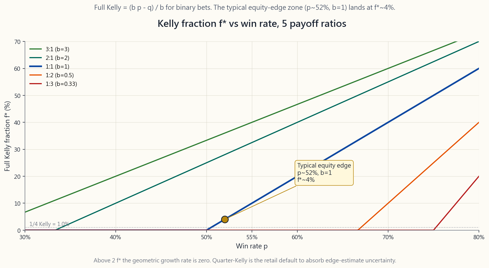
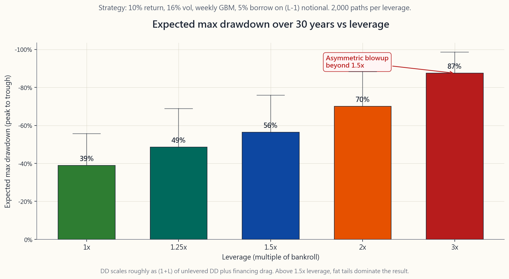

# 第41週：風險管理——部位規模控管、停損、凱利公式與資金保全

---

## 第一部分：閱讀單元

---

### 1. 為何這個主題至關重要

你讀過的每一個散戶爆倉故事，骨子裡都長得一模一樣。投資人對*方向*的判斷通常是對的，錯的是*規模*——而且錯得離譜。那張Reddit截圖上寫著「SPY週選擇權虧損五萬美元」，背後幾乎從來不是一個爛論點的故事，而是一個還不錯的論點、卻壓上了資金四倍以上部位的故事。部位規模控管是整個投資領域最被低估的紀律，它決定了誰能複利三十年、誰在三年內爆倉。

你需要掌握這個主題，原因有四。

1. **規模是你唯一能完全掌控的旋鈕。** 你無法讓市場趨勢上漲，也無法強迫你的優勢是真實的。但在你按下買進鍵之前，你絕對可以選擇把多少比例的資金押在這筆交易上。這個單一決策對長期財富的影響，遠超過任何觀點、任何選股、任何時機判斷。
2. **回撤的數學是不對稱的。** 跌50%需要漲100%才能回本；跌75%需要漲300%；跌90%需要漲900%。規模控管決定你最大回撤的深度，而回本所需的代價是非線性成長的。要做到「撐得比市場的非理性更久」，沒有規模控管是不可能的。
3. **優勢是不確定的，凱利公式也是不確定的。** 凱利公式告訴你，*假設*你對優勢的估算是正確的，幾何成長率最大化的下注比例是多少。但在股票市場，你對優勢的估算不可能精確到小數點後第三位。分數凱利——四分之一甚至八分之一的完整凱利——才是面對這種不確定性的誠實答案。
4. **槓桿是每一個錯誤的隱形乘數。** 兩倍槓桿讓你的報酬翻倍，*也*讓波動性翻倍。但對最大回撤而言，關係更接近乘法：1倍槓桿下跌25%，在2倍槓桿下大約變成跌50%。一個年化波動性16%的股票帳戶，用三倍槓桿，就能把一個原本可以熬過去的空頭市場變成追繳保證金事件。爆倉是非線性的。

這堂課將帶你走過凱利公式、分數凱利、每筆交易1-2%的法則、停損與避險的差異、多部位帳戶的相關性調整規模控管，以及槓桿與回撤的數學。最後，我們將把所有內容拉回到這個核心：波動性有肥尾，而償債能力比正確更重要。

---

### 2. 你需要知道的事

#### 2.1 凱利公式——幾何成長最佳化的下注規模

約翰·凱利（Bell Labs，1956年）問了一個簡單的問題：如果我反覆下注且具有優勢，每次應該押多少比例的資金，才能最大化長期財富的*幾何*成長率？對於二元勝負的賭注，答案是：

$$ f^* = \frac{b p - q}{b} $$

其中：

- $p$ = 獲勝機率，
- $q = 1 - p$ = 輸掉的機率，
- $b$ = 獲勝時的淨賠率（1:1的賭注 $b = 1$，2:1的賭注 $b = 2$）。

代入55%正面的硬幣、賠率1:1：$f^* = (1 \cdot 0.55 - 0.45) / 1 = 0.10$。凱利說每次下注資金的十%。超過十%，幾何成長率就會下滑。超過二十%——兩倍凱利——你的預期長期成長率變為*零*。超過 $f = 2 f^*$，即使你具有正向優勢，只要次數夠多，你在數學上就保證會把自己搞垮。

對於股票策略，勝率鮮少超過55%，平均盈虧比也鮮少超過1.5。典型的設定可能是 $p = 0.52$、$b = 1$，得出 $f^* = 0.04$——大約每筆交易押資金的四%。這就是你所在的世界。你不在1956年的賽馬場，你在一個近乎公平翻硬幣的世界，凱利的輸出結果是個位數的百分比。

此圖顯示完整凱利 $f^*$ 在五種賠率比下作為勝率 $p$ 函數的結果。請注意三件事。第一，在典型股票優勢點（$p \approx 0.52$，$b = 1$），完整凱利約為四%。第二，曲線比人們預期的更陡——勝率從50%升至55%，凱利值增加約三倍。第三，當 $p < q / b$（無優勢邊界）時，凱利值為負，這是數學在禮貌地告訴你不要接受這筆賭注。

#### 2.2 分數凱利——面對優勢不確定性的誠實答案

完整凱利假設你*知道*自己的優勢。實際上，你是從有限的歷史紀錄中估算 $p$ 和 $b$，而那個估算的標準誤差是很大的。愛德華·索普（Edward Thorp）是擊敗拉斯維加斯21點並經營避險基金長達二十年的數學家，他對所有操作都採用**二分之一凱利**。$k$ 分數凱利的通用公式為：

$$ f_k = k \cdot f^* $$

其中 $k$ 通常選擇 $0.5$（半凱利）、$0.25$（四分之一凱利）或 $0.125$（八分之一凱利）。有兩個原因讓分數凱利成為預設值，而非完整凱利。

第一，**下注不足的幾何成長懲罰是溫和的**。半凱利可以獲取約75%的最優成長率；四分之一凱利仍能獲取約44%。然而，*過度下注*的懲罰則是嚴重且不對稱的：在兩倍凱利時成長率為零，超過這個點就會虧損。因此偏向低於最優值是廉價的保險。

第二，**變異數的降低幅度巨大**。半凱利將回撤幅度大致減半；四分之一凱利再進一步削減。對於年化波動性30%的策略，完整凱利可能產生高達80%的回撤；四分之一凱利將其控制在25%以下。「撐得比市場的非理性更久」正是四分之一凱利成為股票策略業界標準的全部原因。

給散戶的誠實守則：當你對個股有方向性觀點時，**以四分之一凱利或更小比例進行規模控管**。對指數層面的觀點，同樣適用。完整凱利是為了算牌後的21點賭桌。它不適用於你的退休帳戶。

#### 2.3 每筆交易1-2%的停損法則

專業交易人日常很少用凱利的思維框架，他們的框架要簡單得多：*我願意在這個單一部位上損失的最大金額是多少？* 標準守則是**總資金的一至二%**。

操作方式：若你的資金是100,000美元，每筆交易的最大虧損是1%，你願意在這筆交易上損失1,000美元。若你在一檔100美元的股票上設停損於95美元，你的部位規模是 $1{,}000 / 5 = 200$ 股——20,000美元的名目部位。若停損設在98美元，部位規模是 $1{,}000 / 2 = 500$ 股——50,000美元。**決定股數的是風險金額，而不是反過來。**

為什麼1-2%的範圍有效：

- 每筆虧損2%，連續二十筆虧損產生約 $1 - 0.98^{20} \approx 33\%$ 的回撤。可以熬過去。
- 每筆虧損5%，連續二十筆虧損產生約 $1 - 0.95^{20} \approx 64\%$ 的回撤。職業生涯終結。
- 每筆虧損10%，連續二十筆虧損後剩下約 $0.9^{20} \approx 12\%$ 的初始資金。遊戲結束。

1-2%法則並不假設你是一位出色的交易人，它假設你是一位早晚會遇上連敗期的普通交易人。以2%規模控管，你能熬過那段連敗。以10%規模控管，你熬不過。

#### 2.4 停損與避險——兩種不同的工具

**停損**是一種退出機制。你在進場前就決定好，當股價跌至哪個位置時，你將平倉並接受損失。交易就此結束——不再有上行空間，也不再有下行風險。執行方式：在券商設定停損單，或設定一個你確實會遵守的心理停損點。

**避險**是一種上限損失的保護覆蓋層，讓*部位保持開倉*。買進100股SPY於520美元，搭配500美元的保護性賣權：你的最大損失被限制在每股20美元加上權利金，*同時*你保留了520美元以上（扣除權利金）的所有上行空間。部位仍然存活，只是截斷了尾端風險。

選擇兩者的三條準則：

1. **當你的觀點取決於某個事件時，使用停損。** 若某個關鍵財報數字、FDA決定或聯準會會議可能使你的論點失效，在消息公布後停損平倉。堅守一個已被反駁的論點沒有意義。
2. **當論點正確但路徑波動時，使用避險。** 若你認為NVDA在12個月的時間框架內估值合理，但你無法忍受中途-30%的回撤，就為它做「領口策略」（買進股票＋賣出價外買權＋買進價外賣權）。你讓長期論點保持存活，同時限制了路徑層面的痛苦。
3. **當部位夠小，不需要任何保護時，兩者都不用。** 這是最少人採用的選項。1%的部位不需要停損，也不需要避險。25%的部位兩者都需要。部位規模控管是你買過最廉價的保險。

停損有一個已知的失敗模式：跳空風險。若隔夜消息讓股票在停損價以下跳空開盤，你以開盤價成交，而非停損價。用選擇權進行避險就沒有這個問題，因為賣權已買在你的帳戶裡了。

#### 2.5 多部位帳戶的相關性調整規模控管

每筆交易1-2%的法則假設各筆交易*彼此獨立*。但它們並不獨立。若你同時做多十檔科技股，當那斯達克下跌5%，十檔全部一起動。你的實際單筆曝險遠高於每筆交易法則所暗示的水準。

解決方法是以**相關性風險金額桶**的思維取代個別交易。一個簡單框架：

- 同一類股的所有股票算作一個桶，將該桶的總風險金額上限設在6-10%。
- 與單一總體因子（利率、美元、油價）相關的所有部位算作一個桶，同樣上限。
- 在每個桶*內部*，再套用1-2%的每筆交易法則。

具體而言：若你想做多六檔半導體股，不要每檔都設2%。將*整個科技類股桶*設為8%，再分配到六檔——約每檔1.3%。當該類股逆轉時，你的損失由桶的上限決定，而非各部位相加。機構版本的這個做法叫做**風險平價**：以波動性反比加權部位，再用共變異數覆蓋層縮減相關賭注。散戶不需要矩陣代數；桶的法則就能獲取80%的效益。

#### 2.6 槓桿與回撤——不對稱的爆倉風險

槓桿同時放大報酬和變異數，但它對回撤的影響是**非線性且不對稱的**。直觀理解：

$$ \text{回撤}_{\text{槓桿}} \approx (1 + L) \cdot \text{回撤}_{\text{無槓桿}} \quad \text{（加上融資拖累）} $$

一個多元分散的股票帳戶，在無槓桿下的峰谷回撤為-25%，在2倍槓桿下大約變成-50%，在3倍槓桿下變成-75%。再加上借貸成本（目前散戶保證金利率約5%/年），而這筆拖累是在回撤期間侵蝕你的淨值的，偏偏那正是你最無法承受的時刻。

此圖模擬一個預期報酬10%、年化波動性16%的策略，在槓桿倍數1.0至3.0的範圍內，30年期間的預期最大回撤。請注意曲線形狀。從1.0到1.5，曲線大致線性爬升——尚在可控範圍。從1.5到2.0，曲線向上彎曲。超過2.0後，曲線幾乎垂直：在3倍槓桿下，三十年間的預期最差回撤約為-85%，這是一種委婉的說法，意思是*追繳保證金、在最糟糕的時刻被強制平倉、帳戶關閉*。

結論：1.5倍以上的槓桿是另一種運動。你可以用，但你必須將*標的*部位大幅縮減，才能讓*槓桿後*的回撤維持在可生存的範圍。這樣一來，槓桿的意義就消失了。肥尾波動性在這裡全力運作：波動性在教科書裡是常態分布，在現實中是肥尾分布，而槓桿讓肥尾變得無法生存。

#### 2.7 資金保全的心態

這堂課的所有內容，都建立在一個核心心智模型之上：**你的資金本身就是資產**。交易只是資金透過其成長或縮減的工具。你的工作不是「贏得這筆交易」，而是*持續留在場上*——在市場可能製造的任何結果序列中保持償債能力，讓長期優勢有時間複利。

這就是「市場保持非理性的時間，可能比你保持償債能力的時間更長」這句話的意義。在2022年爆倉的投資人，不是那個對聯準會判斷錯誤的人。在2022年爆倉的投資人，是那個對聯準會判斷正確、卻以完整凱利規模下注、用了3倍槓桿、又沒有任何避險的人。論點是對的，規模不對。

資金保全守則，依優先順序排列：

1. 任何單一交易的虧損，永遠不超過資金的1-2%。
2. 任何單一類股或因子的虧損，永遠不超過資金的6-10%。
3. 股票部位的槓桿永遠不超過1.5倍；若底層策略本身就有較高波動性（選擇權、加密貨幣、單一個股），則不超過1.0倍。
4. 在你擁有十年樣本外績效能夠證明優勢估算之前，永遠以四分之一凱利或更小比例進行規模控管。
5. 永遠知道什麼情況會讓你血本無歸，並以選擇權的思維來定價那個預防措施。

這五條守則不會讓你致富。讓你致富的是技能、時間和真實的優勢。但這些守則會讓你*在場上待得夠久*，讓技能、時間和優勢發揮效用。這就是全部的意義。

---

### 3. 常見迷思

1. **「部位越大，利潤越大。」** 在預期報酬上是線性的，在幾何現實中不是。超過 $2 f^*$，你的成長率歸零。超過 $3 f^*$，即使具有正向優勢，你依然在虧錢。
2. **「我有優勢，所以應該下完整凱利。」** 你並不*知道*自己的優勢。半凱利能獲取75%的成長率，同時將回撤減半。四分之一凱利才是散戶的預設值。
3. **「設停損就代表我虧錢。」** 設停損代表你*控制*了虧損的幅度。另一個選項是讓市場來決定。
4. **「避險很貴。」** 和追繳保證金相比，避險是你帳單上最便宜的一項。正確的比較不是避險成本對零，而是避險成本對概率加權後的爆倉代價。
5. **「2倍槓桿讓報酬翻倍。」** 它也讓你的變異數翻倍，並大致讓回撤翻倍。預期幾何報酬是 $L \mu - 0.5 L^2 \sigma^2$——對 $L$ 並非線性。
6. **「槓桿型指數股票型基金提供永久的2倍曝險。」** 它們提供的是每*日* 2倍曝險。長期而言，波動性耗損每年約扣除 $0.5 (L^2 - L) \sigma^2$。詳見第37週。
7. **「我的部位彼此不相關。」** 同一類股的股票在正常時期相關性為0.6-0.9，在崩盤時為0.95以上。相關性在你最需要分散投資的時刻趨近於1。
8. **「我可以用心理停損。」** 心理停損在交易虧損時會失效，而那偏偏是它唯一重要的時刻。請用券商的停損單，否則就不要設停損。
9. **「風險管理是輸家才做的事。」** 風險管理是讓贏家持續獲勝的手段。那些開業三十年的避險基金，正是因為有說「不」的風控長。
10. **「連勝之後我會加大風險。」** 這完全搞反了。應在*資金增長之後*加大風險，永遠不是在*連勝之後*。這是兩個不同的訊號。

---

### 4. 問答單元

**問1：我有50,000美元，想要每筆交易風險1%。股票現價80美元，停損設在76美元。我能買幾股？**
每筆交易風險金額 = 500美元。每股停損損失 = 4美元。部位規模 = $500 / 4 = 125$ 股 = 10,000美元名目部位（帳戶的20%）。部位是帳戶的20%，但*風險*是1%。這就是規模控管所帶來的區別。

**問2：為什麼用四分之一凱利而不是半凱利？**
半凱利假設你對優勢的估算誤差是適中的。對於裁量型股票交易，優勢估算誤差往往很大（你是從小樣本中猜測52-54%的勝率）。四分之一凱利將這種不確定性內建進去了。若你有一個具有數千筆交易記錄且參數穩定的真正機械式策略，半凱利是可以辯護的。

**問3：我應該用移動停損還是固定停損？**
固定停損對短線交易更清晰——你定義了論點，定義了論點失效的條件，在失效時退場。移動停損對趨勢跟隨部位更好，你希望讓獲利部位繼續奔跑，同時隨著部位向有利方向移動來鎖定獲利。它有一個已知的失敗模式：雜訊把你停損出場，然後趨勢繼續。

**問4：賣出現金擔保賣權算是「避險」嗎？**
不算。賣出賣權是一種*放空波動性*的收益型交易，有有限的上行空間（權利金）和較大的有限下行空間（履約價減去權利金）。它不是避險——它增加了風險。買進賣權才是避險。

**問5：選擇權交易應如何控管規模？**
選擇權的規模控管應基於**最大損失**，而非名目金額。買入買權的最大損失 = 權利金，將權利金控制在資金的1-2%。賣出賣權的最大損失 = 履約價減去權利金，將*那個金額*控制在資金的1-2%——這遠小於已收取權利金的1-2%。

**問6：我朋友靠TSLA讓帳戶翻倍，我應該加大規模嗎？**
不應該。他下了一個未經規模控管的賭注，然後在單次抽籤中得到好結果。正確的比較應是*一千次抽籤之後*，未經規模控管的策略以機率一趨向歸零。把他的結果當作一個倖存者偏差的數據點，而不是一個規模控管的處方。

**問7：一個買進持有的投資人，合理的最大槓桿是多少？**
免稅延緩帳戶維持1.0倍；應稅保證金帳戶使用箱式價差融資可達1.0至1.25倍；1.5倍僅限於有書面的回撤計畫並保留明確流動性準備。超過1.5倍屬於槓桿交易，不是買進持有投資。

**問8：我如何知道自己是否過度規模控管？**
睡眠測試。如果部位單日下跌3%會影響你當晚的心情，代表你的規模太大了。部位應該小到最糟糕的可能單日虧損只是令人惱火，而不是令人痛苦。

**問9：同時持有多個部位時，凱利公式應如何應用？**
對於獨立部位，各部位 $f^*$ 值相加。對於相關部位，各部位 $f^*$ 值之和除以有效相關性係數。第2.5節的桶規則是實際的捷徑。

**問10：1-2%法則適用於長期指數投資嗎？**
不適用——它適用於有明確論點失效點的主動交易。你退休帳戶裡的100%指數配置並非「違反法則」，那是另一種類別的資金，有著不同的時間視野。這個法則適用於你的*交易部分*，不適用於你的買進持有部分。槓鈴策略的設計正是為了把這兩部分分開。

**問11：這與四資金分配框架如何連結？**
每個分配各有其規模控管法則。成長部分：追蹤指數，無每筆交易法則。收益部分：部位規模 = 殖利率目標 / 資產殖利率。價值儲存部分：固定配置，定期再平衡。選擇性部分（Opt）：這是凱利、分數凱利和1-2%法則的所在地。風險管理紀律在Opt分配中聲音最響亮，因為那是未經規模控管的爆倉發生之處。

**問12：我能把凱利公式用在加密貨幣上嗎？**
你可以算出來。問題在於你對 $p$ 和 $b$ 的估算遠不如股票可靠，而且加密貨幣回撤分布的左尾比凱利公式底層的常態模型更肥。用八分之一凱利或更小，並把所有規模控管視為暫定值，直到你有跨越多個週期的歷史紀錄。

---

## 第二部分：YouTube腳本

---

**影片標題：** 部位規模控管——投資中最被低估的紀律
**目標片長：** 約18分鐘
**主持人：** 陳馬、小魚

---

**[開場 — 0:00]**

**小魚：** 歡迎回到頻道。我是小魚，一如既往和陳馬一起為大家服務。陳馬，今天的主題是部位規模控管、停損和凱利公式。告訴我，為什麼你說這是大多數散戶最容易跳過的一課？

**陳馬：** 因為它是看不見的工作，小魚。選股感覺像是在投資，正確控管規模感覺像是在做行政。所以大多數人把九成時間花在選股上，一成時間花在規模上——而這恰恰是反的。規模控管對長期財富的影響，超過你這輩子做的任何一個單一選股決策。

**小魚：** 違反直覺。

**陳馬：** 完全違反直覺。先說結論。兩個投資人對同一檔股票持有完全相同的論點。投資人A用資金的5%進場，以四分之一凱利下注。投資人B用50%進場，採完整凱利並加了保證金貸款。論點相同，方向相同，每元部署的報酬相同。二十年後，A複利到了一筆財富。B在第三年到第七年之間的某個時間點爆倉了，幾乎是被數學所保證的。

**小魚：** 即使B是對的？

**陳馬：** *尤其*是B平均而言是對的。因為「平均而言是對的」包含了連續三到四筆虧損交易，而B的規模讓那段連敗變得致命。核心概念很簡單：市場保持非理性的時間，可能比你保持償債能力的時間更長。如果你已沒有償債能力，你的優勢就無從複利，它只是停止了。

---

**[第一節 — 凱利公式 — 1:10]**

**小魚：** 我們從凱利公式開始。你寫了公式：$f \text{ star} = (b p - q) / b$。

**陳馬：** 約翰·凱利，Bell Labs，1956年。他當時在研究資訊理論，然後發現同樣的數學可以應用在下注上。問題是：如果你在有優勢的情況下反覆下注，應該每次押多少比例的資金，才能最大化長期*幾何*成長率？

**小魚：** 為什麼是幾何，而不是算術？

**陳馬：** 因為你在複利。一個有一半機率獲利100%、另一半機率虧損50%的賭注，算術預期是正的——$0.5 \times 1.0 + 0.5 \times (-0.5) = 0.25$，也就是+25%的預期報酬。但幾何上，你把2.0乘以0.5，又回到原點。你的幾何成長率是零。凱利最大化的是幾何成長率。

**[VISUAL: image/week41_kelly_curve.png]**

**小魚：** 這張圖在顯示什麼？

**陳馬：** 完整凱利比例 $f$ star 對應勝率 $p$ 的函數，在五種不同的盈虧比下的曲線。看中間那條線，也就是1:1的情況——那是一枚略有優勢的硬幣。在 $p = 0.52$，也就是一個具有溫和正向預期的股票策略的大概水準，完整凱利大約是4%。四%的資金每筆交易。這是*完整*凱利——已經是最大值了。

**小魚：** 那四分之一凱利就是1%。

**陳馬：** 每筆交易1%，沒錯。大多數認真的散戶交易人就活在這裡。原因不是迷信——而是優勢不確定性的數學所致。

---

**[第二節 — 分數凱利 — 4:00]**

**小魚：** 帶我走過為什麼分數凱利是預設值。

**陳馬：** 兩個原因。第一，下注不足的懲罰是溫和的。半凱利可以獲取完整凱利成長率的約75%；四分之一凱利仍然拿到44%。相比之下，過度下注的代價：在*兩倍*凱利時，你的預期成長率是*零*，超過那個點，即使具有正向優勢，你也在虧錢。所以稍微偏小的代價很小；稍微偏大的代價是災難性的。

**小魚：** 懲罰不對稱。

**陳馬：** 對。第二個原因——變異數。股票部位的完整凱利可能產生70-80%的回撤。四分之一凱利把它控制在25%以下。記住：讓你職業生涯終結的是回撤，不是平均報酬。愛德華·索普在他的避險基金裡，對所有操作都採用半凱利，持續了二十年。如果索普都能接受半凱利，你也可以接受四分之一凱利。

---

**[第三節 — 1-2%法則 — 6:00]**

**小魚：** 大多數專業交易人日常並不用凱利的思維框架，對嗎？

**陳馬：** 不用，他們以每筆交易的風險金額來思考。標準守則：**任何單一交易的虧損，永遠不超過資金的一至二%**。就這樣。無論你的規模計算給出什麼結果，都把它限制在2%。

**小魚：** 舉個數字例子？

**陳馬：** 資金100,000美元，最大虧損1%，也就是風險金額1,000美元。你看上一檔80美元的股票，停損設在76美元。停損點的每股損失是4美元。所以你能買250股——名目金額約20,000美元。停損決定了部位規模，不是反過來。

**小魚：** 如果你的停損更緊呢？

**陳馬：** 停損越近，部位越大。停損設在78美元而非76美元——每股損失是2美元——你能買500股，40,000美元的名目部位。同樣的風險金額，兩倍的名目金額。人們常常把這搞反——先決定股數，再讓停損移動；這就是1%的交易變成5%虧損的方式。

---

**[第四節 — 停損與避險 — 8:30]**

**小魚：** 什麼時候該用停損，什麼時候該用避險？

**陳馬：** 三條準則。第一：當你的論點可能因某個已知事件而失效時，用停損。財報、FDA決定、聯準會會議。論點消亡，交易消亡。第二：當論點正確但*路徑*波動時，用避險。你認為NVDA明年估值合理，但你不想扛過-30%的中途低谷。用領口策略——買進股票、賣出價外買權、買進價外賣權。部位繼續存活，尾端風險被截斷。

**小魚：** 第三條呢？

**陳馬：** 當部位小到不需要任何保護時，兩者都不用。1%的部位不需要停損。25%的部位兩者都需要。部位規模控管是你買過最廉價的保險。

**小魚：** 停損的失敗模式是什麼？

**陳馬：** 跳空風險。股票在80美元收盤，你的停損是76美元，隔夜消息讓它跳空開在65美元——你以65美元成交，不是76美元。買進賣權沒有這個問題，因為那張賣權已經在你的帳戶裡了。

---

**[第五節 — 相關性調整規模控管 — 11:00]**

**小魚：** 多個部位同時持有怎麼辦？

**陳馬：** 每筆交易1-2%的法則*假設*各筆交易彼此獨立。但它們不是。如果你同時做多十檔半導體股，那斯達克下跌，十檔全部一起動。你的實際單筆曝險遠高於十個分開的2%交易所暗示的水準。

**小魚：** 怎麼解決？

**陳馬：** 把相關性高的股票放進同一個桶。所有半導體是一個桶，設定桶的總風險金額上限為6-10%。然後在桶*內部*套用1-2%法則——六檔半導體在8%的桶上限下，每檔約1.3%。當該類股逆轉，你的損失由桶的上限決定，而非各部位相加。機構版本用共變異數矩陣做風險平價。散戶用桶的算術來實現，抓到了80%的效益，道理一樣。

---

**[第六節 — 槓桿與回撤 — 13:00]**

**小魚：** 我們來聊槓桿。你說了一件違反直覺的事——2倍槓桿大致上讓回撤*翻倍*。

**陳馬：** 更接近乘法而非加法，是的。一個多元分散股票帳戶，無槓桿的峰谷回撤-25%，在2倍槓桿下大約變成-50%，在3倍下變成-75%。再加上借貸成本——目前散戶保證金利率大約5%/年——而這筆拖累是在回撤期間侵蝕你的淨值，偏偏那是你最無法承受的時刻。

**[VISUAL: image/week41_leverage_drawdown.png]**

**陳馬：** 這張圖模擬一個預期報酬10%、年化波動性16%的策略，在槓桿倍數1.0至3.0的範圍內，30年期間的預期最大回撤。看這個形狀。從1.0到1.5，曲線大致線性爬升——勉強可控。從1.5到2.0，曲線向上彎曲。超過2.0，曲線幾乎垂直。在3倍槓桿下，三十年間的預期最差回撤約為-85%。那不叫回撤，那叫追繳保證金，接著是強制平倉，接著是帳戶關閉。

**小魚：** 爆倉是非線性的。

**陳馬：** 爆倉是*激進地*非線性的。肥尾波動性在這裡全力運作：波動性在教科書裡是常態分布，在現實中是肥尾分布，而槓桿讓肥尾變成了無法生存的尾端。

---

**[第七節 — 互動操作演示 — 15:00]**

**小魚：** 我們來打開部位規模計算工具。

**[VISUAL: interactive/week41_position_sizer.html]**

**陳馬：** 五個滑桿。資金規模、每筆交易最大虧損百分比、每筆交易的預期優勢（基點）、你對優勢的信心——也就是凱利比例，從0到1——以及每筆交易的波動性。

**小魚：** 讓我設定：資金10萬、最大虧損1%、優勢50基點、信心0.25——四分之一凱利——波動性5%。

**陳馬：** 輸出結果是建議部位規模、最大同時持倉數量、一千筆交易後的預期回撤，以及爆倉機率。以這些設定，計算工具應該給你大約每個部位10,000美元、同時持有十個部位、預期回撤約15%、爆倉機率趨近於零。

**小魚：** 現在我把信心調到1.0——完整凱利——波動性拉到12%。

**陳馬：** 看爆倉機率。它從趨近於零跳到數個百分比。這就是整張圖表要傳達的重點。你對優勢估算的信心，是「複利三十年」與「第五年前爆倉」之間的那個槓桿。好好玩玩看，感受一下這個形狀。

---

**[結尾 — 17:30]**

**小魚：** 最後一句話，陳馬。

**陳馬：** 和每一堂風險課的結論一樣：規模是你唯一能完全掌控的旋鈕。你無法讓市場趨勢上漲，也無法強迫你的優勢是真實的。但在你按下買進鍵之前，你絕對可以選擇把多少資金押在上面。這個單一決策對你長期財富的影響，超過任何觀點、任何選股、任何時機判斷。核心概念是撐得比市場的非理性更久。警示是波動性在現實中有肥尾，尤其在槓桿之下。四分之一凱利。每筆交易一至二%。把相關性高的賭注放進桶裡管理。槓桿上限1.5倍。用停損面對論點事件，用避險面對路徑波動。這就是這門紀律。它不會讓你致富，但它會讓你在場上待得夠久，讓你*有機會*致富。

**小魚：** 謝謝收看，我們下週見。