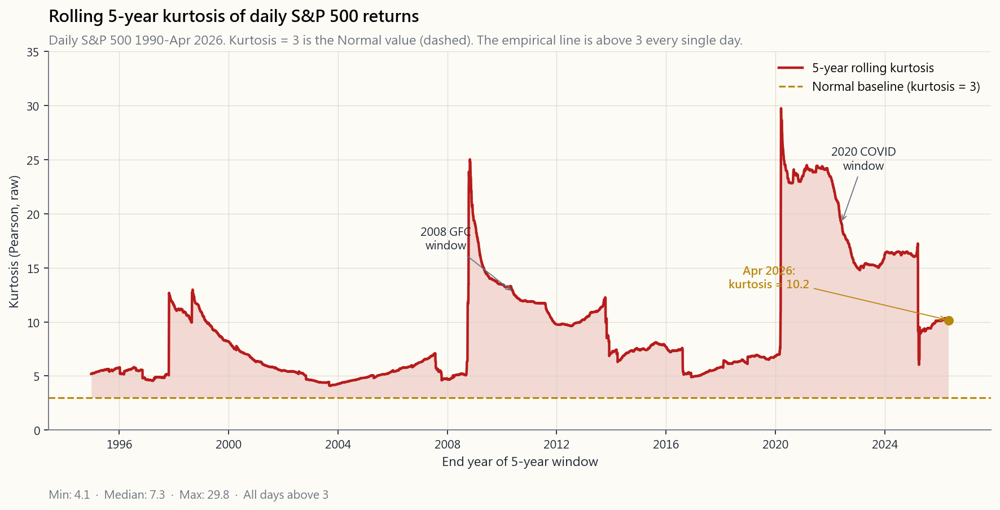

# 第四十二週：風險值與風險模型——參數法、歷史法、蒙地卡羅法，以及三者為何都在尾部失效

---

## 第一部分：閱讀單元

---

### 1. 為什麼這很重要

上週我們建立了風險管理的概念框架：部位規模、停損規則、情境思考，以及投資組合的損失如何在各部位之間進行預算分配。本週我們把數字放進去。

**風險值（VaR）**是全球引用最頻繁的單一風險數字。每一家銀行、避險基金、退休基金和保險公司的資產負債表，都在某處運行著一套風險值系統。**條件風險值（CVaR）／預期損失（ES）**是它更聰明的表親——自2016年《巴塞爾協議III》起被列為必要指標，正是因為單純的風險值在2008年災難性地失敗了。兩者都源自同一個想法：取得投資組合可能結果的機率分布，觀察壞日子有多壞，然後報出一個單一的美元數字。

你需要了解它們，原因有四。

1. **共同語言。** 當交易對手說「我們的1日99%風險值是四千萬」，這是一個精確、可驗證的主張。如果你無法將其解讀為「他們預期每一百個交易日中有一天會損失至少4,000萬美元，且我們完全不知道最壞的那天會有多慘」，你就無法評估這個說法。
2. **三種計算方法，三套謊言。** 參數法風險值假設報酬呈常態分布——這是錯的，在尾部尤其如此。歷史法風險值對過去進行重新抽樣——而那只不過是你碰巧抽到的那段歷史。蒙地卡羅法風險值要求你指定一個模型——而你的模型不過是個猜測。三種方法在最關鍵之處分歧最大：在99%和99.9%的百分位數，以及每個十年中最糟糕的那一週。
3. **厚尾問題。** 自1990年以來的5年滾動窗口中，美國股票日報酬的峰度介於7至15之間，從未接近常態分布的理論值3。參數法在95%信賴水準下低估實際損失約10至30%。在99%水準下低估2至5倍。在99.9%水準下，幾乎可說是科幻小說。
4. **CVaR是監管機關現在使用的指標，也是你應該使用的。** 巴塞爾委員會在2016年《交易簿根本審查》中以預期損失取代風險值，正是因為CVaR對*整個*尾部取平均值，而非只讀取分布上的某一點。它更保守、更難被操弄，且在數學意義上具備風險值所欠缺的一致性（coherence）。

本課最後的核心結論：*參數法風險值在95%信賴水準下尚可，在99.9%水準下毫無用處，而這兩者之間的差距，吞噬了1998年的長期資本管理公司、2008年的結構性信貸交易部門，以及2020年3月的槓桿波動率目標策略基金。*

---

### 2. 你需要知道的事

#### 2.1 定義——一句話，三個參數

風險值是**在給定機率和給定期間內，不會被超過的最大損失**。永遠有三個參數：

1. **信賴水準** $\alpha$。典型值：95%、99%、99.5%、99.9%。其補數 $1-\alpha$ 是我們所衡量的尾部機率——在99%的情況下，我們看的是最壞1%的結果。
2. **時間期間** $T$。典型值：1日、10日、1個月、1年。銀行交易部門使用1日；巴塞爾使用10日；資產配置者使用1個月或1年。
3. **貨幣金額。** 風險值數字本身，以美元計。

教科書標準說法：

> *1日99%風險值 = \$5,000,000* 的意思是：在每100個交易日中的99天，我們預期投資組合單日損失不超過5,000,000美元。在剩下的1天，損失可能更大——而風險值對於「大多少」保持沉默。

最後那句話才是重點。風險值告訴你的是損失*門檻*——有 $1-\alpha$ 的機率會超過這個門檻。它對於一旦突破後損失有多慘，完全無從得知。兩個投資組合可以有完全相同的99%風險值，卻有截然不同的99.9%風險值——一個損失上限為1,000萬美元，另一個則無上限。

#### 2.2 方法一——參數法（變異數—共變異數法）

最快速、最古老、也最常出錯的方法。假設日報酬呈常態分布，均值為 $\mu$，標準差為 $\sigma$。則在信賴水準 $\alpha$ 和期間 $T$ 下，風險值為：

$$ \text{VaR}_\alpha = -\big(\mu T - z_\alpha \,\sigma\sqrt{T}\big)\,V $$

其中 $V$ 為投資組合價值，$z_\alpha$ 為標準常態分布的分位數。常用的 $z$ 值如下：

| $\alpha$ | $z_\alpha$ | 尾部機率 |
|---|---:|---:|
| 90% | 1.282 | 10% |
| 95% | 1.645 | 5% |
| 97.5% | 1.960 | 2.5% |
| 99% | 2.326 | 1% |
| 99.5% | 2.576 | 0.5% |
| 99.9% | 3.090 | 0.1% |
| 99.99% | 3.719 | 0.01% |

代入標普500的日數據：$\mu \approx 0.04\%$（每日），$\sigma \approx 1.1\%$（每日）。對於100萬美元的投資組合：

- 1日95%風險值：$-(0.0004 - 1.645 \times 0.011) \times 1{,}000{,}000 \approx \$17{,}700$
- 1日99%風險值：$\approx \$25{,}200$
- 1日99.9%風險值：$\approx \$33{,}600$

這些是1990年代銀行試算表會算出的數字。現在來看看實際發生了什麼：1987年10月19日，標普500單日下跌**20.5%**。在參數模型下，這是一個 $z = 19$ 的事件——其機率為 $10^{-79}$，也就是說*從現在到宇宙熱寂都不應該發生*。然而它發生了。在一個星期一。在雷根執政期間。

光是這一個觀測值，就足以告訴你這個模型是錯的。

參數法風險值的**優點**：快速、可加總，且容易套用到擁有數千個部位的投資組合。變異數可加，相關性為線性，用試算表就能計算。

**缺點**：$\sigma$ 在平靜時期計算，然後被用來預測動盪時期；而常態分布的尾部之薄，是任何真實投資組合都從未見過的。*在95%水準下，它是一個估計值。在99%水準下，它是一個猜測。在99.9%水準下，它是虛構。*

#### 2.3 方法二——歷史模擬法

完全拋棄常態分布假設。取過去 $N$ 天的投資組合報酬（通常為250至1,000個交易日），排序後直接讀取第 $1-\alpha$ 個百分位數的實證值。若 $N=1000$ 且 $\alpha=99\%$，則99%風險值就是樣本中第10個最差的報酬。

實際範例：取SPY過去1,000個交易日的數據並排序，第10個最差值約為 $-3.6\%$。對於100萬美元的投資組合，1日99%歷史模擬法風險值為36,000美元——大約比上述參數法數字**高出40%**。歷史數據「記得」COVID，記得2018年第四季的波動性，並將那些日子與平靜日子等權重處理。

**優點**：不需要參數假設。如果過去有厚尾，你的風險值就會自動具備厚尾。

**缺點**：你只能看到已發生的事。如果你的1,000日窗口在2007年10月結束，你的數據中沒有2008年，一旦市場崩盤，你的99%風險值看起來就會像是95%。窗口要麼太短（不穩定、沒有尾部），要麼太長（混合了已不再適用的不同市場環境）。

部分的補救方案：**年齡加權抽靴法**（近期數據權重更高）或**篩選歷史模擬法**（將昨天的報酬重新調整為今日的波動率）。兩者都讓模型趨近於有經驗的從業者在看圖表時直覺上已在做的事。

#### 2.4 方法三——蒙地卡羅模擬法

指定一個模型。從中模擬 $M$ 條路徑。計算每條路徑的投資組合損益。排序後讀取百分位數。

模型可以是常態分布（這樣蒙地卡羅的結果會與參數法一致，僅有抽樣誤差）；或者是低自由度的學生t分布（較厚的尾部）；或者是區制轉換混合模型（平靜日來自某個常態分布，動盪日來自另一個）；或者是GARCH模型（今日的波動性依賴於昨日）；或者是跳躍擴散模型（常態噪音加上偶發的泊松跳躍）。

彈性完全自由。一個用於美國股票投資組合的典型「現代」蒙地卡羅模型，通常採用自由度為5至7的學生t分布——產生與實證分布近似匹配的尾部。這是2008年後銀行自營交易部門採用的模型。

**優點：** 可以捕捉非線性（選擇權、結構型商品）、路徑依賴的損益（障礙選擇權、可贖回債券），以及任何你能寫下來的非常態分布。

**缺點：** *垃圾進、垃圾出*。如果你的模型在尾部是錯的，你的蒙地卡羅風險值在尾部也是錯的——還帶著精確的假象。用錯誤的模型跑10萬條路徑，給的是一個充滿自信的錯誤答案。

誠實的從業者會同時跑三種方法，將三者之間的差距視為數字中無法消除的不確定性，並報告最保守（最大）的那個。

#### 2.5 CVaR／預期損失——尾部的平均值

CVaR（又稱預期損失，ES）回答了風險值迴避的問題：*在損失已超過風險值門檻的前提下，平均損失是多少？*

$$ \text{CVaR}_\alpha = \mathbb{E}[L \mid L \geq \text{VaR}_\alpha] $$

對於連續損失 $L$ 的常態分布，CVaR有封閉形式：

$$ \text{CVaR}_\alpha = \mu + \sigma\,\frac{\phi(z_\alpha)}{1-\alpha} $$

其中 $\phi$ 是常態分布的機率密度函數。在常態分布假設下，$\text{CVaR}/\text{VaR}$ 的比率在95%水準約為**1.25**，在99%水準約為**1.15**——意味著在常態性假設下，平均超標損失僅比風險值門檻大15至25%。從美國股票的實證數據來看，這個比率更接近**1.30至1.50**，在99%以上水準尤其如此。尾部不僅比常態分布預測的更厚；超標損失的*深度*也更大。

CVaR是**一致性的**（在Artzner-Delbaen-Eber-Heath，1999年的正式意義上）——意味著它滿足任何合理風險指標應具備的四個性質：單調性、次可加性、正齊次性和平移不變性。**風險值不具備一致性**——它對厚尾分布不滿足次可加性，意即兩個投資組合合併後的風險值可能*大於*各自風險值之和。這種數學病態具有實際影響：風險值可能激勵隱藏的尾部風險集中，而CVaR會對此加以懲罰。《巴塞爾協議III》正是因為這個原因，在2016年的《交易簿根本審查》中以97.5%水準的預期損失取代風險值。

#### 2.6 為何三種方法都在尾部失效

根本問題可以用一個數字來概括：**峰度**。

常態分布的峰度恰好為3（或超額峰度為零）。峰度越高意味著尾部越厚——在 ±3σ 以外的機率質量多於常態分布所允許的。

數據怎麼說？計算1990年以來標普500日報酬的滾動5年峰度，答案是：*從未接近3*。大多數時間介於7至15之間。包含1987年的窗口峰度超過30。包含2008年的窗口約為12。即使是2003至2007年這樣平靜的窗口，也約為5。

對風險值的影響：

- **在95%水準：** 參數法風險值低估5至15%。尚可接受。
- **在99%水準：** 參數法風險值低估30至100%。實質性影響。
- **在99.9%水準：** 參數法風險值低估**2至5倍**。毫無用處。
- **在99.99%水準：** 參數法風險值是客氣的虛構。

1998年長期資本管理公司的崩潰，在該基金的模型下並非百萬分之一的事件；事後來看，這是一個相當常見的50年一遇情境，只是模型看不到。2008年的抵押債券損失據高盛時任財務長大衛·維尼亞所說是「連續數天的25個標準差事件」——這是一份坦白書，說明模型的形狀本身就是錯的，而非世界異常。2020年3月，SPY在單一交易日下跌12%，而參數模型給予這種走勢的機率約為 $10^{-25}$。

正確的教訓不是「使用更複雜的風險值」。正確的教訓是：*風險數字都是估計值，無一例外，而尾部是估計值說謊最嚴重的地方*。尾巴搖狗的現象真實存在。你的風險系統必須包含對量化風險值倍數進行的明確壓力測試，無論模型說什麼是「不可能的」。

#### 2.7 整合應用——實務框架

嚴謹的投資人如何使用這些工具：

1. **同時跑三種方法。** 參數法、歷史法、蒙地卡羅法（自由度5至7的學生t分布是標準選擇）。觀察三者之間的差距。
2. **報告CVaR，而非VaR。** 97.5%的CVaR在薄尾分布下大致等同於99%的VaR，在厚尾分布下則實質上更保守。巴塞爾使用97.5%的CVaR；你也應該如此。
3. **永遠跑壓力測試。** 計算以下情境下的損失：1987年（單日-22%）、2008年（單日-9%，全年-38%）、2020年3月（單日-12%，單月-34%）、2022年（債券加股票同步回撤）。這些不是風險值事件；這些是*必須預先規劃*的事件。
4. **按尾部定規模，而非按平均值。** 採用啞鈴式投資組合。大部分部位配置在按正常波動率定規模的防禦性標的；小部分高信念部位配置在能限定損失的工具（長期選擇權、深度現金緩衝、有限風險垂直價差）。
5. **對標題數字打折扣。** 無論你的平台報告什麼99%的風險值，*在睡眠安穩的考量下將其翻倍*。過度保守的代價是損失幾個基點的機會。過度激進的代價是登上《華爾街日報》的訃聞版面。

**陳馬的看法——風險值是機構的表演，而散戶的解法是結構性的，而非統計性的。** 我看過這些模型在1998年、2008年和2020年3月失效，我對這些模型的理解是：風險值存在的主要原因，是監管機關和風險委員會需要一個數字放在投影片上。這是表演。它在你最需要風險數字的那些市場環境下，系統性地低報風險——波動率突然飆升的尾部擴張、由壓縮轉為擴張的市場制度轉換、選擇權尾部搖動股票狗並產生模型認為「不可能」走勢的那些日子。峰度7至15對比假設值3，不是一個小小的校準問題；這是模型形狀本身就是錯的。大型銀行每個週期都以淚水發現這一點，而回應永遠是在模型上增添更多花哨的功能，而不是承認模型本身的類別就是錯的。

散戶的答案不是更好的風險值。而是更好的*投資組合形狀*。我的帳戶採用啞鈴結構，搭配一個小型、持續性的長波動率和尾部避險部位，規模設定使得整個有避險的帳戶在最壞情況下的損失，是我為避險支付的*已知*權利金——而非事後由學生t分布告訴我的某個數字。非對稱部位受結構所限（長期選擇權、有限風險垂直價差、深度現金緩衝），因此最壞一週的CVaR是我在部位定規模時就選定的數字，而非事後才知道的數字。這才是反轉：與其對一個毫無保護的投資組合形狀計算風險，不如選擇一個最壞情況*在結構上就受到限制*的投資組合形狀，讓風險值成為合理性的驗證工具，而非核心的決策依據。

---

### 3. 常見迷思

1. **「99%風險值意味著最大損失受風險值限制。」** 不對。99%風險值是1%的結果會超過的門檻。它對超過多少毫無說明。最壞情況下的損失是無上限的。
2. **「信賴水準越高，就越保守。」** 對門檻本身而言是對的，但對*估計值的品質*而言並非如此。以1,000個交易日計算的99.9%實證風險值，字面上只用了一個觀測值。估計量的變異數極為龐大。信賴水準更高 ≠ 知道的更多。
3. **「如果參數法和歷史法的風險值一致，模型就沒問題。」** 它們通常在95%水準一致，在99%以上才出現分歧。平靜時期使得差異很小，即使底層模型是錯的。
4. **「風險值是監管標準。」** 曾經是。《巴塞爾協議III》在2016年轉向97.5%的預期損失，並在2023年的FRTB（交易簿根本審查）中全面落地。如果你還在引用原始風險值，你已經落後超過7年。
5. **「蒙地卡羅跑10萬條路徑比1,000條更準確。」** 只有*抽樣誤差*更小。*模型誤差*——所選分布的錯誤程度——並沒有改變。從常態分布模型跑一百萬條路徑，仍然給你常態分布尾部的答案。
6. **「分散投資永遠會降低風險值。」** 它會降低薄尾投資組合的風險值。但對於具有極端聯合依賴性（相關尾部事件）的厚尾投資組合，風險值可能不滿足次可加性——合併後的風險值可能超過各自風險值之和。CVaR沒有這個問題。
7. **「1日風險值可以乘以 $\sqrt{N}$ 換算成N日風險值。」** 只在獨立同分布的常態報酬下成立。真實報酬有波動率聚集和序列相關。平方根法則在壓力時期高估了時間分散效果帶來的風險下降。
8. **「風險值回測告訴你模型是否正確。」** 只是粗略地告訴你。一個模型可以通過250日回測並出現正確次數的超標，但CVaR完全錯誤——*門檻*對了，但*尾部質量*沒對。
9. **「壓力測試是主觀的；風險值是客觀的。」** 兩者都是主觀的。風險值的主觀性隱藏在分布選擇和回溯期窗口中；壓力測試的主觀性則在情境設定中公開說明。
10. **「CVaR只是風險值的小幅調整。」** 對常態分布而言是，95%水準的比率約為1.25。對實證股票數據而言，CVaR在99%水準可以是風險值的1.5倍——那個「小幅調整」是可承受的損失與被追繳保證金之間的差距。

---

### 4. 問答單元

**問：我的券商顯示1日95%風險值，我應該在意嗎？**
答：它是一個基準錨定點——當它顯示200美元時，你不應該對200美元的損失感到驚訝。但不要止步於此。在心裡把99%水準翻倍（散戶平台通常不顯示這個），99.9%水準乘以三，然後手動跑一個情境：「如果標普500單日下跌10%？」最後這個數字才是真正讓你夜裡能安眠的關鍵數字。

**問：巴塞爾III為什麼用97.5%而非99%？**
答：兩個原因。第一，在典型的厚尾股票分布下，97.5%的CVaR在保守程度上大致等同於99%的風險值，因此監管力道維持相近。第二，97.5%的CVaR估計值的抽樣變異數低於99%，因為它平均了更多觀測值。這是保守性與統計穩定性的最適點。

**問：風險值適用於選擇權投資組合嗎？**
答：參數法風險值對選擇權效果很差，因為其損益對標的資產是非線性的。「Delta-Gamma」近似法（線性加二次項）對小幅波動有幫助，但對尾部事件會失效。蒙地卡羅法若正確應用，是正確的工具——模擬標的資產路徑，在每條路徑下對選擇權重新定價，然後排序損益。歷史模擬法也適用。

**問：歷史法風險值的回溯期窗口應該多長？**
答：這是一個取捨。較短（250日）能快速反映當前市場環境，但遺漏了較早的危機。較長（1,000至2,500日）涵蓋更多危機，但混合了不同的市場環境。巴塞爾標準是使用250日的非調整窗口，加上壓力時期的覆蓋層。從業者通常以500至750日作為預設值。

**問：平方根時間換算法可靠嗎？**
答：對於均值回歸序列（波動率、信用利差），它會高估N日風險。對於趨勢序列（多頭市場中的純多股票），它會低估。對於獨立同分布序列，它是精確的。真實序列在壓力時期沒有一個是上述任何一種。把它當作粗略參考，而非精確計算。

**問：銀行為什麼偏好1日風險值，退休基金偏好1年風險值？**
答：行動頻率。銀行可以在一天內改變其帳簿，並以1日作為管理期間。退休基金的負債期長達數十年，其再平衡期間為年度；對於一個無法像自營交易部門那樣頻繁交易的投資長，1日風險值在操作上毫無意義。

**問：風險值和凱利準則有什麼關係？**
答：它們回答的是不同問題。凱利準則是*在已知優勢下的前瞻性部位規模設定*。風險值是*對當前部位的回顧性風險量化*。按凱利準則設定的部位，與其預期損失和破產機率有已知關係；風險值給你該損失分布的百分位數。兩者都應該在你的工具箱中。

**問：內含裸賣選擇權的投資組合，其CVaR/VaR會如何變化？**
答：CVaR/VaR可能暴衝。一個賣出的價外賣權，預期損失有限（若履約價很遠，風險值看起來不錯），但一旦跌破履約價，尾部損失無上限（CVaR的災難）。兩個95%風險值完全相同的策略，若一個持有賣出尾部風險的部位，另一個沒有，99.9%的CVaR可能天差地遠。這正是巴塞爾試圖根除的那種「隱藏尾部」。

**問：為什麼每次窗口中最壞的那天滾出去後，我的歷史法風險值數字就大幅跳動？**
答：因為歷史法就是字面上讀取有限樣本的百分位數。當2020年4月在2024年中從1,000日窗口中滾出後，99%風險值會機械性地下降約30%——*儘管投資組合本身完全沒有改變*。這是方法本身的人為現象，不是風險真正降低了。使用年齡加權或壓力時期覆蓋層來平滑這個問題。

**問：有沒有一個數字能同時整合風險值、CVaR和壓力測試？**
答：沒有，而這正是重點所在。風險是多維的。一個投資組合有正常日風險（波動性）、分位數風險（風險值）、平均尾部風險（CVaR）、最壞情況風險（壓力測試）、尾部依賴風險（聯合極端值）以及流動性風險（你真的能出場嗎？）。把這些壓縮成一個數字，正好扔掉了你在事情崩潰時最需要的那些資訊。

**問：我在家能算的最簡單、「夠用的」風險值是什麼？**
答：取你投資組合過去500個交易日的日報酬，排序後讀取第5百分位數（99%風險值）和第25百分位數（95%風險值）。計算最差5筆報酬的平均值——那就是你的99%條件風險值。這樣做的保守程度會超過90%的專業風險值系統，且只需要Excel。
