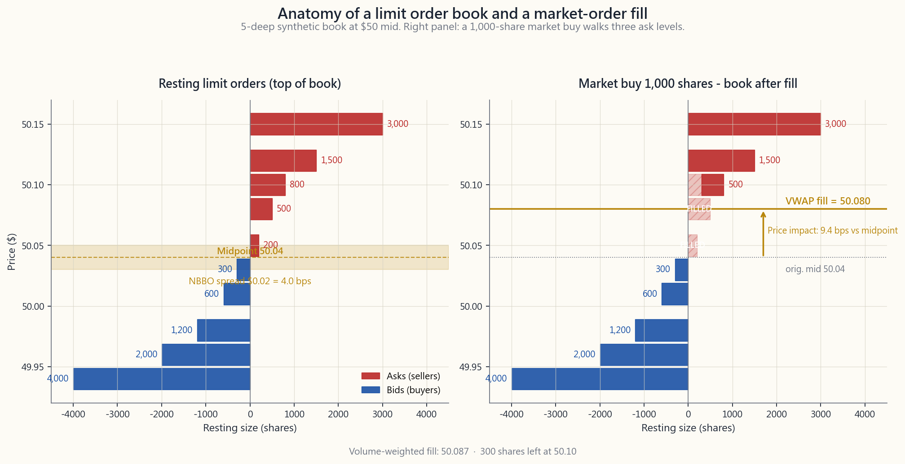
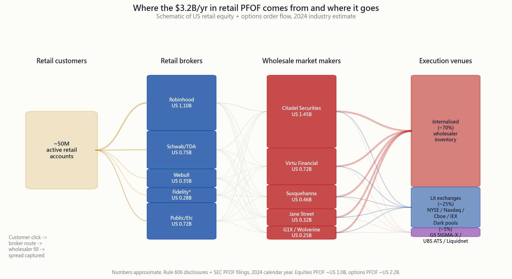

# 第四十四週：市場微結構——委託單類型、NBBO、暗池與委託單流量報酬

---

## 第一部分：閱讀章節

---

### 1. 為何這很重要

每一次在券商App上點擊「買入」，都會啟動一套路由機器，其背後的成本遠超表面上的零手續費。美國股票市場的底層架構——交易所、暗池、批發商、智慧委託單路由器、紐澤西州與芝加哥之間的微波連結——於2007年《全國市場系統規則》（Reg NMS）重塑後，二十年來一直悄悄從每一筆散戶與機構成交單中汲取數個基點。絕大多數投資人從未察覺，而這份無知，正是問題所在。

1. **隱性成本侵蝕報酬的可靠程度，遠超顯性費用。** 廣告上的手續費是零。但買賣價差、大單的價格衝擊、批發商截取的半個跳動點、TWAP在整個交易日內承擔的時機風險——加總起來，典型的散戶股票來回交易要付出5至30個基點，機構100萬美元單票則要付出30至80個基點。30年複利生涯中，持續20個基點的拖累，大約會侵蝕終期財富的6%。帳單你看不到，但它確實已被支付。
2. **委託單類型的選擇，是散戶真正擁有的少數免費槓桿之一。** 下午3:59在AAPL下市價單，與在NBBO掛可成交限價單，和在暗池掛中間價釘單，行為截然不同。結構性的阿爾法確實存在，但極為罕見，且幾乎已被高頻交易公司套利殆盡——留給散戶的是市場微結構素養的「防禦版本」：停止成為愚蠢的委託流量。
3. **流動性在最糟糕的時刻消失。** 2010年閃崩、2015年8月指數股票型基金錯位、2020年3月COVID跳空、2024年日圓套利平倉——每一次市場危機都印證著同一個事實：當實現波動性飆升時，造市商會擴大報價或直接撤單。波動率的尾部才是驅動整個系統的力量。若你的停損單是對某個流動性不足的標的掛了市價單，在波動事件發生時，你就會成為最低點那筆成交。
4. **散戶與機構在委託路由上的差距是真實存在的，規則只在小單上對你有利。** 委託單流量報酬（PFOF）批發商（Citadel Securities、Virtu、Susquehanna、Jane Street）實際上會以低於一分錢的幅度，對1,000股以下的散戶委託進行價格改善，因為散戶委託流量屬於「未知情交易」，內部化有利可圖。但當你的委託單大到看起來像知情交易時，同一套機制就開始向你收費——大約在5,000至10,000股，價格改善消失，滑價隨之出現。了解這個臨界點，能讓你避免不小心走穿委託簿。

本週的目的不是讓你成為交易員，而是讓你理解點擊「買入」之後究竟發生了什麼，讓你的成交結果不再成為你儲蓄的隱性稅負。

---

### 2. 你需要了解的知識

#### 2.1 Reg NMS、NBBO，以及市場碎片化存在的原因

《全國市場系統規則》（Reg NMS），於2007年生效，是維繫現代美國股票市場運作的規則手冊。你必須掌握其中兩項核心：**委託單保護規則（Rule 611）**——任何交易所不得以劣於其他交易所最佳顯示報價的價格成交——以及**NBBO（全國最佳買賣報價）**，即所有16家亮盤交易所的整合委託簿最優報價。

強制要求每個交易場所尊重其他交易場所報價的意外後果，是讓設立「更多」交易場所在經濟上變得理性。截至2026年4月，美國擁有16家登記在冊的股票交易所（紐約證交所、納斯達克、BATS/Cboe BZX/EDGX/BYX/EDGA、IEX、MEMX、MIAX、長期股票交易所等），以及約30家另類交易系統（ATS，即暗池）。每家交易所收取不同的造市/吃單回扣，券商的智慧委託單路由器根據回扣經濟效益、延遲時間與成交概率，將你的委託分拆至多個交易場所。你看到的是一筆以單一價格成交的委託；但該委託可能在200微秒內觸及五個不同場所。Reg NMS保證你的成交價不會劣於NBBO；但它無法保證你是否拿到了「中間價」——而價差成本正藏在那裡。

#### 2.2 委託單類型：市價、限價、停損、停損限價、IOC、FOK，以及演算法委託

散戶的選單包含六種固定委託單類型和約四種機構演算法委託。一次性掌握這些取捨，你便再也不會用錯委託單。

- **市價單。**「立即成交，不論價格。」保證成交，無價格保障。適用於上午11點買100股SPY，但對某$30小型股的5,000股或$200的低流動性選擇權合約而言，可能造成災難性後果。
- **限價單。**「以$X或更優的價格成交，否則不成交。」適用於任何超過200股的散戶交易，或任何價差超過一分錢的標的。「可成交限價單」（以賣價掛買入限價）能讓你獲得市價單的確定性，同時設有硬性天花板。
- **停損單/停損市價單。**「當最新成交觸及$X時，觸發市價單。」不得用於流動性不足的標的。在跳空低開-10%時，設在-5%的停損單，會讓你以-10%成交，而非-5%。
- **停損限價單。**在相同觸發條件下，觸發限價單而非市價單。可防止極差的成交價，但在跳空行情下可能完全無法成交。
- **IOC（立即或取消）。**以限價立即成交能成交的部分，其餘取消。由智慧委託單路由器用來同步詢問多個交易場所，避免殘留倉位。
- **FOK（全部成交或取消）。**以限價立即全數成交，否則全部取消。散戶罕用；用於需同步執行的大宗成交和套利組合腿。

在固定委託單之上，還有機構的**執行演算法**：TWAP（時間加權平均價格——在交易窗口內等量分拆）、VWAP（成交量加權——在成交量較大的開盤和收盤附近加重比例）、實施差距（Implementation Shortfall，依緊迫性前置執行）、以及POV（成交量佔比——追蹤目標參與率）。這些演算法的存在，是因為直接掛入50萬股的市價單，成交價格會比當天VWAP差50至200個基點，同時會向Secaucus一帶的每一套高頻交易程式「洩密」，讓對方知道有人在移動大量部位。

#### 2.3 暗池與15%至45%的場外成交占比

**暗池**是一種在交易前不顯示報價的另類交易系統。交易成交後才會列印至整合行情，在此之前，池外的任何人都不知道某位買方在$X的價位存在。截至2025年，美國約15%的股票成交量在正式暗池內執行（Goldman SIGMA-X、UBS ATS、Credit Suisse Crossfinder、IEX、Liquidnet），另有約30%透過批發商和單一交易商平台場外執行——合計「場外」成交量，在大多數日子占整合行情的40%至45%。

暗池存在的原因：一個5,000萬美元的機構買入計劃若在亮盤交易所公開展示，會讓Carteret的每一套高頻交易演算法前置搶跑。若同一筆大單能在暗池中以NBBO中間價與另一個自然賣方撮合，雙方都能省下價差並規避衝擊。暗池的爭議之處：池子運營商在歷史上曾將客戶委託流量引導至自家自營交易，且成交後行情帶有延遲，暗池成交資訊可被用來在散戶反應之前更新亮盤報價。美國證管會已至少對每家主要池子運營商開過一次罰款。

散戶的實務要點：當你的券商告知「以中間價成交」或「PFOF回扣」時，你的委託已觸及批發商的內部池，而非交易所。這不一定是壞事——對1,000股以下的散戶流量而言，中間價內部化通常比在亮盤交易所跨越價差更划算。

#### 2.4 委託單流量報酬（PFOF）

PFOF是一種交易安排：散戶券商（Robinhood、嘉信理財、Webull、Public、Fidelity（選擇權部分））將客戶委託路由至批發造市商（Citadel Securities、Virtu、Susquehanna、Jane Street、G1X），以換取每股報酬。2024年全行業PFOF收入，跨股票和選擇權合計約為**30億至35億美元**，其中選擇權每合約的報酬約為股票的10倍，因為選擇權價差較寬，批發商每筆成交的獲利空間更大。

支持者的經濟主張是：散戶委託流量屬於「未知情交易」——當Robinhood用戶買入25股NVDA時，這筆交易對造市商不構成逆向選擇風險。Citadel Securities能以NBBO加0.0002（低於一分錢的價格改善）內部化委託，向Robinhood支付每股半分錢的路由費，仍能從價差中獲利，因為這筆交易與短期價格走勢無關。這套邏輯成立，是因為散戶是技術意義上「愚蠢的委託流量」——此處無貶義。

批評的聲音：路由決策是為了**券商收益**最大化，而非客戶執行品質最佳化。美國證管會Rule 605/606披露資料顯示，不同批發商之間的執行品質存在可衡量的差異。2021年GameStop事件（Robinhood的PMCC違約風險迫使其限制交易）揭示了這套架構的集中度問題——單一批發商處理某券商40%以上的成交量，形成結構性脆弱。

#### 2.5 延遲套利與微秒經濟

Reg NMS保障成交當下的NBBO，但NBBO是一個由SIP（證券資訊處理器）整合更新的動態目標。截至2026年，SIP整合延遲約為**350至500微秒**。各交易所向高頻交易公司出售的專有直連行情，更新同一數據只需約**50微秒**。SIP與直連行情之間約300微秒的差距，正是延遲套利的生存空間。

具體模式：一家高頻交易公司透過納斯達克直連行情，在$50.05看到一筆買入成交。SIP整合的NBBO仍顯示$50.04/$50.06，因為SIP尚未傳播更新。高頻交易公司在其他所有交易所，於那些交易所完成更新前，先行吃掉SIP報價的賣價——截取了時間上落後200微秒的委託單。IEX（《閃電男孩》主角創辦的「減速帶」交易所）以一條350微秒的實體光纖線圈，對入場委託進行延遲，中和了這一差距。截至2026年，約3%至4%的美國股票成交量路由至IEX；其餘市場仍運行「速度決定勝負」的模式。

微結構屬於「結構性」阿爾法來源的範疇——真實存在，幾乎全部由最快的共置機構公司所截取。作為散戶甚至是中等規模的機構交易員，你無法贏得這場速度競賽；你能做的，只是透過使用限價單、避開SIP延遲最寬的開盤和收盤時段、以及優先選用路由至IEX和暗池的券商，來停止對它的「失血」。

#### 2.6 大單的滑價：百萬美元交易的現實

對流動性良好的標的，低於約1萬美元的交易，微結構成本大致等於半個價差（1至3個基點），再加上PFOF可能帶來的些許「負成本」（即價格改善）。超過這個規模，滑價大致按照**委託規模相對於ADV（日均成交量）比例的平方根**進行擴展，即所謂的Almgren-Chriss平方根衝擊模型。

以2026年4月流動性良好的美國股票進行粗略估算：預期總滑價（基點）≈ 10 × √（委託規模 / ADV的1%）。ADV的1%成本約10個基點；ADV的4%約20個基點；ADV的25%約50個基點。SPY的ADV為8,000萬股，4,000萬美元以上的委託幾乎察覺不到衝擊；而在市值2億美元、ADV為20萬股的小型股中下100萬美元的單，相當於當天成交量的50%以上，將使成交價移動100至300個基點。

機構的對策是將大型委託分拆為數小時乃至數天的TWAP/VWAP執行。散戶的等效做法是：若單票規模超過該標的ADV的0.1%，分多個交易日分批建倉。互動工具能讓你親身感受這種分拆的效果。

#### 2.7 2010年閃崩及其對市場架構的啟示

2010年5月6日，下午2:32（東部時間）：道瓊指數在數分鐘內下跌約9%（約1,000點），並在下午3:08前收復大部分跌幅。事後調查認定，由一支堪薩斯州共同基金透過參數設定不當、無價格下限的演算法，執行的一筆41億美元的E-mini標普期貨賣出計劃是肇因。該計劃耗盡了期貨市場的流動性，觸發跨資產的高頻交易套利拋售，隨著實現波動性飆升，股票造市商同步撤銷報價以規避逆向選擇風險。在沒有任何靜止買單的情況下，少量的「存根報價」賣單（$0.0001的佔位買單）成了實際成交——Accenture曾在幾秒內以$0.01成交，Sotheby's則以$99,999.99成交。

監管回應：單一股票熔斷機制（LULD限漲限跌區間——當股票自5分鐘平均價格偏離5%/10%/20%時暫停交易）、全市場熔斷機制（相對前收盤價下跌-7%/-13%/-20%觸發），以及用於事後重建的整合審計追蹤（CAT）。這些措施已防止相同事件重演，但**根本性的脆弱**——造市商在尾部波動時撤單——依然未變。尾部肥尾才是驅動整個系統的根本力量。

---

### 3. 常見迷思

1. **「零手續費等於零成本。」** 錯誤。PFOF加上價差加上滑價，對散戶股票來回交易通常合計3至15個基點，以隱性方式支付。
2. **「市價單總是以顯示的價格成交。」** 錯誤。市價單以彼刻能清倉的任何價格成交；在委託簿頂層僅有100股深度的情況下，500股的委託單將走穿至下一個價格層級。
3. **「暗池是見不得光的交易場所。」** 有所誤導。暗池主要的存在意義，是讓機構在不向高頻交易洩露意圖的情況下撮合大額交易。問題在於**部分**運營商的操作方式，而非暗池本身的概念。
4. **「PFOF券商提供更差的執行品質。」** 對1,000股以下的散戶股票委託而言，大多為假。批發商確實對小型散戶委託進行價格改善。PFOF的負面影響，只在大規模委託或選擇權交易時才真正凸顯。
5. **「高頻交易公司純粹是吸血鬼，不提供任何流動性。」** 從平均數據來看，這一論點不符合事實。高頻交易提供的流動性，已將股票價差從2007年前的約5分錢壓縮至流動性良好標的的約1分錢。他們在市場壓力時撤場，這才是具有正當性的批評。
6. **「我的停損單可以保護我免受跳空行情的衝擊。」** 錯誤。停損單在觸發後變成市價賣單；跳空低開意味著你會在跳空缺口的價位成交。請改用停損限價單（代價是可能完全無法成交）。
7. **「SIP的NBBO就是即時價格。」** 錯誤。SIP比直連行情慢約300微秒。「真實的」市場價格是直連行情NBBO，僅對付費取得直連的公司開放。
8. **「大型機構比散戶拿到更好的價格。」** 小單時為假，大單時為真。100股的散戶委託能拿到中間價；10萬股的機構委託要付出20至50個基點的衝擊。
9. **「VWAP執行沒有風險。」** 錯誤。VWAP在執行窗口期間暴露於**所有**當日市場波動中；若股票在6小時VWAP執行期間上漲2%，你的買入均價是平均價+1%，而非開盤價。
10. **「微結構阿爾法對散戶開放。」** 大多為假——結構性阿爾法來源已被共置的高頻交易公司套利殆盡。留給散戶的是「防禦版本」——不要成為愚蠢的交易對手。

---

### 4. 問答環節

**Q1：我是否應該永遠用限價單取代市價單？**
A：幾乎在任何情況下，超過100股的委託或任何價差超過一分錢的標的，答案都是肯定的。唯一的例外是在盤中時段交易SPY/QQQ/AAPL這類高流動性標的，價差只有一個跳動點，此時可能無法成交的機會成本，高於半個跳動點的價差成本。即便如此，「可成交限價單」（以賣價掛買入限價）仍是更安全的選擇。

**Q2：PFOF對我這個散戶投資人實際上花費了多少？**
A：對流動性良好標的的1,000股以下股票委託，大致為零——甚至可能略為負成本（價格改善）。對選擇權，相對最佳替代方案，大約每合約5至15美分。對較大的股票委託（5,000股以上），批發商停止改善，價差成本變得真實。因此：小單且流動性高 = 可接受；大單或選擇權 = 需仔細審視。

**Q3：我是否可以透過IEX下單來規避延遲套利？**
A：可以——大多數主要券商允許你將IEX指定為路由目的地，通常以「減速帶」或「長期投資者」路由預設選項呈現。IEX占美國股票成交量的約3%至4%，其350微秒的延遲能中和SIP與直連行情之間的差距。代價是偶爾會有稍慢的成交。

**Q4：多頭部位的停損單與停損限價單，在實務上有何區別？**
A：停損單在觸發後變成市價賣單——你一定會成交，但在跳空行情下，可能以更差的價格成交。停損限價單在觸發後變成限價賣單——若價格跳空穿越限價，可能完全無法成交。停損單適用於「我要出場，不計代價」；停損限價單適用於「我要在設定的價格出場，否則我願意繼續持有」。

**Q5：散戶如何設定TWAP委託的規模？**
A：粗略原則是，任何超過該標的ADV的0.5%的委託，都應分拆為4至8個子委託，分散至整個交易日，並在價差最寬的開盤和收盤時段減少執行量。大多數散戶券商不提供真正的TWAP功能，但你可以手動近似模擬。對標普500成分股而言，這個需求通常在100萬美元以上的單票才開始顯現。

**Q6：為什麼我的成交價格與點擊當下螢幕上顯示的價格不同？**
A：來源有三：（1）你的螢幕顯示的SIP NBBO有約300微秒的延遲；（2）你的委託花了50至500毫秒才到達券商，券商隨後將其路由至多個交易場所；（3）在這些延遲期間，NBBO已經移動。對流動性良好標的的100股委託，差異通常不超過一分錢的幾分之一。對較薄的標的，可能達到5至50美分。

**Q7：散戶投資人是否能使用暗池？**
A：間接可以——你的券商智慧委託路由器，可能在路由至亮盤交易所前，已代你詢問多個暗池。你無法選擇特定的池子，但你的成交可能已在其中發生。直接進入暗池僅限機構投資人。

**Q8：市場收盤委託（MOC）有什麼風險？**
A：MOC委託以官方收盤競價價格成交，對流動性良好的標的而言定義明確，但在最後5分鐘可能受到指數再平衡流量的強烈影響。用於日常散戶交易是可行的；若在財報或再平衡附近進場，建議在競價前改用可成交限價單。

**Q9：委託單流量報酬如何與選擇權交互作用？**
A：影響顯著。選擇權PFOF約為股票PFOF每股等值的10倍，原因在於選擇權價差較寬、散戶選擇權流量更屬於未知情交易，且競爭的造市商數量較少。Rule 606報告顯示，約80%的散戶選擇權流量流向約5家批發商。成本體現在你的成交價格與選擇權NBBO中間價之間的差距，通常每合約為5至15美分。

**Q10：2010年閃崩是否真的造成散戶損失？**
A：持有倉位的散戶大多沒有損失——30分鐘內的價格恢復意味著長期持有的部位幾乎未受影響。損失者是那些觸發了停損單並以荒謬的異常成交價成交的投資人；其中許多交易被交易所依「明顯錯誤」規則撤銷（取消），但撤銷並不一致，部分散戶仍承受了已確定的損失。教訓是兩極化的：絕對不要讓停損市價單成為你免於破產的最後防線。

**Q11：什麼是「內部化」？**
A：當你的券商批發商以自身庫存對你的委託進行成交，而不是將委託路由至交易所時，即稱為內部化。批發商賺取價差；你拿到NBBO或略優的價格；成交列印至行情帶，但從未觸及公開委託簿。2026年，美國股票成交量中約有30%被內部化。

**Q12：微結構是買進持有投資人需要關注的事情嗎？**
A：對於持有流動性良好美國股票超過數年、規模低於5萬美元的部位，不需要——相對於總報酬，成本可忽略不計。對於每月定期定額買入某小型股5,000美元的累積期投資人，需要——用限價單以低於NBBO 30個基點的價格掛入，而非以市價單買入。對於在退休階段出售六位數金額的去累積期投資人，絕對需要——將委託單分拆為數日的TWAP執行。

---

## 第二部分：YouTube 腳本

---

**影片標題：** 第44週——黑盒子內部：你的委託單究竟如何成交（NBBO、暗池、委託單流量報酬與微秒經濟）
**目標時長：** 約18分鐘
**主持人：** 陳馬、小魚

---

**[片頭——0:00至1:30]**

[VISUAL: title card, then quick montage of an order ticket, a Nasdaq tower shot, and a server rack in Carteret NJ]

**陳馬：** 歡迎回到陳馬投資。四十三週前，我們從點擊「買入」這個簡單動作出發。這週，我們打開那個按鈕下面的暗門，看看裡面的齒輪。

**小魚：** 市場微結構。把你的委託單轉化為行情帶成交紀錄的實際機器。

**陳馬：** 大多數散戶投資人從未想過這件事。手續費是零，成交價看起來合理，兩天後交割，生活繼續。但在你的點擊和行情帶的成交記錄之間，有人靠你賺了錢。不多——以基點計算。乘以每年數兆股的成交量，僅2024年的委託單流量報酬一項，就累積成了業界約三十億美元的收入。

**小魚：** 你看不到這筆費用，不代表它不存在。

**陳馬：** 阿爾法很稀有，而結構性的阿爾法來源——速度、委託簿排隊位置、延遲套利——幾乎全部被共置在Mahwah和Carteret的Citadel、Virtu和Jane Street套利殆盡。我們不是要教你與他們競爭。我們要教你停止在不知情的情況下，成為他們的交易對手。

**小魚：** 今天的內容：NBBO與Reg NMS、你真正需要的六種委託單類型、暗池、委託單流量報酬、延遲套利差距，以及2010年閃崩告訴我們整套機器如何崩潰。

---

**[第一節——Reg NMS與NBBO——1:30至4:00]**

[VISUAL: image/week44_order_book.png — limit order book schematic]

**陳馬：** 先從規則手冊說起。Reg NMS，2007年。有兩個關鍵點。第一：委託單保護規則規定，任何交易所不得以劣於其他任何交易所最佳顯示報價的價格執行你的交易。第二：這個「最佳報價」被整合成一個叫做全國最佳買賣報價——NBBO——的東西。

**小魚：** 聽起來很有保障。

**陳馬：** 在價格上確實有保障。但強制每個交易場所尊重其他所有場所的報價，讓設立「更多」交易場所在經濟上變得理性，因為每個新場所都能從其他場所收取路由費。截至2026年4月，我們有十六家登記在冊的股票交易所和大約三十家另類交易系統。同一支AAPL的股票同時在所有場所交易。

**小魚：** 帶我看看螢幕上的委託簿。

**陳馬：** 這是一個模擬的五檔委託簿，某支標的交易價格在50元附近。左側紅色是賣盤。委託簿頂層的賣單——即「內盤賣價」——是200股掛在50.05美元。下一檔是500股掛在50.08。再往上是50.10、50.12、50.15，檔位越高成交量越大。

**小魚：** 右側是買盤。

**陳馬：** 買盤藍色，遞減排列。最佳買價是50.03美元的300股，然後是50.01、49.98、49.96、49.94。價差是兩分錢。NBBO中間價是50.04。

**小魚：** 現在有人送出一筆1,000股的市價買單。

**陳馬：** 它吃光了整個內盤賣單。200股以50.05成交。路由器移到下一檔——500股在50.08成交。然後走穿到第三檔，300股在50.10部分成交。成交量加權後的均價是50.087美元左右。比原本的中間價高出近五分錢。這就是價格衝擊。走穿委託簿。

**小魚：** 從圖上可以清楚看到——委託單按順序吃穿了紅色區域的各個層級。

**陳馬：** 而且這還是一支委託簿看起來正常的標的。若是每一檔只有二十股深度的薄型小型股，一筆1,000股的市價單可以讓成交價移動整整1%。

---

**[第二節——委託單類型——4:00至6:30]**

[VISUAL: switch to interactive — interactive/week44_order_lab.html]

**小魚：** 這才是選擇真正關鍵的地方。委託單類型的選單。

**陳馬：** 六種固定委託單，四種機構演算法。逐一來看。市價單——立即成交，不保證價格。限價單——以這個價格或更優的價格成交，否則不成交。停損單——當成交觸及X價格時，觸發市價單。停損限價單——當成交觸及X價格時，觸發限價單。IOC——立即成交能成交的部分，其餘取消。FOK——立即全數成交，否則全部取消。

**小魚：** 如果我是普通的散戶投資人呢？

**陳馬：** 預設用限價單。若需要立即成交，就用可成交限價單——在當前賣價掛買入限價。這等同於附有硬性上限的市價單，萬一賣價在這一瞬間移動，也有保護。停損的話用停損限價單，不要用普通停損單，尤其是流動性不足的標的。

**小魚：** 說說演算法委託。

**陳馬：** TWAP——時間加權，在窗口內等量分拆。VWAP——成交量加權，在成交量較高的開盤和收盤時段加重比例。實施差距——前置執行，用於時間緊迫的情況。POV——成交量佔比，控制在目標參與率以下，避免影響成交。

**小魚：** 散戶拿不到這些。

**陳馬：** 散戶的等效做法，是手動將委託分拆至數個交易日。任何超過該標的ADV的0.5%的委託，都應該分拆。以SPY為例，ADV是八千萬股；你可以下四千萬美元的單幾乎不留任何痕跡。但對一支市值兩億美元、ADV為二十萬股的小型股，5,000股的委託就相當於當天成交量的兩點五%——非常顯著。

[VISUAL: cursor moves to interactive, picks "1,000,000 shares" and "Market" — shows red impact bar]

**小魚：** 看我點市價單輸入一百萬股時，滑價條的反應。

**陳馬：** 在這個模擬委託簿上，預期衝擊是160個基點。現在換成整天的TWAP。

**小魚：** 降到大約30個基點。

**陳馬：** 成本降低了五倍，代價是花六個小時才能完成委託。這就是取捨。

---

**[第三節——暗池——6:30至9:00]**

**陳馬：** 美國股票成交量中，約有15%在正式暗池內成交。Goldman SIGMA-X、UBS ATS、Credit Suisse Crossfinder、IEX、Liquidnet——這些是大型暗池。另外30%透過批發商和單一交易商平台場外成交。合計「場外」成交量，在普通日子占整合行情的40%至45%。

**小魚：** 為什麼要有暗池？

**陳馬：** 想像你是一家退休基金，想買入某支標的的五千萬美元部位。如果你在亮盤交易所公開掛入這筆委託，Carteret的每一套高頻交易演算法都會看到並提前卡位。等你完成買入，價格已經高出25個基點，他們已把差價收入囊中。

**小魚：** 很難看。

**陳馬：** 沒錯。所以取而代之的做法，是在暗池中以NBBO中間價，與另一個自然賣方——也許是某家正在平倉相同部位的避險基金——完成撮合。雙方都省下了價差，雙方都避開了衝擊。成交在執行完成後才列印至行情帶，此時已無法被利用。

**小魚：** 聽起來很乾淨。

**陳馬：** 概念是乾淨的。實際執行曾不盡理想。每家主要暗池運營商至少被開罰過一次——通常是因為他們讓自家自營交易部門在客戶委託成交前，就能看到客戶的委託流量。Goldman、Credit Suisse、巴克萊、ITG——全都在2014至2016年間與美國證管會達成和解並支付罰款。

**小魚：** 那散戶呢？

**陳馬：** 散戶無法直接進入暗池。但你的券商智慧委託路由器，可能在路由至交易所前，已代你詢問多個暗池——尋找可能的中間價撮合機會。當你的成交記錄顯示「PI」——價格改善——時，通常就是來自那裡。

---

**[第四節——委託單流量報酬——9:00至12:00]**

[VISUAL: image/week44_pfof_flows.png — Sankey-style retail-broker-wholesaler-exchange flow]

**陳馬：** 現在是有爭議的部分。委託單流量報酬。

**小魚：** Robinhood和Citadel。

**陳馬：** Robinhood，但也包括嘉信理財、Webull、Public，以及Fidelity的選擇權部分。這套安排是這樣的：散戶券商將客戶委託路由至批發造市商——Citadel Securities、Virtu、Susquehanna、Jane Street、G1X——以換取每股報酬。2024年全行業的委託單流量報酬收入，跨股票和選擇權合計約為三十億至三十五億美元。

**小魚：** 看看這個圖表。客戶到券商，券商到批發商，批發商到交易所或進行內部化。以及各環節的金流箭頭。

**陳馬：** 散戶點擊產生委託。券商進行路由——從批發商那裡，每股約收取半分錢、每個選擇權合約約五十美分。批發商將約70%的股票流量以NBBO或略優的價格，對自身庫存進行內部化成交，將成交列印至行情帶，並賺取價差。

**小魚：** 為什麼批發商要為此付費？

**陳馬：** 因為散戶委託流量是「未知情的」。當Robinhood用戶買入二十五股NVDA，這筆交易不帶任何逆向選擇性。Citadel可以以NBBO加百分之零點零二的價格改善進行成交，付給券商佣金，仍能靠價差獲利，因為這筆交易與NVDA未來五分鐘的走勢毫無相關。

**小魚：** 散戶拿到了一點點價格改善。

**陳馬：** 沒錯。一百股的AAPL委託，你可能省下半分錢——總共五十美分。比付四美元的手續費划算多了。對小額未知情流量而言，這套數學邏輯確實成立。

**小魚：** 在哪裡開始不成立？

**陳馬：** 兩個地方。第一：委託規模。超過五千至一萬股，批發商就不再改善了——你的委託流量開始看起來像知情交易，價差成本變得真實。第二：選擇權。選擇權的委託單流量報酬約是股票的十倍，因為選擇權價差較寬，批發商每筆成交的獲利更高。約80%的散戶選擇權流量流向約五家批發商。成本體現在你的成交價格與NBBO中間價之間的差距，通常每合約為五至十五美分。

**小魚：** 稅務的角度也值得一提。

**陳馬：** 正是我想說的重點。選擇權和保證金上的隱性成本。選擇權交易才是委託單流量報酬真正開始影響成本的地方。如果你每個月都在做掩護性買權或現金擔保賣權，選擇權執行品質不佳所累積的拖累，可能每年侵蝕五十至一百個基點的殖利率。這是一個真實的數字。

---

**[第五節——延遲套利——12:00至14:00]**

**陳馬：** 微秒經濟。

**小魚：** Reg NMS保障成交時的NBBO。但NBBO是一個移動中的目標。

**陳馬：** 沒錯。SIP——證券資訊處理器——是產出官方NBBO的整合器。2026年，SIP延遲在三百至五百微秒之間。各交易所向高頻交易公司出售的專有直連行情，約為五十微秒。

**小魚：** 三百微秒的差距。

**陳馬：** 這就是延遲套利的生存空間。高頻交易透過納斯達克直連行情，在50.05看到一筆買入成交。SIP的NBBO賣價仍顯示50.04，因為SIP尚未傳播更新。高頻交易立即在所有其他交易所掃單，在那些交易所完成更新前，吃掉所有50.04的陳舊賣單——截取了慢了兩百微秒的委託。等SIP更新完成，那些委託已消失殆盡。

**小魚：** 這不是理論。

**陳馬：** 不，這是工業規模的操作。估計延遲套利相關的每年利潤在十億至二十億美元之間。IEX——《閃電男孩》一書主角創辦的「減速帶」交易所——安裝了一條三百五十微秒的實體光纖線圈，對入場委託進行延遲，中和了這一差距。約3%至4%的美國成交量路由至IEX。另外96%仍在「速度決定勝負」的模式下運行。

**小魚：** 散戶無法競爭。

**陳馬：** 完全無法。同一個結論——結構性阿爾法來源，由最快的公司截取。散戶能做的是：盡可能路由至IEX、避開SIP與直連差距最大的開盤和收盤時段，最重要的是——用限價單，讓你成為報價方，而非被掃單的一方。

---

**[第六節——大單滑價——14:00至15:30]**

**小魚：** 平方根衝擊法則。

**陳馬：** Almgren-Chriss，以2026年流動性良好的美國股票進行校準：預期滑價（基點）大約是委託規模佔ADV百分比的平方根乘以十。

**小魚：** 我們來代入數字。

**陳馬：** ADV的1%——10個基點。ADV的4%——20個基點。ADV的25%——50個基點。所以SPY一億美元在ADV八千萬股下，約為ADV的八十分之一個百分點。滑價趨近於零。

**小魚：** 一百萬美元的市值兩億美元的小型股。

**陳馬：** ADV二十萬股。以每股二十美元計算，一百萬美元等於五萬股——相當於ADV的25%。平方根模型給出50個基點。實際上可能更高，因為模型是在平均日成交量下校準的，而不是在某個之前從未有人注意到的投資人移動當天四分之一成交量的日子。

**小魚：** 所以要分拆。

**陳馬：** 分拆到數個交易日。用限價單。避開開盤和收盤。螢幕上的互動工具，讓你輸入不同規模和委託單類型，即時看到取捨效果。

---

**[第七節——閃崩——15:30至16:45]**

**陳馬：** 2010年5月6日，下午2:32，東部時間。道瓊指數在數分鐘內下跌約9%——一千點。

**小魚：** 並在3:08前收復了大部分跌幅。

**陳馬：** 沒錯。事後調查認定，是一支堪薩斯州共同基金，以無價格下限、設計不當的演算法，執行的一筆41億美元的E-mini標普期貨賣出計劃。該計劃耗盡了期貨流動性，觸發跨資產的高頻交易套利拋售，隨著實現波動性飆升，股票造市商同步撤銷報價，以規避逆向選擇風險。

**小魚：** 在沒有任何靜止買單的情況下。

**陳馬：** 存根報價的賣單——沒人打算真正執行的一分錢佔位買單——成了實際的成交。Accenture印出一美分的成交。Sotheby's印出九萬九千九百九十九點九九美元的成交。短短幾秒。

**小魚：** 又是波動率的尾部驅動整個系統。

**陳馬：** 正是。脆弱的根源不是觸發事件的那套演算法——那樣的演算法成千上萬。脆弱的根源在於：**每一個**造市商在同一時刻撤單，因為同一套風險模型告訴他們所有人這麼做。當流動性的提供者集體撤退，流動性便蕩然無存。

**小魚：** 監管機關隨後作出了回應。

**陳馬：** 單一股票熔斷機制——限漲限跌區間。全市場熔斷機制，觸發點分別在負7%、13%、20%。整合審計追蹤系統。這些措施已防止完全一樣的事件重演。根本性的脆弱——造市商在尾部波動時撤單——依然存在。2020年3月，我們以較小的規模再度目睹了這一幕。

---

**[結尾——16:45至18:00]**

**小魚：** 對一個不打算創辦造市公司的人來說，結論是什麼？

**陳馬：** 三條守則。

第一。預設用限價單。需要立即成交時，用可成交限價單。停損用停損限價單，不用普通停損單。委託票據是你真正掌控執行品質的唯一場所，而大多數散戶只是點下市價單，把這份控制權拱手相讓。

**小魚：** 第二。

**陳馬：** 委託規模相對於ADV的比例，才是真正重要的變數。在流動性良好的大型股下小單，你是隱形的——成本趨近於零。在薄型標的下大單，你就是在走穿委託簿。要清楚知道你的每一筆委託，落在那條分界線的哪一側。

**小魚：** 第三。

**陳馬：** 在散戶規模下，委託單流量報酬和暗池並非你的敵人。它們是實際上讓你拿到出乎意料好的成交結果的機制。你真正的敵人是你自己選擇的委託單類型和倉位規模。

**小魚：** 兩個核心觀念：結構性阿爾法很稀有，而尾部才是讓系統崩潰的關鍵。

**陳馬：** 沒錯。第一——結構性阿爾法是真實的，幾乎已全部被高頻交易公司套利殆盡。第二——肥尾才是系統崩潰的地方，而你的停損單正是讓你成為那筆極端成交的入口。不要成為那筆成交。

**小魚：** 下一週：法規、證券法，以及美國證管會在2026年如何實際運作。記得訂閱，我們下週見。

[END]