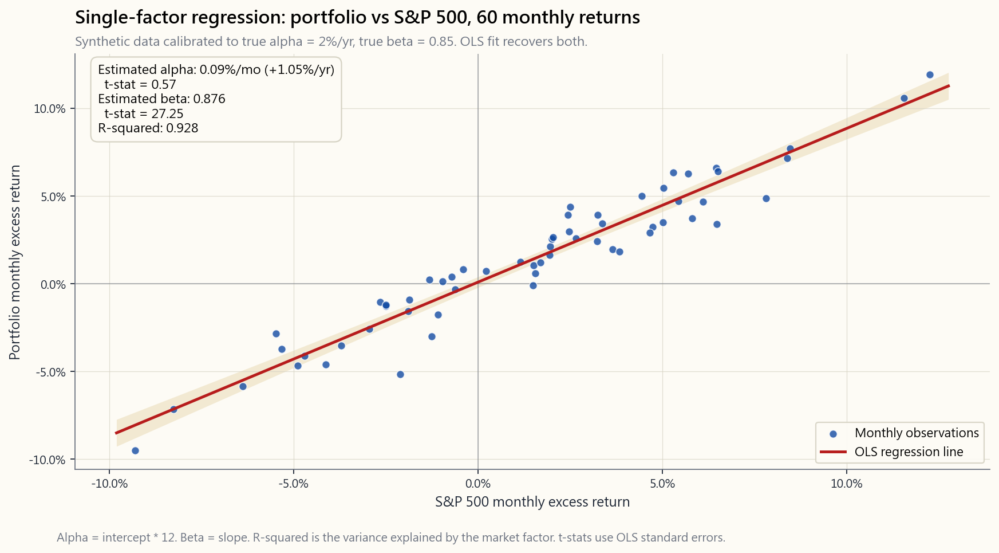

# 第四十五週：投資人的量化方法——迴歸、時間序列與機器學習訊號

---

## 第一部分：閱讀章節

---

### 1. 為什麼這很重要

這是工具箱真正派上用場的一週。四十三週以來，我們仰賴直覺、歷史與幾個恆等式——存續期間、股利折現模型、四段式架構草圖、啞鈴策略。從這裡開始，你遇到的任何*受薪*的尋找阿爾法的人——那位你可能解僱的基金經理人、向你推銷投資組合的量化公司、在LinkedIn上發文的「AI訊號」達人——都會拿著某種迴歸係數、t統計量、R平方、向前驗證曲線和機器學習樣本外圖表來說服你。量化方法就是這個領域的語言。如果你無法以基本程度理解這門語言，所有聲稱具備技巧的說法聽起來都同樣可信，最終你將為一個初級分析師花一個下午就能跑出來的迴歸，每年付出1.5%的費用。

這件事重要，原因有四。

1. **它將結構性曝險與真正的技巧分開。** 現代實證金融中最重要的一句話是：*「阿爾法是對正確因子迴歸後的殘差。」* 一位每年打敗S&P 500指數3%的基金經理人，在你對其報酬進行MKT/SMB/HML/UMD/RMW迴歸之前，與一個單純傾斜小型股價值動能、搭上眾所周知風險溢酬順風車的人，根本無從區別。1990年代後共同基金阿爾法異常的文獻，有三分之二在代入正確基準進行迴歸後便灰飛煙滅。在阿爾法的結構性來源中，資訊優勢最難獲取；迴歸正是告訴你是否有人真正擁有它的那道測試。

2. **它是資料與迷信之間的分水嶺。** 投資人是型態辨識機器，而市場每年大約產生一千萬個可測試的型態。「一月效應」、「超級盃指標」、「五月賣出」、數十種「總統循環」圖表——每一個看起來都像真實訊號，是因為在足夠大的資料集裡，*某些東西*必然看起來像真實訊號。多重檢定校正（Bonferroni、Benjamini-Hochberg、Lopez de Prado的修正夏普比率）從數學上表達了這件事：「如果你以p<0.05測試了100個策略，應預期大約5個偽陽性。」缺乏這個框架，每次回測都是倖存者偏差的告白。

3. **它告訴你一個價格序列能支撐哪些策略。** 純粹的隨機漫步不容許任何動能策略、均值回歸策略，或任何優於無條件均值的預測模型。具有正自相關的趨勢序列有利於動能；均值回歸序列有利於價差交易。穩定性、自相關與共整合的檢定並非學術練習——它們在你花一年調校訊號之前，先回答了一個問題：*我原則上能從這份資料中提取任何東西嗎？* 而不是等到事後才發現底層過程根本不存在那個訊號。

4. **它是面對機器學習阿爾法推銷時唯一誠實的防禦。** 2026年金融界最危險的一句話是「我們使用機器學習在市場資料中尋找非線性型態。」大多數機器學習阿爾法的推銷，80%是特徵工程，15%是標記，5%是模型本身。如果你理解訓練集/驗證集/測試集的分割、向前驗證，以及樣本內與樣本外夏普比率的差異，就能提出三個戳破泡沫的問題：*保留集的時間窗口是什麼？它是怎麼選的？模型最後一次重新訓練之後的策略夏普比率是多少？* 這些答案，往往足以讓整個推銷崩盤。

---

### 2. 你需要掌握的內容

#### 2.1 線性迴歸作為阿爾法歸因機器

單因子資本資產定價模型迴歸是這台機器最簡單的版本。你取投資組合的月超額報酬 $R_p - R_f$ 與市場超額報酬 $R_m - R_f$，擬合直線

$$R_p - R_f = \alpha + \beta \cdot (R_m - R_f) + \varepsilon,$$

並讀出兩個數字。$\beta$ 是斜率：市場每移動一個百分點，投資組合平均移動 $\beta$ 個百分點。$\alpha$ 是截距：在扣除市場曝險已解釋的部分之後，投資組合的平均超額報酬。殘差 $\varepsilon$ 是模型放棄的部分——在 $\beta$ 完成其工作後剩下的東西。

§2.1的圖表呈現了這在實務中的樣貌：以五年月度資料校準，投資組合的 $\alpha = 2\%$/年，$\beta = 0.85$。散點圖中的點分散開來，直線向上傾斜，截距約為每月17個基點——正好對應我們設定的2%年化阿爾法。直線上下的點雲就是 $\varepsilon$：這個單一因子無法解釋的部分，也是多因子迴歸接手的地方。

Fama-French延伸模型只是增加了更多右側項：

$$R_p - R_f = \alpha + \beta_1 \cdot \text{MKT} + \beta_2 \cdot \text{SMB} + \beta_3 \cdot \text{HML} + \beta_4 \cdot \text{UMD} + \varepsilon.$$

對一檔小型股基金執行這個迴歸，你會發現其在單因子模型中的「阿爾法」——例如每年4%——其實是規模因子 $\beta_2$ 載量0.40與價值因子 $\beta_3$ 載量0.30，乘以第23週歸納的1963至2024年SMB與HML風險溢酬。扣除這些之後，殘差阿爾法接近零，且在統計上無法與零區分。那4%中有3%是*因子補償*，而非技巧。這與S&P SPIVA每年公布的結論相同；迴歸不過是在數學上說明了原因。

#### 2.2 殘差作為阿爾法的工作定義

截距是紙面上的阿爾法；殘差是運作中的阿爾法。一位技巧出色的基金經理人產生的不僅是正截距，更是一個殘差序列，其*t統計量*能在雜訊中存活。若一檔基金在60個月內的月阿爾法為0.20%、殘差標準差為2%，t統計量為

$$t = \frac{0.20\%}{2\%/\sqrt{60}} = \frac{0.20\%}{0.258\%} \approx 0.78.$$

這*不*具統計顯著性——以六十個資料點和這麼大的雜訊，無法將該截距與零區分開來。你需要更長的時間窗口、更高的阿爾法，或更低的殘差波動性——通常三者兼備——t統計量才能超過慣例的2.0門檻。阿爾法很稀罕，而t統計量正是稀罕程度的算術表達。一個阿爾法2%、殘差波動性5%的策略，大約需要25年的月度資料，t統計量才能剛好超過2.0。二十五年。這是*證明*技巧存在所需的時間——不是察覺，是證明。大多數基金經理人管理資金的時間還不到二十五年。

#### 2.3 用於選股的橫截面迴歸

資本資產定價模型迴歸是*時間序列*式的：一檔基金、T個月報酬、一個斜率。另一類是*橫截面*式的：一個時間點、N檔股票，將報酬對當前快照特徵進行擬合。

$$r_{i,t+1} = \gamma_0 + \gamma_1 \cdot \text{B/M}_{i,t} + \gamma_2 \cdot \text{Size}_{i,t} + \gamma_3 \cdot \text{Mom}_{i,t} + u_{i,t+1}.$$

你對每個月執行這個迴歸，收集 $\gamma_1, \gamma_2, \gamma_3$ 斜率的時間序列，然後取平均。平均 $\gamma_j$ 是每單位因子曝險的實現風險溢酬，其t統計量告訴你這個因子是否有報酬。這就是Fama-MacBeth程序（1973年），半世紀後它依然是學術因子研究的主力工具。你在賣方桌上看到的每一個「Barra式風險模型」，都是橫截面迴歸的某種形式。

零售用途在於建立訊號。你取500檔股票的宇宙，對每檔股票的（股價淨值比、獲利能力、12個月動能）進行評分，將*下個月*報酬對這些分數進行迴歸，依斜率構成多空投資組合，並定期再平衡。這就是每一檔智慧貝塔指數股票型基金的內部運作。

#### 2.4 時間序列：AR、MA、ARMA與隨機漫步基準

對於定價序列，無條件的首要問題是：這是隨機漫步，還是有持續性？AR(1)模型

$$r_t = \phi \cdot r_{t-1} + \epsilon_t$$

估計滯後一期的自相關 $\phi$。若 $\phi > 0$，報酬趨勢化（本週的移動預測下週的移動）。若 $\phi < 0$，報酬均值回歸。美國月度股票報酬的實現 $\phi$ 約為 $+0.10$——幾乎與零無法區分，這就是為何月度股票報酬基本上無法從自身歷史預測。對於*日度*股票報酬，$\phi$ 略為*負值*（微觀結構均值回歸）；對於*6至12個月*期間的橫截面相對報酬，$\phi$ 略為*正值*（Jegadeesh-Titman動能，即橫截面動能效應）。當 $\phi$ 為零時，任何僅以過去價格為輸入的模型都無法取勝。

MA(q)與ARMA(p,q)模型加入移動平均殘差項，以捕捉消息到來的衝擊結構。在實務中，對於流動性良好的股票報酬，最佳ARMA擬合在月度均方根誤差上僅比零均值隨機漫走基準好幾個基點——在成本扣除後毫無經濟意義。但對於*波動性*序列，AR式模型則大獲全勝：波動性具有高度持續性（日度波動率指數的 $\phi \approx 0.95$），這就是為何GARCH與HAR-RV模型能真正預測明日波動性。波動性尾巴支配報酬這條狗，這個不對稱性的許多部分在此顯現。你無法預測下個月的報酬；你絕對可以預測下個月的變異數。

#### 2.5 滾動窗口與擴展窗口，以及參數穩定性問題

一旦決定在歷史資料上擬合模型，下一個選擇是使用*全部*歷史（擴展窗口：在時間 $t$，以從開始到 $t-1$ 的資料擬合）還是僅使用近期資料（滾動窗口：在時間 $t$，以最近60個月的資料擬合）。擴展窗口資料較多，因此估計更精確——*如果*底層參數穩定的話。滾動窗口在參數改變時能夠適應——*如果*體制轉換是真實的而非雜訊的話。

理論上沒有正確答案；只有參數穩定性檢定。對於大型市值股票的資本資產定價模型貝塔，1990至2024年的擴展窗口估計給出大致固定的貝塔——參數穩定，滾動窗口只會增加雜訊。但對於HML因子的市場貝塔，擴展窗口估計毫無意義——該因子對市場的貝塔在2007年前後改變了符號。在這種情況下，滾動窗口是必須的。實務上的預設值是月度資料採用36至60個月的滾動窗口，並搭配Chow結構斷點測試，以判斷參數是否已發生轉移。

#### 2.6 訓練集/驗證集/測試集，以及向前驗證的防禦機制

你在金融領域聽到的每一個機器學習推銷，都存在同樣的弱點：模型是在與其樣本外績效報告所用的相同資料上調校的。標準防禦是三向分割。

- **訓練集**（例如1990至2010年）：擬合模型參數。
- **驗證集**（例如2011至2017年）：調校超參數——特徵數量、正則化強度、樹的深度等。在驗證集上評分時，每個超參數設定都會在訓練集上*重新擬合*，選出最佳超參數。
- **測試集**（例如2018至2024年）：以凍結的超參數對模型進行*恰好一次*的評估，不再重新調校。

殘酷的事實是：在誠實的流程中，測試集使用一次後便封存。你不能針對測試集反覆迭代策略，否則它就變成第二個驗證集。*向前驗證*將此推廣：在每個時間點 $t$，模型以 $t-1$ 之前的資料擬合，用於預測 $t$，然後將下一個 $t$ 加入訓練集。實現的樣本外績效是唯一誠實的績效估計。

危險之處與大多數散戶投資人的想像相反。過度擬合看起來不像是稍微好看的樣本內結果；它看起來像是*驚人出色*的樣本內結果，在測試集上卻崩潰為零——甚至更糟，崩潰為*負值*。§2.7的圖表呈現了這個典型的駝峰形狀。

#### 2.7 過度擬合、多重檢定與偽阿爾法工廠

典型曲線中，樣本內夏普比率隨模型複雜度單調遞增（更多參數、更深的樹、更多特徵）——因為擁有足夠的自由參數，你可以記住雜訊。樣本外夏普比率先短暫上升，在某個中等複雜度達到峰值，然後*崩潰*。兩條曲線之間的差距就是過度擬合的代價。這是實證機器學習中最具再現性的現象，且具有普遍性：它出現在股票預測、選擇權定價、信用評分以及廣告點擊模型中。

在此之上的金融特殊性是*多重檢定*。每一個嘗試策略後在未發表情況下放棄的研究者，都為那些碰巧看起來不錯的策略的倖存貢獻了一分力。如果一百位量化研究員各自在同一資料集上嘗試五十種訊號變體，在 $p < 0.05$ 下的整體族群誤差率基本上為一。Marcos Lopez de Prado的*修正夏普比率*將此形式化：一個策略必須達到的夏普比率，以超越嘗試了*N*個替代方案所產生的雜訊，大約是無條件夏普雜訊的 $\sqrt{2 \log N}$ 個標準差。嘗試一千個策略，門檻大約是 $\sqrt{2 \log 1000} \approx 3.7$ 個標準差——在五年回測中，光是要正當化「曾經看過」這件事本身，夏普比率就需要約1.6。大多數已發表的異常現象達不到這個門檻。

#### 2.8 為何大多數機器學習阿爾法是特徵工程

Lopez de Prado的*《金融機器學習進階》*（2018年）用兩句話點出這件事。*「模型是最容易的部分。」**「大部分工作在於標記目標與工程化特徵。」* 原因是金融資料的訊雜比極低（最佳線性模型對股票報酬的月度R平方約為0.05）、嚴重的非穩定性（2010年找到的訊號在2020年可能失效），以及標記問題（那個價格移動是體制轉換，還是微觀結構雜訊？）。模型——隨機森林、XGBoost、神經網路——在很大程度上是已商品化的步驟。差異化在於特徵（你輸入的價格/成交量/委託流的哪些轉換）與標記（1%的移動是否算作「+1」，或你是否以三重障礙退出加權）。

對散戶投資人而言，這個結論令人不舒服：量化阿爾法的嚴肅資金，幾乎從來不是靠在另一個OHLCV資料集上訓練又一個XGBoost賺到的。它是靠取得或建構別人沒有的特徵賺到的——另類資料、衛星影像、信用卡消費面板、供應鏈文字嵌入。阿爾法的資訊通道是真實的，但成本高昂。「結構性」通道（流動性、因子壓縮、波動率尾部錯誤定價）對於單一帳戶而言，仍是成本更低、更持久的策略選擇。

---

### 3. 常見誤解

1. **「R平方0.9代表模型很好。」** R平方衡量的是變異數的解釋程度，不是預測能力。一個基金報酬對S&P 500迴歸得到R平方= 0.95，只是說明基金與市場高度相關。它不能告訴你基金的阿爾法是否真實，或你是否能從任何東西預測這兩個序列。

2. **「我的回測樣本內夏普比率是2.5，所以這個策略可行。」** 樣本內夏普比率平均而言存在樂觀偏差，約為 $\sqrt{N}$ 個標準差，其中N是你嘗試的變體數量。2.5的樣本內夏普比率，向前驗證後通常縮水至0.3。

3. **「P值低於0.05代表結果是真實的。」** P值低於0.05代表*在虛無假設為真的情況下*，觀察到此結果的機率低於5%。在一千個同時進行的檢定中，p<0.05的偽陽性預期數量是五十個。沒有多重檢定校正，「p<0.05」幾乎毫無意義。

4. **「資料越多越好。」** 只有在底層資料生成過程穩定的情況下，更多資料才更好。在抗通膨國庫券損益平衡點模型中加入1990年代的資料，但抗通膨國庫券在1997年之前根本不存在——這不是「更多資料」，而是汙染。

5. **「樣本外夏普比率1.0 = 很好。」** 在特徵於2010年選定、測試至2024年、扣除交易成本後淨夏普比率1.0的策略，確實很好。但若是在六個月的保留集上、研究員反覆迭代了四十次的策略，*扣除成本前*夏普比率1.0，則毫無意義。

6. **「機器學習能找到人類遺漏的型態。」** 機器學習對你輸入的任何東西擬合靈活的函數。有N個參數的非正則化模型，可以擬合N-1個資料點中的任何型態——包括雜訊。它找到的*型態*是否真實，是模型本身無法回答的問題。

7. **「交叉驗證消除了過度擬合。」** K折交叉驗證不適用於時間序列——它會將未來資訊洩漏到訓練折中。金融資料唯一有效的交叉驗證是帶禁期的向前驗證（Lopez de Prado第7章），即便如此，測試集也只能使用一次。

8. **「貝塔是常數。」** 貝塔是在有限窗口上的迴歸斜率。它是帶有誤差的*估計值*，且隨時間變化。眾所周知，價值股對市場的貝塔約在2007年從正值轉移至接近零。

9. **「我的因子曝險迴歸有阿爾法，所以我有技巧。」** 在60個月窗口的五因子迴歸中，具有統計顯著性的阿爾法，單獨而言並不能證明技巧存在。你需要t統計量、殘差診斷，以及最好有一個獨立的保留集。二十五年的資料，或更長。

10. **「量化模型取代了交易員。」** 整體而言，過去十年量化股票的美元成交量市占率約為30至40%。其餘部分仍是人工操作，且大量量化成交量是執行，而非訊號生成。有趣的錢被分配在兩邊。

---

### 4. 問答章節

**Q1. 如果迴歸給出我的基金阿爾法= 1.5%/年且t統計量= 1.4，我應該得出什麼結論？**
什麼都不能得出。t統計量1.4對應的單尾p值約為8%，雙尾約為16%。你無法拒絕真實阿爾法為零的虛無假設。這個估計值與技巧*相符*，也與運氣相符。在能做出任何結論之前，你需要更長的資料、更高的阿爾法，或兩者兼備。

**Q2. 我需要多長時間來評估一位基金經理人？**
若月度資料的阿爾法為2%/年、殘差波動性為5%/年，大約需要25年——此時t統計量才剛超過2.0。若殘差波動性更高（典型的避險基金），則時間倍增。這個含義令人不安：大多數「優秀」的業績記錄，在統計上無法與運氣區分。

**Q3. 美國大型股基金對S&P 500的單因子資本資產定價模型迴歸，R平方應該多少？**
0.85至0.95是正常範圍。R平方0.99代表這檔基金是「偷懶的指數化」（你不應該支付任何費用）。R平方0.50代表基金承擔了大量因子或類股押注，你應該執行多因子迴歸，看看它們究竟是什麼。

**Q4. 為什麼月度股票報酬的自相關接近零？**
因為若它明顯為正，動能策略就會將其套利至零；若明顯為負，均值回歸策略也會如此。剩下的接近零是均衡狀態。它在*橫截面*層面（跨股票相對動能在6至12個月期間）仍然存在，因為那裡的可套利形式更雜亂、更慢。

**Q5. 「前視偏差」在實務中是什麼？**
使用你在交易時實際上不可能擁有的資訊。常見例子：以「當本益比 < 15時買進」的規則進行回測，卻使用全年已報告盈餘計算的本益比（而這個數字數個月後才知曉）；使用國內生產毛額修正數據（事後多年才修正）當作公布時的數字；或使用重建的指數成分，排除了中途破產的公司。倖存者偏差是其特殊情形。

**Q6. 樣本內、驗證集與樣本外的差異是什麼？**
樣本內：模型擬合所用的資料。擬合結果在機制上會很好。驗證集：用於選擇超參數的資料。獨立於訓練，但在調校步驟中被消耗。樣本外/測試集：模型從未見過的資料。一個正確建立的流程，在整個模型——包括超參數——凍結之後，恰好執行一次測試集評估。

**Q7. 使用多少個參數才會開始過度擬合？**
線性模型的經驗法則是每個參數至少10至20個觀測值。對於自由度較多的非線性模型（隨機森林、神經網路），答案取決於正則化；實證防禦是向前驗證的夏普比率——如果增加參數無法改善向前驗證夏普比率，樣本內的改善就是過度擬合。

**Q8. 我應該使用機器學習還是線性迴歸來預測股票？**
線性迴歸永遠優先。如果在精心工程化的特徵上，線性模型找不到訊號，那麼機器學習模型在相同特徵上也找不到；它只會更快地過度擬合，感覺上像是技巧。只有當底層關係確實是非線性的，*而且*你有足夠的資料估計這個非線性，*而且*你有線性模型無法利用的特徵集時，機器學習才真正發揮其價值。這是個很小的交集。

**Q9. 什麼是「資料探勘」，它有什麼問題？**
資料探勘是在大量策略空間中搜索什麼能擬合歷史資料。數學上沒有問題；真正的問題是*把最好的那個當作唯一嘗試的那個來報告*。沒有多重檢定校正，報告的夏普比率會因搜索範圍的大小而向上偏差。Lopez de Prado的修正夏普比率是標準的修正方法。

**Q10. 為什麼特徵工程比模型更重要？**
因為金融資料的訊雜比很低，模型複雜度帶來的邊際報酬急速遞減。兩個擁有相同特徵但不同機器學習模型的機構，夏普比率往往收斂；兩個擁有相同模型但特徵集有實質差異的機構，夏普比率則明顯分化。資訊存在於特徵之中。

**Q11. 我可以自己執行這些迴歸嗎？**
可以。Python的 `statsmodels` 或 `scikit-learn`，或R的 `lm()`，兩行程式碼就能執行五因子迴歸。Kenneth French的資料庫免費提供FF5加UMD的月度因子報酬，從1963年至今。對時間序列取子集，執行迴歸，讀出阿爾法與t統計量。本週的互動實驗室提供了基本的單因子版本。

**Q12. 最重要的一個習慣是什麼？**
永遠保留一個保留集。永遠。不論你能從資料中撥出多少——20%、30%、最後三年——在做任何事之前先保留它，且不要看它。當策略最終確定後，*恰好一次*，在保留集上評分。你得到的數字是你將擁有的唯一誠實數字。「阿爾法很稀罕」不再只是一句口號，而是在你第一次看到策略的樣本內夏普比率2.5向前驗證到0.4時，直覺上便能理解的事實。

---

## 第二部分：YouTube腳本

---

**影片標題：** 投資人的量化方法——如何辨別真正的阿爾法與幸運的回測
**預計時長：** 約18分鐘
**主持人：** 陳馬、小魚

---

**[開場 — 0:00-1:30]**

**陳馬：** 歡迎回來。這週的課程，如果我做到位的話，你看完之後將有能力識破你將來遇到的大約一半「績效」推銷。

**小魚：** 強烈的宣言，陳馬。

**陳馬：** 這是站得住腳的宣言。量化方法——迴歸、時間序列模型、機器學習流程——是人們用來*聲稱*具備技巧的語言。如果你能以基本程度讀懂這門語言，就能提出三個戳破泡沫的問題：保留集是什麼？它是怎麼選的？t統計量是多少？

**小魚：** 如果他們回答不了呢？

**陳馬：** 那你就替自己在未來十年省下了每年1.5%的費用。

**小魚：** 說說議程。

**陳馬：** 三個部分。第一，迴歸作為阿爾法歸因機器——在對正確因子迴歸之後，阿爾法意味著什麼。第二，時間序列——AR/MA/ARMA能做什麼、不能做什麼。第三，機器學習推銷——訓練集/驗證集/測試集、向前驗證，以及為什麼大多數機器學習阿爾法其實是特徵工程。

**小魚：** 核心理念呢？

**陳馬：** 資訊優勢是阿爾法結構性通道中最難的一條——它就架在這一切之上。配套的理念——阿爾法很稀罕——是數學將不斷印證的事。

---

**[第一部分 — 迴歸 — 1:30-7:00]**

**小魚：** 先從單因子開始。

**陳馬：** 對。這條線是

$$R_p - R_f = \alpha + \beta \cdot (R_m - R_f) + \varepsilon.$$

出來兩個數字：斜率貝塔，和截距阿爾法。阿爾法是你的投資組合在扣除市場曝險已解釋的部分之後，產生的平均報酬。

[VISUAL: image/week45_regression_alpha.png]

**小魚：** 帶我們看這張圖。

**陳馬：** 六十個月的虛構資料，校準為年化阿爾法2%、貝塔0.85。你可以看到斜率比1更平緩——那就是0.85——而且直線在y軸的截距約為每月17個基點。年化後，17個基點× 12 ≈ 2%。散點圍繞著直線分散；那個分散就是epsilon，殘差。阿爾法上的t統計量告訴你每月17個基點是否能與零區分。

**小魚：** 結論是？

**陳馬：** 是的。在60個月和那樣的殘差波動性下，2%阿爾法的t統計量勉強達到2.0。要*證明*這個量級的技巧，你需要接近二十五年的資料。

**小魚：** 二十五年。

**陳馬：** 二十五年。阿爾法很稀罕——這是數學，不是口號。

**小魚：** 現在說多因子。

**陳馬：** 同樣的機器，增加更多右側項。

$$R_p - R_f = \alpha + \beta_1 \text{MKT} + \beta_2 \text{SMB} + \beta_3 \text{HML} + \beta_4 \text{UMD} + \varepsilon.$$

你取一檔單因子阿爾法為4%/年的小型股價值基金，執行五因子迴歸，幾乎必然——幾乎必然——那個阿爾法的大部分，是SMB與HML的正向載量乘以第23週歸納的實現風險溢酬。殘差阿爾法崩潰至接近零。

**小魚：** 這就是SPIVA結論的方程式形式。

**陳馬：** 完全正確。這張圖是SPIVA報告的數學基礎。

---

**[第二部分 — 時間序列 — 7:00-11:00]**

**小魚：** 時間序列。

**陳馬：** 三個基本模組：AR、MA、ARMA。AR(1)模型問一個問題：這個時期的報酬能預測下個時期的嗎？

$$r_t = \phi \cdot r_{t-1} + \epsilon_t.$$

如果phi是正值，報酬趨勢化。如果是負值，均值回歸。美國月度股票報酬的phi約為+0.10——不是零，但也不大。對於*日度*報酬，略為負值。對於*6至12個月相對橫截面*報酬，phi是正值——那就是Jegadeesh-Titman動能效應。

**小魚：** 那波動性呢？

**陳馬：** 波動性具有*高度*持續性。日度波動率指數的phi約為0.95。今日的波動性幾乎能告訴你明日的一切。這就是GARCH模型能真正預測變異數的原因。

**小魚：** 你上週說了一個重要的概念——波動性尾巴支配報酬這條狗。

**陳馬：** 波動性尾巴支配報酬這條狗。報酬在月度基礎上基本上無法預測。變異數具有高度可預測性。所以，看起來像是選擇權賣出、波動性目標化或風險平價策略中的「阿爾法」，很大程度上是在利用*這個*不對稱性。

**小魚：** 滾動窗口對比擴展窗口？

**陳馬：** 參數穩定的話用擴展窗口。漂移的話用滾動。大型市值股票的貝塔自1990年以來大致穩定——用擴展。HML因子對市場的貝塔在2007年前後改變了符號——用滾動。沒有萬能答案；只有穩定性檢定。

---

**[第三部分 — 機器學習推銷 — 11:00-15:30]**

**小魚：** 現在說機器學習的話題。

**陳馬：** 訓練集、驗證集、測試集。三個獨立的切片。訓練集擬合模型。驗證集調校超參數。測試集*恰好一次*用來對凍結的模型評分。

**小魚：** 什麼會出錯？

**陳馬：** 兩件事。第一，人們針對測試集反覆迭代，直到它變成第二個驗證集。第二，人們不進行多重檢定校正，所以一個孤立看起來令人印象深刻的策略，只不過是一百個沒成功的同胞策略中的倖存者。

[VISUAL: image/week45_overfit_curve.png]

**小魚：** 這就是過度擬合的駝峰。

**陳馬：** 典型形狀。樣本內夏普比率隨模型複雜度單調遞增——更多參數、更深的樹、更多特徵。樣本外夏普比率先短暫上升，在某個中等複雜度達到峰值，然後崩潰。兩條曲線之間的差距就是過度擬合的代價。

**小魚：** 那多重檢定校正呢？

**陳馬：** Lopez de Prado的修正夏普比率將此形式化。簡短版本：如果你嘗試了N個變體，超越雜訊所需的夏普比率，隨著兩倍log N的平方根遞增。嘗試一千個策略，你的門檻大約是無條件虛無假設的3.7個標準差——在五年回測中，光是要*正當化看過這些數據*，夏普比率就需要約1.6。大多數已發表的異常現象達不到這個門檻。

**小魚：** 為什麼特徵工程如此重要？

**陳馬：** 因為金融資料有著殘酷的訊雜比。模型複雜度的邊際價值急速遞減。兩個擁有相同特徵但不同機器學習模型的機構，夏普比率往往收斂。兩個擁有相同模型但特徵集有實質差異的機構，夏普比率則明顯分化。資訊存在於特徵之中。

**小魚：** 對散戶投資人而言呢？

**陳馬：** 對我們而言，這個結論令人謙卑。量化阿爾法的嚴肅資金，很少靠在另一個OHLCV資料集上訓練又一個XGBoost賺到。它是靠取得別人沒有的特徵賺到的——另類資料、衛星影像、信用卡消費面板。阿爾法的資訊通道是真實的，但成本高昂。結構性通道——因子壓縮、流動性、波動率尾部錯誤定價——對散戶而言，仍是成本更低、更持久的策略選擇。

---

**[第四部分 — 實驗室 — 15:30-17:00]**

**小魚：** 展示實驗室。

**陳馬：** 打開 `interactive/week45_regression_lab.html`。你可以控制四個滑桿：資料點數量、真實阿爾法（以基點計）、真實貝塔，以及雜訊波動性。頁面使用確定性線性同餘生成器內聯產生合成資料，執行最小平方法，並繪製散點圖加迴歸直線加95%信賴區間。

**小魚：** 觀眾應該先調哪個？

**陳馬：** 把真實阿爾法設為200個基點，雜訊波動性設為4%——這是典型的「低雜訊技巧型基金經理人」情境。在60個資料點下，估計的阿爾法會落在200個基點的大約30個基點範圍內。現在把資料點減少到24——兩年的資料——看信賴區間的寬度加倍。在24個資料點下，你無法在2個標準誤的水準上拒絕阿爾法為零的假設。

**小魚：** 更深層的教訓是？

**陳馬：** 阿爾法信賴區間的寬度，就是你「我不知道」的大小。它不是一個要四捨五入為零的數字——它是誠實衡量你表面上的阿爾法有多少是資料在說話、有多少是雜訊在說話的尺度。大多數基金經理人的整個職業生涯都在那個區間之內。

---

**[結語 — 17:00-18:00]**

**小魚：** 下週是什麼？

**陳馬：** 第46週——我們用這個工具箱來解剖一個真實的避險基金業績記錄。取公開的報酬資料，執行五因子迴歸，看看殘差阿爾法究竟是什麼。

**小魚：** 實務作業？

**陳馬：** 三件事。第一：選一檔你持有的基金。找五年的月報酬。執行五因子迴歸——Kenneth French免費提供資料。讀出阿爾法與t統計量。第二：去玩實驗室——把雜訊波動性調高，看信賴區間把阿爾法吞噬。第三：用一句話寫下「我有阿爾法」與「我有統計顯著的阿爾法」的區別。如果你說不清楚，下次業務推銷聽起來還是會很可信。這週之後，就不應該了。

**小魚：** 保持懷疑。

**陳馬：** 保持懷疑。下週見。

[END]