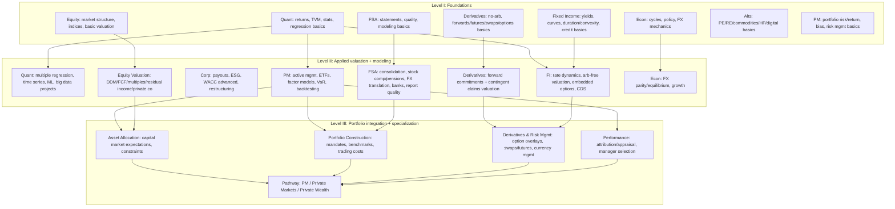
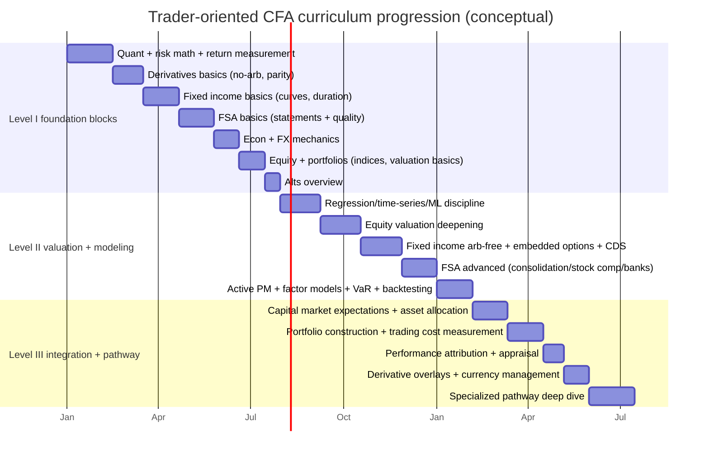
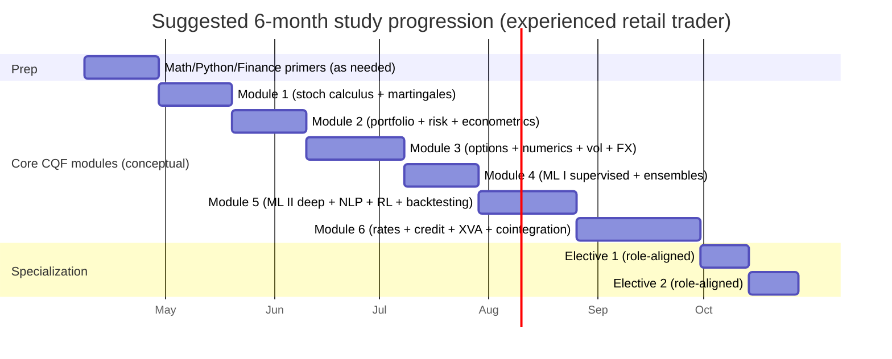
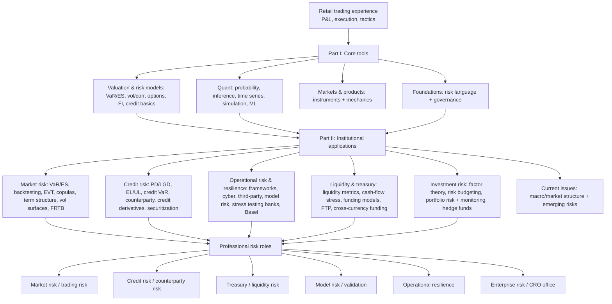
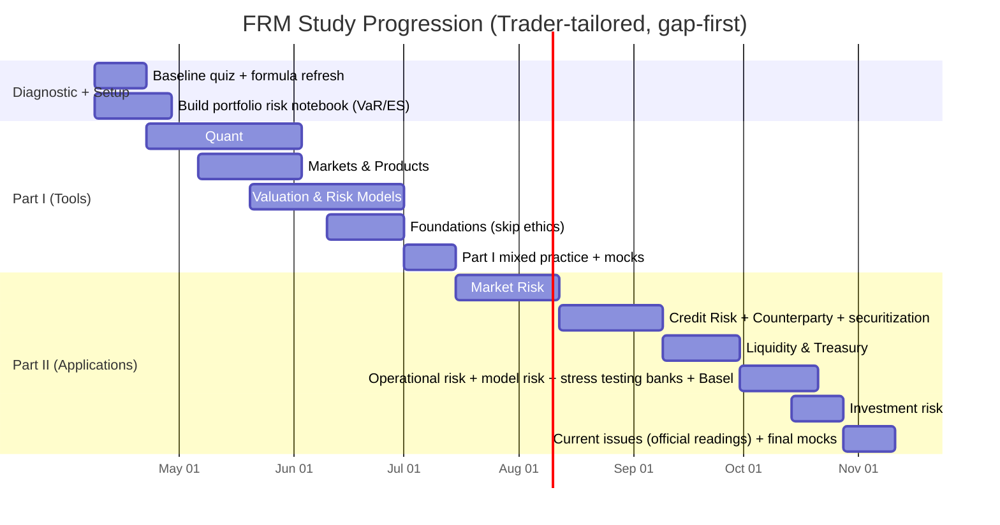

# CFA Program Curriculum Knowledge Map for an Experienced Retail Trader

## Executive summary

The CFA Program is structured to move you from **knowing tools** (Level I), to **applying valuation and analysis in context** (Level II), to **integrating everything into portfolio decisions under real-world constraints** (Level III). CFA Institute itself frames the levels as “Learn and describe” (Level I), “Analyze and evaluate” (Level II), and “Integrate and apply” (Level III).

For an experienced retail trader, the biggest “gap versus a professional” usually is not market familiarity; it is **professional-grade rigor**: (a) consistent return/risk measurement and performance interpretation (time-weighted vs money-weighted, attribution, benchmark thinking), (b) fixed-income and credit math (curves, duration/convexity, spread decomposition, structured products), (c) no-arbitrage derivatives valuation beyond payoff diagrams, (d) accounting/financial reporting skill that supports fundamental risk sensing (quality of earnings, off-balance-sheet exposures, pensions/stock comp), and (e) institutional-style portfolio construction (constraints, liquidity, risk budgets, rebalancing, execution-cost measurement and market microstructure). These emphases are explicitly reflected in Level III “common core” coverage (asset allocation, portfolio construction, performance measurement, derivatives & risk management) and in the specialized pathway design.

This report provides a **Level-by-Level curriculum map (excluding Ethics/Professional Standards)** with a trader-phrased one-line definition for every CFA learning module, plus topic-level mapping to practical trader skills, professional competencies, and common retail gaps. Topic weights are given from CFA Institute’s official exam pages, and module lists are taken from CFA Institute’s 2026 Topic Outline documents.

## Scope, sources, and explicitly unspecified assumptions

This map covers the **complete CFA Program curriculum topic areas for Levels I–III** and the **Level III specialized pathway content**, **excluding Ethics/Professional Standards** (including ethics-related standards content such as the Code/Standards and GIPS modules where applicable). Level III’s structure is **common core + one specialized pathway**, with CFA Institute indicating **65–70% common core** and **30–35% pathway** exam-weight allocation.

Primary sources are CFA Institute official materials: Level I/II/III exam topic weights (official exam pages) and the 2026 Level I/II Topic Outline PDFs and 2026 Level III pathway topic outline PDFs (which enumerate modules and Learning Outcome Statements at module level).
Practitioner supplementation (for “how pros do it”) is drawn from standard references on derivatives, valuation, and market microstructure, e.g., Hull (derivatives/risk), Damodaran (DCF/valuation), and Harris (market microstructure and execution).

Unspecified (and therefore not assumed): your primary markets (US/international), instruments (equities/options/futures/FX/crypto), holding period (intraday/swing/position), strategy style (discretionary technical, event-driven, systematic/quant), leverage constraints, tax jurisdiction, and whether you manage only your own capital or client capital.

## Level I knowledge map

Level I topic weights (official) emphasize broad foundations across 10 topic areas (Ethics omitted here), with larger weights in Financial Statement Analysis, Equity, and Fixed Income, and smaller-but-material weights in Quant, Economics, Corporate Issuers, Derivatives, Alternatives, and Portfolio Management.
Level I module lists below come from CFA Institute’s 2026 Level I Topic Outlines.

**Quantitative Methods (6–9%)** — The math/stat toolkit that turns “market opinions” into measurable returns, risks, and testable claims.
Trader-relevant skills: consistent return measurement, compounding intuition, basic distribution/risk reasoning, regression for factor/edge sanity checks, and simulation for scenario thinking.
Professional competencies: correct measure selection (TWR vs MWR), statistical inference discipline (power, Type I/II errors), and regression interpretation with assumption awareness.
Common retail gaps: confusing arithmetic vs geometric returns; overconfidence in small samples; “p-value hunting”; using regressions without diagnostics; ignoring non-normality and path dependence.

- Rates and Returns — How pros compute/compare returns (including compounding) so trade results are comparable across time and strategies.
- Time Value of Money in Finance — Discounting/compounding cash flows so “price vs value” and implied returns are coherent.
- Statistical Measures of Asset Returns — Summarizing risk/shape (volatility, skew, kurtosis, correlation) to understand how P&L really behaves.
- Probability Trees and Conditional Expectations — Turning uncertain paths into expected values to reason about payoff distributions.
- Portfolio Mathematics — Combining assets (covariance/correlation) to understand diversification and concentration risk.
- Simulation Methods — Using Monte Carlo/bootstrap intuition to stress strategies beyond a single backtest history.
- Estimation and Inference — Knowing what your sample can/can’t tell you before you “believe” an edge.
- Hypothesis Testing — Formalizing “is this signal real?” with error control and test selection.
- Parametric and Non-Parametric Tests of Independence — Checking if variables relate at all (and when correlation is misleading).
- Simple Linear Regression — Building and interpreting a first-pass factor/driver model with fit and residual checks.
- Introduction to Big Data Techniques — Knowing what “fintech/AI/ML” means in investment data workflows (at a trader-useful level).

**Economics (6–9%)** — The macro/market-structure narrative layer that links policy, cycles, trade, and FX to risk-on/risk-off regimes.
Trader-relevant skills: macro regime identification (growth/inflation/policy), rate/FX intuition, and “headline-to-asset” translation.
Professional competencies: distinguishing nominal vs real, policy transmission reasoning, and FX mechanics/arbitrage awareness.
Common retail gaps: hand-wavy macro stories without cashflow/rate linkage; misunderstanding FX quote conventions and cross-rates; misreading policy signaling vs action.

- The Firm and Market Structures — How competition shapes pricing power and earnings sensitivity (useful for sector/stock selection).
- Understanding Business Cycles — Mapping indicators to cycle phase so you anticipate factor/sector rotations.
- Fiscal Policy — How government spending/taxes can shift growth, inflation, and rates (and thus multiples).
- Monetary Policy — How central banks steer rates/liquidity and why that changes discount rates and risk premia.
- Introduction to Geopolitics — Translating geopolitical risk into tail-risk, commodity/FX shocks, and risk premia.
- International Trade — Trade flows, restrictions, and why “global winners/losers” emerge in earnings.
- Capital Flows and the FX Market — Who trades FX and why flows can overpower “fair value” short-run.
- Exchange Rate Calculations — Cross-rates and basic FX arbitrage math so you don’t misprice FX-linked exposures.

**Corporate Issuers (6–9%)** — The corporate finance layer: how firms fund themselves, invest, manage liquidity, and create/destroy shareholder value.
Trader-relevant skills: reading issuance/buyback/dividend signals, leverage risk framing, and identifying business model fragility.
Professional competencies: cost of capital thinking, capital allocation evaluation, and governance/stakeholder risk assessment.
Common retail gaps: treating buybacks/dividends as always “good”; ignoring liquidity run risk; misunderstanding how capital structure changes equity optionality.

- Organizational Forms, Corporate Issuer Features, and Ownership — How ownership/legal structure changes control, risk, and financing flexibility.
- Investors and Other Stakeholders — Who gets paid first and how stakeholder claims affect downside scenarios.
- Corporate Governance: Conflicts, Mechanisms, Risks, and Benefits — How agency problems show up as valuation discounts and blowups.
- Working Capital and Liquidity — Why short-term funding and cash conversion cycles can make or break a trade thesis.
- Capital Investments and Capital Allocation — How capex decisions feed future cash flows and competitive position.
- Capital Structure — How debt/equity mix changes risk, expected return, and “equity-as-call-option” behavior.
- Business Models — Identifying where revenues/costs are actually coming from so you don’t trade a story.

**Financial Statement Analysis (11–14%)** — How reported numbers are built, where they can mislead, and how to turn accounting into investable signals.
Trader-relevant skills: earnings quality checks, cash-vs-accrual sanity, leverage/liquidity screening, and mapping accounting choices to valuation traps.
Professional competencies: IFRS/US GAAP awareness and adjustments, ratio interpretation with footnote context, and building basic models that reconcile statements (important when trading earnings/events). CFA notes Level I FSA is generally IFRS-based unless stated otherwise.
Common retail gaps: trading earnings headlines without cash flow context; ignoring balance sheet “risk reservoirs”; confusing accounting profit with economic profitability.

- Introduction to Financial Statement Analysis — The workflow for turning filings into investable conclusions.
- Analyzing Income Statements — Understanding revenue/expense recognition so margins and “beats” are interpretable.
- Analyzing Balance Sheets — Reading assets/liabilities to detect leverage, liquidity risk, and hidden fragilities.
- Analyzing Statements of Cash Flows I — Seeing how cash is generated/used so earnings aren’t taken at face value.
- Analyzing Statements of Cash Flows II — Linking operating/investing/financing cash flows to sustainability and funding risk.
- Analysis of Inventories — Inventory accounting as a lens for cyclicality, pricing power, and earnings management.
- Analysis of Long-Term Assets — Depreciation, impairments, and capex signals for long-horizon cash flows.
- Topics in Long-Term Liabilities and Equity — Debt structure and equity accounts that change downside math.
- Analysis of Income Taxes — Tax effects that alter true profitability and cash conversion.
- Financial Reporting Quality — Spotting aggressive accounting and low-quality earnings before the market reprices.
- Financial Analysis Techniques — Ratio frameworks that connect statements to operating and financial risk.
- Introduction to Financial Statement Modeling — Building a simple forward view so valuation isn’t purely narrative.

**Equity Investments (11–14%)** — How equity markets are organized and how pros translate business fundamentals into equity valuation and selection.
Trader-relevant skills: market structure awareness, index/benchmark literacy, sector/industry analysis, and simple valuation anchoring (helps avoid “technicals-only” tunnel vision).
Professional competencies: coherent thesis formation from business drivers, scenario-based valuation, and industry competitive analysis.
Common retail gaps: ignoring index/flow effects; confusing price momentum with value; weak forecasting discipline.

- Market Organization and Structure — How venues, participants, and rules shape liquidity, spreads, and slippage.
- Security Market Indexes — How indexes are built/rebalanced so you anticipate flow-driven moves.
- Market Efficiency — When prices incorporate information quickly (and when edge might exist).
- Overview of Equity Securities — What equity claims really are (common vs preferred, rights) in risk terms.
- Company Analysis: Past and Present — Reading historical performance to frame what “normal” should look like.
- Industry and Competitive Analysis — Finding where profit pools are and who can defend them.
- Company Analysis: Forecasting — Turning drivers into forecasts so trades have probabilistic targets.
- Equity Valuation: Concepts and Basic Tools — Using simple DCF/multiples logic to anchor entries/exits and risk.

**Fixed Income (11–14%)** — The “rates/credit/curve” engine of markets: pricing bonds, measuring rate risk, and understanding securitized products.
Trader-relevant skills: yield/curve literacy (critical even for equity/options traders because discount rates drive valuations), duration/convexity risk control, and credit spread intuition.
Professional competencies: decomposing returns into carry/roll-down/spread changes, curve construction (spot/forward), and structured product risk (prepay/convexity). Standard practitioner references emphasize duration/convexity and bond risk as core tools.
Common retail gaps: treating bond yields as “just a number”; not understanding convexity or embedded optionality; underestimating credit/liquidity regime shifts.

- Fixed-Income Instrument Features — Bond contract terms that determine risk (calls, puts, covenants).
- Fixed-Income Cash Flows and Types — Mapping coupon/structure to cash flow timing and risk profile.
- Fixed-Income Issuance and Trading — How fixed income actually trades (OTC realities vs screen prices).
- Fixed-Income Markets for Corporate Issuers — Credit issuance logic and how spreads reflect borrower risk.
- Fixed-Income Markets for Government Issuers — Sovereign curves as macro barometers and benchmark building blocks.
- Fixed-Income Bond Valuation: Prices and Yields — Pricing bonds and translating price into yield and back.
- Yield and Yield Spread Measures for Fixed-Rate Bonds — Reading spreads properly (not mixing conventions).
- Yield and Yield Spread Measures for Floating-Rate Instruments — Understanding floaters/MM instruments when rates move.
- The Term Structure of Interest Rates: Spot, Par, and Forward Curves — Building curve intuition for macro/risk pricing.
- Interest Rate Risk and Return — Connecting horizon, duration, and holding-period returns.
- Yield-Based Bond Duration Measures and Properties — Using duration/PVBP to size rate risk.
- Yield-Based Bond Convexity and Portfolio Properties — Understanding convexity so “small moves” don’t surprise you.
- Curve-Based and Empirical Fixed-Income Risk Measures — Risk measures that work when yields move non-parallel.
- Credit Risk — Default probability vs loss severity thinking (spread ≠ “free money”).
- Credit Analysis for Government Issuers — Sovereign/sub-sovereign credit frameworks for crisis risk.
- Credit Analysis for Corporate Issuers — Credit ratios and business risk translated into spread risk.
- Fixed-Income Securitization — How cash flows are carved up (and where hidden leverage appears).
- Asset-Backed Security Instrument and Market Features — ABS structures/credit enhancement and why tranche risk differs.
- Mortgage-Backed Security Instrument and Market Features — Prepayment/extension risk and negative convexity intuition.

**Derivatives (5–8%)** — The payoff language of markets: forwards/futures/swaps/options priced by no-arbitrage and replication.
Trader-relevant skills: structuring trades with defined exposures, understanding implied financing via cost-of-carry, and avoiding “Greeks blindness.” Standard derivatives texts emphasize bridging theory and practice for pricing and risk management.
Professional competencies: no-arbitrage valuation, hedge replication logic, and using derivatives to shape portfolio exposures rather than only to speculate.
Common retail gaps: payoff-diagram understanding without valuation; misunderstanding carry/dividends/borrowing; using options strategies without volatility/Greek decomposition.

- Derivative Instrument and Derivative Market Features — Knowing what a derivative is and how OTC vs exchange affects risk.
- Forward Commitment and Contingent Claim Features and Instruments — The core contract types and how they differ in obligation vs optionality.
- Derivative Benefits, Risks, and Issuer and Investor Uses — Why derivatives exist (hedge/transfer risk) and their failure modes.
- Arbitrage, Replication, and the Cost of Carry in Pricing Derivatives — The logic that pins derivative prices to underlyings.
- Pricing and Valuation of Forward Contracts for an Underlying with Varying Maturities — Forward curves and carry mechanics across maturities.
- Pricing and Valuation of Futures Contracts — Futures mark-to-market and why futures ≠ forwards in practice.
- Pricing and Valuation of Interest Rates and Other Swaps — Swaps as strip-of-forwards intuition (critical for rate products).
- Pricing and Valuation of Options — What drives option value (underlying, vol, rates, time) in trader terms.
- Option Replication Using Put–Call Parity — Synthetic positions and parity checks so you spot mispricings/structure.
- Valuing a Derivative Using a One-Period Binomial Model — First-principles replication that scales to more advanced pricing.

**Alternative Investments (7–10%)** — Non-traditional assets/strategies (private capital, real assets, hedge funds, digital assets) that behave differently under stress.
Trader-relevant skills: correlation realism (diversification that disappears), fee/illiquidity math, and factor exposures embedded in “alts.”
Professional competencies: evaluating illiquidity premia, understanding fund structures/fees, and performance measurement net-of-fees.
Common retail gaps: chasing “diversifiers” without understanding liquidity gating/return smoothing; ignoring fee drag; misunderstanding private market valuation marks.

- Alternative Investment Features, Methods, and Structures — How alts are structured, owned, and compensated.
- Alternative Investment Performance and Returns — How to measure alt performance (before/after fees) without fooling yourself.
- Investments in Private Capital: Equity and Debt — Private equity/debt basics and why returns often come with illiquidity.
- Real Estate and Infrastructure — Real asset cash flow logic and sensitivity to rates/inflation.
- Natural Resources — Commodity-linked exposures and their role in inflation/regime hedging.
- Hedge Funds — Strategy archetypes and why their risk can be hidden in “smoother” returns.
- Introduction to Digital Assets — Digital-asset market structure and risk framing in portfolio context.

**Portfolio Management (8–12%)** — Turning single-trade thinking into portfolio-level risk/return control with IPS-like discipline.
Trader-relevant skills: position sizing, diversification logic, drawdown management, and recognizing behavioral traps that wreck process.
Professional competencies: formal risk measurement, portfolio optimization concepts, and disciplined planning/construction.
Common retail gaps: no explicit risk budget; inconsistent sizing; performance obsession without drawdown context; unmanaged behavioral bias.

- Portfolio Risk and Return: Part I — The first layer of diversification and risk measurement in portfolio terms.
- Portfolio Risk and Return: Part II — Extending risk/return thinking to portfolio optimization concepts.
- Portfolio Management: An Overview — The overall process: objectives, constraints, instruments, implementation.
- Basics of Portfolio Planning and Construction — Translating goals and constraints into investable allocations.
- The Behavioral Biases of Individuals — The specific mistakes traders make repeatedly (overconfidence, loss aversion, etc.).
- Introduction to Risk Management — Identifying, measuring, and controlling risk rather than only chasing return.

## Level II knowledge map

Level II topic weights are broadly balanced across valuation-heavy topics (Equity, Fixed Income, FSA, PM) with smaller weights in Quant/Econ/Corp/Derivatives/Alts (Ethics omitted here).
Level II module lists below come from CFA Institute’s 2026 Level II Topic Outlines; note the equity topic is presented as **Equity Valuation** in the Topic Outlines.

**Quantitative Methods (5–10%)** — Upgrading from “basic stats” to models you can actually use (and misuse) in forecasting and risk work.
Trader-relevant skills: factor modeling beyond single-factor CAPM, time-series forecasting intuition, and ML vocabulary (especially overfitting risk).
Professional competencies: diagnosing regression/time-series issues (heteroskedasticity, serial correlation, unit roots), and setting up defensible modeling workflows.
Common retail gaps: backtesting without stationarity/overfitting awareness; confusing in-sample fit with tradable edge; ignoring regime shifts.

- Basics of Multiple Regression and Underlying Assumptions — Building multi-driver models (factors) and knowing when they lie.
- Evaluating Regression Model Fit and Interpreting Model Results — Reading ANOVA/fit outputs so you don’t worship R².
- Model Misspecification — Spotting common traps (wrong functional form, heteroskedasticity, serial correlation).
- Extensions of Multiple Regression — Working with qualitative variables/logistic setups relevant to classification signals.
- Time-Series Analysis — Trend, AR processes, mean reversion, and unit roots for market forecasting realism.
- Machine Learning — Supervised/unsupervised methods and, crucially, overfitting control in finance.
- Big Data Projects — A practical workflow for data preparation, feature engineering, and model evaluation.

**Economics (5–10%)** — FX parity and growth frameworks that connect macro to expected returns and risk premia.
Trader-relevant skills: interpreting carry trades, FX forward pricing, and growth-rate constraints that feed long-horizon return expectations.
Professional competencies: parity-condition reasoning (covered/uncovered), crisis warning signs, and growth accounting logic.
Common retail gaps: treating FX forwards as “opinions” instead of priced parity; misunderstanding situations where UIP fails and why.

- Currency Exchange Rates: Understanding Equilibrium Value — Spot/forward, parity conditions, carry trades, and currency-crisis signals.
- Economic Growth — Linking sustainable growth to market appreciation and macro constraints.

**Financial Statement Analysis (10–15%)** — The analyst-grade version of FSA: complex items that often drive real mispricing (and blowups).
Trader-relevant skills: adjusting for consolidation/associates, stock-based comp and pensions (major for tech), multinational FX translation effects, and bank/insurer balance sheet reality.
Professional competencies: consistent cross-firm comparability adjustments (IFRS vs US GAAP), financial-report quality frameworks, and integrating FSA into valuation models.
Common retail gaps: ignoring stock comp and pension liabilities; treating banks like “normal companies”; missing translation effects that distort growth narratives.

- Intercorporate Investments — Consolidation/equity method logic so you see what you really own.
- Employee Compensation: Post-Employment and Share-Based — Turning stock comp/pensions into valuation-adjusted economics.
- Multinational Operations — FX translation/transaction exposure and how it distorts reported performance.
- Analysis of Financial Institutions — Banks/insurers: regulation, leverage, liquidity, and specialized ratios (e.g., CAMELS).
- Evaluating Quality of Financial Reports — A formal approach to spotting low-quality reporting before repricing.
- Integration of Financial Statement Analysis Techniques — Pulling the pieces together into an investable narrative + model.

**Corporate Issuers (5–10%)** — Corporate actions and capital structure decisions that change equity risk and payoff geometry.
Trader-relevant skills: interpreting dividends/buybacks as signals (or financial engineering), understanding advanced cost-of-capital effects, and restructuring event risk.
Professional competencies: estimating cost of equity/debt under different conditions, ESG risk mapping to cash flows, and restructuring valuation impacts.
Common retail gaps: overreacting to buyback announcements; ignoring that WACC assumptions embed macro regime and survivor bias.

- Analysis of Dividends and Share Repurchases — Payout policy as signal vs leverage tool.
- ESG Considerations in Investment Analysis — Translating ESG exposures into measurable risks/opportunities.
- Cost of Capital: Advanced Topics — Estimating required returns with more realism (top-down/bottom-up drivers).
- Corporate Restructuring — Spin-offs, M&A, reorganizations: where valuation and optionality jump.

**Equity Valuation (10–15%)** — The professional valuation toolbox (DDM, FCFE/FCFF, multiples, residual income, private-company quirks).
Trader-relevant skills: building valuation “anchors” to define asymmetric trades, stress-testing scenarios, and understanding why the market can stay “wrong” without you being early/ruined. Damodaran’s valuation materials emphasize DCF logic as discounting risk-appropriate cash flows.
Professional competencies: clean separation of firm vs equity cash flows, coherent terminal value discipline, and multiples selection with comparability control.
Common retail gaps: using P/E without adjusting for cycle/leverage; weak cash-flow forecasting; misusing terminal value; ignoring private-company discounts/control issues.

- Equity Valuation: Applications and Processes — The end-to-end valuation workflow and where it breaks.
- Discounted Dividend Valuation — When dividends are the right cash flow and when they mislead.
- Free Cash Flow Valuation — Valuing based on cash the business can actually distribute.
- Market-Based Valuation: Price and Enterprise Value Multiples — Using comparables without fooling yourself about “cheap.”
- Residual Income Valuation — Valuation via economic profit when cash flows are hard to forecast.
- Private Company Valuation — Liquidity/control adjustments and why private ≠ public multiples.

**Fixed Income (10–15%)** — Moving from “bond math” to term-structure dynamics, arbitrage-free pricing, and credit derivatives.
Trader-relevant skills: curve/rate-vol intuition, embedded-option pricing (callables/MBS), and CDS as a credit spread instrument (relevant even if you trade equities because credit often leads).
Professional competencies: arbitrage-free valuation frameworks, modeling interest-rate dynamics, and using OAS/option-adjusted measures.
Common retail gaps: treating callables/MBS like plain bonds; lacking structural understanding of CDS; ignoring convexity/vol effects.

- The Term Structure and Interest Rate Dynamics — How the curve moves and why it matters for risk premia.
- The Arbitrage-Free Valuation Framework — Pricing fixed income consistently across the curve (no free lunches).
- Valuation and Analysis of Bonds with Embedded Options — Callables/putables/MBS risk seen through option-adjusted lens.
- Credit Analysis Models — Structural/reduced-form intuition linking spreads to default and recovery.
- Credit Default Swaps — CDS mechanics, pricing intuition, and credit exposure management.

**Derivatives (5–10%)** — Pricing forwards and options in a more general framework (beyond Level I).
Trader-relevant skills: cleaner forward pricing logic across assets and more general contingent-claim valuation intuition.
Professional competencies: correctly valuing and hedging forward commitments and contingent claims across contexts.
Common retail gaps: using “rules of thumb” for option value changes without a coherent pricing framework.

- Pricing and Valuation of Forward Commitments — Forward pricing across contexts (rates, FX, equities, commodities).
- Valuation of Contingent Claims — General option valuation foundations (the stepping stone to advanced strategies).

**Alternative Investments (5–10%)** — Deeper, more instrument-specific alts: commodities/real estate access vehicles and hedge fund strategy mechanics.
Trader-relevant skills: commodity derivative intuition, REIT/public real estate proxies, hedge fund strategy taxonomy (what risks you’re actually buying).
Professional competencies: distinguishing beta vs true alpha in alternative strategies; understanding fee structures and liquidity constraints.
Common retail gaps: treating “alts” as a single bucket; confusing strategy labels with exposures.

- Introduction to Commodities and Commodity Derivatives — Commodity forward curves, roll yield intuition, and derivative usage.
- Overview of Types of Real Estate Investment — Real estate exposure types and risk drivers.
- Investments in Real Estate through Publicly Traded Securities — REITs and listed vehicles as traded real estate proxies.
- Hedge Fund Strategies — Strategy families and typical exposure stacks (equity, credit, vol, liquidity).

**Portfolio Management (10–15%)** — The “professionalization” of trading: active management logic, factor models, VaR, and backtesting discipline.
Trader-relevant skills: building/monitoring a strategy as a repeatable process (risk, costs, robustness), and using ETF mechanics intelligently.
Professional competencies: tracking error/information ratio thinking, multifactor risk models, robust VaR estimation, and defensible backtests.
Common retail gaps: ignoring factor exposures; backtesting with leakage/overfit; using VaR without understanding tail limitations.

- Economics and Investment Markets — How macro variables transmit into asset prices and risk premia across markets.
- Analysis of Active Portfolio Management — Skill vs luck framing and the structure of active risk/return.
- Exchange-Traded Funds: Mechanics and Applications — Creation/redemption, tracking error, and how ETF microstructure affects trading.
- Using Multifactor Models — APT/multifactor thinking to decompose risk and build exposures deliberately.
- Measuring and Managing Market Risk — VaR approaches, interpretation, and practical risk control.
- Backtesting and Simulation — Building a backtest you can defend (and knowing common failure modes).

## Level III knowledge map

Level III is organized into **core topics** (Asset Allocation, Portfolio Construction, Performance Measurement, Derivatives & Risk Management; Ethics omitted here) plus **one specialized pathway** (Portfolio Management, Private Markets, or Private Wealth). CFA Institute states the core is 65–70% and the pathway is 30–35% of exam weight; the Level III exam page also lists topic weight ranges, including 30–35% for the pathway component.
Core and pathway module lists below come from CFA Institute’s 2026 Level III topic outline PDFs.

**Asset Allocation (15–20%)** — Turning capital market expectations into strategic/tactical allocations under constraints.
Trader-relevant skills: macro-to-portfolio translation, scenario-based thinking, risk budgeting, and rebalancing discipline.
Professional competencies: building capital market expectations across asset classes, selecting allocation frameworks (mean–variance, risk budgets, liability-aware), and handling real-world constraints.
Common retail gaps: trading “views” without portfolio context; not separating strategic vs tactical; ignoring liquidity/tax/constraint realism.

- Capital Market Expectations, Part 1: Framework and Macro Considerations — Building a macro forecasting framework that maps to return drivers.
- Capital Market Expectations, Part 2: Forecasting Asset Class Returns — Translating macro into asset-class return/vol/FX expectations.
- Overview of Asset Allocation — Asset-only vs liability-relative vs goals-based allocation logic.
- Principles of Asset Allocation — Optimization, risk budgeting, simulation robustness, and factor-aware allocation.
- Asset Allocation with Real-World Constraints — Taxes, liquidity, behavioral frictions, and when to shift tactically.

**Portfolio Construction (15–20%)** — Implementing allocations as real portfolios: mandates, benchmarks, liquidity, and trading costs.
Trader-relevant skills: execution-cost measurement, benchmark-aware construction, and understanding institutional constraints (which often drive flows). Market microstructure texts emphasize how market design and order types shape trading outcomes.
Professional competencies: constructing equity/fixed-income/alt sleeves, managing leverage and liquidity, and measuring implementation shortfall/VWAP-type costs.
Common retail gaps: ignoring implicit costs/slippage; no benchmark discipline; underestimating liquidity as a first-class constraint.

- Overview of Equity Portfolio Management — Building equity portfolios across passive-to-active spectrum with benchmark awareness.
- Overview of Fixed-Income Portfolio Management — Fixed-income mandates, liquidity realities, and liability-driven thinking.
- Asset Allocation to Alternative Investments — Allocating to illiquid/complex assets without breaking the portfolio’s liquidity plan.
- An Overview of Private Wealth Management — Translating client lifecycle/human capital into portfolio design.
- Portfolio Management for Institutional Investors — Pensions/endowments/SWFs/banks/insurers constraints and objectives.
- Trading Costs and Electronic Markets — Measuring spreads/VWAP/shortfall and understanding electronic market structure.
- Case Study in Portfolio Management: Institutional (SWF) — Integrating risks (financial + non-financial) in an institutional context.

**Performance Measurement (5–10%)** — Knowing whether results came from skill, exposures, or luck (GIPS omitted).
Trader-relevant skills: separating beta vs alpha, diagnosing where P&L came from, and selecting benchmarks that match the strategy.
Professional competencies: holdings/returns-based attribution, fixed-income attribution interpretation, and manager selection frameworks.
Common retail gaps: performance tracking without attribution; no benchmark; evaluating “skill” from a handful of trades.

- Portfolio Performance Evaluation — Measurement vs attribution vs appraisal, and interpreting attribution output.
- Investment Manager Selection — Due diligence logic for selecting/monitoring managers (or strategies) as if you were an allocator.

**Derivatives and Risk Management (10–15%)** — Using derivatives to engineer portfolio exposures (rates, equity, FX, volatility) and manage risk.
Trader-relevant skills: building option overlays, shaping convexity/tail risk, and running currency hedges with explicit objectives. Hull-style frameworks are widely used to connect derivatives pricing to risk management applications.
Professional competencies: selecting strategies consistent with portfolio objectives, understanding payoff replication, and running currency management programs.
Common retail gaps: strategy selection without exposure accounting; ignoring currency as portfolio risk; not modeling hedge ratio mechanics.

- Options Strategies — Practical option structures (spreads, covered calls, protective puts, synthetics) as portfolio tools.
- Swaps, Forwards, and Futures Strategies — Using derivative overlays to target rate/equity/currency exposures and rebalance.
- Currency Management: An Introduction — Currency risk/return effects, hedging programs, and active currency strategy categories.

**Specialized pathways (30–35%)** — Level III pathway content is chosen at registration (one pathway per attempt), but the “complete curriculum” includes all three pathways.

Portfolio Management Pathway — Institutional-style portfolio strategy depth (index vs active equity, fixed income strategies, execution).
Trader-relevant skills: translating views into benchmark-relative decisions, tracking error control, and execution strategy design.
Professional competencies: index replication/optimization, active share vs active risk, LDI/yield curve positioning, and credit strategy implementation.
Common retail gaps: no benchmark framing; weak transaction-cost measurement; limited fixed-income strategy toolkit.

- Index-Based Equity Strategies — Factor vs cap-weighting, replication methods, and tracking error control.
- Active Equity Investing: Strategies — Bottom-up/top-down/factor/quant approaches and how managers actually run them.
- Active Equity Investing: Portfolio Construction — Risk budgeting, active share vs active risk, and structure choices (long-only to market-neutral).
- Liability-Driven and Index-Based Strategies — LDI logic and index-aware fixed-income positioning.
- Yield Curve Strategies — Curve positioning choices (steepeners/flatteners, roll-down) in portfolio form.
- Fixed-Income Active Management: Credit Strategies — Spread risk, liquidity risk, and CDS usage in credit portfolios.
- Trade Strategy and Execution — Execution design as a source of (or drag on) alpha.
- Case Study in Portfolio Management: Institutional (Endowment) — Putting policy, constraints, and implementation into one coherent decision set.

Private Markets Pathway — GP-centric private markets workflow (structures, value creation, private equity/debt/real estate/infrastructure).
Trader-relevant skills: understanding private market deal logic and how it affects public comps, credit cycles, and “exit windows.”
Professional competencies: fund structures/fees, GP/LP alignment, value creation levers, and private valuation vs public pricing.
Common retail gaps: confusing private marks with liquidity value; not understanding fee/carry economics; misunderstanding capital call/distribution timing.

- Private Investments and Structures — How private funds and direct deals are structured and where costs live.
- General Partner and Investor Perspectives and the Investment Process — GP/LP roles, incentives, diligence, and exit paths.
- Private Equity — VC/growth/buyout logic and valuation in illiquid settings.
- Private Debt — Levered loans/mezz/unitranche intuition and downside structuring.
- Private Special Situations — Distressed/complex situations where optionality and restructuring drive payoff.
- Private Real Estate Investments — Property-level underwriting and macro/rate sensitivity in private RE.
- Infrastructure — Long-duration, regulated/contracted cash flows and their risk characteristics.

Private Wealth Pathway — HNW/UHNW planning workflow (goals-based planning, taxes, concentrated positions, wealth transfer).
Trader-relevant skills: reframing “alpha” around after-tax/after-fee outcomes, risk capacity, and concentrated position management.
Professional competencies: IPS for private clients, lifecycle-based allocation, tax-aware implementation, and legacy/transfer planning.
Common retail gaps: ignoring taxes/after-tax returns; focusing on single-position wins; weak planning for tail risks (health, liability, FX residency).

- The Private Wealth Management Industry — Business models, fees, and the advisor’s role in decision systems.
- Working With the Wealthy — Behavioral/family dynamics and governance that shape investment constraints.
- Wealth Planning — Goals-based plans, taxes, inflation, and liquidity planning across life stages.
- Investment Planning — Tax-aware allocation and evaluating success through reporting/attribution concepts.
- Preserving the Wealth — Risk mitigation (insurance, inflation protection, FX risk) as strategy components.
- Advising the Wealthy — Concentrated positions, cross-border complexities, entrepreneur/executive cases.
- Transferring the Wealth — Gifts, inheritance, philanthropy, and how they drive portfolio constraints.

## Cross-level prerequisite map and study timeline

### Cross-level dependencies and prerequisites

The CFA curriculum is explicitly “modular,” with learning outcome statements at module start and topic/module scaffolding. The practical dependency structure for a trader can be summarized as:



This dependency structure reflects CFA Institute’s stated Level III “common core” focus on asset allocation, portfolio construction, performance measurement, and derivatives/risk management, plus the pathway layer.

### Trader-oriented study progression timeline

A trader-efficient sequence is to front-load **Quant + Derivatives + Risk**, then build **Fixed Income + FSA**, then move into **Valuation + Portfolio integration** (because portfolio integration is the “professional gap” amplifier). Topic weights and structure constraints still matter, but this ordering reduces rework through prerequisite chaining.



## Cross-level comparison table

The table below compares **depth/complexity** and **practical relevance** across Levels I–III for a retail trader trying to close “professional gaps.” Depth is a qualitative progression (Intro → Applied → Integrated), and relevance is trader-centric (Low/Med/High), not exam-centric.

| Domain (Ethics excluded) | Level I: depth & relevance | Level II: depth & relevance | Level III core: depth & relevance | Level III pathways: depth & relevance |
|---|---|---|---|---|
| Quant methods & inference | Intro tools; **High** (return/risk math) | Applied modeling (regression/time-series/ML); **High** | Embedded in allocation/construction decisions; **High** | Varies by pathway; **Med–High** |
| Economics & FX | Intro macro + FX mechanics; **Med** | FX parity/equilibrium + growth constraints; **Med–High** | Capital market expectations heavily macro-linked; **High** | Private Wealth adds taxes/cross-border FX context; **Med–High** |
| Financial statement analysis | Statement literacy; **High** (earnings/event trading) | Advanced FSA (comp, banks, multinationals); **High** | Used indirectly (institutional constraints, due diligence); **Med** | Private Markets/Wealth amplify real-world diligence; **Med** |
| Corporate finance / issuers | Basics (liquidity, structure); **Med** | WACC advanced + restructuring; **Med–High** | Shows up as constraints/mandates; **Med** | Private Markets pathway makes this **High** (deal workflow). |
| Equity analysis & valuation | Intro structure/indices/valuation; **High** | Professional valuation toolkit; **High** | Used as inputs to portfolio design; **High** | PM Pathway goes deep on index/active equity; **High** |
| Fixed income & credit | Curve/duration/credit intro; **High** | Arb-free pricing, embedded options, CDS; **High** | Fixed-income portfolio construction + overlays; **High** | PM Pathway deepens FI strategies; **High** |
| Derivatives | No-arb foundations; **High** | General valuation frameworks; **High** | Strategy overlays + currency hedging; **High** | Pathways can add credit/implementation depth; **Med–High** |
| Alternatives | Broad intro; **Med** | Instrument-specific (commodities/REITs/HF); **Med** | Role in multi-asset portfolios; **Med–High** | Private Markets pathway: **High** (core); Private Wealth: **Med** |
| Portfolio management & risk | Intro PM + behavioral + risk mgmt; **High** | Active PM + multifactor + VaR + backtesting; **High** | Asset allocation + construction + performance; **Very High** | All pathways: **High**, but emphasis differs. |
| Trading/execution & microstructure | Touches via market organization; **Med** | ETF mechanics and market risk; **Med** | Explicit trading costs + electronic markets; **High** | PM Pathway adds “trade strategy and execution”; **High** |
| Performance attribution & appraisal | Minimal; **Low–Med** | Some measurement, but not attribution-heavy; **Med** | Dedicated performance evaluation + manager selection; **High** | Private Wealth emphasizes client reporting; **Med–High** |

The key structural reason professional gaps shrink most at Level III is that CFA Institute explicitly designed Level III around a **common core of allocation, construction, performance, and derivatives/risk management**, then layered pathway specialization.

# CQF Syllabus Knowledge Map for an Experienced Retail Trader

## Executive summary

The Certificate in Quantitative Finance (CQF) is structured around three phases—optional primers (math, Python, finance), six core modules, and two advanced electives—delivered online and part‑time over roughly six months. The public CQF module pages provide high-level topic scopes (section headings + bullet lists), but they generally do **not** specify the **depth** at which each topic is treated; wherever CQF’s public materials do not spell out depth, this report marks it as **“unspecified”** and instead suggests a typical **professional** depth expectation (introductory/intermediate/advanced) based on industry practice and canonical references.

For an experienced retail trader, the biggest “gap clusters” versus professional quants typically appear in: continuous‑time modeling (Itô calculus, SDEs, change of measure), systematic risk frameworks (VaR/ES, Basel context, margining), calibration (curves/vol surfaces, model risk), and production‑grade implementation practices (testing, numerical stability, performance, reproducibility). These are explicitly present across CQF Modules 1–3 and 6 (stochastic calculus, pricing, Monte Carlo, fixed income/credit/XVA), with modern data science and ML spanning Modules 4–5 and several electives.

The knowledge map below is designed to function like a **gap checklist**: each topic is tied to (a) the main **quant role(s)** that use it, (b) typical desk **applications**, (c) common **tools/libraries**, and (d) prerequisites and likely professional depth. Where CQF public scope is explicit (listed in CQF outlines), it is marked **Scope: specified**; where scope is not explicitly mentioned on the public syllabus pages, it is marked **Scope: unspecified**.

## Method and sources

This report prioritizes:
- **Official CQF public pages** for curriculum structure, primers, module outlines, and advanced electives.
- **Primary sources** (foundational papers and widely used textbooks) to anchor definitions and “professional depth” expectations: Black–Scholes (1973), Merton (1971/1973), Cox–Ross–Rubinstein (1979), Markowitz (1952), Sharpe (1964), Engle (1982), Bollerslev (1986), HJM (1992), BGM/LIBOR Market Model (1997), Vasicek (1977), CIR (1985), Engle–Granger cointegration (1987), Li’s copula approach (2000), RiskMetrics (1996), Acerbi–Tasche on Expected Shortfall coherence (2002), Basel Committee market risk standard (2019), and representative XVA references (e.g., Burgard–Kjaer; Gregory; Piterbarg).

CQF’s public module pages explicitly warn that **lecture order/content may change**; treat any static map as a snapshot of public outlines, not a contractual syllabus.

Role abbreviations used throughout (for compactness):
- **QR** = Quant researcher
- **QD** = Quant developer
- **RM** = Risk manager
- **DS** = Derivatives structurer
- **AT** = Algo trader

## Gap framework for retail vs professional quant roles

A practical way to compare “experienced retail trader” skills against professional quant expectations is to separate **market intuition** (where strong retail traders often excel) from **formalism + implementation** (where professional quants are usually held to a higher standard).

Professional quant roles tend to emphasize the following “deliverables”:

**Quant researcher (QR)**: Builds and validates models/strategies; must quantify uncertainty, avoid research leakage, and communicate assumptions clearly (e.g., risk-neutral vs real-world modeling). CQF’s foundations (Itô/martingales, pricing by expectation, econometrics/vol models, ML model selection) align strongly here.

**Quant developer (QD)**: Turns models into reliable code (pricing libraries, backtests, risk engines); focus is numerical stability, performance, testing, and reproducibility. CQF’s emphasis on implementing models “from the ground up” and use of Python is consistent with this orientation.

**Risk manager (RM)**: Measures and controls risk (VaR/ES), understands regulatory framing (Basel), margining/collateral, and model risk; CQF Module 2 and parts of Module 6 + electives map here.

**Derivatives structurer (DS)**: Designs and prices payoffs; needs option theory, Greeks, PDE/MC methods, volatility surfaces, IR/credit/XVA; CQF Modules 3 and 6 are most relevant.

**Algo trader (AT)**: Systematic strategy lifecycle (data → signal → portfolio → execution → monitoring), robust backtesting, and (often) some market microstructure awareness. CQF’s core includes cointegration and vectorized backtesting elements, while Algorithmic Trading electives and ML modules cover more of the production workflow.

## CQF knowledge map

### How to read the map

Each block below:
- **CQF public scope**: whether the topic is explicitly listed in public CQF outlines (specified/unspecified).
- **CQF public depth**: usually **unspecified** on public pages; marked accordingly.
- **Pro depth**: typical professional expectation (introductory/intermediate/advanced).
- **Prereqs**: what you should already know before serious work on the topic.
- **Roles**: which jobs heavily rely on it.
- **Applications/tools**: common desk use cases and typical tooling.

### Preparation phase (optional primers)

CQF offers optional primers in Mathematics, Python, and Finance; public pages list detailed math subtopics and Python/finance coverage.

| Topic | One-line definition | Prereqs | Roles | Pro depth | Typical applications | Common tools | CQF scope | CQF depth |
|---|---|---|---|---|---|---|---|---|
| Functions & limits | The language for defining models and proving convergence/continuity assumptions. | Precalculus | QR, QD | Intro | Error analysis, asymptotics, “sanity checks” on formulas | — | Specified | Unspecified |
| Differentiation & integration | Core calculus operators used in optimization, sensitivities, and continuous-time finance. | Precalculus | QR, QD, DS | Intermediate | Greeks, gradient methods, continuous-time derivations | — | Specified | Unspecified |
| Complex numbers | Extends arithmetic for transforms and some advanced option/vol methods. | Basic algebra | QR, DS | Intermediate | Fourier methods (esp. advanced vol) | SciPy, NumPy | Specified | Unspecified |
| Multivariable calculus | Calculus in higher dimensions (vectors/gradients/Hessians), essential for optimization and PDEs. | Single-variable calculus | QR, QD, RM, DS | Intermediate | Portfolio optimization, PDE setups | SciPy optimize | Specified | Unspecified |
| Differential equations (ODEs) | Equations relating a function to its derivatives; foundation for many pricing/term-structure models. | Calculus | QR, QD, DS | Intermediate | Rate models, numerical schemes | SciPy integrate | Specified | Unspecified |
| Probability distributions | Formalizes randomness used in returns, factor models, and SDE noise. | Algebra, basic stats | QR, RM, DS, AT | Intermediate | Risk modeling, simulation | NumPy/SciPy stats | Specified | Unspecified |
| Central Limit Theorem | Explains why aggregated shocks often look Gaussian, and why sampling error scales like 1/√n. | Probability | QR, RM, AT | Intermediate | Monte Carlo error bars, asymptotic tests | NumPy/SciPy | Specified | Unspecified |
| Regression & correlation | Standard relationships used in factor models and predictive modeling. | Basic stats | QR, RM, AT | Intermediate | Beta estimation, signal evaluation | statsmodels | Specified | Unspecified |
| Eigenvalues/eigenvectors | Decomposes linear systems; used in PCA, curve moves, and covariance conditioning. | Linear algebra | QR, RM, DS | Intermediate | PCA (rates/vol), risk factor reduction | NumPy/SciPy linalg | Specified | Unspecified |
| Python scientific computing | Writing numerical code for analysis, modeling, and backtests. | Basic programming | QR, QD, RM, AT | Intermediate | Research notebooks, prototyping, production pipelines | NumPy/pandas/SciPy | Specified | Unspecified |
| Financial markets basics | Overview of macro, asset classes, and time value of money (TVM). | None | All | Intro | Translating model outputs into real instruments | — | Specified | Unspecified |

Retail-trader gap cue: if you can trade options profitably but cannot comfortably explain **(i)** why Monte Carlo standard error scales like √n, or **(ii)** why eigenvectors show up in yield-curve moves, this is usually a sign you’re relying on intuition rather than quant formalism.

### Module 1 — Building Blocks of Quantitative Finance

CQF public description emphasizes applied Itô calculus, martingale theory, simple SDEs, and associated Fokker–Planck/Kolmogorov equations.

**Primary anchors for professional depth**: continuous-time option pricing foundations (Black–Scholes, Merton) and standard stochastic calculus texts; core pricing intuition is consistent with the BSM/Merton framework.

| Topic (Module 1) | One-line definition | Prereqs | Roles | Pro depth | Typical applications | Common tools | CQF scope | CQF depth |
|---|---|---|---|---|---|---|---|---|
| Time-series returns modeling | Turning price series into return series (log/simple) to model distributional behavior. | Stats basics | QR, RM, AT | Intermediate | Vol/risk estimation, simulation inputs | pandas | Specified | Unspecified |
| Wiener process | Brownian motion; continuous-time Gaussian noise driving diffusion models. | Probability, calculus | QR, DS, QD | Intermediate | SDE modeling, Monte Carlo simulation | NumPy/SciPy | Specified | Unspecified |
| Lognormal random walk (GBM) | Exponential of Brownian motion; classic model for equity/FX/commodity spot under BSM assumptions. | Wiener process | QR, DS | Intermediate | Baseline option pricing/hedging | NumPy/SciPy | Specified | Unspecified |
| Binomial model | Discrete-time tree model for asset evolution enabling replication-based pricing. | Algebra, probability | DS, QR, QD | Intermediate | Option pricing, American exercise intuition | Python, C++ | Specified | Unspecified |
| No-arbitrage | Principle that prevents free-profit trades; underpins pricing relationships. | Finance basics | All (esp. DS, RM) | Advanced | Model constraints, calibration sanity | — | Specified | Unspecified |
| Delta hedging | Replication strategy neutralizing first-order exposure to underlying changes. | Options basics | DS, QR | Intermediate | Derivatives desk hedging, Greeks management | Python/QuantLib | Specified | Unspecified |
| Risk-neutral pricing | Pricing by expectation under a measure where discounted asset prices are martingales. | No-arb, probability | DS, QR | Advanced | Pricing, linking trees ↔ PDE ↔ MC | Python/QuantLib | Specified | Unspecified |
| Transition density | Probability distribution of a process moving from state x to y over time. | Probability | QR, DS | Intermediate | PDE ↔ probabilistic representations | SciPy stats | Specified | Unspecified |
| SDE | Differential equation with stochastic term (e.g., dW), modeling random dynamics. | Calculus, Wiener | QR, DS, QD | Advanced | Asset models, rate models, simulation engines | NumPy/SciPy | Specified | Unspecified |
| Itô’s lemma | Chain rule for stochastic processes; key for transforming SDEs and deriving PDEs. | SDEs | QR, DS | Advanced | Deriving BSM PDE; transforming variables | — | Specified | Unspecified |
| Itô integral | Stochastic integral defining ∫ f dW; basic object for continuous-time models. | Itô calculus | QR, DS | Advanced | Martingale properties, SDE solutions | — | Specified | Unspecified |
| Fokker–Planck/Kolmogorov eqs | PDEs governing evolution of probability densities / transition probabilities of diffusions. | PDEs, SDEs | QR, DS | Advanced | Linking diffusion dynamics to densities | SciPy PDE/numerics | Specified | Unspecified |
| Filtration | Information flow over time; formalizes “what is known when.” | Probability | QR, RM, DS | Advanced | Defining admissible strategies, martingales | — | Specified | Unspecified |
| Radon–Nikodym derivative | Density that converts expectations between measures; core to change-of-measure. | Measure basics | QR, DS | Advanced | Risk-neutral transitions, Girsanov | — | Specified | Unspecified |
| Girsanov theorem | Describes how drifts change under equivalent measure changes. | RN derivative | QR, DS | Advanced | Risk-neutralization of drift terms | — | Specified | Unspecified |

Retail-trader gap cue: professionals expect you to cleanly separate **risk-neutral modeling** (pricing) from **real-world modeling** (forecasting/strategy). CQF Module 1 is where that split is formalized (filtration, martingales, measure change).

### Module 2 — Quantitative Risk & Return

CQF public outline includes Modern Portfolio Theory/CAPM, optimization, VaR/ES (incl. stressed VaR, liquidity horizons), stylized facts, ARCH/GARCH, Basel III/IV, and collateral/margins (EE profiles, IM/VM, ISDA/CSA).

**Primary anchors for professional depth**: Markowitz portfolio selection (1952), Sharpe CAPM (1964), Engle ARCH (1982), Bollerslev GARCH (1986), RiskMetrics VaR practice (1996), Expected Shortfall coherence (Acerbi–Tasche), and Basel Committee market-risk standards (FRTB-style ES).

| Topic (Module 2) | One-line definition | Prereqs | Roles | Pro depth | Typical applications | Common tools | CQF scope | CQF depth |
|---|---|---|---|---|---|---|---|---|
| Risk vs return measurement | Quantifying expected return and dispersion/tail exposure for assets/portfolios. | Stats | RM, QR, AT | Intermediate | Portfolio sizing, risk budgeting | pandas/statsmodels | Specified | Unspecified |
| Diversification | Risk reduction by imperfect correlation across positions. | Correlation | RM, QR | Intermediate | Portfolio construction, hedging | NumPy | Specified | Unspecified |
| Markowitz MPT | Mean–variance optimization framework for efficient portfolios. | Linear algebra | RM, QR | Intermediate | Efficient frontier, allocation | SciPy optimize | Specified | Unspecified |
| Efficient frontier | Set of portfolios maximizing expected return for a given variance (or minimizing variance for return). | MPT | RM, QR | Intermediate | Portfolio reporting, constraints | SciPy | Specified | Unspecified |
| CAPM | Single-factor equilibrium model linking expected returns to market beta. | Regression | QR, RM | Intermediate | Beta/alpha attribution | statsmodels | Specified | Unspecified |
| Kuhn–Tucker conditions | Optimality conditions for constrained optimization problems. | Multivariable calc | QR, RM | Advanced | Constrained portfolios, margin limits | SciPy optimize | Specified | Unspecified |
| VaR | Quantile-based loss limit over a horizon at a confidence level. | Distributions | RM | Intermediate | Daily risk limits, regulatory metrics | Risk engines; NumPy | Specified | Unspecified |
| Stressed VaR | VaR computed under stress-period calibration assumptions. | VaR | RM | Intermediate | Stress testing, limit overlays | Risk engines | Specified | Unspecified |
| Expected Shortfall | Average loss in the worst tail beyond a quantile; used in modern market-risk frameworks. | VaR, tails | RM | Advanced | Tail-risk capital, coherent risk framing | Risk engines | Specified | Unspecified |
| Liquidity horizons | Risk scaling concept reflecting time needed to exit positions under stress. | Risk mgmt | RM | Intermediate | FRTB-style scaling | Risk engines | Specified | Unspecified |
| Stylized facts | Empirical regularities (fat tails, volatility clustering, etc.) in returns. | Stats | QR, RM, AT | Intermediate | Model choice and diagnostics | pandas/statsmodels | Specified | Unspecified |
| ARCH/GARCH | Time-varying volatility models capturing clustering and persistence. | Time series | QR, RM, AT | Intermediate | Vol forecasting, risk scaling | statsmodels | Specified | Unspecified |
| Basel III/IV market risk | Regulatory capital context for measuring trading-book risk (modern standards emphasize ES). | Risk basics | RM | Intermediate | Risk governance, model approval constraints | Internal risk systems | Specified | Unspecified |
| Expected Exposure (EE) profiles | Time profile of expected future exposure used for counterparty risk and margin. | Derivatives basics | RM, DS | Advanced | Collateral/Margin policy, XVA inputs | Monte Carlo engines | Specified | Unspecified |
| Initial/Variation margin | Collateral mechanics: IM covers potential future exposure; VM covers current MTM. | Collateral basics | RM, DS | Intermediate | Margin forecasting, liquidity planning | SIMM tooling | Specified | Unspecified |
| ISDA/CSA documentation | Legal framework for collateral agreements in OTC derivatives. | OTC basics | RM, DS | Intro | Contract interpretation for modeling | — | Specified | Unspecified |

Retail-trader gap cue: many retail risk practices focus on stop-losses and max drawdown; professional risk adds **distributional tail measures**, **scenario/stress coherence**, and **margin/collateral mechanics** as first-class constraints. CQF explicitly includes VaR/ES, Basel context, and margins.

### Module 3 — Equities & Currencies

CQF public outline centers on Black–Scholes theory (delta hedging, no arbitrage), martingale pricing, binomial ↔ PDE connections, numerical methods (Monte Carlo + finite differences), exotic options, volatility (term structure, skew/smile), advanced volatility modeling themes, and FX options.

**Primary anchors for professional depth**: Black–Scholes (1973), Merton (option pricing theory), Cox–Ross–Rubinstein (1979), and standard numerical methods texts; the pricing-by-expectation link is classically associated with Feynman–Kac representations used in derivative pricing.

| Topic (Module 3) | One-line definition | Prereqs | Roles | Pro depth | Typical applications | Common tools | CQF scope | CQF depth |
|---|---|---|---|---|---|---|---|---|
| Black–Scholes assumptions | Modeling conditions (e.g., diffusion dynamics, frictionless hedging) under which BSM pricing holds. | Module 1 | DS, QR | Advanced | Model critique; when BSM breaks | — | Specified | Unspecified |
| Black–Scholes PDE | PDE satisfied by derivative prices under replication/no-arbitrage. | Itô calculus | DS, QR | Advanced | PDE pricing engines | PDE solvers | Specified | Unspecified |
| Black–Scholes formula (calls/puts/digitals) | Closed-form prices for European vanilla options (and simple digitals) under BSM. | BSM PDE | DS | Intermediate | Quoting, sanity checks, implied vols | QuantLib | Specified | Unspecified |
| Greeks | Sensitivities of option value to inputs (Δ, Γ, Θ, Vega, Rho, etc.). | Calculus | DS, RM | Intermediate | Hedging, risk reporting | QuantLib | Specified | Unspecified |
| American early exercise | Feature allowing exercise before expiry; pricing requires optimal stopping logic. | Option basics | DS, QR | Advanced | American equity options, Bermudans | Lattices/LSM | Specified | Unspecified |
| Pricing as expectation | Risk-neutral value expressed as discounted expectation of payoff. | Martingales | DS, QR | Advanced | Monte Carlo pricing, measure change | Monte Carlo engines | Specified | Unspecified |
| Change of measure | Switching probability measure (e.g., to risk-neutral/forward measure) to simplify valuation. | RN derivative | DS, QR | Advanced | Futures/FX/IR derivative pricing | QuantLib | Specified | Unspecified |
| Self-financing strategy | Trading strategy whose value changes only via gains/losses on holdings, not external cash flows. | No-arb | DS, QR | Advanced | Replication proofs | — | Specified | Unspecified |
| Binomial ↔ BSM connection | Showing multi-step binomial models converge to BSM (PDE and formula). | Binomial, PDE | DS, QR | Advanced | Intuition + proofs for pricing | Python/C++ | Specified | Unspecified |
| Monte Carlo justification | Using expectation-form pricing to justify simulation-based valuation. | Risk-neutral pricing | QD, DS | Intermediate | Exotic pricing, XVA exposure | NumPy/SciPy | Specified | Unspecified |
| Finite differences (explicit/implicit/CN) | Grid-based PDE discretizations (with stability/accuracy tradeoffs) for option pricing. | PDEs | QD, DS | Advanced | American options, barrier options | SciPy sparse | Specified | Unspecified |
| Von Neumann stability | Analytical condition to ensure some finite-difference schemes don’t blow up numerically. | Numerical analysis | QD | Advanced | Preventing unstable PDE solvers | — | Specified | Unspecified |
| Exotic option classification | Taxonomy by payoff features (path dependence, time dependence, dimensionality). | Options basics | DS, QR | Intermediate | Picking the right numerical method | — | Specified | Unspecified |
| Volatility term structure | Vol varies by maturity; implied vols embed market expectations + premia. | Options basics | DS, QR | Intermediate | Vol trading, hedge selection | Vol surface tooling | Specified | Unspecified |
| Skew/smile | Strike-dependent implied volatility patterns reflecting non-GBM realities. | Implied vol | DS, QR | Advanced | Surface modeling, risk in wings | Python/QuantLib | Specified | Unspecified |
| Volatility arbitrage | Trading implied vs realized (or model) volatility with hedging assumptions. | Greeks | DS, AT | Advanced | Variance risk premia, gamma scalping | Backtesting stack | Specified | Unspecified |
| Transaction costs & discrete hedging | Real-market frictions making continuous-time replication imperfect. | Delta hedging | DS, RM | Advanced | Model risk overlays, hedging bands | — | Specified | Unspecified |
| FX option basics | Applying option theory under FX conventions (domestic/foreign rates, surface conventions). | BSM + FX | DS, AT | Intermediate | Hedging FX exposure, structuring | QuantLib | Specified | Unspecified |

Retail-trader gap cue: professionals are expected to (a) compute and hedge Greeks correctly, (b) understand why PDE/MC/tree all agree under assumptions, and (c) clearly articulate **model risk** when assumptions fail (skew/smile, jumps, hedging frictions). CQF’s public outline explicitly includes these bridging ideas.

### Module 4 — Data Science & Machine Learning I

CQF public outline covers the modeling vs ML distinction, ML jargon, a “math toolbox” (bias–variance, ERM, gradient descent, constrained optimization, probabilistic inference, Gaussian processes, model selection), supervised learning (regression, penalized regression, logistic/softmax), KNN/Naive Bayes/SVM, trees and ensembles, and practical case studies.

**Primary anchors for professional depth**: standard ML references (Hastie–Tibshirani–Friedman; Bishop) and modern practice via scikit‑learn/statsmodels.

| Topic (Module 4) | One-line definition | Prereqs | Roles | Pro depth | Typical applications | Common tools | CQF scope | CQF depth |
|---|---|---|---|---|---|---|---|---|
| Bias–variance tradeoff | Decomposition explaining under/overfitting dynamics. | Stats | QR, AT | Advanced | Model selection, avoiding overfit signals | scikit-learn | Specified | Unspecified |
| Empirical risk minimization | Choosing model parameters to minimize average loss on data. | Optimization | QR, QD | Intermediate | Training regressors/classifiers | scikit-learn | Specified | Unspecified |
| Gradient descent | Iterative optimization method; includes stochastic/accelerated variants. | Multivariable calc | QD, QR | Intermediate | Training linear models, neural nets | NumPy/PyTorch | Specified | Unspecified |
| Probabilistic inference | Estimating latent variables/uncertainty under probabilistic models. | Probability | QR | Advanced | Bayesian modeling, uncertainty quantification | PyMC (common), statsmodels | Specified | Unspecified |
| Gaussian processes | Nonparametric Bayesian models for regression/classification with uncertainty bands. | Linear algebra | QR | Advanced | Function approximation, surrogate models | scikit-learn | Specified | Unspecified |
| Linear regression | Baseline supervised model predicting a continuous target from features. | Stats | QR, RM | Intermediate | Factor models, forecasting | statsmodels | Specified | Unspecified |
| Lasso/Ridge/Elastic Net | Penalized regressions controlling complexity and handling collinearity. | Regression | QR | Intermediate | Feature selection, stable signals | scikit-learn | Specified | Unspecified |
| Logistic/Softmax regression | Probabilistic classification models for binary/multi-class labels. | Regression | QR, AT | Intermediate | Directional signals, regime labels | scikit-learn | Specified | Unspecified |
| KNN | Instance-based method classifying by nearest neighbors in feature space. | Distances | QR | Intro | Baseline classifiers, sanity checks | scikit-learn | Specified | Unspecified |
| Naive Bayes | Probabilistic classifier assuming conditional independence of features. | Probability | QR | Intro | Text classification baselines | scikit-learn | Specified | Unspecified |
| SVM | Margin-based classifier (and regressor) using kernels for nonlinear boundaries. | Optimization | QR | Intermediate | Classification with limited data | scikit-learn | Specified | Unspecified |
| CART trees | Recursive partition models for regression/classification. | Stats | QR, AT | Intermediate | Interpretable nonlinear signals | scikit-learn | Specified | Unspecified |
| Random forests | Bagged ensembles of trees reducing variance. | Trees | QR | Intermediate | Robust prediction and feature importance | scikit-learn | Specified | Unspecified |
| Boosting/GBRT/AdaBoost | Sequential ensemble methods reducing bias via additive learners. | Trees | QR | Advanced | Strong predictors, often in tabular finance | scikit-learn | Specified | Unspecified |
| ML case studies (macro/regression/NLP ESG) | Applied examples tying methods to economic spreads and text sentiment. | Core ML | QR, AT | Intermediate | Macro signals, style analysis, text features | pandas + NLP stack | Specified | Unspecified |

Retail-trader gap cue: a professional quant is judged less by “cool models” and more by (i) leakage control, (ii) correct validation, and (iii) robustness under regime change—topics implicitly covered via bias–variance and model selection in CQF’s ML toolbox.

### Module 5 — Data Science & Machine Learning II

CQF public outline expands into unsupervised learning (K-means, SOM, HAC strengths/weaknesses), dimensionality reduction (t‑SNE, UMAP, autoencoders), deep learning architectures (RNN/LSTM/CNN/GAN), NLP (word vectors/Word2Vec), reinforcement learning (MDPs, Bellman equations, TD learning), applied RL (options with corporate events and daily price limits), dynamic asset allocation with vectorized backtesting, ML case studies (empirical SDEs, robust portfolio optimization, denoising covariance), and a quantum computing module with Qiskit/IBM Quantum Experience.

**Primary anchors for professional depth**: t‑SNE (van der Maaten & Hinton), UMAP (McInnes et al.), Word2Vec (Mikolov et al.), RL (Sutton & Barto; deep RL exemplar Mnih et al.), and Qiskit documentation.

| Topic (Module 5) | One-line definition | Prereqs | Roles | Pro depth | Typical applications | Common tools | CQF scope | CQF depth |
|---|---|---|---|---|---|---|---|---|
| K-means clustering | Partitions data into k clusters by minimizing within-cluster distances. | Linear algebra | QR | Intermediate | Regime clustering, asset grouping | scikit-learn | Specified | Unspecified |
| Self-organizing maps | Neural-inspired method mapping high‑D data to a low‑D grid preserving topology. | ML basics | QR | Intro | Visualization, regime maps | Python libs (varies) | Specified | Unspecified |
| Curse of dimensionality | High-dimensional feature spaces degrade distance metrics and increase sample needs. | Stats | QR, AT | Advanced | Feature design, dimensionality reduction decisions | — | Specified | Unspecified |
| t‑SNE | Nonlinear embedding method optimizing neighborhood similarity for visualization. | Probability, optimization | QR | Intermediate | Visual clustering of regimes/embeddings | scikit-learn/tsne | Specified | Unspecified |
| UMAP | Manifold learning method producing scalable embeddings with better global structure than some t‑SNE uses. | Linear algebra | QR | Intermediate | Visualization, clustering pre-step | umap-learn | Specified | Unspecified |
| Autoencoders | Neural nets trained to compress and reconstruct data, learning latent representations. | Neural nets | QR | Advanced | Denoising features, nonlinear factors | PyTorch | Specified | Unspecified |
| Backpropagation | Gradient computation algorithm for neural networks via chain rule. | Gradient descent | QD, QR | Intermediate | Training deep models | PyTorch | Specified | Unspecified |
| RNN/LSTM/CNN/GAN | Major neural architectures for sequences, long memory, images, and generative modeling. | Neural nets | QR, AT | Advanced | Time-series sequences, synthetic data, features | PyTorch | Specified | Unspecified |
| Word embeddings / Word2Vec | Dense vectors learned from text corpora capturing semantic relationships. | NLP basics | QR | Intermediate | News/sentiment features | NLP libs | Specified | Unspecified |
| MDP | Framework where actions drive stochastic state transitions with rewards. | Probability | QR, AT | Advanced | Trading as sequential decision-making | RL libs | Specified | Unspecified |
| Bellman equations | Recursive equations relating value functions to one-step lookahead expectations. | MDPs | QR, AT | Advanced | Dynamic programming, RL theory | — | Specified | Unspecified |
| TD learning | Bootstrapped RL methods updating value estimates from partial returns. | Bellman | QR | Advanced | Practical RL training loops | PyTorch | Specified | Unspecified |
| RL for options w/ events | Applying RL to option pricing problems with dividends/corporate events or limits. | Options, RL | QR, DS | Advanced | Policy-based approximations, scenario handling | Custom code | Specified | Unspecified |
| Vectorized backtesting | Efficiently simulating strategy variants using array operations. | Python/pandas | AT, QD | Intermediate | Strategy research at scale | pandas/NumPy | Specified | Unspecified |
| Denoising/detoning covariance | Cleaning covariance matrices (removing noise/market mode) to stabilize optimization. | Linear algebra | RM, QR | Advanced | Robust portfolio/risk | NumPy/SciPy | Specified | Unspecified |
| Quantum computing in finance (Qiskit) | Using quantum circuits/programs to explore speedups (e.g., option pricing prototypes). | Linear algebra | QR (exploratory) | Intro | Proof-of-concept experiments | Qiskit | Specified | Unspecified |

Retail-trader gap cue: ML in finance fails most often due to **data issues** (labels, leakage, nonstationarity) rather than model choice; CQF’s explicit inclusion of vectorized backtesting and risk analysis for strategies is a meaningful “bridge” from ML theory into trading practice.

### Module 6 — Fixed Income & Credit

CQF public outline for Module 6 spans fixed income products (yield/duration/convexity, curve building), interest rate modeling (one- and multi-factor, probabilistic methods, forward measures), HJM and forward-rate frameworks, BGM/forward market models, Monte Carlo methods (variance reduction, weighted MC, sensitivities), cointegration trading (VAR/VECM/Johansen/OU), structural credit (Merton/Black–Cox), CDS and intensity models (Poisson/hazard, affine models, recovery), CDO/correlation sensitivity (copulas, Gaussian factor models), and XVA (CVA/DVA/FVA/MVA/KVA, Monte Carlo exposure + LMM).

**Primary anchors for professional depth**: Vasicek (1977), CIR (1985), HJM (1992), BGM (1997), Engle–Granger (1987), Li copula approach (2000), Basel market-risk standard (macro context), and representative XVA references (Gregory; Piterbarg; Burgard–Kjaer).

| Topic (Module 6) | One-line definition | Prereqs | Roles | Pro depth | Typical applications | Common tools | CQF scope | CQF depth |
|---|---|---|---|---|---|---|---|---|
| Yield / duration / convexity | Core FI sensitivities: level, first- and second-order rate risk. | Bonds/TVM | RM, DS | Intermediate | Bond risk, hedging, curve shifts | QuantLib | Specified | Unspecified |
| Yield curve construction | Bootstrapping a term structure from market instruments (deposits, swaps, etc.). | FI basics | DS, RM, QD | Advanced | Pricing, risk, discounting/forwarding | QuantLib | Specified | Unspecified |
| Stochastic rate models | Modeling short rates/forwards as diffusions to price rate derivatives. | SDEs | DS, QR | Advanced | Swaptions, exotics, scenario engines | QuantLib | Specified | Unspecified |
| Calibration to today’s curve | Choosing time-dependent parameters so the model reproduces the observed curve. | Curves | DS, QD | Advanced | Model fitting, curve-consistent simulation | Python/QuantLib | Specified | Unspecified |
| Equivalent martingale measures | Measures under which discounted asset prices are martingales; central to IR pricing. | Measure change | DS, QR | Advanced | Switching numeraires/forward measure | QuantLib | Specified | Unspecified |
| Forward measure | Measure associated with a numeraire (e.g., bond) simplifying some IR derivative pricing. | Measures | DS | Advanced | Caps/floors/swaptions valuation | QuantLib | Specified | Unspecified |
| HJM framework | Forward-rate modeling where no-arbitrage links drift to volatility. | Rates + measures | DS, QR | Advanced | Term-structure consistent pricing | Rates libraries | Specified | Unspecified |
| PCA of curve moves | Decomposing yield/forward curve changes into principal components (level/slope/curvature). | Eigenvectors | RM, DS | Intermediate | Risk factor reduction, hedging | NumPy | Specified | Unspecified |
| BGM / Forward Market Model | Modeling forward Libor rates directly with lognormal-type dynamics in practice. | HJM basics | DS, QD | Advanced | Swaption/cap pricing & calibration | QuantLib | Specified | Unspecified |
| Variance reduction | Techniques (antithetics, control variates, etc.) improving MC efficiency. | Monte Carlo | QD, DS | Advanced | Faster pricing/exposure sims | NumPy/SciPy | Specified | Unspecified |
| Sensitivity calculations (MC Greeks) | Estimating derivatives of price wrt inputs via pathwise/LR methods. | Calculus + MC | DS, QD | Advanced | Greeks under complex payoffs | Custom MC engines | Specified | Unspecified |
| Weighted Monte Carlo | Reweighting simulated paths to match market prices/calibration constraints. | MC + calibration | QD, DS | Advanced | Smile-consistent pricing approaches | Custom MC engines | Specified | Unspecified |
| VAR / VECM | Multivariate time-series models capturing dynamics and error correction in cointegrated systems. | Time series | AT, QR | Advanced | Pairs/stat arb, macro spread trades | statsmodels | Specified | Unspecified |
| Johansen procedure | ML-based test/estimator for cointegration rank and vectors in VAR systems. | VAR/VECM | AT, QR | Advanced | Robust cointegration estimation | statsmodels | Specified | Unspecified |
| Ornstein–Uhlenbeck process | Mean-reverting diffusion commonly used for spreads/short rates. | SDEs | AT, DS | Intermediate | Mean reversion trading models | NumPy/SciPy | Specified | Unspecified |
| Merton structural model | Default modeled via firm asset value crossing debt boundary. | Options theory | RM, DS | Advanced | Default prediction intuition; credit spreads | Python | Specified | Unspecified |
| Intensity / hazard-rate models | Default modeled as arrival time of (possibly stochastic) Poisson intensity. | Stochastic processes | RM, DS | Advanced | CDS/risky bond pricing | Python/QuantLib | Specified | Unspecified |
| CDS bootstrapping | Inferring hazard rates from CDS quotes to match market prices. | Curves + credit | DS, RM | Advanced | Credit curve building | QuantLib-like tooling | Specified | Unspecified |
| Affine models + Feynman–Kac | Models where bond prices/CF expectations can be computed in exponential-affine form. | SDEs, PDE link | DS, QR | Advanced | Closed forms for rates/credit | Rates libraries | Specified | Unspecified |
| Copulas (Gaussian) | Constructs joint default dependence via marginal survival times + copula function. | Probability | RM, DS | Advanced | CDO tranche pricing, correlation risk | Monte Carlo engines | Specified | Unspecified |
| Correlation misuse / rank corr | Practical pitfalls: linear correlation instability; rank correlation alternatives. | Stats | RM, DS, QR | Advanced | Stress correlation, model risk | pandas/NumPy | Specified | Unspecified |
| XVA (CVA/DVA/FVA/MVA/KVA) | Valuation adjustments reflecting counterparty, funding, margin, and capital costs. | Exposure + discounting | RM, DS, QD | Advanced | Desk-level pricing and P&L explain | MC + rates models | Specified | Unspecified |
| CVA implementation w/ MC + LMM | Practical workflow: simulate exposures (often under LMM) and integrate default probabilities. | MC + IR models | QD, RM | Advanced | Counterparty risk engines | QuantLib/MC infra | Specified | Unspecified |

Retail-trader gap cue: Module 6 is where “retail options knowledge” often hits a wall—professional desks require curve building, measure/numeraire fluency, calibration, and counterparty + funding-aware valuation (XVA), which is explicitly present in CQF’s public outline.

### Advanced electives (you choose two; access to all via Lifelong Learning)

CQF’s public electives page states you select **two** electives to complete the qualification and lists a broad menu; it also indicates access to all electives via the Lifelong Learning library.

Below is a **role-aligned map** of electives whose public descriptions provide explicit content; where an elective title exists but its detailed scope isn’t visible in the captured public excerpts, scope is marked **unspecified**.

| Elective | One-line definition | Prereqs | Roles | Pro depth | Typical applications | Tools/libraries (as commonly used / as mentioned) | CQF scope | CQF depth |
|---|---|---|---|---|---|---|---|---|
| Algorithmic Trading I | DIY workflow for quant trading: data workflow, APIs, building blocks, visualization. | Python, data handling | AT, QD | Intermediate | Data ingestion, exploratory backtests | OpenBB, TradingView charts | Specified | Unspecified |
| Algorithmic Trading II | Extends Algo I into best practices: ingestion, backtesting, and live execution via APIs. | Algo I | AT, QD | Advanced | From research to deployment | Python trading stack | Specified | Unspecified |
| Advanced Volatility Modeling | Numerical methods for stochastic vol, jumps, fractional Brownian motion, rough volatility. | Options + calculus | DS, QR | Advanced | Surface modeling, exotics risk | Fourier/numerical tooling | Specified | Unspecified |
| Advanced Portfolio Management | Buy-side techniques incl. stochastic control, filtering, implementation issues. | Portfolio theory | QR, RM | Advanced | Dynamic allocation, risk overlays | Python; optimization libs | Specified | Unspecified |
| Advanced Risk Management | Recent QRM: VaR/ES, sensitivities-based approach, EVT/RBF, correlation matrices, PSD checks. | Module 2 + linear algebra | RM, QR | Advanced | Stress correlations, tail models | Python/numerical libs | Specified | Unspecified |
| Counterparty Credit Risk Modeling | Practical CCR modeling incl. CVA/DVA/FVA and dynamic IR models for swap CVA. | Module 6 | RM, DS, QD | Advanced | CCR pricing, XVA analytics | Rates MC engines | Specified | Unspecified |
| Energy Trading | Quant strategies in energy markets (risk premia, vol arb, oil options modeling). | Derivatives + data | AT, QR | Intermediate | Commodity systematic strategies | Python stack | Specified | Unspecified |
| FX Trading and Hedging | FX trading models, backtesting, hedging approaches, options strategies. | FX basics + options | AT, DS | Intermediate | Carry/trend, FX hedging overlays | Backtesting + data tools | Specified | Unspecified |
| Generative AI Agents in Finance | Building/deploying AI agents with reasoning/memory/tool integration for finance. | Python; ML basics | QD, QR | Intermediate | Research automation, workflow tooling | Agent frameworks (varies) | Specified | Unspecified |
| Generative AI & LLMs for Quant Finance | LLM foundations + practical GenAI apps (APIs, RAG, local LLMs, financial agents). | Python; NLP basics | QD, QR | Intermediate | Text analytics, agentic workflows | “ChatGPT API using Python” noted | Specified | Unspecified |
| Modeling using C++ | C++ syntax and OOP for quant implementations; assumes no prior C/C++. | Programming basics | QD | Intermediate | Low-latency or library development | C++ | Specified | Unspecified |
| Numerical Methods | Classic numerical analysis toolkit (Newton–Raphson, Runge–Kutta, LU, etc.). | Calculus | QD, DS | Intermediate | Root finding, ODE solving, linear solves | SciPy | Specified | Unspecified |
| R for Data Science & ML | R refresh for data/ML workflows in quant settings. | Stats | QR | Intro | Rapid statistical analysis | R/RStudio | Specified | Unspecified |

Omitted from expansion: any elective content not clearly visible in the public excerpts captured here should be treated as **CQF scope: unspecified** until confirmed directly from CQF materials.

## Common tools and libraries by role

CQF explicitly includes a Python primer and refers to hands-on Python labs in its broader program messaging; Python is positioned as a core practical skill. The following tool map is “typical industry stack,” not CQF-exclusive.

**QR (Quant researcher)** often uses Python for research and modeling:
NumPy for arrays, pandas for time-series tables, SciPy for optimization/stats/numerics, statsmodels for econometrics, scikit-learn for ML, PyTorch for deep learning.

**QD (Quant developer)** emphasizes performance + correctness:
Python for prototyping; C++ for production libraries (explicitly offered as an elective); QuantLib as a common open-source FI/derivatives library; plus testing and CI/CD (tooling varies, CQF public materials do not specify depth).

**RM (Risk manager)** often relies on internal risk platforms plus Python for analysis; where margin is relevant, SIMM methodology is an industry reference standard. Basel Committee market risk standards are canonical for regulatory framing.

**DS (Derivatives structurer)** frequently uses: curve building + calibration + Monte Carlo engines (QuantLib or in-house); pricing models anchored in BSM/Merton, HJM/BGM for rates, intensity/structural credit, and XVA frameworks.

**AT (Algo trader)** uses: pandas/NumPy for research and vectorized backtesting; broker/exchange APIs (tooling varies); and (if doing ML) scikit-learn/PyTorch.

## Retail trader baseline vs professional expectations matrix

This table frames “baseline retail” as an experienced discretionary or semi-systematic trader (often strong in pattern recognition and market feel) and “professional quant” as someone held to institutional standards (model validation, reproducibility, governance). University MFE prerequisites illustrate the typical math/programming expectations feeding into quant roles (multivariable calculus, linear algebra, probability, programming; often PDE/numerical analysis).

| Dimension | Common experienced retail baseline | Professional quant expectation | CQF coverage signal |
|---|---|---|---|
| Math | Comfortable with P&L math, payoff diagrams; sometimes calculus-lite. | Fluency in multivariable calculus, probability, linear algebra; often PDE/numerical methods for derivatives roles. | Math primer + stochastic calculus + numerical methods across modules. |
| Programming | Scripts/spreadsheets; ad-hoc backtests. | Production-grade Python; often C++/OO; testing, performance, reproducibility. | Python primer + Python labs; C++ elective available. |
| Derivatives | Trades vanilla options; understands basic Greeks operationally. | Derivation and critique of pricing models; calibration; numerical methods (PDE/MC); exotics; volatility surfaces; FX/IR conventions. | Strong: Module 3 + Module 6 + volatility elective. |
| Risk & regulation | Stop-loss, drawdowns, intuitive “risk off.” | VaR/ES, stress testing, correlation risk, margin/collateral, governance (Basel framing). | Module 2 explicitly includes VaR/ES, Basel III/IV, margins. |
| Modeling discipline | “Indicator works” mentality; limited leakage controls. | Research rigor: hypothesis tests, out-of-sample protocols, sensitivity analysis, model risk documentation. | CQF includes “derive → implement → critique” style assessments. |
| Data & ML | Uses price charts + a few indicators; may experiment with ML but weak validation. | Proper feature/label design; regime awareness; lifecycle management; ensemble/deep/RL used with strict guardrails. | Modules 4–5 cover supervised/unsupervised/deep/NLP/RL + backtesting elements. |

## Mermaid diagrams

The diagrams below reflect CQF’s publicly described pipeline: primers → six modules → electives, with dependencies (stochastic calculus → derivatives pricing → fixed income/credit/XVA; econometrics/ML → trading strategies).

```mermaid
flowchart TD
  A[Primers: Math, Python, Finance] --> B[Module 1: Stochastic calculus, SDEs, martingales]
  B --> C[Module 2: Portfolio, risk, econometrics, margins]
  B --> D[Module 3: Options pricing, martingale pricing, numerics, vol, FX options]
  C --> D
  C --> E[Module 4: ML I (supervised, ensembles, model selection)]
  E --> F[Module 5: ML II (unsupervised, deep, NLP, RL, backtesting, quantum)]
  D --> G[Module 6: Fixed income, rates models, MC, cointegration, credit, copulas, XVA]
  C --> G
  F --> G

  G --> H[Advanced electives (choose 2)]
  H --> I[Capstone-style implementation + critique mindset]
```




# FRM Syllabus Knowledge Map and Trader-to-Risk-Manager Gap Analysis

## Executive summary

The FRM (Financial Risk Manager) curriculum is designed around a core shift that many experienced retail traders have **not** had to make: from *“make good trades and manage my own P&L”* to *“design, validate, govern, and communicate risk frameworks for an institution under constraints (capital, liquidity, regulation, model risk, operational resilience).”*

Using the most recent **official, publicly retrievable** GARP material (the **FRM Candidate Guide 2025**, which includes **topics, weights, and “broad knowledge points” subtopics**) and cross-checking with **official GARP 2026 pages** (showing that 2026 Learning Objectives/Study Guide exist but require a gated download form), this report maps the full Part I + Part II topic structure into a **trader-tailored knowledge map** and a **gap matrix**.

The biggest “professional risk manager” deltas for a typical experienced retail trader (style/instruments unspecified) cluster into five areas:

1. **Statistical inference & model discipline (Quantitative Analysis)**: hypothesis testing, regression diagnostics, time-series modeling, simulation methodology, and especially **machine learning as a risk tool rather than a trading edge**.
2. **Risk models as governance artifacts (Valuation & Risk Models + Market Risk)**: VaR/ES are treated as **model+process+controls** (mapping, backtesting, stress design, limitations) rather than just a number.
3. **Credit risk and structured finance**: PD/LGD/EL/UL logic, credit VaR, counterparty exposure profiles, and structured products are often absent from retail experience unless you traded credit or OTC derivatives professionally.
4. **Liquidity & treasury risk**: liquidity metrics, cash-flow modeling and liquidity stress testing, funding models, FTP, cross-currency funding, and balance-sheet constraints—high relevance if you want to understand how “real money” and banks manage risk.
5. **Operational risk & resilience**: cyber/third-party outsourcing/model risk validation, Basel framing, and stress testing banks—typically low in retail trading but central to institutional risk roles.

If your goal is to identify gaps vs. a professional risk manager, your highest-ROI path is:

**(i)** lock down Quant + Market/Valuation toolchains → **(ii)** add institutional “constraints” layers (liquidity, credit, operational resilience, Basel) → **(iii)** practice integrating outputs into *decisions, limits, escalation, and reporting*.

## Sources, coverage year, and explicit assumptions

### What is “official” and what year is used

GARP indicates that **2026 FRM Learning Objectives** and the **2026 FRM Study Guide** exist and were last updated **Dec. 1, 2025**, but the downloads are served behind a form workflow that is not directly retrievable in this environment.

Therefore, for the required deliverables (official topic lists and subtopics), this report uses:

- **FRM Candidate Guide 2025 (official GARP document)** for **Part I & Part II domain lists, weights, and “broad knowledge points” (subtopics)**.
- **GARP FRM Required Readings page (2026)** to update **Current Issues** subtopic framing to the latest visible official content.
- **Basel Committee (BIS) primary documents** for regulation-adjacent subtopics (FRTB/market risk capital, BCBS 239 risk data aggregation, stress testing principles, operational risk principles).
- **Original academic papers** frequently underpinning FRM concepts (Markowitz, Black–Scholes, Engle ARCH, coherent risk measures).

### Ethics content exclusion

The official FRM topic lists include ethics-related content (e.g., “Ethics and the GARP Code of Conduct”). Per your instruction, **all ethics/ethics-related content is intentionally omitted** from the knowledge map and gap analysis, while acknowledging it exists in the official outline.

### Retail-trader baseline assumption

“Experienced retail trader” is modeled as: strong practical instincts around execution, positions, drawdowns, and possibly options/futures mechanics; **not** routinely responsible for institutional governance, capital/liquidity constraints, model validation, or regulatory compliance.

## FRM curriculum as a trader-tailored knowledge map

### Overall flowchart knowledge map



The flow reflects the FRM program design: **Part I is tool-building**, while **Part II applies those tools** to institutional risk domains.

## Official topic lists and subtopics with trader mappings, gap notes, and relevance

This section lists the **official Part I and Part II domains and subtopics** (broad knowledge points) from the **FRM Candidate Guide 2025** (official), with **Current Issues cross-checked against the official 2026 Required Readings categories**.

### Part I topic map

**Part I domains and weights (official):** Foundations (20%), Quant (20%), Financial Markets & Products (30%), Valuation & Risk Models (30%).

#### Part I subtopics table

Definitions are intentionally **one line** each; mappings are practical and role-focused.

| Part I topic (weight) | Subtopic (official broad knowledge point) | One-line definition | Practical trader skill mapping | Primary professional roles/functions | Likely retail-trader gap (high-likelihood) | Trader relevance |
|---|---|---|---|---|---|---|
| Foundations (20%) | Basic risk types, measurement, and management tools | Taxonomy of risk categories and the standard toolkit to identify, measure, monitor, and mitigate them. | Translate “risk” into measurable exposures; define limits & alerts. | Enterprise risk, CRO office, risk policy. | Formal risk taxonomy; limit frameworks; escalation playbooks. | High (turns intuition into structure) |
| Foundations (20%) | Creating value with risk management | How disciplined risk-taking and controls can improve risk-adjusted performance and survivability. | Evaluate strategies by risk-adjusted return, not just raw P&L. | Risk strategy, portfolio risk, senior management. | Linking risk controls to value; trade-offs under constraints. | High |
| Foundations (20%) | Risk governance and corporate governance | Decision rights, oversight, and accountability structures for risk across an organization. | Build personal “governance”: rules, pre-trade checks, post-mortems. | Board risk committee, ERM, internal audit liaison. | Governance artifacts (policies, KRIs, controls testing). | Medium |
| Foundations (20%) | Credit risk transfer mechanisms | Instruments/structures (e.g., derivatives, securitization) that move credit risk between parties. | Understand embedded credit exposure in products and counterparties. | Credit structuring, counterparty risk, securitization teams. | Mechanics of securitization/CDS; why transfer can amplify risk. | Medium |
| Foundations (20%) | CAPM | Single-factor equilibrium model linking expected return to market beta (systematic risk). | Interpret beta/market exposure; hedge systematic risk. | Risk analytics, portfolio construction, performance attribution. | CAPM assumptions/limits; estimation error; regime instability. | Medium |
| Foundations (20%) | Risk-adjusted performance measurement | Metrics comparing returns to risk and/or downside (e.g., Sharpe-like logic). | Compare strategies across volatility/drawdown regimes. | Portfolio risk, manager selection, performance reporting. | Proper benchmarking; tail-risk-aware measures; gaming metrics. | High |
| Foundations (20%) | Multifactor models | Models explaining returns via multiple systematic drivers (style, macro, statistical factors). | Decompose P&L into factors; avoid hidden bets. | Risk modeler, portfolio risk, quant research. | Factor selection/estimation; instability; crowding and correlation spikes. | High |
| Foundations (20%) | Data aggregation and risk reporting | Processes to consolidate exposures and produce reliable, timely risk reports for decisions. | Build a robust trading journal + exposure dashboard. | Risk reporting, risk IT, BCBS 239 programs. | Data lineage/quality controls; reconciliation; reporting governance. | Medium (high if scaling / prop) |
| Foundations (20%) | Financial disasters and risk management failures | Case-based patterns of how leverage, incentives, models, and liquidity cause blowups. | Pre-mortem your strategy; identify “blow-up modes.” | All risk functions; model risk; senior risk committees. | Institutional failure chains (incentives + governance + liquidity). | High |
| Foundations (20%) | Enterprise risk management (ERM) | Firmwide approach to aggregating and managing risks across silos and objectives. | Think in portfolio-of-risks; avoid siloed “per-trade” thinking. | ERM, CRO office, risk committees. | Aggregation across risk types; risk appetite statements; scenario governance. | Medium |

#### Part I likely gap summary (retail trader → pro risk manager)

Across Part I, retail traders often under-invest in **governance, factor thinking, and disciplined measurement**—the “boring infrastructure” that institutions demand because it prevents catastrophic, correlated failure.

---

### Part II topic map

**Part II domains and weights (official):** Market Risk (20%), Credit Risk (20%), Operational Risk & Resilience (20%), Liquidity & Treasury (15%), Risk Mgmt & Investment Mgmt (15%), Current Issues (10%).

#### Part II subtopics table

| Part II topic (weight) | Subtopic (official broad knowledge point) | One-line definition | Practical trader skill mapping | Primary professional roles/functions | Likely retail-trader gap (high-likelihood) | Trader relevance |
|---|---|---|---|---|---|---|
| Market Risk (20%) | VaR and other risk measures | Quantify potential losses over a horizon/confidence using model-based or historical approaches. | Build consistent risk limits (VaR/ES/drawdown) across positions. | Market risk analyst, trading risk manager. | Treating VaR as “truth” vs model-output; horizon/liquidity mismatch. | High |
| Market Risk (20%) | Parametric and non-parametric methods of estimation | Estimating risk using distributional assumptions vs empirical/simulation approaches. | Choose estimation method appropriate to regime and product nonlinearity. | Market risk analytics, model validation. | Method selection; model risk trade-offs; fat-tail awareness. | High |
| Market Risk (20%) | VaR mapping | Converting complex positions into risk-factor equivalents for VaR calculation. | Translate options/curves into factor sensitivities (delta/vega/duration). | Market risk, risk modeler. | Mapping non-linear/exotic payoffs; basis risk; proxy errors. | High (options/futures traders) |
| Market Risk (20%) | Backtesting VaR | Testing VaR forecasts against realized outcomes to validate calibration. | Build “model vs realized” scorecards; detect regime breaks early. | Model validation, market risk. | Statistical backtests; governance triggers; avoiding backtest overfitting. | High |
| Market Risk (20%) | ES and other coherent risk measures | Tail-sensitive risk measures satisfying coherence properties (e.g., subadditivity). | Emphasize tail loss control vs volatility-only controls. | Market risk, capital, model validation. | Coherence/intuitions; when VaR fails; implementation details. | High |
| Market Risk (20%) | Extreme Value Theory (EVT) | Statistical framework for modeling tail behavior beyond normal assumptions. | Stress your strategy with plausible tail moves and clustered volatility. | Market risk quant, stress testing teams. | EVT fitting pitfalls; sample scarcity; threshold selection. | Medium–High |
| Market Risk (20%) | Modeling dependence: correlations and copulas | Modeling joint risk when assets co-move nonlinearly, especially in stress. | Portfolio hedging under correlation breakdown; tail co-movement. | Risk modeler, portfolio risk. | Copula intuition; correlation regime shifts; “diversification illusion.” | High |
| Market Risk (20%) | Term structure models of interest rates | Modeling yield curves and the dynamics of rates across maturities. | Understand curve risk for bonds, IR futures, macro trades. | Rates risk, ALM interfaces, quant. | Curve model assumptions; convexity & non-parallel twists. | Medium |
| Market Risk (20%) | Volatility: smiles and term structures | Non-constant implied vol across strikes/maturities and its modeling/impact. | Options pricing/risk beyond Black–Scholes flat vol. | Derivatives risk, volatility trading desks. | Surface dynamics; hedging under smile/skew; vanna/volga intuition. | High (options) |
| Market Risk (20%) | Fundamental Review of the Trading Book (FRTB) | Basel market-risk capital framework (ES-based) for trading-book exposures. | Understand why banks price/limit trades the way they do. | Market risk capital, regulatory capital, risk governance. | Regulatory intent, desk-level constraints, capital vs P&L trade-offs. | Medium |

| Credit Risk (20%) | Credit analysis | Assess borrower/issuer ability and willingness to pay; drivers of spread/default. | Evaluate credit component in bond/ETF trades; macro+balance sheet signals. | Credit risk officer, credit research, lending. | Formal frameworks (financial statements, covenants, ratings logic). | Medium |
| Credit Risk (20%) | Default risk: quantitative methodologies | Structural/intensity-style modeling of default probability and credit spreads. | Model downside jump-to-default risk; understand spread moves vs equity. | Credit quant, model risk, counterparty risk. | Modeling assumptions; calibration; wrong-way risk. | Medium |
| Credit Risk (20%) | Expected and unexpected loss | EL = average loss (PD×LGD×EAD); UL = tail deviation requiring capital. | Separate “cost of doing business” from tail capital risk in strategies. | Credit risk, capital, provisioning interfaces. | PD/LGD/EAD decomposition; portfolio correlation effect on UL. | Medium–High |
| Credit Risk (20%) | Credit VaR | Portfolio-tail loss distribution for credit exposures over a horizon. | Translate concentrated bets into “tail credit loss” terms. | Portfolio credit risk, economic capital. | Copula/correlation credit modeling; stress correlation. | Medium |
| Credit Risk (20%) | Counterparty risk | Risk a derivatives counterparty defaults, including exposure profiles over time. | Evaluate broker/venue risk, OTC margining logic, CSA intuition. | Counterparty credit risk (CCR), XVA desks. | Exposure modeling (PFE/EE); margin/collateral dynamics. | Medium |
| Credit Risk (20%) | Credit derivatives | Instruments transferring/transforming credit exposure (CDS, tranches, etc.). | Understand spread hedges and crisis transmission channels. | Credit trading, structuring, CCR. | Contract mechanics, basis risk, restructuring events. | Low–Medium |
| Credit Risk (20%) | Structured finance and securitization | Pooling cashflows into tranches with different risk; model prepay/default correlation. | Interpret MBS/ABS risk headlines; understand convexity/liquidity shocks. | Structured credit, model risk, treasury investment. | Waterfalls, tranche risk, tail correlation, model risk. | Low–Medium |

| Operational Risk & Resilience (20%) | Governance of operational risk frameworks | Structures and controls to manage non-financial risks (process, people, systems). | Build “operational controls” for your trading process & tech stack. | Operational risk, enterprise risk, audit. | Three lines of defense; documentation; control testing mindset. | Low–Medium |
| Operational Risk & Resilience (20%) | Identification/classification/reporting of op risks | Taxonomies and processes to record and escalate operational events and near-misses. | Track execution errors, outages, and process failures systematically. | OpRisk, risk reporting, compliance interfaces. | Formal incident mgmt; KRIs; loss databases. | Low |
| Operational Risk & Resilience (20%) | Measurement and assessment of op risks | Quant/qual tools (loss data, scenarios) to size operational exposures. | Quantify “process tail risk” (latency, outages, broker failure). | OpRisk quant, scenario analysis teams. | Scenario analysis rigor; severity/frequency modeling logic. | Low |
| Operational Risk & Resilience (20%) | Mitigation of operational risks | Controls and resilience measures to reduce likelihood/impact of op-risk events. | Redundancy for data/execution; kill-switches; disaster recovery. | Op resilience, business continuity. | Control design vs ad-hoc fixes; testing and assurance. | Low |
| Operational Risk & Resilience (20%) | Cyber-resilience and operational resilience | Ability to withstand and recover from cyber and operational disruptions. | Secure infra; broker/API failure playbooks; contingency execution. | Cyber risk, operational resilience. | Institutional resilience frameworks; threat modeling. | Medium (if systematic) |
| Operational Risk & Resilience (20%) | Financial crime/fraud risk | Risks from illicit activity controls failing (AML, fraud, sanctions-related). | Understand why platforms restrict flows and monitor activity patterns. | Financial crime risk, compliance. | Governance/controls; detection systems. | Low |
| Operational Risk & Resilience (20%) | Third-party outsourcing risk | Risks from vendors/service providers (cloud, data feeds, outsourcers). | Vendor due diligence for brokers/data; failover plans. | Third-party risk, procurement risk. | Contractual/operational oversight; concentration risk. | Medium |
| Operational Risk & Resilience (20%) | Model risk and model validation | Risk of incorrect models; processes to validate, test, and govern them. | Validate backtests and assumptions; prevent “model-driven blowups.” | Model risk management, validation, risk quant. | Validation standards, documentation, challenges, independent review. | High (big trader gap) |
| Operational Risk & Resilience (20%) | Stress testing banks | Systematic adverse-scenario testing for capital/liquidity resilience. | Scenario design beyond price shocks (funding, margin, liquidity). | Stress testing, capital planning. | Governance + scenario selection discipline; linking to actions. | Medium |
| Operational Risk & Resilience (20%) | RAROC | Return metric scaled by risk capital allocated to an activity/portfolio. | Compare strategies by “return per unit tail capital.” | Business line risk, capital allocation, performance mgmt. | Capital allocation logic; risk-based pricing mindset. | Medium |
| Operational Risk & Resilience (20%) | Economic capital & capital planning | Internal measure of capital needed to absorb unexpected losses across risks. | Understand why institutions ration risk and avoid correlated exposures. | Capital management, ERM, CRO. | Aggregating risk types; confidence level & horizon selection. | Medium |
| Operational Risk & Resilience (20%) | Regulation and the Basel Accords | Global banking regulatory frameworks shaping capital, liquidity, reporting. | Decode institutional positioning and “regulatory trades.” | Regulatory risk, capital, risk governance. | Basel mechanics; how regs drive desk incentives and constraints. | Low–Medium |

| Liquidity & Treasury (15%) | Liquidity risk principles and metrics | Measuring ability to meet obligations without fire-sale losses. | Liquidity-aware position sizing; understand bid–ask and market depth risk. | Treasury, liquidity risk, ALM. | Bank-style metrics (LCR/NSFR concepts), intraday liquidity logic. | Medium |
| Liquidity & Treasury (15%) | Managing liquidity needs and monitoring positions | Monitoring cash/settlement needs and liquidity buffers over time. | Margin planning; platform/broker cash management. | Treasury operations, liquidity risk. | Cashflow forecasting and governance; legal-entity constraints. | Medium |
| Liquidity & Treasury (15%) | Cash-flow modeling, liquidity stress testing, reporting | Modeling inflows/outflows under stress and communicating shortfalls early. | Stress your margin and funding under volatility spikes. | Liquidity risk analytics, stress testing. | Institutional cashflow models; contingency triggers and escalation. | High (often missing) |
| Liquidity & Treasury (15%) | Contingency funding plan | Preplanned actions and funding sources for liquidity stress events. | Predefine “liquidity emergency” actions (de-risking sequence). | Treasury, crisis management. | Formal playbooks, governance, testing cadence. | Medium |
| Liquidity & Treasury (15%) | Funding models | Modeling stable vs unstable funding sources and rollover risk. | Understand refinancing/roll risk in leveraged strategies. | Treasury, ALM. | Institutional funding curves, transfer pricing, behavioral assumptions. | Low–Medium |
| Liquidity & Treasury (15%) | Funds transfer pricing | Internal pricing of liquidity/funding costs to business lines/products. | See how funding cost changes your “true edge.” | Treasury, product pricing, profitability. | FTP mechanics; how it shapes product/desk incentives. | Low–Medium |
| Liquidity & Treasury (15%) | Cross-currency funding | Funding in one currency vs another, basis and hedging costs. | FX basis awareness; hedged returns realism. | Treasury, FX funding. | CIP deviations and basis markets; institutional hedging conventions. | Medium |
| Liquidity & Treasury (15%) | Balance sheet management | Managing assets/liabilities and constraints that determine capacity to take risk. | Understand why banks reduce risk even when “expected value” is positive. | Treasury, ALM, capital management. | Leverage constraints, balance-sheet scarcity, regulatory binding constraints. | Low–Medium |
| Liquidity & Treasury (15%) | Asset liquidity | How quickly an asset can be sold without major price impact. | Trade sizing vs depth; liquidation horizon discipline. | Liquidity risk, portfolio management. | Formal liquidity horizon modeling; stress liquidity correlation. | High |

| Risk Mgmt & Investment Mgmt (15%) | Factor theory | Explaining returns/risk premia through systematic factors rather than names. | Identify what you’re *really* betting on across trades. | Portfolio risk, quant, asset management. | Factor crowding; factor timing fallacies; estimation error control. | High |
| Risk Mgmt & Investment Mgmt (15%) | Portfolio construction | Building portfolios with constraints, diversification, and target exposures. | Turn trade ideas into a coherent portfolio with constraints. | Portfolio manager, risk manager. | Constraint optimization; transaction costs; turnover control. | High |
| Risk Mgmt & Investment Mgmt (15%) | Portfolio risk measures | Measuring portfolio risk beyond single-position metrics (vol, tail, factor). | Portfolio-level risk dashboards and scenario P&L. | Portfolio risk, risk analytics. | Coherent aggregation; scenario design; model risk awareness. | High |
| Risk Mgmt & Investment Mgmt (15%) | Risk budgeting | Allocating risk capacity across bets to match objectives/constraints. | Control concentration and correlated exposures proactively. | Portfolio risk, CIO office. | Budgeting by factor vs instrument; dynamic rebalancing rules. | High |
| Risk Mgmt & Investment Mgmt (15%) | Risk monitoring and performance measurement | Ongoing tracking with diagnostics, benchmarks, and control limits. | Post-trade analytics; prevent drift into unintended risk. | Risk reporting, portfolio oversight. | Proper monitoring cadence; governance triggers; KPI/KRI separation. | High |
| Risk Mgmt & Investment Mgmt (15%) | Portfolio-based performance analysis | Attribution of return/risk to decisions, factors, and timing. | Diagnose whether edge is skill, beta, or regime luck. | Performance analytics, multi-manager oversight. | Attribution frameworks; benchmark selection; statistical significance. | High |
| Risk Mgmt & Investment Mgmt (15%) | Hedge funds | Structures/strategies of hedge funds and their risk management issues. | Understand leverage, liquidity gates, and strategy risk profiles. | ODD, manager selection, fund risk. | Due diligence frameworks; hidden leverage and liquidity mismatch. | Medium |

| Current Issues (10%) | Artificial intelligence | AI/ML impacts on markets and financial stability; governance of AI risk use. | Use ML carefully; focus on validation/robustness and failure modes. | Model risk, enterprise risk, supervisory risk. | Explainability, data drift, governance, model validation at scale. | Medium–High |
| Current Issues (10%) | Private credit | Growth of non-bank credit markets and associated liquidity/valuation risks. | Understand illiquidity premia and “marking” risks. | Credit risk, investment risk. | Loan structures, valuation opacity, liquidity mismatch. | Medium |
| Current Issues (10%) | Geopolitical risk | Macro-financial transmission of geopolitical shocks into markets and funding. | Scenario trade planning; tail hedging; cross-asset correlation shifts. | ERM, stress testing, macro risk. | Formal scenario frameworks; second-order effects and contagion. | Medium |
| Current Issues (10%) | Risk of rising government debt | Sovereign fiscal/monetary interactions impacting stability, rates, and risk premia. | Macro regime mapping; duration/FX risk awareness. | Treasury, ALM, macro risk. | Sovereign risk frameworks; feedback loops and policy constraints. | Medium |
| Current Issues (10%) | Cryptocurrency and digital assets | Risks from crypto markets, regulation, and tokenization’s market-structure effects. | Understand venue/settlement risks and volatility regimes. | Market risk, operational risk, compliance interfaces. | Regulatory landscape; custody/settlement operational risk. | Medium |
| Current Issues (10%) | Digital resilience | Financial-system stability implications of digital infrastructure resilience. | Reduce platform dependencies; plan for outages/cyber events. | Operational resilience, third-party risk. | System-level resilience perspective; scenario + controls thinking. | Medium |

### Part II likely gap summary (retail trader → pro risk manager)

Retail traders commonly have partial coverage of market-risk topics (especially options/vol), but the **institutional layer**—backtesting governance, capital/regulation constraints, counterparty exposure modeling, liquidity stress frameworks, and operational resilience—is where the largest gap emerges.

## Part I vs Part II coverage comparison

| Dimension | Part I (Tools) | Part II (Applications) |
|---|---|---|
| Primary aim | Build the quantitative + product + risk-model toolkit. | Apply the toolkit to institutional risk domains (market/credit/op/liquidity/investment/current issues). |
| Typical “trader overlap” | High in markets/products, options, basic risk measures; variable in statistics/inference. | High in market risk (if derivatives trader), lower in credit/liquidity/op risk unless institution-exposed. |
| Depth profile | Broad foundations + core models (VaR/ES, vol/corr, option & FI valuation). | Deeper model validation + dependence + tail methods + regulatory framing (e.g., FRTB) and enterprise constraints. |
| “Applied vs theoretical” | Mix, but often felt as “math + instruments.” | More “process and decision”: validation, governance, capital/liquidity, controls, reporting. |
| What’s new for most retail traders | Statistical inference discipline; formal factor models; structured risk reporting. | Credit/CCR, liquidity/treasury, operational resilience, Basel logic, stress test governance. |

## Gap matrix: Retail trader vs professional risk manager

Legend (heuristic): **Retail** (R0–R3) and **Professional** (P0–P3).
R0/P0 = unaware, R1/P1 = aware, R2/P2 = working competence, R3/P3 = deep practitioner.
These levels are **assumptions for an “experienced retail trader”** baseline and are meant to highlight *likely* gaps.

| Topic / subtopic | Retail trader (typical) | Professional risk manager (typical) | Gap notes |
|---|---|---|---|
| Quant: hypothesis testing & inference | R1–R2 | P2–P3 | Retail often uses heuristics; pros demand test design, error control, and governance. |
| Quant: regression diagnostics | R1 | P2–P3 | Key for avoiding spurious “edges” and unstable risk models. |
| Quant: time series forecasting | R1–R2 | P2–P3 | Retail may do indicator-based; pros require model assumptions and validation discipline. |
| Quant: simulation & bootstrapping | R1 | P2–P3 | Pros use simulation to quantify portfolio tails and nonlinearity. |
| Quant: machine learning | R1–R2 | P2–P3 | Retail focuses on signal; pros focus on model risk, drift, and explainability. |
| VaR/ES basics | R1–R2 | P2–P3 | Gap is less “what is VaR” and more **how to operationalize/validate** it. |
| Backtesting VaR | R0–R1 | P2–P3 | Big gap: triggers, exceptions framework, and model governance. |
| Dependence (correlation/copulas) | R1 | P2–P3 | Retail underestimates tail dependence and correlation regime shifts. |
| Vol smiles/term structure | R1–R3 (options traders higher) | P2–P3 | Gap is in surface dynamics, hedging, and risk aggregation. |
| Credit analysis | R0–R1 | P2–P3 | Often new unless trading credit/bonds actively. |
| EL vs UL decomposition | R0–R1 | P2–P3 | Professional core concept for capital/provisioning thinking. |
| Counterparty risk | R0–R1 | P2–P3 | Retail usually ignores exposure profiles, margining, and wrong-way risk. |
| Liquidity risk metrics & cashflow stress | R1 | P2–P3 | Retail thinks “liquidity = bid/ask”; pros model funding and cashflow nonlinearity. |
| Funds transfer pricing | R0 | P2–P3 | Institutional-only concept; matters for product pricing and desk incentives. |
| Model risk & validation | R0–R1 | P2–P3 | One of the most important “professionalization” gaps for quants/traders. |
| Basel/FRTB framing | R0–R1 | P2–P3 | Drives how banks constrain trading; mostly absent in retail contexts. |
| Risk data aggregation/reporting | R1 | P2–P3 | Retail dashboards exist; professional standard requires quality, lineage, timeliness. |
| Current issues (AI, private credit, crypto, resilience) | R1 | P2 | Gap is not awareness; it’s structured frameworks and control implications. |

## Targeted study actions and resources ranked by priority

The resources below are organized by the **most common gap clusters** for experienced retail traders moving toward professional risk management. Priority ordering is based on (a) exam-weighted breadth, (b) how much it unlocks later topics, (c) relevance to real trading/risk decisions.

### Core toolkit upgrades

**Quantitative inference & time series (highest priority for most traders)**
Priority actions:
1. **Drill hypothesis testing + regression diagnostics + time series basics** with problem sets (not just reading): build the muscle to detect overfitting and regime instability.
2. Read and internalize **Engle (1982)** to understand why volatility clustering breaks constant-variance assumptions.
3. Build a small “risk notebook”: estimate volatility (EWMA + GARCH), correlations, and rolling stability; document assumptions and failure modes.

Recommended sources:
- **Official GARP curriculum / GARP Learning + practice exams** (best alignment to exam and official phrasing).
- **Engle (1982), “ARCH”** for the conceptual foundation of conditional volatility.
- A rigorous risk text for tails and dependence (commonly used in risk education): *McNeil, Frey, Embrechts* (QRM) (for EVT/copulas; use alongside FRM objectives).

**VaR/ES, coherence, and model validation (high trader relevance)**
Priority actions:
1. Implement VaR/ES on your own portfolio and **backtest it** (exception counts + qualitative analysis of regime breaks).
2. Read **Artzner et al. (1999)** to understand why ES/coherence matters and what VaR can miss.
3. Add stress tests that reflect liquidity + correlation crisis behavior (not just normal shocks), aligned with Basel stress testing principles conceptually.

Recommended sources:
- **Artzner et al. (1999), “Coherent Measures of Risk.”**
- Basel Committee stress testing principles (for governance + scenario discipline).

### Institutional constraints layers

**Liquidity & treasury risk (common blind spot; high real-world payoff)**
Priority actions:
1. Build a **cashflow + margin stress spreadsheet** (your own “mini liquidity stress test”).
2. Learn the vocabulary and mechanics: contingency funding plans, funding models, FTP, cross-currency funding, balance sheet constraints.

Recommended sources:
- Official FRM materials and curated readings (via GARP Learning / candidate portal).

**Credit + counterparty risk (varies by trader style; critical for pro roles)**
Priority actions:
1. Master EL vs UL logic (PD/LGD/EAD) and how correlation transforms portfolio tail loss.
2. Learn counterparty exposure profile concepts (why exposure is time-shaped), even if you trade listed products.

Recommended sources:
- Use FRM official readings + practice questions for calibration to exam expectations.

**Operational risk, resilience, and model risk (professional differentiator)**
Priority actions:
1. Treat your strategies as “models” and write a **model document**: assumptions, inputs, limitations, monitoring, and decommission triggers.
2. Read Basel operational risk principles to understand governance and resilience language institutions use.
3. Learn why risk reporting quality is a systemic issue via **BCBS 239**.

Recommended sources:
- **BCBS 239** (risk data aggregation and risk reporting).
- **BCBS operational risk principles**.

### Market structure and “current issues” study

Use the **official 2026 required readings list** as your anchor so you study the same categories GARP highlights (AI, private credit, geopolitical risk, government debt risk, crypto/tokenization, digital resilience).

### Practice-problem strategy (often the fastest score improvement)

1. **Official GARP practice exams / curriculum** (highest fidelity).
2. If you want additional question banks, use **GARP-listed exam prep providers** (GARP does not “endorse,” but lists providers and their offerings).

## Study progression timeline for an experienced retail trader

This timeline emphasizes *gap closure* over “cover everything uniformly,” while still respecting FRM’s Part I → Part II dependency structure.



## Key primary sources cited in this report

- **GARP FRM Candidate Guide 2025** (official topics, weights, and broad knowledge points).
- **GARP 2026 FRM Required Readings page** (official “Current Issues” reading categories).
- **GARP pages indicating 2026 Learning Objectives / Study Guide exist (last updated Dec. 1, 2025)**.
- **Basel Committee (BIS)**: market risk/FRTB framework and risk governance standards.
- Foundational academic papers: **Markowitz (1952)**, **Black–Scholes (1973)**, **Engle (1982)**, **Artzner et al. (1999)**.
